# Variables and Outputs

> [!quote] Thomas & Hunt on naming
>
> "A good name is the best documentation."
>
> — **Dave Thomas & Andy Hunt**, *The Pragmatic Programmer* (1999)

> [!abstract]- Summary
>
> Terraform Variables and Outputs defines the interface surface of a Terraform configuration: how callers pass values in through variables, how the configuration derives reusable locals, how values are exposed back out through outputs, and where sensitivity, precedence, and newer ephemeral features change the operational risk profile.
>
> **Input-variable design**
> - covers variable declarations, types, defaults, `sensitive`, `nullable`, complex-object shapes, and validation rules for building safe module and root-module inputs
>
> **Supplying and transforming values**
> - covers `terraform.tfvars`, `-var`, `-var-file`, `TF_VAR_*`, precedence order, and locals for derived or conditional values that should not become external inputs
>
> **Output interface design**
> - covers standard and sensitive outputs, output references, JSON output for automation, and shell-friendly consumption of provisioned values after apply
>
> **Operations and safety**
> - Warnings: sensitive values are still stored in state, cross-variable validation needs newer Terraform versions, `terraform.tfvars` with secrets must be gitignored, precedence is resolved per variable, and ephemeral values change how secrets appear in state and outputs
> - Recommendations: secure the remote state backend, validate inputs aggressively, use locals for derived values instead of widening the input interface, prefer environment variables or Secret Manager in CI/CD, and use `terraform console` to test expressions before they drive real resources

> [!note]- Glossary
>
> **Input variable**
> - A named Terraform parameter declared with a `variable` block so callers can supply values at runtime.
> - It matters because variables are the main way to make Terraform configurations reusable across projects, regions, and environments.
>
> > [!warning] Every variable widens the interface
> >
> > Adding a variable is not free abstraction. It creates another input that has to be documented, validated, and supplied consistently across automation and environments.
>
> ---
>
> **Type constraint**
> - The declared value shape Terraform expects for a variable, such as `string`, `number`, `list(string)`, or an object type.
> - It matters because type constraints let Terraform catch bad input before those values start driving provider operations.
>
> > [!info] Types are early guardrails
> >
> > A precise type definition turns many errors into plan-time validation failures instead of runtime surprises in provider calls or resource arguments.
>
> ---
>
> **Default value**
> - An optional fallback value assigned to a variable when the caller does not supply one.
> - It matters because defaults distinguish required inputs from optional ones and keep common environments concise.
>
> > [!warning] Defaults encode policy
> >
> > A default is not just convenience; it becomes the behavior teams silently inherit when they omit the variable. Poor defaults can spread weak conventions quickly.
>
> ---
>
> **Sensitive value**
> - A Terraform value marked for redaction in CLI output so it does not appear plainly in plans, applies, or other interactive displays.
> - It matters because many variable and output interfaces include passwords, tokens, or connection strings that should not be echoed back to operators.
>
> > [!warning] Redacted is not absent
> >
> > Sensitive values are hidden from normal CLI display, but they still exist in state unless a newer ephemeral pattern changes that behavior. Treat state security as the real control boundary.
>
> ---
>
> **`nullable`**
> - A variable setting that controls whether `null` is an acceptable value for that input.
> - It matters because Terraform often uses `null` to mean "unset" or "let the provider default apply," and modules need to decide when that is allowed.
>
> > [!info] `null` has real semantics
> >
> > In Terraform, `null` is not just an empty placeholder. It can suppress an argument entirely, which changes how provider defaults and conditional logic behave.
>
> ---
>
> **Validation rule**
> - A custom condition on a variable that Terraform checks before planning or applying resources.
> - It matters because validation keeps bad regions, empty strings, malformed identifiers, or unsupported combinations from flowing deeper into the configuration.
>
> > [!warning] Fail fast beats provider errors
> >
> > A good validation message stops a bad input near its source. Without validation, the same mistake often surfaces later as a much less clear provider or API failure.
>
> ---
>
> **Cross-variable validation**
> - A newer Terraform capability that lets validation logic compare one input variable against another instead of checking only the current variable in isolation.
> - It matters because some interface rules only make sense across combinations, such as paired environment settings or mutually dependent options.
>
> > [!warning] Version support matters
> >
> > Not every Terraform version supports the same validation capabilities. If the module depends on cross-variable checks, the required CLI version needs to reflect that explicitly.
>
> ---
>
> **`terraform.tfvars`**
> - The conventional local-development file where Terraform automatically loads variable values without extra CLI flags.
> - It matters because it is the easiest way to supply environment-specific inputs during day-to-day local work.
>
> > [!danger] Convenient files often hold secrets
> >
> > A `terraform.tfvars` file frequently accumulates passwords, API keys, or service-account material. If it is not ignored and protected, the convenience becomes a secret-management problem.
>
> ---
>
> **`TF_VAR_*`**
> - Environment variables whose names map to Terraform input variables, allowing values to be injected from the shell or CI runtime.
> - It matters because automation often needs to pass variables without writing plaintext values to repo-tracked files.
>
> > [!info] Good fit for automation
> >
> > `TF_VAR_*` works well in CI/CD and ephemeral execution environments where a secret store or runtime environment can inject values just-in-time.
>
> ---
>
> **Variable precedence**
> - Terraform's rule set for deciding which source wins when the same variable is defined in multiple places.
> - It matters because the final value of an input may depend on a combination of defaults, tfvars files, environment variables, and CLI flags.
>
> > [!warning] Precedence is evaluated per variable
> >
> > Terraform does not choose one source globally for all inputs. Each variable is resolved individually, which can produce mixed-source configurations if teams are not disciplined.
>
> ---
>
> **Local value / `locals`**
> - A named value computed inside the configuration from variables, literals, or resource attributes to reduce repetition and centralize transformation logic.
> - It matters because locals keep derived logic inside the configuration without forcing callers to supply values that Terraform can compute itself.
>
> > [!info] Derived values belong inside
> >
> > If a value can be calculated from existing inputs or resource attributes, it is often better modeled as a local than as another external variable. That keeps the module interface smaller and clearer.
>
> ---
>
> **Output value**
> - A named value Terraform exposes after apply so humans, scripts, or other modules can consume important resource attributes.
> - It matters because outputs are how a configuration publishes useful results such as URLs, IPs, or job names after infrastructure is provisioned.
>
> > [!warning] Outputs become part of the contract
> >
> > Once CI pipelines or downstream modules depend on an output name, changing it is a breaking interface change even if the infrastructure itself is still correct.
>
> ---
>
> **Sensitive output**
> - An output explicitly marked as sensitive so Terraform redacts it from standard CLI display.
> - It matters because outputs often bridge infrastructure details into scripts or operators, and some of those values should not be casually printed.
>
> > [!warning] Output secrecy still depends on state security
> >
> > A sensitive output is hidden from normal display, but the value still exists in state unless ephemeral patterns prevent it. Protect the backend, not just the console experience.
>
> ---
>
> **Ephemeral value**
> - A newer Terraform concept for values that should not be persisted in state the way ordinary variables, outputs, or resources are.
> - It matters because ephemeral features are aimed directly at the long-standing problem of secret material ending up in state files.
>
> > [!info] Designed to reduce state exposure
> >
> > Ephemeral values do not remove the need for backend security, but they do shrink how much sensitive material Terraform has to retain after execution.
>
> ---
>
> **`terraform output -json`**
> - The CLI form that renders all outputs as JSON for programmatic consumption.
> - It matters because shell scripts, CI jobs, and wrapper tools often need outputs in machine-readable form rather than as human-formatted console text.
>
> > [!info] Automation-friendly by design
> >
> > JSON output is the clean handoff surface between Terraform and the rest of an automation pipeline. It is usually safer than scraping human-readable output with text tools.

```mermaid
%%{init: {'theme': 'dark', 'themeVariables': {
  'primaryColor': '#292e42',
  'primaryTextColor': '#c0caf5',
  'primaryBorderColor': '#565f89',
  'lineColor': '#565f89',
  'secondaryColor': '#1a1b26',
  'tertiaryColor': '#24283b',
  'noteTextColor': '#c0caf5',
  'noteBkgColor': '#292e42',
  'textColor': '#c0caf5',
  'fontSize': '14px'
}}}%%
flowchart LR
    A["terraform.tfvars<br/>-var flags<br/>TF_VAR_*"] --> B["variables.tf<br/>Input Variables"]
    B --> C["Resource Blocks<br/>var.project_id<br/>var.region"]
    B --> D["locals { }<br/>Derived Values"]
    D --> C
    C --> E["State File<br/>.tfstate"]
    E --> F["outputs.tf<br/>Output Values"]
    F --> G["terraform output<br/>CI/CD scripts"]

    style A fill:#292e42,stroke:#565f89,color:#c0caf5
    style B fill:#292e42,stroke:#565f89,color:#c0caf5
    style C fill:#292e42,stroke:#565f89,color:#c0caf5
    style D fill:#24283b,stroke:#565f89,color:#c0caf5
    style E fill:#1a1b26,stroke:#565f89,color:#c0caf5
    style F fill:#292e42,stroke:#565f89,color:#c0caf5
    style G fill:#24283b,stroke:#565f89,color:#c0caf5
```



## Input Variables — variables.tf

Variables are Terraform's parameters — they make configurations reusable by externalizing values that change between environments, projects, or teams. Variable values are supplied at runtime via `terraform.tfvars` files (gitignored), command-line flags (`-var`), or environment variables (`TF_VAR_*`).

### Variable Declaration

Every input variable is declared in a `variable` block with a name, a type constraint, an optional default, and an optional description. A variable without a `default` is required — Terraform will prompt for it or fail if not provided.

#### Minimal variable block

The simplest declaration specifies only the type. Without a default, callers must provide a value.

*Declare a required string variable with no default.*

```hcl
variable "project_id" {
  description = "GCP project ID"
  type        = string
}
```

#### Variable with default and sensitive flag

Variables with a `default` are optional. The `sensitive` flag redacts the value from all CLI output (plan, apply, state show) but the value still exists in the state file.

*Declare a sensitive variable — Terraform redacts its value from all CLI output.*

```hcl
variable "db_password" {
  description = "SQL Server SA password"
  type        = string
  sensitive   = true
}
```

*Declare an optional variable with a default value.*

```hcl
variable "region" {
  description = "GCP region for all regional resources"
  type        = string
  default     = "europe-west1"
}
```

#### Variable with a complex type

Map and object types allow structured input. The `default` provides fallback values when the caller doesn't override.

*Declare a map variable with default key-value labels for cost tracking.*

```hcl
variable "labels" {
  description = "Resource labels for cost tracking"
  type        = map(string)
  default     = { project = "data-pipeline", managed-by = "terraform" }
}
```

### Variable Declaration Reference

A complete variables.tf for a data pipeline project illustrates how required, optional, sensitive, and conditional variables work together.

| Variable | Type | Default | Sensitive | Purpose |
|----------|------|---------|-----------|---------|
| `project_id` | `string` | *(none — required)* | No | GCP project ID. No default forces the user to explicitly provide it, preventing accidental deployment to the wrong project |
| `region` | `string` | `europe-west1` | No | GCP region for all regional resources (Cloud Run, Artifact Registry, subnet) |
| `zone` | `string` | `europe-west1-b` | No | GCP zone for zonal resources (VMs). A zone is a physical datacenter within a region |
| `db_password` | `string` | *(none — required)* | **Yes** | SQL Server SA password. Marked `sensitive = true` so Terraform never prints it in logs or plan output |
| `admin_ip` | `string` | `""` (empty) | No | When set, a firewall rule allows this IP to access the Airflow UI on port 8080. When empty, only IAP tunnel access is permitted |
| `dd_api_key` | `string` | `""` (empty) | **Yes** | When empty, all Datadog-related resources are skipped via `count = var.dd_api_key != "" ? 1 : 0` |
| `labels` | `map(string)` | `{project="data-pipeline", managed-by="terraform"}` | No | Key-value labels applied to resources for cost tracking |

### Variable Arguments

Each `variable` block accepts the following arguments that control how the variable behaves during plan and apply.

#### type

Terraform enforces type constraints at plan time — passing a number where a string is expected fails immediately. The type system includes both primitive and complex types.

| Category | Type | Example Value | Use Case |
|----------|------|---------------|----------|
| Primitive | `string` | `"europe-west1"` | Names, IDs, regions, single text values |
| Primitive | `number` | `3600` | Timeouts, counts, numeric thresholds |
| Primitive | `bool` | `true` | Feature flags, enable/disable toggles |
| Collection | `list(type)` | `["a", "b", "c"]` | Ordered sequences — CIDR ranges, zone lists |
| Collection | `set(type)` | `toset(["a", "b"])` | Unique unordered values — deduplicated tags |
| Collection | `map(type)` | `{ env = "prod" }` | Key-value pairs — labels, environment configs |
| Structural | `object({...})` | `{ name = "x", port = 80 }` | Typed structures with named attributes |
| Structural | `tuple([...])` | `["x", 80, true]` | Fixed-length sequences with per-element types |
| Special | `any` | *(varies)* | Accepts any type — use sparingly, only in generic modules |

#### sensitive

When `sensitive = true`, Terraform redacts the value from all CLI output — plan diffs, apply logs, and `terraform output`. The value still exists **unencrypted** in the state file, which is why the state backend itself must be secured with access controls.

> [!danger] Sensitive values still appear in the state file
>
> Marking a variable as `sensitive` only redacts it from CLI output. The plaintext value is still written to the `.tfstate` file. If the state file is stored locally or in an unencrypted GCS bucket without access controls, credentials are exposed.

> [!success] Secure the state backend
>
> Always use a remote backend with encryption and restricted access. For GCS: enable default encryption, restrict bucket IAM to the Terraform service account, and enable object versioning for recovery. See [state-management](https://alp78.github.io/elysium/07-Terraform/Fundamentals/state-management) for backend security configuration.

#### default

If a variable has no `default`, Terraform prompts for it interactively or fails if not provided via `tfvars`, `-var`, or `TF_VAR_*`. Variables with defaults are optional — the default is used when no other value is supplied.

#### nullable

By default, Terraform allows `null` to be passed to any variable, even if it has a default — the `null` overrides the default. Setting `nullable = false` (Terraform 1.1+) rejects `null` values, ensuring the default is always used when the caller doesn't provide a value.

*Reject `null` values — the default is always used when no value is supplied.*

```hcl
variable "region" {
  description = "GCP region"
  type        = string
  default     = "europe-west1"
  nullable    = false
}
```

> [!info] Terraform 1.1+ required
>
> The `nullable` argument was introduced in Terraform 1.1. Earlier versions always allow `null` to override defaults.

### Validation Rules

Validation blocks define custom constraints that Terraform checks at plan time before any resources are created. Each `validation` block contains a `condition` expression (must evaluate to `true`) and an `error_message` shown when the condition fails.

#### Validate a region format

*Reject values that do not match the GCP region naming pattern.*

```hcl
variable "region" {
  description = "GCP region"
  type        = string
  default     = "europe-west1"

  validation {
    condition     = can(regex("^[a-z]+-[a-z]+[0-9]$", var.region))
    error_message = "Region must be a valid GCP region format (e.g., europe-west1, us-central1)."
  }
}
```

#### Validate a string is not empty

*Reject an empty string for `project_id` at plan time.*

```hcl
variable "project_id" {
  description = "GCP project ID"
  type        = string

  validation {
    condition     = length(var.project_id) > 0
    error_message = "Project ID must not be empty."
  }
}
```

> [!tip] Use validation for guardrails
>
> Validation blocks catch misconfigurations before Terraform makes any API calls. Use them for variables that must match specific patterns (region format, CIDR notation), stay within numeric bounds (instance count limits), or satisfy naming conventions. Use `can()` with `regex()` for pattern matching.

> [!info]- Cross-variable validation (Terraform 1.9+)
>
> Before Terraform 1.9, `validation` blocks could only reference the variable being validated — `var.self`. From 1.9 onward, conditions can reference other input variables, data sources, and local values. This eliminates the need to use `lifecycle { precondition }` blocks as a workaround for cross-variable constraints.
>
> ```hcl
> variable "ip_address_type" {
>   type    = string
>   default = "dualstack"
>   validation {
>     condition     = var.type == "application" ? true : var.ip_address_type != "dualstack-without-public-ipv4"
>     error_message = "dualstack-without-public-ipv4 is only valid for application load balancers."
>   }
> }
> ```
>
> Source: *Terraform in Depth* (Ch. 10 — Checks and conditions)

### Setting Variable Values

Terraform accepts variable values from multiple sources. Each method suits a different context — local development, CI pipelines, or module composition.

#### terraform.tfvars — recommended for local development

The default variable values file. Terraform automatically loads any file named `terraform.tfvars` or `*.auto.tfvars` in the working directory.

*Example `terraform.tfvars` file with project-specific values.*

```hcl
project_id  = "data-platform-prod"
db_password = "YourSecurePassword"
admin_ip    = "203.0.113.42"
dd_api_key  = "your-datadog-key"
```

#### Command-line overrides with -var and -var-file

Use `-var` for individual overrides and `-var-file` to load a specific file. Both override values from `terraform.tfvars`.

*Override two variables inline via `-var` flags.*

```bash
terraform apply -var="project_id=data-platform-prod" -var="db_password=secret"
```

*Load all variable values from a named file.*

```bash
terraform apply -var-file="prod.tfvars"
```

#### TF_VAR_ environment variables — set variables from shell

Prefix any variable name with `TF_VAR_` to set it via the shell environment. This is the primary method for CI/CD pipelines where `terraform.tfvars` should not exist.

*Set variables via environment variables for headless CI/CD execution.*

```bash
export TF_VAR_project_id="data-platform-prod"
export TF_VAR_db_password="secret"
terraform apply
```

> [!warning] Gitignore `terraform.tfvars`
>
> Always add `terraform.tfvars` to `.gitignore`. It contains passwords and API keys. If it is ever committed, rotate all credentials immediately.

> [!success] Use environment variables or Secret Manager for CI/CD
>
> In CI/CD pipelines, pass sensitive variable values via environment variables (`TF_VAR_db_password`, `TF_VAR_dd_api_key`) or retrieve them from [Secret Manager](https://alp78.github.io/elysium/06-GCP/Security/secrets-management) at pipeline start. Never store `terraform.tfvars` in the repository or in CI/CD artifact storage.

### Variable Precedence Order

When the same variable is set via multiple sources, Terraform resolves the value using a strict precedence order. Later sources override earlier ones.

| Priority | Source | Example |
|----------|--------|---------|
| 1 (lowest) | `default` in variable block | `default = "europe-west1"` |
| 2 | Environment variable | `TF_VAR_region=us-central1` |
| 3 | `terraform.tfvars` / `*.auto.tfvars` | `region = "us-east1"` in file |
| 4 | `-var-file` flag | `terraform apply -var-file="prod.tfvars"` |
| 5 (highest) | `-var` flag | `terraform apply -var="region=asia-east1"` |

> [!info] Precedence applies per-variable
>
> Each variable is resolved independently. You can set `project_id` in `terraform.tfvars` while overriding `region` with `-var` — only the overridden variable is affected.

### Locals — Computed Values

`locals` are derived values that cannot be overridden from outside the configuration. They are evaluated once after dependencies are resolved and are ideal for transforming resource attributes into reusable expressions, computing derived strings, and reducing repetition across resource blocks.

#### Derive values from resource attributes

*Compute the full Artifact Registry path and extract the SQL VM's private IP from resource attributes.*

```hcl
locals {
  registry = "${var.region}-docker.pkg.dev/${var.project_id}/${google_artifact_registry_repository.data-pipeline.repository_id}"
  sql_ip   = google_compute_instance.sql.network_interface[0].network_ip
  sql_user = "sa"
}
```

#### Conditional logic in locals

Locals can use conditional expressions to compute values based on variable state — useful for feature-flagging resources or selecting environment-specific configurations.

*Use ternary expressions to select environment-specific values.*

```hcl
locals {
  is_prod     = var.env == "prod"
  db_tier     = local.is_prod ? "db-custom-4-16384" : "db-f1-micro"
  alert_email = local.is_prod ? "oncall@company.com" : "dev@company.com"
}
```

> [!tip] Test expressions with `terraform console`
>
> Run `terraform console` to interactively evaluate variable expressions, locals, and function calls against the current state. This is invaluable for debugging complex interpolations before committing them to configuration files.

### locals vs variables Comparison

| | `locals` | `variables` (tfvars) |
|--|---------|---------------------|
| **Set by** | Computed from other resources | Static user input |
| **Overridable** | No — evaluated once internally | Yes — via `terraform.tfvars`, `-var`, or `TF_VAR_*` |
| **Use case** | Derived values like `sql_ip = google_compute_instance.sql.network_interface[0].network_ip` | Configuration inputs like `project_id`, `db_password` |
| **When evaluated** | During `apply`, after dependencies are resolved | Before `apply`, as input parameters |

### Ephemeral Variables (Terraform 1.10+)

Terraform 1.10 introduced ephemeral values — variables, outputs, and resources that exist only during a single plan or apply phase and are never written to state. This addresses the long-standing concern that `sensitive = true` only redacts CLI output while the plaintext value still persists in the state file.

*Declare an ephemeral variable for a short-lived token that must not persist in state.*

```hcl
variable "session_token" {
  description = "Short-lived session token for API authentication"
  type        = string
  ephemeral   = true
}
```

Ephemeral variables can only be used in contexts that accept ephemeral values — other ephemeral variables, ephemeral outputs, provisioner arguments, and connection blocks. Passing an ephemeral value to a resource argument that would be written to state produces a plan-time error.

> [!info]- Ephemeral resources and outputs
>
> Beyond variables, Terraform 1.10 also supports:
>
> - **Ephemeral resources** — `ephemeral` blocks that are read anew during each plan/apply phase and never stored in state. Providers like AWS (`aws_secretsmanager_secret_version`), Azure (`azurerm_key_vault_secret`), and Kubernetes (`kubernetes_token_request`) offer ephemeral resource types.
> - **Ephemeral outputs** — outputs marked `ephemeral = true` are excluded from state and only available during the current operation. Useful for passing short-lived tokens between root and child modules.
> - **`ephemeralasnull` function** — replaces ephemeral values with `null` in contexts that require non-ephemeral values, allowing graceful fallback.

## Output Values — outputs.tf

Outputs surface computed resource attributes at the end of `terraform apply` and make them queryable at any time with `terraform output`. They are **optional** — they don't affect resource creation. Outputs also serve as the interface when a module is called by another module: the parent module accesses child outputs via `module.<name>.<output_name>`.

```text
Apply complete! Resources: 2 added, 0 changed, 0 destroyed.

Outputs:

dashboard_url = "https://data-pipeline-dashboard-xxxxx-ew.a.run.app"
sql_vm_ip     = "10.0.0.2"
```

### Output Declaration

Every output block requires a `value` expression. The optional `description` argument documents the output's purpose and appears in `terraform output` and generated documentation. The optional `sensitive` flag redacts the value from CLI output.

#### Standard output

*Expose the Cloud Run dashboard URL for use in CI/CD scripts and `terraform output`.*

```hcl
output "dashboard_url" {
  description = "Public URL of the Cloud Run dashboard service"
  value       = google_cloud_run_v2_service.dashboard.uri
}
```

#### Sensitive output

Outputs that expose credentials, connection strings, or keys should be marked `sensitive = true`. Terraform redacts the value from `terraform output` but it remains accessible via `terraform output -json` and in the state file.

*Expose a connection string as a sensitive output — redacted from CLI, visible in JSON.*

```hcl
output "db_connection_string" {
  description = "SQL Server connection string with embedded credentials"
  value       = "Server=${local.sql_ip};User Id=${local.sql_user};Password=${var.db_password}"
  sensitive   = true
}
```

### Output Reference

A complete outputs.tf for a data pipeline project. The `airflow_ip` path `network_interface[0].access_config[0].nat_ip` navigates: first network interface → first access config → the NAT (public) IP assigned by GCP.

| Output | Example Value | Purpose |
|--------|---------------|---------|
| `dashboard_url` | `https://data-pipeline-dashboard-gm73yy25cq-ew.a.run.app` | Public URL of the dashboard |
| `sql_vm_ip` | `10.0.0.2` | SQL Server's private IP — used in connection strings |
| `registry` | `europe-west1-docker.pkg.dev/data-pipeline-.../data-pipeline` | Full registry path for `docker push` |
| `airflow_ip` | `35.233.102.234` | Airflow VM's public IP (ephemeral — changes on restart) |
| `pipeline_job` | `data-pipeline-pipeline` | Job name for `gcloud run jobs execute` |
| `setup_job` | `data-pipeline-setup` | Job name for initial setup execution |

### Querying Outputs

Outputs can be retrieved at any time without re-running `terraform apply`. This is essential for scripting CI/CD workflows that need the Cloud Run URL or VM IP without modifying infrastructure.

#### View all outputs

*Print all output values defined in the configuration.*

```bash
terraform -chdir=infra output
```

#### View a specific output value

*Print only the `dashboard_url` output value.*

```bash
terraform -chdir=infra output dashboard_url
```

#### Output as JSON for scripting

The `-json` flag returns outputs as a JSON object — useful for piping into `jq` or consuming in CI scripts.

*Export all outputs as a JSON object for programmatic consumption.*

```bash
terraform -chdir=infra output -json
```

> [!tip] Chain outputs into shell commands
>
> Use `terraform output -raw` to get an unquoted value suitable for direct use in shell commands: `gcloud run jobs execute $(terraform -chdir=infra output -raw pipeline_job)`

## Related

**Terraform Fundamentals:**

- [hcl-syntax-basics](https://alp78.github.io/elysium/07-Terraform/Fundamentals/hcl-syntax-basics) — HCL type system, expressions, and syntax
- [providers-and-backend](https://alp78.github.io/elysium/07-Terraform/Fundamentals/providers-and-backend) — backend and provider configuration that consumes these variables
- [plan-apply-destroy](https://alp78.github.io/elysium/07-Terraform/Fundamentals/plan-apply-destroy) — the workflow that resolves and applies variable values
- [state-management](https://alp78.github.io/elysium/07-Terraform/Fundamentals/state-management) — state backend security for sensitive variable values

**Patterns:**

- [conditional-resources](https://alp78.github.io/elysium/07-Terraform/Patterns/conditional-resources) — using variables with `count` and `for_each` to conditionally create resources
- [module-composition](https://alp78.github.io/elysium/07-Terraform/Patterns/module-composition) — how variables and outputs form the module interface

**GCP:**

- [iam-and-secrets](https://alp78.github.io/elysium/07-Terraform/GCP-Resources/iam-and-secrets) — how `db_password` flows into Secret Manager via Terraform
- [secrets-management](https://alp78.github.io/elysium/06-GCP/Security/secrets-management) — GCP Secret Manager for managing sensitive values outside of Terraform state

## References

- [Terraform Input Variables](https://developer.hashicorp.com/terraform/language/values/variables)
- [Terraform Output Values](https://developer.hashicorp.com/terraform/language/values/outputs)
- [Terraform Local Values](https://developer.hashicorp.com/terraform/language/values/locals)
- [Terraform Variable Validation](https://developer.hashicorp.com/terraform/language/values/variables#custom-validation-rules)
- [Terraform 1.9 — Expanded Input Validation](https://www.infoq.com/news/2024/08/terraform-19/) — cross-variable references
- [Terraform 1.10 — Ephemeral Values](https://www.hashicorp.com/en/blog/terraform-1-10-improves-handling-secrets-in-state-with-ephemeral-values) — ephemeral variables, outputs, and resources
- ChromaDB: *Terraform in Depth* (Ch. 10 — preconditions, postconditions, cross-variable validation)
