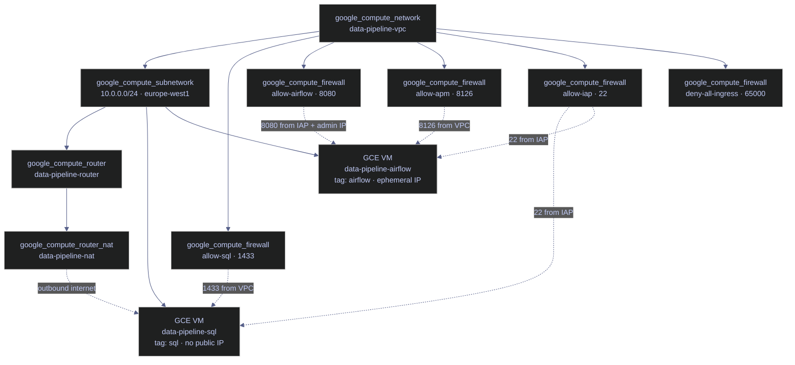

# Terraform Networking — VPC, Subnet, NAT, and Firewall Rules

> [!quote] John Gage on networked computing
>
> "The network is the computer."
>
> — **John Gage**, Sun Microsystems (1984)

This note covers the complete GCP network topology for a production data engineering project defined in `network.tf`. Every resource communicates through this VPC.

## Networking Concepts

**VPC (Virtual Private Cloud)** — an isolated private network within GCP. All resources (VMs, Cloud Run services) communicate through it using private IPs instead of going over the public internet. A VPC is a logical container — it cannot hold resources directly; you need at least one subnet.

**Subnet** — a contiguous block of IP addresses within a VPC, scoped to a single region. VMs get their private IPs from the subnet's range. You can have multiple subnets in different regions within the same VPC (e.g., `10.0.0.0/24` in `europe-west1` and `10.0.1.0/24` in `us-central1`).

**NAT (Network Address Translation)** — allows resources with only private IPs to make **outbound** requests to the internet by routing traffic through a shared public IP managed by GCP. Incoming traffic from the internet is still blocked — NAT only handles outbound. All VMs in the VPC share the same NAT gateway. Used when VMs need to download packages (`apt-get`), pull Docker images, or call Google APIs.

**IAP (Identity-Aware Proxy)** — Google's managed tunnel service. IAP authenticates you with your Google identity, then forwards traffic to your VM from the `35.235.240.0/20` range. Your actual IP never reaches the VM — Google's IAP service acts as a proxy. This is how `gcloud compute ssh` works without exposing SSH to the internet. IAP is a separate path from NAT — it does not use or depend on NAT.

### Ingress vs Egress

GCP firewall rules operate on two traffic directions, each with a different default posture.

| Direction | What it means | Default in GCP |
|-----------|---------------|----------------|
| **Ingress** | Traffic coming **into** a VM from outside | **Denied** (must explicitly allow) |
| **Egress** | Traffic going **out** from a VM to the internet | **Allowed** (all outbound permitted) |

Egress happens when a VM initiates an outbound connection: `apt-get update`, pulling Docker images, calling Cloud Run APIs, reaching Google APIs (Secret Manager, Cloud Logging), DNS lookups, NTP sync. Traffic between VMs on the VPC via private IPs stays **internal** and is not considered egress.

**Firewall Priority** — lower number = higher priority = evaluated first. The deny-all rule at priority 65000 acts as a catch-all fallback. Allow rules at the default priority 1000 are evaluated first and let through specific traffic. If deny-all had a higher priority (lower number) than allow rules, nothing would get through.

### Architecture Overview

The following diagram shows the complete network topology provisioned by this file. All resources live in a single VPC with one subnet in `europe-west1`.



## VPC and Subnet

These two resources form the network foundation. The VPC is the logical container; the subnet defines the actual IP range where VMs receive addresses. Every other resource in this file depends on these two.

> [!info] Assumed variables
>
> The HCL blocks in this file reference variables and resources defined elsewhere in the Terraform project:
> - `var.region` — the GCP region (e.g., `europe-west1`), defined in `variables.tf`
> - `var.admin_ip` — the admin's public IP for direct Airflow UI access, defined in `variables.tf`
> - `google_compute_network.main` — the VPC resource defined in this file (referenced by subnet, router, firewall rules)
> - `google_compute_router.main` — the Cloud Router resource defined in this file (referenced by NAT)

> [!info] Prerequisites
>
> - **API:** `compute.googleapis.com` must be enabled on the GCP project
> - **IAM:** The Terraform service account needs `roles/compute.networkAdmin` (VPC, subnet, router, NAT) and `roles/compute.securityAdmin` (firewall rules)
> - **Provider:** `google` provider — no beta features required for these resources

### google_compute_network

Provisions a **Virtual Private Cloud** — an isolated private network in GCP. All VMs, Cloud Run services, and internal traffic flow through this network. Setting `auto_create_subnetworks = false` creates a **custom mode VPC** where you define subnets explicitly — the production best practice. When `true` (the GCP default if omitted), GCP automatically creates one subnet per region with predetermined IP ranges, which removes control over addressing.

Changing `name` or `auto_create_subnetworks` forces resource replacement (destroy + recreate). The `routing_mode` argument (not shown here — defaults to `REGIONAL`) controls whether Cloud Routers advertise routes only within their region or across all regions in the VPC. Use `GLOBAL` for multi-region VPCs with shared VPN/Interconnect.

*Provision a custom-mode VPC with explicit subnet control.*

```hcl
resource "google_compute_network" "main" {
  name                    = "data-pipeline-vpc"
  auto_create_subnetworks = false
}
```

| Argument | Required | Description |
|---|---|---|
| `name` | Yes | Display name in GCP console. Other resources reference this network by name or ID. Forces replacement if changed. |
| `auto_create_subnetworks` | No | `false` = custom mode (explicit subnets). `true` = auto mode (one subnet per region with GCP-assigned ranges). GCP default: `true`. Forces replacement if changed. |
| `routing_mode` | No | `REGIONAL` (default) or `GLOBAL`. Controls Cloud Router route advertisement scope. Mutable in-place. |
| `description` | No | Free-text description. Forces replacement if changed. |

### google_compute_subnetwork

Provisions a **subnet** — a contiguous block of private IP addresses within the VPC, scoped to a single region. VMs in any zone within the region can use this subnet. The `/24` CIDR block provides 256 addresses (GCP reserves 4), leaving 252 usable — sufficient for the project's 2 VMs plus Cloud Run VPC connectors.

The `network` argument creates an implicit Terraform dependency: the VPC must exist before the subnet. Terraform resolves `.id` to the full resource path at apply time. Changing `name`, `ip_cidr_range`, `region`, or `network` forces replacement.

*Create a /24 subnet in europe-west1 within the VPC.*

```hcl
resource "google_compute_subnetwork" "main" {
  name          = "data-pipeline-subnet"
  ip_cidr_range = "10.0.0.0/24"
  region        = var.region
  network       = google_compute_network.main.id
}
```

| Argument | Required | Description |
|---|---|---|
| `name` | Yes | Subnet identifier. Forces replacement if changed. |
| `ip_cidr_range` | Yes | CIDR notation defining the IP range (e.g., `10.0.0.0/24` = 252 usable addresses). Forces replacement if changed. |
| `region` | Yes | GCP region for this subnet. VMs in any zone within the region can use it. Forces replacement if changed. |
| `network` | Yes | Reference to the parent VPC (`google_compute_network.main.id`). Creates an implicit dependency. Forces replacement if changed. |
| `private_ip_google_access` | No | When `true`, VMs without external IPs can reach Google APIs (Cloud Storage, BigQuery, Secret Manager, Artifact Registry) over Google's internal network without routing through Cloud NAT. GCP default: `false`. |
| `log_config` | No | Enables VPC Flow Logs for the subnet. Sub-arguments: `aggregation_interval` (default `INTERVAL_5_SEC`), `flow_sampling` (float 0–1, default `0.5`), `metadata` (`INCLUDE_ALL_METADATA` or `EXCLUDE_ALL_METADATA`). |

> [!tip] Enable Private Google Access on private subnets
>
> Add `private_ip_google_access = true` to any subnet serving VMs without external IPs. Without it, API calls to Google services (Secret Manager, Cloud Logging, Artifact Registry) must route through Cloud NAT — adding latency and consuming NAT ports. With Private Google Access, this traffic stays on Google's internal backbone and bypasses NAT entirely.

> [!question] VPC Flow Logs — when to enable
>
> VPC Flow Logs capture metadata about every network flow (source/destination IP, port, protocol, bytes) and export to Cloud Logging. Enable them when you need network troubleshooting, compliance audit trails, or traffic analysis. They add cost (Cloud Logging ingestion) — use `flow_sampling < 1.0` in production to reduce volume while maintaining statistical visibility. Set `aggregation_interval = "INTERVAL_10_MIN"` for cost-sensitive environments.

## Cloud Router and NAT

Cloud NAT requires a Cloud Router as its control plane. The router provides dynamic routing capabilities; the NAT gateway handles the actual address translation for outbound traffic. Together they enable VMs with only private IPs to reach the internet without exposing inbound ports.

### google_compute_router

Provisions a **Cloud Router** — a virtual router that provides dynamic routing for the VPC. Required as the control plane for Cloud NAT. Routers are regional and must be in the same region as the subnets they serve. Changing `name`, `region`, or `network` forces replacement.

*Create a Cloud Router in the same region as the subnet.*

```hcl
resource "google_compute_router" "main" {
  name    = "data-pipeline-router"
  region  = var.region
  network = google_compute_network.main.id
}
```

| Argument | Required | Description |
|---|---|---|
| `name` | Yes | Router identifier. Forces replacement if changed. |
| `region` | Yes | Must match the region of the subnet it serves. Forces replacement if changed. |
| `network` | Yes | The VPC this router belongs to. Forces replacement if changed. |

### google_compute_router_nat

Provisions a **Cloud NAT gateway** — allows VMs without public IPs to make outbound connections to the internet. The SQL Server VM has no public IP but needs to download packages during startup bootstrap. NAT is outbound-only — external traffic cannot initiate inbound connections through it.

*Provision a Cloud NAT gateway with automatic IP allocation covering all subnets.*

```hcl
resource "google_compute_router_nat" "main" {
  name                               = "data-pipeline-nat"
  router                             = google_compute_router.main.name
  region                             = var.region
  nat_ip_allocate_option             = "AUTO_ONLY"
  source_subnetwork_ip_ranges_to_nat = "ALL_SUBNETWORKS_ALL_IP_RANGES"
}
```

| Argument | Required | Description |
|---|---|---|
| `name` | Yes | NAT gateway identifier. |
| `router` | Yes | The Cloud Router this NAT attaches to (by name). |
| `region` | Yes | Must match the router's region. |
| `nat_ip_allocate_option` | Yes | `AUTO_ONLY` = GCP allocates external IPs automatically. `MANUAL_ONLY` = you specify static IPs (useful when downstream firewalls need a fixed source IP). |
| `source_subnetwork_ip_ranges_to_nat` | Yes | `ALL_SUBNETWORKS_ALL_IP_RANGES` = every subnet in the VPC uses this NAT. Can be restricted to specific subnets with `LIST_OF_SUBNETWORKS`. |
| `min_ports_per_vm` | No | Minimum NAT ports allocated per VM. GCP default: `64`. Increase for workloads with high concurrent outbound connections. |
| `enable_dynamic_port_allocation` | No | When `true`, Cloud NAT scales port usage automatically between `min_ports_per_vm` and `max_ports_per_vm`. Recommended for bursty workloads. |

> [!info] Why Cloud NAT instead of public IPs
>
> The SQL VM must never be directly reachable from the internet. Cloud NAT provides outbound-only connectivity — external traffic can flow out (for package downloads, API calls) but nothing can initiate a connection in. This is the standard security posture for backend VMs in production.

> [!warning] Cloud NAT port exhaustion under high concurrency
>
> Cloud NAT allocates 64 ports per VM by default. If a pipeline opens many concurrent outbound connections (e.g., hundreds of parallel API calls), you can exhaust the NAT port pool and see `RESOURCE_EXHAUSTED` errors. Increase `min_ports_per_vm` or enable dynamic allocation.

> [!success] Safe pattern — enable dynamic port allocation
>
> Add `enable_dynamic_port_allocation = true` and set `min_ports_per_vm = 256` (or higher) in the `google_compute_router_nat` resource for workloads with bursty outbound concurrency. Dynamic allocation lets Cloud NAT scale port usage automatically, preventing `RESOURCE_EXHAUSTED` errors without permanently reserving a large static port range.

## Firewall Rules

GCP firewalls are **stateful** — if outbound traffic is allowed, the return traffic is automatically allowed. Rules are evaluated by priority (lower number = higher priority). The default posture is to deny all ingress and allow all egress. All rules in this section use `direction = "INGRESS"` (the GCP default when omitted). These VPC-level firewall rules complement any OS-level [firewalls](https://alp78.github.io/elysium/01-Shell/Networking/firewalls) configured inside the VMs themselves.

> [!question] Network tags vs service account targeting
>
> This project uses `target_tags` to scope firewall rules to specific VMs. This is the simpler approach, but network tags have a governance limitation: any principal with `roles/compute.instanceAdmin` can add or remove tags on any VM, potentially gaining network access.
>
> The alternative is `target_service_accounts`, which is IAM-controlled — only principals who can impersonate or assign the service account can affect targeting. The trade-off is that changing a VM's service account requires a VM stop/restart, and only one service account can be assigned per VM.
>
> For new projects, consider migrating to **Network Firewall Policies** with **IAM-governed Secure Tags** (`target_secure_tags`), which combine IAM control with flexibility. Network tags cannot be used in hierarchical or network firewall policies.

### google_compute_firewall | SQL Server Port 1433

Allows TCP traffic on port 1433 (SQL Server) from within the VPC subnet only. Cloud Run services connected via direct VPC egress and the Airflow VM can query the database, but nothing from the public internet can reach this port.

*Allow TCP 1433 from the VPC subnet to VMs tagged `sql`.*

```hcl
resource "google_compute_firewall" "allow_sql" {
  name    = "allow-sql-from-airflow"
  network = google_compute_network.main.name

  allow {
    protocol = "tcp"
    ports    = ["1433"]
  }

  source_ranges = ["10.0.0.0/24"]
  target_tags   = ["sql"]
}
```

| Argument | Required | Description |
|---|---|---|
| `name` | Yes | Rule identifier. Must be unique within the project. Forces replacement if changed. |
| `network` | Yes | The VPC this rule applies to. |
| `allow.protocol` | Yes | `tcp` — SQL Server uses TCP for database connections. |
| `allow.ports` | Yes | `["1433"]` — standard SQL Server listener port. |
| `source_ranges` | Yes | `["10.0.0.0/24"]` — only traffic from within the VPC subnet. |
| `target_tags` | No | `["sql"]` — applies only to VMs with this network tag (assigned in `compute.tf`). Without `target_tags`, the rule applies to all VMs in the VPC. |
| `direction` | No | Defaults to `INGRESS`. Omitted here — shown explicitly in the deny-all rule below. |

### google_compute_firewall | Airflow Web UI Port 8080

Allows TCP traffic on port 8080 (Airflow web UI) from the IAP tunnel range and optionally from the admin's public IP. The `compact(concat(...))` Terraform function chain merges two lists and removes empty strings, producing a dynamic source range that always includes IAP and conditionally includes the admin IP.

*Allow TCP 8080 from the IAP tunnel range and optionally the admin IP to VMs tagged `airflow`.*

```hcl
resource "google_compute_firewall" "allow_airflow_ui" {
  name    = "data-pipeline-allow-airflow"
  network = google_compute_network.main.name

  allow {
    protocol = "tcp"
    ports    = ["8080"]
  }

  source_ranges = compact(concat(
    ["35.235.240.0/20"],
    var.admin_ip != "" ? ["${var.admin_ip}/32"] : []
  ))
  target_tags   = ["airflow"]
}
```

| Argument | Required | Description |
|---|---|---|
| `name` | Yes | Rule identifier. Forces replacement if changed. |
| `network` | Yes | The VPC this rule applies to. |
| `allow.protocol` | Yes | `tcp` — HTTP traffic for the Airflow web UI. |
| `allow.ports` | Yes | `["8080"]` — Airflow webserver default port. |
| `source_ranges` | Yes | Dynamic list: always `35.235.240.0/20` (IAP tunnel CIDR), optionally `${var.admin_ip}/32` (admin's home/office IP — `/32` = exactly one address). |
| `target_tags` | No | `["airflow"]` — applies only to the Airflow VM. |

### google_compute_firewall | Datadog APM Port 8126

Allows TCP traffic on port 8126 (Datadog APM trace intake) from within the VPC subnet. Cloud Run pipeline jobs connected to the VPC send APM traces to the Datadog Agent running on the Airflow VM.

*Allow TCP 8126 from the VPC subnet to VMs tagged `airflow` for Datadog APM trace intake.*

```hcl
resource "google_compute_firewall" "allow_apm" {
  name    = "data-pipeline-allow-apm"
  network = google_compute_network.main.name

  allow {
    protocol = "tcp"
    ports    = ["8126"]
  }

  source_ranges = ["10.0.0.0/24"]
  target_tags   = ["airflow"]
}
```

| Argument | Required | Description |
|---|---|---|
| `name` | Yes | Rule identifier. Forces replacement if changed. |
| `network` | Yes | The VPC this rule applies to. |
| `allow.protocol` | Yes | `tcp` — APM trace protocol. |
| `allow.ports` | Yes | `["8126"]` — Datadog APM default intake port. |
| `source_ranges` | Yes | `["10.0.0.0/24"]` — only internal VPC traffic. |
| `target_tags` | No | `["airflow"]` — the Datadog Agent runs on the Airflow VM. |

### google_compute_firewall | SSH via IAP Tunnel Port 22

Allows TCP traffic on port 22 (SSH) from the IAP tunnel range only. SSH is not open to the internet — the only way to reach either VM is through `gcloud compute ssh`, which authenticates via Google identity and routes through IAP. See [IAP tunneling](https://alp78.github.io/elysium/01-Shell/Networking/iap-tunneling) for the full connection workflow and troubleshooting.

*Allow TCP 22 from the IAP tunnel range to VMs tagged `airflow` and `sql`.*

```hcl
resource "google_compute_firewall" "allow_iap" {
  name    = "data-pipeline-allow-iap"
  network = google_compute_network.main.name

  allow {
    protocol = "tcp"
    ports    = ["22"]
  }

  source_ranges = ["35.235.240.0/20"]
  target_tags   = ["airflow", "sql"]
}
```

| Argument | Required | Description |
|---|---|---|
| `name` | Yes | Rule identifier. Forces replacement if changed. |
| `network` | Yes | The VPC this rule applies to. |
| `allow.protocol` | Yes | `tcp` — SSH protocol. |
| `allow.ports` | Yes | `["22"]` — standard SSH port. |
| `source_ranges` | Yes | `["35.235.240.0/20"]` — Google's IAP tunnel CIDR only. |
| `target_tags` | No | `["airflow", "sql"]` — both VMs accept SSH through IAP. |

### google_compute_firewall | Deny All Ingress

A **belt-and-suspenders** catch-all that blocks all ingress traffic not explicitly allowed by higher-priority rules. GCP already has an implicit deny at priority 65534, but this explicit rule at 65000 provides defense-in-depth and visibility in `gcloud compute firewall-rules list` output.

*Block all ingress traffic not matched by a higher-priority allow rule at priority 65000.*

```hcl
resource "google_compute_firewall" "deny_all_ingress" {
  name     = "data-pipeline-deny-all-ingress"
  network  = google_compute_network.main.name
  priority = 65000

  deny {
    protocol = "all"
  }

  source_ranges = ["0.0.0.0/0"]
}
```

| Argument | Required | Description |
|---|---|---|
| `name` | Yes | Rule identifier. Forces replacement if changed. |
| `network` | Yes | The VPC this rule applies to. |
| `priority` | No | `65000` — lower than allow rules (default `1000`) but higher than GCP's implicit deny (`65534`). Explicit deny provides audit visibility. |
| `deny.protocol` | Yes | `all` — TCP, UDP, ICMP, and all other protocols. |
| `source_ranges` | Yes | `["0.0.0.0/0"]` — all IPv4 addresses (the entire internet). |
| `log_config` | No | Not set here. Add `log_config { metadata = "INCLUDE_ALL_METADATA" }` to any rule where you need audit logging of matched packets. Firewall logs export to Cloud Logging. |

> [!info] Firewall evaluation order
>
> GCP evaluates all rules in priority order. The `allow_sql` rule (priority 1000, the default) takes precedence over `deny_all_ingress` (priority 65000). If a packet matches an allow rule first, it's admitted. If no allow rule matches, this deny catches it.

> [!danger] Overly broad source ranges on allow rules
>
> Setting `source_ranges = ["0.0.0.0/0"]` on any **allow** rule exposes that port to the entire internet. This is the most common cause of database breaches in cloud environments. Always restrict source ranges to known CIDR blocks (VPC subnet, IAP range, office IP). If you need temporary access, use IAP tunneling instead of opening ports.

> [!success] Safe pattern — restrict source ranges
>
> Always scope `source_ranges` to the narrowest possible CIDR. For database ports, use only the VPC subnet (`10.0.0.0/24`). For SSH, use only the IAP range (`35.235.240.0/20`). For admin UI access, use a specific office or home IP with a `/32` mask. Never set `0.0.0.0/0` on any allow rule.

> [!danger] Force-replacement triggers on firewall rules
>
> Changing `name` or `network` on a `google_compute_firewall` resource forces Terraform to destroy the existing rule and create a new one. During the gap between destroy and create, traffic that was previously allowed will be **blocked** by the deny-all rule. For production VPCs, use `lifecycle { create_before_destroy = true }` to ensure the new rule exists before the old one is removed.

> [!success] Safe pattern — create before destroy on firewall rules
>
> Add a `lifecycle` block to firewall rules that protect critical traffic paths:
> ```hcl
> lifecycle {
>   create_before_destroy = true
> }
> ```
> This ensures the replacement rule is active before Terraform removes the old one, eliminating the traffic-blocking gap during applies.

### Lifecycle Meta-Arguments

Terraform lifecycle meta-arguments control how resources are created, updated, and destroyed. The most relevant for networking resources:

| Meta-Argument | Use Case |
|---|---|
| `prevent_destroy = true` | Protect production VPC and subnet from accidental `terraform destroy`. Terraform will error if a plan includes destroying a resource with this set. |
| `create_before_destroy = true` | Ensure replacement firewall rules are active before old rules are removed — prevents traffic gaps during `terraform apply`. |
| `ignore_changes = [...]` | Ignore changes to arguments modified outside Terraform (e.g., firewall rules managed by a separate team or automation). |

## Verification Commands

Run these `gcloud` commands after `terraform apply` to verify that the networking resources were created correctly.

### Verify VPC and Subnets

List all VPCs filtered by the project network name.

*Verify that the VPC was created with the expected name.*

```bash
gcloud compute networks list --filter="name=data-pipeline-vpc"
```

List subnets associated with the VPC to confirm the CIDR range and region.

*Verify the subnet CIDR range and region assignment.*

```bash
gcloud compute networks subnets list --filter="network:data-pipeline-vpc"
```

### Verify Firewall Rules

List all firewall rules on the VPC with their direction, priority, and allowed ports.

*Verify all firewall rules are present with correct priorities and source ranges.*

```bash
gcloud compute firewall-rules list --filter="network:data-pipeline-vpc" --format="table(name, direction, priority, sourceRanges, allowed)"
```

Describe a specific rule to inspect all fields including target tags and log configuration.

*Verify target tags and log configuration on the SQL allow rule.*

```bash
gcloud compute firewall-rules describe allow-sql-from-airflow
```

### Verify NAT Gateway

List NAT gateways attached to the Cloud Router to confirm allocation mode and subnet coverage.

*Verify the NAT gateway allocation mode and subnet coverage configuration.*

```bash
gcloud compute routers nats list --router=data-pipeline-router --region=europe-west1
```

## Related

**Terraform configuration:**
- [compute](https://alp78.github.io/elysium/07-Terraform/GCP-Resources/compute) — the VMs that attach to this network
- [cloud-run](https://alp78.github.io/elysium/07-Terraform/GCP-Resources/cloud-run) — Cloud Run direct VPC egress using this subnet
- [iam-and-secrets](https://alp78.github.io/elysium/07-Terraform/GCP-Resources/iam-and-secrets) — service accounts and secrets used by the VMs
- [conditional-resources](https://alp78.github.io/elysium/07-Terraform/Patterns/conditional-resources) — the conditional `admin_ip` firewall rule pattern
- [foundation-and-networking](https://alp78.github.io/elysium/07-Terraform/Block-Library/foundation-and-networking) — Block Library quick-reference for networking resources
- [variables-and-outputs](https://alp78.github.io/elysium/07-Terraform/Fundamentals/variables-and-outputs) — `var.region` and `var.admin_ip` definitions

**GCP services:**
- [vpc-service-controls](https://alp78.github.io/elysium/06-GCP/Security/vpc-service-controls) — VPC Service Controls for additional perimeter security
- [service-accounts-and-iam](https://alp78.github.io/elysium/06-GCP/Security/service-accounts-and-iam) — IAM roles required by the Terraform service account
- [iap-tunneling](https://alp78.github.io/elysium/01-Shell/Networking/iap-tunneling) — IAP connection workflow and troubleshooting
- [firewalls](https://alp78.github.io/elysium/01-Shell/Networking/firewalls) — OS-level firewall configuration inside VMs

**CI/CD integration:**
- [github-actions-ci-cd](https://alp78.github.io/elysium/10-GitHub-Actions/github-actions-ci-cd) — automated `terraform plan` and `apply` in GitHub Actions

## References

- [google_compute_network — Terraform Registry](https://registry.terraform.io/providers/hashicorp/google/latest/docs/resources/compute_network)
- [google_compute_subnetwork — Terraform Registry](https://registry.terraform.io/providers/hashicorp/google/latest/docs/resources/compute_subnetwork)
- [google_compute_firewall — Terraform Registry](https://registry.terraform.io/providers/hashicorp/google/latest/docs/resources/compute_firewall)
- [google_compute_router_nat — Terraform Registry](https://registry.terraform.io/providers/hashicorp/google/latest/docs/resources/compute_router_nat)
- [Cloud NAT Overview — GCP Docs](https://cloud.google.com/nat/docs/overview)
- [Private Google Access — GCP Docs](https://cloud.google.com/vpc/docs/private-google-access)
- [IAP TCP Forwarding — GCP Docs](https://cloud.google.com/iap/docs/using-tcp-forwarding)
- [VPC Flow Logs — GCP Docs](https://cloud.google.com/vpc/docs/flow-logs)
