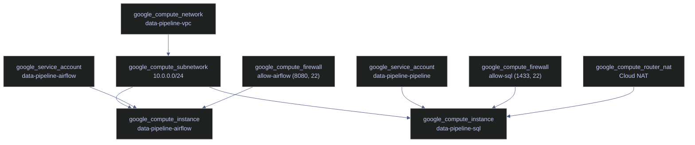

# Compute

> [!quote]+
>
> "Cloud providers have tricked us into believing that we're all too dumb to operate our own infrastructure, at any scale."
>
> — **Mitchell Hashimoto**, HashiConf talk

> [!abstract]- Summary
>
> Compute is the Terraform note for the chapter's two GCE workloads: an Airflow orchestration VM and a SQL Server VM, each with different OS, disk, exposure, and lifecycle requirements, plus the verification and import steps needed once those instances already exist in or outside Terraform state.
>
> **Instance architecture**
> - covers the shared subnet context, the contrasting roles of the Airflow and SQL VMs, and the assumptions around variables, service accounts, and network resources used by both instances
>
> **Airflow VM design**
> - covers `google_compute_instance` for the Airflow host, Container-Optimized OS, startup-script behavior, ephemeral public IPs, shielded-instance settings, and replacement or downtime triggers
>
> **SQL VM design**
> - covers the database VM, Ubuntu-based package installation, private-only networking, lifecycle protection, secret-handling boundaries, and stateful-disk considerations
>
> **Operations and safety**
> - Warnings: several instance arguments force replacement, in-place updates can still create downtime, stateful VMs need `prevent_destroy`, and credentials passed through instance metadata are unsafe
> - Recommendations: choose COS only for container-native workloads, keep the SQL VM private, route secrets through Secret Manager instead of metadata, protect long-lived instances with lifecycle rules, and use import blocks or post-apply verification commands to reconcile Terraform with existing compute state

> [!note]- Glossary
>
> **`google_compute_instance`**
> - The Terraform resource used to provision and manage a Compute Engine virtual machine instance.
> - It matters because both workloads in this note are modeled through the same resource type even though their operating-system and lifecycle needs are very different.
>
> > [!warning] Same resource, different risk profile
> >
> > Two instances can share the same Terraform resource type while carrying very different operational consequences. A disposable orchestrator VM and a stateful database VM should not be treated as equally replaceable.
>
> ---
>
> **Container-Optimized OS**
> - Google's minimal hardened VM image designed primarily to run container workloads rather than full package-managed server setups.
> - It matters because the Airflow VM uses COS to run Docker-based services with a smaller operational footprint.
>
> > [!warning] COS is not a general-purpose Linux box
> >
> > There is no normal `apt`-driven package-management workflow on COS. If your workload depends on installing arbitrary system packages, a standard Linux distribution is usually the better fit.
>
> ---
>
> **Ubuntu LTS**
> - A long-term-support Ubuntu image used when a VM needs full package management and a conventional Linux environment.
> - It matters because the SQL Server VM requires a host OS that supports package installation and traditional system configuration.
>
> > [!info] Better for package-installed workloads
> >
> > Ubuntu trades a larger surface area for flexibility. That is often the right trade when the workload is not fully containerized or depends on vendor packages.
>
> ---
>
> **Startup script**
> - Metadata-driven shell logic that runs when a VM boots to configure software or system state automatically.
> - It matters because both VMs rely on startup automation to become usable immediately after Terraform provisions them.
>
> > [!warning] Boot-time automation can fail invisibly
> >
> > A successful Terraform apply does not guarantee a successful startup script. Post-provision verification is necessary because bootstrapping happens after the instance resource itself is created.
>
> ---
>
> **Ephemeral public IP**
> - A temporary external IP assigned to a VM instance that can change when the instance is recreated or its network interface is rebuilt.
> - It matters because the Airflow VM uses a public address pattern that is convenient for access but less stable than a fixed reserved IP.
>
> > [!warning] Ephemeral means non-contractual
> >
> > If automation, firewall allowlists, or user bookmarks depend on a stable address, an ephemeral IP is the wrong assumption. Instance replacement can silently change it.
>
> ---
>
> **Static private IP**
> - A fixed internal address assigned within the VPC subnet rather than an internet-routable public address.
> - It matters because the SQL VM is designed to stay reachable only inside the private network and from approved internal or tunneled paths.
>
> > [!info] Private-only reduces exposure
> >
> > Keeping the database off the public internet narrows the attack surface considerably. It also means the rest of the environment must provide the right private connectivity and admin-access paths.
>
> ---
>
> **Shielded VM**
> - A Compute Engine feature set that adds integrity-focused protections such as secure boot and measured boot verification.
> - It matters because production-grade VM definitions often include shielded-instance configuration as part of a hardened baseline.
>
> > [!info] Hardening starts below the workload
> >
> > Application security alone is not enough for infrastructure notes like this one. Shielded configuration is part of the VM platform posture Terraform should express explicitly.
>
> ---
>
> **OS Login**
> - Google's IAM-integrated SSH access model for Compute Engine, replacing broad use of static SSH keys in project or instance metadata.
> - It matters because the safer administrative pattern for Terraform-managed VMs is identity-based access rather than long-lived unmanaged keys.
>
> > [!warning] Metadata-based SSH scales poorly
> >
> > Static key injection through metadata is easy to start with but harder to audit and rotate cleanly. Identity-backed access is usually the stronger production pattern.
>
> ---
>
> **Service account attachment**
> - The act of binding a GCP service account identity to a VM so the workload can call Google APIs under that identity.
> - It matters because both the Airflow and SQL hosts rely on attached service accounts for access to other GCP services.
>
> > [!warning] Identity scope becomes runtime capability
> >
> > A VM service account is not passive metadata. Any excessive permissions granted to it become directly usable from the workload running on that machine.
>
> ---
>
> **`prevent_destroy`**
> - A Terraform lifecycle setting that blocks planned destruction of a resource while the block remains in configuration.
> - It matters because stateful instances, especially database hosts, should not be easy to destroy accidentally.
>
> > [!warning] Protection should match data gravity
> >
> > The more state a VM accumulates, the higher the value of lifecycle protection. Stateless and stateful compute should not inherit the same destroy posture by default.
>
> ---
>
> **Instance metadata**
> - Key-value metadata attached to a Compute Engine VM, often used for startup scripts, configuration, or runtime hints.
> - It matters because Terraform can inject configuration through metadata, but using it for secrets creates an avoidable exposure path.
>
> > [!danger] Metadata is a poor secret store
> >
> > Values in instance metadata are much easier to expose operationally than secrets kept in Secret Manager. Sensitive material should not hitch a ride in bootstrapping metadata just because it is convenient.
>
> ---
>
> **Import block**
> - A declarative Terraform language feature for adopting an existing resource into state without relying solely on an interactive CLI import command.
> - It matters because existing VM instances often need to be brought under Terraform management after the fact.
>
> > [!info] Better for repeatable adoption
> >
> > Import blocks make VM adoption reviewable and reproducible, which is especially useful when infrastructure already exists before Terraform takes over.

> [!info] Assumed variables
>
> All code cells in this note reference variables and resources defined elsewhere in the Terraform configuration:
> - `var.zone` — the GCP zone (e.g., `europe-west1-b`)
> - `var.db_password` — the SQL Server SA password (marked `sensitive` in variables)
> - `var.dd_api_key` — the Datadog API key (marked `sensitive` in variables)
> - `google_compute_subnetwork.main` — the VPC subnet resource from [networking](https://alp78.github.io/elysium/07-Terraform/GCP-Resources/networking)
> - `google_service_account.airflow` / `google_service_account.pipeline` — service account resources from [iam-and-secrets](https://alp78.github.io/elysium/07-Terraform/GCP-Resources/iam-and-secrets)

## Architecture Context

Two GCE instances share the same subnet (`10.0.0.0/24`) but differ significantly in their OS, disk, public IP assignment, and purpose. For the full [vm-lifecycle](https://alp78.github.io/elysium/06-GCP/Compute/vm-lifecycle) of these instances -- starting, stopping, resizing, and live migration -- see the GCP Compute Engine notes.

| Aspect | Airflow VM | SQL VM |
|--------|-----------|--------|
| **Name** | `data-pipeline-airflow` | `data-pipeline-sql` |
| **OS** | Container-Optimized OS (COS) | Ubuntu 22.04 LTS |
| **Machine type** | `e2-medium` (2 vCPU, 4 GB RAM) | `e2-medium` (2 vCPU, 4 GB RAM) |
| **Disk type** | `pd-balanced`, 20 GB | `pd-ssd`, 30 GB |
| **Public IP** | Yes (ephemeral) | **No** |
| **Service account** | `data-pipeline-airflow` | `data-pipeline-pipeline` |
| **Network tags** | `["airflow"]` | `["sql"]` |
| **Workload** | 4-5 Docker containers (Airflow + PostgreSQL + Datadog) | SQL Server 2022 (native install) |



> [!question] Container-Optimized OS vs Ubuntu
>
> Both VMs use `google_compute_instance` but with fundamentally different OS images. Choose based on workload type:
> - **Container-Optimized OS (COS):** Minimal, hardened, auto-updating. No package manager — workloads must be containerized. Ideal for Docker-based services like Airflow.
> - **Ubuntu LTS:** Full-featured with `apt`. Required when software must be installed as system packages (e.g., SQL Server, which does not support COS).

## google_compute_instance | Airflow Orchestrator VM

The Airflow orchestrator VM. Runs 4-5 Docker containers: webserver, scheduler, triggerer, PostgreSQL, and optionally the Datadog Agent. This is a zonal resource requiring the Compute Engine API (`compute.googleapis.com`) to be enabled. The Terraform service account needs the `roles/compute.instanceAdmin.v1` role to create and manage instances.

*Declare the Airflow orchestrator VM with E2 shared-core sizing.*

```hcl
resource "google_compute_instance" "airflow" {
  name         = "data-pipeline-airflow"
  machine_type = "e2-medium"
  zone         = var.zone
  tags         = ["airflow"]
}
```

| Argument | Required | Description |
|---|---|---|
| `name` | Yes | VM instance name. Used in `gcloud compute ssh data-pipeline-airflow`. Changing this forces a new resource. |
| `machine_type` | Yes | **E2 series** — cost-optimized, shared-core. `e2-medium` = 2 vCPUs, 4 GB RAM (~$25/month). The E2 series uses dynamic resource scaling — your VM can burst above baseline when other VMs on the host are idle. Can be changed in-place if `allow_stopping_for_update = true`. |
| `zone` | Yes | `europe-west1-b`. VMs are zonal (tied to a specific datacenter), unlike Cloud Run which is regional. **Changing this forces a new resource.** |
| `tags` | No | **Network tags** — firewall rules target VMs by tag, not by name. This VM matches rules with `target_tags = ["airflow"]` (ports 8080, 8126, 22). |

> [!danger] Force-replacement triggers
>
> Changing any of these arguments destroys the VM and creates a new one. Data on the boot disk is lost:
> - `name` — the instance identity
> - `zone` — VMs cannot be moved between zones
> - `boot_disk.initialize_params.image` — changing the OS image
> - `boot_disk.initialize_params.size` — shrinking the disk (increasing is in-place)

> [!success] Safe approach
>
> For in-place updates (machine type, metadata, tags, labels), set `allow_stopping_for_update = true`. For disk changes, use a separate `google_compute_attached_disk` resource instead of resizing the boot disk. Always run `terraform plan` before `terraform apply` to check for `# forces replacement` in the output.

### Boot Disk — Container-Optimized OS

The boot disk configuration specifies the OS image, disk size, and [disk type](https://alp78.github.io/elysium/06-GCP/Compute/disks-and-snapshots). Changing the image forces a new resource; increasing size is an in-place update.

*Configure Container-Optimized OS on a 20 GB balanced persistent disk.*

```hcl
boot_disk {
  initialize_params {
    image = "projects/cos-cloud/global/images/family/cos-stable"
    size  = 20
    type  = "pd-balanced"
  }
}
```

| Argument | Required | Description |
|---|---|---|
| `image` | Yes | **Container-Optimized OS (COS)** — a minimal, hardened Linux distribution by Google designed to run Docker containers. No package manager, no SSH server by default — just Docker and a minimal kernel. Automatic security updates. |
| `size` | No | Disk size in GB (default: 10). Holds the OS, Docker images, Airflow logs, and PostgreSQL metadata database. |
| `type` | No | **Persistent Disk type** (default: `pd-standard`). `pd-balanced` offers a middle ground between `pd-standard` (HDD, cheapest) and `pd-ssd` (fastest). Airflow's workload is mostly network I/O — disk speed is not critical. |

### Network Interface — With Public IP

The network interface places the VM in a VPC subnet and optionally assigns a public IP. An empty `access_config` block requests an ephemeral public IP for SSH and Airflow UI access.

*Place the VM in the VPC subnet with an ephemeral public IP.*

```hcl
network_interface {
  subnetwork = google_compute_subnetwork.main.id

  access_config {}
}
```

| Argument | Required | Description |
|---|---|---|
| `subnetwork` | Yes | Places the VM in the `data-pipeline-subnet` (10.0.0.0/24). It receives a private IP like `10.0.0.2`. |
| `access_config {}` | No | An empty block requests an **ephemeral public IP**. This IP changes on VM restart. Needed for direct browser access to the Airflow UI and for SSH. If this block is omitted entirely (as in the SQL VM), the VM has no public IP. |

> [!info] Ephemeral vs static IP
>
> An ephemeral IP changes every time the VM is stopped and started. If external clients or DNS records depend on a stable address, reserve a static IP with `google_compute_address` and assign it via `access_config { nat_ip = google_compute_address.airflow.address }`. Static IPs incur charges when not attached to a running VM.

### Service Account

The [service account](https://alp78.github.io/elysium/06-GCP/Security/service-accounts-and-iam) attached to this VM determines its GCP API identity. All API calls from the VM (e.g., triggering Cloud Run jobs, reading GCS buckets) use this identity.

*Attach the Airflow service account with full API scope (IAM controls actual access).*

```hcl
service_account {
  email  = google_service_account.airflow.email
  scopes = ["cloud-platform"]
}
```

| Argument | Required | Description |
|---|---|---|
| `email` | Yes | The GCP service account this VM runs as. References the `google_service_account.airflow` resource defined in [iam-and-secrets](https://alp78.github.io/elysium/07-Terraform/GCP-Resources/iam-and-secrets). |
| `scopes` | Yes | **OAuth scopes** — a legacy access control layer. `cloud-platform` is the broadest scope (all GCP APIs). Actual permissions are controlled by IAM roles on the service account, not scopes. Setting `cloud-platform` here is standard practice — it means "let IAM decide." |

### Metadata — Startup Script and OS Login

GCE instance metadata is a key-value store accessible from within the VM at `http://metadata.google.internal`. Terraform writes these values at create time and updates them in-place on changes.

*Pass the startup script and enable OS Login via instance metadata.*

```hcl
metadata = {
  startup-script = replace(file("${path.module}/scripts/airflow-startup.sh"), "\r\n", "\n")
  enable-oslogin = "TRUE"
}
```

| Argument | Required | Description |
|---|---|---|
| `startup-script` | No | GCE runs this script as root on every boot. `file()` reads the file at plan time. `replace(..., "\r\n", "\n")` converts Windows line endings (CRLF) to Unix (LF) — critical because bash scripts fail with `\r` in them. `${path.module}` is the directory containing the `.tf` file (`infra/`). |
| `enable-oslogin` | No | **[OS Login](https://cloud.google.com/compute/docs/oslogin)** — uses GCP IAM to manage SSH access instead of project-wide SSH keys. Users authenticate with `gcloud compute ssh` using their GCP identity. More secure than static SSH keys. |

### Airflow Startup Script Execution Flow

The startup script (`airflow-startup.sh`) runs on every boot and is idempotent — it skips containers that are already running. The script progresses through these stages:

1. **Kill stale containers** — removes leftover containers from previous boot (handles reboot/reset)
2. **Create directories** — `/home/airflow/dags`, `/logs`, `/pgdata` with correct ownership (UID 50000 for Airflow, UID 999 for PostgreSQL)
3. **Pull images** — `apache/airflow:2.10.5-python3.12` and `postgres:16-alpine`
4. **Create Docker network** — `airflow-net` for inter-container communication
5. **Start Datadog Agent** (conditional) — reads API key from instance metadata; skips if empty
6. **Start PostgreSQL** — metadata storage for Airflow (DAG runs, task states, connections)
7. **Wait for PostgreSQL** — polls `pg_isready` for up to 60 seconds
8. **Run DB migration** — `airflow db migrate` (idempotent schema updates) + create admin user
9. **Start webserver** — port 8080, serves the Airflow UI
10. **Start scheduler** — picks up DAGs, creates task instances, assigns them to executors
11. **Start triggerer** — handles deferred tasks (async operators like `CloudRunExecuteJobOperator`)

#### Startup Configuration Details

| Aspect | Value | Why |
|--------|-------|-----|
| `--restart unless-stopped` | Docker restart policy | Containers restart automatically if they crash, but not after `docker stop`. Survives OOM kills and transient failures. |
| `AIRFLOW__CORE__EXECUTOR=LocalExecutor` | Executor type | Runs tasks as subprocesses on the same machine. CeleryExecutor would require Redis/RabbitMQ — overkill for this workload. |
| `AIRFLOW__CORE__DEFAULT_TIMEZONE=Europe/Paris` | Timezone | DAG schedules are defined in UTC but the UI displays in CET/CEST. |
| Datadog labels (`com.datadoghq.ad.*`) | Autodiscovery annotations | The Datadog Agent reads these Docker labels to auto-configure log collection and integrations without a config file. |

### Shielded Instance Config

[Shielded VM](https://cloud.google.com/compute/shielded-vm/docs/shielded-vm) features harden the boot process against tampering. All three options are enabled — this is recommended for production workloads.

*Enable all three Shielded VM security features.*

```hcl
shielded_instance_config {
  enable_secure_boot          = true
  enable_vtpm                 = true
  enable_integrity_monitoring = true
}
```

| Argument | Required | Description |
|---|---|---|
| `enable_secure_boot` | No | **Secure Boot** — verifies that all boot software is signed by a trusted authority. Prevents boot-level rootkits. Default: `false`. |
| `enable_vtpm` | No | **Virtual Trusted Platform Module** — a virtualized hardware chip that stores encryption keys and validates the boot chain. Required for integrity monitoring. Default: `true`. |
| `enable_integrity_monitoring` | No | **Integrity Monitoring** — compares the boot sequence against a known-good baseline. Alerts in Cloud Monitoring if the boot process is tampered with. Default: `true`. |

### Allow Stopping for Update

Certain in-place updates require the VM to be stopped before Terraform can apply the change. Without this argument, Terraform errors out instead of stopping the VM.

*Allow Terraform to stop the VM for in-place updates like machine type changes.*

```hcl
allow_stopping_for_update = true
```

Changes that require a VM stop include: `machine_type`, `min_cpu_platform`, `service_account`, `enable_display`, and some `scheduling` options. During the stop-start cycle, the VM is unavailable — plan maintenance windows accordingly.

> [!warning] Downtime during apply
>
> With `allow_stopping_for_update = true`, a `terraform apply` that changes `machine_type` will stop the VM, apply the change, and restart it. This causes **downtime** for any services running on the VM (Airflow UI, scheduled DAGs).

> [!success] Safe approach
>
> Schedule `machine_type` changes during maintenance windows. For zero-downtime upgrades, consider using a [managed instance group](https://cloud.google.com/compute/docs/instance-groups) with rolling updates instead of standalone instances.

### Lifecycle Meta-Arguments

Lifecycle meta-arguments control how Terraform handles resource changes. These are critical for stateful compute instances.

*Protect against accidental destruction and ignore externally managed metadata changes.*

```hcl
lifecycle {
  prevent_destroy = true
  ignore_changes  = [metadata["startup-script"]]
}
```

| Argument | Description |
|---|---|
| `prevent_destroy` | Terraform refuses to destroy this resource. Protects against accidental `terraform destroy` or removal from config. Essential for VMs with stateful workloads (databases, persistent data on boot disk). |
| `ignore_changes` | Terraform ignores changes to the listed attributes. Useful when metadata is modified outside Terraform (e.g., GCE agent updates, manual SSH key additions). |
| `create_before_destroy` | Creates the replacement resource before destroying the old one. Reduces downtime but requires that two instances can coexist briefly (unique names, no port conflicts). |
| `replace_triggered_by` | Forces replacement when a referenced resource or attribute changes. Useful for rotating VMs when a startup script or service account changes. |

## google_compute_instance | SQL Server Database VM

The SQL Server database VM. Runs SQL Server 2022 Developer Edition directly on Ubuntu (not in Docker). This is a stateful instance — the boot disk holds database files, transaction logs, and TempDB. For the post-provisioning database configuration (memory limits, TempDB, backup schedules), see [server-configuration](https://alp78.github.io/elysium/04-SQL-Server/01-Server-Operations/server-configuration).

*Declare the SQL Server database VM with no public IP.*

```hcl
resource "google_compute_instance" "sql" {
  name         = "data-pipeline-sql"
  machine_type = "e2-medium"
  zone         = var.zone
  tags         = ["sql"]
}
```

| Argument | Required | Description |
|---|---|---|
| `name` | Yes | VM instance name. Changing this forces a new resource. |
| `machine_type` | Yes | `e2-medium` — same sizing as the Airflow VM. Can be upgraded in-place with `allow_stopping_for_update = true`. |
| `zone` | Yes | Must match the Airflow VM's zone for low-latency private network communication. Changing forces a new resource. |
| `tags` | No | Matches firewall rules for port 1433 (SQL) and port 22 (SSH via IAP). |

> [!warning] Stateful VM without `prevent_destroy`
>
> This VM stores SQL Server database files directly on the boot disk. An accidental `terraform destroy` or removal from config deletes the VM **and all data**. There is no automatic backup unless configured at the SQL Server level.

> [!success] Add lifecycle protection
>
> Add `lifecycle { prevent_destroy = true }` to the resource block. For additional safety, create scheduled [disk snapshots](https://alp78.github.io/elysium/06-GCP/Compute/disks-and-snapshots) as a backup mechanism.

### Boot Disk — Ubuntu with SSD

The SQL VM uses a full Ubuntu image with an SSD [persistent disk](https://alp78.github.io/elysium/06-GCP/Compute/disks-and-snapshots) for database I/O performance.

*Configure Ubuntu 22.04 LTS on a 30 GB SSD persistent disk for database I/O.*

```hcl
boot_disk {
  initialize_params {
    image = "projects/ubuntu-os-cloud/global/images/family/ubuntu-2204-lts"
    size  = 30
    type  = "pd-ssd"
  }
}
```

| Argument | Required | Description |
|---|---|---|
| `image` | Yes | Full Ubuntu with `apt` — needed because SQL Server is installed as a system package, not a Docker container. |
| `size` | No | Larger disk (30 GB) for database files. SQL Server data, logs, and TempDB live here. Default: 10 GB. |
| `type` | No | **SSD persistent disk** — faster IOPS than `pd-balanced`. Database workloads benefit from low-latency random reads/writes. Default: `pd-standard`. |

### Network Interface — No Public IP

No `access_config` block means **no public IP at all**. The SQL VM is only reachable from within the VPC (port 1433 for queries, port 22 via [IAP tunnel](https://alp78.github.io/elysium/01-Shell/Networking/iap-tunneling) for SSH). Outbound internet access is provided by [Cloud NAT](https://alp78.github.io/elysium/07-Terraform/GCP-Resources/networking#resource-cloud-nat) for package installation.

*Place the VM in the VPC subnet with no public IP — reachable only via private IP and IAP.*

```hcl
network_interface {
  subnetwork = google_compute_subnetwork.main.id
}
```

| Argument | Required | Description |
|---|---|---|
| `subnetwork` | Yes | Places the VM in the same subnet as the Airflow VM. The SQL VM receives a private IP (e.g., `10.0.0.3`) reachable by Airflow and Cloud Run services within the VPC. |

### Metadata — Startup Script with Credentials

The SQL VM passes sensitive values (database password, monitoring API key) through instance metadata. The startup script reads these at boot via `curl` to the metadata server.

*Pass the startup script, database password, and API key via instance metadata.*

```hcl
metadata = {
  startup-script = replace(file("${path.module}/scripts/sql-startup.sh"), "\r\n", "\n")
  sa-password    = var.db_password
  dd-api-key     = var.dd_api_key
  enable-oslogin = "TRUE"
}
```

| Argument | Required | Description |
|---|---|---|
| `startup-script` | No | Same pattern as the Airflow VM — `file()` reads the script at plan time, `replace()` normalizes line endings. |
| `sa-password` | No | The SA password is passed to the VM via **instance metadata** — accessible from within the VM at `http://metadata.google.internal/computeMetadata/v1/instance/attributes/sa-password`. The startup script reads it with `curl` to configure SQL Server. |
| `dd-api-key` | No | The Datadog API key, passed via instance metadata. The startup script reads it and installs the Datadog Agent if non-empty. Same opt-in pattern as the Airflow VM. |
| `enable-oslogin` | No | Enables IAM-based SSH access, same as the Airflow VM. |

> [!warning] Credentials in instance metadata
>
> Instance metadata is readable by any process running on the VM (and by any user with `compute.instances.get` IAM permission on the project). The SA password and API key are stored in plain text in both the metadata and the Terraform state file.

> [!success] Use Secret Manager instead
>
> For production workloads, store credentials in [Secret Manager](https://alp78.github.io/elysium/06-GCP/Security/secrets-management) and have the startup script fetch them via the Secret Manager API. This limits access to the service account's IAM bindings and provides audit logging of secret access.

### SQL Server Startup Script Execution Flow

Unlike the Airflow script which is idempotent, the SQL Server script (`sql-startup.sh`) runs once on first boot, using a marker file (`/var/lib/sql-setup-done`) to skip on subsequent boots. The script progresses through these stages:

1. **Check marker file** — if present, just start the SQL Server service and exit
2. **Add Microsoft GPG key** — authenticates the package repository
3. **Add apt repositories** — SQL Server 2022 + SQL command-line tools
4. **Install packages** — `mssql-server`, `mssql-tools18`, `unixodbc-dev`
5. **Read SA password** — from instance metadata via `curl` to the metadata server
6. **Configure SQL Server** — Developer edition (free, full features), accepts EULA
7. **Enable and start service** — `systemctl enable` ensures it starts on boot
8. **Install Datadog Agent** (conditional) — uses official install script for native Ubuntu install
9. **Configure agent** — writes `datadog.yaml`, enables SQL Server integration
10. **Create SQL Server monitoring login** — `dd_agent` with `VIEW SERVER STATE` (read-only metrics)
11. **Start agent** — enables and starts the `datadog-agent` systemd service
12. **Create marker file** — prevents re-running the installation

## Verification Commands

After `terraform apply`, verify the instances with `gcloud` commands. See [vm-lifecycle](https://alp78.github.io/elysium/06-GCP/Compute/vm-lifecycle) for more instance management operations and [vm-ssh-and-file-transfer](https://alp78.github.io/elysium/06-GCP/Compute/vm-ssh-and-file-transfer) for SSH patterns.

### List all VMs

*List all VMs whose names contain `data-pipeline`, showing zone, machine type, internal IP, external IP, and status.*

```bash
gcloud compute instances list --filter="name~data-pipeline"
```

### Describe a VM

*Show full instance metadata including IPs, tags, service account, machine type, and disk configuration.*

```bash
gcloud compute instances describe data-pipeline-airflow --zone=europe-west1-b
```

### Get specific IP addresses

*Extract the private IP of the SQL VM (no public IP — use this address for VPC-internal connections).*

```bash
gcloud compute instances describe data-pipeline-sql --zone=europe-west1-b --format="value(networkInterfaces[0].networkIP)"
```

*Extract the ephemeral public IP of the Airflow VM for browser access to the Airflow UI.*

```bash
gcloud compute instances describe data-pipeline-airflow --zone=europe-west1-b --format="value(networkInterfaces[0].accessConfigs[0].natIP)"
```

### SSH into a VM via IAP tunnel

Connect to either VM through [IAP tunneling](https://alp78.github.io/elysium/01-Shell/Networking/iap-tunneling), which does not require a public IP.

*Open an SSH session to the Airflow VM through an IAP tunnel using your GCP identity.*

```bash
gcloud compute ssh data-pipeline-airflow --zone=europe-west1-b --tunnel-through-iap
```

*Open an SSH session to the SQL VM through an IAP tunnel — the only SSH path since it has no public IP.*

```bash
gcloud compute ssh data-pipeline-sql --zone=europe-west1-b --tunnel-through-iap
```

## Importing Existing Instances

If VMs were created manually or via `gcloud` before Terraform adoption, import them into state rather than recreating them.

> [!todo] Import workflow
>
> 1. Write the `google_compute_instance` resource block in your `.tf` file matching the existing VM's configuration
> 2. Run `terraform import google_compute_instance.<name> projects/<project>/zones/<zone>/instances/<instance-name>`
> 3. Run `terraform plan` — the output should show `No changes` if the config matches
> 4. Fix any drift (arguments in the real VM that differ from your config) until the plan is clean

> [!info] Terraform 1.5+ import blocks
>
> Declarative import blocks allow importing without CLI commands. Add to your config:
> ```hcl
> import {
>   to = google_compute_instance.sql
>   id = "projects/my-project/zones/europe-west1-b/instances/data-pipeline-sql"
> }
> ```
> Run `terraform plan` to preview the import, then `terraform apply` to execute it. The `import` block can be removed after the resource is in state.

> [!info] Instance templates and managed instance groups
>
> Standalone `google_compute_instance` resources are suitable for unique, long-lived VMs (like this Airflow orchestrator and SQL Server). For horizontally scalable workloads, consider `google_compute_instance_template` + `google_compute_instance_group_manager` which provide autoscaling, rolling updates, and automatic healing.

## Related

**Terraform configuration:**

- [networking](https://alp78.github.io/elysium/07-Terraform/GCP-Resources/networking) — the VPC, subnet, and firewall rules these VMs attach to
- [iam-and-secrets](https://alp78.github.io/elysium/07-Terraform/GCP-Resources/iam-and-secrets) — the service accounts assigned to these VMs
- [cloud-run](https://alp78.github.io/elysium/07-Terraform/GCP-Resources/cloud-run) — Cloud Run resources that connect to the SQL VM's private IP
- [compute-and-storage](https://alp78.github.io/elysium/07-Terraform/Block-Library/compute-and-storage) — reusable HCL blocks for compute and storage resources

**GCP services:**

- [vm-lifecycle](https://alp78.github.io/elysium/06-GCP/Compute/vm-lifecycle) — starting, stopping, resizing, and live migration of GCE instances
- [disks-and-snapshots](https://alp78.github.io/elysium/06-GCP/Compute/disks-and-snapshots) — disk types, snapshots, and backup strategies
- [vm-ssh-and-file-transfer](https://alp78.github.io/elysium/06-GCP/Compute/vm-ssh-and-file-transfer) — SSH patterns and file transfer to GCE instances
- [service-accounts-and-iam](https://alp78.github.io/elysium/06-GCP/Security/service-accounts-and-iam) — service account concepts and IAM role bindings
- [secrets-management](https://alp78.github.io/elysium/06-GCP/Security/secrets-management) — Secret Manager as an alternative to instance metadata for credentials

**Application layer:**

- [docker-compose](https://alp78.github.io/elysium/09-Docker/docker-compose) — the Docker containers running on the Airflow VM
- [server-configuration](https://alp78.github.io/elysium/04-SQL-Server/01-Server-Operations/server-configuration) — post-provisioning SQL Server configuration
- [iap-tunneling](https://alp78.github.io/elysium/01-Shell/Networking/iap-tunneling) — IAP tunnel SSH access patterns
- [github-actions-ci-cd](https://alp78.github.io/elysium/10-CICD/GitHub-Actions/github-actions-ci-cd) — CI/CD workflows for Terraform plan and apply

## References

- [google_compute_instance — Terraform Registry](https://registry.terraform.io/providers/hashicorp/google/latest/docs/resources/compute_instance)
- [google_compute_instance_template — Terraform Registry](https://registry.terraform.io/providers/hashicorp/google/latest/docs/resources/compute_instance_template)
- [Container-Optimized OS](https://cloud.google.com/container-optimized-os/docs)
- [OS Login](https://cloud.google.com/compute/docs/oslogin)
- [Shielded VMs](https://cloud.google.com/compute/shielded-vm/docs/shielded-vm)
- [Instance Metadata](https://cloud.google.com/compute/docs/metadata/overview)
