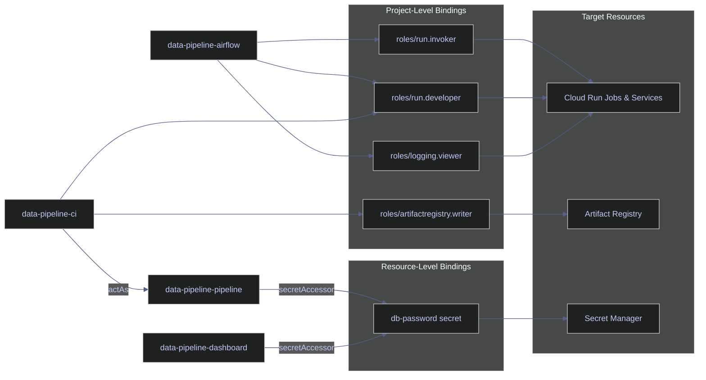

# IAM and Secrets

> [!quote] Kelsey Hightower on raw cloud access
>
> "Give an agent raw cloud access and you get the same thing you get when you hand a developer raw Terraform — well-intentioned decisions made without context."
>
> — **Kelsey Hightower**, Twitter

> [!abstract]- Summary
>
> IAM and Secrets is the identity and secret-boundary note for the Terraform GCP layer: it shows how one-service-account-per-workload, explicit IAM bindings, Secret Manager resources, optional Datadog conditionals, and CI/CD impersonation paths fit together into a least-privilege deployment model.
>
> **Identity foundations**
> - covers required APIs and permissions, workload-specific service accounts, naming conventions, and the principle that service accounts begin with no permissions until Terraform binds roles explicitly
>
> **IAM role assignment**
> - covers resource-level versus project-level IAM, `iam_member` versus `iam_binding` versus `iam_policy`, `for_each` patterns for repeated bindings, and the least-privilege chain used by runtime and CI identities
>
> **Secret management and conditional resources**
> - covers Secret Manager resources, replication syntax, secret versions, lifecycle protection, secret-access bindings, and optional Datadog-related resources controlled by conditional logic
>
> **CI/CD identity path**
> - covers the dedicated deployment service account, why exported keys are risky, and how Workload Identity Federation keeps GitHub Actions from depending on long-lived credentials
>
> **Operations and safety**
> - Warnings: primitive roles are too broad, secret values still land in Terraform state, production secrets need lifecycle protection, exported service-account keys for CI are risky, and verification commands can print plaintext secret values to the terminal
> - Recommendations: keep one service account per workload, bind only fine-grained predefined roles, encrypt and protect the remote state backend, prefer WIF over key export, use `for_each` for repeated IAM resources, and reference secrets indirectly instead of printing or embedding them

> [!note]- Glossary
>
> **Service account**
> - A Google-managed workload identity used by applications, VMs, jobs, or automation instead of by a human user.
> - It matters because the note's central access-control pattern is to give each workload its own narrowly scoped service account.
>
> > [!info] Identity and permission are separate
> >
> > Creating a service account does not grant it any access by itself. Permissions arrive only when IAM bindings attach roles to that identity.
>
> ---
>
> **Least privilege**
> - The principle of granting only the minimum permissions required for a workload or automation path to function.
> - It matters because the note repeatedly narrows role choices, secret access, and CI permissions around that principle.
>
> > [!warning] Convenience tends to widen scope
> >
> > Broad roles are operationally tempting because they make errors disappear quickly. They also turn identity mistakes into larger blast-radius problems later.
>
> ---
>
> **Primitive role**
> - A broad legacy IAM role such as Owner, Editor, or Viewer that spans many unrelated permissions.
> - It matters because the note explicitly warns against using primitive roles for Terraform-managed workloads.
>
> > [!danger] Broad roles undermine control boundaries
> >
> > Primitive roles collapse careful separation of duties into one oversized permission grant. Once attached to a workload identity, they are difficult to reason about safely.
>
> ---
>
> **IAM binding**
> - The association between a principal and a role at some scope, such as a project, resource, or secret.
> - It matters because service accounts in this note gain all useful access only through explicit bindings Terraform creates.
>
> > [!info] Scope matters as much as role
> >
> > The same role at a project level is usually much broader than the same permission pattern targeted at one resource. Least privilege depends on both dimensions, not just the role name.
>
> ---
>
> **`iam_member` / `iam_binding` / `iam_policy`**
> - Three Terraform resource patterns for managing IAM, ranging from one-member incremental changes to full-authoritative policy replacement.
> - It matters because choosing the wrong IAM resource type can create policy fights or unintentionally replace permissions managed elsewhere.
>
> > [!warning] Authoritative resources can overwrite peers
> >
> > `iam_binding` and especially `iam_policy` can become destructive if multiple Terraform stacks or manual processes manage the same scope. The authoritativeness of the resource is part of its risk profile.
>
> ---
>
> **Secret Manager**
> - GCP's managed secret storage service for values such as passwords, API keys, and tokens.
> - It matters because the note uses Secret Manager to keep sensitive runtime values out of instance metadata and out of application source.
>
> > [!info] Secret storage and secret usage are separate
> >
> > Creating a secret is only half the design. You still need the right IAM model and runtime references so workloads can consume it without exposing the value broadly.
>
> ---
>
> **Secret version**
> - An individual stored value revision under a Secret Manager secret.
> - It matters because Terraform often provisions both the secret container and one or more versions that hold the actual sensitive material.
>
> > [!warning] Versions still affect state exposure
> >
> > Even when secrets live in Secret Manager, Terraform can still process the plaintext input used to create the version. That is why state protection remains critical.
>
> ---
>
> **Terraform state exposure**
> - The risk that values Terraform handles, especially sensitive inputs and secret versions, are persisted in state and therefore inherit the backend's security posture.
> - It matters because this note explicitly warns that secret values can still reside in Terraform state even when the destination system is Secret Manager.
>
> > [!danger] Secret Manager does not magically sanitize state
> >
> > Sending a secret into a managed secret store is good practice, but the value may still pass through Terraform's state lifecycle. Backend encryption and access control are part of the secret design, not an unrelated concern.
>
> ---
>
> **`prevent_destroy`**
> - A Terraform lifecycle safeguard that blocks planned destruction while the protected resource block still exists in configuration.
> - It matters because production secrets are stateful security assets and should not be easy to delete accidentally.
>
> > [!warning] Secrets deserve stronger lifecycle defaults
> >
> > A missing `prevent_destroy` on a production secret turns routine refactors into potential outage or recovery events. Stateful security objects should be harder to remove than disposable compute.
>
> ---
>
> **Conditional resource**
> - A Terraform resource whose creation depends on a condition, commonly implemented with `count` or `for_each`.
> - It matters because the note uses this pattern to create optional Datadog-related resources only when the corresponding inputs are enabled.
>
> > [!info] Optional does not mean ad hoc
> >
> > Even conditional resources should keep stable identities and clear rules. Optional infrastructure still needs deterministic Terraform behavior when toggled on or off.
>
> ---
>
> **Workload Identity Federation**
> - A GCP identity pattern that lets external systems such as GitHub Actions exchange trusted identity assertions for short-lived Google credentials without exporting service-account keys.
> - It matters because the safest CI/CD path in this note avoids long-lived JSON keys entirely.
>
> > [!warning] Key export should be the exception
> >
> > A service-account key file is a durable credential artifact that can leak, be copied, or remain valid longer than intended. WIF reduces that persistence risk substantially.
>
> ---
>
> **Impersonation / `actAs`**
> - The permission model where one principal is allowed to attach or act as another service account to run workloads under that identity.
> - It matters because CI/CD identities in this note need narrow deployment powers without inheriting every runtime permission directly.
>
> > [!info] Separation of build and runtime identity
> >
> > Letting CI impersonate a runtime identity can be safer than giving CI all of that runtime identity's underlying permissions permanently. The chain should still stay as narrow as possible.
>
> ---
>
> **`for_each` for IAM**
> - A Terraform pattern for generating repeated IAM resources from a collection of roles, members, or bindings.
> - It matters because IAM configurations often contain several similar bindings, and `for_each` keeps them consistent and reviewable.
>
> > [!info] Good fit for repeated policy fragments
> >
> > IAM tends to be repetitive. `for_each` reduces copy-paste while keeping each binding addressable and easier to evolve than a monolithic handwritten block set.

> [!info] Assumed variables
>
> All HCL blocks in this note reference the following variables, defined elsewhere in the Terraform configuration:
> - `var.project_id` — the GCP project ID
> - `var.db_password` — the database password value (marked `sensitive` in the variable definition)
> - `var.dd_api_key` — the Datadog API key (empty string disables Datadog resources)

> [!info] Required APIs and permissions
>
> Before creating these resources, the following APIs must be enabled on the GCP project:
> - `iam.googleapis.com` — Identity and Access Management
> - `secretmanager.googleapis.com` — Secret Manager
>
> The Terraform service account itself needs `roles/iam.serviceAccountAdmin`, `roles/secretmanager.admin`, and `roles/resourcemanager.projectIamAdmin` to create and manage these resources.



## Service Accounts

A **service account** is a non-human identity that a workload runs as. The standard GCP pattern is one service account per service, each with the minimum permissions it needs. The service accounts themselves have no permissions by default — they only gain access through explicit IAM bindings.

> [!tip] Naming convention
>
> Prefix service account IDs with the project or workload name (e.g., `data-pipeline-pipeline`, `data-pipeline-dashboard`). This makes it easy to filter and audit accounts with `gcloud iam service-accounts list --filter="email~data-pipeline"`.

### google_service_account

The `google_service_account` resource creates a GCP service account. Changing the `account_id` argument forces Terraform to destroy and recreate the account, which invalidates all existing IAM bindings and keys — plan changes carefully.

#### google_service_account | Core workload accounts

Three service accounts serve the core workloads: the data pipeline, the dashboard, and the orchestrator.

*Create the pipeline workload service account.*

```hcl
resource "google_service_account" "pipeline" {
  account_id   = "data-pipeline-pipeline"
  display_name = "the data pipeline project Pipeline"
}
```

| Argument | Required | Description |
|---|---|---|
| `account_id` | Yes | Creates the email `<account_id>@<project>.iam.gserviceaccount.com`. Must be 6–30 characters, lowercase letters, digits, and hyphens. |
| `display_name` | No | Human-readable name shown in the GCP console. |
| `description` | No | Longer description of the account's purpose. Visible in console and API responses. |

The three core accounts and their workload assignments:

| Account | Used by | Purpose |
|---------|---------|---------|
| `data-pipeline-pipeline` | Cloud Run pipeline job + SQL VM | Runs data pipeline, accesses database password in Secret Manager |
| `data-pipeline-dashboard` | Cloud Run dashboard service | Runs Blazor app, accesses database password in Secret Manager |
| `data-pipeline-airflow` | Airflow GCE VM | Triggers Cloud Run jobs, views logs |

#### google_service_account | Multi-environment pattern

For broader deployments, define one service account per workload type with descriptive names and descriptions.

*Create the pipeline runner service account for Airflow DAGs and Cloud Run containers.*

```hcl
resource "google_service_account" "pipeline_runner" {
  account_id   = "pipeline-runner"
  display_name = "Pipeline Runner"
  description  = "Used by Airflow DAGs and Cloud Run pipeline containers"
}
```

*Create the dashboard read-only service account for the Blazor frontend.*

```hcl
resource "google_service_account" "dashboard" {
  account_id   = "dashboard-reader"
  display_name = "Dashboard Read-Only"
  description  = "Used by Blazor dashboard — read access only"
}
```

*Create the Pub/Sub push invoker service account.*

```hcl
resource "google_service_account" "pubsub_invoker" {
  account_id   = "pubsub-invoker"
  display_name = "Pub/Sub Push Invoker"
}
```

> [!danger] Never use primitive roles
>
> Never assign `roles/editor` or `roles/owner` to service accounts. These grant thousands of permissions across all project resources.

> [!success] Use fine-grained predefined roles
>
> Assign the narrowest predefined role that covers the workload's needs (e.g., `roles/bigquery.dataEditor`, `roles/storage.objectCreator`). If no predefined role is narrow enough, create a custom role.

## IAM Bindings

IAM bindings connect a **member** (service account) to a **role** (set of permissions) on a **resource** (project, secret, etc.). There are two scopes:

| Scope | Resource type | Example | Visible in |
|-------|--------------|---------|------------|
| **Project-level** | `google_project_iam_member` | `roles/run.invoker` for Airflow | IAM → Permissions page |
| **Resource-level** | `google_secret_manager_secret_iam_member` | `roles/secretmanager.secretAccessor` for pipeline on a specific secret | Secret Manager → secret → Permissions tab |

Resource-level bindings are more restrictive — they apply only to one resource, not the whole project — and don't appear on the project IAM page. You must inspect the specific resource's permissions tab.

> [!info] Resource vs project IAM
>
> `data-pipeline-pipeline` and `data-pipeline-dashboard` appear to have "no roles" in the GCP Console's project IAM page, but they have resource-level bindings on specific secrets. This is intentional and more secure — they can only access their specific secrets, not any other project resources.

### google_secret_manager_secret_iam_member

The `google_secret_manager_secret_iam_member` resource grants a single role to a single member on a specific secret. This is the non-authoritative form — it adds the binding without removing existing ones.

#### google_secret_manager_secret_iam_member | Pipeline secret access

Grants the pipeline service account read access to the database password secret. The binding is scoped to this one secret — the pipeline cannot access any other secret in the project.

*Grant secret read access to the pipeline SA on the db-password secret.*

```hcl
resource "google_secret_manager_secret_iam_member" "pipeline_secret" {
  secret_id = google_secret_manager_secret.db_password.id
  role      = "roles/secretmanager.secretAccessor"
  member    = "serviceAccount:${google_service_account.pipeline.email}"
}
```

| Argument | Required | Description |
|---|---|---|
| `secret_id` | Yes | The specific secret this binding applies to. Not project-wide — only this one secret. |
| `role` | Yes | `roles/secretmanager.secretAccessor` allows reading secret versions. Cannot create, delete, or modify secrets. |
| `member` | Yes | The `serviceAccount:` prefix is required IAM syntax. Other prefixes include `user:` for humans and `group:` for Google Groups. |

### google_project_iam_member

The `google_project_iam_member` resource grants a single role to a single member at the project level. This is the non-authoritative form — safe to use alongside other bindings managed outside Terraform.

> [!question] iam_member vs iam_binding vs iam_policy
>
> Terraform offers three IAM resource variants per resource type:
> - **`iam_member`** (non-authoritative): Adds one member to one role. Safe — does not affect other members.
> - **`iam_binding`** (semi-authoritative): Sets the complete member list for one role. Removes members not in the list.
> - **`iam_policy`** (fully authoritative): Sets the entire IAM policy. Removes all bindings not in the config.
>
> Use `iam_member` unless you need to enforce an exact member list. Authoritative resources can lock out other principals including the Terraform service account itself.

#### google_project_iam_member | Airflow project-level roles

The Airflow service account needs project-level roles to trigger and monitor Cloud Run jobs.

*Grant the Airflow SA the Cloud Run invoker role at project level.*

```hcl
resource "google_project_iam_member" "airflow_run_invoker" {
  project = var.project_id
  role    = "roles/run.invoker"
  member  = "serviceAccount:${google_service_account.airflow.email}"
}
```

| Argument | Required | Description |
|---|---|---|
| `project` | Yes | The GCP project ID. Use `var.project_id` — never hardcode. |
| `role` | Yes | The IAM role to grant. |
| `member` | Yes | The principal receiving the role. |

The three roles assigned to the Airflow account:

| Role | What it allows |
|------|----------------|
| `roles/run.invoker` | Execute (invoke) Cloud Run services and jobs. Airflow uses this to trigger pipeline runs via `CloudRunExecuteJobOperator`. |
| `roles/run.developer` | Deploy new revisions of Cloud Run services/jobs. Needed because the Airflow operator updates job overrides (passing `--step` arguments). |
| `roles/logging.viewer` | Read logs from Cloud Logging. Allows Airflow to display Cloud Run job logs in its UI. |

#### google_project_iam_member | Multi-environment roles

In broader deployments, grant specific roles to each service account — never `roles/editor` or `roles/owner`.

*Grant the pipeline SA BigQuery data editor access at project level.*

```hcl
resource "google_project_iam_member" "pipeline_bq_editor" {
  project = var.project_id
  role    = "roles/bigquery.dataEditor"
  member  = "serviceAccount:${google_service_account.pipeline_runner.email}"
}
```

*Grant the dashboard SA BigQuery read-only access at project level.*

```hcl
resource "google_project_iam_member" "dashboard_bq_viewer" {
  project = var.project_id
  role    = "roles/bigquery.dataViewer"
  member  = "serviceAccount:${google_service_account.dashboard.email}"
}
```

*Grant the pipeline SA GCS object creator access at project level.*

```hcl
resource "google_project_iam_member" "pipeline_gcs_writer" {
  project = var.project_id
  role    = "roles/storage.objectCreator"
  member  = "serviceAccount:${google_service_account.pipeline_runner.email}"
}
```

> [!tip] for_each for IAM Bindings
>
> When a service account needs multiple roles, use `for_each` over a set instead of individual resources:
> ```hcl
> locals {
>   pipeline_roles = toset([
>     "roles/bigquery.dataEditor",
>     "roles/storage.objectCreator",
>     "roles/run.invoker",
>   ])
> }
>
> resource "google_project_iam_member" "pipeline_roles" {
>   for_each = local.pipeline_roles
>   project  = var.project_id
>   role     = each.value
>   member   = "serviceAccount:${google_service_account.pipeline_runner.email}"
> }
> ```
> This reduces repetition and makes role additions a single-line change in the `locals` block.

## Secret Manager

Secret Manager uses a **two-level structure**: the **secret** (a named container) and one or more **versions** (the actual values). This is why there are two Terraform resources per secret — one for the container, one for the value. The container defines the name and replication policy; the version holds the actual sensitive data. You can have multiple versions (e.g., after rotating a password) and Cloud Run references `version = "latest"` to always get the newest one. For the operational side of working with secrets — rotation, access auditing, and application integration patterns — see [secrets-management](https://alp78.github.io/elysium/06-GCP/Security/secrets-management).

> [!danger] Secret data in Terraform state
>
> The `secret_data` argument value is stored in **plaintext** in the Terraform state file. Anyone with read access to the state can read all secret values.

> [!success] Encrypt state at rest
>
> Always use a remote backend (GCS) with encryption enabled and restrict access to the state bucket. See [gcs-buckets-and-lifecycle](https://alp78.github.io/elysium/06-GCP/Storage/gcs-buckets-and-lifecycle) for bucket configuration and [providers-and-backend](https://alp78.github.io/elysium/07-Terraform/Fundamentals/providers-and-backend) for backend setup.

> [!info] Provider v5.0+ replication syntax
>
> The `replication { auto {} }` block syntax replaced the older `replication { automatic = true }` in Google provider v5.0. If upgrading from an older provider version, update the replication block to avoid deprecation warnings.

### google_secret_manager_secret

The `google_secret_manager_secret` resource creates a secret container in GCP. Changing the `secret_id` forces Terraform to destroy and recreate the secret, which destroys all versions — use `lifecycle { prevent_destroy = true }` on production secrets.

#### google_secret_manager_secret | Auto-replicated secret container

Creates a secret with automatic replication — GCP replicates the secret data across multiple regions for durability.

*Create an auto-replicated secret container for the database password.*

```hcl
resource "google_secret_manager_secret" "db_password" {
  secret_id = "data-pipeline-db-password"

  replication {
    auto {}
  }
}
```

| Argument | Required | Description |
|---|---|---|
| `secret_id` | Yes | Name of the secret in GCP. Used by Cloud Run to reference it: `secret = "data-pipeline-db-password"`. |
| `replication.auto` | Yes | Automatic replication — GCP manages region placement. The alternative `user_managed` lets you specify exact regions for data residency requirements. |

> [!warning] Missing `prevent_destroy` on production secrets
>
> Without `lifecycle { prevent_destroy = true }`, a `terraform destroy` or accidental removal from config will permanently delete the secret and all its versions.

> [!success] Protect stateful resources
>
> Add a lifecycle block to secrets holding production credentials:
> ```hcl
> resource "google_secret_manager_secret" "db_password" {
>   secret_id = "data-pipeline-db-password"
>   replication { auto {} }
>
>   lifecycle {
>     prevent_destroy = true
>   }
> }
> ```

### google_secret_manager_secret_version

The `google_secret_manager_secret_version` resource creates a version within a secret container. Each version is immutable — creating a new version does not modify or delete previous versions. Terraform creates a new version on every apply where `secret_data` has changed.

#### google_secret_manager_secret_version | Database password

Stores the database password as a secret version. The value comes from a sensitive variable — never hardcode secrets in HCL files.

*Store the database password as an immutable secret version.*

```hcl
resource "google_secret_manager_secret_version" "db_password" {
  secret      = google_secret_manager_secret.db_password.id
  secret_data = var.db_password
}
```

| Argument | Required | Description |
|---|---|---|
| `secret` | Yes | The parent secret this version belongs to. |
| `secret_data` | Yes | The actual secret value. Terraform stores this in state (encrypted in the GCS backend). Cloud Run reads it at container startup via `value_source.secret_key_ref`. |

## Conditional Datadog Resources

The Datadog integration uses a conditional creation pattern — resources are only created when the `var.dd_api_key` variable is non-empty. This uses Terraform's `count` meta-argument as a conditional: `count = 0` skips the resource entirely, `count = 1` creates it. See [conditional-resources](https://alp78.github.io/elysium/07-Terraform/Patterns/conditional-resources) for the full pattern.

### google_service_account | Conditional Datadog account

The Datadog service account is only created if a Datadog API key is provided.

*Create the Datadog service account only when an API key is provided.*

```hcl
resource "google_service_account" "datadog" {
  count        = var.dd_api_key != "" ? 1 : 0
  account_id   = "data-pipeline-datadog"
  display_name = "Datadog GCP Integration"
}
```

| Argument | Required | Description |
|---|---|---|
| `count` | No | Conditional resource creation. When `dd_api_key` is empty, `count = 0` and this resource (plus all dependent Datadog resources) is not created. When set, `count = 1` creates it. |
| `account_id` | Yes | The service account identifier. |
| `display_name` | No | Human-readable name in the GCP console. |

### google_project_iam_member | Datadog read-only roles

The Datadog service account receives three read-only roles for observability:

| Role | What it allows |
|------|----------------|
| `roles/monitoring.viewer` | Read Cloud Monitoring metrics (CPU, memory, disk). |
| `roles/compute.viewer` | Read Compute Engine metadata (VM names, zones, machine types). |
| `roles/cloudasset.viewer` | Read Cloud Asset Inventory (resource discovery across the project). |

> [!info] No write or admin roles
>
> The Datadog integration can only observe — it cannot modify any resource. This is the correct least-privilege posture for a monitoring integration.

### google_secret_manager_secret_version | Conditional Datadog API key

The secret container (`dd_api_key`) is always created, but the version (the actual key value) is only created when `dd_api_key` is provided. This means the secret exists as a placeholder even when Datadog is disabled — avoiding a Terraform error if you later enable it.

*Store the Datadog API key as a secret version only when provided.*

```hcl
resource "google_secret_manager_secret_version" "dd_api_key" {
  count       = var.dd_api_key != "" ? 1 : 0
  secret      = google_secret_manager_secret.dd_api_key.id
  secret_data = var.dd_api_key
}
```

## CI/CD Service Account

A dedicated service account for GitHub Actions CI/CD pipelines. For the full GitHub Actions workflow that uses this account, see [github-actions-ci-cd](https://alp78.github.io/elysium/10-GitHub-Actions/github-actions-ci-cd).

> [!warning] SA key export for CI
>
> The traditional approach stores a JSON key as a GitHub Actions secret (`GCP_SA_KEY`). SA keys are long-lived credentials that can be exfiltrated and are difficult to audit.

> [!success] Prefer Workload Identity Federation (WIF)
>
> Workload Identity Federation (WIF) lets GitHub Actions authenticate directly without exporting a key. The GitHub OIDC token is exchanged for short-lived GCP credentials, eliminating the need for stored secrets. See [service-accounts-and-iam](https://alp78.github.io/elysium/06-GCP/Security/service-accounts-and-iam) for WIF configuration.

### google_service_account | CI/CD account

Creates the CI/CD service account used by GitHub Actions.

*Create the CI/CD service account for GitHub Actions deployments.*

```hcl
resource "google_service_account" "ci" {
  account_id   = "data-pipeline-ci"
  display_name = "the data pipeline project CI/CD (GitHub Actions)"
}
```

### google_project_iam_member | CI registry and deployment roles

The CI account needs two project-level roles: push images to Artifact Registry and deploy to Cloud Run.

*Grant the CI SA Artifact Registry writer access at project level.*

```hcl
resource "google_project_iam_member" "ci_registry" {
  project = var.project_id
  role    = "roles/artifactregistry.writer"
  member  = "serviceAccount:${google_service_account.ci.email}"
}
```

*Grant the CI SA Cloud Run developer access at project level.*

```hcl
resource "google_project_iam_member" "ci_run" {
  project = var.project_id
  role    = "roles/run.developer"
  member  = "serviceAccount:${google_service_account.ci.email}"
}
```

| Role | What it allows |
|------|----------------|
| `roles/artifactregistry.writer` | Push (write) Docker images to Artifact Registry. Cannot delete images or modify repository settings. |
| `roles/run.developer` | Deploy new revisions to Cloud Run services and jobs. Cannot modify IAM or networking. |

### google_service_account_iam_member | CI act-as binding

When GitHub Actions deploys a Cloud Run job, it must specify which service account the job runs as. The `roles/iam.serviceAccountUser` role allows the CI account to assign the pipeline identity without being able to use the pipeline account's permissions directly.

*Grant the CI SA act-as (serviceAccountUser) permission on the pipeline SA.*

```hcl
resource "google_service_account_iam_member" "ci_act_as_pipeline" {
  service_account_id = google_service_account.pipeline.name
  role               = "roles/iam.serviceAccountUser"
  member             = "serviceAccount:${google_service_account.ci.email}"
}
```

| Argument | Required | Description |
|---|---|---|
| `service_account_id` | Yes | The target service account that the CI account will be allowed to act as. |
| `role` | Yes | `roles/iam.serviceAccountUser` grants the "act as" permission. Visible in GCP under the target SA → Permissions → "Principals with access to this service account." |
| `member` | Yes | The principal receiving the act-as permission. |

> [!info] Least privilege chain
>
> The CI account can push images and update deployments, but it cannot access the database, read secrets, or trigger pipeline runs. It can only assign existing service accounts to Cloud Run workloads.

## Verification Commands

These `gcloud` commands verify the resources created by the Terraform configuration above.

### gcloud | Service account inspection

#### List project service accounts

Lists all service accounts matching the project prefix.

*List all service accounts with the data-pipeline prefix.*

```bash
gcloud iam service-accounts list --filter="email~data-pipeline"
```

#### View act-as permissions on a service account

Shows which principals can impersonate (act as) the pipeline service account.

*Verify which principals hold act-as permission on the pipeline SA.*

```bash
gcloud iam service-accounts get-iam-policy data-pipeline-pipeline@data-platform-prod.iam.gserviceaccount.com
```

#### View project-level roles for a service account

Shows the project-level IAM roles bound to the Airflow service account.

*Verify the project-level roles assigned to the Airflow SA.*

```bash
gcloud projects get-iam-policy data-platform-prod \
  --flatten="bindings[].members" \
  --filter="bindings.members:data-pipeline-airflow@data-platform-prod.iam.gserviceaccount.com" \
  --format="table(bindings.role)"
```

### gcloud | Secret inspection

#### List project secrets

Lists all secrets matching the project prefix.

*List all secrets with the data-pipeline prefix.*

```bash
gcloud secrets list --filter="name~data-pipeline"
```

#### View secret versions

*List all versions of the database password secret.*

```bash
gcloud secrets versions list data-pipeline-db-password
```

*List all versions of the Datadog API key secret.*

```bash
gcloud secrets versions list data-pipeline-dd-api-key
```

#### View secret access policy

Shows which principals have access to the database password secret.

*Verify which principals hold secretAccessor on the db-password secret.*

```bash
gcloud secrets get-iam-policy data-pipeline-db-password
```

#### Access the latest secret value

> [!danger] Prints secret to terminal
>
> This command outputs the secret value in plaintext. Only use in secure environments — never in shared terminals, CI logs, or screen recordings.

> [!success] Use secret references instead
>
> In application code and Cloud Run, reference secrets via `value_source.secret_key_ref` or environment variable injection rather than accessing the value directly.

*Access the latest version of the database password secret (outputs plaintext — secure environments only).*

```bash
gcloud secrets versions access latest --secret=data-pipeline-db-password
```

## Related

**GCP service references:**

- [service-accounts-and-iam](https://alp78.github.io/elysium/06-GCP/Security/service-accounts-and-iam) — underlying IAM concepts, roles, policies, WIF
- [secrets-management](https://alp78.github.io/elysium/06-GCP/Security/secrets-management) — secret rotation, access auditing, application integration
- [cloud-run-jobs-vs-services](https://alp78.github.io/elysium/06-GCP/Serverless/cloud-run-jobs-vs-services) — the workloads these service accounts run
- [gcs-buckets-and-lifecycle](https://alp78.github.io/elysium/06-GCP/Storage/gcs-buckets-and-lifecycle) — GCS backend for Terraform state encryption

**Terraform references:**

- [compute](https://alp78.github.io/elysium/07-Terraform/GCP-Resources/compute) — the VMs assigned service accounts
- [cloud-run](https://alp78.github.io/elysium/07-Terraform/GCP-Resources/cloud-run) — how secrets are injected into Cloud Run containers
- [conditional-resources](https://alp78.github.io/elysium/07-Terraform/Patterns/conditional-resources) — the `count` pattern for optional Datadog resources
- [registry-and-ci](https://alp78.github.io/elysium/07-Terraform/GCP-Resources/registry-and-ci) — the CI service account's primary use case
- [providers-and-backend](https://alp78.github.io/elysium/07-Terraform/Fundamentals/providers-and-backend) — remote backend configuration for state encryption

**CI/CD integration:**

- [github-actions-ci-cd](https://alp78.github.io/elysium/10-GitHub-Actions/github-actions-ci-cd) — GitHub Actions workflow using the CI service account

## References

- [google_service_account](https://registry.terraform.io/providers/hashicorp/google/latest/docs/resources/google_service_account)
- [google_project_iam_member](https://registry.terraform.io/providers/hashicorp/google/latest/docs/resources/google_project_iam_member)
- [google_secret_manager_secret](https://registry.terraform.io/providers/hashicorp/google/latest/docs/resources/secret_manager_secret)
- [google_secret_manager_secret_version](https://registry.terraform.io/providers/hashicorp/google/latest/docs/resources/secret_manager_secret_version)
- [google_secret_manager_secret_iam_member](https://registry.terraform.io/providers/hashicorp/google/latest/docs/resources/secret_manager_secret_iam_member)
- [google_service_account_iam_member](https://registry.terraform.io/providers/hashicorp/google/latest/docs/resources/google_service_account_iam_member)
- [GCP IAM Roles](https://cloud.google.com/iam/docs/understanding-roles)
- [Workload Identity Federation](https://cloud.google.com/iam/docs/workload-identity-federation)
