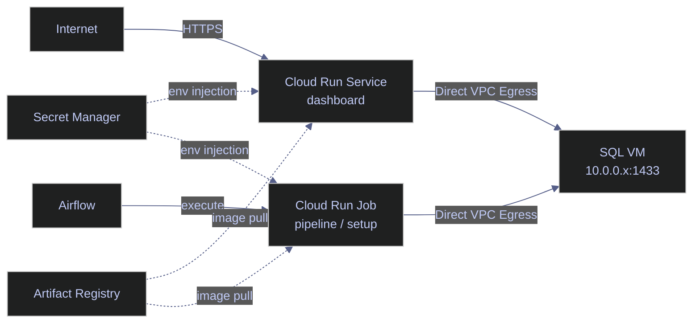

# Terraform Cloud Run — Services and Jobs

> [!quote] Tim Wagner on serverless computing
>
> "The future of serverless is about running your code without thinking about servers, and that future is already here."
>
> — **Tim Wagner**, creator of AWS Lambda

This note covers `run.tf` — the Cloud Run service (dashboard) and Cloud Run jobs (pipeline, setup) that form the application layer of the example infrastructure.

> [!info] Billing is usage-based
>
> Cloud Run bills **actual CPU/memory usage**, not the limits defined in the configuration. Setting `cpu = "2"` and `memory = "2Gi"` as limits does not mean you pay for 2 CPUs — you pay for what the container actually consumes during execution. Lowering limits does not save cost; it only risks OOM kills or CPU throttling if the workload exceeds them.

> [!info] Assumed variables and prerequisites
>
> All resource blocks in this file reference `var.region` and `var.project_id`, which must be defined in your variables file. The following GCP APIs must be enabled on the project:
> - `run.googleapis.com` — Cloud Run services and jobs
> - `secretmanager.googleapis.com` — secret injection into containers
> - `compute.googleapis.com` — VPC networking for Direct VPC Egress
>
> The Terraform service account needs at minimum: `roles/run.admin`, `roles/iam.serviceAccountUser` (to attach service accounts to Cloud Run resources), and `roles/secretmanager.secretAccessor` (to read secrets at deploy time).



## Shared Configuration

Computed values reused across all Cloud Run resources in this file.

### locals

Terraform `locals` are computed values evaluated once at plan time. They cannot be overridden from outside the module — use `variable` blocks for configurable inputs.

*Compute the full registry path, SQL VM private IP, and SA username for reuse across Cloud Run resources.*

```hcl
locals {
  registry = "${var.region}-docker.pkg.dev/${var.project_id}/${google_artifact_registry_repository.data-pipeline.repository_id}"
  sql_ip   = google_compute_instance.sql.network_interface[0].network_ip
  sql_user = "sa"
}
```

| Local | Value | Purpose |
|-------|-------|---------|
| `registry` | `europe-west1-docker.pkg.dev/data-platform-prod/data-pipeline` | Full registry path. Used as prefix for image references. |
| `sql_ip` | `10.0.0.x` (resolved at apply time) | The SQL VM's **private IP**. Read from the VM's first network interface. Used in connection strings. |
| `sql_user` | `sa` | SQL Server system administrator username. |

## google_cloud_run_v2_service

A Cloud Run **service** is a long-running HTTP endpoint that auto-scales based on incoming traffic. Unlike jobs, services stay alive to serve requests. This resource provisions the dashboard — a Blazor Server application serving the project's web interface. For the architectural distinction between services and jobs, including when to choose each, see [Cloud Run jobs vs services](https://alp78.github.io/elysium/06-GCP/Serverless/cloud-run-jobs-vs-services).

*Declare the dashboard Cloud Run service with deletion protection disabled.*

```hcl
resource "google_cloud_run_v2_service" "dashboard" {
  name                = "data-pipeline-dashboard"
  location            = var.region
  deletion_protection = false
  ...
}
```

| Field | Value | Meaning |
|-------|-------|---------|
| `name` | `data-pipeline-dashboard` | Service name. The public URL is derived from this: `data-pipeline-dashboard-xxxxx-ew.a.run.app`. |
| `deletion_protection` | `false` | When `true`, Terraform refuses to destroy this resource. Set to `false` here to allow teardown via `terraform destroy`. In production, consider `true` for databases. |

> [!danger] deletion_protection = false
>
> With `deletion_protection = false`, `terraform destroy` or removing the resource from config will immediately delete the Cloud Run service and all its revisions. Changing `location` also forces a destroy-and-recreate, which causes downtime and a new URL.

> [!success] Production safeguard
>
> Set `deletion_protection = true` for production services. To intentionally destroy, first set it to `false`, run `terraform apply`, then destroy. For stateful resources, also add `lifecycle { prevent_destroy = true }`.

### Template Block

*Configure sticky sessions, scaling limits, and a 1-hour timeout for Blazor WebSocket connections.*

```hcl
template {
  session_affinity = true
  service_account  = google_service_account.dashboard.email
  timeout          = "3600s"

  scaling {
    min_instance_count = 1
    max_instance_count = 2
  }
  ...
}
```

| Field | Value | Meaning |
|-------|-------|---------|
| `session_affinity` | `true` | **Sticky sessions** — routes requests from the same client to the same container instance. Critical for Blazor Server, which maintains a persistent WebSocket (SignalR circuit) per user. Without this, WebSocket connections would break when routed to a different instance. |
| `service_account` | `data-pipeline-dashboard@...` | The identity the container runs as. Determines what GCP APIs it can call. |
| `timeout` | `3600s` | Maximum request duration (1 hour). Blazor's WebSocket connections are long-lived — the default 300s would disconnect users after 5 minutes. |
| `min_instance_count` | `1` | **Always-warm** — at least one instance is always running. Eliminates cold start latency (which would break WebSocket connections). Costs ~$5-10/month for an idle instance. |
| `max_instance_count` | `2` | Limits scaling to 2 instances. This dashboard serves a small number of users — no need for aggressive autoscaling. |

### Container Block — Dashboard

*Define the dashboard container with startup probe, connection string, secret injection, and resource limits.*

```hcl
containers {
  image = "${local.registry}/dashboard:latest"

  ports {
    container_port = 8080
  }

  startup_probe {
    http_get { path = "/" }
    initial_delay_seconds = 3
    period_seconds        = 10
    failure_threshold     = 3
  }

  env {
    name  = "ConnectionStrings__project"
    value = "Server=${local.sql_ip},1433;Database=data-pipeline;User Id=${local.sql_user};TrustServerCertificate=true"
  }

  env {
    name = "DB_PASSWORD"
    value_source {
      secret_key_ref {
        secret  = google_secret_manager_secret.db_password.secret_id
        version = "latest"
      }
    }
  }

  resources {
    limits = {
      cpu    = "1"
      memory = "512Mi"
    }
  }
}
```

| Field | Value | Meaning |
|-------|-------|---------|
| `image` | `.../dashboard:latest` | Docker image to run. `latest` tag is updated by [GitHub Actions](https://alp78.github.io/elysium/10-GitHub-Actions/github-actions-ci-cd) on every push to `main`. |
| `container_port` | `8080` | Port the Blazor app listens on inside the container. Cloud Run routes external HTTPS traffic to this port. |
| `startup_probe` | HTTP GET `/` | Cloud Run checks if the container is ready by hitting `/` every 10 seconds, starting 3 seconds after launch. If it fails 3 times, the container is killed and restarted. |
| `ConnectionStrings__project` | ADO.NET connection string (without password) | .NET convention: double underscore `__` maps to `:` in `appsettings.json` hierarchy. Equivalent to `ConnectionStrings:data-pipeline`. Contains the SQL VM's private IP, database name, and user — but **not** the password. `TrustServerCertificate=true` skips SSL certificate validation (acceptable for internal VPC traffic). |
| `DB_PASSWORD` | Secret Manager ref | The database password is injected from Secret Manager at container startup. `Program.cs` reads this env var and merges it into the connection string via `SqlConnectionStringBuilder`. The password never appears in Terraform state or Cloud Run configuration. |
| `cpu` | `1` | 1 vCPU allocated to the container. |
| `memory` | `512Mi` | 512 megabytes of RAM. Sufficient for Blazor Server with a small number of concurrent circuits. |

> [!warning] Non-deterministic image tags
>
> Using `:latest` means `terraform plan` cannot detect image changes — the tag stays the same even when the underlying image is updated by CI/CD. Terraform will show "no changes" even after a new image is pushed.

> [!success] Deterministic deployments
>
> Use image digests (`@sha256:...`) or immutable version tags for full traceability. Alternatively, add `lifecycle { ignore_changes = [template[0].containers[0].image] }` if image updates are intentionally managed outside Terraform (e.g., by [GitHub Actions](https://alp78.github.io/elysium/10-GitHub-Actions/github-actions-ci-cd)).

### VPC Access — Direct Egress

*Route private-range traffic through the VPC via Direct VPC Egress.*

```hcl
vpc_access {
  network_interfaces {
    network    = google_compute_network.main.id
    subnetwork = google_compute_subnetwork.main.id
  }
  egress = "PRIVATE_RANGES_ONLY"
}
```

| Field | Value | Meaning |
|-------|-------|---------|
| `network_interfaces` | VPC + subnet | **Direct VPC egress** — Cloud Run gets a network interface in the VPC, allowing it to reach private IPs (like the SQL VM at `10.0.0.x`). This replaced the older VPC Connector approach. |
| `egress` | `PRIVATE_RANGES_ONLY` | Only traffic destined for private IP ranges (RFC 1918: `10.x`, `172.16-31.x`, `192.168.x`) goes through the VPC. Public internet traffic (e.g., external API calls) uses Cloud Run's default route. This prevents database traffic from ever touching the public internet. |

> [!tip] Direct VPC Egress vs VPC Connector
>
> Direct VPC Egress (used here) attaches a network interface directly to the VPC — no separate connector resource needed. This replaced the older `google_vpc_access_connector` approach, which required provisioning a dedicated `/28` subnet and had throughput limits (up to 1 Gbps). Direct VPC Egress supports higher bandwidth, has no additional resource cost, and simplifies the Terraform configuration. If migrating from a VPC Connector, remove the connector resource and replace the `vpc_access` block with the `network_interfaces` syntax shown above.

### google_cloud_run_v2_service_iam_member

*Make the dashboard service publicly accessible without authentication.*

```hcl
resource "google_cloud_run_v2_service_iam_member" "dashboard_public" {
  name     = google_cloud_run_v2_service.dashboard.name
  location = var.region
  role     = "roles/run.invoker"
  member   = "allUsers"
}
```

| Field | Value | Meaning |
|-------|-------|---------|
| `member` | `allUsers` | A special IAM principal meaning "anyone on the internet." This makes the dashboard publicly accessible without authentication. Without this binding, Cloud Run returns 403 to unauthenticated requests. |

> [!danger] Public internet access
>
> Binding `allUsers` with `roles/run.invoker` makes this service accessible to anyone on the internet without authentication. Any person or bot can send requests to the service URL. This is appropriate for a public dashboard but dangerous for internal tools or APIs that handle sensitive data.

> [!success] Restrict access
>
> For internal tools, use `allAuthenticatedUsers` (requires Google login) or specific service accounts and groups. For zero-trust access, use [Identity-Aware Proxy (IAP)](https://alp78.github.io/elysium/01-Shell/Networking/iap-tunneling) to enforce authentication at the load balancer level.

## google_cloud_run_v2_job

A Cloud Run **job** runs a container to completion and exits. Unlike a service, it has no HTTP endpoint — it is triggered externally (by Airflow or the `gcloud` CLI). This section covers two job variants: the pipeline job (recurring data processing) and the setup job (one-time initialization).

*Declare the pipeline Cloud Run job for batch data processing.*

```hcl
resource "google_cloud_run_v2_job" "pipeline" {
  name                = "data-pipeline-pipeline"
  location            = var.region
  deletion_protection = false
  ...
}
```

### Service vs Job Comparison

Key differences between the Cloud Run service and job provisioned in this file.

| Aspect | Dashboard (service) | Pipeline (job) |
|--------|-------------------|----------------|
| **Type** | Always-running HTTP service | Run-to-completion batch job |
| **Trigger** | Incoming HTTP requests | Airflow `CloudRunExecuteJobOperator` |
| **Scaling** | 1-2 instances | 1 task per execution |
| **Timeout** | 3600s | 1800s (30 min) |
| **Retries** | N/A (auto-restarts) | `max_retries = 1` |
| **CPU/Memory** | 1 CPU, 512Mi | 2 CPUs, 2Gi |

### Double-Nested Template

Cloud Run jobs have **two nested template levels** — this is not a typo:

*Outer template sets task count; inner template defines the container spec, SA, timeout, and retries.*

```hcl
template {            # ← execution template (how many tasks)
  task_count = 1

  template {          # ← task template (what each container looks like)
    service_account = google_service_account.pipeline.email
    timeout         = "1800s"
    max_retries     = 1
    ...
  }
}
```

The **outer template** (execution template) controls how many parallel tasks to run. The **inner template** (task template) defines the container spec, service account, timeout, and retries. This structure exists because Cloud Run jobs support fan-out: if `task_count = 10`, it would spawn 10 identical containers in parallel. Each container receives a `CLOUD_RUN_TASK_INDEX` env var (0-9) to know which shard of work to handle.

| Field | Value | Meaning |
|-------|-------|---------|
| `task_count` | `1` | Number of parallel tasks per execution. Set to 1 because the pipeline handles all indices sequentially within a single process. |
| `timeout` | `1800s` | Maximum runtime (30 minutes). The full pipeline typically completes in 2-5 minutes. The generous timeout accommodates slow API responses or large backfills. |
| `max_retries` | `1` | If the container exits with a non-zero code, Cloud Run retries once. Handles transient failures (network blips, OOM). The pipeline is idempotent, so retrying is always safe. |

### Pipeline Job Environment Variables

*Inject the database password from Secret Manager at container startup.*

```hcl
env {
  name = "SA_PASSWORD"
  value_source {
    secret_key_ref {
      secret  = google_secret_manager_secret.db_password.secret_id
      version = "latest"
    }
  }
}
```

| Field | Value | Meaning |
|-------|-------|---------|
| `value_source.secret_key_ref` | — | **Secret injection** — Cloud Run reads the secret from Secret Manager at container startup and injects it as an environment variable. The container never sees the secret in its configuration — only at runtime in memory. |
| `version` | `latest` | Always use the most recent version of the secret. Alternatively, you can pin to a specific version number for stability. |

Other pipeline environment variables:

| Variable | Value | Purpose |
|----------|-------|---------|
| `SQL_HOST` | `local.sql_ip` | SQL VM's private IP |
| `SQL_PORT` | `1433` | SQL Server port |
| `SQL_DATABASE` | `data-pipeline` | Database name |
| `SQL_USER` | `sa` | SQL Server admin |
| `DD_SERVICE` | `data-pipeline-pipeline` | Datadog service name for APM traces |
| `DD_ENV` | `prod` | Datadog environment tag |
| `DD_TRACE_AGENT_URL` | `http://<airflow-ip>:8126` | APM trace endpoint on Airflow VM |
| `DD_API_KEY` | *(from Secret Manager)* | Datadog API key for direct log shipping |
| `LOG_FORMAT` | `json` | Structured JSON logs for Datadog parsing |

### google_cloud_run_v2_job | Setup

The setup job runs one-time initialization tasks — creating database schemas, seeding reference data, and downloading historical data. It uses the same container image as the pipeline job but overrides the entrypoint with a custom command.

*Declare the setup job with a custom entrypoint for one-time database initialization.*

```hcl
resource "google_cloud_run_v2_job" "setup" {
  ...
  template {
    template {
      ...
      containers {
        image   = "${local.registry}/pipeline:latest"
        command = ["bash", "-c", "python db/run_ddl.py && python utils/setup_index.py"]
      }
      ...
      max_retries = 0
      timeout     = "3600s"
    }
  }
}
```

| Field | Value | Meaning |
|-------|-------|---------|
| `image` | `.../pipeline:latest` | Uses the same image as the pipeline job — the setup scripts are bundled in the same container. |
| `command` | `["bash", "-c", "python db/run_ddl.py && python utils/setup_index.py"]` | **Entrypoint override** — runs DDL scripts (create schemas/tables) then sets up all indices (fetch dimensions, seed history). `&&` ensures the second command only runs if the first succeeds. |
| `max_retries` | `0` | No automatic retries. Setup is a one-time operation — if it fails, investigate the logs rather than blindly retrying. |
| `timeout` | `3600s` | 1 hour. Initial setup includes downloading historical data for all configured instruments — this can take 10-15 minutes. |

> [!tip] Lifecycle meta-arguments for Cloud Run
>
> - **`ignore_changes`**: Add `lifecycle { ignore_changes = [template[0].containers[0].image] }` to services and jobs whose image tag is updated by CI/CD outside of Terraform. This prevents Terraform from reporting drift on every plan.
> - **`prevent_destroy`**: Set `lifecycle { prevent_destroy = true }` on production services to block accidental deletion via `terraform destroy`.
> - **`create_before_destroy`**: Cloud Run creates a new revision before routing traffic away from the old one by default, so this meta-argument is rarely needed at the Terraform level.

> [!danger] Force-replacement triggers
>
> Changing `location` on a `google_cloud_run_v2_service` or `google_cloud_run_v2_job` forces Terraform to **destroy and recreate** the resource (`# forces replacement` in plan output). For services, this means the public URL changes and all traffic is interrupted. For jobs, in-progress executions are terminated.

> [!success] Safe region migration
>
> To migrate a Cloud Run resource to a new region: deploy the new resource alongside the old one (with a different Terraform resource name), migrate traffic or triggers, verify the new resource works, then remove the old resource from config.

> [!todo] Import existing Cloud Run resources
>
> To bring an existing Cloud Run service or job under Terraform management:
> 1. Add the resource block to your `.tf` file matching the current configuration
> 2. Run the import command:
>    ```bash
>    terraform import google_cloud_run_v2_service.dashboard projects/{project}/locations/{region}/services/{name}
>    ```
> 3. Run `terraform plan` to verify no diff — adjust arguments until the plan is clean
> 4. For Terraform 1.5+, use declarative `import` blocks instead:
>    ```hcl
>    import {
>      to = google_cloud_run_v2_service.dashboard
>      id = "projects/my-project/locations/europe-west1/services/data-pipeline-dashboard"
>    }
>    ```

## Verification

Post-deployment verification commands for Cloud Run services and jobs. Replace `europe-west1` with your region.

### List services

List all Cloud Run services in the project.

*List all Cloud Run services deployed in the target region.*

```bash
gcloud run services list --region=europe-west1
```

### Describe a service

Show the full configuration of a service, including URL, environment variables, scaling settings, and current revision.

*Show the full configuration of the dashboard service, including its URL, scaling settings, and active revision.*

```bash
gcloud run services describe data-pipeline-dashboard --region=europe-west1
```

### List jobs

List all Cloud Run jobs in the project.

*List all Cloud Run jobs deployed in the target region.*

```bash
gcloud run jobs list --region=europe-west1
```

### Describe a job

Show a job's configuration: environment variables, timeout, retries, and attached service account.

*Show the full configuration of the pipeline job, including environment variables, timeout, and service account.*

```bash
gcloud run jobs describe data-pipeline-pipeline --region=europe-west1
```

*Show the full configuration of the setup job, including its custom entrypoint and timeout.*

```bash
gcloud run jobs describe data-pipeline-setup --region=europe-west1
```

### List job executions

View recent executions of a job, including status and duration.

*List recent executions of the pipeline job with their status and duration.*

```bash
gcloud run jobs executions list --job=data-pipeline-pipeline --region=europe-west1
```

### Trigger a job manually

Execute a job on demand. Useful for testing or one-off runs outside the normal Airflow schedule.

*Trigger an on-demand execution of the pipeline job outside the Airflow schedule.*

```bash
gcloud run jobs execute data-pipeline-pipeline --region=europe-west1
```

*Trigger an on-demand execution of the setup job for one-time initialization.*

```bash
gcloud run jobs execute data-pipeline-setup --region=europe-west1
```

### View Cloud Run logs

Query Cloud Logging for service or job output. Adjust `--limit` and add `--freshness` to narrow the time window.

*Query Cloud Logging for the last 50 log entries from the dashboard service.*

```bash
gcloud logging read "resource.type=cloud_run_revision AND resource.labels.service_name=data-pipeline-dashboard" --limit=50 --format="table(timestamp, textPayload)"
```

*Query Cloud Logging for the last 50 log entries from the pipeline job.*

```bash
gcloud logging read "resource.type=cloud_run_job AND resource.labels.job_name=data-pipeline-pipeline" --limit=50 --format="table(timestamp, textPayload)"
```

## Related

**Terraform (this chapter):**
- [iam-and-secrets](https://alp78.github.io/elysium/07-Terraform/GCP-Resources/iam-and-secrets) — service accounts and Secret Manager resources used by these Cloud Run services
- [networking](https://alp78.github.io/elysium/07-Terraform/GCP-Resources/networking) — VPC and subnet for Direct VPC Egress
- [registry-and-ci](https://alp78.github.io/elysium/07-Terraform/GCP-Resources/registry-and-ci) — Artifact Registry where Docker images are stored
- [compute](https://alp78.github.io/elysium/07-Terraform/GCP-Resources/compute) — the SQL VM that these services connect to
- [iam-secrets-serverless](https://alp78.github.io/elysium/07-Terraform/Block-Library/iam-secrets-serverless) — reusable HCL blocks for Cloud Run, IAM, and Secret Manager

**GCP services (Folder 06):**
- [Cloud Run jobs vs services](https://alp78.github.io/elysium/06-GCP/Serverless/cloud-run-jobs-vs-services) — architectural comparison and gcloud management
- [Service accounts and IAM](https://alp78.github.io/elysium/06-GCP/Security/service-accounts-and-iam) — IAM roles and service account concepts
- [Secrets management](https://alp78.github.io/elysium/06-GCP/Security/secrets-management) — Secret Manager via gcloud CLI

**CI/CD:**
- [GitHub Actions CI/CD](https://alp78.github.io/elysium/10-GitHub-Actions/github-actions-ci-cd) — workflow that builds and pushes container images

## References

- [google_cloud_run_v2_service](https://registry.terraform.io/providers/hashicorp/google/latest/docs/resources/cloud_run_v2_service)
- [google_cloud_run_v2_job](https://registry.terraform.io/providers/hashicorp/google/latest/docs/resources/cloud_run_v2_job)
- [Cloud Run direct VPC egress](https://cloud.google.com/run/docs/configuring/vpc-direct-vpc)
- [Secret Manager integration with Cloud Run](https://cloud.google.com/run/docs/configuring/secrets)
