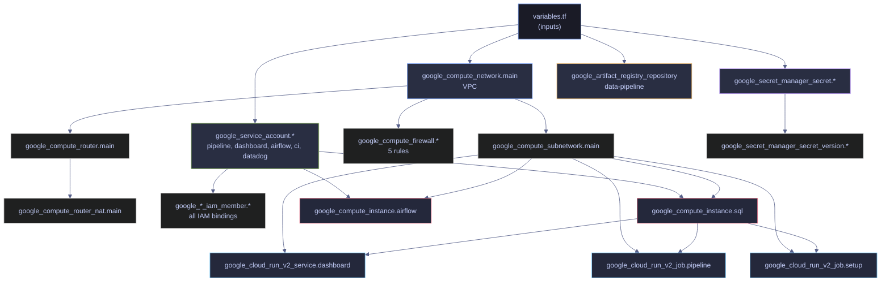

# Terraform Resource Dependencies

> [!quote] Mitchell Hashimoto on the dependency graph
>
> "Terraform allows you to reference the attribute of any resource within any other resource. That's how the dependency graph gets built."
>
> — **Mitchell Hashimoto**, HashiConf talk

Terraform automatically builds a dependency graph from your resource references. Understanding how it works prevents ordering issues during apply and explains why some resources are created in parallel while others wait. To practice dependency graph reasoning and other Terraform scenarios, work through [problems](https://alp78.github.io/elysium/07-Terraform/problems).

## How the Dependency Graph Works

When you reference one resource inside another (e.g., `network = google_compute_network.main.id`), Terraform records that dependency. During `terraform plan`, Terraform builds a directed acyclic graph (DAG) of all resources in the configuration, then walks the graph to determine the correct operation order. During `terraform apply`:

- Resources with no dependencies are created **immediately and in parallel**
- Resources with dependencies wait until all their dependencies are created
- Terraform maximizes parallelism — it never waits unnecessarily
- During `terraform destroy`, Terraform walks the same graph **in reverse order** — resources that depend on others are destroyed first, then their dependencies

This is fundamentally different from scripts where you control order with `&&`. Terraform computes the optimal creation and destruction order automatically.

> [!info] Parallelism control
>
> By default, Terraform processes up to **10 resource operations concurrently** (`-parallelism=10`). For large configurations with many independent resources, increasing this value (e.g., `-parallelism=30`) can speed up applies. For rate-limited APIs, decrease it to avoid `429 Too Many Requests` errors. Set it on any walk command: `terraform apply -parallelism=20` or `terraform destroy -parallelism=5`.

The following diagram shows the effective dependency graph for a typical GCP data engineering project. Resources at the same horizontal level with no edges between them are created in parallel. Service accounts, the VPC, secrets, and the Artifact Registry all have no dependencies on each other — Terraform creates all of them simultaneously.



## Implicit Dependencies

The most common way to create a dependency is by referencing a resource attribute. When Terraform encounters an attribute reference like `google_compute_network.main.id`, it records a dependency edge in the graph: the referencing resource depends on the referenced resource.

### Attribute References

*Create a subnet that implicitly depends on the VPC via the `network` attribute reference.*

```hcl
resource "google_compute_subnetwork" "main" {
  name          = "data-pipeline-subnet"
  ip_cidr_range = "10.0.0.0/24"
  region        = var.region
  network       = google_compute_network.main.id
}
```

The `network` argument references `google_compute_network.main.id`, which tells Terraform: "this subnet needs the VPC to exist first, and I need its ID." Terraform will:
1. Create the VPC (`google_compute_network.main`)
2. Wait for the VPC to finish and capture its `id` output attribute
3. Create the subnet with the resolved ID

The three most common attribute reference patterns in the GCP provider:

| Reference Pattern | What It Returns | Example Value |
|---|---|---|
| `resource_type.name.id` | The resource's full GCP resource path | `projects/data-pipeline-.../networks/data-pipeline-vpc` |
| `resource_type.name.name` | The GCP-visible name | `data-pipeline-vpc` |
| `resource_type.name.email` | Service account email | `data-pipeline-pipeline@<project>.iam.gserviceaccount.com` |

### Traversing Nested Attributes

Resource attributes can be nested several levels deep. Use bracket notation to traverse lists:

*Extract the SQL VM's private IP and the Airflow VM's public IP from nested resource attributes.*

```hcl
locals {
  sql_ip     = google_compute_instance.sql.network_interface[0].network_ip
  airflow_ip = google_compute_instance.airflow.network_interface[0].access_config[0].nat_ip
}
```

Breaking down the traversal for the SQL VM's private IP:

- `google_compute_instance.sql` — the resource
- `.network_interface` — a list of network interfaces (most VMs have one)
- `[0]` — the first (and only) interface
- `.network_ip` — the private IP assigned from the subnet

For the Airflow VM's public IP:

- `.access_config` — a list of access configs (the empty `access_config {}` block in the Terraform config)
- `[0]` — the first access config
- `.nat_ip` — the ephemeral public IP assigned by GCP

These locals are then used in Cloud Run environment variables, creating an implicit dependency chain: Cloud Run depends on the SQL VM existing because it needs the private IP.

## Explicit Dependencies

Sometimes a dependency exists that Terraform cannot see from resource attribute references alone. The `depends_on` meta-argument lets you declare these hidden dependencies explicitly.

### depends_on

*Declare an explicit ordering dependency on the pipeline service account.*

```hcl
resource "google_project_iam_member" "pipeline_bq_access" {
  project = var.project_id
  role    = "roles/bigquery.dataEditor"
  member  = "serviceAccount:${google_service_account.pipeline.email}"

  depends_on = [google_service_account.pipeline]
}
```

In this example, the `member` interpolation already creates an implicit dependency on `google_service_account.pipeline`, making the `depends_on` redundant. The real use cases for `depends_on` are:

- When a dependency exists through data that Terraform does not track (e.g., a resource that must exist before an external API call succeeds)
- When ordering is required but no attribute reference expresses it (e.g., an IAM binding must propagate before a Cloud Run service can start)
- When a `data` source reads from a resource indirectly — the data source does not reference the resource, but the resource must exist first for the data source query to return results

> [!warning] `depends_on` is a last resort
>
> Overusing `depends_on` creates unnecessary serialization, slowing down your apply. Every `depends_on` edge forces Terraform to wait even when it could otherwise parallelize. Use resource references wherever possible — they both express the dependency AND give you the attribute value.

> [!success] Safe pattern — prefer implicit dependencies via references
>
> Let resource attribute references drive the dependency graph. Instead of `depends_on = [google_service_account.pipeline]`, use `member = "serviceAccount:${google_service_account.pipeline.email}"` — this both expresses the dependency and provides the value. Reserve `depends_on` for cases where a dependency exists through external state or data sources that Terraform cannot track.

### Data Source Dependencies

`data` blocks participate in the dependency graph the same way as `resource` blocks — if a data source references a resource attribute, Terraform creates an implicit dependency. However, data sources are **read during planning**, which means `depends_on` on a data source forces Terraform to defer the read until the apply phase:

*Defer reading the VM data source until after the VM is created during apply.*

```hcl
data "google_compute_instance" "sql" {
  name    = "sql-server-vm"
  zone    = var.zone

  depends_on = [google_compute_instance.sql]
}
```

Without `depends_on`, Terraform would attempt to read this data source during `plan` — before the VM exists. The explicit dependency tells Terraform: "wait until the VM is created during apply, then read its attributes."

> [!tip] When data sources need `depends_on`
>
> If a data source queries a resource that Terraform itself creates in the same configuration, you almost certainly need `depends_on`. If the data source queries a resource that already exists outside your Terraform configuration, `depends_on` is unnecessary.

## Visualizing the Dependency Graph

Terraform can export the dependency graph in DOT format for visualization with Graphviz.

### terraform graph Command

*Export the dependency graph as SVG using Graphviz.*

```bash
terraform graph | dot -Tsvg > graph.svg
```

This generates an SVG image of the full resource dependency graph. To view the raw text DAG without Graphviz:

*Print the raw DAG text to stdout.*

```bash
terraform graph
```

The `-type` flag controls which graph to display: `terraform graph -type=plan` (default — shows the plan graph), `terraform graph -type=apply` (the apply-time graph), or `terraform graph -type=destroy` (the reverse-order destruction graph). Add `-draw-cycles` to highlight cyclic edges when diagnosing circular dependency errors. The output shows every resource as a node and every dependency as a directed edge.

> [!tip] Debugging dependency issues
>
> When a resource is being created or destroyed in an unexpected order, generate the graph and look for missing or extra edges. A missing edge means Terraform does not know about a dependency you expect. An extra edge (often from `depends_on`) means unnecessary serialization.

## Circular Dependencies

Terraform will fail with a clear error if it detects a circular dependency — resource A depends on B, and B depends on A, forming a cycle in the DAG.

> [!danger] Circular dependency error
>
> ```text
> Error: Cycle: google_compute_instance.a, google_compute_instance.b
> ```
>
> Terraform cannot resolve a cycle and will refuse to plan or apply. This error always indicates a design problem in your configuration, not a Terraform bug.

> [!success] Breaking dependency cycles
>
> Common causes and fixes:
> - **Two resources referencing each other's IDs** — restructure so only one holds the reference, or introduce an intermediate resource (e.g., a `locals` block or a third resource that both depend on).
> - **A module that outputs a value its own input depends on** — extract the shared value into a separate module or use a `data` source.
> - **`depends_on` creating a hidden cycle** — remove the explicit dependency and find an alternative ordering mechanism.

## Resource Replacement and Cascading Recreation

Some changes can be applied in-place (updating an attribute without recreating the resource). Others require Terraform to destroy and recreate the resource, which is called **force-replacement**. The `terraform plan` output marks these with `-/+` (destroy then create) or `+/-` (create then destroy, when `create_before_destroy` is set).

| Change Type | Terraform Behavior | Plan Symbol |
|---|---|---|
| Update `description` or `labels` | In-place update | `~` |
| Change `machine_type` on a VM | Destroy + recreate | `-/+` |
| Change `image` on `boot_disk` | Destroy + recreate | `-/+` |
| Add a new `env` variable to Cloud Run | New revision (zero-downtime) | `~` |
| Change `location` on a BigQuery dataset | Destroy + recreate (data loss) | `-/+` |

> [!warning] Forced recreation propagates through the graph
>
> If resource A is destroyed and recreated, it gets a new `id`. Any resource B that references `A.id` will also be updated or recreated to use the new value. This cascade can be surprising — force-replacing a VPC triggers recreation of all subnets, firewalls, VMs, and Cloud Run services that reference it.

> [!success] Safe pattern — lifecycle meta-arguments
>
> For stable foundational resources (VPCs, subnets, service accounts), add `lifecycle { prevent_destroy = true }` to block accidental Terraform-driven destruction. For mutable attributes managed outside Terraform (e.g., `labels` set by other tools), use `lifecycle { ignore_changes = [labels] }`. Always run `terraform plan` and inspect `-/+` lines before every apply to detect unexpected recreation cascades.

### replace_triggered_by

Introduced in **Terraform 1.2**, `replace_triggered_by` is a lifecycle meta-argument that forces a resource to be replaced when a referenced resource or attribute changes, even if the resource's own arguments have not changed:

*Force a new Cloud Run deployment whenever the database password secret version changes.*

```hcl
resource "google_cloud_run_v2_service" "dashboard" {
  name     = "dashboard"
  location = var.region

  lifecycle {
    replace_triggered_by = [
      google_secret_manager_secret_version.db_password.id
    ]
  }
}
```

When the secret version changes (a new version is created), Cloud Run gets a new deployment even though its own configuration did not change. This is useful for resources that consume external state — the dependency exists but Terraform would not otherwise detect the need for replacement. Note that `replace_triggered_by` only accepts references to **managed resources** — plain `local` values and input `variable` references are not valid. To trigger on a plain value change, wrap it in a `terraform_data` resource and reference that instead.

## Refactoring Dependencies with moved Blocks

Introduced in **Terraform 1.1**, `moved` blocks let you rename or reorganize resources in your configuration without destroying and recreating them. When you refactor resource names, module paths, or move resources between modules, Terraform normally sees the old name as "deleted" and the new name as "created." A `moved` block tells Terraform that these are the same resource:

*Tell Terraform the resource was renamed, not deleted and recreated.*

```hcl
moved {
  from = google_compute_instance.main
  to   = google_compute_instance.sql
}
```

Terraform updates the state to reflect the new address without any infrastructure changes. The dependency graph is recalculated using the new names. Remove the `moved` block after everyone on the team has applied it — removing it before that point is a breaking change (anyone who hasn't applied will see a destroy + create instead of a rename).

> [!warning] `moved` blocks do not handle cross-state moves
>
> `moved` blocks only work within a single Terraform state file. To move a resource between separate state files (e.g., splitting a monolith into modules with their own state), use `terraform state mv` with the `-state` and `-state-out` flags.

> [!success] Safe refactoring pattern
>
> 1. Add the `moved` block with `from` and `to` addresses.
> 2. Rename the resource in the configuration to match the `to` address.
> 3. Run `terraform plan` — it should show `# has moved to` with zero infrastructure changes.
> 4. Apply, then remove the `moved` block in the next commit.

## Related

**Terraform Patterns:**
- [conditional-resources](https://alp78.github.io/elysium/07-Terraform/Patterns/conditional-resources) — how `count` and `for_each` interact with the dependency graph
- [module-composition](https://alp78.github.io/elysium/07-Terraform/Patterns/module-composition) — module boundaries and inter-module dependency passing

**Terraform Fundamentals:**
- [plan-apply-destroy](https://alp78.github.io/elysium/07-Terraform/Fundamentals/plan-apply-destroy) — reading the plan to understand what will be created, updated, or destroyed
- [hcl-syntax-basics](https://alp78.github.io/elysium/07-Terraform/Fundamentals/hcl-syntax-basics) — HCL syntax for resource references and attribute access
- [state-management](https://alp78.github.io/elysium/07-Terraform/Fundamentals/state-management) — how state tracks the real resource IDs that references resolve to

**GCP Services:**
- [service-accounts-and-iam](https://alp78.github.io/elysium/06-GCP/Security/service-accounts-and-iam) — IAM bindings and service accounts referenced in the dependency graph

**CI/CD:**
- [github-actions-ci-cd](https://alp78.github.io/elysium/10-GitHub-Actions/github-actions-ci-cd) — CI/CD pipelines running `terraform plan` and `terraform apply`

## References

- [Terraform Resource Graph — Internals](https://developer.hashicorp.com/terraform/internals/graph)
- [Terraform depends_on — Meta-Argument](https://developer.hashicorp.com/terraform/language/meta-arguments/depends_on)
- [Terraform lifecycle — Meta-Arguments](https://developer.hashicorp.com/terraform/language/meta-arguments/lifecycle)
- [Terraform moved Blocks](https://developer.hashicorp.com/terraform/language/moved)
- [Terraform graph Command](https://developer.hashicorp.com/terraform/cli/commands/graph)
