# Module Composition

> [!quote]+
>
> "You can use modules to further split up your configuration as well as parameterize it. The goal is giving you enough options so it isn't overwhelming complexity."
>
> — **Mitchell Hashimoto**, HashiConf talk

> [!abstract]- Summary
>
> Module Composition is the Terraform note for building reusable infrastructure from stable interfaces instead of copy-pasted directories: it explains root and child modules, environment promotion, module sources, module iteration, remote-state coupling, testing, and the refactor traps that can destroy infrastructure when module addresses change carelessly.
>
> **Module foundations**
> - covers root versus child modules, module call syntax, directory structure, and why modules are the main Terraform mechanism for reuse and composable design
>
> **Multi-environment design**
> - covers dev / staging / prod patterns, environment promotion, module inputs and outputs, source selection, and using module blocks to keep environments structurally aligned
>
> **Advanced composition patterns**
> - covers `for_each` on modules, remote-state data sources, when to extract a module at all, and the trade-offs between one root, multiple roots, and separate environment directories
>
> **Testing and refactoring**
> - covers native Terraform tests with `.tftest.hcl`, mock providers, module test strategy, `moved` blocks, source-change reinitialization, and the failure modes that show up during module refactors or circular module references
>
> **Operations and safety**
> - When to extract: when a pattern appears in multiple configurations, when a group of resources forms a coherent unit, and when a stable interface is valuable
> - When not to extract: when the code is single-use, when the module adds more indirection than reuse value, or when the interface would simply mirror the underlying resource arguments
> - Warnings: community modules carry trust risk, module `for_each` keys must be known at plan time, remote state can expose sensitive data, moving resources into modules without `moved` blocks causes destructive recreations, module source changes require re-init, and circular module references are invalid
> - Recommendations: avoid copy-paste environment trees, pin module sources or versions, prefer declarative `moved` blocks for refactors, use dedicated least-privilege access for remote state, and add fast plan-based module tests before relying on modules across environments

> [!note]- Glossary
>
> **Module**
> - A directory of Terraform configuration that exposes a reusable interface through variables and outputs.
> - It matters because module composition is Terraform's main abstraction mechanism for sharing infrastructure patterns without copy-pasting full configurations.
>
> > [!info] Modules are Terraform's reuse primitive
> >
> > Terraform does not have classes or inheritance in the usual programming-language sense. Modules are the idiomatic way to package and reuse infrastructure logic.
>
> ---
>
> **Root module**
> - The Terraform module in the directory where you run Terraform commands directly.
> - It matters because the root module orchestrates child modules, owns the state boundary, and usually defines the environment-specific entrypoint.
>
> > [!info] Every Terraform configuration has one
> >
> > Even a flat directory with no `module` blocks is still a module: the root module. Composition starts from understanding that Terraform always evaluates from one root context.
>
> ---
>
> **Child module**
> - A module called from another module through a `module` block.
> - It matters because child modules are how shared infrastructure patterns are encapsulated and reused across environments or stacks.
>
> > [!warning] Child modules still live in the same graph
> >
> > Calling a child module does not create an independent Terraform universe. The child's resources become part of the overall graph evaluated from the root.
>
> ---
>
> **Module interface**
> - The set of input variables and output values that define how callers interact with a module.
> - It matters because the value of a module depends on having a stable, understandable contract rather than just hiding code in another directory.
>
> > [!warning] Poor interfaces turn reuse into friction
> >
> > If a module leaks too many low-level knobs or returns unclear outputs, callers get the indirection cost without much abstraction benefit. Good module design is mostly interface design.
>
> ---
>
> **Module source**
> - The location Terraform uses to load a module, such as a relative path, Git URL, object-store path, or Terraform Registry address.
> - It matters because source choice affects trust, versioning, and how reproducibly a module can be initialized across machines and CI.
>
> > [!warning] Source changes are operational changes
> >
> > Modifying a module `source` is not a harmless string edit. Terraform needs to reinitialize the module installation, and the new source may bring materially different code into the graph.
>
> ---
>
> **Environment promotion**
> - The practice of moving the same module pattern through dev, staging, and prod by changing input values instead of rewriting infrastructure per environment.
> - It matters because modules are meant to keep environments structurally aligned while still allowing controlled value differences.
>
> > [!info] Promotion works only when parity is real
> >
> > If each environment drifts into its own bespoke directory, promotion becomes mostly aspirational. Reusing the same module is what gives promotion its discipline.
>
> ---
>
> **`for_each` on module blocks**
> - A Terraform pattern for instantiating a child module multiple times from a keyed collection.
> - It matters because multi-environment or multi-tenant infrastructure often needs repeated module instances without copy-pasted module blocks.
>
> > [!warning] Keys must be known before apply
> >
> > Just like resource `for_each`, module-instance keys must be available at plan time. Unknown keys block Terraform from determining how many module instances exist.
>
> ---
>
> **Remote state data source**
> - A Terraform data source pattern for reading outputs from another Terraform state file.
> - It matters because modules and stacks sometimes need to consume infrastructure facts produced in a different state boundary.
>
> > [!warning] Remote state is also a data-exposure path
> >
> > State files can contain sensitive values, so reading remote state should be treated as privileged access. The convenience of output sharing does not remove the need for least-privilege controls.
>
> ---
>
> **`.tftest.hcl`**
> - Terraform's native test-file format for module tests executed with `terraform test`.
> - It matters because module composition scales better when modules have fast automated checks for naming, logic, and conditional behavior.
>
> > [!info] Tests are part of module quality
> >
> > Reusable modules become shared infrastructure dependencies. That makes even lightweight plan-based tests valuable before a module is trusted across multiple environments.
>
> ---
>
> **Mock provider**
> - A Terraform testing feature that substitutes provider responses during tests so real cloud APIs are not always required.
> - It matters because module tests become faster and safer when they do not need full cloud credentials for every assertion.
>
> > [!info] Good for unit-style Terraform tests
> >
> > Mock providers make it possible to test interface and logic behavior without treating every module test as a live integration test against GCP.
>
> ---
>
> **`moved` block**
> - A Terraform language feature that preserves resource identity across address changes during refactors.
> - It matters because moving resources into or out of modules changes addresses, and Terraform otherwise interprets that as destroy-and-recreate.
>
> > [!danger] Refactors can destroy stateful infrastructure
> >
> > Module extraction feels like a structural cleanup, but Terraform sees addresses, not intentions. Without `moved` blocks, a refactor can become a destructive infrastructure event.
>
> ---
>
> **Circular module reference**
> - A dependency loop where two modules depend on each other directly or indirectly, making Terraform's graph unsolvable.
> - It matters because module composition increases abstraction, and with that abstraction comes a greater risk of accidentally creating cycles across module boundaries.
>
> > [!warning] Composition can reintroduce graph problems
> >
> > Modules make code cleaner, but they do not remove dependency rules. A cleaner directory structure still fails if the module relationships form a cycle.
>
> ---
>
> **Version pinning**
> - The practice of constraining a module source or registry version so callers do not consume arbitrary upstream changes by accident.
> - It matters because reused modules become shared dependencies, and unpinned updates can change infrastructure behavior across environments unexpectedly.
>
> > [!info] Reuse demands repeatability
> >
> > The more widely a module is reused, the more important controlled upgrades become. Pinning keeps module adoption deliberate instead of accidental.

> [!tip] The core principle
>
> Never copy-paste `.tf` files between environments. Extract common patterns into modules. Promote from dev → staging → prod by applying the same module with different variables.

Without modules, you end up with nearly identical `dev/` and `prod/` directories that diverge over time. A bug fixed in `prod` may not get back-ported to `dev`. A new resource added to `dev` may never reach `prod`. Modules force the configurations to stay in sync.

## Module Basics

A Terraform module is any directory containing `.tf` files. Every Terraform configuration has at least one module — the **root module**, which is the directory where you run `terraform apply`. **Child modules** are directories called from the root via a `module` block. Terraform downloads or links the child module during `terraform init`, then evaluates it as part of the overall configuration graph during `plan` and `apply`.

*Call the pipeline-env child module with environment-specific variables.*

```hcl
module "pipeline_env" {
  source     = "./modules/pipeline-env"
  env        = "prod"
  project_id = var.project_id
  region     = var.region
}
```

| Argument | Required | Description |
|---|---|---|
| `source` | Yes | Path to the module directory (relative to the calling `.tf` file). Accepts local paths, Git URLs, S3/GCS bucket paths, or Terraform Registry addresses. |
| `env` | Yes | An input variable defined in the module's `variables.tf`. Passed from the caller to parameterize the module. |
| `project_id` | Yes | Forwarded from the root module's own variables to the child module. |
| `region` | Yes | Forwarded from the root module's own variables to the child module. |

## Module Directory Structure

A typical modular Terraform project separates the root module (which orchestrates) from child modules (which encapsulate resource groups). Each child module has its own `variables.tf` for inputs and `outputs.tf` for values the caller can reference. The `terraform.tfvars` file at the root level should be gitignored since it often contains secrets or environment-specific values.

*Standard modular Terraform project layout with root and child modules.*

```text
infra/
├── main.tf                   # Root module — calls child modules
├── variables.tf              # Root input variables
├── outputs.tf                # Root outputs
├── terraform.tfvars          # Variable values (gitignored)
│
└── modules/
    ├── pipeline-env/         # Module for one environment's pipeline infra
    │   ├── main.tf           # Resources: Pub/Sub, BigQuery, Cloud Run job
    │   ├── variables.tf      # Input variables: env, project_id, region
    │   └── outputs.tf        # Outputs: job_name, dataset_ids
    │
    └── networking/           # Module for VPC + subnet + NAT
        ├── main.tf           # Resources: VPC, subnet, router, NAT
        ├── variables.tf      # Input: project_id, region, cidr
        └── outputs.tf        # Output: subnet_id, network_id
```

## Multi-Environment with Modules

The core use case for modules is managing multiple environments (dev, staging, prod) from a single codebase. The root module calls the same child module multiple times, passing different variable values for each environment. This guarantees structural parity — every environment gets the same resources, configured identically except for the values that should differ.

### Module Call Block

The root `main.tf` instantiates the child module once per environment. Each `module` block gets a unique label (`"dev"`, `"prod"`) that becomes part of the Terraform resource address.

*Instantiate the pipeline module once per environment with different variable values.*

```hcl
module "dev" {
  source     = "./modules/pipeline-env"
  env        = "dev"
  project_id = var.project_id
  region     = var.region
}

module "prod" {
  source     = "./modules/pipeline-env"
  env        = "prod"
  project_id = var.project_id
  region     = var.region
}
```

### Module Input Variables

The child module declares its own input variables. These act as the module's public API — the caller must supply values for any variable without a `default`. The `env` variable is the key differentiator that parameterizes all resource names and configurations within the module.

*Declare the child module's input variables — its public API.*

```hcl
# modules/pipeline-env/variables.tf
variable "env" {
  description = "Environment name (dev, staging, prod)"
  type        = string
}

variable "project_id" {
  description = "GCP project ID"
  type        = string
}

variable "region" {
  description = "GCP region"
  type        = string
  default     = "europe-west1"
}
```

### Parameterized Resources

Inside the child module, every resource uses `var.env` to generate unique names and labels. This ensures that `dev` and `prod` resources never collide — each gets its own BigQuery dataset, Pub/Sub topic, and Cloud Run job. The resources within a module can reference each other directly (e.g., the Cloud Run job reads the dataset ID from the BigQuery resource).

*Use `var.env` to generate unique resource names per environment.*

```hcl
# modules/pipeline-env/main.tf
resource "google_bigquery_dataset" "pipeline" {
  dataset_id    = "pipeline_${var.env}"
  friendly_name = "Pipeline — ${title(var.env)}"
  location      = "EU"
}

resource "google_pubsub_topic" "events" {
  name = "pipeline-events-${var.env}"

  labels = {
    environment = var.env
    managed-by  = "terraform"
  }
}

resource "google_cloud_run_v2_job" "pipeline" {
  name     = "pipeline-${var.env}"
  location = var.region

  template {
    template {
      containers {
        image = "${var.region}-docker.pkg.dev/${var.project_id}/pipeline/runner:latest"

        env {
          name  = "ENV"
          value = var.env
        }

        env {
          name  = "BQ_DATASET"
          value = google_bigquery_dataset.pipeline.dataset_id
        }
      }
    }
  }
}
```

### Module Outputs

Outputs expose values from the child module to the caller. Only explicitly declared outputs are accessible — the caller cannot reach into the module's internal resources directly. This encapsulation is intentional: it creates a stable interface that can change internally without breaking callers.

*Expose child module values to the calling root module.*

```hcl
# modules/pipeline-env/outputs.tf
output "job_name" {
  value = google_cloud_run_v2_job.pipeline.name
}

output "dataset_id" {
  value = google_bigquery_dataset.pipeline.dataset_id
}

output "topic_name" {
  value = google_pubsub_topic.events.name
}
```

### Referencing Module Outputs

The root module accesses child module outputs using the `module.<label>.<output_name>` syntax. These can be used in root-level outputs, passed to other modules, or referenced by other resources in the root.

*Access child module outputs using `module.<label>.<output_name>` syntax.*

```hcl
# root outputs.tf
output "prod_job_name" {
  value = module.prod.job_name
}

output "dev_dataset_id" {
  value = module.dev.dataset_id
}
```

## Environment Promotion

With modules, promoting infrastructure from dev to prod is a variable change — the same module code runs with different inputs. There are two structural approaches to multi-environment management.

### Single Root with Variable Override

Apply the same root module with a `-var` flag to target different environments. This is the simplest approach but means all environments share one state file unless you use workspaces.

*Apply targeting the dev environment.*

```bash
terraform apply -var="env=dev"
```

After validating dev, promote to prod by applying with a different variable value.

*Promote to prod by applying with a different variable value.*

```bash
terraform apply -var="env=prod"
```

### Directory-per-Environment

Each environment gets its own directory with its own `main.tf` and `terraform.tfvars`. All directories call the same child module. This provides complete state isolation — each environment has its own state file, so a failed `apply` in dev cannot affect prod state.

*Directory-per-environment layout for full state isolation.*

```text
environments/
├── dev/
│   ├── main.tf
│   └── terraform.tfvars
└── prod/
    ├── main.tf
    └── terraform.tfvars
```

> [!question] Single root vs directory-per-environment
>
> **Single root** is simpler and avoids code duplication, but all environments share state unless you use workspaces. **Directory-per-environment** provides full isolation at the cost of repeating the `module` block and backend config in each directory. For production workloads, directory-per-environment is the safer default — a mistyped `terraform destroy` in a shared-state setup can take down prod.

## Module Sources

The `source` argument in a `module` block determines where Terraform fetches the child module from. Terraform supports local paths, Git repositories, the public Terraform Registry, private registries, and cloud storage (S3, GCS). The source type determines whether the `version` argument is available and how Terraform resolves updates during `terraform init`.

### Local Path

Local modules use a relative path. No version argument is needed — the module is read directly from disk. Changes take effect on the next `plan` without running `init` again.

*Reference a local child module by relative path.*

```hcl
module "pipeline_env" {
  source = "./modules/pipeline-env"
}
```

### Terraform Registry

Modules from the public or a private registry support the `version` argument for constraint-based pinning. Terraform downloads the module during `init` and caches it in `.terraform/modules/`.

*Use a Terraform Registry module with pessimistic version pinning.*

```hcl
module "gcs_buckets" {
  source  = "terraform-google-modules/cloud-storage/google"
  version = "~> 5.0"

  project_id = var.project_id
  names      = ["data-bronze", "data-silver", "data-gold"]
  location   = var.region
}
```

### Git Repository

For internal modules not published to a registry, use a Git URL with a `ref` query parameter to pin to a tag, branch, or commit SHA. The `version` argument is not supported for Git sources — use `ref` instead.

*Pin an internal Git module to a specific tag.*

```hcl
module "internal_vpc" {
  source = "git::https://github.com/org/terraform-modules.git//networking?ref=v2.1.0"
}
```

### Version Constraints

Version constraints control which module versions are acceptable. After changing `source` or `version`, run `terraform init -upgrade` to fetch the new version.

| Constraint | Allows |
|---|---|
| `= 1.2.3` | Exactly `1.2.3` |
| `>= 1.2.0` | `1.2.0` and above |
| `~> 1.2` | `1.2.x` up to (not including) `2.0` |
| `~> 1.2.0` | `1.2.0` – `1.2.x` only (patch-level) |
| `>= 1.0, < 2.0` | Combined range |

> [!tip] Version pinning strategy
>
> Use `~>` (pessimistic constraint) for root modules — it pins major+minor and allows patch upgrades. For reusable child modules consumed by others, declare only a minimum bound (`>= 1.0.0`) and let the caller control the upper range. Pre-release versions (e.g., `1.3.0-beta`) require an exact `= 1.3.0-beta` constraint — `~>` and `>=` do not match them.

> [!warning] Community module risk
>
> Terraform Registry modules add an external dependency. A breaking change in a community module can disrupt your `apply` if you use an unconstrained version.

> [!success] Mitigation
>
> Always pin to a version range (`~> 5.0`). For core infrastructure, writing your own modules gives you full understanding and control. Audit community module source code before adopting.

## for_each on Module Blocks

Since Terraform 0.13, `module` blocks support `for_each`, enabling dynamic creation of module instances from a map or set. This eliminates the need to repeat `module` blocks for each environment — instead, define environments as data and let Terraform iterate.

*Define environments as data and iterate with `for_each` on the module block.*

```hcl
variable "environments" {
  type = map(object({
    region   = string
    is_prod  = bool
  }))
  default = {
    dev  = { region = "europe-west1", is_prod = false }
    prod = { region = "europe-west1", is_prod = true }
  }
}

module "pipeline" {
  source   = "./modules/pipeline-env"
  for_each = var.environments

  env        = each.key
  region     = each.value.region
  project_id = var.project_id
}
```

Each instance is addressed as `module.pipeline["dev"]` or `module.pipeline["prod"]`. To reference all outputs as a map, use a `for` expression.

*Output all job names as a map across module instances.*

```hcl
output "job_names" {
  value = { for env, mod in module.pipeline : env => mod.job_name }
}
```

> [!info] Terraform 0.13+ required
>
> `for_each` and `count` on `module` blocks were introduced in Terraform 0.13. Earlier versions require a separate `module` block per instance.

> [!warning] All keys must be known at plan time
>
> The `for_each` map keys must be deterministic — they cannot depend on values computed during `apply` (e.g., a resource ID). If keys are unknown, Terraform cannot build the dependency graph and will fail with `"for_each" map includes keys derived from resource attributes that cannot be determined until apply`.

> [!success] Safe pattern
>
> Use static maps defined in variables, locals, or `tfvars` files. If you need dynamic keys, derive them from data sources that resolve during `plan`, not from resource outputs.

## Remote State Data Source

When infrastructure is split across multiple state files (e.g., networking in one workspace, application resources in another), the `terraform_remote_state` data source reads outputs from another workspace's state. This enables cross-workspace composition without tightly coupling the configurations.

*Read outputs from another workspace's state file via GCS backend.*

```hcl
data "terraform_remote_state" "network" {
  backend = "gcs"
  config = {
    bucket = "my-project-tf-state"
    prefix = "networking/prod"
  }
}

resource "google_compute_instance" "app" {
  subnetwork = data.terraform_remote_state.network.outputs.subnet_self_link
}
```

> [!info] Only root outputs are accessible
>
> The `terraform_remote_state` data source can only read `output` values declared in the remote root module — not arbitrary resource attributes. Design your outputs as the public API of each state file.

> [!warning] State file contains sensitive data
>
> The reader needs full read access to the remote state file, which may contain sensitive output values in plaintext. Ensure the GCS bucket has appropriate IAM restrictions.

> [!success] Least-privilege access
>
> Use a dedicated service account with `roles/storage.objectViewer` on the specific state bucket prefix, not broad project-level access.

## When to Extract a Module

Knowing when to extract a module is as important as knowing how. Premature extraction adds complexity without reuse benefit, while delayed extraction leads to copy-paste drift.

Extract code into a module when:

1. The same pattern appears in 2+ configurations
2. A group of resources forms a logical unit (e.g., "a pipeline environment" = BigQuery + Pub/Sub + Cloud Run)
3. You want to provide a stable interface to a complex configuration

> [!tip] Related pattern
>
> Module composition in Terraform mirrors [software design patterns](https://alp78.github.io/elysium/02-Programming-Languages/Python/18_py_designpatterns) like facade (a module hides complexity behind a simple interface) and composition over inheritance (combining small modules rather than building monolithic configs).

Do NOT extract when:

- It is only used once and there is no plan for reuse
- The extraction adds complexity without reuse benefit
- The module's inputs/outputs would be nearly identical to the resource's own arguments

## Module Testing

Terraform 1.5+ introduced native test support via `.tftest.hcl` files, enabling validation of module behavior without external frameworks. Test files live in a `tests/` directory alongside the module and execute sequential `run` blocks against real or mocked providers.

*Validate module naming conventions and location assignment using plan-only assertions.*

```hcl
# tests/pipeline.tftest.hcl
variables {
  env        = "test"
  project_id = "test-project"
  region     = "europe-west1"
}

run "validates_dataset_naming" {
  command = plan

  assert {
    condition     = google_bigquery_dataset.pipeline.dataset_id == "pipeline_test"
    error_message = "Dataset ID should follow pipeline_{env} naming pattern"
  }
}

run "validates_job_location" {
  command = plan

  assert {
    condition     = google_cloud_run_v2_job.pipeline.location == "europe-west1"
    error_message = "Job location should match the region variable"
  }
}
```

Run tests with `terraform test` from the module directory. Each test file gets a fresh state that is destroyed after all `run` blocks complete.

> [!info] Terraform 1.7+ mock providers
>
> `mock_provider` blocks (Terraform 1.7+) replace provider API calls with computed defaults, enabling unit-style tests that require no cloud credentials.

> [!tip] Testing strategy
>
> Use `command = plan` for fast validation of naming conventions, variable logic, and conditional resource creation. Use `command = apply` (the default) only when you need to verify that resources actually provision correctly — these tests are slower and require real credentials and a sandbox project.

## Common Pitfalls

Module composition introduces failure modes that do not exist in flat configurations. Understanding these prevents accidental resource destruction during refactoring.

### Refactoring Destroys Resources

If you move a resource into or out of a module, Terraform sees it as a new resource at a different address. On the next `apply`, it will destroy the old resource and create a new one — even though nothing changed in the cloud.

> [!danger] Data loss from module refactoring
>
> Moving `google_bigquery_dataset.bronze` to `module.dev.google_bigquery_dataset.pipeline` without updating state causes Terraform to destroy the existing dataset (and all its data) then recreate it under the new address.

> [!success] Use `moved` blocks (Terraform 1.1+)
>
> Declare a `moved` block to tell Terraform the resource changed address without changing identity. This is declarative, reviewable in PRs, and tracked in version control — unlike the imperative `terraform state mv` command.

*Map the old resource address to its new module-scoped address.*

```hcl
moved {
  from = google_bigquery_dataset.bronze
  to   = module.dev.google_bigquery_dataset.pipeline
}
```

The `moved` block also supports renaming resources, migrating from `count` to `for_each`, and moving between `for_each` keys.

*Rename a `for_each` module key without destroying infrastructure.*

```hcl
moved {
  from = module.pipeline["development"]
  to   = module.pipeline["dev"]
}
```

> [!info] Keep `moved` blocks permanently
>
> Removing a `moved` block causes Terraform to treat the `from` address as a new resource to be destroyed. Keep `moved` blocks in your configuration indefinitely, or remove them only after all environments have been migrated and the old state entries no longer exist.

### Module Source Changes Require Init

> [!warning] Adding a new module or changing `source`
>
> Any change to a module's `source` argument requires running `terraform init` again. Running `terraform plan` without `init` will fail with a "Module not installed" error.

> [!success] Safe workflow
>
> Always run `terraform init -upgrade` after modifying module sources or version constraints. In CI/CD pipelines, run `init` as a mandatory step before `plan`.

### Circular Module References

> [!danger] Circular dependencies
>
> Module A cannot call Module B if Module B calls Module A. Terraform builds a directed acyclic graph (DAG) of all resources — circular references make the graph unsolvable. Terraform detects this during `init` or `plan` and fails with a cycle error.

> [!success] Resolution
>
> Break circular dependencies by extracting shared resources into a third module that both A and B depend on, or use `terraform_remote_state` to read outputs across state boundaries instead of direct module calls.

```mermaid
%%{init: {'theme': 'dark', 'themeVariables': {
  'primaryColor': '#292e42',
  'primaryTextColor': '#c0caf5',
  'primaryBorderColor': '#565f89',
  'lineColor': '#565f89',
  'secondaryColor': '#1a1b26',
  'tertiaryColor': '#24283b',
  'noteTextColor': '#c0caf5',
  'noteBkgColor': '#292e42',
  'textColor': '#c0caf5',
  'fontSize': '14px'
}}}%%
flowchart TD
    ROOT["Root Module<br/>main.tf / variables.tf / outputs.tf"]

    ROOT -->|"env = dev"| DEV["module.pipeline_dev"]
    ROOT -->|"env = prod"| PROD["module.pipeline_prod"]
    ROOT -->|"source = ./modules/networking"| NET["module.networking"]

    subgraph "Child Module: pipeline-env"
        DEV --> BQ_D["google_bigquery_dataset"]
        DEV --> PS_D["google_pubsub_topic"]
        DEV --> CR_D["google_cloud_run_v2_job"]
    end

    subgraph "Child Module: pipeline-env "
        PROD --> BQ_P["google_bigquery_dataset"]
        PROD --> PS_P["google_pubsub_topic"]
        PROD --> CR_P["google_cloud_run_v2_job"]
    end

    subgraph "Child Module: networking"
        NET --> VPC["google_compute_network"]
        NET --> SUB["google_compute_subnetwork"]
        NET --> NAT["google_compute_router_nat"]
    end

    CR_D -.->|"uses subnet"| SUB
    CR_P -.->|"uses subnet"| SUB

    style ROOT fill:#292e42,stroke:#7aa2f7,stroke-width:2px
    style DEV fill:#24283b,stroke:#9ece6a
    style PROD fill:#24283b,stroke:#f7768e
    style NET fill:#24283b,stroke:#bb9af7
```



## Related

**Terraform chapter:**

- [variables-and-outputs](https://alp78.github.io/elysium/07-Terraform/Fundamentals/variables-and-outputs) — module inputs and outputs use the same variable system
- [plan-apply-destroy](https://alp78.github.io/elysium/07-Terraform/Fundamentals/plan-apply-destroy) — the workflow for applying multi-environment configs
- [state-management](https://alp78.github.io/elysium/07-Terraform/Fundamentals/state-management) — each environment should have its own state
- [resource-dependencies](https://alp78.github.io/elysium/07-Terraform/Patterns/resource-dependencies) — dependencies within and across modules
- [conditional-resources](https://alp78.github.io/elysium/07-Terraform/Patterns/conditional-resources) — `count` and `for_each` patterns used inside modules

**GCP services (Folder 06):**

- [cloud-run-jobs-vs-services](https://alp78.github.io/elysium/06-GCP/Serverless/cloud-run-jobs-vs-services) — Cloud Run job used in the pipeline module example
- [dataset-and-table-management](https://alp78.github.io/elysium/06-GCP/BigQuery/dataset-and-table-management) — BigQuery dataset used in the pipeline module example
- [pubsub-messaging](https://alp78.github.io/elysium/06-GCP/Serverless/pubsub-messaging) — Pub/Sub topic used in the pipeline module example
- [gcs-buckets-and-lifecycle](https://alp78.github.io/elysium/06-GCP/Storage/gcs-buckets-and-lifecycle) — GCS backend for remote state

**CI/CD:**

- [github-actions-ci-cd](https://alp78.github.io/elysium/10-CICD/GitHub-Actions/github-actions-ci-cd) — running `terraform plan` and `apply` in CI pipelines

## Terraform Module Composition References

- [Terraform Modules](https://developer.hashicorp.com/terraform/language/modules)
- [Module Composition](https://developer.hashicorp.com/terraform/language/modules/develop/composition)
- [Module Sources](https://developer.hashicorp.com/terraform/language/modules/sources)
- [Version Constraints](https://developer.hashicorp.com/terraform/language/expressions/version-constraints)
- [moved Block](https://developer.hashicorp.com/terraform/language/moved)
- [terraform_remote_state Data Source](https://developer.hashicorp.com/terraform/language/state/remote-state-data)
- [Terraform Tests](https://developer.hashicorp.com/terraform/language/tests)
- [Terraform Registry](https://registry.terraform.io/)
