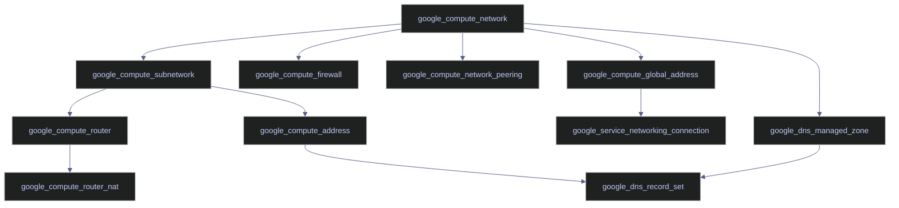
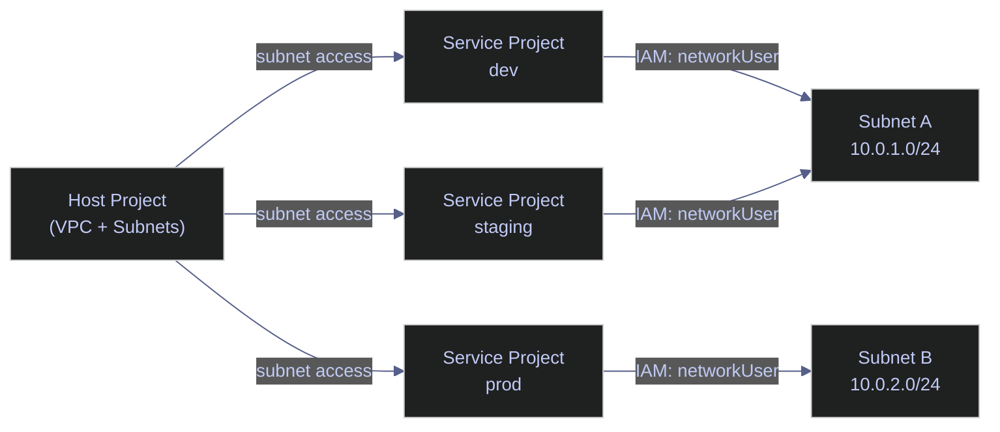

# Foundation and Networking Blocks

> [!quote]+
>
> "No code is the best way to write secure and reliable applications. Write nothing; deploy nowhere."
>
> — **Kelsey Hightower**, Twitter

> [!abstract]- Summary
>
> Foundation and Networking Blocks is the GCP Terraform snippet library for the platform substrate: it collects independently copy-pasteable provider, backend, VPC, subnet, NAT, firewall, addressing, DNS, peering, Shared VPC, and PSC blocks, each meant to be lifted into real configurations with full awareness of the argument and lifecycle trade-offs.
>
> **Foundation blocks**
> - covers provider and backend setup, version pinning, variables, outputs, locals, and the baseline Terraform scaffolding needed before any GCP network resources can be managed
>
> **Core networking blocks**
> - covers VPCs, subnets, Cloud Router, Cloud NAT, firewall rules, and static IP patterns that define the private network shape and traffic posture for later workloads
>
> **Extended connectivity blocks**
> - covers DNS, VPC peering, Shared VPC, and Private Service Connect for multi-network, enterprise, and private-service connectivity use cases
>
> **Library usage and composition**
> - covers the complete stitched example, quick-reference index, and the rule that each block is standalone even when multiple blocks naturally compose into a fuller architecture
>
> **Operations and safety**
> - Warnings: backend state must still be shared safely, auto-mode VPCs create subnets in every region, firewall rules without narrow targeting affect more than intended, unattached static IPs still bill, VPC peering is non-transitive, Shared VPC needs separate IAM after attachment, and PSC requires its API before apply
> - Recommendations: use custom-mode VPCs in production, pin provider versions, validate NAT IP mode decisions, scope allow rules with target tags or identities, reclaim unused static IPs, create explicit peering paths for every required network edge, and enable supporting APIs before using advanced connectivity resources

> [!note]- Glossary
>
> **Atomic block library**
> - A collection of self-contained Terraform snippets designed to be copied into larger configurations without assuming the whole file is applied as one unit.
> - It matters because this note is organized as reusable building blocks, not as one canonical root module to apply unchanged.
>
> > [!info] Standalone does not mean context-free
> >
> > Each snippet is intentionally self-contained, but the surrounding architecture still decides whether the block is safe, sufficient, or compatible with the rest of the environment.
>
> ---
>
> **Provider pinning**
> - The practice of constraining the Terraform provider version so upgrades do not happen silently.
> - It matters because a snippet library is only reliable if the provider schema it assumes stays within a controlled version range.
>
> > [!warning] Libraries need stable provider contracts
> >
> > Copy-pasteable blocks age badly if the provider is allowed to float freely. Version pinning is part of making snippet behavior predictable across teams and time.
>
> ---
>
> **Backend**
> - The Terraform state storage configuration that determines where the source of truth lives and how collaborative runs are coordinated.
> - It matters because foundation snippets are incomplete unless they also establish durable, shared state handling.
>
> > [!warning] Network code without remote state is weak foundation
> >
> > You can provision a VPC with local state, but that is not a strong operational pattern for real teams. The backend is part of the infrastructure baseline, not just Terraform plumbing.
>
> ---
>
> **Custom-mode VPC**
> - A GCP network created without automatic subnet creation in every region.
> - It matters because production network design usually needs explicit control over which regions get address ranges and routing boundaries.
>
> > [!warning] Auto mode spends your address space for you
> >
> > Auto-mode VPCs are convenient for experiments, but they pre-create regional subnets you may not want. That reduces intentionality in network planning.
>
> ---
>
> **Cloud NAT**
> - GCP's managed outbound translation service for private workloads that still need internet or Google API access.
> - It matters because many Terraform-managed workloads should stay off the public internet while still reaching package repositories or managed services.
>
> > [!warning] NAT configuration affects runtime resilience
> >
> > NAT is not just a checkbox for outbound access. IP allocation mode and port behavior influence whether high-concurrency traffic patterns remain healthy under load.
>
> ---
>
> **Firewall rule**
> - A GCP traffic-control object that allows or denies traffic based on direction, protocol, ports, source ranges, and target scope.
> - It matters because the networking library expresses network security posture primarily through firewall blocks.
>
> > [!danger] Broad firewall rules age badly
> >
> > A permissive rule that feels convenient during setup often becomes an invisible liability later. Tight targets and source ranges are the difference between intent and accidental exposure.
>
> ---
>
> **Target tag**
> - A VM-attached label used by firewall rules to decide which instances a rule should affect.
> - It matters because tag targeting is one of the main ways this block library keeps allow rules from applying to every VM in the network.
>
> > [!info] Tags define reachability scope
> >
> > A firewall rule without deliberate targeting can have a far larger blast radius than intended. Tags are a simple but effective way to narrow that scope.
>
> ---
>
> **Static IP**
> - A reserved address that persists independently of any one attached workload.
> - It matters because some integrations, DNS patterns, and allowlists need a stable address rather than an ephemeral assignment.
>
> > [!warning] Stability has a carrying cost
> >
> > Static IPs are useful only when the environment truly needs address stability. Unattached reservations become a cost and inventory-management problem if left behind.
>
> ---
>
> **VPC peering**
> - A private network connection between two VPCs that allows traffic to flow directly between them.
> - It matters because multi-VPC topologies often rely on peering for internal connectivity without exposing resources publicly.
>
> > [!warning] Peering does not transitively chain
> >
> > Peering is pairwise. If three networks all need to communicate, each required edge has to be designed explicitly instead of assumed through an intermediate VPC.
>
> ---
>
> **Shared VPC**
> - A GCP model where one host project owns the network and service projects attach their workloads to that shared network.
> - It matters because enterprise networking often centralizes network control while distributing application ownership across projects.
>
> > [!warning] Attachment still needs IAM completion
> >
> > Putting a project onto a Shared VPC is only part of the design. Subnet and network usage still depend on explicit IAM grants after attachment.
>
> ---
>
> **Private Service Connect**
> - A GCP pattern for reaching supported services privately through internal endpoints instead of public service addresses.
> - It matters because PSC is one of the higher-order private-connectivity blocks in the library and often appears only after simpler VPC patterns are already in place.
>
> > [!warning] Advanced connectivity starts with prerequisites
> >
> > PSC resources fail predictably when the required APIs are not enabled. The block itself can be correct while the platform is still unprepared to host it.

## Foundation Blocks

### Provider and Backend

Use this block at the top of every GCP Terraform project. The `terraform {}` block pins the Terraform CLI version and declares the Google provider version so that upgrades do not happen silently. The `backend "gcs"` block stores state remotely so that the team shares a single source of truth and state locking prevents concurrent runs from corrupting each other. See [Terraform Providers and Backend](https://alp78.github.io/elysium/07-Terraform/Fundamentals/providers-and-backend) for detailed provider configuration and [GCS Buckets and Lifecycle](https://alp78.github.io/elysium/06-GCP/Storage/gcs-buckets-and-lifecycle) for GCS bucket setup.

`required_version` fails fast if the engineer's local Terraform CLI is too old. The `~> 6.0` version constraint allows 6.x patch and minor releases but blocks 7.x (semver pessimistic constraint). The GCS bucket specified in `backend "gcs"` must exist before the first `terraform init`. Use one `prefix` per environment or component to isolate state files within the same bucket.

*Pin Terraform CLI and Google provider versions with GCS remote state backend.*

```hcl
terraform {
  required_version = ">= 1.7.0"

  required_providers {
    google = {
      source  = "hashicorp/google"
      version = "~> 6.0"
    }
  }

  backend "gcs" {
    bucket = "analytics-terraform-state"
    prefix = "foundation/networking"
  }
}
```

> [!info] Provider version
>
> The `google` provider `~> 6.0` is the current stable major version as of 2026. Major version bumps (5.x → 6.x) include breaking changes to resource schemas and argument names — always review the [GCP provider changelog](https://github.com/hashicorp/terraform-provider-google/releases) before upgrading. Use `google-beta` alongside `google` to access preview-stage resources and arguments not yet in GA.

The provider block configures the Google provider that all `google_*` resources use. The `project` sets the default GCP project for resource creation, and `region` sets the default region for regional resources (subnets, VMs, NAT gateways).

*Set default GCP project and region for all Google resources.*

```hcl
provider "google" {
  project = var.project_id
  region  = var.region
}
```

### Variables

Use this block in `variables.tf`. Declaring variables makes the configuration reusable across environments (dev, staging, prod) and projects. Mark sensitive inputs (like credentials) with `sensitive = true` to keep them out of plan output. Every variable without a `default` is required — Terraform will prompt for it or expect it in `terraform.tfvars`. See [Terraform Variables and Outputs](https://alp78.github.io/elysium/07-Terraform/Fundamentals/variables-and-outputs) for detailed variable patterns.

- `project_id` has no default — the caller must supply it, and Terraform fails fast if missing. GCP project IDs are alphanumeric with hyphens.
- `region` defaults to `europe-west1` (Belgium) for low-latency EU workloads. `zone` defaults to `europe-west1-b`.
- `environment` uses a `validation` block to restrict values to `prod`, `staging`, or `dev`. The error message is shown to the engineer on failure.
- `common_labels` is a `map(string)` where both keys and values must be strings. The `managed-by = "terraform"` label signals that the resource should not be edited in the console. The `environment` key is duplicated here so labels are self-contained without variable interpolation.
- `subnet_cidr` defaults to `10.0.0.0/24` (256 addresses), sufficient for most small-to-medium data platform deployments.
- `admin_cidr` defaults to an empty string — set it in `terraform.tfvars` with your office IP for management access rules.

*Declare shared input variables for project, region, environment, labels, and CIDRs.*

```hcl
variable "project_id" {
  type        = string
  description = "GCP project ID — required, no default"
}

variable "region" {
  type        = string
  description = "GCP region for regional resources"
  default     = "europe-west1"
}

variable "zone" {
  type        = string
  description = "GCP zone for zonal resources"
  default     = "europe-west1-b"
}

variable "environment" {
  type        = string
  description = "Deployment environment: prod, staging, or dev"
  default     = "prod"

  validation {
    condition     = contains(["prod", "staging", "dev"], var.environment)
    error_message = "environment must be one of: prod, staging, dev."
  }
}

variable "common_labels" {
  type        = map(string)
  description = "Labels applied to all resources for cost tracking and filtering"
  default = {
    managed-by  = "terraform"
    team        = "data-engineering"
    environment = "prod"
  }
}

variable "subnet_cidr" {
  type        = string
  description = "Primary subnet CIDR block"
  default     = "10.0.0.0/24"
}

variable "admin_cidr" {
  type        = string
  description = "Admin CIDR block allowed to reach management UIs"
  default     = ""
}
```

### Outputs

Use `outputs.tf` to expose resource attributes that downstream configurations or humans need. Outputs are the "public interface" of a Terraform module or root configuration — they show up in `terraform output` and can be consumed by other modules via `terraform_remote_state`. Always output the IDs and self-links of network resources because compute configurations almost always reference them.

- `vpc_self_link` — full URL of the VPC network, required by resources that take a network reference. Compute resources in other configurations reference this to attach to the VPC.
- `subnet_self_link` — VMs and GKE node pools reference this to join the subnet.
- `subnet_cidr` — exposes the primary CIDR so firewall rules in other configurations can use it as a source range.
- `nat_ip` — the actual dotted-quad IP string of the NAT address, used to allowlist in external systems (database firewalls, SaaS APIs).
- `dns_zone_name` — the managed zone name so DNS record sets can be added in other configurations.

*Expose VPC, subnet, NAT IP, and DNS zone for downstream configurations.*

```hcl
output "vpc_self_link" {
  description = "Self-link of the VPC network"
  value       = google_compute_network.main.self_link
}

output "subnet_self_link" {
  description = "Self-link of the primary subnet"
  value       = google_compute_subnetwork.main.self_link
}

output "subnet_cidr" {
  description = "Primary subnet CIDR block"
  value       = google_compute_subnetwork.main.ip_cidr_range
}

output "nat_ip" {
  description = "Reserved static IP used by Cloud NAT for outbound traffic"
  value       = google_compute_address.nat_ip.address
}

output "dns_zone_name" {
  description = "Name of the managed DNS zone"
  value       = google_dns_managed_zone.main.name
}
```

### Locals

Use `locals {}` to compute derived values once and reference them throughout the configuration. Locals eliminate repetition and make the configuration easier to refactor — change one local and all references update. Common uses are building resource name prefixes, constructing connection strings, and computing Artifact Registry URLs.

- `name_prefix` follows the pattern `{team}-{environment}` (e.g., `"analytics-prod"`, `"analytics-staging"`), producing a consistent name prefix for every resource.
- `registry_url` builds the Artifact Registry Docker repository URL in the format `{region}-docker.pkg.dev/{project}/{repo}`, used in CI pipelines and Cloud Run image references.
- `db_connection_name` constructs the Cloud SQL connection string in `{project}:{region}:{instance-name}` format, avoiding hardcoding in multiple places.
- `base_labels` merges `common_labels` with per-component additions. The `common_labels` map is the base; per-resource labels override if keys collide.
- `health_check_ranges` hardcodes Google's published health check CIDR ranges, used in firewall rules to allow load balancer probes.
- `iap_range` is Google's IAP TCP forwarding range — all IAP traffic appears to originate from this CIDR inside GCP.

*Compute name prefix, registry URL, connection string, labels, and known CIDR ranges.*

```hcl
locals {
  name_prefix    = "analytics-${var.environment}"
  registry_url   = "${var.region}-docker.pkg.dev/${var.project_id}/${local.name_prefix}-registry"
  db_connection_name = "${var.project_id}:${var.region}:${local.name_prefix}-db"

  base_labels = merge(var.common_labels, {
    component = "networking"
  })

  health_check_ranges = ["35.191.0.0/16", "130.211.0.0/22"]
  iap_range           = "35.235.240.0/20"
}
```

## Networking Blocks

For deeper coverage of GCP networking provisioning patterns, see [Terraform Networking](https://alp78.github.io/elysium/07-Terraform/GCP-Resources/networking) and [VPC Service Controls](https://alp78.github.io/elysium/06-GCP/Security/vpc-service-controls).

> [!info] Importing existing resources (Terraform 1.5+)
>
> If a VPC, subnet, or firewall rule already exists in GCP and you want to bring it under Terraform management, use an `import` block instead of `terraform import`:
> ```hcl
> import {
>   to = google_compute_network.main
>   id = "projects/my-project/global/networks/my-vpc"
> }
> ```
> The `import` block is declarative (stored in code, runs during `terraform plan`), unlike the CLI command which is imperative and one-shot. Run `terraform plan -generate-config-out=generated.tf` to auto-generate the resource block from the imported state.

The diagram below shows the dependency graph between networking resources. Terraform resolves this automatically via resource references, but understanding the order helps when debugging `terraform plan` output.



### google_compute_network

Use this block to create a custom-mode VPC — the network container that all your GCP resources will live in. Every GCP project needs exactly one VPC per network topology (you may have multiple VPCs for environment isolation or peering scenarios). Custom mode means you define every subnet explicitly; this is always preferred over auto-mode for production because auto-mode creates subnets in every region automatically, which wastes IPs and creates an uncontrolled attack surface.

Setting `auto_create_subnetworks = false` disables automatic subnet creation in every region (custom mode). The `routing_mode` controls route scope: `REGIONAL` routes only within the region, `GLOBAL` routes across all regions (needed for multi-region deployments or global load balancers).

*Provision a custom-mode VPC with explicit subnet control.*

```hcl
resource "google_compute_network" "main" {
  name                    = "data-platform-vpc"
  auto_create_subnetworks = false
  description             = "Primary VPC for the data platform"
  routing_mode            = "REGIONAL"
}
```

| Argument | Required | Description |
|---|---|---|
| `name` | Yes | Network name visible in the GCP console and used in resource references |
| `auto_create_subnetworks` | No | `false` for custom mode (explicit subnets), `true` for auto mode (default: `true`) |
| `description` | No | Human-readable description shown in the console |
| `routing_mode` | No | `REGIONAL` (routes within region only) or `GLOBAL` (routes across regions). Default: `REGIONAL` |

> [!danger] Auto-mode VPCs create subnets in every region
>
> Setting `auto_create_subnetworks = true` (the default) creates a subnet in every GCP region automatically, wasting IP address space and creating an uncontrolled attack surface. Changing this argument after creation forces replacement of the entire VPC and all resources within it.

> [!success] Always use custom mode for production
>
> Set `auto_create_subnetworks = false` and define subnets explicitly. This gives full control over IP allocation and limits the network surface area.

### google_compute_subnetwork

Use this block whenever you need to carve out an IP range within the VPC for a specific region. A subnet is required before any VM, GKE node pool, or Cloud SQL instance can be placed in a region. Enable `private_ip_google_access` on any subnet where VMs do not have public IPs — without it, those VMs cannot reach Google APIs (Secret Manager, GCS, Artifact Registry). The secondary IP ranges are required if GKE is running in this subnet; they provide address space for pods and services, which need many more IPs than nodes.

The subnet name must be unique within the region. The `region` must match the region of VMs using this subnet. Setting `private_ip_google_access = true` allows VMs with no public IP to reach Google APIs (Secret Manager, GCS, Artifact Registry) over Google's internal backbone — without this, private VMs cannot call these services.

The `secondary_ip_range` blocks are required for GKE clusters in VPC-native mode. GKE allocates pod and service IPs from these ranges, not from the primary range. A `/16` gives 65,536 pod IPs (standard for medium GKE clusters), and a `/20` gives 4,096 service IPs (sufficient for hundreds of Kubernetes services). The `range_name` values are referenced when configuring the GKE cluster.

*Create a subnet with Private Google Access and GKE secondary ranges.*

```hcl
resource "google_compute_subnetwork" "main" {
  name          = "data-platform-subnet"
  ip_cidr_range = var.subnet_cidr
  region        = var.region
  network       = google_compute_network.main.id

  private_ip_google_access = true

  secondary_ip_range {
    range_name    = "data-platform-pods"
    ip_cidr_range = "10.1.0.0/16"
  }

  secondary_ip_range {
    range_name    = "data-platform-services"
    ip_cidr_range = "10.2.0.0/20"
  }
}
```

| Argument | Required | Description |
|---|---|---|
| `name` | Yes | Subnet name; must be unique within the region |
| `ip_cidr_range` | Yes | Primary IP range for VMs in this subnet |
| `region` | Yes | Region where this subnet lives; must match the region of VMs using it |
| `network` | Yes | Parent VPC network ID |
| `private_ip_google_access` | No | Allows private VMs to reach Google APIs. Default: `false` |
| `secondary_ip_range` | No | Block defining secondary IP ranges for GKE pods/services |
| `secondary_ip_range.range_name` | Yes (within block) | Name referenced by GKE cluster configuration |
| `secondary_ip_range.ip_cidr_range` | Yes (within block) | CIDR range for secondary IPs |

### google_compute_router

The Cloud Router is a required dependency for Cloud NAT. It manages BGP sessions and route advertisements within the VPC. You must create a router in the same region as the NAT gateway and the subnet whose traffic will be NATed.

*Create a Cloud Router for NAT gateway attachment.*

```hcl
resource "google_compute_router" "main" {
  name        = "data-platform-router"
  region      = var.region
  network     = google_compute_network.main.id
  description = "Cloud Router for NAT gateway"
}
```

| Argument | Required | Description |
|---|---|---|
| `name` | Yes | Router name; scoped to the region |
| `region` | Yes | Must match the NAT gateway and subnet region |
| `network` | Yes | VPC network ID the router attaches to |
| `description` | No | Human-readable description |

### google_compute_router_nat

Use this block whenever VMs in the subnet have no public IP address but need to make outbound internet connections — for example, to run `apt-get`, pull Docker images from Docker Hub, or reach external APIs. Cloud NAT is a managed, highly available NAT gateway — you do not need to run a NAT VM yourself. Without NAT, private VMs are completely isolated from the internet (outbound blocked), even though egress from GCP is technically permitted by firewall rules.

The `router` must reference the Cloud Router in the same region. `nat_ip_allocate_option` controls IP assignment: `AUTO_ONLY` lets GCP allocate ephemeral IPs automatically, while `MANUAL_ONLY` requires you to reserve static IPs via `google_compute_address` and reference them in the `nat_ips` argument. Setting `source_subnetwork_ip_ranges_to_nat` to `LIST_OF_SUBNETWORKS` restricts NAT to only the subnets explicitly listed (more secure than `ALL_SUBNETWORKS`). The `log_config` with `ERRORS_ONLY` logs only failed NAT translations — change to `ALL` temporarily when debugging connectivity, but expect very verbose output.

*Provision Cloud NAT with subnet-scoped routing and error logging.*

```hcl
resource "google_compute_router_nat" "main" {
  name                               = "data-platform-nat"
  router                             = google_compute_router.main.name
  region                             = var.region
  nat_ip_allocate_option             = "AUTO_ONLY"
  source_subnetwork_ip_ranges_to_nat = "LIST_OF_SUBNETWORKS"

  subnetwork {
    name                    = google_compute_subnetwork.main.id
    source_ip_ranges_to_nat = ["ALL_IP_RANGES"]
  }

  log_config {
    enable = true
    filter = "ERRORS_ONLY"
  }
}
```

| Argument | Required | Description |
|---|---|---|
| `name` | Yes | NAT gateway name |
| `router` | Yes | Cloud Router name in the same region |
| `region` | Yes | Same region as the router and subnet |
| `nat_ip_allocate_option` | Yes | `AUTO_ONLY` (ephemeral IPs) or `MANUAL_ONLY` (static IPs via `nat_ips`) |
| `source_subnetwork_ip_ranges_to_nat` | Yes | `ALL_SUBNETWORKS_ALL_IP_RANGES` or `LIST_OF_SUBNETWORKS` |
| `subnetwork.name` | Yes (when `LIST_OF_SUBNETWORKS`) | Subnet ID whose traffic goes through NAT |
| `subnetwork.source_ip_ranges_to_nat` | Yes (within block) | `ALL_IP_RANGES` or specific ranges |
| `log_config.enable` | No | Enables NAT logging to Cloud Logging |
| `log_config.filter` | No | `ERRORS_ONLY` or `ALL` |

> [!question] AUTO_ONLY vs MANUAL_ONLY for NAT IPs
>
> `AUTO_ONLY` lets GCP assign ephemeral public IPs for NAT — these IPs can change on infrastructure events. If external services need to allowlist your outbound IP (e.g., banking APIs, SaaS vendors), use `MANUAL_ONLY` with a `google_compute_address` resource and reference it in the `nat_ips` argument. `AUTO_ONLY` is simpler to manage when stable IPs are not required.

## Firewall Rules

All firewall rules below are atomic. Each one targets the same VPC (`google_compute_network.main`). Combine only the rules your workload needs. For the `gcloud` equivalent of managing firewall rules, see [Firewalls](https://alp78.github.io/elysium/01-Shell/Networking/firewalls).

### google_compute_firewall

Each H4 below is a self-contained firewall rule variant. Copy only the rules your workload requires. Every rule references `google_compute_network.main.name` — replace with your VPC reference.

| Argument | Required | Description |
|---|---|---|
| `name` | Yes | Firewall rule name; must be unique within the project |
| `network` | Yes | VPC network name this rule applies to |
| `description` | No | Human-readable description of the rule's intent |
| `direction` | No | `INGRESS` (inbound) or `EGRESS` (outbound). Default: `INGRESS` |
| `priority` | No | Rule evaluation order; lower number = higher priority. Default: `1000` |
| `allow` | Yes (or `deny`) | Block specifying `protocol` and `ports` to allow |
| `deny` | Yes (or `allow`) | Block specifying `protocol` and `ports` to deny |
| `source_ranges` | No | List of CIDR ranges allowed to send traffic (ingress only) |
| `source_tags` | No | List of network tags on source VMs (ingress only, alternative to CIDRs) |
| `target_tags` | No | List of network tags on target VMs. Omit to apply to all VMs in the VPC |

> [!danger] Firewall rules without `target_tags` apply to all VMs in the VPC
>
> The deny-all rule intentionally omits `target_tags` so it catches traffic to every VM. But accidentally omitting `target_tags` on an allow rule opens that port to every VM in the VPC.

> [!success] Always use `target_tags` on allow rules
>
> Scope every allow rule to only the VMs that need the access by applying a network tag.

> [!tip] `compact(concat(...))` for optional source ranges
>
> This is the idiomatic Terraform pattern for optional CIDR variables. `compact()` removes empty strings from a list, avoiding the "invalid CIDR" error that occurs if an empty string is passed as a source range. See the Airflow UI rule below for a worked example.

#### Allow SSH from IAP

Use this rule to allow `gcloud compute ssh` (Identity-Aware Proxy tunneling) to reach VMs. IAP is the secure alternative to opening port 22 to the public internet. When an engineer runs `gcloud compute ssh`, Google's IAP service authenticates the request using their Google identity, then proxies the TCP connection from the `35.235.240.0/20` range to the VM. This rule only needs to exist once per VPC — it applies to all VMs with the `iap-ssh` network tag. See [IAP Tunneling](https://alp78.github.io/elysium/01-Shell/Networking/iap-tunneling) for `gcloud` usage.

The IAP proxy always originates from `35.235.240.0/20` — do not expand this range, as it would allow arbitrary internet traffic on port 22. Only VMs with the `iap-ssh` network tag receive the traffic. Add this tag to a VM via `network_tags = ["iap-ssh"]` in `google_compute_instance`. The `priority` of 1000 ensures this rule is evaluated before the deny-all rule at 65000 (lower number = higher priority).

*Allow TCP port 22 from the IAP proxy range to VMs tagged `iap-ssh`.*

```hcl
resource "google_compute_firewall" "allow_ssh_iap" {
  name    = "data-platform-allow-ssh-iap"
  network = google_compute_network.main.name

  description = "Allow SSH from Google IAP proxy range to instances with the iap-ssh tag"

  direction = "INGRESS"
  priority  = 1000

  allow {
    protocol = "tcp"
    ports    = ["22"]
  }

  source_ranges = ["35.235.240.0/20"]
  target_tags   = ["iap-ssh"]
}
```

#### Allow SQL Server

Use this rule when a SQL Server instance (port 1433) runs on a VM and application VMs in the same subnet need to connect to it. Restrict the source range to the subnet CIDR — never open 1433 to the internet. This rule uses a network tag on both the source (application VMs) and the target (SQL Server VM), but a simpler alternative is to just restrict by subnet CIDR as shown below.

Port 1433 is the default SQL Server port — change if using a non-standard port. The source is restricted to the subnet CIDR so only VMs in the same subnet can connect. Alternatively, use `source_tags = ["app-server"]` to restrict by VM tag rather than CIDR. Apply the `sql-server` tag to the target VM via `network_tags = ["sql-server"]` in `google_compute_instance`.

*Allow TCP port 1433 from the subnet CIDR to VMs tagged `sql-server`.*

```hcl
resource "google_compute_firewall" "allow_sql_server" {
  name    = "data-platform-allow-sql-server"
  network = google_compute_network.main.name

  description = "Allow SQL Server port 1433 from subnet CIDR to sql-server-tagged VMs"

  direction = "INGRESS"
  priority  = 1000

  allow {
    protocol = "tcp"
    ports    = ["1433"]
  }

  source_ranges = [var.subnet_cidr]
  target_tags   = ["sql-server"]
}
```

#### Allow HTTP and HTTPS

Use this rule when a VM or load balancer needs to serve web traffic on ports 80 and 443. For internet-facing services, the source is `0.0.0.0/0` (all IPs). For internal services, restrict the source to the subnet CIDR or a specific tag. If using a GCP external load balancer, the load balancer itself handles the public IP — you should apply this rule to the backend VMs so the load balancer can forward traffic to them.

The `source_ranges` of `0.0.0.0/0` opens these ports to the entire internet — restrict to the subnet CIDR for internal-only services. Add `"8080"` to the ports list for an alternate HTTP port if needed. Apply the `web-server` tag to target VMs via `network_tags = ["web-server"]`.

*Allow TCP ports 80 and 443 from the internet to VMs tagged `web-server`.*

```hcl
resource "google_compute_firewall" "allow_http_https" {
  name    = "data-platform-allow-http-https"
  network = google_compute_network.main.name

  description = "Allow HTTP 80 and HTTPS 443 from the internet to web-server-tagged VMs"

  direction = "INGRESS"
  priority  = 1000

  allow {
    protocol = "tcp"
    ports    = ["80", "443"]
  }

  source_ranges = ["0.0.0.0/0"]
  target_tags   = ["web-server"]
}
```

#### Parameterized Pattern | Allow Specific Port from Specific Source

Use this pattern when you need a flexible, reusable firewall block for a port and source range that varies by environment or use case. This is the generic form — parameterize it using `for_each` over a map of rule definitions to generate multiple rules from a single block (see the `for_each` pattern in the Patterns notes).

The `${var.environment}` interpolation in the name provides uniqueness across workspaces. Replace the port (`8080`) with your application port, or use a variable for reusability. Replace the source range with the appropriate CIDR: subnet CIDR for internal, office IP for VPN-less admin access, or `0.0.0.0/0` for public. Use `EGRESS` for `direction` if you need outbound restrictions instead. The `target_tags` act as a firewall selector — only VMs with the matching tag are affected.

*Allow a configurable TCP port from a defined source CIDR to a tagged VM group.*

```hcl
resource "google_compute_firewall" "allow_custom_port" {
  name    = "data-platform-allow-custom-${var.environment}"
  network = google_compute_network.main.name

  description = "Allow custom application port from defined source range"

  direction = "INGRESS"
  priority  = 1000

  allow {
    protocol = "tcp"
    ports    = ["8080"]
  }

  source_ranges = ["10.0.0.0/24"]
  target_tags   = ["analytics-app"]
}
```

#### Allow Airflow UI from IAP and Admin IP

Use this block when the Airflow webserver UI (typically port 8080) should be accessible through IAP tunneling and optionally from a fixed admin IP (your office or VPN). The `compact(concat(...))` pattern removes empty strings from the list — this is the standard Terraform idiom for optional source ranges: if `var.admin_cidr` is an empty string, `compact()` drops it, leaving only the IAP range. This avoids needing to write conditional logic with `count` or `dynamic` blocks.

Port 8080 is the Airflow default webserver port — change if configured differently. The `compact(concat(...))` pattern merges the IAP range with the optional `admin_cidr` variable into a single list: `compact()` removes any empty strings (i.e., when `admin_cidr` is `""`), so the result is `["35.235.240.0/20"]` when `admin_cidr` is empty, or `["35.235.240.0/20", "203.0.113.0/24"]` when set.

*Allow TCP port 8080 (Airflow UI) from the IAP range and an optional admin CIDR to VMs tagged `airflow`.*

```hcl
resource "google_compute_firewall" "allow_airflow_ui" {
  name    = "data-platform-allow-airflow-ui"
  network = google_compute_network.main.name

  description = "Allow Airflow UI port 8080 from IAP range and optional admin CIDR"

  direction = "INGRESS"
  priority  = 1000

  allow {
    protocol = "tcp"
    ports    = ["8080"]
  }

  source_ranges = compact(concat(
    ["35.235.240.0/20"],
    [var.admin_cidr],
  ))

  target_tags = ["airflow"]
}
```

#### Allow APM and Monitoring Ports

Use this block when running a Datadog or OpenTelemetry agent on VMs that needs to receive traces from application processes. Port 8126 is the Datadog APM trace receiver. The source is restricted to the subnet so only internal VMs can send traces to the agent — tracing data should never be exposed to the internet.

Port 8126 is the Datadog APM agent TCP trace receiver. Also open port 8125 (UDP) for StatsD metrics if needed — that requires a separate `allow` block with `protocol = "udp"`. The source is restricted to the subnet CIDR so only internal VMs can send traces — tracing data should never be exposed to the internet. Only VMs running the Datadog agent need the `apm-agent` tag.

*Allow TCP port 8126 (Datadog APM) from the subnet CIDR to VMs tagged `apm-agent`.*

```hcl
resource "google_compute_firewall" "allow_apm" {
  name    = "data-platform-allow-apm"
  network = google_compute_network.main.name

  description = "Allow Datadog APM trace receiver port 8126 from subnet CIDR"

  direction = "INGRESS"
  priority  = 1000

  allow {
    protocol = "tcp"
    ports    = ["8126"]
  }

  source_ranges = [var.subnet_cidr]
  target_tags   = ["apm-agent"]
}
```

#### Deny All Ingress (Default Deny)

Use this block as the last firewall rule in every VPC. It creates an explicit deny-all catch-all at priority 65000 — any traffic that is not matched by a higher-priority allow rule is dropped. GCP already has an implicit deny-all, but creating it explicitly serves two purposes: it is visible in the console so that auditors can confirm the intent, and it generates logs that show you what traffic is being blocked (useful for debugging connectivity issues).

The `priority` of 65000 is the lowest standard priority — it is evaluated last, after all allow rules (which default to 1000). The `deny` block with `protocol = "all"` drops TCP, UDP, ICMP, and all other protocols. The `source_ranges` of `0.0.0.0/0` matches all source IPs, making this a catch-all. This rule intentionally omits `target_tags` so it applies to all VMs in the VPC regardless of tags.

*Deny all ingress traffic not matched by a higher-priority allow rule across all VMs in the VPC.*

```hcl
resource "google_compute_firewall" "deny_all_ingress" {
  name    = "data-platform-deny-all-ingress"
  network = google_compute_network.main.name

  description = "Default deny-all ingress — blocks any traffic not explicitly allowed by higher-priority rules"

  direction = "INGRESS"
  priority  = 65000

  deny {
    protocol = "all"
  }

  source_ranges = ["0.0.0.0/0"]
}
```

#### Allow Health Checks

Use this rule whenever a GCP load balancer (HTTP(S), TCP, or SSL proxy) sends health checks to backend VMs. GCP's health checkers originate from two fixed CIDR ranges — if these ranges are blocked by a deny-all rule, the load balancer marks all backends as unhealthy and stops sending traffic to them. This rule must be present on any VPC that uses a GCP load balancer.

The two source ranges are published by Google and cover all load balancer health checkers: `35.191.0.0/16` for global HTTP(S) load balancers, and `130.211.0.0/22` for legacy and regional load balancers. Adjust the `ports` list to match the ports your backend services listen on — the values shown here (`80`, `443`, `8080`) are common defaults. Apply the `load-balanced` tag to backend VM instances managed by a load balancer.

*Allow TCP health check probes from GCP load balancer ranges to VMs tagged `load-balanced`.*

```hcl
resource "google_compute_firewall" "allow_health_checks" {
  name    = "data-platform-allow-health-checks"
  network = google_compute_network.main.name

  description = "Allow GCP load balancer health check probes from Google's published health check ranges"

  direction = "INGRESS"
  priority  = 1000

  allow {
    protocol = "tcp"
    ports    = ["80", "443", "8080"]
  }

  source_ranges = ["35.191.0.0/16", "130.211.0.0/22"]
  target_tags   = ["load-balanced"]
}
```

## Static IP

### google_compute_address

Use this block whenever a resource needs a stable, predictable public IP address that persists across reboots and recreations. Ephemeral IPs (the default) change every time a VM is stopped and restarted — this breaks DNS records, TLS certificates, and any external allowlists pointing to your IP. Reserve a static IP and attach it to the resource so the IP never changes. This is also used as the IP for Cloud NAT when you need your outbound traffic to come from a known, allowlistable IP.

The `address_type` controls routability: `EXTERNAL` is routable from the internet, `INTERNAL` is a private IP within the VPC. Use `google_compute_global_address` instead for global load balancers. The `labels` argument applies standard labels for cost tracking and audit visibility.

*Reserve a regional external static IP for the data platform ingress endpoint.*

```hcl
resource "google_compute_address" "main" {
  name         = "data-platform-static-ip"
  region       = var.region
  address_type = "EXTERNAL"
  description  = "Reserved static IP for the data platform ingress"
  labels       = var.common_labels
}
```

The second block reserves a separate static IP for Cloud NAT outbound traffic. Use this when external systems (SaaS APIs, banking APIs) require your outbound IP to be allowlisted. The region must match the NAT gateway. NAT outbound IPs are always `EXTERNAL`.

*Reserve a regional external static IP for Cloud NAT outbound traffic allowlisting.*

```hcl
resource "google_compute_address" "nat_ip" {
  name         = "data-platform-nat-ip"
  region       = var.region
  address_type = "EXTERNAL"
  description  = "Static IP for Cloud NAT outbound traffic — allowlist this IP in external services"
}
```

| Argument | Required | Description |
|---|---|---|
| `name` | Yes | Name for the reserved address; shown in the console |
| `region` | Yes | Region for the address; must match the resource using it |
| `address_type` | No | `EXTERNAL` (internet-routable) or `INTERNAL` (VPC-only). Default: `EXTERNAL` |
| `description` | No | Documents purpose for auditors and future engineers |
| `labels` | No | Key-value labels for cost tracking and filtering |

> [!warning] Static IPs are billed when not attached
>
> GCP charges a small fee for reserved static IPs that are not in use. If you destroy a VM or load balancer that uses a static IP, the IP remains reserved and billable.

> [!success] Destroy or reassign unused static IPs
>
> Either destroy the `google_compute_address` resource or reassign the IP to another resource immediately to avoid ongoing charges.

## DNS

### google_dns_managed_zone

Use this block to create a private or public DNS zone that GCP manages. A managed zone is required before you can create DNS records. Use a private zone (`visibility = "private"`) for internal service discovery — VMs in the VPC can resolve names like `db.internal.example.com` without going to the public internet. Use a public zone (`visibility = "public"`) for internet-facing domains. You must own the domain and have delegated the NS records to Google's nameservers for a public zone.

The `name` is the internal identifier in GCP (used in resource references), while `dns_name` is the DNS domain this zone is authoritative for — it must end with a trailing dot. Set `visibility` to `"public"` for internet-accessible domains or `"private"` for internal VPC-only resolution. For private zones, add a `private_visibility_config` block specifying which VPCs can resolve the zone — remove it entirely for public zones.

*Create a public DNS managed zone for the data platform domain.*

```hcl
resource "google_dns_managed_zone" "main" {
  name        = "data-platform-zone"
  dns_name    = "data.analytics.example.com."
  description = "Primary DNS zone for the data platform"
  visibility  = "public"
  labels      = var.common_labels
}
```

| Argument | Required | Description |
|---|---|---|
| `name` | Yes | Internal zone name in GCP; used in resource references |
| `dns_name` | Yes | DNS domain this zone is authoritative for; must end with a trailing dot |
| `description` | No | Human-readable description |
| `visibility` | No | `"public"` (internet-accessible) or `"private"` (VPC-only). Default: `"public"` |
| `labels` | No | Key-value labels for cost tracking |

### google_dns_record_set

Use this block to point a hostname to a static IP address. The most common use case in data engineering is pointing a subdomain (e.g., `airflow.data.analytics.example.com`) to the reserved static IP of a VM or load balancer. The TTL controls how long DNS resolvers cache the record — use a short TTL (60-300 seconds) while actively making changes, and a longer TTL (300-3600 seconds) in stable production to reduce DNS query volume.

The `name` constructs the FQDN by appending the zone's domain — the trailing dot is inherited from `dns_name`. The `type` `"A"` maps a hostname to an IPv4 address. The `ttl` (time-to-live) controls how long resolvers cache this record in seconds — 300 seconds means 5-minute caching. The `rrdatas` list accepts multiple IPs for round-robin DNS load balancing.

*Point the Airflow subdomain to the reserved static IP via an A record.*

```hcl
resource "google_dns_record_set" "main" {
  name         = "airflow.${google_dns_managed_zone.main.dns_name}"
  type         = "A"
  ttl          = 300
  managed_zone = google_dns_managed_zone.main.name
  rrdatas      = [google_compute_address.main.address]
}
```

| Argument | Required | Description |
|---|---|---|
| `name` | Yes | FQDN for the record; trailing dot is inherited from the zone |
| `type` | Yes | Record type: `A` (IPv4), `AAAA` (IPv6), `CNAME`, `MX`, `TXT`, etc. |
| `ttl` | Yes | Time-to-live in seconds; controls how long resolvers cache this record |
| `managed_zone` | Yes | Name of the managed zone this record belongs to |
| `rrdatas` | Yes | List of values for the record; multiple entries enable round-robin |

## VPC Peering

### google_compute_network_peering

Use this block when two VPCs in the same or different GCP projects need to communicate over private IPs without going through the internet. Common use cases: peering a shared services VPC with project VPCs, connecting a data platform VPC to a partner team's VPC, or enabling cross-project communication for Cloud SQL. VPC peering is non-transitive — if VPC A peers with VPC B, and VPC B peers with VPC C, VPC A cannot reach VPC C. You must create two peering resources, one from each side, for the peering to be active.

The `peer_network` must be the full resource URL of the peer VPC, including project and network name. The `export_custom_routes` and `import_custom_routes` arguments control BGP route exchange: set to `true` only when using Cloud Router or when the peer exports routes you need. Both sides must agree on route exchange settings.

A matching peering resource must be created in the analytics project (side B → side A). Without the reverse peering, the connection stays in `INACTIVE` state — both sides must accept each other.

*Initiate VPC peering from the data platform VPC to the analytics VPC (side A → side B).*

```hcl
resource "google_compute_network_peering" "data_to_analytics" {
  name                 = "data-platform-to-analytics"
  network              = google_compute_network.main.id
  peer_network         = "projects/analytics-project-id/global/networks/analytics-vpc"
  export_custom_routes = false
  import_custom_routes = false
}
```

*Accept VPC peering from the analytics VPC back to the data platform VPC (side B → side A).*

```hcl
resource "google_compute_network_peering" "analytics_to_data" {
  name         = "analytics-to-data-platform"
  network      = "projects/analytics-project-id/global/networks/analytics-vpc"
  peer_network = google_compute_network.main.id
  export_custom_routes = false
  import_custom_routes = false
}
```

| Argument | Required | Description |
|---|---|---|
| `name` | Yes | Unique peering connection name within the VPC |
| `network` | Yes | Local VPC network ID initiating the peering |
| `peer_network` | Yes | Full resource URL of the peer VPC (including project and network name) |
| `export_custom_routes` | No | `true` to advertise custom/BGP routes to the peer. Default: `false` |
| `import_custom_routes` | No | `true` to accept custom routes from the peer. Default: `false` |

> [!danger] VPC peering is non-transitive
>
> If VPC A peers with VPC B, and VPC B peers with VPC C, VPC A cannot reach VPC C. There is no route propagation across peering connections.

> [!success] Create explicit peering between all VPCs that need to communicate
>
> Each pair of VPCs that needs connectivity must have its own peering connection (both sides). For hub-and-spoke topologies with many VPCs, consider Shared VPC instead.

## Shared VPC (Enterprise)

In a Shared VPC setup, the host project owns the network and subnets while service projects deploy resources into those subnets. This centralizes network governance while allowing teams to manage their own resources.



### google_compute_shared_vpc_host_project

Use this block in enterprise environments where multiple GCP projects share a single centrally managed VPC. The host project owns the VPC and all its subnets. Enabling the Shared VPC host configuration is a one-time action per project — it cannot be undone without detaching all service projects first. Apply this resource in the host project's Terraform configuration.

This pattern enforces network governance centrally — networking engineers manage the host project and control which subnets each service project can use, while application teams deploy into their service projects without needing to manage networking.

*Enable Shared VPC on the host project, making its VPC and subnets available to service projects.*

```hcl
resource "google_compute_shared_vpc_host_project" "host" {
  project = "data-platform-host-project-id"
}
```

| Argument | Required | Description |
|---|---|---|
| `project` | Yes | GCP project ID that will act as the Shared VPC host |

### google_compute_shared_vpc_service_project

Attaches a service project to the Shared VPC host project. After attachment, the service project's resources can use subnets from the host VPC. Create one of these blocks for each service project that should attach to the host. The service project's Compute Engine service account must be granted `roles/compute.networkUser` on the specific subnets it should use (done separately via IAM bindings). See [Service Accounts and IAM](https://alp78.github.io/elysium/06-GCP/Security/service-accounts-and-iam) for IAM role management.

*Attach a service project to the Shared VPC host, granting it access to host subnets.*

```hcl
resource "google_compute_shared_vpc_service_project" "service" {
  host_project    = google_compute_shared_vpc_host_project.host.project
  service_project = "data-platform-analytics-project-id"
}
```

| Argument | Required | Description |
|---|---|---|
| `host_project` | Yes | Project ID of the Shared VPC host |
| `service_project` | Yes | Project ID of the service project to attach |

> [!warning] Shared VPC IAM is required after attachment
>
> Creating `google_compute_shared_vpc_service_project` is not enough — the service project's Compute Engine service account still needs `roles/compute.networkUser` on the specific subnets it should use.

> [!success] Grant subnet-level IAM bindings separately
>
> Create `google_compute_subnetwork_iam_member` resources granting `roles/compute.networkUser` to the service project's service account on each subnet it needs access to.

## Private Service Connect

### google_compute_global_address

Allocates a block of private IP addresses within the VPC for use by managed services (Cloud SQL, Memorystore, etc.). This range must not overlap with any existing subnet or secondary range in your VPC. Without this allocation, managed services only have public IPs. Set `purpose` to `VPC_PEERING` to reserve the range for service networking peering. Leave the `address` argument unset to let GCP choose automatically, or set it to enforce a specific starting address.

*Allocate a /16 private IP range in the VPC for managed service networking peering.*

```hcl
resource "google_compute_global_address" "private_services" {
  name          = "data-platform-private-services-range"
  purpose       = "VPC_PEERING"
  address_type  = "INTERNAL"
  prefix_length = 16
  network       = google_compute_network.main.id
}
```

| Argument | Required | Description |
|---|---|---|
| `name` | Yes | Name for the allocated address range |
| `purpose` | Yes | `VPC_PEERING` to reserve for service networking peering |
| `address_type` | Yes | `INTERNAL` for private IPs |
| `prefix_length` | Yes | CIDR prefix length (e.g., `16` = 65,536 addresses, `20` = 4,096) |
| `network` | Yes | VPC network ID this private range is carved from |
| `address` | No | Specific starting address; omit to let GCP choose automatically |

### google_service_networking_connection

Establishes the peering connection between your VPC and Google's managed services network. After this resource is created, Cloud SQL instances created with `private_network` set to this VPC receive a private IP from the reserved range instead of a public IP. The `service` argument is always `servicenetworking.googleapis.com` for Cloud SQL, Memorystore, and similar managed services. Reference the global address by `name` (not `self_link` or `id`).

*Peer the VPC with Google's service networking to enable private IPs for Cloud SQL and Memorystore.*

```hcl
resource "google_service_networking_connection" "private_services" {
  network                 = google_compute_network.main.id
  service                 = "servicenetworking.googleapis.com"
  reserved_peering_ranges = [google_compute_global_address.private_services.name]
}
```

| Argument | Required | Description |
|---|---|---|
| `network` | Yes | VPC network ID that will peer with the managed services network |
| `service` | Yes | Always `servicenetworking.googleapis.com` for Cloud SQL, Memorystore, etc. |
| `reserved_peering_ranges` | Yes | List of `google_compute_global_address` names (not `self_link` or `id`) |

> [!warning] Private Service Connect requires the API to be enabled
>
> The `google_service_networking_connection` resource will fail if the `servicenetworking.googleapis.com` API is not enabled in the project.

> [!success] Enable the API before applying
>
> Run `gcloud services enable servicenetworking.googleapis.com --project=YOUR_PROJECT` before the first `terraform apply`, or add a `google_project_service` resource to enable it via Terraform.

## Complete Example

This section shows a minimal but complete `network.tf` that combines the most common blocks. Copy this as a starting point and remove the sections your workload does not need. This is intentionally a single multi-resource cell — it serves as a combined reference showing how the individual blocks wire together. Comments are kept here as section markers.

*Minimal complete network.tf combining VPC, subnet, router, NAT, and firewall rules.*

```hcl
resource "google_compute_network" "main" {
  name                    = "analytics-vpc"
  auto_create_subnetworks = false
}

resource "google_compute_subnetwork" "main" {
  name                     = "analytics-subnet"
  ip_cidr_range            = "10.0.0.0/24"
  region                   = var.region
  network                  = google_compute_network.main.id
  private_ip_google_access = true
}

resource "google_compute_router" "main" {
  name    = "analytics-router"
  region  = var.region
  network = google_compute_network.main.id
}

resource "google_compute_router_nat" "main" {
  name                               = "analytics-nat"
  router                             = google_compute_router.main.name
  region                             = var.region
  nat_ip_allocate_option             = "AUTO_ONLY"
  source_subnetwork_ip_ranges_to_nat = "LIST_OF_SUBNETWORKS"

  subnetwork {
    name                    = google_compute_subnetwork.main.id
    source_ip_ranges_to_nat = ["ALL_IP_RANGES"]
  }

  log_config {
    enable = true
    filter = "ERRORS_ONLY"
  }
}

resource "google_compute_firewall" "allow_ssh_iap" {
  name          = "analytics-allow-ssh-iap"
  network       = google_compute_network.main.name
  direction     = "INGRESS"
  priority      = 1000
  source_ranges = ["35.235.240.0/20"]
  target_tags   = ["iap-ssh"]

  allow {
    protocol = "tcp"
    ports    = ["22"]
  }
}

resource "google_compute_firewall" "deny_all_ingress" {
  name          = "analytics-deny-all-ingress"
  network       = google_compute_network.main.name
  direction     = "INGRESS"
  priority      = 65000
  source_ranges = ["0.0.0.0/0"]

  deny {
    protocol = "all"
  }
}
```

## Quick Reference

These tables provide a fast lookup for common firewall source ranges and ports used across the blocks in this file.

### Firewall Source Ranges

| Use case | Source range |
|---|---|
| IAP SSH / TCP tunneling | `35.235.240.0/20` |
| GCP health checkers (global LB) | `35.191.0.0/16` |
| GCP health checkers (regional LB) | `130.211.0.0/22` |
| All internet traffic | `0.0.0.0/0` |
| Same subnet only | `var.subnet_cidr` (e.g., `10.0.0.0/24`) |
| All RFC 1918 private ranges | `10.0.0.0/8`, `172.16.0.0/12`, `192.168.0.0/16` |

### Common Ports

| Service | Port | Protocol |
|---|---|---|
| SSH | 22 | TCP |
| HTTP | 80 | TCP |
| HTTPS | 443 | TCP |
| SQL Server | 1433 | TCP |
| PostgreSQL | 5432 | TCP |
| MySQL | 3306 | TCP |
| Airflow webserver | 8080 | TCP |
| Datadog APM | 8126 | TCP |
| Datadog StatsD | 8125 | UDP |
| Redis / Memorystore | 6379 | TCP |
| Elasticsearch | 9200 | TCP |
