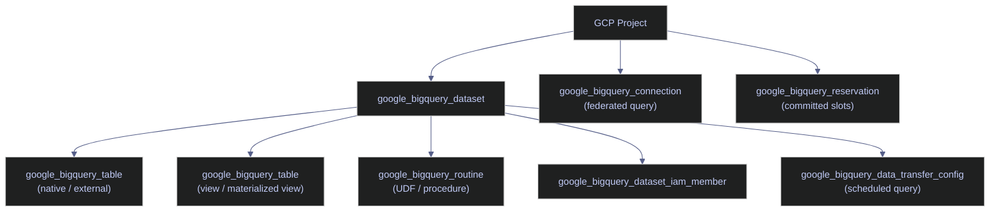
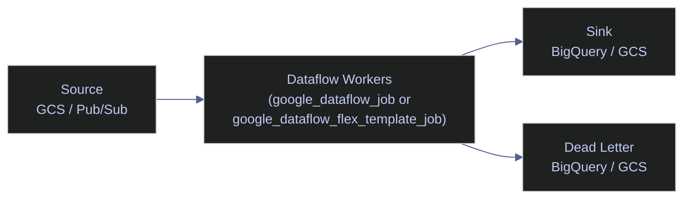
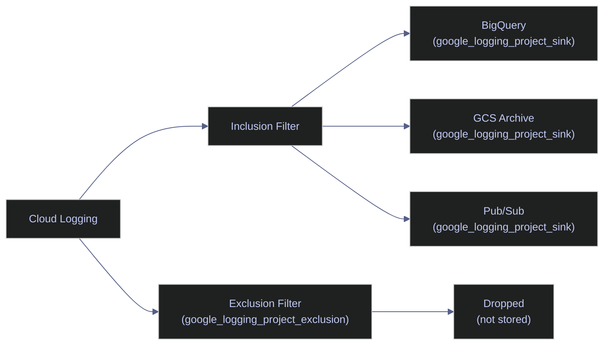

# Data Services Blocks

> [!quote]+
>
> "Automate everything that doesn't require high judgment."
>
> — **Werner Vogels**, AWS re:Invent keynote

> [!abstract]- Summary
>
> Data Services Blocks is the GCP Terraform snippet library for the chapter's data-plane services: it collects production-oriented blocks for BigQuery, Firestore, Dataflow, Cloud SQL, monitoring and logging integrations, and billing controls, all organized as standalone snippets that can be lifted into larger Terraform codebases with clear operational trade-offs.
>
> **Warehouse and analytics blocks**
> - covers BigQuery datasets, tables, views, materialized views, UDFs, external tables, scheduled queries, reservations, and the schema and protection settings that govern stateful analytical resources
>
> **Operational data-service blocks**
> - covers Firestore databases and indexes, Dataflow batch and streaming jobs, and Cloud SQL instances together with the lifecycle choices that change deletion, migration, and throughput behavior
>
> **Observability and cost controls**
> - covers monitoring, logging, alerting, and budget blocks that turn service provisioning into something observable and financially bounded
>
> **Library reference structure**
> - covers assumed variables, table-schema reference material, cross-references, and the snippet-library rule that each block is self-contained even when multiple blocks naturally compose into a broader system
>
> **Operations and safety**
> - Warnings: changing BigQuery dataset location destroys the dataset, production tables need deletion protection, credentials and passwords can land in Terraform state, Firestore `deletion_policy = "DELETE"` destroys all data, Dataflow `on_delete = "cancel"` can lose in-flight work, major Cloud SQL changes force replacement, and budgets warn about spend but do not stop it automatically
> - Recommendations: protect stateful datasets and tables, keep credentials in Secret Manager, use `ABANDON` for production Firestore lifecycles, drain streaming jobs instead of canceling them, treat Cloud SQL replacement fields with care, and pair budget alerts with automated enforcement or human response workflows

> [!note]- Glossary
>
> **Atomic block library**
> - A collection of standalone Terraform snippets designed to be copied into real configurations without assuming one monolithic root module.
> - It matters because this note is written as a toolbox of reusable service blocks rather than as one directly applied environment definition.
>
> > [!info] Standalone still requires judgment
> >
> > A block can be self-contained syntactically and still require architectural context before it is safe in production. Snippet libraries reduce repetition, not design responsibility.
>
> ---
>
> **BigQuery dataset**
> - The top-level container for BigQuery tables, views, routines, and related warehouse objects within a project and location.
> - It matters because many analytical blocks in this library build upward from dataset creation and inherit its location and lifecycle choices.
>
> > [!warning] Location is a deep lifecycle choice
> >
> > Changing a dataset location is not an in-place tweak. For stateful production data, it is effectively a replacement event and should be treated that way.
>
> ---
>
> **Materialized view**
> - A BigQuery view type that stores precomputed results and refreshes them automatically instead of rescanning base tables on every query.
> - It matters because the library includes both logical and materialized analytical patterns, and the operational trade-offs differ.
>
> > [!info] Faster reads trade for refresh semantics
> >
> > Materialized views improve repeated query performance, but they also introduce refresh timing and storage considerations that plain views do not.
>
> ---
>
> **Deletion protection**
> - A safeguard on certain GCP data resources that prevents accidental deletion while enabled.
> - It matters because many blocks in this library manage stateful systems where deletion should be difficult by default.
>
> > [!warning] Stateful services need stronger defaults
> >
> > Datasets, tables, and database instances carry data gravity. A safe snippet library should bias toward protecting those resources from routine mistakes.
>
> ---
>
> **Terraform state exposure**
> - The risk that credentials, passwords, or secret values handled by Terraform are persisted in state and inherit the backend's security posture.
> - It matters because several data-service blocks accept sensitive connection values that are dangerous to manage carelessly.
>
> > [!danger] Managed secrets can still leak through state
> >
> > Even if the destination service is secure, Terraform may still process the plaintext value on the way there. State security is therefore part of secret design, not a separate problem.
>
> ---
>
> **Firestore `deletion_policy`**
> - A lifecycle choice that determines whether deleting the Terraform resource also deletes the Firestore database or leaves it behind.
> - It matters because Firestore holds durable application data and a wrong deletion policy can turn cleanup into irreversible loss.
>
> > [!danger] `DELETE` is final for the data too
> >
> > In production, abandoning the database while removing Terraform ownership is usually safer than deleting the database outright. The lifecycle setting should reflect that distinction explicitly.
>
> ---
>
> **Dataflow job**
> - A managed GCP data-processing workload running Apache Beam pipelines in batch or streaming mode.
> - It matters because the library includes both provisioning patterns and operational lifecycle decisions for these jobs.
>
> > [!warning] Batch and streaming have different delete semantics
> >
> > A Dataflow lifecycle setting that is acceptable for batch work can be harmful for streaming workloads. Operational mode should drive job-deletion behavior.
>
> ---
>
> **`on_delete = "drain"`**
> - A Dataflow lifecycle choice that drains a streaming job instead of canceling it abruptly.
> - It matters because safe teardown of streaming pipelines often depends on letting in-flight messages finish processing.
>
> > [!warning] Cancel can drop work
> >
> > A fast stop is not always a safe stop. For streaming jobs, `cancel` may abandon messages or partially processed state in ways `drain` is designed to avoid.
>
> ---
>
> **Cloud SQL instance**
> - A managed relational database instance in GCP, with lifecycle properties such as region and engine version that can force replacement.
> - It matters because database blocks are some of the highest-risk snippets in the library: they are easy to provision and expensive to replace carelessly.
>
> > [!warning] Database replacement fields are not cosmetic
> >
> > Region changes or major-version jumps can become destructive events. Database HCL should always be reviewed with migration thinking, not only syntax thinking.
>
> ---
>
> **Monitoring alert policy**
> - A GCP monitoring resource that defines conditions under which alerts are emitted for services or infrastructure.
> - It matters because provisioning data services without observability leaves the platform unable to detect many failures early.
>
> > [!info] Provisioning and alerting should stay close
> >
> > If the infrastructure code creates a critical service, colocating its alerting pattern in the same library makes the operational contract much clearer.
>
> ---
>
> **Budget alert**
> - A GCP billing control that notifies operators when spending thresholds are crossed.
> - It matters because cost visibility is part of operating data services responsibly, especially with BigQuery, Dataflow, and managed databases.
>
> > [!warning] Alerts do not enforce by themselves
> >
> > Budgets are observability for cost, not an automatic kill switch. If spend must truly be constrained, the alert needs a response workflow or automated enforcement behind it.

> [!info] Assumed variables
>
> All blocks in this library reference shared Terraform variables. Define these in your root module or `variables.tf`:
>
> | Variable | Type | Description |
> |---|---|---|
> | `var.project_id` | `string` | GCP project ID |
> | `var.region` | `string` | GCP region (e.g. `europe-west1`) |
> | `var.environment` | `string` | Deployment environment (`prod`, `staging`, `dev`) |
> | `var.network_name` | `string` | VPC network name |
> | `var.subnet_name` | `string` | VPC subnetwork name |
>
> Service-specific variables (e.g. `var.pipeline_sa_email`, `var.data_bucket`) are documented in the block where they first appear. See [variables-and-outputs](https://alp78.github.io/elysium/07-Terraform/Fundamentals/variables-and-outputs) for conventions.

## BigQuery Blocks

BigQuery is GCP's serverless, columnar data warehouse. You interact with it through datasets (logical namespaces), tables (storage), and jobs (queries, loads, exports). Terraform manages the schema, partitioning, IAM, and supplementary features — but does not run queries directly. For `gcloud` CLI management of these same resources, see [dataset-and-table-management](https://alp78.github.io/elysium/06-GCP/BigQuery/dataset-and-table-management) and [querying-and-cost-optimization](https://alp78.github.io/elysium/06-GCP/BigQuery/querying-and-cost-optimization).



### google_bigquery_dataset

Use `google_bigquery_dataset` whenever you need a new logical namespace. A dataset is the container for tables, views, routines, and models. You must create a dataset before you can create any child resources. The `location` argument is immutable after creation — changing it in HCL forces Terraform to destroy and recreate the dataset. Choose the region that co-locates with your Dataflow jobs and GCS buckets to avoid inter-region egress charges.

The `dataset_id` is the identifier used in SQL as `project.dataset.table`. The `friendly_name` is a human-readable label shown in the BigQuery Console. Setting `default_table_expiration_ms` to `null` means tables persist forever; set it to a value like `2592000000` (30 days) for ephemeral staging datasets. The `delete_contents_on_destroy` flag controls whether `terraform destroy` also deletes all tables inside the dataset. The inline `access` blocks grant dataset-level roles: `READER`, `WRITER`, or `OWNER`. Prefer `google_bigquery_dataset_iam_member` (below) for dynamic grants managed from modules.

> [!danger] Changing `location` destroys the dataset
>
> The `location` argument is immutable in the GCP API. If you change it in Terraform, the plan shows `# forces replacement` — Terraform will destroy the existing dataset (and all its tables) then create a new one in the target region.

> [!success] Protect production datasets
>
> Add `lifecycle { prevent_destroy = true }` to any dataset containing production data. This causes `terraform plan` to fail rather than proposing a destroy.

*Provisions a BigQuery dataset with location, expiration policy, labels, and inline access grants.*

```hcl
resource "google_bigquery_dataset" "analytics" {
  dataset_id                  = "analytics"
  friendly_name               = "Analytics Warehouse"
  description                 = "Central analytics warehouse containing fact and dimension tables."
  location                    = var.region
  default_table_expiration_ms = null
  delete_contents_on_destroy  = false

  labels = {
    env  = var.environment
    team = "data"
  }

  access {
    role          = "READER"
    user_by_email = var.reader_service_account_email
  }

  access {
    role          = "WRITER"
    user_by_email = var.editor_email
  }
}
```

| Argument | Required | Description |
|---|---|---|
| `dataset_id` | Yes | Unique dataset identifier within the project, used in SQL references |
| `friendly_name` | No | Human-readable label shown in BigQuery Console |
| `description` | No | Dataset description visible in Console and metadata APIs |
| `location` | Yes | Region or multi-region where data physically resides; **immutable after creation** |
| `default_table_expiration_ms` | No | Auto-delete tables after this duration in milliseconds; `null` = never expire |
| `delete_contents_on_destroy` | No | If `true`, `terraform destroy` also deletes all tables; default `false` |
| `labels` | No | Key-value pairs for cost allocation and filtering |
| `access` | No | Inline dataset-level role grants (`READER`, `WRITER`, `OWNER`); additive with IAM resources |

> [!todo] `terraform plan` output
>
> Run `terraform plan` against a real project to capture the plan output for this block and paste it here as a ` ```text ` cell.

### google_bigquery_table

The `google_bigquery_table` resource creates tables, views, materialized views, and external tables. The resource type is the same for all four — the presence of `time_partitioning`, `range_partitioning`, `view`, `materialized_view`, or `external_data_configuration` determines the table kind. Native tables store data in BigQuery's columnar format; external tables read from GCS at query time.

> [!question] Native table vs external table vs view vs materialized view
> - **Native table:** Data stored in BigQuery. Best for production fact/dimension tables with partitioning and clustering. Lowest query latency and cost per byte scanned.
> - **External table:** Data stays in GCS. Best for exploration, ad-hoc queries on Parquet/CSV exports, or when data is produced by another system and you want SQL access without ETL.
> - **View:** Virtual SQL definition, no stored data. Best for stable interfaces over raw tables, row-level filtering, or denormalized join shapes.
> - **Materialized view:** Pre-computed query result cached by BigQuery, auto-refreshed. Best for expensive aggregations queried frequently. Must query a single base table.

> [!tip] Naming conventions
> Prefix views with `v_` and materialized views with `mv_` to distinguish them from native tables at a glance in SQL and BigQuery Console.

#### google_bigquery_table | Time partitioning with clustering

Use `google_bigquery_table` for native tables stored in BigQuery's managed columnar format. Time partitioning splits the table into daily (or hourly/monthly/yearly) segments by a `DATE` or `TIMESTAMP` column. BigQuery only scans partitions that match the query's `WHERE` clause, dramatically reducing cost for time-series data. Clustering physically sorts rows within each partition by up to four columns, further reducing bytes read for high-cardinality filters. Place the most selective column first in the `clustering` array.

The `dataset_id` references the parent dataset and creates an implicit dependency. Setting `deletion_protection = true` prevents `terraform destroy` from deleting the table — Terraform exits with an error instead. The `require_partition_filter` flag inside `time_partitioning` forces every query against this table to include a partition filter, preventing accidental full-table scans. The `schema` argument accepts a JSON-encoded array of column definitions with `name`, `type`, `mode` (`REQUIRED`, `NULLABLE`, `REPEATED`), and `description`.

> [!warning] Missing `deletion_protection` on production tables
>
> If `deletion_protection` is `false` (the default), `terraform destroy` or removing the resource from config will delete the table and all its data.

> [!success] Always protect stateful tables
>
> Set `deletion_protection = true` on all fact and dimension tables. For additional safety, add `lifecycle { prevent_destroy = true }` in the resource block.

*Provisions a native BigQuery table with DAY time partitioning on a DATE column, two-column clustering, and a JSON-encoded schema.*

```hcl
resource "google_bigquery_table" "events_fact" {
  dataset_id          = google_bigquery_dataset.analytics.dataset_id
  table_id            = "events_fact"
  description         = "One row per user event, partitioned by event_date."
  deletion_protection = true

  labels = {
    env = var.environment
  }

  time_partitioning {
    type                     = "DAY"
    field                    = "event_date"
    require_partition_filter = true
    expiration_ms            = null
  }

  clustering = ["user_id", "event_type"]

  schema = jsonencode([
    {
      name        = "event_id"
      type        = "STRING"
      mode        = "REQUIRED"
      description = "Unique event identifier (UUID)"
    },
    {
      name        = "event_date"
      type        = "DATE"
      mode        = "REQUIRED"
      description = "Calendar date of the event — used as the partition key"
    },
    {
      name        = "event_timestamp"
      type        = "TIMESTAMP"
      mode        = "REQUIRED"
      description = "Full UTC timestamp of the event"
    },
    {
      name        = "user_id"
      type        = "STRING"
      mode        = "REQUIRED"
      description = "User identifier — first clustering column"
    },
    {
      name        = "event_type"
      type        = "STRING"
      mode        = "REQUIRED"
      description = "Event category (e.g. page_view, purchase) — second clustering column"
    },
    {
      name        = "properties"
      type        = "JSON"
      mode        = "NULLABLE"
      description = "Flexible key-value bag for event-specific attributes"
    },
    {
      name        = "revenue_usd"
      type        = "NUMERIC"
      mode        = "NULLABLE"
      description = "Revenue attributed to this event in USD; null for non-revenue events"
    }
  ])
}
```

| Argument | Required | Description |
|---|---|---|
| `dataset_id` | Yes | Parent dataset; creates implicit Terraform dependency |
| `table_id` | Yes | Table name used in SQL queries |
| `description` | No | Table description visible in BigQuery Console |
| `deletion_protection` | No | `true` prevents `terraform destroy` from deleting the table; default `false` |
| `labels` | No | Key-value pairs for cost tracking and filtering |
| `time_partitioning.type` | Yes | Partition granularity: `DAY`, `HOUR`, `MONTH`, or `YEAR` |
| `time_partitioning.field` | No | Column to partition by; `null` = ingestion-time partitioning |
| `time_partitioning.require_partition_filter` | No | `true` forces queries to include a partition filter |
| `time_partitioning.expiration_ms` | No | Auto-delete partitions after this duration in ms; `null` = never |
| `clustering` | No | Up to 4 columns for intra-partition sorting; most selective first |
| `schema` | Yes | JSON-encoded array of column definitions (`name`, `type`, `mode`, `description`) |

#### google_bigquery_table | Range partitioning

Use range partitioning when your natural partition key is an integer (e.g. a shard ID, account tier, or sequential customer ID range) rather than a date. BigQuery creates one partition per range interval. The `field` must be an `INTEGER` column. The `range` block defines the inclusive lower bound (`start`), exclusive upper bound (`end`), and the width of each bucket (`interval`). Rows with values outside the defined range go into an `__UNPARTITIONED__` overflow partition.

*Provisions a BigQuery table with integer range partitioning, bucketing rows by `account_tier_id` in intervals of 100.*

```hcl
resource "google_bigquery_table" "accounts_by_tier" {
  dataset_id          = google_bigquery_dataset.analytics.dataset_id
  table_id            = "accounts_by_tier"
  deletion_protection = false

  range_partitioning {
    field = "account_tier_id"

    range {
      start    = 1
      end      = 1000
      interval = 100
    }
  }

  schema = jsonencode([
    {
      name        = "account_id"
      type        = "STRING"
      mode        = "REQUIRED"
      description = "Globally unique account identifier"
    },
    {
      name        = "account_tier_id"
      type        = "INTEGER"
      mode        = "REQUIRED"
      description = "Numeric tier used as the range partition key (1-999)"
    },
    {
      name        = "account_name"
      type        = "STRING"
      mode        = "NULLABLE"
      description = "Human-readable account name"
    },
    {
      name        = "created_at"
      type        = "TIMESTAMP"
      mode        = "REQUIRED"
      description = "Account creation timestamp in UTC"
    }
  ])
}
```

| Argument | Required | Description |
|---|---|---|
| `range_partitioning.field` | Yes | Integer column used as the partition key |
| `range_partitioning.range.start` | Yes | Inclusive lower bound of the first partition |
| `range_partitioning.range.end` | Yes | Exclusive upper bound of the last partition |
| `range_partitioning.range.interval` | Yes | Width of each partition bucket |

#### google_bigquery_table | Ingestion-time partitioning

Use ingestion-time partitioning when you load data via streaming inserts or batch loads and do not have an explicit date column in the schema. Omit the `field` argument (or set it to `null`) and BigQuery automatically assigns a partition based on the load timestamp. Query these tables using the `_PARTITIONTIME` pseudo-column as a filter. Setting `expiration_ms` to `7776000000` (90 days) automatically drops partitions older than 90 days — useful for raw landing zones where data is processed and moved to curated tables.

*Provisions a BigQuery table with ingestion-time DAY partitioning and a 90-day partition expiration, using `_PARTITIONTIME` for filtering.*

```hcl
resource "google_bigquery_table" "raw_events" {
  dataset_id          = google_bigquery_dataset.analytics.dataset_id
  table_id            = "raw_events"
  deletion_protection = false

  time_partitioning {
    type          = "DAY"
    field         = null
    expiration_ms = 7776000000
  }

  schema = jsonencode([
    {
      name        = "raw_payload"
      type        = "STRING"
      mode        = "REQUIRED"
      description = "Raw JSON string received from the event source"
    },
    {
      name        = "source_system"
      type        = "STRING"
      mode        = "REQUIRED"
      description = "Identifier for the upstream system that produced the event"
    },
    {
      name        = "received_at"
      type        = "TIMESTAMP"
      mode        = "REQUIRED"
      description = "UTC timestamp when the payload was received by the ingestion layer"
    }
  ])
}
```

#### google_bigquery_table | External table (GCS Parquet)

Use an external table when data lives in GCS and you want to query it with SQL without loading it into BigQuery native storage. This is ideal for Parquet files produced by Dataflow, CSV exports, or JSON log archives. Dropping an external table does not delete the underlying GCS files — it only removes the metadata definition. The `external_data_configuration` block replaces the `schema` + storage model of a native table. Supported formats: `PARQUET`, `CSV`, `NEWLINE_DELIMITED_JSON`, `AVRO`, `ORC`.

For Parquet files, set `autodetect = true` to let BigQuery read column names and types from file metadata. The `hive_partitioning_options` block enables partition pruning based on directory structure (e.g. `year=2024/month=01/`). The `source_uri_prefix` tells BigQuery where the directory tree starts. Setting `mode = "AUTO"` infers partition keys automatically.

*Provisions an external BigQuery table over GCS Parquet files with schema autodetect and hive partition pruning.*

```hcl
resource "google_bigquery_table" "external_parquet" {
  dataset_id          = google_bigquery_dataset.analytics.dataset_id
  table_id            = "external_parquet_events"
  deletion_protection = false

  external_data_configuration {
    source_format = "PARQUET"

    source_uris = [
      "gs://${var.data_bucket}/exports/events/*.parquet",
    ]

    autodetect = true

    hive_partitioning_options {
      mode                     = "AUTO"
      source_uri_prefix        = "gs://${var.data_bucket}/exports/events/"
      require_partition_filter = false
    }
  }
}
```

| Argument | Required | Description |
|---|---|---|
| `external_data_configuration.source_format` | Yes | File format: `PARQUET`, `CSV`, `NEWLINE_DELIMITED_JSON`, `AVRO`, `ORC` |
| `external_data_configuration.source_uris` | Yes | List of GCS URI glob patterns pointing to source files |
| `external_data_configuration.autodetect` | No | `true` = infer schema from file metadata; `false` = use explicit `schema` |
| `hive_partitioning_options.mode` | No | `AUTO`, `STRINGS`, or `CUSTOM`; `AUTO` infers partition keys from directory structure |
| `hive_partitioning_options.source_uri_prefix` | No | Root GCS prefix for partition discovery |
| `hive_partitioning_options.require_partition_filter` | No | `true` forces partition pruning in queries |

#### google_bigquery_table | External table (GCS CSV)

Use a CSV-backed external table when the source data is comma-separated and you need explicit control over parsing. Set `autodetect = false` and provide a `schema` argument. The `csv_options` block configures the quote character, header row skip count, field delimiter, and whether quoted newlines are allowed.

*Provisions an external BigQuery table over GCS CSV files with explicit schema and CSV parsing options.*

```hcl
resource "google_bigquery_table" "external_csv" {
  dataset_id = google_bigquery_dataset.analytics.dataset_id
  table_id   = "external_csv_accounts"

  external_data_configuration {
    source_format = "CSV"

    source_uris = [
      "gs://${var.data_bucket}/exports/accounts/*.csv",
    ]

    autodetect = false

    csv_options {
      quote                = "\""
      skip_leading_rows    = 1
      field_delimiter      = ","
      allow_quoted_newlines = false
    }
  }

  schema = jsonencode([
    { name = "account_id",   type = "STRING",  mode = "REQUIRED", description = "Account identifier" },
    { name = "account_name", type = "STRING",  mode = "NULLABLE", description = "Account display name" },
    { name = "created_at",   type = "STRING",  mode = "NULLABLE", description = "ISO-8601 creation timestamp as string" }
  ])
}
```

| Argument | Required | Description |
|---|---|---|
| `csv_options.quote` | No | Character used to quote fields containing delimiters; default `"` |
| `csv_options.skip_leading_rows` | No | Number of header rows to skip; `1` = skip column header row |
| `csv_options.field_delimiter` | No | Column separator; default `,` |
| `csv_options.allow_quoted_newlines` | No | Whether newlines inside quoted strings are allowed; default `false` |

#### google_bigquery_table | View

Use a `google_bigquery_table` with a `view` block to define a SQL view. Views are virtual — they store only the query definition, not data. Use views to expose a clean, stable interface on top of raw or partitioned tables, apply row-level filters, or join multiple tables into a denormalized shape. Views can be safely destroyed and recreated since they contain no data. Always set `use_legacy_sql = false` — legacy SQL is deprecated and incompatible with standard SQL features like `STRUCT`, `ARRAY`, and `WITH` clauses.

*Defines a SQL view that filters the events fact table to the last 30 days using standard SQL.*

```hcl
resource "google_bigquery_table" "events_last_30d" {
  dataset_id          = google_bigquery_dataset.analytics.dataset_id
  table_id            = "v_events_last_30d"
  deletion_protection = false

  view {
    query = <<-SQL
      SELECT
        event_id,
        event_date,
        user_id,
        event_type,
        revenue_usd
      FROM
        `${var.project_id}.analytics.events_fact`
      WHERE
        event_date >= DATE_SUB(CURRENT_DATE(), INTERVAL 30 DAY)
    SQL

    use_legacy_sql = false
  }
}
```

| Argument | Required | Description |
|---|---|---|
| `view.query` | Yes | Standard SQL query that defines the view |
| `view.use_legacy_sql` | No | Must be `false` for standard SQL; default `true` (legacy, deprecated) |

#### google_bigquery_table | Materialized view

Use a materialized view when a view is too slow because its underlying query is expensive and runs frequently. BigQuery pre-computes and caches the result, then automatically refreshes it when the base table changes. Materialized views must query a single base table and cannot use non-deterministic functions (`CURRENT_TIMESTAMP()`, `RAND()`, etc.). Setting `enable_refresh = true` enables automatic refresh. The `refresh_interval_ms` sets the minimum time between refreshes — `1800000` ms equals 30 minutes. BigQuery does not charge for automatic refreshes; it only charges for the bytes stored in the materialized view.

*Provisions a BigQuery materialized view that pre-computes daily revenue aggregates with automatic 30-minute refresh.*

```hcl
resource "google_bigquery_table" "mv_daily_revenue" {
  dataset_id          = google_bigquery_dataset.analytics.dataset_id
  table_id            = "mv_daily_revenue_by_type"
  deletion_protection = false

  materialized_view {
    query = <<-SQL
      SELECT
        event_date,
        event_type,
        COUNT(*)                     AS event_count,
        SUM(IFNULL(revenue_usd, 0))  AS total_revenue_usd
      FROM
        `${var.project_id}.analytics.events_fact`
      GROUP BY
        event_date,
        event_type
    SQL

    enable_refresh      = true
    refresh_interval_ms = 1800000
  }
}
```

| Argument | Required | Description |
|---|---|---|
| `materialized_view.query` | Yes | Aggregation query over a single base table |
| `materialized_view.enable_refresh` | No | `true` enables automatic refresh; default `true` |
| `materialized_view.refresh_interval_ms` | No | Minimum ms between refreshes; default `1800000` (30 min) |

### google_bigquery_routine

Use `google_bigquery_routine` to define reusable functions (UDFs) or stored procedures. SQL UDFs are fast and portable. JavaScript UDFs are slower but useful for complex string manipulation or external library logic that cannot be expressed in SQL. Store routines in a shared utilities dataset so all datasets can call them. The `routine_type` is `SCALAR_FUNCTION` for UDFs that return a single value per row, or `PROCEDURE` for stored procedures called with `CALL`.

#### google_bigquery_routine | SQL UDF

A SQL UDF that normalizes an email address to lowercase and trims whitespace. The `routine_id` becomes the function name callable in SQL as `dataset.normalize_email(raw_email)`. The `arguments` block defines input parameters with name and JSON-encoded type. The `return_type` specifies the output type. The `definition_body` contains the SQL expression.

*Registers a SQL scalar UDF that returns a lowercase, trimmed email string.*

```hcl
resource "google_bigquery_routine" "normalize_email" {
  dataset_id      = google_bigquery_dataset.analytics.dataset_id
  routine_id      = "normalize_email"
  routine_type    = "SCALAR_FUNCTION"
  language        = "SQL"

  arguments {
    name      = "raw_email"
    data_type = jsonencode({ typeKind = "STRING" })
  }

  return_type     = jsonencode({ typeKind = "STRING" })
  definition_body = "LOWER(TRIM(raw_email))"
}
```

| Argument | Required | Description |
|---|---|---|
| `dataset_id` | Yes | Dataset that owns the routine |
| `routine_id` | Yes | Function name callable in SQL |
| `routine_type` | Yes | `SCALAR_FUNCTION` or `PROCEDURE` |
| `language` | Yes | `SQL` or `JAVASCRIPT` |
| `arguments` | No | Input parameter blocks with `name` and `data_type` (JSON TypeKind) |
| `return_type` | No | JSON-encoded return type; required for `SCALAR_FUNCTION` |
| `definition_body` | Yes | Function body (SQL expression or JavaScript code) |

#### google_bigquery_routine | JavaScript UDF

A JavaScript UDF that parses a JSON string and extracts a campaign name. JavaScript UDFs run in BigQuery's V8 sandbox and are slower than SQL UDFs but support arbitrary string manipulation, regex, and JSON parsing that would be verbose in SQL. The `definition_body` must return the same type declared in `return_type`.

*Registers a JavaScript scalar UDF that parses a JSON properties string and returns the `campaign` field.*

```hcl
resource "google_bigquery_routine" "extract_campaign" {
  dataset_id      = google_bigquery_dataset.analytics.dataset_id
  routine_id      = "extract_campaign"
  routine_type    = "SCALAR_FUNCTION"
  language        = "JAVASCRIPT"

  arguments {
    name      = "properties_json"
    data_type = jsonencode({ typeKind = "STRING" })
  }

  return_type     = jsonencode({ typeKind = "STRING" })

  definition_body = <<-JS
    try {
      var obj = JSON.parse(properties_json);
      return obj.campaign || null;
    } catch (e) {
      return null;
    }
  JS
}
```

### google_bigquery_dataset_iam_member

Use `google_bigquery_dataset_iam_member` to grant roles at the dataset level. This resource is additive — it does not replace the `access` blocks inside the `google_bigquery_dataset` resource. Prefer this resource when the grantee is determined at runtime or when granting access from a module. The `member` argument uses the IAM principal format: `serviceAccount:email`, `group:email`, or `user:email`. For IAM concepts and service account management, see [service-accounts-and-iam](https://alp78.github.io/elysium/06-GCP/Security/service-accounts-and-iam).

Common BigQuery roles: `roles/bigquery.dataViewer` (read tables), `roles/bigquery.dataEditor` (create/update/delete tables), `roles/bigquery.user` (run queries — project-level, not dataset-level). A user needs both `dataViewer` on the dataset and `bigquery.user` on the project to query tables.

*Grants `roles/bigquery.dataEditor` on the dataset to a pipeline service account.*

```hcl
resource "google_bigquery_dataset_iam_member" "pipeline_editor" {
  dataset_id = google_bigquery_dataset.analytics.dataset_id
  project    = var.project_id
  role       = "roles/bigquery.dataEditor"
  member     = "serviceAccount:${var.pipeline_sa_email}"
}
```

*Grants `roles/bigquery.dataViewer` on the dataset to an analyst group.*

```hcl
resource "google_bigquery_dataset_iam_member" "analysts_viewer" {
  dataset_id = google_bigquery_dataset.analytics.dataset_id
  project    = var.project_id
  role       = "roles/bigquery.dataViewer"
  member     = "group:${var.analyst_group_email}"
}
```

The `google_project_iam_member` resource below grants `roles/bigquery.user` at the project level, which is required to run queries. Combined with `dataViewer` on the dataset, this gives full read access.

*Grants `roles/bigquery.user` at the project level so the analyst group can run queries.*

```hcl
resource "google_project_iam_member" "analyst_bq_user" {
  project = var.project_id
  role    = "roles/bigquery.user"
  member  = "group:${var.analyst_group_email}"
}
```

| Argument | Required | Description |
|---|---|---|
| `dataset_id` | Yes | Target dataset to grant access to |
| `project` | Yes | GCP project containing the dataset |
| `role` | Yes | IAM role to grant (e.g. `roles/bigquery.dataViewer`) |
| `member` | Yes | IAM principal: `serviceAccount:`, `group:`, or `user:` prefix + email |

### google_bigquery_data_transfer_config

Use `google_bigquery_data_transfer_config` to run a SQL query on a schedule without Airflow or Cloud Scheduler. This is the BigQuery-native way to run daily aggregation jobs, snapshot tables, or move data between datasets. The `data_source_id` is always `"scheduled_query"` for SQL-based transfers. The `schedule` argument accepts cron-like expressions (`"every 24 hours"`, `"every day 02:00"`). The `location` must match the dataset region. The service account specified in `service_account_name` must have `roles/bigquery.admin` or a combination of `roles/bigquery.dataEditor` + `roles/bigquery.jobUser`.

The `params` block contains the SQL query and controls how results are written. `write_disposition` can be `WRITE_APPEND` (add rows) or `WRITE_TRUNCATE` (replace table contents). The `partitioning_field` sets the partition column on the destination table.

*Configures a scheduled SQL query that runs every 24 hours and appends yesterday's revenue aggregates to the destination table.*

```hcl
resource "google_bigquery_data_transfer_config" "daily_revenue_agg" {
  display_name           = "Daily Revenue Aggregation"
  location               = var.region
  data_source_id         = "scheduled_query"
  schedule               = "every 24 hours"
  destination_dataset_id = google_bigquery_dataset.analytics.dataset_id

  params = {
    query = <<-SQL
      INSERT INTO `${var.project_id}.analytics.daily_revenue`
      SELECT
        DATE_SUB(CURRENT_DATE(), INTERVAL 1 DAY)  AS report_date,
        event_type,
        SUM(IFNULL(revenue_usd, 0))               AS total_revenue_usd,
        COUNT(*)                                   AS event_count
      FROM
        `${var.project_id}.analytics.events_fact`
      WHERE
        event_date = DATE_SUB(CURRENT_DATE(), INTERVAL 1 DAY)
      GROUP BY
        event_type
    SQL

    destination_table_name_template = "daily_revenue"
    write_disposition               = "WRITE_APPEND"
    partitioning_field              = "report_date"
  }

  service_account_name = var.pipeline_sa_email
}
```

| Argument | Required | Description |
|---|---|---|
| `display_name` | Yes | Name visible in BigQuery Data Transfers UI |
| `location` | Yes | Must match the destination dataset region |
| `data_source_id` | Yes | Always `"scheduled_query"` for SQL-based transfers |
| `schedule` | Yes | Cron-like schedule expression |
| `destination_dataset_id` | Yes | Target dataset for query results |
| `params.query` | Yes | SQL query to execute on schedule |
| `params.destination_table_name_template` | Yes | Target table name within the destination dataset |
| `params.write_disposition` | Yes | `WRITE_APPEND` or `WRITE_TRUNCATE` |
| `params.partitioning_field` | No | Column to partition the destination table by |
| `service_account_name` | Yes | Service account email; needs `bigquery.admin` or `dataEditor` + `jobUser` |

### google_bigquery_connection

Use `google_bigquery_connection` to let BigQuery query Cloud SQL or Cloud Spanner in place as if they were BigQuery tables. This enables `EXTERNAL_QUERY()` JOIN queries between BigQuery data and live operational database tables without ETL. The `connection_id` is the identifier referenced in the SQL `EXTERNAL_QUERY()` function. The `location` must match the BigQuery dataset and Cloud SQL instance region. The `cloud_sql.type` is `POSTGRES` or `MYSQL`.

> [!warning] Credentials stored in Terraform state
>
> The `credential` block contains the database username and password. These values are stored in plaintext in the Terraform state file.

> [!success] Use Secret Manager for production credentials
>
> Retrieve the password from Secret Manager using a `data "google_secret_manager_secret_version"` data source instead of `var.cloudsql_password`. See [secrets-management](https://alp78.github.io/elysium/06-GCP/Security/secrets-management).

*Provisions a BigQuery federated query connection to a Cloud SQL PostgreSQL instance using database credentials.*

```hcl
resource "google_bigquery_connection" "cloudsql_federated" {
  connection_id = "cloudsql-analytics-conn"
  project       = var.project_id
  location      = var.region
  description   = "Federated query connection to the Cloud SQL PostgreSQL analytics replica."

  cloud_sql {
    instance_id = google_sql_database_instance.analytics_pg.connection_name
    database    = "analytics"
    type        = "POSTGRES"

    credential {
      username = var.cloudsql_user
      password = var.cloudsql_password
    }
  }
}
```

| Argument | Required | Description |
|---|---|---|
| `connection_id` | Yes | Identifier referenced in `EXTERNAL_QUERY()` SQL function |
| `project` | Yes | GCP project |
| `location` | Yes | Must match BigQuery dataset and Cloud SQL instance region |
| `cloud_sql.instance_id` | Yes | Cloud SQL `connection_name` (format: `project:region:instance`) |
| `cloud_sql.database` | Yes | Database name within the Cloud SQL instance |
| `cloud_sql.type` | Yes | `POSTGRES` or `MYSQL` |
| `cloud_sql.credential.username` | Yes | Database user with `SELECT` privileges |
| `cloud_sql.credential.password` | Yes | Password for the database user |

### google_bigquery_reservation

Use `google_bigquery_reservation` when you want dedicated slot capacity (Enterprise or Enterprise Plus editions) instead of on-demand pricing. The `slot_capacity` defines baseline slots always available to assigned projects. The `edition` can be `STANDARD`, `ENTERPRISE`, or `ENTERPRISE_PLUS` — each edition has different pricing and features. Setting `ignore_idle_slots = false` shares unused slots with the organization; `true` reserves them exclusively for the assigned projects.

A reservation alone does not route queries — you must also create a `google_bigquery_reservation_assignment` to bind the reservation to a project, folder, or organization. The `job_type` controls which workloads use the committed slots: `QUERY` (interactive queries), `PIPELINE` (BigQuery jobs like loads and exports), or `ML_EXTERNAL` (BigQuery ML).

> [!info] Provider version
>
> `google_bigquery_reservation` requires `google` provider >= 4.48.0. The `edition` argument was added in provider 4.65.0.

*Provisions a BigQuery Enterprise reservation with 100 committed slots and assigns it to the project for query workloads.*

```hcl
resource "google_bigquery_reservation" "de_team" {
  name              = "de-team-reservation"
  project           = var.project_id
  location          = var.region
  slot_capacity     = 100
  edition           = "ENTERPRISE"
  ignore_idle_slots = false
}

resource "google_bigquery_reservation_assignment" "de_project_assignment" {
  assignee    = "projects/${var.project_id}"
  job_type    = "QUERY"
  reservation = google_bigquery_reservation.de_team.id
}
```

| Argument | Required | Description |
|---|---|---|
| `name` | Yes | Reservation name |
| `project` | Yes | Project that owns the reservation |
| `location` | Yes | Region; must match the datasets using this reservation |
| `slot_capacity` | Yes | Number of baseline slots |
| `edition` | Yes | `STANDARD`, `ENTERPRISE`, or `ENTERPRISE_PLUS` |
| `ignore_idle_slots` | No | `false` = share idle slots with org; `true` = reserve exclusively |
| `assignee` | Yes | Assignment target: `projects/X`, `folders/X`, or `organizations/X` |
| `job_type` | Yes | `QUERY`, `PIPELINE`, or `ML_EXTERNAL` |
| `reservation` | Yes | Reservation ID to assign |

### google_bigquery_dataset | Import existing dataset

Use the `import` block (Terraform 1.5+) to bring an existing BigQuery dataset under Terraform management without destroying and recreating it. This is the standard pattern for adopting manually-created datasets into IaC. After import, run `terraform plan` to verify the config matches the existing state — any drift will show as a proposed change.

*Imports an existing BigQuery dataset into Terraform state without destroying and recreating it.*

```hcl
import {
  to = google_bigquery_dataset.analytics
  id = "projects/my-project/datasets/analytics"
}
```

> [!info] Terraform 1.5+ required
>
> The `import` block is a declarative alternative to `terraform import` CLI. It runs during `terraform plan` and can be committed to version control, making imports reviewable and repeatable.

## Firestore Blocks

Firestore is GCP's serverless, scalable NoSQL document database. Native mode Firestore is the recommended choice for new projects. Terraform can manage the database instance, composite indexes, backup schedules, and security rules — but document data itself is managed at runtime (or seeded via `null_resource`). For data model concepts and `gcloud` operations, see [firestore-data-model-and-operations](https://alp78.github.io/elysium/06-GCP/Firestore/firestore-data-model-and-operations).

### google_firestore_database

Use `google_firestore_database` to provision the Firestore instance. A GCP project can have one default database (`(default)`) or multiple named databases (multi-database support, GA since 2023). The `name` is `"(default)"` for the default database or a custom identifier like `"analytics-db"`. The `location_id` must match the App Engine location if App Engine is enabled in the project. The `type` is `FIRESTORE_NATIVE` (recommended for new projects) or `DATASTORE_MODE` (legacy, for Datastore migration only). The `type` is immutable — changing it forces replacement.

The `concurrency_mode` controls transaction isolation: `OPTIMISTIC` (default) uses optimistic locking where conflicting transactions retry, while `PESSIMISTIC` provides serializable transactions at the cost of throughput. Set `app_engine_integration_mode = "DISABLED"` unless your project uses App Engine. The `deletion_policy` controls what happens on `terraform destroy`: `DELETE` destroys the database and all documents, `ABANDON` removes the resource from state without deleting the actual database.

> [!danger] `deletion_policy = "DELETE"` destroys all data
>
> Setting `deletion_policy = "DELETE"` allows `terraform destroy` to permanently delete the Firestore database and every document inside it. There is no undo.

> [!success] Use `ABANDON` in production
>
> Set `deletion_policy = "ABANDON"` for production databases. This ensures `terraform destroy` only removes the resource from Terraform state without touching the actual database. Pair with `lifecycle { prevent_destroy = true }`.

> [!info] Provider version
>
> `google_firestore_database` requires `google` provider >= 4.64.0 or `google-beta`. Multi-database support (named databases other than `(default)`) requires provider >= 4.83.0.

*Provisions the default Firestore Native-mode database with optimistic concurrency and no App Engine integration.*

```hcl
resource "google_firestore_database" "main" {
  project                     = var.project_id
  name                        = "(default)"
  location_id                 = var.region
  type                        = "FIRESTORE_NATIVE"
  concurrency_mode            = "OPTIMISTIC"
  app_engine_integration_mode = "DISABLED"

  deletion_policy = "DELETE"
}
```

| Argument | Required | Description |
|---|---|---|
| `project` | Yes | GCP project; Firestore is project-scoped |
| `name` | Yes | `"(default)"` or a custom database name |
| `location_id` | Yes | Region; must match App Engine location if App Engine is enabled |
| `type` | Yes | `FIRESTORE_NATIVE` or `DATASTORE_MODE`; **immutable after creation** |
| `concurrency_mode` | No | `OPTIMISTIC` (default) or `PESSIMISTIC` |
| `app_engine_integration_mode` | No | `DISABLED` (standalone) or `ENABLED` (App Engine) |
| `deletion_policy` | No | `DELETE` (destroy database) or `ABANDON` (orphan without deleting) |

### google_firestore_index

Use `google_firestore_index` to create composite indexes required for queries that filter or order by multiple fields. Firestore auto-creates single-field indexes but does not auto-create composite indexes. If a query needs a composite index and it does not exist, the query fails at runtime with an error linking to the Firebase console. Define all required indexes in Terraform to catch missing indexes at `terraform apply` time rather than at query time.

Each `fields` block defines one field in the composite index. The `order` is `ASCENDING` or `DESCENDING`. For equality filters, `ASCENDING` is conventional. For range or ordering fields, match the `order` to your query's `ORDER BY` clause. Including `__name__` as the final field ensures stable cursor-based pagination.

The first example creates a composite index on the `sessions` collection for queries that filter by `user_id` and order by `created_at` descending (most recent first).

*Creates a composite Firestore index on `sessions` to support filtering by `user_id` ordered by `created_at` descending.*

```hcl
resource "google_firestore_index" "sessions_by_user" {
  project    = var.project_id
  database   = google_firestore_database.main.name
  collection = "sessions"

  fields {
    field_path = "user_id"
    order      = "ASCENDING"
  }

  fields {
    field_path = "created_at"
    order      = "DESCENDING"
  }
}
```

The second example supports a task queue pattern: filter by `status` (equality) and order by `priority` (ascending, so lowest number = highest urgency). The `__name__` field provides stable pagination.

*Creates a composite Firestore index on `tasks` to support `status` equality filters ordered by `priority`, with stable cursor pagination via `__name__`.*

```hcl
resource "google_firestore_index" "tasks_by_status_priority" {
  project    = var.project_id
  database   = google_firestore_database.main.name
  collection = "tasks"

  fields {
    field_path = "status"
    order      = "ASCENDING"
  }

  fields {
    field_path = "priority"
    order      = "ASCENDING"
  }

  fields {
    field_path = "__name__"
    order      = "ASCENDING"
  }
}
```

| Argument | Required | Description |
|---|---|---|
| `project` | Yes | GCP project |
| `database` | Yes | Target database name; `"(default)"` or named |
| `collection` | Yes | Firestore collection this index applies to |
| `fields.field_path` | Yes | Document field name, or `__name__` for the document ID |
| `fields.order` | Yes | `ASCENDING` or `DESCENDING` |

### null_resource | Firestore document seed

Terraform's `google_firestore_document` resource exists but is limited — it cannot easily handle subcollections or complex merge semantics. The most reliable pattern for seeding initial config documents is a `null_resource` with a `local-exec` provisioner running `gcloud firestore` or a small Python script. This runs on the machine executing `terraform apply`.

The `triggers` block controls when the provisioner re-runs. Using `sha256(jsonencode(...))` of the desired document content means the provisioner re-executes only when the content changes. The `|| update` pattern handles both first-run (create) and subsequent runs (update) idempotently. The `depends_on` ensures the database exists before seeding.

*Seeds a Firestore config document via `local-exec`, re-running only when the document content hash changes.*

```hcl
resource "null_resource" "seed_app_config" {
  triggers = {
    config_hash = sha256(jsonencode({
      feature_flags = {
        new_dashboard = true
        beta_api      = false
      }
      maintenance_mode = false
      max_upload_mb    = 50
    }))
    database = google_firestore_database.main.name
  }

  provisioner "local-exec" {
    command = <<-BASH
      gcloud firestore documents create \
        projects/${var.project_id}/databases/${google_firestore_database.main.name}/documents/config/app \
        --project=${var.project_id} \
        --document-id=app \
        --data='featureFlags.newDashboard=true,featureFlags.betaApi=false,maintenanceMode=false,maxUploadMb=50' \
        2>/dev/null || \
      gcloud firestore documents update \
        projects/${var.project_id}/databases/${google_firestore_database.main.name}/documents/config/app \
        --project=${var.project_id} \
        --data='featureFlags.newDashboard=true,featureFlags.betaApi=false,maintenanceMode=false,maxUploadMb=50'
    BASH
  }

  depends_on = [google_firestore_database.main]
}
```

### google_firestore_backup_schedule

Use `google_firestore_backup_schedule` to automatically back up Firestore data on a daily or weekly schedule. Backups protect against accidental deletions and data corruption. GCP stores backups in a managed location — you do not provision a GCS bucket yourself. The `retention` argument specifies how long backups are kept, in seconds. Use `daily_recurrence {}` (empty block) for daily backups at a GCP-managed time, or `weekly_recurrence { day = "SUNDAY" }` for weekly backups on a specific day.

The first example retains daily backups for 7 days (604800 seconds). The second retains weekly backups for 14 weeks (8467200 seconds ≈ 98 days).

*Configures a daily Firestore backup schedule with a 7-day retention window.*

```hcl
resource "google_firestore_backup_schedule" "daily" {
  project  = var.project_id
  database = google_firestore_database.main.name

  retention = "604800s"

  daily_recurrence {}
}
```

*Configures a weekly Sunday Firestore backup schedule with a 14-week retention window.*

```hcl
resource "google_firestore_backup_schedule" "weekly" {
  project  = var.project_id
  database = google_firestore_database.main.name

  retention = "8467200s"

  weekly_recurrence {
    day = "SUNDAY"
  }
}
```

| Argument | Required | Description |
|---|---|---|
| `project` | Yes | GCP project |
| `database` | Yes | Target Firestore database name |
| `retention` | Yes | Retention period in seconds (e.g. `"604800s"` = 7 days) |
| `daily_recurrence` | No | Empty block; include for daily backups (mutually exclusive with `weekly_recurrence`) |
| `weekly_recurrence.day` | No | Day of week: `MONDAY` through `SUNDAY` |

### google_firebaserules_ruleset

Use `google_firebaserules_ruleset` and `google_firebaserules_release` together to deploy Firestore security rules from Terraform. Rules are defined in a `.rules` file checked into source control. This approach keeps rules version-controlled and prevents manual edits from drifting. The `source.files` block reads the rules file from the local filesystem using the `file()` function. The `google_firebaserules_release` resource activates the ruleset — its `name` must be `"cloud.firestore"` for Firestore databases.

*Creates a Firestore security ruleset from a local `.rules` file.*

```hcl
resource "google_firebaserules_ruleset" "firestore_rules" {
  project = var.project_id

  source {
    files {
      name    = "firestore.rules"
      content = file("${path.module}/firestore.rules")
    }
  }
}
```

*Activates the Firestore ruleset by creating a release named `cloud.firestore`.*

```hcl
resource "google_firebaserules_release" "firestore_release" {
  name         = "cloud.firestore"
  ruleset_name = google_firebaserules_ruleset.firestore_rules.name
  project      = var.project_id
}
```

| Argument | Required | Description |
|---|---|---|
| `source.files.name` | Yes | Logical file name within the ruleset |
| `source.files.content` | Yes | Rules content; use `file()` to read from disk |
| `name` (release) | Yes | Always `"cloud.firestore"` for Firestore |
| `ruleset_name` (release) | Yes | Reference to the ruleset resource to activate |

Example `firestore.rules` file (managed alongside Terraform, not by Terraform itself):

*Example Firestore security rules file granting users read/write access only to their own documents and read-only access to config documents.*

```javascript
rules_version = '2';
service cloud.firestore {
  match /databases/{database}/documents {
    match /users/{userId} {
      allow read, write: if request.auth != null && request.auth.uid == userId;
    }
    match /config/{document} {
      allow read: if request.auth != null;
      allow write: if false;
    }
  }
}
```

## Dataflow Blocks

Dataflow is GCP's managed Apache Beam execution environment. It runs both batch and streaming pipelines. Terraform manages the job resource — the pipeline code itself is packaged as a Dataflow template (classic or Flex) stored in GCS or Artifact Registry.



> [!question] Classic template vs Flex template
>
> - **Classic template:** Pre-compiled JAR or Python package stored in GCS. Use for Google-provided templates (GCS to BigQuery, Pub/Sub to BigQuery) or simple custom pipelines with fixed parameters.
> - **Flex template:** Custom Docker container stored in Artifact Registry. Use for custom pipelines with dynamic parameters, complex dependencies, or Python/Java code that needs arbitrary libraries. More flexible but requires building and pushing a container image.

### google_dataflow_job

The `google_dataflow_job` resource runs both batch and streaming pipelines using classic templates. Batch jobs run to completion and terminate. Streaming jobs run continuously until stopped. The `on_delete` argument controls shutdown behavior: `"drain"` finishes in-flight work before stopping, `"cancel"` stops immediately.

#### google_dataflow_job | Batch (classic template)

Use this variant for a batch pipeline that reads data, transforms it, and writes results using a Google-provided classic template. The `template_gcs_path` points to the template spec file in GCS. The `parameters` block passes template-specific key-value pairs — the keys depend on the chosen template. The `temp_gcs_location` must be in the same region as the job.

Worker VMs use `machine_type` for sizing (`n1-standard-4` is a balanced default). Dataflow autoscales between `num_workers` (initial count) and `max_workers` (ceiling). The `service_account_email` controls what the worker VMs can access — the SA needs read access to the source and write access to the sink. The `subnetwork` must use the full self-link format `regions/{region}/subnetworks/{name}`.

*Runs a batch Dataflow job using the GCS Avro to BigQuery classic template, loading events into a fact table.*

```hcl
resource "google_dataflow_job" "gcs_to_bq_batch" {
  name              = "gcs-to-bq-events-${var.environment}"
  project           = var.project_id
  region            = var.region
  zone              = "${var.region}-b"

  template_gcs_path = "gs://dataflow-templates-${var.region}/latest/GCS_Avro_to_BigQuery"

  parameters = {
    inputFileSpec         = "gs://${var.data_bucket}/exports/events/*.avro"
    outputTableSpec       = "${var.project_id}:analytics.events_fact"
    outputDeadletterTable = "${var.project_id}:analytics.events_fact_errors"
  }

  temp_gcs_location     = "gs://${var.temp_bucket}/dataflow/tmp"
  machine_type          = "n1-standard-4"
  max_workers           = 10
  num_workers           = 2
  service_account_email = var.dataflow_sa_email
  network               = var.network_name
  subnetwork            = "regions/${var.region}/subnetworks/${var.subnet_name}"

  on_delete = "drain"
}
```

| Argument | Required | Description |
|---|---|---|
| `name` | Yes | Job name; must be unique within project/region |
| `project` | Yes | GCP project |
| `region` | Yes | Region where workers are provisioned |
| `zone` | No | Specific zone within the region for workers |
| `template_gcs_path` | Yes | GCS path to the classic template spec file |
| `parameters` | No | Template-specific key-value parameters |
| `temp_gcs_location` | Yes | GCS path for temporary files; same region as job |
| `machine_type` | No | Worker VM type; default `n1-standard-1` |
| `max_workers` | No | Maximum worker VMs Dataflow can scale to |
| `num_workers` | No | Initial worker count at job start |
| `service_account_email` | No | SA for worker VMs; needs source read + sink write permissions |
| `network` | No | VPC network name for worker VMs |
| `subnetwork` | No | Full subnetwork self-link: `regions/{region}/subnetworks/{name}` |
| `on_delete` | No | `"drain"` (finish in-flight work) or `"cancel"` (stop immediately) |

#### google_dataflow_job | Streaming

Use `google_dataflow_job` with streaming parameters when you need a continuously running pipeline (Pub/Sub to BigQuery, Pub/Sub to GCS, etc.). Streaming jobs do not terminate — they run until explicitly stopped or until `terraform destroy` triggers the `on_delete` action. The service account needs `roles/pubsub.subscriber` on the source topic and `roles/bigquery.dataEditor` on the destination dataset. Streaming jobs autoscale based on Pub/Sub backlog; start with `num_workers = 1` and let Dataflow scale up to `max_workers`.

To deploy a new version of a running streaming job, set `update = true`. Terraform replaces the running job with the updated configuration using the same job name, preserving in-flight messages. Leave `update = false` (default) for first-time deployments.

> [!warning] `on_delete = "cancel"` loses in-flight messages
>
> Using `"cancel"` on a streaming job stops it immediately, discarding any Pub/Sub messages currently being processed. These messages become unacknowledged and are redelivered, but any partial BigQuery writes may be lost.

> [!success] Always use `on_delete = "drain"` for streaming
>
> The `"drain"` option finishes processing all in-flight messages and commits them to the sink before shutting down. This ensures no data loss during `terraform destroy` or job updates.

*Runs a streaming Dataflow job using the Pub/Sub to BigQuery classic template, continuously consuming a topic into a raw events table.*

```hcl
resource "google_dataflow_job" "pubsub_to_bq_streaming" {
  name    = "pubsub-to-bq-streaming-${var.environment}"
  project = var.project_id
  region  = var.region

  template_gcs_path = "gs://dataflow-templates-${var.region}/latest/PubSub_to_BigQuery"

  parameters = {
    inputTopic            = "projects/${var.project_id}/topics/${var.input_topic}"
    outputTableSpec       = "${var.project_id}:analytics.raw_events"
    outputDeadletterTable = "${var.project_id}:analytics.raw_events_deadletter"
  }

  temp_gcs_location     = "gs://${var.temp_bucket}/dataflow/tmp"
  machine_type          = "n1-standard-2"
  max_workers           = 5
  num_workers           = 1
  service_account_email = var.dataflow_sa_email
  network               = var.network_name
  subnetwork            = "regions/${var.region}/subnetworks/${var.subnet_name}"

  on_delete = "drain"
}
```

### google_dataflow_flex_template_job

Use `google_dataflow_flex_template_job` for custom pipelines packaged as Docker containers. Flex templates support dynamic parameters, Python or Java, and can include arbitrary dependencies. The `container_spec_gcs_path` points to a JSON spec file in GCS that references the container image in Artifact Registry.

The `additional_experiments` list enables experimental features — `"enable_prime"` activates Dataflow Prime, which provides right-fitting autoscaling instead of fixed machine types. Set `enable_streaming_engine = true` for streaming Flex jobs to offload shuffle to Google's managed infrastructure. Set `ip_configuration = "WORKER_IP_PRIVATE"` to ensure workers have no public IPs (recommended for production VPCs).

*Runs a custom Dataflow Flex Template job from a containerised pipeline, with Dataflow Prime and private worker IPs.*

```hcl
resource "google_dataflow_flex_template_job" "custom_pipeline" {
  name                    = "custom-pipeline-${var.environment}"
  project                 = var.project_id
  region                  = var.region
  container_spec_gcs_path = "gs://${var.templates_bucket}/flex-templates/custom-pipeline.json"

  parameters = {
    input_subscription = "projects/${var.project_id}/subscriptions/${var.pubsub_subscription}"
    output_table       = "${var.project_id}:analytics.processed_events"
    window_size        = "5m"
    num_shards         = "10"
  }

  additional_experiments  = ["enable_prime"]
  machine_type            = "n1-standard-4"
  max_workers             = 20
  num_workers             = 3
  service_account_email   = var.dataflow_sa_email
  network                 = var.network_name
  subnetwork              = "regions/${var.region}/subnetworks/${var.subnet_name}"
  temp_location           = "gs://${var.temp_bucket}/dataflow/tmp"
  enable_streaming_engine = false
  ip_configuration        = "WORKER_IP_PRIVATE"

  on_delete = "drain"
}
```

| Argument | Required | Description |
|---|---|---|
| `container_spec_gcs_path` | Yes | GCS path to the Flex template JSON spec file |
| `parameters` | No | Pipeline parameters passed into the container at startup |
| `additional_experiments` | No | List of experimental features (e.g. `"enable_prime"`) |
| `enable_streaming_engine` | No | `true` for streaming jobs; offloads shuffle to managed infrastructure |
| `ip_configuration` | No | `WORKER_IP_PRIVATE` (no public IPs) or `WORKER_IP_UNSPECIFIED` |
| `temp_location` | No | GCS path for temporary files |

## Cloud SQL Blocks

Cloud SQL is GCP's managed relational database service supporting PostgreSQL, MySQL, and SQL Server. These blocks cover the most common configuration: a PostgreSQL instance with private IP (no public endpoint), automated backups, and point-in-time recovery. Use Cloud SQL alongside BigQuery for operational workloads that require ACID transactions and low-latency reads.

### google_sql_database_instance

Use `google_sql_database_instance` to provision the database server. The instance `name` is globally unique within GCP. The `region` is immutable after creation — changing it forces replacement. The `database_version` sets the PostgreSQL major version (`POSTGRES_14`, `POSTGRES_15`, `POSTGRES_16`); changing the major version also forces replacement.

The `tier` uses the format `db-custom-{vCPU}-{RAM_MB}` (e.g. `db-custom-2-7680` = 2 vCPU, 7.5 GB RAM). Setting `availability_type = "REGIONAL"` provisions a standby instance in a second zone for automatic failover. Use `PD_SSD` for production and `PD_HDD` for dev/archive workloads. With `disk_autoresize = true`, Cloud SQL automatically expands the disk when it reaches 90% capacity without downtime.

The `backup_configuration` enables automated daily backups. Setting `point_in_time_recovery_enabled = true` enables WAL archiving so you can restore to any second within the `transaction_log_retention_days` window. The `maintenance_window` controls when GCP applies engine updates — Sunday at 03:00 UTC minimizes weekday disruption.

Private IP configuration (`ipv4_enabled = false`) requires a VPC peering connection (`google_service_networking_connection`) to exist first, hence the `depends_on`. The `ssl_mode` controls encryption: `ENCRYPTED_ONLY` requires TLS but does not verify client certificates, while `TRUSTED_CLIENT_CERTIFICATE_REQUIRED` enforces mutual TLS. The `database_flags` block sets PostgreSQL server parameters — `max_connections`, `log_min_duration_statement` (slow query logging), and `cloudsql.enable_pg_cron` (scheduled SQL jobs).

> [!danger] Changing `region` or major `database_version` forces replacement
>
> These arguments are immutable in the GCP API. Changing them in Terraform destroys the existing instance (and all databases, users, and data) then creates a new one.

> [!success] Protect production instances
>
> Set `deletion_protection = true` and add `lifecycle { prevent_destroy = true }`. Before major version upgrades, use Cloud SQL's in-place major version upgrade feature instead of Terraform replacement.

*Provisions a PostgreSQL 15 Cloud SQL instance with private IP, regional HA, SSD storage, daily backups, PITR, and slow query logging.*

```hcl
resource "google_sql_database_instance" "analytics_pg" {
  name                = "analytics-pg-${var.environment}"
  project             = var.project_id
  region              = var.region
  database_version    = "POSTGRES_15"
  deletion_protection = true

  settings {
    tier              = "db-custom-2-7680"
    availability_type = "REGIONAL"
    disk_type         = "PD_SSD"
    disk_size         = 100
    disk_autoresize   = true

    backup_configuration {
      enabled                        = true
      start_time                     = "02:00"
      point_in_time_recovery_enabled = true
      transaction_log_retention_days = 7
      backup_retention_settings {
        retained_backups = 14
        retention_unit   = "COUNT"
      }
    }

    maintenance_window {
      day          = 7
      hour         = 3
      update_track = "stable"
    }

    ip_configuration {
      ipv4_enabled    = false
      private_network = var.network_self_link
      ssl_mode        = "ENCRYPTED_ONLY"
    }

    database_flags {
      name  = "max_connections"
      value = "200"
    }

    database_flags {
      name  = "log_min_duration_statement"
      value = "1000"
    }

    database_flags {
      name  = "cloudsql.enable_pg_cron"
      value = "on"
    }
  }

  depends_on = [var.private_service_connection]
}
```

| Argument | Required | Description |
|---|---|---|
| `name` | Yes | Instance name; globally unique within GCP |
| `region` | Yes | Instance region; **immutable after creation** |
| `database_version` | Yes | PostgreSQL major version (e.g. `POSTGRES_15`); **changing forces replacement** |
| `deletion_protection` | No | `true` prevents `terraform destroy`; default `false` |
| `settings.tier` | Yes | Machine type: `db-custom-{vCPU}-{RAM_MB}` |
| `settings.availability_type` | No | `REGIONAL` (HA with standby) or `ZONAL` (single zone) |
| `settings.disk_type` | No | `PD_SSD` (production) or `PD_HDD` (dev/archive) |
| `settings.disk_size` | No | Initial disk size in GB |
| `settings.disk_autoresize` | No | `true` auto-expands disk at 90% capacity |
| `backup_configuration.enabled` | No | `true` enables automated daily backups |
| `backup_configuration.start_time` | No | UTC time for backup window (`HH:MM`) |
| `backup_configuration.point_in_time_recovery_enabled` | No | `true` enables WAL archiving for PITR |
| `ip_configuration.ipv4_enabled` | No | `false` disables public IP |
| `ip_configuration.private_network` | No | VPC network self-link for private IP |
| `ip_configuration.ssl_mode` | No | `ENCRYPTED_ONLY` or `TRUSTED_CLIENT_CERTIFICATE_REQUIRED` |
| `database_flags` | No | PostgreSQL server parameters as `name`/`value` pairs |

For VPC networking details, see [networking](https://alp78.github.io/elysium/07-Terraform/GCP-Resources/networking).

### google_sql_database

Use `google_sql_database` to create a named database (schema namespace) within the Cloud SQL instance. Each logical application or service should have its own database to isolate data and permissions. The `charset` and `collation` default to `UTF8` and `en_US.UTF8` respectively, which is the universal default for PostgreSQL.

*Creates a named PostgreSQL database within the Cloud SQL instance with UTF-8 charset and collation.*

```hcl
resource "google_sql_database" "analytics" {
  name      = "analytics"
  instance  = google_sql_database_instance.analytics_pg.name
  project   = var.project_id
  charset   = "UTF8"
  collation = "en_US.UTF8"
}
```

| Argument | Required | Description |
|---|---|---|
| `name` | Yes | Database name; used in connection strings |
| `instance` | Yes | Parent Cloud SQL instance name |
| `project` | Yes | GCP project |
| `charset` | No | Character encoding; default `UTF8` |
| `collation` | No | String sorting collation; default `en_US.UTF8` |

### google_sql_user

Use `google_sql_user` to provision database users. In production, generate the password with `random_password` and store it in Secret Manager rather than hardcoding it. The `override_special` argument restricts special characters to a safe subset that works in most connection strings. IAM database authentication (`type = "CLOUD_IAM_SERVICE_ACCOUNT"`) is also available for Cloud SQL PostgreSQL and is preferred for service accounts.

This block shows the complete pattern: generate a random password, create the database user, create a Secret Manager secret, and store the password as a secret version. Applications (Cloud Run, GKE) retrieve the password at runtime from Secret Manager. See [secrets-management](https://alp78.github.io/elysium/06-GCP/Security/secrets-management) for Secret Manager concepts.

> [!warning] Password stored in Terraform state
>
> The `random_password` result and `google_secret_manager_secret_version.secret_data` values are stored in plaintext in the Terraform state file. Ensure the state backend (GCS) has restricted access.

> [!success] Encrypt state and restrict access
>
> Use a GCS backend with encryption and IAM access controls. See [providers-and-backend](https://alp78.github.io/elysium/07-Terraform/Fundamentals/providers-and-backend).

*Generates a random 32-character password, creates the Cloud SQL user, and stores the password in Secret Manager.*

```hcl
resource "random_password" "db_password" {
  length           = 32
  special          = true
  override_special = "!#$%&*()-_=+[]{}<>:?"
}

resource "google_sql_user" "app_user" {
  name     = "app_service"
  instance = google_sql_database_instance.analytics_pg.name
  project  = var.project_id
  password = random_password.db_password.result
}

resource "google_secret_manager_secret" "db_password" {
  secret_id = "analytics-db-password"
  project   = var.project_id

  replication {
    auto {}
  }
}

resource "google_secret_manager_secret_version" "db_password" {
  secret      = google_secret_manager_secret.db_password.id
  secret_data = random_password.db_password.result
}
```

| Argument | Required | Description |
|---|---|---|
| `name` (sql_user) | Yes | PostgreSQL username |
| `instance` | Yes | Parent Cloud SQL instance name |
| `password` | Yes | User password; use `random_password` resource |
| `secret_id` (secret) | Yes | Secret identifier in Secret Manager |
| `replication.auto` | No | Empty block; GCP manages replication automatically |
| `secret_data` (version) | Yes | The actual secret value |

## Monitoring and Logging Blocks

Cloud Monitoring and Cloud Logging provide observability for GCP resources and custom application metrics. These blocks configure log exports, alert policies, notification channels, and dashboards declaratively. For `gcloud` CLI management of these services, see [cloud-logging](https://alp78.github.io/elysium/06-GCP/Logging/cloud-logging) and [cloud-monitoring-metrics](https://alp78.github.io/elysium/06-GCP/Logging/cloud-monitoring-metrics).



### google_logging_project_sink

Use `google_logging_project_sink` to export logs to BigQuery, GCS, or Pub/Sub for long-term retention and analysis. Logs stay in Cloud Logging for only 30 days by default — a BigQuery sink lets you query historical logs with SQL, and a GCS sink provides cheaper archival storage. The `filter` argument uses Cloud Logging filter syntax to select which logs to export. Setting `unique_writer_identity = true` creates a dedicated service account for the sink — you must grant this SA write access to the destination resource.

The first example exports BigQuery data access audit logs to a BigQuery dataset with daily partitioned tables (`use_partitioned_tables = true`), which significantly reduces query cost when filtering by date.

*Exports BigQuery data access audit logs to a partitioned BigQuery dataset and grants the sink writer identity `dataEditor` access.*

```hcl
resource "google_logging_project_sink" "bq_audit_to_bq" {
  name        = "bq-audit-logs-to-bigquery"
  project     = var.project_id
  description = "Export BigQuery data access audit logs to BigQuery for 90-day SQL-queryable retention."

  destination = "bigquery.googleapis.com/projects/${var.project_id}/datasets/${google_bigquery_dataset.analytics.dataset_id}"

  filter = <<-FILTER
    resource.type="bigquery_dataset" OR resource.type="bigquery_project"
    AND logName=~"projects/${var.project_id}/logs/cloudaudit.googleapis.com%2Fdata_access"
  FILTER

  bigquery_options {
    use_partitioned_tables = true
  }

  unique_writer_identity = true
}

resource "google_bigquery_dataset_iam_member" "sink_writer" {
  dataset_id = google_bigquery_dataset.analytics.dataset_id
  project    = var.project_id
  role       = "roles/bigquery.dataEditor"
  member     = google_logging_project_sink.bq_audit_to_bq.writer_identity
}
```

The second example archives Cloud Run application logs to GCS for long-term retention (cheaper than BigQuery for write-heavy, infrequent-read workloads). The sink SA needs `roles/storage.objectCreator` on the target bucket.

*Archives Cloud Run application logs to a GCS bucket and grants the sink writer identity `objectCreator` access.*

```hcl
resource "google_logging_project_sink" "app_logs_to_gcs" {
  name        = "app-logs-to-gcs-archive"
  project     = var.project_id
  description = "Archive Cloud Run application logs to GCS for 365-day retention."

  destination = "storage.googleapis.com/${var.archive_bucket}"

  filter = "resource.type=\"cloud_run_revision\""

  unique_writer_identity = true
}

resource "google_storage_bucket_iam_member" "sink_gcs_writer" {
  bucket = var.archive_bucket
  role   = "roles/storage.objectCreator"
  member = google_logging_project_sink.app_logs_to_gcs.writer_identity
}
```

| Argument | Required | Description |
|---|---|---|
| `name` | Yes | Sink name; unique within the project |
| `project` | Yes | Source project whose logs are exported |
| `destination` | Yes | Export target: `bigquery.googleapis.com/...`, `storage.googleapis.com/...`, or `pubsub.googleapis.com/...` |
| `filter` | No | Cloud Logging filter syntax; omit to export all logs |
| `bigquery_options.use_partitioned_tables` | No | `true` writes to daily partitioned tables |
| `unique_writer_identity` | No | `true` creates a dedicated SA for the sink (recommended) |

### google_logging_project_exclusion

Use `google_logging_project_exclusion` to drop high-volume, low-value logs before they consume Cloud Logging quota or fill your exported sinks. Logs matching the `filter` are permanently dropped — they are never stored in Cloud Logging and never exported to sinks. Common exclusions are DEBUG-level application logs, health check requests, and Cloud Run container lifecycle events. Set `disabled = true` to temporarily pause an exclusion without deleting it.

The first example drops all DEBUG-severity logs from Cloud Run services.

*Permanently drops DEBUG-severity Cloud Run logs to reduce Cloud Logging ingestion costs.*

```hcl
resource "google_logging_project_exclusion" "debug_logs" {
  name        = "exclude-debug-logs"
  project     = var.project_id
  description = "Drop DEBUG severity logs from Cloud Run to reduce Cloud Logging costs."

  filter = <<-FILTER
    resource.type="cloud_run_revision"
    AND severity=DEBUG
  FILTER

  disabled = false
}
```

The second example drops successful health check requests (`200 OK` from `/healthz`), which are extremely high volume with zero signal value.

*Permanently drops successful `/healthz` load balancer probe logs from Cloud Run to eliminate high-volume noise.*

```hcl
resource "google_logging_project_exclusion" "health_check_logs" {
  name        = "exclude-health-check-requests"
  project     = var.project_id
  description = "Drop successful health check requests from Cloud Run load balancer probes."

  filter = <<-FILTER
    resource.type="cloud_run_revision"
    AND httpRequest.requestUrl=~"^/healthz"
    AND httpRequest.status=200
  FILTER

  disabled = false
}
```

| Argument | Required | Description |
|---|---|---|
| `name` | Yes | Exclusion name |
| `project` | Yes | GCP project |
| `description` | No | Human-readable description |
| `filter` | Yes | Cloud Logging filter; matching logs are permanently dropped |
| `disabled` | No | `true` pauses the exclusion without deleting; default `false` |

### google_monitoring_alert_policy

Use `google_monitoring_alert_policy` to create alerting conditions on GCP metrics. Alert policies consist of conditions (the metric threshold), notification channels (where to send alerts), and optional documentation (runbook text shown in the alert UI). The `combiner` controls how multiple conditions interact: `OR` fires the alert if any condition triggers, `AND` requires all conditions to fire simultaneously. Keep conditions specific to avoid alert fatigue.

Each `condition_threshold` block defines a metric filter, comparison operator (`COMPARISON_GT`, `COMPARISON_LT`, etc.), threshold value, and duration. The `duration` controls how long the condition must persist before alerting — `"0s"` alerts immediately, `"300s"` requires 5 minutes of sustained breach. The `aggregations` block controls how time-series data is aligned and reduced: `alignment_period` sets the window size, `per_series_aligner` aggregates within each series, and `cross_series_reducer` combines multiple series. The `alert_strategy.auto_close` auto-resolves the alert after the specified duration if it stops firing.

The first example alerts when daily BigQuery bytes scanned exceeds 1 TB.

*Creates an alert policy that fires when daily BigQuery bytes scanned exceeds 1 TB, with email notification and 24-hour auto-close.*

```hcl
resource "google_monitoring_alert_policy" "bq_bytes_scanned" {
  display_name = "BigQuery — Daily Bytes Scanned Exceeds Threshold"
  project      = var.project_id
  combiner     = "OR"

  conditions {
    display_name = "Daily bytes scanned > 1 TB"

    condition_threshold {
      filter          = "resource.type = \"bigquery_project\" AND metric.type = \"bigquery.googleapis.com/storage/table_count\""
      comparison      = "COMPARISON_GT"
      threshold_value = 1099511627776.0
      duration        = "0s"

      aggregations {
        alignment_period     = "86400s"
        per_series_aligner   = "ALIGN_SUM"
        cross_series_reducer = "REDUCE_SUM"
      }
    }
  }

  notification_channels = [
    google_monitoring_notification_channel.email_data_team.id,
  ]

  alert_strategy {
    auto_close = "86400s"
  }

  documentation {
    content   = "Daily BigQuery bytes scanned has exceeded 1 TB. Review recent scheduled queries and ad-hoc scans for unexpectedly large table reads. Use partition filters to reduce scan volume."
    mime_type = "text/markdown"
  }
}
```

The second example alerts when a Dataflow streaming job enters a failed state. The `duration = "60s"` avoids transient state flickers. The `ALIGN_MAX` aligner ensures a brief failure is not averaged away. This policy also publishes to Pub/Sub for automated remediation.

*Creates an alert policy that fires when a Dataflow job enters `JOB_STATE_FAILED` for more than 60 seconds, notifying email and Pub/Sub channels.*

```hcl
resource "google_monitoring_alert_policy" "dataflow_job_failed" {
  display_name = "Dataflow — Streaming Job Failed"
  project      = var.project_id
  combiner     = "OR"

  conditions {
    display_name = "Dataflow job state = JOB_STATE_FAILED"

    condition_threshold {
      filter          = "resource.type = \"dataflow_job\" AND metric.type = \"dataflow.googleapis.com/job/is_failed\""
      comparison      = "COMPARISON_GT"
      threshold_value = 0
      duration        = "60s"

      aggregations {
        alignment_period   = "60s"
        per_series_aligner = "ALIGN_MAX"
      }
    }
  }

  notification_channels = [
    google_monitoring_notification_channel.email_data_team.id,
    google_monitoring_notification_channel.pubsub_alerts.id,
  ]

  documentation {
    content   = "A Dataflow streaming job has entered the FAILED state. Check the Dataflow job logs for error details. Common causes: out-of-memory, malformed messages from Pub/Sub, or broken BigQuery schema."
    mime_type = "text/markdown"
  }
}
```

| Argument | Required | Description |
|---|---|---|
| `display_name` | Yes | Alert name shown in Console and notifications |
| `combiner` | Yes | `OR` (any condition) or `AND` (all conditions) |
| `conditions.condition_threshold.filter` | Yes | Metric filter using Cloud Monitoring filter syntax |
| `conditions.condition_threshold.comparison` | Yes | `COMPARISON_GT`, `COMPARISON_LT`, `COMPARISON_GE`, `COMPARISON_LE` |
| `conditions.condition_threshold.threshold_value` | Yes | Numeric threshold |
| `conditions.condition_threshold.duration` | Yes | How long condition must persist: `"0s"` to `"86400s"` |
| `aggregations.alignment_period` | Yes | Time window for aggregation (e.g. `"86400s"` = 1 day) |
| `aggregations.per_series_aligner` | Yes | `ALIGN_SUM`, `ALIGN_MEAN`, `ALIGN_MAX`, `ALIGN_RATE`, etc. |
| `notification_channels` | No | List of notification channel IDs |
| `alert_strategy.auto_close` | No | Auto-resolve after this duration if condition stops firing |
| `documentation.content` | No | Runbook text shown in alert UI |

### google_monitoring_notification_channel

Use `google_monitoring_notification_channel` to define where alert notifications are delivered. Create separate channels for each delivery method. Supported types: `email`, `sms`, `pagerduty`, `slack`, `pubsub`, `webhook_tokenauth`. The `labels` block contains type-specific configuration (email address, Pub/Sub topic, etc.). Set `enabled = false` to temporarily silence a channel during maintenance without deleting it.

The first example sends alerts to the data engineering team via email.

*Configures an email notification channel for the data engineering team.*

```hcl
resource "google_monitoring_notification_channel" "email_data_team" {
  display_name = "Data Team — Email Alerts"
  project      = var.project_id
  type         = "email"

  labels = {
    email_address = var.data_team_email
  }

  enabled = true
}
```

The second example publishes alert payloads to a Pub/Sub topic for programmatic handling (e.g. auto-remediation via Cloud Function).

*Configures a Pub/Sub notification channel that publishes alert payloads to a topic for automated remediation.*

```hcl
resource "google_monitoring_notification_channel" "pubsub_alerts" {
  display_name = "Alerts — Pub/Sub (Automation)"
  project      = var.project_id
  type         = "pubsub"

  labels = {
    topic = "projects/${var.project_id}/topics/${var.alerts_topic}"
  }

  enabled = true
}
```

| Argument | Required | Description |
|---|---|---|
| `display_name` | Yes | Channel name shown in alert policy selector |
| `type` | Yes | `email`, `sms`, `pagerduty`, `slack`, `pubsub`, `webhook_tokenauth` |
| `labels` | Yes | Type-specific config (e.g. `email_address` for email, `topic` for pubsub) |
| `enabled` | No | `false` disables without deleting; default `true` |

### google_monitoring_uptime_check_config

Use `google_monitoring_uptime_check_config` to verify that an HTTP endpoint is reachable and returns the expected response. Uptime checks run from multiple GCP regions simultaneously and fire an alert if the check fails from a configurable number of regions. The `period` controls check frequency: `60s`, `300s`, `600s`, or `900s`. The `timeout` must be less than or equal to the period.

The `http_check` block configures the probe: `path` is the URL path to hit, `port` is the target port, `use_ssl` enables HTTPS, and `validate_ssl` verifies the certificate. The `content_matchers` block optionally validates specific text in the response body. The `monitored_resource` block specifies the endpoint — `host` is the Cloud Run service URL without the `https://` scheme. Running checks from multiple `selected_regions` prevents false positives caused by regional outages.

*Provisions an HTTPS uptime check on `/healthz` that verifies the response contains `ok`, probing from USA, Europe, and Asia Pacific every 60 seconds.*

```hcl
resource "google_monitoring_uptime_check_config" "dashboard_health" {
  display_name = "Dashboard — HTTP Health Check"
  project      = var.project_id
  period       = "60s"
  timeout      = "10s"

  http_check {
    path         = "/healthz"
    port         = 443
    use_ssl      = true
    validate_ssl = true

    content_matchers {
      content = "ok"
      matcher = "CONTAINS_STRING"
    }
  }

  monitored_resource {
    type = "uptime_url"
    labels = {
      project_id = var.project_id
      host       = var.dashboard_cloud_run_url
    }
  }

  selected_regions = ["USA", "EUROPE", "ASIA_PACIFIC"]
}
```

| Argument | Required | Description |
|---|---|---|
| `period` | No | Check frequency: `"60s"`, `"300s"`, `"600s"`, or `"900s"` |
| `timeout` | No | Request timeout; must be ≤ `period` |
| `http_check.path` | Yes | URL path to probe; must return 2xx to pass |
| `http_check.port` | Yes | Target port (e.g. `443` for HTTPS) |
| `http_check.use_ssl` | No | `true` for HTTPS, `false` for HTTP |
| `http_check.validate_ssl` | No | `true` verifies SSL certificate validity |
| `content_matchers.content` | No | Expected string in response body |
| `content_matchers.matcher` | No | `CONTAINS_STRING`, `NOT_CONTAINS_STRING`, `MATCHES_REGEX` |
| `monitored_resource.type` | Yes | `"uptime_url"` for generic HTTP endpoints |
| `monitored_resource.labels.host` | Yes | Endpoint hostname (without `https://`) |
| `selected_regions` | No | List of regions: `"USA"`, `"EUROPE"`, `"ASIA_PACIFIC"`, `"SOUTH_AMERICA"` |

### google_monitoring_metric_descriptor

Use `google_monitoring_metric_descriptor` to register a custom metric type that your application code writes to Cloud Monitoring. Define the metric once in Terraform so it appears in the Metrics Explorer and can be referenced in alert policies and dashboards before any data is written.

The `type` must start with `custom.googleapis.com/` or `external.googleapis.com/`. The `metric_kind` defines the time-series semantics: `GAUGE` is an instantaneous value (e.g. current queue depth), `CUMULATIVE` is an ever-increasing counter (e.g. total requests), `DELTA` is the change within an interval (e.g. requests per minute). The `value_type` specifies the data type: `INT64`, `DOUBLE`, `STRING`, `BOOL`, or `DISTRIBUTION`. The `unit` follows the UCUM standard: `"1"` for dimensionless counts, `"By"` for bytes, `"s"` for seconds, `"{records}"` for custom units. The `labels` blocks add dimensions to the metric — these are filterable in charts and alerts as `metric.labels.{key}`.

*Registers a custom GAUGE metric for pipeline records processed, with `pipeline_name` and `environment` label dimensions.*

```hcl
resource "google_monitoring_metric_descriptor" "pipeline_records_processed" {
  project      = var.project_id
  display_name = "Pipeline Records Processed"
  type         = "custom.googleapis.com/pipeline/records_processed"
  metric_kind  = "GAUGE"
  value_type   = "INT64"
  unit         = "1"
  description  = "Number of records successfully processed by the ETL pipeline in the current reporting interval."

  labels {
    key         = "pipeline_name"
    value_type  = "STRING"
    description = "Name of the pipeline writing this metric"
  }

  labels {
    key         = "environment"
    value_type  = "STRING"
    description = "Deployment environment: prod, staging, or dev"
  }
}
```

| Argument | Required | Description |
|---|---|---|
| `type` | Yes | Metric identifier; must start with `custom.googleapis.com/` |
| `metric_kind` | Yes | `GAUGE`, `CUMULATIVE`, or `DELTA` |
| `value_type` | Yes | `INT64`, `DOUBLE`, `STRING`, `BOOL`, `DISTRIBUTION` |
| `unit` | No | UCUM unit string: `"1"` (count), `"By"` (bytes), `"s"` (seconds) |
| `labels.key` | No | Label name; referenced as `metric.labels.{key}` in filters |
| `labels.value_type` | No | `STRING`, `BOOL`, or `INT64` |

### google_monitoring_dashboard

Use `google_monitoring_dashboard` to provision a Cloud Monitoring dashboard as code. Dashboards are defined as JSON using the GCP Monitoring dashboard spec format. The easiest workflow is to build the dashboard in the GCP Console, then export the JSON with `gcloud monitoring dashboards describe` and paste it into Terraform.

> [!tip] Export existing dashboards
>
> Run `gcloud monitoring dashboards list --project=PROJECT_ID` to find the dashboard ID, then `gcloud monitoring dashboards describe DASHBOARD_ID --format=json` to export the full JSON spec. Paste the JSON into the `dashboard_json` argument.

This example creates a three-widget dashboard: BigQuery daily row counts (line chart), Dataflow streaming system lag (line chart), and Firestore read operations per second (scorecard with spark line). The `gridLayout` with `columns = "2"` arranges widgets in a two-column grid.

*Provisions a two-column monitoring dashboard with BigQuery scan volume, Dataflow system lag, and Firestore read ops/s widgets.*

```hcl
resource "google_monitoring_dashboard" "data_pipeline" {
  project        = var.project_id
  dashboard_json = jsonencode({
    displayName = "Data Pipeline — Overview"

    gridLayout = {
      columns = "2"

      widgets = [
        {
          title = "BigQuery — Daily Bytes Scanned"
          xyChart = {
            dataSets = [{
              timeSeriesQuery = {
                timeSeriesFilter = {
                  filter = "resource.type=\"global\" metric.type=\"bigquery.googleapis.com/job/completed_row_count\""
                  aggregation = {
                    alignmentPeriod  = "86400s"
                    perSeriesAligner = "ALIGN_SUM"
                  }
                }
              }
              plotType = "LINE"
            }]
            timeshiftDuration = "0s"
            yAxis = { label = "Rows", scale = "LINEAR" }
          }
        },
        {
          title = "Dataflow — System Lag (Streaming)"
          xyChart = {
            dataSets = [{
              timeSeriesQuery = {
                timeSeriesFilter = {
                  filter = "resource.type=\"dataflow_job\" metric.type=\"dataflow.googleapis.com/job/system_lag\""
                  aggregation = {
                    alignmentPeriod  = "60s"
                    perSeriesAligner = "ALIGN_MEAN"
                  }
                }
              }
              plotType = "LINE"
            }]
            yAxis = { label = "Seconds", scale = "LINEAR" }
          }
        },
        {
          title = "Firestore — Read Ops/s"
          scorecard = {
            timeSeriesQuery = {
              timeSeriesFilter = {
                filter = "resource.type=\"firestore.googleapis.com/Database\" metric.type=\"firestore.googleapis.com/document/read_count\""
                aggregation = {
                  alignmentPeriod  = "60s"
                  perSeriesAligner = "ALIGN_RATE"
                }
              }
            }
            sparkChartView = { sparkChartType = "SPARK_LINE" }
          }
        }
      ]
    }
  })
}
```

## Budget Block

Cloud Billing budgets set spending thresholds and trigger notifications or automated actions when costs approach or exceed the budget. Always create a budget for each active GCP project — it is the first line of defence against runaway costs. For billing concepts and cost monitoring via `gcloud`, see [gcp-cost-monitoring-and-budgets](https://alp78.github.io/elysium/06-GCP/Cost-Management/gcp-cost-monitoring-and-budgets).

### google_billing_budget

Use `google_billing_budget` to define monthly spend limits with tiered threshold rules. Notifications go to billing admins via email by default, or to a Pub/Sub topic for automated responses (e.g. disabling APIs or shutting down non-essential resources). The budget does not stop spending automatically — it only notifies.

The `budget_filter` scopes the budget to specific projects or services. The `amount` block sets the budget ceiling — either a fixed `specified_amount` or `last_period_amount {}` (uses last month's spend as the baseline). The `threshold_rules` define notification tiers as percentages of the budget. The `spend_basis` controls whether the threshold is evaluated against actual spend (`CURRENT_SPEND`) or projected end-of-month spend (`FORECASTED_SPEND`). The `all_updates_rule` configures notification delivery — Pub/Sub topics for programmatic handling and monitoring channels for human-readable alerts.

> [!warning] Budgets do not stop spending
>
> A billing budget only sends notifications when thresholds are crossed. It does not automatically cap spending or disable resources. To enforce hard spending limits, pair the budget with a Cloud Function that disables billing on the project when triggered via Pub/Sub.

> [!success] Pair with automated enforcement
>
> Create a Cloud Function subscribed to the budget's Pub/Sub topic that calls `cloudbilling.projects.updateBillingInfo` to disable billing when spend exceeds the budget. See [GCP billing programmatic notifications](https://cloud.google.com/billing/docs/how-to/budgets-programmatic-notifications).

*Configures a $2,000 monthly billing budget with tiered threshold alerts at 50%, 90%, 100%, and 120% forecasted, publishing to Pub/Sub and email.*

```hcl
resource "google_billing_budget" "data_platform" {
  billing_account = var.billing_account_id
  display_name    = "Data Platform — Monthly Budget"

  budget_filter {
    projects = ["projects/${var.project_id}"]
  }

  amount {
    specified_amount {
      currency_code = "USD"
      units         = "2000"
      nanos         = 0
    }
  }

  threshold_rules {
    threshold_percent = 0.5
    spend_basis       = "CURRENT_SPEND"
  }

  threshold_rules {
    threshold_percent = 0.9
    spend_basis       = "CURRENT_SPEND"
  }

  threshold_rules {
    threshold_percent = 1.0
    spend_basis       = "CURRENT_SPEND"
  }

  threshold_rules {
    threshold_percent = 1.2
    spend_basis       = "FORECASTED_SPEND"
  }

  all_updates_rule {
    pubsub_topic = "projects/${var.project_id}/topics/${var.budget_alerts_topic}"

    monitoring_notification_channels = [
      google_monitoring_notification_channel.email_data_team.id,
    ]
  }
}
```

| Argument | Required | Description |
|---|---|---|
| `billing_account` | Yes | Billing account ID (format: `XXXXXX-XXXXXX-XXXXXX`) |
| `display_name` | Yes | Budget name visible in Billing console |
| `budget_filter.projects` | No | List of projects to scope the budget; omit for account-wide |
| `budget_filter.services` | No | List of service IDs to filter (e.g. BigQuery only) |
| `amount.specified_amount.currency_code` | Yes | ISO 4217 currency code (must match billing account) |
| `amount.specified_amount.units` | Yes | Budget limit in whole currency units |
| `threshold_rules.threshold_percent` | Yes | Percentage of budget (e.g. `0.5` = 50%) |
| `threshold_rules.spend_basis` | Yes | `CURRENT_SPEND` (actual) or `FORECASTED_SPEND` (projected) |
| `all_updates_rule.pubsub_topic` | No | Pub/Sub topic for programmatic budget alerts |
| `all_updates_rule.monitoring_notification_channels` | No | List of notification channel IDs |

## Table Schema Reference

Complete schema examples for a fact table and a dimension table, suitable for copy-paste and inline use in the `schema` argument of `google_bigquery_table`.

### Fact table schema (Orders)

An e-commerce orders fact table partitioned by `order_date` and clustered by `customer_id` and `product_id`. Uses `NUMERIC` type for monetary values to avoid floating-point rounding errors. The `metadata` column uses `JSON` type for flexible, schema-on-read attributes.

*BigQuery fact table schema for an orders table: partitioned by `order_date`, clustered by `customer_id` and `product_id`, with monetary columns typed as `NUMERIC`.*

```hcl
schema = jsonencode([
  {
    name        = "order_id"
    type        = "STRING"
    mode        = "REQUIRED"
    description = "Unique order identifier (UUID v4)"
  },
  {
    name        = "order_date"
    type        = "DATE"
    mode        = "REQUIRED"
    description = "Calendar date the order was placed — used as the partition key"
  },
  {
    name        = "order_timestamp"
    type        = "TIMESTAMP"
    mode        = "REQUIRED"
    description = "Exact UTC timestamp when the order was submitted"
  },
  {
    name        = "customer_id"
    type        = "STRING"
    mode        = "REQUIRED"
    description = "Foreign key to dim_customers — first clustering column"
  },
  {
    name        = "product_id"
    type        = "STRING"
    mode        = "REQUIRED"
    description = "Foreign key to dim_products — second clustering column"
  },
  {
    name        = "quantity"
    type        = "INTEGER"
    mode        = "REQUIRED"
    description = "Number of units ordered"
  },
  {
    name        = "unit_price_usd"
    type        = "NUMERIC"
    mode        = "REQUIRED"
    description = "Price per unit at time of purchase in USD (NUMERIC avoids floating-point rounding)"
  },
  {
    name        = "discount_pct"
    type        = "FLOAT64"
    mode        = "NULLABLE"
    description = "Discount percentage applied (0.0-1.0); null if no discount"
  },
  {
    name        = "total_revenue_usd"
    type        = "NUMERIC"
    mode        = "REQUIRED"
    description = "quantity × unit_price_usd × (1 - discount_pct) — pre-computed for query performance"
  },
  {
    name        = "status"
    type        = "STRING"
    mode        = "REQUIRED"
    description = "Order status: pending, confirmed, shipped, delivered, cancelled"
  },
  {
    name        = "channel"
    type        = "STRING"
    mode        = "NULLABLE"
    description = "Sales channel: web, mobile, api, partner"
  },
  {
    name        = "metadata"
    type        = "JSON"
    mode        = "NULLABLE"
    description = "Flexible JSON blob for channel-specific or experiment-specific attributes"
  },
  {
    name        = "created_at"
    type        = "TIMESTAMP"
    mode        = "REQUIRED"
    description = "Row insertion timestamp — set by the ETL pipeline"
  },
  {
    name        = "updated_at"
    type        = "TIMESTAMP"
    mode        = "NULLABLE"
    description = "Timestamp of the most recent update to this row; null for append-only loads"
  }
])
```

### Dimension table schema (Customers)

A customer dimension table using SCD Type 1 (overwrites on change). The `lifetime_orders` and `lifetime_revenue_usd` columns are pre-computed aggregates updated by nightly ETL, trading freshness for query simplicity. The `is_active` boolean enables filtering inactive accounts.

*BigQuery dimension table schema for customers: SCD Type 1, with pre-computed lifetime aggregates and an `is_active` boolean.*

```hcl
schema = jsonencode([
  {
    name        = "customer_id"
    type        = "STRING"
    mode        = "REQUIRED"
    description = "Surrogate key — matches the customer_id in fact tables"
  },
  {
    name        = "external_id"
    type        = "STRING"
    mode        = "NULLABLE"
    description = "Source system customer identifier (e.g. CRM ID); nullable for system-generated customers"
  },
  {
    name        = "email"
    type        = "STRING"
    mode        = "NULLABLE"
    description = "Normalised email address (lowercase, trimmed)"
  },
  {
    name        = "first_name"
    type        = "STRING"
    mode        = "NULLABLE"
    description = "Customer first name"
  },
  {
    name        = "last_name"
    type        = "STRING"
    mode        = "NULLABLE"
    description = "Customer last name"
  },
  {
    name        = "country_code"
    type        = "STRING"
    mode        = "NULLABLE"
    description = "ISO 3166-1 alpha-2 country code (e.g. US, GB, DE)"
  },
  {
    name        = "segment"
    type        = "STRING"
    mode        = "NULLABLE"
    description = "Customer segment: enterprise, smb, consumer, trial"
  },
  {
    name        = "acquisition_channel"
    type        = "STRING"
    mode        = "NULLABLE"
    description = "Channel through which the customer was acquired: organic, paid_search, referral, direct"
  },
  {
    name        = "first_order_date"
    type        = "DATE"
    mode        = "NULLABLE"
    description = "Date of the customer's first order; null until first purchase"
  },
  {
    name        = "lifetime_orders"
    type        = "INTEGER"
    mode        = "NULLABLE"
    description = "Total number of orders placed; updated by nightly ETL"
  },
  {
    name        = "lifetime_revenue_usd"
    type        = "NUMERIC"
    mode        = "NULLABLE"
    description = "Sum of all order revenues; updated by nightly ETL"
  },
  {
    name        = "is_active"
    type        = "BOOL"
    mode        = "REQUIRED"
    description = "true if the customer account is currently active"
  },
  {
    name        = "created_at"
    type        = "TIMESTAMP"
    mode        = "REQUIRED"
    description = "Timestamp when this customer record was first created in the warehouse"
  },
  {
    name        = "updated_at"
    type        = "TIMESTAMP"
    mode        = "REQUIRED"
    description = "Timestamp of the most recent ETL update to this row"
  }
])
```

## Cross-References

**Folder 07 — Terraform:**

- IAM for pipeline service accounts — [iam-and-secrets](https://alp78.github.io/elysium/07-Terraform/GCP-Resources/iam-and-secrets)
- VPC and private networking for Cloud SQL and Dataflow workers — [networking](https://alp78.github.io/elysium/07-Terraform/GCP-Resources/networking)
- Cloud Run jobs that load data into BigQuery — [cloud-run](https://alp78.github.io/elysium/07-Terraform/GCP-Resources/cloud-run)
- Variable definitions for `var.region`, `var.project_id`, `var.environment` — [variables-and-outputs](https://alp78.github.io/elysium/07-Terraform/Fundamentals/variables-and-outputs)
- Managing BigQuery dataset state after manual schema changes — [state-management](https://alp78.github.io/elysium/07-Terraform/Fundamentals/state-management)

**Folder 06 — GCP (gcloud CLI equivalents):**

- BigQuery datasets and tables — [dataset-and-table-management](https://alp78.github.io/elysium/06-GCP/BigQuery/dataset-and-table-management)
- BigQuery querying and cost optimization — [querying-and-cost-optimization](https://alp78.github.io/elysium/06-GCP/BigQuery/querying-and-cost-optimization)
- Firestore data model and operations — [firestore-data-model-and-operations](https://alp78.github.io/elysium/06-GCP/Firestore/firestore-data-model-and-operations)
- Cloud Logging — [cloud-logging](https://alp78.github.io/elysium/06-GCP/Logging/cloud-logging)
- Cloud Monitoring metrics — [cloud-monitoring-metrics](https://alp78.github.io/elysium/06-GCP/Logging/cloud-monitoring-metrics)
- Billing and budgets — [gcp-cost-monitoring-and-budgets](https://alp78.github.io/elysium/06-GCP/Cost-Management/gcp-cost-monitoring-and-budgets)
- Service accounts and IAM — [service-accounts-and-iam](https://alp78.github.io/elysium/06-GCP/Security/service-accounts-and-iam)
- Secrets management — [secrets-management](https://alp78.github.io/elysium/06-GCP/Security/secrets-management)
- GCS buckets and lifecycle — [gcs-buckets-and-lifecycle](https://alp78.github.io/elysium/06-GCP/Storage/gcs-buckets-and-lifecycle)

> [!info] Missing Folder 06 coverage
>
> No dedicated Dataflow or Cloud SQL pages exist in `06-GCP/`. These GCP services are only covered via Terraform blocks in this file.
