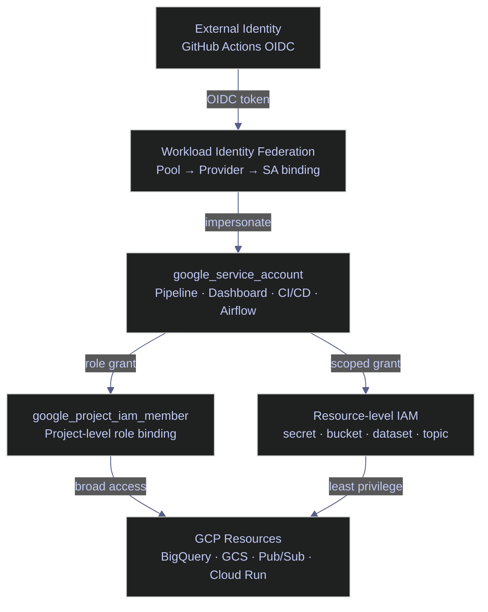
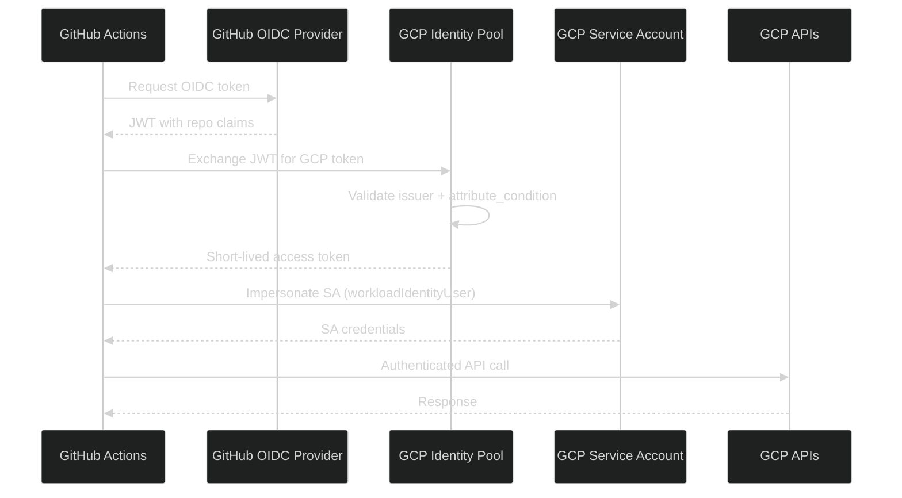
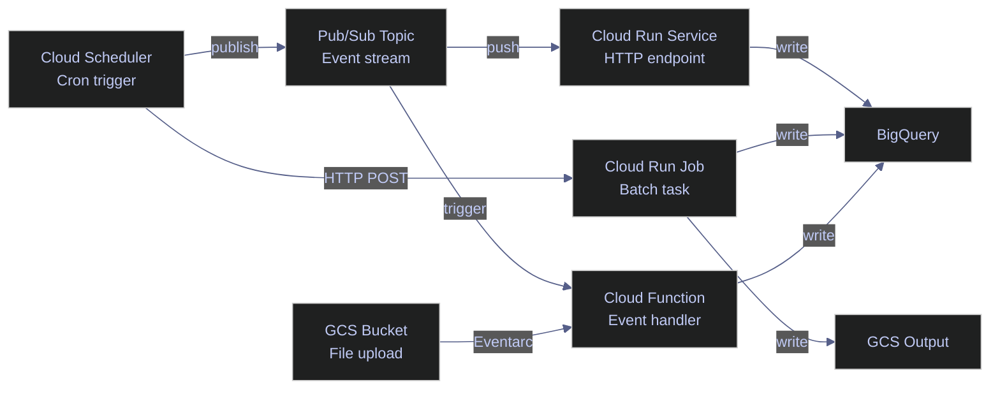

# Terraform Block Library — IAM, Secrets & Serverless (GCP)

> [!quote] Dan Kaminsky on defense in depth
>
> "The only way to do great work is to never trust a single layer of defense."
>
> — **Dan Kaminsky**, security researcher

Atomic, copy-paste Terraform blocks for GCP IAM, Secret Manager, Cloud Run v2, Cloud Functions v2, Cloud Scheduler, Pub/Sub, and Artifact Registry. Each block is self-contained and ready to adapt to any project. Argument tables document every field; callouts flag risks and best practices.

## IAM

GCP Identity and Access Management controls who (identity) can do what (role) on which resource (scope). Terraform manages IAM through three resource layers: service accounts define identities, project-level bindings grant broad access, and resource-level bindings enforce least privilege. See the `gcloud` equivalent commands in [Service Accounts and IAM](https://alp78.github.io/elysium/06-GCP/Security/service-accounts-and-iam).

> [!tip] One service account per workload
>
> Create a dedicated SA for each workload (pipeline, dashboard, CI/CD). Never share a SA between unrelated services, and never use the Compute Engine default SA for application code. This limits the blast radius if a SA is compromised.

> [!question] `iam_member` vs `iam_binding` vs `iam_policy`
>
> - **`google_project_iam_member`** — additive, grants one role to one principal without affecting other bindings. Safest for most use cases.
> - **`google_project_iam_binding`** — authoritative for a single role. Sets the complete member list for that role — anyone not listed is **removed**. Use only when you need full ownership of role membership.
> - **`google_project_iam_policy`** — authoritative for the entire project. Replaces **all** IAM policy on the project. Almost never appropriate outside bootstrap scenarios.



### google_service_account

A `google_service_account` resource creates a GCP service account — the identity that workloads use to authenticate against GCP APIs. The `account_id` becomes the email prefix: `<account_id>@<project>.iam.gserviceaccount.com`. Creating a SA does not grant it any permissions — IAM bindings (below) assign roles.

#### google_service_account | Pipeline workload

A data pipeline (Dataflow, Cloud Run Job, Composer DAG) needs to read/write GCS, BigQuery, or Pub/Sub on behalf of the pipeline process.

*Declares a service account for batch and streaming pipeline jobs.*

```hcl
resource "google_service_account" "pipeline" {
  account_id   = "data-pipeline"
  display_name = "Data Pipeline"
  description  = "SA for batch/streaming data pipeline jobs"
  project      = var.project_id
}
```

#### google_service_account | Dashboard reader

A read-only reporting or dashboarding service (Looker Studio, Metabase, Grafana) needs BigQuery or Monitoring read access without write permissions.

*Declares a read-only service account for BI and dashboarding tools.*

```hcl
resource "google_service_account" "dashboard" {
  account_id   = "dashboard-reader"
  display_name = "Dashboard Reader"
  description  = "Read-only SA for BI and dashboarding tools"
  project      = var.project_id
}
```

#### google_service_account | Airflow / Composer

Cloud Composer (managed Airflow) orchestrates pipelines and needs to trigger Cloud Run Jobs, submit Dataflow jobs, or read from GCS.

*Declares a service account for Cloud Composer worker nodes.*

```hcl
resource "google_service_account" "airflow" {
  account_id   = "airflow-worker"
  display_name = "Airflow Worker"
  description  = "SA attached to Composer environment worker nodes"
  project      = var.project_id
}
```

#### google_service_account | CI/CD deployer

A GitHub Actions workflow or Cloud Build pipeline needs to push Docker images, deploy Cloud Run services, or run Terraform.

*Declares a service account for CI/CD deployments via GitHub Actions or Cloud Build.*

```hcl
resource "google_service_account" "cicd" {
  account_id   = "cicd-deployer"
  display_name = "CI/CD Deployer"
  description  = "SA used by GitHub Actions or Cloud Build for deployments"
  project      = var.project_id
}
```

#### google_service_account | Datadog monitoring (conditional)

The Datadog GCP integration is optional. The `count` meta-argument toggles creation via a boolean variable — `1` creates the resource, `0` skips it entirely without removing the block from config.

*Conditionally declares a read-only service account for Datadog GCP monitoring integration.*

```hcl
resource "google_service_account" "datadog" {
  count        = var.dd_enabled ? 1 : 0

  account_id   = "datadog-monitor"
  display_name = "Datadog Monitoring"
  description  = "SA for Datadog GCP integration — read-only monitoring access"
  project      = var.project_id
}
```

| Argument | Required | Description |
|---|---|---|
| `account_id` | Yes | Short name; becomes the email prefix `<id>@<project>.iam.gserviceaccount.com` |
| `display_name` | No | Human-readable label shown in GCP Console IAM page |
| `description` | No | Free-text description of the SA's purpose |
| `project` | Yes | GCP project that owns this SA |
| `count` | No | Terraform meta-argument; `1` = create, `0` = skip |

### google_project_iam_member

`google_project_iam_member` grants a single role to a single principal at the **project** level. Each binding is additive — it does not affect other members of the same role. The `member` argument uses the format `serviceAccount:<email>`, `user:<email>`, or `group:<email>`.

> [!danger] Project-level grants are broad
>
> A project-level role applies to **every** resource of that type in the project. For example, `roles/bigquery.dataEditor` at the project level lets the SA modify tables in all datasets, not just one.

> [!success] Prefer resource-level IAM
>
> When a SA only needs access to specific resources, use resource-level bindings (see below) instead of project-level grants. This follows the principle of least privilege.

#### google_project_iam_member | Cloud Run invoker

A SA or user needs to call authenticated Cloud Run services via HTTPS. The `roles/run.invoker` role lets the principal send requests to any authenticated Cloud Run URL in the project.

*Grants the pipeline SA project-wide `roles/run.invoker` to call authenticated Cloud Run services.*

```hcl
resource "google_project_iam_member" "pipeline_run_invoker" {
  project = var.project_id
  role    = "roles/run.invoker"
  member  = "serviceAccount:${google_service_account.pipeline.email}"
}
```

#### google_project_iam_member | Cloud Run developer

A CI/CD SA needs to deploy new revisions to Cloud Run services. The `roles/run.developer` role allows deploying, updating, and managing Cloud Run services and jobs.

*Grants the CI/CD SA project-wide `roles/run.developer` to deploy Cloud Run revisions.*

```hcl
resource "google_project_iam_member" "cicd_run_developer" {
  project = var.project_id
  role    = "roles/run.developer"
  member  = "serviceAccount:${google_service_account.cicd.email}"
}
```

#### google_project_iam_member | Logging viewer

A dashboard or monitoring SA needs to query Cloud Logging without write access. The `roles/logging.viewer` role grants read-only access to log entries — it cannot write or export logs.

*Grants the dashboard SA project-wide `roles/logging.viewer` for read-only log access.*

```hcl
resource "google_project_iam_member" "dashboard_logging_viewer" {
  project = var.project_id
  role    = "roles/logging.viewer"
  member  = "serviceAccount:${google_service_account.dashboard.email}"
}
```

#### google_project_iam_member | Monitoring viewer (conditional)

Datadog or a dashboard SA needs to read Cloud Monitoring metrics. The `roles/monitoring.viewer` role grants read access to metrics, dashboards, and alerting policies without write access. The `count` meta-argument ties creation to the Datadog feature flag.

*Conditionally grants the Datadog SA `roles/monitoring.viewer` to read Cloud Monitoring metrics.*

```hcl
resource "google_project_iam_member" "datadog_monitoring_viewer" {
  count   = var.dd_enabled ? 1 : 0

  project = var.project_id
  role    = "roles/monitoring.viewer"
  member  = "serviceAccount:${google_service_account.datadog[0].email}"
}
```

#### google_project_iam_member | Compute viewer (conditional)

Datadog or an observability tool needs to enumerate Compute Engine instances for GCE autodiscovery. The `roles/compute.viewer` role provides a read-only view of all Compute Engine resources in the project.

*Conditionally grants the Datadog SA `roles/compute.viewer` for GCE instance enumeration.*

```hcl
resource "google_project_iam_member" "datadog_compute_viewer" {
  count   = var.dd_enabled ? 1 : 0

  project = var.project_id
  role    = "roles/compute.viewer"
  member  = "serviceAccount:${google_service_account.datadog[0].email}"
}
```

#### google_project_iam_member | BigQuery data editor

A pipeline SA needs to write rows into BigQuery tables. The `roles/bigquery.dataEditor` role allows creating, updating, and deleting tables and rows. It does **not** allow running queries — that requires `roles/bigquery.jobUser` separately.

*Grants the pipeline SA project-wide `roles/bigquery.dataEditor` to create and write BigQuery tables.*

```hcl
resource "google_project_iam_member" "pipeline_bq_data_editor" {
  project = var.project_id
  role    = "roles/bigquery.dataEditor"
  member  = "serviceAccount:${google_service_account.pipeline.email}"
}
```

#### google_project_iam_member | BigQuery job user

Any SA that runs BigQuery queries needs this role in addition to data roles. The `roles/bigquery.jobUser` role allows submitting query jobs but does not grant data access on its own.

*Grants the pipeline SA `roles/bigquery.jobUser` to submit BigQuery query jobs.*

```hcl
resource "google_project_iam_member" "pipeline_bq_job_user" {
  project = var.project_id
  role    = "roles/bigquery.jobUser"
  member  = "serviceAccount:${google_service_account.pipeline.email}"
}
```

#### google_project_iam_member | Dataflow developer

The pipeline SA needs to launch and manage Dataflow streaming or batch jobs. The `roles/dataflow.developer` role allows creating, cancelling, and updating Dataflow jobs, and viewing job metrics.

*Grants the pipeline SA `roles/dataflow.developer` to launch and manage Dataflow jobs.*

```hcl
resource "google_project_iam_member" "pipeline_dataflow_developer" {
  project = var.project_id
  role    = "roles/dataflow.developer"
  member  = "serviceAccount:${google_service_account.pipeline.email}"
}
```

#### google_project_iam_member | Pub/Sub publisher

A service needs to push messages onto Pub/Sub topics. This is a project-wide grant — the SA can publish to **any** topic. For least privilege, prefer topic-level IAM (see resource-level bindings below).

*Grants the pipeline SA project-wide `roles/pubsub.publisher` to publish to any Pub/Sub topic.*

```hcl
resource "google_project_iam_member" "pipeline_pubsub_publisher" {
  project = var.project_id
  role    = "roles/pubsub.publisher"
  member  = "serviceAccount:${google_service_account.pipeline.email}"
}
```

#### google_project_iam_member | Pub/Sub subscriber

A service needs to pull messages from Pub/Sub subscriptions. This is a project-wide grant — the SA can consume from **any** subscription. The role allows acknowledging and pulling messages but cannot publish or manage topics.

*Grants the pipeline SA project-wide `roles/pubsub.subscriber` to pull from any Pub/Sub subscription.*

```hcl
resource "google_project_iam_member" "pipeline_pubsub_subscriber" {
  project = var.project_id
  role    = "roles/pubsub.subscriber"
  member  = "serviceAccount:${google_service_account.pipeline.email}"
}
```

| Argument | Required | Description |
|---|---|---|
| `project` | Yes | GCP project where the role is granted |
| `role` | Yes | IAM role to grant (e.g., `roles/run.invoker`) |
| `member` | Yes | Principal receiving the role: `serviceAccount:<email>`, `user:<email>`, or `group:<email>` |
| `count` | No | Terraform meta-argument for conditional creation |

### Resource-Level IAM

Resource-level IAM scopes a role to a single resource (secret, bucket, dataset, topic) instead of the entire project. This is the preferred approach when a SA only needs access to specific resources. Each GCP resource type has its own `_iam_member` Terraform resource.

> [!tip] Least privilege by default
>
> Start with resource-level grants and only escalate to project-level when a workload genuinely needs access to all resources of that type. Resource-level bindings are easier to audit and revoke.

#### google_secret_manager_secret_iam_member | Secret accessor

A Cloud Run service or pipeline SA needs to read a specific secret at runtime. The `roles/secretmanager.secretAccessor` role allows reading the secret value but cannot list, create, or delete secrets. See [Secrets Management](https://alp78.github.io/elysium/06-GCP/Security/secrets-management).

*Grants the pipeline SA `roles/secretmanager.secretAccessor` on a single secret resource.*

```hcl
resource "google_secret_manager_secret_iam_member" "pipeline_db_password" {
  project   = var.project_id
  secret_id = google_secret_manager_secret.db_password.secret_id
  role      = "roles/secretmanager.secretAccessor"
  member    = "serviceAccount:${google_service_account.pipeline.email}"
}
```

#### google_service_account_iam_member | Act as (impersonation)

One SA needs to impersonate another — for example, Airflow needs to act as the pipeline SA to submit Dataflow jobs. The `roles/iam.serviceAccountUser` role grants "act as" permission, which is required to attach a SA to a resource or run a job as that SA.

*Grants the Airflow SA `roles/iam.serviceAccountUser` on the pipeline SA to enable impersonation.*

```hcl
resource "google_service_account_iam_member" "airflow_act_as_pipeline" {
  service_account_id = google_service_account.pipeline.name
  role               = "roles/iam.serviceAccountUser"
  member             = "serviceAccount:${google_service_account.airflow.email}"
}
```

#### google_storage_bucket_iam_member | Object admin

A pipeline SA needs to read/write files in a specific GCS bucket. The `roles/storage.objectAdmin` role allows creating, reading, overwriting, and deleting objects in the bucket — but cannot delete the bucket itself. See [GCS Buckets and Lifecycle](https://alp78.github.io/elysium/06-GCP/Storage/gcs-buckets-and-lifecycle).

*Grants the pipeline SA `roles/storage.objectAdmin` on a single GCS bucket.*

```hcl
resource "google_storage_bucket_iam_member" "pipeline_raw_bucket" {
  bucket = google_storage_bucket.raw.name
  role   = "roles/storage.objectAdmin"
  member = "serviceAccount:${google_service_account.pipeline.email}"
}
```

#### google_bigquery_dataset_iam_member | Data viewer

A dashboard SA needs to query tables within a specific dataset without accessing other datasets. The `roles/bigquery.dataViewer` role grants read access to tables and views within the dataset. See [Dataset and Table Management](https://alp78.github.io/elysium/06-GCP/BigQuery/dataset-and-table-management).

*Grants the dashboard SA `roles/bigquery.dataViewer` scoped to a single BigQuery dataset.*

```hcl
resource "google_bigquery_dataset_iam_member" "dashboard_analytics_dataset" {
  project    = var.project_id
  dataset_id = google_bigquery_dataset.analytics.dataset_id
  role       = "roles/bigquery.dataViewer"
  member     = "serviceAccount:${google_service_account.dashboard.email}"
}
```

#### google_pubsub_topic_iam_member | Publisher

A Cloud Function or external service needs to publish to a specific Pub/Sub topic only — more restrictive than a project-level `roles/pubsub.publisher` grant. See [Pub/Sub Topics and Subscriptions](https://alp78.github.io/elysium/06-GCP/Serverless/pubsub-topics-and-subscriptions).

*Grants the pipeline SA `roles/pubsub.publisher` scoped to a single Pub/Sub topic.*

```hcl
resource "google_pubsub_topic_iam_member" "pipeline_events_topic" {
  project = var.project_id
  topic   = google_pubsub_topic.events.name
  role    = "roles/pubsub.publisher"
  member  = "serviceAccount:${google_service_account.pipeline.email}"
}
```

### Workload Identity Federation

Workload Identity Federation lets external workloads (GitHub Actions, GitLab, AWS) authenticate to GCP without storing long-lived service account keys. An OIDC token from the external identity provider is exchanged for a short-lived GCP access token. See [GitHub Actions CI/CD](https://alp78.github.io/elysium/10-GitHub-Actions/github-actions-ci-cd) for the workflow-side configuration.

> [!info] WIF eliminates SA key management
>
> Workload Identity Federation is the recommended authentication method for CI/CD pipelines. It removes the need to create, rotate, and securely store JSON key files — the most common vector for credential leaks.



#### google_iam_workload_identity_pool | GitHub Actions

The identity pool is a container that groups external identities. GitHub Actions workflows authenticate into this pool using OIDC tokens. The `workload_identity_pool_id` becomes part of the pool's full resource name. Set `disabled = true` to temporarily block all federation without deleting the pool.

*Creates a Workload Identity Pool to group GitHub Actions OIDC identities.*

```hcl
resource "google_iam_workload_identity_pool" "github" {
  project                   = var.project_id
  workload_identity_pool_id = "github-pool"
  display_name              = "GitHub Actions"
  description               = "Identity pool for GitHub Actions OIDC federation"
  disabled                  = false
}
```

#### google_iam_workload_identity_pool_provider | GitHub OIDC

The provider registers GitHub's OIDC issuer as a trusted identity source within the pool. The `attribute_mapping` block maps GitHub's JWT claims to GCP attributes. The `attribute_condition` restricts federation to a specific repository — without it, any GitHub repository could authenticate.

*Registers GitHub's OIDC issuer as a trusted provider and maps JWT claims to GCP attributes.*

```hcl
resource "google_iam_workload_identity_pool_provider" "github_oidc" {
  project                            = var.project_id
  workload_identity_pool_id          = google_iam_workload_identity_pool.github.workload_identity_pool_id
  workload_identity_pool_provider_id = "github-oidc"
  display_name                       = "GitHub OIDC"
  description                        = "GitHub Actions OIDC provider"

  attribute_mapping = {
    "google.subject"       = "assertion.sub"
    "attribute.actor"      = "assertion.actor"
    "attribute.repository" = "assertion.repository"
  }

  attribute_condition = "assertion.repository == \"${var.github_org}/${var.github_repo}\""

  oidc {
    issuer_uri = "https://token.actions.githubusercontent.com"
  }
}
```

| Argument | Required | Description |
|---|---|---|
| `workload_identity_pool_id` | Yes | Parent pool; links this provider to its identity pool |
| `workload_identity_pool_provider_id` | Yes | Unique ID for this provider within the pool |
| `attribute_mapping` | Yes | Maps external JWT claims to GCP attributes (`google.subject` is mandatory) |
| `attribute_condition` | No | CEL expression restricting which tokens are accepted; strongly recommended |
| `oidc.issuer_uri` | Yes | The external provider's OIDC discovery URL; GitHub's is fixed |

#### google_service_account_iam_member | Workload Identity User

This binding allows GitHub Actions workflows in the specified repository to impersonate the CI/CD service account. The `principalSet` member format matches any identity from the pool whose `attribute.repository` matches the configured org/repo. The `roles/iam.workloadIdentityUser` role is specifically designed for this federation pattern.

*Grants the WIF pool principal `roles/iam.workloadIdentityUser` to impersonate the CI/CD service account.*

```hcl
resource "google_service_account_iam_member" "github_cicd_wif" {
  service_account_id = google_service_account.cicd.name
  role               = "roles/iam.workloadIdentityUser"
  member             = "principalSet://iam.googleapis.com/${google_iam_workload_identity_pool.github.name}/attribute.repository/${var.github_org}/${var.github_repo}"
}
```

## Secret Manager

GCP Secret Manager stores sensitive data (API keys, database passwords, certificates) as versioned secrets with automatic encryption at rest. Terraform manages secrets through two resources: `google_secret_manager_secret` (the container with replication policy) and `google_secret_manager_secret_version` (the actual value). See the `gcloud` equivalent commands in [Secrets Management](https://alp78.github.io/elysium/06-GCP/Security/secrets-management).

> [!danger] Terraform stores secret values in state
>
> When Terraform creates a `google_secret_manager_secret_version`, the plaintext value is written to the state file. Anyone with access to the state file can read the secret.

> [!success] Protect the state file
>
> Always use a remote backend (GCS with encryption) and restrict access to the state bucket. Mark all secret variables as `sensitive = true` so Terraform redacts them in plan output and logs.

> [!warning] Missing `prevent_destroy` on secrets
>
> Accidental `terraform destroy` permanently deletes secrets and all their versions. There is no undo.

> [!success] Add lifecycle protection
>
> Add `lifecycle { prevent_destroy = true }` to secret containers that hold production credentials.

### google_secret_manager_secret

The secret resource creates the container (metadata and replication policy only). The actual secret value is stored in a separate version resource. This separation allows rotating values without changing IAM grants. The `secret_id` is unique within the project and is used in API calls, IAM bindings, and Cloud Run secret references.

#### google_secret_manager_secret | Auto replication

The most common pattern — Google automatically chooses replica locations and manages encryption. Suitable for most workloads where data residency is not a concern.

*Creates a Secret Manager secret container with Google-managed automatic replication.*

```hcl
resource "google_secret_manager_secret" "db_password" {
  project   = var.project_id
  secret_id = "db-password"

  labels = {
    environment = var.environment
    managed_by  = "terraform"
  }

  replication {
    auto {}
  }
}
```

#### google_secret_manager_secret | User-managed replication

Compliance or data residency requirements mandate specific regions. Each `replicas` block pins a copy to a named region. Add more blocks for additional redundancy.

*Creates a Secret Manager secret container with user-managed replication pinned to specific regions.*

```hcl
resource "google_secret_manager_secret" "db_password_regional" {
  project   = var.project_id
  secret_id = "db-password-regional"

  replication {
    user_managed {
      replicas {
        location = "us-central1"
      }
      replicas {
        location = "us-east1"
      }
    }
  }
}
```

| Argument | Required | Description |
|---|---|---|
| `secret_id` | Yes | Unique ID within the project; used in API calls and IAM bindings |
| `project` | Yes | GCP project that owns this secret |
| `labels` | No | Key-value pairs for cost attribution and filtering (e.g., `environment`, `managed_by`) |
| `replication.auto` | Yes* | Google-managed replica placement; simplest option |
| `replication.user_managed.replicas` | Yes* | Explicit region list for data residency; mutually exclusive with `auto` |

### google_secret_manager_secret_version

The version resource holds the actual plaintext value. Each new version is immutable — updating `secret_data` creates a new version and disables the old one. The `ignore_changes` lifecycle rule prevents Terraform from replacing the version when the value is rotated outside Terraform (e.g., by a rotation function or manual update).

*Stores the initial secret value and ignores external rotations to prevent Terraform drift.*

```hcl
resource "google_secret_manager_secret_version" "db_password" {
  secret      = google_secret_manager_secret.db_password.id
  secret_data = var.db_password

  lifecycle {
    ignore_changes = [secret_data]
  }
}
```

| Argument | Required | Description |
|---|---|---|
| `secret` | Yes | Parent secret container resource ID |
| `secret_data` | Yes | The actual secret value; mark the variable as `sensitive = true` |
| `lifecycle.ignore_changes` | No | Prevents Terraform from drift-correcting externally rotated values |

#### google_secret_manager_secret | Conditional creation (Datadog)

When a third-party integration is optional, both the secret container and version use `count` so they are created or destroyed together. The `count` expressions must match — if the container is skipped, the version must also be skipped. Reference count-controlled resources with `[0]` because `count = 1` produces a list.

*Conditionally creates both the secret container and version for a Datadog API key; both use matching `count` expressions.*

```hcl
resource "google_secret_manager_secret" "dd_api_key" {
  count     = var.dd_api_key != "" ? 1 : 0

  project   = var.project_id
  secret_id = "datadog-api-key"

  labels = {
    managed_by = "terraform"
  }

  replication {
    auto {}
  }
}

resource "google_secret_manager_secret_version" "dd_api_key" {
  count = var.dd_api_key != "" ? 1 : 0

  secret      = google_secret_manager_secret.dd_api_key[0].id
  secret_data = var.dd_api_key
}
```

## Cloud Run

Cloud Run is a fully managed platform for running containers. It comes in two resource types: **services** (always-on HTTP endpoints) and **jobs** (run-to-completion tasks). Terraform uses the v2 API resources (`google_cloud_run_v2_service`, `google_cloud_run_v2_job`) which supersede the older v1 resources. See the `gcloud` equivalent commands in [Cloud Run Jobs vs Services](https://alp78.github.io/elysium/06-GCP/Serverless/cloud-run-jobs-vs-services).

> [!info] Cloud Run v2 is the current API
>
> Always use `google_cloud_run_v2_service` and `google_cloud_run_v2_job` — the v1 resources (`google_cloud_run_service`) are in maintenance mode. V2 supports direct VPC egress, GPU, multi-container sidecars, and startup/liveness probes.



### google_cloud_run_v2_service

A long-running HTTP server that handles concurrent requests — a REST API, webhook receiver, or internal web app. Cloud Run automatically scales instances based on incoming request volume and can scale to zero when idle.

The `template` block defines the revision spec: container image, resource limits, environment variables, scaling bounds, and VPC access. Each `terraform apply` that changes the template creates a new revision. The `lifecycle.ignore_changes` on the image field lets CI/CD deploy new image tags without Terraform reverting them.

The service name must be lowercase letters, digits, and hyphens, max 49 characters. The `ingress` setting controls network access: `INGRESS_TRAFFIC_ALL` (public), `INTERNAL_ONLY`, or `INTERNAL_AND_CLOUD_LOAD_BALANCING`. The `execution_environment` should be `EXECUTION_ENVIRONMENT_GEN2` — gen2 supports full Linux syscalls and longer request timeouts.

For resource limits, `cpu_idle = true` throttles CPU when not processing requests (saves cost), while `startup_cpu_boost = true` gives extra CPU during container startup to reduce cold start latency. The `ports.name` field accepts `http1` (HTTP/1.1) or `h2c` (HTTP/2 cleartext). Secret-backed environment variables use `value_source.secret_key_ref` — the `version` field accepts `"latest"` (always newest enabled version) or a specific version number for stability.

The `vpc_access` block connects the service to a VPC through a Serverless VPC Access connector. Set `egress` to `PRIVATE_RANGES_ONLY` to route only RFC1918 traffic through the VPC, or `ALL_TRAFFIC` for full VPC egress.

*Deploys a Cloud Run v2 HTTP service with scaling bounds, secret-backed env vars, health probes, and VPC egress.*

```hcl
resource "google_cloud_run_v2_service" "api" {
  project  = var.project_id
  name     = "api-service"
  location = var.region

  ingress = "INGRESS_TRAFFIC_ALL"

  labels = {
    environment = var.environment
    managed_by  = "terraform"
  }

  template {
    labels = {
      commit = var.git_sha
    }

    service_account       = google_service_account.pipeline.email
    session_affinity      = false
    execution_environment = "EXECUTION_ENVIRONMENT_GEN2"
    timeout               = "300s"

    scaling {
      min_instance_count = 1
      max_instance_count = 10
    }

    containers {
      name  = "api"
      image = "${var.region}-docker.pkg.dev/${var.project_id}/${var.artifact_repo}/api:${var.image_tag}"

      resources {
        limits = {
          cpu    = "1"
          memory = "512Mi"
        }
        cpu_idle          = true
        startup_cpu_boost = true
      }

      env {
        name  = "ENV"
        value = var.environment
      }
      env {
        name  = "PROJECT_ID"
        value = var.project_id
      }
      env {
        name  = "LOG_LEVEL"
        value = "INFO"
      }

      env {
        name = "DB_PASSWORD"
        value_source {
          secret_key_ref {
            secret  = google_secret_manager_secret.db_password.secret_id
            version = "latest"
          }
        }
      }

      ports {
        name           = "http1"
        container_port = 8080
      }

      startup_probe {
        http_get {
          path = "/healthz"
          port = 8080
        }
        initial_delay_seconds = 5
        period_seconds        = 10
        failure_threshold     = 3
        timeout_seconds       = 5
      }

      liveness_probe {
        http_get {
          path = "/healthz"
          port = 8080
        }
        period_seconds    = 30
        failure_threshold = 3
        timeout_seconds   = 5
      }
    }

    vpc_access {
      connector = var.vpc_connector_id
      egress    = "PRIVATE_RANGES_ONLY"
    }
  }

  lifecycle {
    ignore_changes = [
      template[0].containers[0].image,
    ]
  }
}
```

| Argument | Required | Description |
|---|---|---|
| `name` | Yes | Service name; lowercase, digits, hyphens; max 49 chars |
| `location` | Yes | GCP region (e.g., `us-central1`) |
| `ingress` | No | Network access: `INGRESS_TRAFFIC_ALL`, `INTERNAL_ONLY`, `INTERNAL_AND_CLOUD_LOAD_BALANCING` |
| `template.service_account` | No | SA the revision runs as; determines GCP API access |
| `template.scaling.min_instance_count` | No | Minimum warm instances; `0` = scale to zero, `1` = avoid cold starts |
| `template.scaling.max_instance_count` | No | Upper scaling bound; protects against runaway costs |
| `template.execution_environment` | No | `EXECUTION_ENVIRONMENT_GEN2` for full Linux syscall support |
| `template.timeout` | No | Max request duration; Cloud Run max is `3600s` |
| `containers.image` | Yes | Full Artifact Registry image path |
| `containers.resources.limits.cpu` | No | vCPU: `"1"`, `"2"`, `"500m"` (0.5 vCPU) |
| `containers.resources.limits.memory` | No | RAM per instance; minimum `128Mi` |
| `containers.resources.cpu_idle` | No | `true` = throttle CPU when idle (cost saving) |
| `containers.resources.startup_cpu_boost` | No | `true` = extra CPU during startup (reduces cold start) |
| `vpc_access.connector` | No | Serverless VPC Access connector resource ID |
| `vpc_access.egress` | No | `PRIVATE_RANGES_ONLY` or `ALL_TRAFFIC` |

### google_cloud_run_v2_job

A Cloud Run Job runs a containerized task to completion and exits — it does not expose an HTTP endpoint. Use jobs for nightly ETL, data exports, model training, or database migrations. Jobs support parallel task execution (`task_count` > 1) and automatic retries on failure.

The nested `template.template` structure is intentional: the outer `template` defines execution-level settings (task count, parallelism), while the inner `template` defines the task spec (container, timeout, retries, volumes). The `max_retries` setting retries failed tasks automatically — set to `0` for operations that should not retry (e.g., migrations). Jobs support secret volume mounts for multi-key JSON credentials: the `volumes.secret` block maps a Secret Manager secret to a file path inside the container.

#### google_cloud_run_v2_job | Batch ETL pipeline

A nightly ETL job that reads from GCS, transforms data, and writes to BigQuery. Batch jobs typically use more CPU and memory than web services. The `volume_mounts` block mounts a JSON credentials file from Secret Manager at `/secrets/credentials.json` inside the container.

*Defines a Cloud Run v2 batch ETL job with secret volume mount and VPC egress.*

```hcl
resource "google_cloud_run_v2_job" "etl_pipeline" {
  project  = var.project_id
  name     = "etl-pipeline"
  location = var.region

  labels = {
    environment = var.environment
    managed_by  = "terraform"
  }

  template {
    task_count  = 1
    parallelism = 1

    template {
      timeout               = "3600s"
      max_retries           = 3
      service_account       = google_service_account.pipeline.email
      execution_environment = "EXECUTION_ENVIRONMENT_GEN2"

      containers {
        name  = "etl"
        image = "${var.region}-docker.pkg.dev/${var.project_id}/${var.artifact_repo}/etl:${var.image_tag}"

        resources {
          limits = {
            cpu    = "2"
            memory = "2Gi"
          }
        }

        env {
          name  = "ENV"
          value = var.environment
        }
        env {
          name  = "BQ_DATASET"
          value = var.bq_dataset
        }
        env {
          name  = "GCS_BUCKET"
          value = var.raw_bucket_name
        }

        env {
          name = "API_SECRET_KEY"
          value_source {
            secret_key_ref {
              secret  = google_secret_manager_secret.api_key.secret_id
              version = "latest"
            }
          }
        }

        volume_mounts {
          name       = "credentials"
          mount_path = "/secrets"
        }
      }

      volumes {
        name = "credentials"
        secret {
          secret = google_secret_manager_secret.sa_key.secret_id
          items {
            version = "latest"
            path    = "credentials.json"
          }
        }
      }

      vpc_access {
        connector = var.vpc_connector_id
        egress    = "PRIVATE_RANGES_ONLY"
      }
    }
  }
}
```

#### google_cloud_run_v2_job | One-time migration

A database migration or one-time setup script using the same image as the pipeline but with a different entrypoint. The `command` and `args` fields override the container's default CMD. Set `max_retries = 0` because migrations should not retry automatically — manual intervention is required on failure. Set a shorter `timeout` so failures surface quickly.

*Defines a one-time Cloud Run v2 job for database migrations with no automatic retries.*

```hcl
resource "google_cloud_run_v2_job" "db_migrate" {
  project  = var.project_id
  name     = "db-migrate"
  location = var.region

  labels = {
    environment = var.environment
    managed_by  = "terraform"
    purpose     = "migration"
  }

  template {
    task_count  = 1
    parallelism = 1

    template {
      timeout         = "600s"
      max_retries     = 0
      service_account = google_service_account.pipeline.email

      containers {
        name    = "migrate"
        image   = "${var.region}-docker.pkg.dev/${var.project_id}/${var.artifact_repo}/etl:${var.image_tag}"
        command = ["/bin/sh"]
        args    = ["-c", "python manage.py migrate --noinput"]

        resources {
          limits = {
            cpu    = "1"
            memory = "512Mi"
          }
        }

        env {
          name  = "ENV"
          value = var.environment
        }
        env {
          name = "DB_URL"
          value_source {
            secret_key_ref {
              secret  = google_secret_manager_secret.db_url.secret_id
              version = "latest"
            }
          }
        }
      }

      vpc_access {
        connector = var.vpc_connector_id
        egress    = "PRIVATE_RANGES_ONLY"
      }
    }
  }
}
```

| Argument | Required | Description |
|---|---|---|
| `name` | Yes | Job name; shown in Console and used in `gcloud run jobs execute` |
| `location` | Yes | GCP region |
| `template.task_count` | No | Number of parallel tasks; increase for fan-out workloads |
| `template.parallelism` | No | Max tasks running simultaneously; must be ≤ `task_count` |
| `template.template.timeout` | No | Max duration per task; Cloud Run Jobs max is `86400s` (24h) |
| `template.template.max_retries` | No | Retry failed tasks up to N times; `0` = no retries |
| `containers.command` | No | Override container CMD; use for alternative entrypoints |
| `containers.args` | No | Arguments to the command |
| `containers.volume_mounts` | No | Mount a secret volume at a path inside the container |
| `volumes.secret` | No | Maps a Secret Manager secret to a file in the container |

### google_cloud_run_v2_service_iam_member

Service-level IAM controls who can invoke a specific Cloud Run service. This is separate from project-level IAM — a service-level binding scopes access to a single service rather than all services in the project.

#### google_cloud_run_v2_service_iam_member | Public access

The service is accessible to anyone on the internet without authentication. The `allUsers` member is a special value meaning no authentication is required. Use for public APIs or static site proxies.

> [!danger] `allUsers` removes all authentication
>
> Anyone on the internet can call this service. There is no rate limiting built into Cloud Run — DDoS traffic will scale instances and incur costs.

> [!success] Protect public services
>
> Place a Cloud Load Balancer with Cloud Armor in front of public services to add rate limiting, WAF rules, and DDoS protection. Or use `INTERNAL_AND_CLOUD_LOAD_BALANCING` ingress instead of `INGRESS_TRAFFIC_ALL`.

*Grants `allUsers` `roles/run.invoker` to make the Cloud Run service publicly accessible.*

```hcl
resource "google_cloud_run_v2_service_iam_member" "api_public" {
  project  = var.project_id
  location = google_cloud_run_v2_service.api.location
  name     = google_cloud_run_v2_service.api.name
  role     = "roles/run.invoker"
  member   = "allUsers"
}
```

#### google_cloud_run_v2_service_iam_member | Authenticated access

Only a specific service account (Cloud Scheduler, Airflow, another Cloud Run service) can invoke this service. All other callers receive HTTP 403. This is the recommended pattern for internal service-to-service communication.

*Grants a specific service account `roles/run.invoker` on a single Cloud Run service for authenticated access.*

```hcl
resource "google_cloud_run_v2_service_iam_member" "api_airflow_invoker" {
  project  = var.project_id
  location = google_cloud_run_v2_service.api.location
  name     = google_cloud_run_v2_service.api.name
  role     = "roles/run.invoker"
  member   = "serviceAccount:${google_service_account.airflow.email}"
}
```

## Cloud Functions

Cloud Functions v2 (`google_cloudfunctions2_function`) is GCP's function-as-a-service platform built on Cloud Run. It supports HTTP triggers, Pub/Sub event triggers, and Eventarc-based GCS triggers. The Terraform resource configures both the build (source code, runtime) and the service (scaling, memory, networking). See the runtime equivalent in [Cloud Run Jobs vs Services](https://alp78.github.io/elysium/06-GCP/Serverless/cloud-run-jobs-vs-services).

> [!info] Cloud Functions v2 runs on Cloud Run
>
> Under the hood, each Cloud Function v2 deployment creates a Cloud Run service. This means the same scaling model, networking (VPC connectors, direct VPC egress), and execution environments apply. Choose Cloud Functions for simple event-driven workloads; choose Cloud Run directly for multi-container, custom binary, or long-running HTTP services.

### google_cloudfunctions2_function

The function resource has two main configuration blocks: `build_config` (source code location, runtime, entry point) and `service_config` (scaling, memory, timeout, networking). The `build_config.source.storage_source` points to a GCS bucket containing the zipped source code. The `service_config.secret_environment_variables` block injects secrets from Secret Manager as environment variables without exposing them in Terraform plan output.

#### google_cloudfunctions2_function | HTTP trigger

A lightweight function invoked by HTTP requests — a webhook handler or simple API endpoint that does not justify a full Cloud Run service. The function name also becomes the URL path component. Set `ingress_settings` to `ALLOW_ALL` for public access or `ALLOW_INTERNAL_AND_GCLB` for private + load balancer only. The `all_traffic_on_latest_revision` flag routes 100% of traffic to the latest deployed revision.

*Deploys a Cloud Functions v2 HTTP-triggered function with secret env var injection and VPC egress.*

```hcl
resource "google_cloudfunctions2_function" "webhook_handler" {
  project  = var.project_id
  name     = "webhook-handler"
  location = var.region

  labels = {
    environment = var.environment
    managed_by  = "terraform"
  }

  build_config {
    runtime     = "python311"
    entry_point = "handle_webhook"
    environment_variables = {
      BUILD_ENV = var.environment
    }
    source {
      storage_source {
        bucket = google_storage_bucket.function_source.name
        object = google_storage_bucket_object.webhook_source.name
      }
    }
  }

  service_config {
    min_instance_count             = 0
    max_instance_count             = 10
    available_memory               = "256M"
    available_cpu                  = "1"
    timeout_seconds                = 60
    service_account_email          = google_service_account.pipeline.email
    ingress_settings               = "ALLOW_ALL"
    all_traffic_on_latest_revision = true

    environment_variables = {
      ENV        = var.environment
      PROJECT_ID = var.project_id
    }

    secret_environment_variables {
      key        = "API_KEY"
      project_id = var.project_id
      secret     = google_secret_manager_secret.api_key.secret_id
      version    = "latest"
    }

    vpc_connector                  = var.vpc_connector_id
    vpc_connector_egress_settings  = "PRIVATE_RANGES_ONLY"
  }
}
```

#### google_cloudfunctions2_function | Pub/Sub trigger

A function that automatically fires whenever a message is published to a Pub/Sub topic — for event-driven ETL or notifications. The `event_trigger` block configures the CloudEvents subscription. The `entry_point` function must accept CloudEvent parameters. Set `retry_policy` to `RETRY_POLICY_RETRY` to redeliver on failure, or `RETRY_POLICY_DO_NOT_RETRY` to drop failed messages. The function must acknowledge within `timeout_seconds` or the message is redelivered.

*Deploys a Cloud Functions v2 function triggered by Pub/Sub messages with retry on failure.*

```hcl
resource "google_cloudfunctions2_function" "pubsub_processor" {
  project  = var.project_id
  name     = "pubsub-processor"
  location = var.region

  build_config {
    runtime     = "python311"
    entry_point = "process_message"
    source {
      storage_source {
        bucket = google_storage_bucket.function_source.name
        object = google_storage_bucket_object.processor_source.name
      }
    }
  }

  service_config {
    min_instance_count    = 0
    max_instance_count    = 20
    available_memory      = "512M"
    timeout_seconds       = 300
    service_account_email = google_service_account.pipeline.email

    environment_variables = {
      ENV = var.environment
    }
  }

  event_trigger {
    trigger_region = var.region
    event_type     = "google.cloud.pubsub.topic.v1.messagePublished"
    pubsub_topic   = google_pubsub_topic.events.id
    retry_policy   = "RETRY_POLICY_RETRY"
  }
}
```

#### google_cloudfunctions2_function | GCS event trigger

A function that fires whenever a new file is uploaded to a GCS bucket — for processing CSV files dropped into a landing bucket. This uses Eventarc under the hood. The `event_filters` block scopes the trigger to a specific bucket. The `event_trigger.service_account_email` is the SA that Eventarc uses to invoke the function (separate from `service_config.service_account_email` which is the SA the function runs as). Other useful event types: `object.v1.deleted`, `object.v1.archived`, `object.v1.metadataUpdated`.

*Deploys a Cloud Functions v2 function triggered by GCS object finalization events via Eventarc.*

```hcl
resource "google_cloudfunctions2_function" "gcs_file_processor" {
  project  = var.project_id
  name     = "gcs-file-processor"
  location = var.region

  build_config {
    runtime     = "python311"
    entry_point = "process_file"
    source {
      storage_source {
        bucket = google_storage_bucket.function_source.name
        object = google_storage_bucket_object.file_processor_source.name
      }
    }
  }

  service_config {
    min_instance_count    = 0
    max_instance_count    = 5
    available_memory      = "1G"
    timeout_seconds       = 540
    service_account_email = google_service_account.pipeline.email

    environment_variables = {
      ENV            = var.environment
      TARGET_DATASET = var.bq_dataset
    }
  }

  event_trigger {
    trigger_region        = var.region
    event_type            = "google.cloud.storage.object.v1.finalized"
    retry_policy          = "RETRY_POLICY_RETRY"
    service_account_email = google_service_account.pipeline.email

    event_filters {
      attribute = "bucket"
      value     = google_storage_bucket.raw.name
    }
  }
}
```

| Argument | Required | Description |
|---|---|---|
| `name` | Yes | Function name; also the URL path component for HTTP triggers |
| `location` | Yes | GCP region |
| `build_config.runtime` | Yes | Runtime identifier (e.g., `python311`); see `gcloud functions runtimes list` |
| `build_config.entry_point` | Yes | Function/method name in source code to invoke |
| `build_config.source.storage_source` | Yes | GCS bucket and object containing the zipped source code |
| `service_config.min_instance_count` | No | `0` = scale to zero; `1` = avoid cold starts |
| `service_config.max_instance_count` | No | Upper scaling bound; protects against cost spikes |
| `service_config.available_memory` | No | RAM per instance; minimum `128M` |
| `service_config.timeout_seconds` | No | Max execution time; HTTP max `3600s`, event max `540s` |
| `service_config.ingress_settings` | No | `ALLOW_ALL` (public) or `ALLOW_INTERNAL_AND_GCLB` (private + LB) |
| `event_trigger.event_type` | Yes | CloudEvents type string (Pub/Sub or GCS) |
| `event_trigger.retry_policy` | No | `RETRY_POLICY_RETRY` or `RETRY_POLICY_DO_NOT_RETRY` |
| `event_trigger.event_filters` | No | Scope trigger to specific resources (e.g., a single GCS bucket) |

## Cloud Scheduler

Cloud Scheduler is a fully managed cron job service. Jobs can target HTTP endpoints (including Cloud Run), Pub/Sub topics, or App Engine. Use it to trigger batch pipelines, publish scheduled messages, or invoke serverless functions on a recurring schedule. See the `gcloud` equivalent commands in [GCP Scheduling](https://alp78.github.io/elysium/12-Orchestration/Scheduling/gcp-scheduling).

> [!tip] Always use UTC for schedules
>
> Set `time_zone = "UTC"` to avoid daylight-saving bugs. Cron expressions use standard 5-field format: minute, hour, day-of-month, month, day-of-week.

### google_cloud_scheduler_job

The scheduler job resource defines the cron schedule, target (HTTP or Pub/Sub), and retry behavior. For HTTP targets, the `oauth_token` block signs the request with a service account — that SA must have permission to invoke the target (e.g., `roles/run.jobs.run` for Cloud Run Jobs). The `attempt_deadline` controls how long to wait for the target to respond before marking the attempt failed.

#### google_cloud_scheduler_job | HTTP target (Cloud Run Job)

Triggers a Cloud Run Job on a cron schedule by sending a POST request to the Cloud Run API's `:run` endpoint. This creates a new Execution of the job. The `oauth_token` SA must have `run.jobs.run` permission.

*Schedules a nightly Cloud Run Job execution via authenticated HTTP POST to the Cloud Run API.*

```hcl
resource "google_cloud_scheduler_job" "nightly_etl" {
  project          = var.project_id
  name             = "nightly-etl-trigger"
  region           = var.region
  description      = "Triggers the ETL Cloud Run Job every night at 02:00 UTC"
  schedule         = "0 2 * * *"
  time_zone        = "UTC"
  attempt_deadline = "320s"

  retry_config {
    retry_count          = 3
    min_backoff_duration = "5s"
    max_backoff_duration = "3600s"
    max_doublings        = 5
  }

  http_target {
    http_method = "POST"
    uri         = "https://run.googleapis.com/v2/projects/${var.project_id}/locations/${var.region}/jobs/${google_cloud_run_v2_job.etl_pipeline.name}:run"

    oauth_token {
      service_account_email = google_service_account.airflow.email
      scope                 = "https://www.googleapis.com/auth/cloud-platform"
    }
  }
}
```

#### google_cloud_scheduler_job | Pub/Sub target

Publishes a trigger message to a Pub/Sub topic on a schedule, allowing multiple downstream subscribers to react (fan-out pattern). The `data` field must be base64-encoded — `base64encode(jsonencode(...))` handles this in HCL. The `attributes` map adds optional metadata visible alongside the message body.

*Schedules an hourly Pub/Sub trigger message with base64-encoded JSON body.*

```hcl
resource "google_cloud_scheduler_job" "hourly_trigger" {
  project     = var.project_id
  name        = "hourly-pipeline-trigger"
  region      = var.region
  description = "Publishes a trigger message to Pub/Sub every hour"
  schedule    = "0 * * * *"
  time_zone   = "UTC"

  retry_config {
    retry_count = 3
  }

  pubsub_target {
    topic_name = google_pubsub_topic.pipeline_trigger.id
    data       = base64encode(jsonencode({
      trigger = "hourly"
      source  = "cloud-scheduler"
    }))
    attributes = {
      environment = var.environment
    }
  }
}
```

| Argument | Required | Description |
|---|---|---|
| `name` | Yes | Unique name within the project and region |
| `region` | Yes | GCP region |
| `schedule` | Yes | Standard 5-field cron expression |
| `time_zone` | Yes | IANA time zone; use `UTC` to avoid DST issues |
| `attempt_deadline` | No | Max wait for target response before marking attempt failed |
| `retry_config.retry_count` | No | Number of retries on failure; `0` = no retries |
| `retry_config.min_backoff_duration` | No | Minimum wait between retries |
| `retry_config.max_backoff_duration` | No | Maximum backoff cap (exponential) |
| `http_target.uri` | Yes* | Target URL; mutually exclusive with `pubsub_target` |
| `http_target.oauth_token` | No | SA to sign the HTTP request; must have invoke permission on target |
| `pubsub_target.topic_name` | Yes* | Full Pub/Sub topic resource name; mutually exclusive with `http_target` |
| `pubsub_target.data` | No | Base64-encoded message body |

## Pub/Sub

Pub/Sub is GCP's asynchronous messaging service for decoupling producers and consumers. Terraform manages topics (message channels), subscriptions (delivery endpoints), and schemas (message structure enforcement). See the `gcloud` equivalent commands in [Pub/Sub Topics and Subscriptions](https://alp78.github.io/elysium/06-GCP/Serverless/pubsub-topics-and-subscriptions).

> [!question] Pull vs Push subscription
>
> - **Pull** — the subscriber calls `pull` to fetch messages. Best for batch processing, backpressure control, and when the subscriber controls its own pace.
> - **Push** — Pub/Sub sends HTTP POST requests to an endpoint. Best for serverless targets (Cloud Run, Cloud Functions) where you want zero-polling simplicity.
> - **BigQuery** — Pub/Sub writes messages directly to a BigQuery table. Best for analytics pipelines that don't need real-time processing.

### google_pubsub_topic

A topic is the channel through which messages are published. Subscribers attach subscriptions to pull or receive messages. Create one topic per logical event stream. The `message_retention_duration` controls how long messages are retained on the topic for replay (default is `0` — no retention beyond subscription ack deadline). The `schema_settings` block enforces message structure validation at publish time.

#### google_pubsub_topic | With message retention

Messages are retained for replay even if no subscription reads them immediately — useful during incidents or backfills. The `schema_settings` block references a `google_pubsub_schema` resource to enforce message structure. Set `encoding` to `JSON` for human-readable messages or `BINARY` for more efficient Avro/Protobuf encoding.

*Creates a Pub/Sub topic with 7-day message retention and Avro schema validation.*

```hcl
resource "google_pubsub_topic" "events" {
  project = var.project_id
  name    = "data-events"

  labels = {
    environment = var.environment
    managed_by  = "terraform"
  }

  message_retention_duration = "604800s"

  schema_settings {
    schema   = google_pubsub_schema.events.id
    encoding = "JSON"
  }
}
```

#### google_pubsub_topic | Simple trigger (no schema)

A lightweight trigger topic without schema enforcement. Triggers are short-lived and do not need long retention — 1 day (`86400s`) is sufficient.

*Creates a lightweight Pub/Sub trigger topic with 1-day message retention and no schema.*

```hcl
resource "google_pubsub_topic" "pipeline_trigger" {
  project = var.project_id
  name    = "pipeline-trigger"

  labels = {
    environment = var.environment
    managed_by  = "terraform"
  }

  message_retention_duration = "86400s"
}
```

| Argument | Required | Description |
|---|---|---|
| `name` | Yes | Topic name; becomes `projects/<project>/topics/<name>` |
| `project` | Yes | GCP project |
| `message_retention_duration` | No | How long to retain messages on the topic; max `604800s` (7 days); default `0` |
| `schema_settings.schema` | No | Reference to a `google_pubsub_schema` resource for message validation |
| `schema_settings.encoding` | No | `JSON` or `BINARY`; required when `schema` is set |
| `message_storage_policy` | No | Controls which regions can store messages; omit for Google-managed placement |

### google_pubsub_subscription

A subscription attaches to a topic and controls how messages are delivered to consumers. Key settings include the ack deadline (how long before unacknowledged messages are redelivered), retry policy (backoff between retries), and dead letter policy (where undeliverable messages go after exhausting retries).

The dead letter pattern requires four resources that form a tightly coupled unit: the subscription itself, a dead letter topic, and two IAM bindings granting the Pub/Sub service agent permission to publish to the dead letter topic and acknowledge messages in the source subscription. The Pub/Sub service agent SA has a fixed format: `service-<project_number>@gcp-sa-pubsub.iam.gserviceaccount.com`.

> [!warning] Subscription expiration
>
> By default, Pub/Sub deletes inactive subscriptions after 31 days. Set `expiration_policy.ttl = ""` (empty string) to prevent expiration on subscriptions that may be idle for extended periods.

> [!success] Explicitly set TTL
>
> Always set `expiration_policy.ttl` explicitly — either a specific duration or `""` for never-expire — so the behavior is documented in code rather than relying on the default.

#### google_pubsub_subscription | Pull with dead letter

A pipeline service pulls messages from a topic with robust error handling. Messages that exceed `max_delivery_attempts` are routed to a dead letter topic for inspection. The `retain_acked_messages` flag controls whether messages are kept after acknowledgment (useful for replay). The optional `filter` field accepts a CEL expression to receive only messages with specific attributes.

*Creates a pull subscription with dead-letter routing, retry backoff, and required Pub/Sub service-agent IAM bindings.*

```hcl
resource "google_pubsub_subscription" "events_pull" {
  project = var.project_id
  name    = "data-events-pipeline-sub"
  topic   = google_pubsub_topic.events.id

  labels = {
    environment = var.environment
    managed_by  = "terraform"
  }

  ack_deadline_seconds       = 60
  message_retention_duration = "604800s"
  retain_acked_messages      = false

  expiration_policy {
    ttl = "2678400s"
  }

  retry_policy {
    minimum_backoff = "10s"
    maximum_backoff = "600s"
  }

  dead_letter_policy {
    dead_letter_topic     = google_pubsub_topic.events_deadletter.id
    max_delivery_attempts = 5
  }

  enable_exactly_once_delivery = false
}

resource "google_pubsub_topic" "events_deadletter" {
  project = var.project_id
  name    = "data-events-deadletter"

  labels = {
    environment = var.environment
    managed_by  = "terraform"
  }
}

resource "google_pubsub_topic_iam_member" "deadletter_publisher" {
  project = var.project_id
  topic   = google_pubsub_topic.events_deadletter.name
  role    = "roles/pubsub.publisher"
  member  = "serviceAccount:service-${data.google_project.current.number}@gcp-sa-pubsub.iam.gserviceaccount.com"
}

resource "google_pubsub_subscription_iam_member" "deadletter_subscriber" {
  project      = var.project_id
  subscription = google_pubsub_subscription.events_pull.name
  role         = "roles/pubsub.subscriber"
  member       = "serviceAccount:service-${data.google_project.current.number}@gcp-sa-pubsub.iam.gserviceaccount.com"
}
```

#### google_pubsub_subscription | Push to Cloud Run

Pub/Sub delivers messages by pushing HTTP POST requests directly to a Cloud Run service — simpler than running a pull loop. The `push_config.oidc_token` block authenticates the push request using a service account. The `audience` must match the Cloud Run service URL for token validation. Set `expiration_policy.ttl = ""` for push subscriptions, which are usually permanent. The `no_wrapper.write_metadata` flag controls whether messages are wrapped in the standard Pub/Sub JSON envelope (`false`) or sent as raw body only (`true`).

*Creates a push subscription that delivers messages to a Cloud Run service via authenticated OIDC HTTP POST.*

```hcl
resource "google_pubsub_subscription" "events_push" {
  project = var.project_id
  name    = "data-events-push-sub"
  topic   = google_pubsub_topic.events.id

  labels = {
    environment = var.environment
    managed_by  = "terraform"
  }

  ack_deadline_seconds = 60

  push_config {
    push_endpoint = "${google_cloud_run_v2_service.api.uri}/pubsub/events"

    oidc_token {
      service_account_email = google_service_account.pipeline.email
      audience              = google_cloud_run_v2_service.api.uri
    }

    no_wrapper {
      write_metadata = false
    }
  }

  retry_policy {
    minimum_backoff = "10s"
    maximum_backoff = "300s"
  }

  expiration_policy {
    ttl = ""
  }
}
```

| Argument | Required | Description |
|---|---|---|
| `name` | Yes | Subscription name; unique within the project |
| `topic` | Yes | Topic resource ID this subscription reads from |
| `ack_deadline_seconds` | No | Seconds before unacked messages are redelivered; max `600` |
| `message_retention_duration` | No | How long to retain unacked messages; max `604800s` (7 days) |
| `retain_acked_messages` | No | `true` = keep messages after ack for replay; `false` = delete after ack |
| `expiration_policy.ttl` | No | Delete subscription if inactive for this duration; `""` = never expire |
| `retry_policy.minimum_backoff` | No | Minimum wait before redelivery |
| `retry_policy.maximum_backoff` | No | Maximum backoff cap (exponential) |
| `dead_letter_policy.dead_letter_topic` | No | Topic for undeliverable messages |
| `dead_letter_policy.max_delivery_attempts` | No | Attempts before routing to dead letter; minimum `5` |
| `push_config.push_endpoint` | No | HTTPS URL for push delivery; mutually exclusive with pull |
| `push_config.oidc_token` | No | SA identity for authenticating push requests |
| `enable_exactly_once_delivery` | No | `true` = exactly-once semantics; `false` = at-least-once (default) |

### google_pubsub_schema

A schema enforces a consistent message structure across all publishers — preventing malformed messages from reaching subscribers and breaking pipelines. Schemas are referenced by topics via the `schema_settings` block. Pub/Sub validates messages at publish time and rejects any that do not conform.

#### google_pubsub_schema | Avro

Avro is the more common schema format in data engineering. The `definition` field is the Avro schema encoded as a JSON string using `jsonencode()`. Avro uses `"record"` type for named objects with fields. Union types like `["null", "string"]` create optional fields — placing `"null"` first makes the field default to null.

*Defines a Pub/Sub Avro schema with required and optional fields for publish-time message validation.*

```hcl
resource "google_pubsub_schema" "events" {
  project    = var.project_id
  name       = "data-events-schema"
  type       = "AVRO"

  definition = jsonencode({
    type      = "record"
    name      = "DataEvent"
    namespace = "com.example.events"
    fields = [
      {
        name = "event_id"
        type = "string"
        doc  = "Unique identifier for this event (UUID)"
      },
      {
        name = "event_type"
        type = "string"
        doc  = "Category of event, e.g. 'user.signup', 'order.created'"
      },
      {
        name        = "timestamp"
        type        = "long"
        logicalType = "timestamp-millis"
        doc         = "Event timestamp in milliseconds since Unix epoch"
      },
      {
        name    = "payload"
        type    = ["null", "string"]
        default = null
        doc     = "Optional JSON payload for event-specific data"
      }
    ]
  })
}
```

#### google_pubsub_schema | Protocol Buffer

Protobuf is preferred when performance and binary encoding are priorities. The `definition` field is the raw `.proto` file content. Use `proto3` syntax. Field numbers (1, 2, 3, ...) must never change once published to maintain backward compatibility — they are part of the wire format.

*Defines a Pub/Sub Protocol Buffer schema using a heredoc proto3 definition.*

```hcl
resource "google_pubsub_schema" "events_proto" {
  project = var.project_id
  name    = "data-events-proto-schema"
  type    = "PROTOCOL_BUFFER"

  definition = <<-PROTO
    syntax = "proto3";
    message DataEvent {
      string event_id   = 1;
      string event_type = 2;
      int64  timestamp  = 3;
      string payload    = 4;
    }
  PROTO
}
```

| Argument | Required | Description |
|---|---|---|
| `name` | Yes | Schema name; referenced by topic's `schema_settings` block |
| `type` | Yes | `AVRO` or `PROTOCOL_BUFFER` |
| `definition` | Yes | Schema definition string (JSON for Avro, proto file for Protobuf) |
| `project` | Yes | GCP project |

## Artifact Registry

Artifact Registry is GCP's managed package repository for Docker images, Maven, NPM, Python, and other formats. Co-locate the registry in the same region as Cloud Run for faster image pulls. Cleanup policies automatically remove old or untagged images to control storage costs.

### google_artifact_registry_repository

The repository resource creates a package registry with optional cleanup policies and immutable tag settings. The `repository_id` becomes part of the image path: `<region>-docker.pkg.dev/<project>/<repository_id>/<image>:<tag>`. The `format` field determines the package type (`DOCKER`, `MAVEN`, `NPM`, `PYTHON`, `APT`, `YUM`).

Cleanup policies use `KEEP` actions (retain matching images) and `DELETE` actions (remove matching images). Each policy has a unique `id` within the repository. The `condition` block filters by tag state (`TAGGED`, `UNTAGGED`), age (`older_than`), and tag prefixes. The `most_recent_versions` block retains a fixed number of recent versions per image name.

> [!tip] Start with dry run
>
> Set `cleanup_policy_dry_run = true` when first deploying cleanup policies. This logs what would be deleted without actually deleting — review the logs before setting to `false`.

Uncomment the `docker_config.immutable_tags` block for production registries to prevent overwriting existing tags — once pushed, a tag cannot be reassigned to a different image digest.

*Creates a Docker Artifact Registry repository with cleanup policies to retain the 5 latest tagged images and remove untagged and old dev/PR images.*

```hcl
resource "google_artifact_registry_repository" "docker" {
  project       = var.project_id
  location      = var.region
  repository_id = "docker-images"
  format        = "DOCKER"
  description   = "Docker images for Cloud Run services and Cloud Functions"

  labels = {
    environment = var.environment
    managed_by  = "terraform"
  }

  # docker_config {
  #   immutable_tags = true
  # }

  cleanup_policy_dry_run = false

  cleanup_policies {
    id     = "keep-latest-5"
    action = "KEEP"

    most_recent_versions {
      keep_count            = 5
      package_name_prefixes = []
    }
  }

  cleanup_policies {
    id     = "delete-untagged"
    action = "DELETE"

    condition {
      tag_state = "UNTAGGED"
    }
  }

  cleanup_policies {
    id     = "delete-old-tagged"
    action = "DELETE"

    condition {
      tag_state    = "TAGGED"
      older_than   = "7776000s"
      tag_prefixes = ["dev-", "pr-"]
    }
  }
}
```

| Argument | Required | Description |
|---|---|---|
| `repository_id` | Yes | Unique ID within project and location; part of the image path |
| `location` | Yes | GCP region; co-locate with Cloud Run for faster pulls |
| `format` | Yes | Package type: `DOCKER`, `MAVEN`, `NPM`, `PYTHON`, `APT`, `YUM` |
| `docker_config.immutable_tags` | No | `true` = prevent overwriting existing tags |
| `cleanup_policy_dry_run` | No | `true` = log deletions without executing; `false` = delete |
| `cleanup_policies.id` | Yes | Arbitrary unique ID per policy |
| `cleanup_policies.action` | Yes | `KEEP` or `DELETE` |
| `cleanup_policies.condition.tag_state` | No | `TAGGED` or `UNTAGGED` |
| `cleanup_policies.condition.older_than` | No | Age filter in seconds (e.g., `7776000s` = 90 days) |
| `cleanup_policies.condition.tag_prefixes` | No | Only match images with these tag prefixes (e.g., `dev-`, `pr-`) |
| `cleanup_policies.most_recent_versions.keep_count` | No | Number of recent versions to retain per image |

## Variables Reference

These variables are referenced across the blocks above. Adapt types and defaults to your project. Variables marked `sensitive = true` are redacted in Terraform plan output and logs.

| Variable | Type | Default | Description |
|---|---|---|---|
| `project_id` | `string` | — | GCP project ID where all resources are created |
| `environment` | `string` | — | Deployment environment: `prod`, `staging`, or `dev` (validated) |
| `region` | `string` | `us-central1` | GCP region for regional resources |
| `vpc_connector_id` | `string` | — | Serverless VPC Access connector ID |
| `artifact_repo` | `string` | `docker-images` | Artifact Registry repository ID |
| `image_tag` | `string` | — | Docker image tag; typically git SHA or semver |
| `db_password` | `string` | — | Database password (sensitive) |
| `dd_enabled` | `bool` | `false` | Toggle Datadog integration resources |
| `dd_api_key` | `string` | `""` | Datadog API key (sensitive); empty = skip |
| `github_org` | `string` | — | GitHub org for WIF attribute condition |
| `github_repo` | `string` | — | GitHub repo for WIF attribute condition |
| `bq_dataset` | `string` | — | BigQuery dataset ID for pipeline output |
| `raw_bucket_name` | `string` | — | GCS bucket name for raw data landing zone |
| `git_sha` | `string` | `unknown` | Short git commit SHA for Cloud Run revision labels |

*Declares all input variables used across the block library with types, defaults, and validation.*

```hcl
variable "project_id" {
  type        = string
  description = "GCP project ID where all resources are created"
}

variable "environment" {
  type        = string
  description = "Deployment environment: prod, staging, or dev"
  validation {
    condition     = contains(["prod", "staging", "dev"], var.environment)
    error_message = "environment must be one of: prod, staging, dev"
  }
}

variable "region" {
  type        = string
  description = "GCP region for regional resources, e.g. us-central1"
  default     = "us-central1"
}

variable "vpc_connector_id" {
  type        = string
  description = "Serverless VPC Access connector ID for Cloud Run / Cloud Functions private VPC access"
}

variable "artifact_repo" {
  type        = string
  description = "Artifact Registry repository ID where Docker images are stored"
  default     = "docker-images"
}

variable "image_tag" {
  type        = string
  description = "Docker image tag to deploy; typically the git SHA or semantic version"
}

variable "db_password" {
  type        = string
  description = "Database password to store in Secret Manager"
  sensitive   = true
}

variable "dd_enabled" {
  type        = bool
  description = "Set true to create Datadog integration resources (SA, secrets, IAM)"
  default     = false
}

variable "dd_api_key" {
  type        = string
  description = "Datadog API key; leave empty to skip Datadog secret creation"
  sensitive   = true
  default     = ""
}

variable "github_org" {
  type        = string
  description = "GitHub organisation name for Workload Identity Federation attribute condition"
}

variable "github_repo" {
  type        = string
  description = "GitHub repository name (without org prefix) for WIF attribute condition"
}

variable "bq_dataset" {
  type        = string
  description = "BigQuery dataset ID used as the pipeline output target"
}

variable "raw_bucket_name" {
  type        = string
  description = "Name of the GCS bucket used as the raw data landing zone"
}

variable "git_sha" {
  type        = string
  description = "Short git commit SHA; used to label Cloud Run revisions for traceability"
  default     = "unknown"
}
```

## Data Sources

Data sources read existing GCP resources without creating or modifying them. The `google_project` data source is used throughout this file to get the project number for the Pub/Sub service agent SA format. The `google_compute_default_service_account` data source is useful for referencing or restricting the default Compute Engine SA.

*Reads the current GCP project metadata and default Compute Engine service account without creating any resources.*

```hcl
data "google_project" "current" {
  project_id = var.project_id
}

data "google_compute_default_service_account" "default" {
  project = var.project_id
}
```

## Common Patterns

Reusable Terraform patterns used throughout the blocks above. These are not GCP-specific — they apply to any Terraform project.

### Count Toggle Pattern

The `count` meta-argument conditionally creates a resource. A ternary expression evaluates a boolean variable: `1` creates the resource, `0` skips it. When referencing a count-controlled resource, use `[0]` because `count = 1` produces a list, not a single object. The `count` expression on dependent resources must match the source resource's count.

*Demonstrates the `count` toggle pattern: conditional resource creation with matching `count` on dependent resources.*

```hcl
resource "google_service_account" "optional_sa" {
  count = var.feature_enabled ? 1 : 0

  account_id = "optional-sa"
  project    = var.project_id
}

resource "google_project_iam_member" "optional_sa_role" {
  count = var.feature_enabled ? 1 : 0

  project = var.project_id
  role    = "roles/viewer"
  member  = "serviceAccount:${google_service_account.optional_sa[0].email}"
}
```

### Ignore Changes Pattern

The `ignore_changes` lifecycle rule prevents Terraform from drift-correcting fields that are updated outside Terraform (e.g., by CI/CD). Without this, `terraform plan` would show a diff every time CI/CD deploys a new image tag, and `terraform apply` would revert it.

*Demonstrates the `ignore_changes` lifecycle pattern to prevent Terraform from reverting CI/CD-managed image tags.*

```hcl
resource "google_cloud_run_v2_service" "api" {
  # ... (other arguments)

  lifecycle {
    ignore_changes = [
      template[0].containers[0].image,
      template[0].labels,
    ]
  }
}
```

### For Each Pattern (Multiple SAs)

The `for_each` meta-argument creates one resource instance per map entry. Unlike `count`, `for_each` uses map keys as identifiers — resources are addressed as `resource_type.name[each.key]` instead of numeric indices. This makes the configuration more readable and avoids index-shift issues when adding or removing entries.

*Demonstrates the `for_each` pattern: creates one service account and IAM binding per map entry without index-shift issues.*

```hcl
variable "pipelines" {
  type = map(object({
    display_name = string
    description  = string
  }))
  default = {
    etl       = { display_name = "ETL Pipeline",       description = "Nightly batch ETL" }
    streaming = { display_name = "Streaming Pipeline",  description = "Real-time event ingestion" }
    ml        = { display_name = "ML Pipeline",         description = "Model training and scoring" }
  }
}

resource "google_service_account" "pipelines" {
  for_each = var.pipelines

  account_id   = "${each.key}-pipeline"
  display_name = each.value.display_name
  description  = each.value.description
  project      = var.project_id
}

resource "google_project_iam_member" "pipelines_bq_job_user" {
  for_each = var.pipelines

  project = var.project_id
  role    = "roles/bigquery.jobUser"
  member  = "serviceAccount:${google_service_account.pipelines[each.key].email}"
}
```
