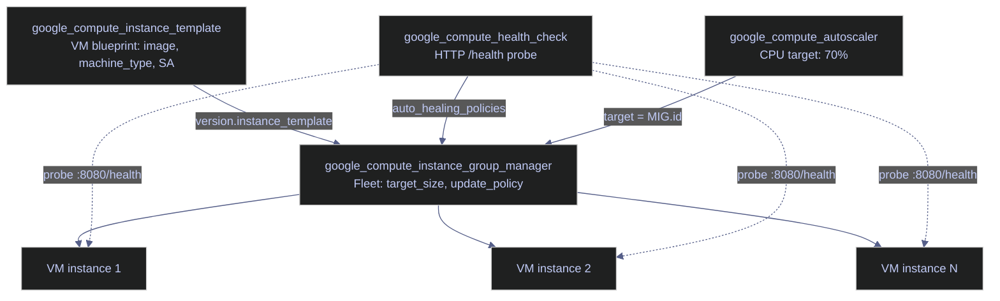
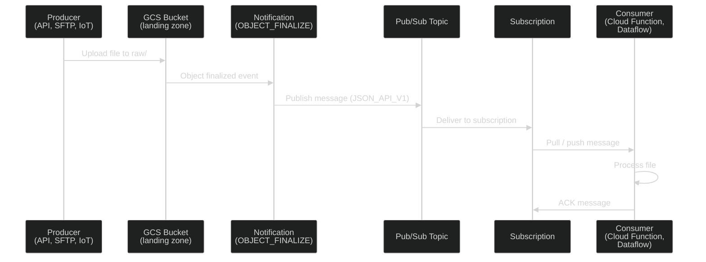
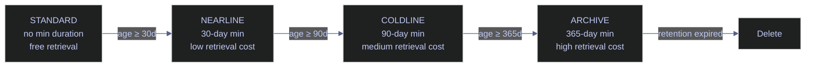

# Terraform Block Library — GCP Compute & Storage

> [!quote]
> "The best infrastructure is the infrastructure you don't have to think about."
>
> — **Werner Vogels**, AWS re:Invent keynote

Copy-paste Terraform resource blocks for provisioning GCP Compute Engine VMs, disks, snapshots, and Cloud Storage buckets. Each resource type is grouped at H3 with operational variants at H4. Every block is self-contained — copy it, rename the resource, wire your variables, and run `terraform plan`.

> [!info] Assumed variables
> All blocks in this file reference shared input variables (`var.project_id`, `var.env`, `var.region`, `var.zone`, `var.vpc_network`, `var.subnetwork`). See the [Variables Reference](#variables-reference) section at the bottom for the full list and types. Define them in your `variables.tf`.

> [!tip] GCP provider documentation
> For the canonical argument reference of each resource, see the [Google Cloud Terraform provider registry](https://registry.terraform.io/providers/hashicorp/google/latest/docs). The blocks here track provider version **5.x** syntax.

---

## Compute Engine Blocks

Terraform resources for GCP Compute Engine — virtual machines, persistent disks, snapshots, snapshot scheduling policies, and VM start/stop schedules. Cross-reference the `gcloud` equivalents in [VM lifecycle](https://alp78.github.io/elysium/06-GCP/Compute/vm-lifecycle) and [Disks and snapshots](https://alp78.github.io/elysium/06-GCP/Compute/disks-and-snapshots).

---

### google_compute_instance

The `google_compute_instance` resource provisions a single GCP Compute Engine virtual machine. Changing `zone` or `machine_type` (on certain families) forces resource replacement — Terraform destroys the existing VM and creates a new one, which means **data loss** on any attached ephemeral disks. The Terraform service account needs `roles/compute.instanceAdmin.v1` on the project.

> [!danger] Force-replacement arguments
> Changing `zone`, `boot_disk.initialize_params.image`, or switching `machine_type` between incompatible families triggers a destroy-then-create cycle. For stateful VMs (databases, orchestrators), this means downtime and potential data loss on the boot disk.

> [!success] Protect stateful VMs
> Use `lifecycle { prevent_destroy = true }` on any VM with persistent state. Use `deletion_protection = true` at the GCP level as a second safety net. Always store data on a separately managed `google_compute_disk`.

---

#### google_compute_instance | Database server

A long-lived, single-node database VM with private-only networking, a dedicated SSD data disk, OS-level hardening (Shielded VM), and a service account scoped to minimum permissions. Typical for PostgreSQL, MySQL, or SQL Server on Linux instances that should never have a public IP.

The data disk is created as a separate `google_compute_disk` resource so it survives `terraform destroy` on the VM. The startup script formats and mounts the data disk on first boot. OS Login with IAP replaces static SSH keys. The `ignore_changes` on `startup-script` prevents Terraform from detecting drift caused by manual debugging sessions.

```hcl
resource "google_compute_disk" "db_data" {
  name    = "db-data-disk"
  type    = "pd-ssd"
  zone    = var.zone
  size    = 500

  labels = {
    env  = var.env
    role = "database"
  }
}
```

```hcl
resource "google_compute_instance" "db_server" {
  name         = "${var.env}-db-server"
  machine_type = "e2-standard-4"
  zone         = var.zone
  tags         = ["db-server", "internal"]

  boot_disk {
    auto_delete = true
    initialize_params {
      image = "ubuntu-os-cloud/ubuntu-2204-lts"
      size  = 50
      type  = "pd-balanced"
    }
  }

  attached_disk {
    source      = google_compute_disk.db_data.self_link
    device_name = "db-data"
    mode        = "READ_WRITE"
  }

  network_interface {
    network    = var.vpc_network
    subnetwork = var.subnetwork
  }

  metadata = {
    startup-script = <<-SCRIPT
      #!/bin/bash
      set -euo pipefail
      if ! blkid /dev/disk/by-id/google-db-data; then
        mkfs.ext4 -F /dev/disk/by-id/google-db-data
      fi
      mkdir -p /mnt/data
      mount /dev/disk/by-id/google-db-data /mnt/data
      echo "/dev/disk/by-id/google-db-data /mnt/data ext4 defaults,nofail 0 2" >> /etc/fstab
    SCRIPT

    enable-oslogin = "TRUE"
  }

  service_account {
    email  = var.db_service_account_email
    scopes = ["cloud-platform"]
  }

  shielded_instance_config {
    enable_secure_boot          = true
    enable_vtpm                 = true
    enable_integrity_monitoring = true
  }

  scheduling {
    on_host_maintenance = "MIGRATE"
    automatic_restart   = true
    preemptible         = false
  }

  deletion_protection = true

  labels = {
    env  = var.env
    role = "database"
  }

  lifecycle {
    ignore_changes = [metadata["startup-script"]]
  }
}
```

| Argument | Required | Description |
|---|---|---|
| `name` | Yes | VM name, must be unique within the project |
| `machine_type` | Yes | VM size — `e2-standard-4` gives 4 vCPU, 16 GB RAM (cost-effective E2 family) |
| `zone` | Yes | GCP zone — must match the attached data disk zone |
| `tags` | No | Network tags used by VPC firewall rules to control traffic |
| `boot_disk.auto_delete` | No | `true` (default) deletes the boot disk when the VM is deleted |
| `boot_disk.initialize_params.image` | Yes | OS image family — changing this forces VM replacement |
| `boot_disk.initialize_params.size` | No | Boot disk size in GiB (default: image default, usually 10) |
| `boot_disk.initialize_params.type` | No | Disk type — `pd-balanced` is a good default for OS disks |
| `attached_disk.source` | Yes | `self_link` of the `google_compute_disk` to attach |
| `attached_disk.device_name` | No | Device path inside the guest OS (`/dev/disk/by-id/google-<name>`) |
| `attached_disk.mode` | No | `READ_WRITE` (default) or `READ_ONLY` for multi-reader |
| `network_interface.network` | Yes | VPC network — omitting `access_config` block means no public IP |
| `metadata.startup-script` | No | Shell script executed as root on every boot |
| `metadata.enable-oslogin` | No | `TRUE` enables IAP + OS Login instead of static SSH keys |
| `service_account.email` | No | Dedicated service account email — use a per-VM SA for least privilege |
| `service_account.scopes` | No | `["cloud-platform"]` delegates all permissions to IAM roles on the SA |
| `shielded_instance_config.*` | No | Enables Secure Boot, vTPM, and integrity monitoring |
| `scheduling.on_host_maintenance` | No | `MIGRATE` (default) live-migrates during maintenance; `TERMINATE` stops the VM |
| `scheduling.automatic_restart` | No | `true` (default) restarts after host failure |
| `scheduling.preemptible` | No | `false` (default) for persistent VMs |
| `deletion_protection` | No | `true` blocks `terraform destroy` — must be disabled manually first |
| `lifecycle.ignore_changes` | No | Prevents Terraform from detecting drift on specified attributes |

> [!todo] `terraform plan` output
> Run `terraform plan` with this block in your project to generate the plan output. Not fabricated here.

---

#### google_compute_instance | Orchestration server (Airflow)

A single VM running Apache Airflow (or a similar orchestrator) via Docker Compose. Container-Optimized OS (COS) handles Docker out of the box. An ephemeral public IP is included so the scheduler can reach external APIs — lock it down with firewall tags. The `pd-balanced` boot disk is sufficient since the OS carries only container layers and logs; all DAG state lives in the metadata database and GCS.

The `user-data` metadata key is COS-specific — it uses `cloud-init` syntax to pull and run the Airflow Docker image on first boot. The `access_config` block without a `nat_ip` lets GCP assign an ephemeral public IP automatically. Remove the entire `access_config` block for private-only networking with Cloud NAT.

```hcl
resource "google_compute_instance" "airflow" {
  name         = "${var.env}-airflow"
  machine_type = "e2-standard-2"
  zone         = var.zone
  tags         = ["airflow", "allow-iap"]

  boot_disk {
    auto_delete = true
    initialize_params {
      image = "cos-cloud/cos-stable"
      size  = 50
      type  = "pd-balanced"
    }
  }

  network_interface {
    network    = var.vpc_network
    subnetwork = var.subnetwork

    access_config {}
  }

  metadata = {
    user-data = <<-CLOUDINIT
      #cloud-config
      runcmd:
        - docker-credential-gcr configure-docker
        - docker pull ${var.airflow_image}
        - docker run -d --name airflow --restart=unless-stopped \
            -p 8080:8080 \
            -e AIRFLOW__CORE__EXECUTOR=LocalExecutor \
            -e AIRFLOW__DATABASE__SQL_ALCHEMY_CONN=${var.airflow_db_conn} \
            ${var.airflow_image}
    CLOUDINIT

    enable-oslogin = "TRUE"
  }

  service_account {
    email  = var.airflow_service_account_email
    scopes = ["cloud-platform"]
  }

  scheduling {
    on_host_maintenance = "MIGRATE"
    automatic_restart   = true
    preemptible         = false
  }

  labels = {
    env  = var.env
    role = "orchestration"
  }
}
```

| Argument | Required | Description |
|---|---|---|
| `machine_type` | Yes | `e2-standard-2` gives 2 vCPU, 8 GB RAM — scale up if DAG count grows |
| `boot_disk.initialize_params.image` | Yes | `cos-cloud/cos-stable` — Container-Optimized OS with Docker pre-installed |
| `access_config` | No | Empty block assigns an ephemeral public IP; omit entirely for private-only |
| `metadata.user-data` | No | COS `cloud-init` config — runs Docker commands on boot |
| `service_account.email` | No | SA needs GCS, BigQuery, and Pub/Sub access for DAG operations |
| `scheduling.preemptible` | No | `false` — DAGs must not be interrupted by preemption |

> [!warning] Sensitive connection string
> The `airflow_db_conn` variable contains a database connection string with credentials. It is marked `sensitive = true` in the variable definition, but it will still appear in the VM metadata in the GCP console.

> [!success] Use Secret Manager
> Store the connection string in [Secret Manager](https://alp78.github.io/elysium/06-GCP/Security/secrets-management) and fetch it at runtime inside the container instead of baking it into metadata.

---

#### google_compute_instance | Spot / preemptible worker

Batch processing, CI runners, ML training jobs, or any fault-tolerant workload where cost matters more than uptime. Spot VMs cost 60–91% less than standard VMs but can be reclaimed by GCP at any time with a 30-second notice. Always checkpoint work to GCS. Avoid for databases, stateful services, or anything behind a synchronous API.

The `provisioning_model = "SPOT"` is the current-generation API (provider 4.x+). Legacy `PREEMPTIBLE` still works but is deprecated. Spot VMs cannot live-migrate, so `on_host_maintenance` must be `TERMINATE`. The `ignore_changes = [scheduling]` prevents Terraform from detecting drift when GCP modifies scheduling metadata on preempted VMs.

Private-only networking is shown here — use Cloud NAT for outbound internet access.

```hcl
resource "google_compute_instance" "spot_worker" {
  name         = "${var.env}-spot-worker"
  machine_type = "n2-standard-8"
  zone         = var.zone
  tags         = ["spot-worker", "allow-iap"]

  boot_disk {
    auto_delete = true
    initialize_params {
      image = "debian-cloud/debian-12"
      size  = 100
      type  = "pd-balanced"
    }
  }

  network_interface {
    network    = var.vpc_network
    subnetwork = var.subnetwork
  }

  metadata = {
    startup-script = var.worker_startup_script
    enable-oslogin = "TRUE"
  }

  service_account {
    email  = var.worker_service_account_email
    scopes = ["cloud-platform"]
  }

  scheduling {
    preemptible                 = true
    on_host_maintenance         = "TERMINATE"
    automatic_restart           = false
    provisioning_model          = "SPOT"
  }

  labels = {
    env  = var.env
    role = "worker"
    type = "spot"
  }

  lifecycle {
    ignore_changes = [scheduling]
  }
}
```

| Argument | Required | Description |
|---|---|---|
| `machine_type` | Yes | `n2-standard-8` gives 8 vCPU, 32 GB RAM — N2 is good for compute-heavy workloads |
| `boot_disk.initialize_params.image` | Yes | `debian-cloud/debian-12` — small and fast to boot |
| `boot_disk.initialize_params.size` | No | 100 GiB — enough for job artifacts; checkpoint results to GCS |
| `scheduling.preemptible` | No | `true` enables spot pricing |
| `scheduling.on_host_maintenance` | No | Must be `TERMINATE` for spot VMs — they cannot live-migrate |
| `scheduling.automatic_restart` | No | `false` — do not auto-restart preemptible VMs |
| `scheduling.provisioning_model` | No | `SPOT` (current) or `PREEMPTIBLE` (legacy, deprecated) |
| `lifecycle.ignore_changes` | No | `[scheduling]` prevents drift detection from GCP-managed scheduling changes |

> [!question] Spot VM vs standard VM
> Use spot VMs for fault-tolerant, stateless workloads (batch ETL, CI/CD runners, ML training). Use standard VMs for databases, orchestrators, and anything that cannot tolerate interruption. For horizontally scalable services, consider a MIG with a mix of spot and standard instances.

---

### google_compute_instance_template

The `google_compute_instance_template` resource creates a reusable VM blueprint for managed instance groups. Templates are immutable — any change creates a new template. Use `create_before_destroy` in the lifecycle block to ensure the new template exists before the old one is removed, preventing downtime during updates. Templates are regional (not zonal) and cannot reference external disks — all disk configuration is inline.

Use case: stateless, horizontally scalable services — web frontends, API backends, data transformation workers.

```hcl
resource "google_compute_instance_template" "app" {
  name_prefix  = "${var.env}-app-template-"
  machine_type = "e2-standard-2"
  region       = var.region
  tags         = ["app-server", "allow-lb"]

  disk {
    source_image = "ubuntu-os-cloud/ubuntu-2204-lts"
    auto_delete  = true
    boot         = true
    disk_type    = "pd-balanced"
    disk_size_gb = 30
  }

  network_interface {
    network    = var.vpc_network
    subnetwork = var.subnetwork
  }

  metadata = {
    startup-script = var.app_startup_script
    enable-oslogin = "TRUE"
  }

  service_account {
    email  = var.app_service_account_email
    scopes = ["cloud-platform"]
  }

  scheduling {
    on_host_maintenance = "MIGRATE"
    automatic_restart   = true
    preemptible         = false
  }

  labels = {
    env  = var.env
    role = "app"
  }

  lifecycle {
    create_before_destroy = true
  }
}
```

| Argument | Required | Description |
|---|---|---|
| `name_prefix` | Yes | Prefix for the template name — Terraform appends a unique hash suffix |
| `machine_type` | Yes | VM size applied to every instance created from this template |
| `region` | Yes | Templates are regional, not zonal |
| `tags` | No | Network tags — used by load balancer and firewall rules |
| `disk.source_image` | Yes | Base OS image for the boot disk |
| `disk.disk_type` | No | `pd-balanced` (default), `pd-ssd`, or `pd-standard` |
| `disk.disk_size_gb` | No | Boot disk size in GiB — 30 GiB is usually enough for app + logs |
| `metadata.startup-script` | No | Bootstraps the app on each new instance (install deps, pull binary, start) |
| `lifecycle.create_before_destroy` | No | Creates the new template before destroying the old one — prevents downtime |

> [!tip] Instances behind a load balancer
> Omit the `access_config` block in `network_interface` — instances behind a load balancer do not need public IPs. Outbound traffic can route through Cloud NAT.

---

### google_compute_instance_group_manager

The `google_compute_instance_group_manager` creates and manages a fleet of identical VMs from an instance template. The MIG handles auto-healing (replacing unhealthy instances) and rolling updates (replacing instances when the template changes). The `target_size` sets the initial fleet size but is overridden by an autoscaler when attached.

```hcl
resource "google_compute_instance_group_manager" "app" {
  name               = "${var.env}-app-mig"
  base_instance_name = "${var.env}-app"
  zone               = var.zone
  target_size        = 2

  version {
    instance_template = google_compute_instance_template.app.id
    name              = "primary"
  }

  auto_healing_policies {
    health_check      = google_compute_health_check.app.id
    initial_delay_sec = 120
  }

  update_policy {
    type                         = "PROACTIVE"
    minimal_action               = "REPLACE"
    max_surge_fixed              = 1
    max_unavailable_fixed        = 0
    replacement_method           = "SUBSTITUTE"
  }

  named_port {
    name = "http"
    port = 8080
  }
}
```

| Argument | Required | Description |
|---|---|---|
| `name` | Yes | MIG name |
| `base_instance_name` | Yes | Prefix for individual VM names — GCP appends a random suffix (e.g., `app-abc123`) |
| `zone` | Yes | Single-zone MIG — use `google_compute_region_instance_group_manager` for HA across zones |
| `target_size` | No | Initial instance count — overridden by autoscaler when attached |
| `version.instance_template` | Yes | ID of the active template — changing this triggers a rolling update |
| `version.name` | No | Version label — useful for canary deployments with two `version` blocks |
| `auto_healing_policies.health_check` | No | Health check ID — unhealthy instances are automatically replaced |
| `auto_healing_policies.initial_delay_sec` | No | Seconds to wait before health-checking a new instance (default: 300) |
| `update_policy.type` | No | `PROACTIVE` updates all instances immediately; `OPPORTUNISTIC` only on scale events |
| `update_policy.minimal_action` | No | `REPLACE` recreates instances; `RESTART` just reboots them |
| `update_policy.max_surge_fixed` | No | Extra instances created during rolling update (set to 1 for zero-downtime) |
| `update_policy.max_unavailable_fixed` | No | Max instances unavailable during update (set to 0 for zero-downtime) |
| `named_port` | No | Named port mapping used by the load balancer backend service |

> [!info] Regional MIG for high availability
> A single-zone MIG has all instances in one zone. For production, use `google_compute_region_instance_group_manager` to spread instances across multiple zones in a region — surviving a zone outage without manual intervention.

---

### google_compute_health_check

The `google_compute_health_check` defines how GCP determines whether a VM instance is healthy. Used by both the MIG (for auto-healing) and the load balancer (for traffic routing). An instance that fails `unhealthy_threshold` consecutive checks is marked unhealthy — the MIG replaces it, and the load balancer stops routing traffic to it.

```hcl
resource "google_compute_health_check" "app" {
  name                = "${var.env}-app-health-check"
  check_interval_sec  = 10
  timeout_sec         = 5
  healthy_threshold   = 2
  unhealthy_threshold = 3

  http_health_check {
    port         = 8080
    request_path = "/health"
  }
}
```

| Argument | Required | Description |
|---|---|---|
| `name` | Yes | Health check name |
| `check_interval_sec` | No | Seconds between probes (default: 5) |
| `timeout_sec` | No | Seconds to wait for a response before marking as failed (default: 5) |
| `healthy_threshold` | No | Consecutive successes needed to mark healthy (default: 2) |
| `unhealthy_threshold` | No | Consecutive failures needed to mark unhealthy (default: 2) |
| `http_health_check.port` | Yes | Port to probe on each instance |
| `http_health_check.request_path` | No | Endpoint path — must return HTTP 200 when the app is ready |

---

### google_compute_autoscaler

The `google_compute_autoscaler` adjusts the number of instances in a MIG based on a scaling metric. The most common metric is CPU utilization — the autoscaler adds instances when average CPU exceeds the target and removes instances when it drops below. The `cooldown_period` prevents rapid scale oscillations.

```hcl
resource "google_compute_autoscaler" "app" {
  name   = "${var.env}-app-autoscaler"
  zone   = var.zone
  target = google_compute_instance_group_manager.app.id

  autoscaling_policy {
    min_replicas    = 2
    max_replicas    = 10
    cooldown_period = 60

    cpu_utilization {
      target = 0.7
    }
  }
}
```

| Argument | Required | Description |
|---|---|---|
| `name` | Yes | Autoscaler name |
| `zone` | Yes | Must match the MIG zone |
| `target` | Yes | ID of the MIG to scale |
| `autoscaling_policy.min_replicas` | Yes | Minimum instance count — never scale below this |
| `autoscaling_policy.max_replicas` | Yes | Maximum instance count — never scale above this |
| `autoscaling_policy.cooldown_period` | No | Seconds to wait after a scaling event before the next decision (default: 60) |
| `cpu_utilization.target` | No | Target average CPU — scale out above 0.7 (70%), scale in below |

#### MIG architecture

How the instance template, MIG, health check, and autoscaler resources relate:



---

### google_compute_disk

A standalone persistent disk that outlives its VM. Use when you need a data volume (database data directory, shared NFS-style volume) that survives `terraform destroy` on the instance. Always create data disks as separate resources rather than inline in the VM block. Disk size can be increased but never decreased — GCP does not support shrinking persistent disks. See [Disks and snapshots](https://alp78.github.io/elysium/06-GCP/Compute/disks-and-snapshots) for `gcloud` equivalents.

> [!warning] Disk size cannot be reduced
> Once a persistent disk is created, you can increase its size in-place (non-destructive) but never decrease it. Plan capacity carefully — oversizing wastes money, undersizing requires migration.

> [!success] Right-size with monitoring
> Use Cloud Monitoring disk utilization metrics to right-size before provisioning. Start conservative and grow as needed.

```hcl
resource "google_compute_disk" "data" {
  name                      = "${var.env}-data-disk"
  type                      = "pd-ssd"
  zone                      = var.zone
  size                      = 200
  physical_block_size_bytes = 4096

  labels = {
    env  = var.env
    role = "data"
  }

  lifecycle {
    prevent_destroy = true
  }
}
```

| Argument | Required | Description |
|---|---|---|
| `name` | Yes | Disk name visible in the GCP console |
| `type` | No | `pd-ssd`, `pd-balanced` (default), `pd-standard`, or `pd-extreme` |
| `zone` | Yes | Must match the zone of the VM it will be attached to |
| `size` | No | Size in GiB — can be increased but never decreased |
| `physical_block_size_bytes` | No | `4096` (default) or `16384` — match the OS block size |
| `lifecycle.prevent_destroy` | No | `true` blocks accidental deletion — Terraform plan will fail if destroy is attempted |

---

### google_compute_attached_disk

Attaches a standalone `google_compute_disk` to an existing VM. Use this resource when the disk and the VM are managed in separate Terraform modules or when a disk needs to be detached and reattached to different VMs.

In `READ_ONLY` mode, a disk can be attached to multiple VMs simultaneously — useful for sharing static datasets.

```hcl
resource "google_compute_attached_disk" "data_attach" {
  disk     = google_compute_disk.data.id
  instance = google_compute_instance.db_server.id
  zone     = var.zone
  mode     = "READ_WRITE"

  device_name = "data"
}
```

| Argument | Required | Description |
|---|---|---|
| `disk` | Yes | ID of the `google_compute_disk` to attach |
| `instance` | Yes | ID of the `google_compute_instance` target |
| `zone` | Yes | Must match both the disk and VM zone |
| `mode` | No | `READ_WRITE` (default) or `READ_ONLY` for multi-reader scenarios |
| `device_name` | No | Device path inside the guest OS: `/dev/disk/by-id/google-<name>` |

---

### google_compute_snapshot

A point-in-time backup of a persistent disk. Snapshots are incremental after the first — only changed blocks are stored, reducing cost and time. Stored in Cloud Storage automatically and charged at GCS rates. Use before risky operations (OS upgrades, schema migrations). For recurring backups, use `google_compute_resource_policy` instead.

The `storage_locations` argument controls where snapshot data is stored. Use a multi-region value (`"us"`, `"eu"`, `"asia"`) for resilience or a single region (`"us-central1"`) for locality. Omit to use the GCP default (same region as the source disk).

```hcl
resource "google_compute_snapshot" "db_backup" {
  name        = "${var.env}-db-backup-manual"
  source_disk = google_compute_disk.data.id
  zone        = var.zone
  description = "Manual pre-migration snapshot"

  storage_locations = ["us"]

  labels = {
    env    = var.env
    type   = "manual"
    source = "db-data-disk"
  }
}
```

| Argument | Required | Description |
|---|---|---|
| `name` | Yes | Snapshot name |
| `source_disk` | Yes | ID of the disk to snapshot (boot or data disk) |
| `zone` | Yes | Zone of the source disk |
| `description` | No | Human-readable description for the GCP console |
| `storage_locations` | No | Where to store — `["us"]` (multi-region) or `["us-central1"]` (regional) |
| `snapshot_encryption_key.raw_key` | No | Base64-encoded AES-256 key for CMEK encryption |

> [!tip] CMEK encryption
> For compliance-sensitive workloads, encrypt snapshots with a Customer-Managed Encryption Key (CMEK) using the `snapshot_encryption_key` block. The key must be in the same region as the snapshot storage location.

---

### google_compute_resource_policy

A resource policy defines scheduled operations on Compute Engine resources — automated snapshots or VM start/stop schedules. Policies are regional and are attached to disks or VMs via dedicated attachment resources.

---

#### google_compute_resource_policy | Scheduled snapshot

Automated daily snapshots with retention so you don't need manual snapshots. Attach the policy to any disk. GCP handles the schedule, incremental snapshots, and deletion of expired snapshots. The `on_source_disk_delete` argument controls whether auto-snapshots are preserved or deleted when the source disk is destroyed.

Setting `guest_flush = true` flushes OS write buffers before the snapshot for application-consistent backups — this requires the QEMU guest agent installed on the VM.

```hcl
resource "google_compute_resource_policy" "daily_snapshot" {
  name   = "${var.env}-daily-snapshot-policy"
  region = var.region

  snapshot_schedule_policy {
    schedule {
      daily_schedule {
        days_in_cycle = 1
        start_time    = "04:00"
      }
    }

    retention_policy {
      max_retention_days    = 7
      on_source_disk_delete = "KEEP_AUTO_SNAPSHOTS"
    }

    snapshot_properties {
      labels = {
        policy     = "daily-snapshot"
        managed_by = "terraform"
      }
      storage_locations = ["us"]
      guest_flush       = false
    }
  }
}
```

```hcl
resource "google_compute_disk_resource_policy_attachment" "data_snapshot" {
  name = google_compute_resource_policy.daily_snapshot.name
  disk = google_compute_disk.data.name
  zone = var.zone
}
```

| Argument | Required | Description |
|---|---|---|
| `name` | Yes | Policy name |
| `region` | Yes | Resource policies are regional |
| `daily_schedule.days_in_cycle` | Yes | Frequency in days — `1` means every day (minimum) |
| `daily_schedule.start_time` | Yes | UTC time to start — pick off-peak hours for your region |
| `max_retention_days` | No | Delete snapshots older than N days (default: no expiration) |
| `on_source_disk_delete` | No | `KEEP_AUTO_SNAPSHOTS` (default) or `APPLY_RETENTION_POLICY` |
| `storage_locations` | No | Where to store snapshots — multi-region or single region |
| `guest_flush` | No | `true` flushes OS buffers before snapshot (requires QEMU guest agent) |

---

#### google_compute_resource_policy | VM start/stop (business hours)

Dev/test VMs and non-critical batch VMs that only need to run during business hours. Start/stop scheduling can cut compute costs by ~65% for a VM that runs 9 hours/day on weekdays instead of 24/7. Schedules use IANA timezone names — use `"UTC"` to avoid daylight saving time surprises.

The Compute Engine service agent (`<project-number>@cloudservices.gserviceaccount.com`) needs `roles/compute.instanceAdmin.v1` on the VM to start and stop it. The IAM binding must be created before attaching the schedule.

```hcl
resource "google_compute_resource_policy" "business_hours" {
  name   = "${var.env}-business-hours-schedule"
  region = var.region

  instance_schedule_policy {
    time_zone = "America/New_York"

    vm_start_schedule {
      schedule = "0 8 * * MON-FRI"
    }

    vm_stop_schedule {
      schedule = "0 19 * * MON-FRI"
    }
  }
}
```

```hcl
resource "google_compute_instance_iam_member" "schedule_actor" {
  instance_name = google_compute_instance.db_server.name
  zone          = var.zone
  role          = "roles/compute.instanceAdmin.v1"
  member        = "serviceAccount:${var.project_number}@cloudservices.gserviceaccount.com"
}
```

```hcl
resource "google_compute_resource_policy_attachment" "biz_hours_attach" {
  name     = google_compute_resource_policy.business_hours.name
  instance = google_compute_instance.db_server.name
  zone     = var.zone
}
```

| Argument | Required | Description |
|---|---|---|
| `name` | Yes | Policy name |
| `region` | Yes | Must match the VM's region |
| `time_zone` | Yes | IANA timezone for cron schedules — `"America/New_York"`, `"UTC"`, etc. |
| `vm_start_schedule.schedule` | Yes | Cron expression for start time |
| `vm_stop_schedule.schedule` | Yes | Cron expression for stop time |

> [!tip] Cost savings estimate
> A VM running 9 hours/day × 5 days/week instead of 24/7 saves approximately 65% on compute costs. Apply this pattern to all non-production VMs that don't need to run overnight or on weekends.

---

## Cloud Storage Blocks

Terraform resources for GCS buckets, IAM bindings, object uploads, and Pub/Sub notifications. Cross-reference the `gsutil` and `gcloud` equivalents in [GCS buckets and lifecycle](https://alp78.github.io/elysium/06-GCP/Storage/gcs-buckets-and-lifecycle) and [GCS object operations](https://alp78.github.io/elysium/06-GCP/Storage/gcs-object-operations).

---

### google_storage_bucket

The `google_storage_bucket` resource provisions a GCS bucket. Bucket names are globally unique across all of GCP. Changing `location` forces resource replacement — Terraform destroys the bucket and creates a new one, which means **all objects are deleted**. The Terraform service account needs `roles/storage.admin` on the project.

> [!danger] Force-replacement on location change
> Changing the `location` argument on a `google_storage_bucket` triggers a destroy-then-create cycle. Terraform deletes **all objects** in the bucket before recreating it in the new location. This is unrecoverable without external backups.

> [!success] Protect production buckets
> Set `force_destroy = false` (default) so Terraform refuses to destroy a bucket that contains objects. Add `lifecycle { prevent_destroy = true }` for stateful buckets (data lake, state backend).

> [!danger] `force_destroy = true`
> When `force_destroy = true`, `terraform destroy` silently deletes **every object** in the bucket before destroying the bucket itself. This is irreversible.

> [!success] Reserve for ephemeral buckets only
> Only set `force_destroy = true` on temporary, CI/CD, or test buckets that contain no valuable data.

| Argument | Required | Description |
|---|---|---|
| `name` | Yes | Globally unique bucket name — convention: `<project-id>-<env>-<purpose>` |
| `location` | Yes | Region (`us-central1`), dual-region, or multi-region (`US`, `EU`, `ASIA`) — **forces replacement** if changed |
| `storage_class` | No | Default class for new objects: `STANDARD`, `NEARLINE`, `COLDLINE`, `ARCHIVE` (default: `STANDARD`) |
| `uniform_bucket_level_access` | No | `true` disables ACLs and enforces IAM-only access control (recommended) |
| `force_destroy` | No | `false` (default) — set `true` only for ephemeral buckets |
| `public_access_prevention` | No | `"enforced"` blocks all public access at the bucket level |
| `versioning.enabled` | No | `true` enables object versioning — keeps history of every object version |
| `lifecycle_rule` | No | Auto-tiering and cleanup rules — see the Storage Class Decision Guide below |

---

#### google_storage_bucket | General purpose (versioning + lifecycle)

A versatile bucket for application artifacts, exports, or backups. Versioning enabled to recover accidentally overwritten objects. Lifecycle rules automatically tier objects through STANDARD → NEARLINE (30 days) → COLDLINE (90 days) → ARCHIVE (365 days) and prune old non-current versions to keep only the 3 most recent.

```hcl
resource "google_storage_bucket" "general" {
  name                        = "${var.project_id}-${var.env}-general"
  location                    = var.region
  storage_class               = "STANDARD"
  uniform_bucket_level_access = true
  force_destroy               = false

  versioning {
    enabled = true
  }

  lifecycle_rule {
    action {
      type          = "SetStorageClass"
      storage_class = "NEARLINE"
    }
    condition {
      age = 30
    }
  }

  lifecycle_rule {
    action {
      type          = "SetStorageClass"
      storage_class = "COLDLINE"
    }
    condition {
      age = 90
    }
  }

  lifecycle_rule {
    action {
      type          = "SetStorageClass"
      storage_class = "ARCHIVE"
    }
    condition {
      age = 365
    }
  }

  lifecycle_rule {
    action {
      type = "Delete"
    }
    condition {
      num_newer_versions = 3
      with_state         = "ARCHIVED"
    }
  }

  labels = {
    env         = var.env
    managed_by  = "terraform"
  }
}
```

---

#### google_storage_bucket | Landing zone (data ingestion)

Entry point for raw, untransformed data from external producers (APIs, SFTP uploads, IoT devices, event streams). Versioning disabled — raw files are append-only. Objects stay as STANDARD for 30 days (frequent access during initial processing), transition to NEARLINE, then are deleted after 180 days (adjust to your compliance window). Incomplete multipart uploads are aborted after 1 day to avoid paying for partial data. Co-locate this bucket in the same region as your Dataflow or Dataproc cluster.

```hcl
resource "google_storage_bucket" "landing_zone" {
  name                        = "${var.project_id}-${var.env}-landing"
  location                    = var.region
  storage_class               = "STANDARD"
  uniform_bucket_level_access = true
  force_destroy               = false

  versioning {
    enabled = false
  }

  lifecycle_rule {
    action {
      type          = "SetStorageClass"
      storage_class = "NEARLINE"
    }
    condition {
      age = 30
    }
  }

  lifecycle_rule {
    action {
      type = "AbortIncompleteMultipartUpload"
    }
    condition {
      age = 1
    }
  }

  lifecycle_rule {
    action {
      type = "Delete"
    }
    condition {
      age = 180
    }
  }

  labels = {
    env         = var.env
    role        = "landing-zone"
    managed_by  = "terraform"
  }
}
```

---

#### google_storage_bucket | Terraform state backend

Stores Terraform remote state. This bucket must exist **before** the `backend "gcs"` configuration references it — bootstrap it with a separate root module or create it manually once. Key requirements: versioning on (recover corrupted state), public access prevention enforced, uniform IAM, lifecycle rule to prune old state versions.

```hcl
resource "google_storage_bucket" "tf_state" {
  name                        = "${var.project_id}-terraform-state"
  location                    = "US"
  storage_class               = "STANDARD"
  uniform_bucket_level_access = true
  force_destroy               = false

  versioning {
    enabled = true
  }

  public_access_prevention = "enforced"

  lifecycle_rule {
    action {
      type = "Delete"
    }
    condition {
      num_newer_versions = 10
      with_state         = "ARCHIVED"
    }
  }

  lifecycle_rule {
    action {
      type = "AbortIncompleteMultipartUpload"
    }
    condition {
      age = 1
    }
  }

  labels = {
    purpose    = "terraform-state"
    managed_by = "terraform"
  }
}
```

> [!todo] Bootstrap workflow
> 1. Create the state bucket manually or with a separate Terraform root module that uses local state
> 2. Add the `backend "gcs"` block to your main project's `backend.tf`
> 3. Run `terraform init` — Terraform migrates the local state to GCS
> 4. Enable state locking (automatic with GCS backend) to prevent concurrent modifications

Reference in `backend.tf` after the bucket is created:

```hcl
terraform {
  backend "gcs" {
    bucket = "<project-id>-terraform-state"
    prefix = "terraform/state"
  }
}
```

> [!warning] State bucket deletion
> Losing or corrupting the state file means Terraform no longer knows what resources it manages. Recovery requires manual `terraform import` of every resource.

> [!success] Always use remote state with versioning
> GCS backend with `versioning.enabled = true` lets you roll back to a previous state version. Combined with `public_access_prevention = "enforced"`, this is the safest state storage pattern.

---

#### google_storage_bucket | Data lake

Central repository for all analytical data — raw, curated, and aggregated layers. Versioning enabled to protect curated objects against accidental overwrites. Lifecycle rules tier objects through STANDARD → NEARLINE → COLDLINE → ARCHIVE using `matches_storage_class` conditions to ensure objects follow the full tiering path. Co-locate with your BigQuery dataset for zero-cost data loading.

GCS is a flat namespace — the `/` separator is a convention enforced by tools. Placeholder objects create the expected folder hierarchy (`raw/`, `curated/`, `aggregated/`).

```hcl
resource "google_storage_bucket" "data_lake" {
  name                        = "${var.project_id}-${var.env}-data-lake"
  location                    = var.region
  storage_class               = "STANDARD"
  uniform_bucket_level_access = true
  force_destroy               = false

  versioning {
    enabled = true
  }

  lifecycle_rule {
    action {
      type          = "SetStorageClass"
      storage_class = "NEARLINE"
    }
    condition {
      age                        = 30
      matches_storage_class      = ["STANDARD"]
    }
  }

  lifecycle_rule {
    action {
      type          = "SetStorageClass"
      storage_class = "COLDLINE"
    }
    condition {
      age                   = 90
      matches_storage_class = ["NEARLINE"]
    }
  }

  lifecycle_rule {
    action {
      type          = "SetStorageClass"
      storage_class = "ARCHIVE"
    }
    condition {
      age                   = 365
      matches_storage_class = ["COLDLINE"]
    }
  }

  lifecycle_rule {
    action {
      type = "Delete"
    }
    condition {
      num_newer_versions = 5
      with_state         = "ARCHIVED"
    }
  }

  lifecycle_rule {
    action {
      type = "AbortIncompleteMultipartUpload"
    }
    condition {
      age = 2
    }
  }

  labels = {
    env        = var.env
    role       = "data-lake"
    managed_by = "terraform"
  }
}
```

Folder structure placeholders — create `.keep` objects to materialize the expected directory hierarchy:

```hcl
resource "google_storage_bucket_object" "raw_placeholder" {
  name    = "raw/.keep"
  bucket  = google_storage_bucket.data_lake.name
  content = "placeholder"
}

resource "google_storage_bucket_object" "curated_placeholder" {
  name    = "curated/.keep"
  bucket  = google_storage_bucket.data_lake.name
  content = "placeholder"
}

resource "google_storage_bucket_object" "aggregated_placeholder" {
  name    = "aggregated/.keep"
  bucket  = google_storage_bucket.data_lake.name
  content = "placeholder"
}
```

---

### google_storage_bucket_iam_member

Grants a single role to a single member on a bucket. This is **additive** — it does not affect other bindings on the same bucket. Use when different teams or Terraform modules manage different roles independently. This is the preferred IAM pattern in Terraform because it avoids unintentional permission revocation. See [Service accounts and IAM](https://alp78.github.io/elysium/06-GCP/Security/service-accounts-and-iam) for IAM concepts.

The `member` argument uses the format `serviceAccount:`, `user:`, `group:`, or `domain:` followed by the identity.

```hcl
resource "google_storage_bucket_iam_member" "reader" {
  bucket = google_storage_bucket.data_lake.name
  role   = "roles/storage.objectViewer"
  member = "serviceAccount:${var.reader_service_account}"
}
```

```hcl
resource "google_storage_bucket_iam_member" "writer" {
  bucket = google_storage_bucket.data_lake.name
  role   = "roles/storage.objectAdmin"
  member = "serviceAccount:${var.writer_service_account}"
}
```

```hcl
resource "google_storage_bucket_iam_member" "group_list" {
  bucket = google_storage_bucket.data_lake.name
  role   = "roles/storage.legacyBucketReader"
  member = "group:${var.data_team_group}"
}
```

| Argument | Required | Description |
|---|---|---|
| `bucket` | Yes | Target bucket name |
| `role` | Yes | IAM role to grant — e.g., `roles/storage.objectViewer`, `roles/storage.objectAdmin` |
| `member` | Yes | Identity — `serviceAccount:email`, `user:email`, `group:email`, or `domain:example.com` |

| Role | Permissions |
|---|---|
| `roles/storage.objectViewer` | List and get objects — cannot write or delete |
| `roles/storage.objectAdmin` | Full object CRUD — create, read, update, delete objects |
| `roles/storage.legacyBucketReader` | List bucket contents (`gsutil ls`) — does NOT allow object reads |
| `roles/storage.admin` | Full bucket and object admin — use sparingly |

---

### google_storage_bucket_iam_binding

Manages the **entire** list of members for a given role on a bucket. This is **authoritative** for that role — any member with the specified role who is not listed in the `members` array will be **removed** by Terraform. Use when the team that owns the bucket also owns all access grants for a given role.

> [!warning] Authoritative binding removes unlisted members
> `iam_binding` removes any member with the specified role that is not in the `members` list. If other Terraform modules or manual grants have added members for this role, they will be revoked on the next `terraform apply`.

> [!success] Use `iam_member` when multiple teams manage access
> If different teams or modules grant different roles on the same bucket, use `google_storage_bucket_iam_member` (additive) instead. Reserve `iam_binding` for cases where a single Terraform module is the authoritative source for a role.

```hcl
resource "google_storage_bucket_iam_binding" "landing_readers" {
  bucket = google_storage_bucket.landing_zone.name
  role   = "roles/storage.objectViewer"

  members = [
    "serviceAccount:${var.etl_service_account}",
    "serviceAccount:${var.dataflow_service_account}",
    "group:${var.analytics_group}",
  ]
}
```

| Argument | Required | Description |
|---|---|---|
| `bucket` | Yes | Target bucket name |
| `role` | Yes | IAM role — authoritative for this role on this bucket |
| `members` | Yes | Complete list of identities that should have this role — all others are removed |

> [!question] `iam_member` vs `iam_binding` vs `iam_policy`
> Use `iam_member` (additive) when multiple modules manage different roles independently. Use `iam_binding` (authoritative per role) when one module owns all grants for a specific role. Avoid `iam_policy` (authoritative for all roles) unless you are managing the bucket's entire IAM policy in a single Terraform module — it will remove all roles not explicitly declared.

---

### google_storage_bucket_object

Uploads a file or inline content to a GCS bucket. Use to seed buckets with configuration files, SQL scripts, requirements files, or any small artifact that Terraform should manage alongside the infrastructure. Avoid for large binary files — use a `null_resource` with `gsutil cp` for those. See [GCS object operations](https://alp78.github.io/elysium/06-GCP/Storage/gcs-object-operations) for `gsutil` equivalents.

Use `source` for local files or `content` for inline strings — only one can be specified per resource.

---

#### google_storage_bucket_object | Upload a local file

Upload a file from the local filesystem (relative to the module root) to a GCS bucket. Set `content_type` correctly for browser-based downloads.

```hcl
resource "google_storage_bucket_object" "config" {
  name         = "config/app-config.json"
  bucket       = google_storage_bucket.general.name
  source       = "${path.module}/files/app-config.json"
  content_type = "application/json"
}
```

---

#### google_storage_bucket_object | Upload inline content

Create an object directly from a string — no local file needed. Useful for seed data, SQL schemas, or small configuration snippets.

```hcl
resource "google_storage_bucket_object" "seed_sql" {
  name         = "seeds/initial-schema.sql"
  bucket       = google_storage_bucket.general.name
  content      = <<-SQL
    CREATE TABLE IF NOT EXISTS events (
      id         SERIAL PRIMARY KEY,
      event_type VARCHAR(64) NOT NULL,
      created_at TIMESTAMP  NOT NULL DEFAULT NOW()
    );
  SQL
  content_type = "text/plain"
}
```

| Argument | Required | Description |
|---|---|---|
| `name` | Yes | Object name (path within the bucket) — `/` separators create virtual folders |
| `bucket` | Yes | Target bucket name |
| `source` | No | Local file path relative to the module root — mutually exclusive with `content` |
| `content` | No | Inline string content — mutually exclusive with `source` |
| `content_type` | No | MIME type — set correctly for browser downloads (`application/json`, `text/plain`, etc.) |
| `metadata` | No | Custom HTTP headers — e.g., `{ "Cache-Control" = "no-cache" }` |

---

### google_storage_notification

Creates a notification configuration on a GCS bucket that publishes messages to a Pub/Sub topic when objects are created, deleted, or modified. This is the foundation for event-driven data ingestion pipelines — when a file lands in the landing zone, a Cloud Function or Dataflow job processes it immediately with no polling required. See [Pub/Sub messaging](https://alp78.github.io/elysium/06-GCP/Serverless/pubsub-messaging) for Pub/Sub concepts and [Pub/Sub topics and subscriptions](https://alp78.github.io/elysium/06-GCP/Serverless/pubsub-topics-and-subscriptions) for `gcloud` equivalents.

GCS uses a project-level service account to publish notifications. This account must have `roles/pubsub.publisher` on the destination topic — the `data` source and IAM binding below handle this.

The `depends_on` is critical: if the notification is created before the IAM binding, GCS will fail to publish and events will be silently dropped.

First, create the Pub/Sub topic and grant GCS permission to publish:

```hcl
resource "google_pubsub_topic" "bucket_events" {
  name    = "${var.env}-bucket-events"
  project = var.project_id

  message_retention_duration = "86600s"
}
```

```hcl
data "google_storage_project_service_account" "gcs_account" {
  project = var.project_id
}

resource "google_pubsub_topic_iam_member" "gcs_publisher" {
  topic  = google_pubsub_topic.bucket_events.id
  role   = "roles/pubsub.publisher"
  member = "serviceAccount:${data.google_storage_project_service_account.gcs_account.email_address}"
}
```

Then create the notification:

```hcl
resource "google_storage_notification" "landing_notify" {
  bucket         = google_storage_bucket.landing_zone.name
  payload_format = "JSON_API_V1"
  topic          = google_pubsub_topic.bucket_events.id

  event_types = ["OBJECT_FINALIZE"]

  object_name_prefix = "raw/"

  custom_attributes = {
    source      = "landing-zone"
    environment = var.env
  }

  depends_on = [google_pubsub_topic_iam_member.gcs_publisher]
}
```

| Argument | Required | Description |
|---|---|---|
| `bucket` | Yes | Bucket to watch for events |
| `payload_format` | Yes | `JSON_API_V1` (full object metadata) or `NONE` (no payload) |
| `topic` | Yes | Destination Pub/Sub topic ID |
| `event_types` | No | `OBJECT_FINALIZE` (upload complete), `OBJECT_DELETE`, `OBJECT_ARCHIVE`, `OBJECT_METADATA_UPDATE` |
| `object_name_prefix` | No | Filter — only notify for objects matching this prefix (e.g., `raw/`) |
| `custom_attributes` | No | Key-value pairs added to every Pub/Sub message — helps consumers route events |
| `depends_on` | No | Must reference the IAM binding to ensure GCS can publish before the notification is created |

Finally, create a pull subscription for consumers:

```hcl
resource "google_pubsub_subscription" "landing_events_sub" {
  name    = "${var.env}-landing-events-sub"
  topic   = google_pubsub_topic.bucket_events.id
  project = var.project_id

  ack_deadline_seconds       = 60
  message_retention_duration = "3600s"
  retain_acked_messages      = false

  expiration_policy {
    ttl = "86400s"
  }

  retry_policy {
    minimum_backoff = "10s"
    maximum_backoff = "300s"
  }
}
```

| Argument | Required | Description |
|---|---|---|
| `ack_deadline_seconds` | No | Seconds a consumer has to ACK before message is redelivered (default: 10) |
| `message_retention_duration` | No | How long unACKed messages are retained (default: 604800s / 7 days) |
| `retain_acked_messages` | No | `false` (default) discards ACKed messages immediately |
| `expiration_policy.ttl` | No | Subscription expires after this duration of inactivity — set `""` for no expiration |
| `retry_policy.minimum_backoff` | No | Minimum wait before redelivering a NACKed message |
| `retry_policy.maximum_backoff` | No | Maximum wait before redelivering (exponential backoff) |

#### Event-driven ingestion pipeline

How the bucket notification, Pub/Sub topic, subscription, and consumer fit together:



---

## Variables Reference

The blocks above assume the following input variables. Define them in your `variables.tf`:

```hcl
variable "project_id" {
  description = "GCP project ID"
  type        = string
}

variable "project_number" {
  description = "GCP project number (numeric)"
  type        = string
}

variable "env" {
  description = "Environment name: dev, staging, or prod"
  type        = string
}

variable "region" {
  description = "GCP region (e.g. us-central1)"
  type        = string
  default     = "us-central1"
}

variable "zone" {
  description = "GCP zone (e.g. us-central1-a)"
  type        = string
  default     = "us-central1-a"
}

variable "vpc_network" {
  description = "VPC network self_link or name"
  type        = string
}

variable "subnetwork" {
  description = "Subnetwork self_link or name"
  type        = string
}

variable "db_service_account_email" {
  description = "Service account email for the database VM"
  type        = string
}

variable "airflow_service_account_email" {
  description = "Service account email for the Airflow VM"
  type        = string
}

variable "airflow_image" {
  description = "Docker image for Airflow (full registry path)"
  type        = string
  default     = "apache/airflow:2.9.0"
}

variable "airflow_db_conn" {
  description = "SQLAlchemy connection string for Airflow metadata DB"
  type        = string
  sensitive   = true
}

variable "worker_service_account_email" {
  description = "Service account email for spot worker VMs"
  type        = string
}

variable "worker_startup_script" {
  description = "Startup script for the generic worker VM"
  type        = string
  default     = "#!/bin/bash\necho 'worker ready'"
}

variable "app_service_account_email" {
  description = "Service account email for app servers in the MIG"
  type        = string
}

variable "app_startup_script" {
  description = "Startup script for app server VMs in the MIG"
  type        = string
}

variable "reader_service_account" {
  description = "Service account email for read-only bucket access"
  type        = string
}

variable "writer_service_account" {
  description = "Service account email for read-write bucket access"
  type        = string
}

variable "data_team_group" {
  description = "Google group email for the data team"
  type        = string
}

variable "etl_service_account" {
  description = "Service account email for the ETL pipeline"
  type        = string
}

variable "dataflow_service_account" {
  description = "Service account email for Dataflow workers"
  type        = string
}

variable "analytics_group" {
  description = "Google group email for analytics users"
  type        = string
}
```

| Variable | Type | Default | Used by |
|---|---|---|---|
| `project_id` | `string` | — | Resource names, bucket names |
| `project_number` | `string` | — | Service agent email for VM scheduling |
| `env` | `string` | — | Prefix/label on all resources (`dev`, `staging`, `prod`) |
| `region` | `string` | `us-central1` | Regional resources (templates, policies, buckets) |
| `zone` | `string` | `us-central1-a` | Zonal resources (VMs, disks, MIGs) |
| `vpc_network` | `string` | — | `network_interface` blocks |
| `subnetwork` | `string` | — | `network_interface` blocks |
| `airflow_db_conn` | `string` (sensitive) | — | Airflow metadata DB connection string |

---

## Quick Reference

Summary of all Terraform resource types covered in this file, their primary use cases, and the key arguments that differentiate each configuration.

---

### Resource Cheat Sheet

| Resource                                | Use Case                             | Key Arguments                                                  |
| --------------------------------------- | ------------------------------------ | -------------------------------------------------------------- |
| `google_compute_instance`               | Single VM                            | `machine_type`, `boot_disk`, `network_interface`, `scheduling` |
| `google_compute_disk`                   | Standalone data disk                 | `type`, `size`, `zone`                                         |
| `google_compute_attached_disk`          | Attach disk to VM                    | `disk`, `instance`, `mode`                                     |
| `google_compute_snapshot`               | Manual point-in-time backup          | `source_disk`, `storage_locations`                             |
| `google_compute_resource_policy`        | Scheduled snapshots or VM start/stop | `snapshot_schedule_policy` or `instance_schedule_policy`       |
| `google_compute_instance_template`      | Reusable VM blueprint for MIGs       | `disk`, `network_interface`, `metadata`                        |
| `google_compute_instance_group_manager` | Managed fleet of identical VMs       | `version`, `auto_healing_policies`, `update_policy`            |
| `google_compute_autoscaler`             | CPU-based scaling for a MIG          | `autoscaling_policy.cpu_utilization.target`                    |
| `google_storage_bucket`                 | Any GCS bucket                       | `location`, `uniform_bucket_level_access`, `lifecycle_rule`    |
| `google_storage_bucket_iam_member`      | Additive IAM grant                   | `bucket`, `role`, `member`                                     |
| `google_storage_bucket_iam_binding`     | Authoritative IAM for a role         | `bucket`, `role`, `members`                                    |
| `google_storage_bucket_object`          | Upload file or inline content        | `name`, `bucket`, `source` or `content`                        |
| `google_storage_notification`           | Pub/Sub trigger on bucket events     | `event_types`, `topic`, `object_name_prefix`                   |

---

### Storage Class Decision Guide

GCS offers four storage classes with different cost profiles. Objects transition between classes via `lifecycle_rule` blocks. Minimum storage duration means you are charged for at least that duration even if the object is deleted or moved sooner.

| Class | Min Storage Duration | Retrieval Cost | Use When |
|---|---|---|---|
| STANDARD | None | Free | Accessed daily or hourly |
| NEARLINE | 30 days | Low | Accessed < once per month |
| COLDLINE | 90 days | Medium | Accessed < once per quarter |
| ARCHIVE | 365 days | High | Accessed < once per year (compliance, DR) |

> [!tip] Match lifecycle rules to access patterns
> Lifecycle rules should align to your actual access patterns. Over-tiering (moving to ARCHIVE too early) causes high retrieval costs when data is accessed. Under-tiering (keeping everything in STANDARD) means paying premium storage rates unnecessarily. Use Cloud Monitoring storage metrics to validate your tiering assumptions.


