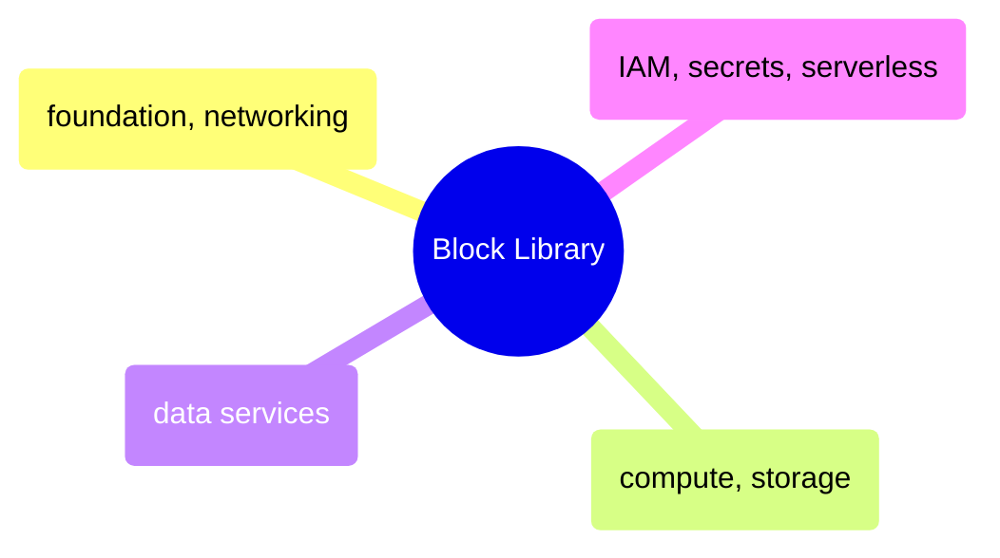

# Block Library

Copy-paste Terraform block templates for GCP resources — foundation and networking, compute and storage, data services, IAM, secrets, and serverless.

> [!abstract]- [[01-tf-foundation-and-networking]]
>
> - [[tf-foundation-and-networking#Foundation Blocks|Foundation blocks]]
> - [[tf-foundation-and-networking#Networking Blocks|Networking blocks]]
> - [[tf-foundation-and-networking#Firewall Rules|Firewall rules]]
> - [[tf-foundation-and-networking#VPC Peering|VPC peering]]
> - [[tf-foundation-and-networking#Private Service Connect|Private Service Connect]]

> [!abstract]- [[02-tf-compute-and-storage]]
>
> - [[tf-compute-and-storage#Compute Engine Blocks|Compute Engine blocks]]
> - [[tf-compute-and-storage#Disk Management|Disk management]]
> - [[tf-compute-and-storage#Cloud Storage Blocks|Cloud Storage blocks]]
> - [[tf-compute-and-storage#Bucket IAM — Grant Access to Members|Bucket IAM]]
> - [[tf-compute-and-storage#Bucket Notification — Trigger Pub|Bucket notifications]]

> [!abstract]- [[03-tf-data-services]]
>
> - [[tf-data-services#BigQuery Blocks|BigQuery blocks]]
> - [[tf-data-services#Firestore Blocks|Firestore blocks]]
> - [[tf-data-services#Dataflow Blocks|Dataflow blocks]]
> - [[tf-data-services#Cloud SQL Blocks|Cloud SQL blocks]]
> - [[tf-data-services#Monitoring and Logging Blocks|Monitoring and logging blocks]]

> [!abstract]- [[04-tf-iam-secrets-serverless]]
>
> - [[tf-iam-secrets-serverless#IAM Blocks|IAM blocks]]
> - [[tf-iam-secrets-serverless#Secret Manager Blocks|Secret Manager blocks]]
> - [[tf-iam-secrets-serverless#Cloud Run Blocks|Cloud Run blocks]]
> - [[tf-iam-secrets-serverless#Cloud Functions Blocks|Cloud Functions blocks]]
> - [[tf-iam-secrets-serverless#Topic|Pub/Sub blocks]]
> - [[tf-iam-secrets-serverless#Artifact Registry Blocks|Artifact Registry blocks]]
