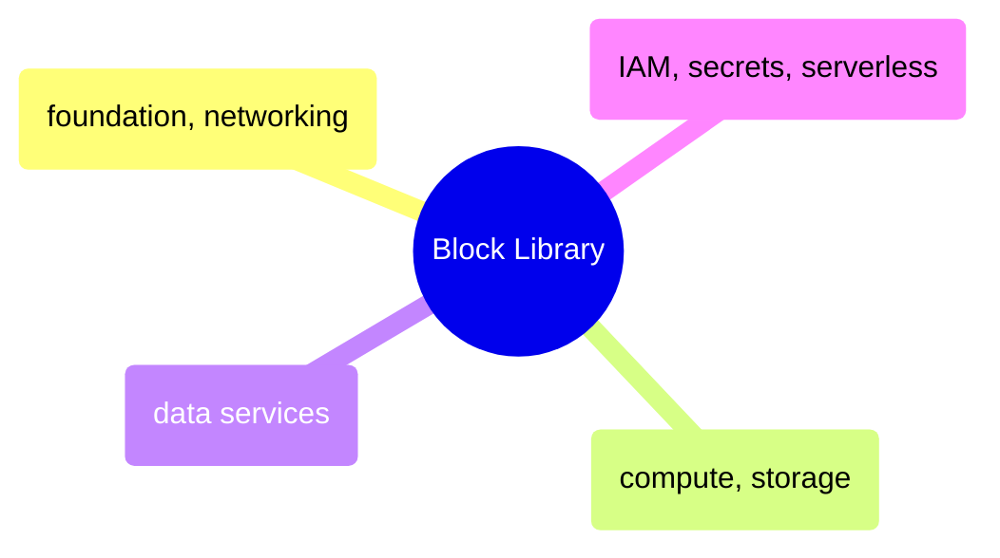

# Block Library

Copy-paste Terraform block templates for GCP resources — foundation and networking, compute and storage, data services, IAM, secrets, and serverless.

> [!abstract]- [[01-foundation-and-networking]]

> [!abstract]- [[02-compute-and-storage]]

> [!abstract]- [[03-data-services]]

> [!abstract]- [[04-iam-secrets-serverless]]
