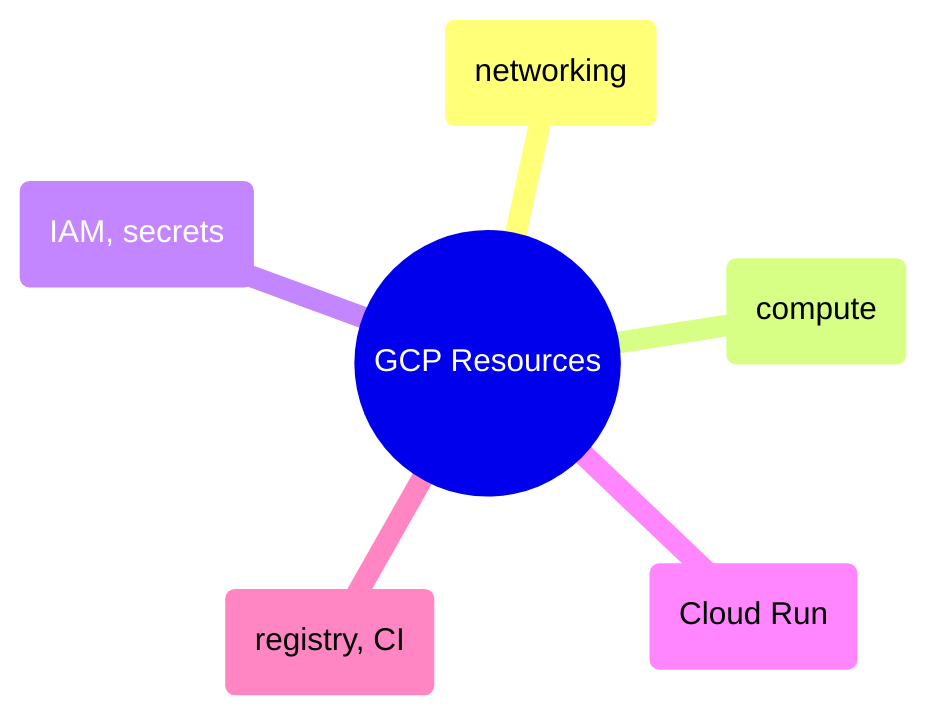

# GCP Resources

Terraform configurations for provisioning GCP infrastructure — networking, compute instances, IAM and secrets, Cloud Run services, and container registry with CI integration.

> [!abstract]- [[terraform-networking]]
>
> - [[terraform-networking#Networking Concepts|Networking concepts]]
> - [[terraform-networking#Architecture Overview|Architecture overview]]
> - [[terraform-networking#Resource: VPC Network|VPC network]]
> - [[terraform-networking#Resource: Cloud NAT|Cloud NAT]]
> - [[terraform-networking#Firewall Rules|Firewall rules]]

> [!abstract]- [[terraform-compute]]
>
> - [[terraform-compute#Architecture Context|Architecture context]]
> - [[terraform-compute#Resource: Airflow VM|Airflow VM]]
> - [[terraform-compute#Boot Disk — Container-Optimized OS|Boot disk and Container-Optimized OS]]
> - [[terraform-compute#Resource: SQL Server VM|SQL Server VM]]
> - [[terraform-compute#Allow Stopping for Update|Allow stopping for update]]

> [!abstract]- [[terraform-iam-and-secrets]]
>
> - [[terraform-iam-and-secrets#Core Service Accounts|Core service accounts]]
> - [[terraform-iam-and-secrets#IAM Bindings|IAM bindings]]
> - [[terraform-iam-and-secrets#Secret Manager — secrets.tf|Secret Manager]]
> - [[terraform-iam-and-secrets#Conditional Datadog Resources|Conditional Datadog resources]]
> - [[terraform-iam-and-secrets#CI IAM Bindings|CI IAM bindings]]

> [!abstract]- [[terraform-cloud-run]]
>
> - [[terraform-cloud-run#Resource: Dashboard Service|Dashboard service]]
> - [[terraform-cloud-run#VPC Access — Direct Egress|VPC access and direct egress]]
> - [[terraform-cloud-run#Resource: Pipeline Job|Pipeline job]]
> - [[terraform-cloud-run#Service vs Job Comparison|Service vs job comparison]]
> - [[terraform-cloud-run#Double-Nested Template|Double-nested template]]

> [!abstract]- [[terraform-registry-and-ci]]
>
> - [[terraform-registry-and-ci#Artifact Registry — registry.tf|Artifact Registry]]
> - [[terraform-registry-and-ci#Cleanup Policies|Cleanup policies]]
> - [[terraform-registry-and-ci#IAM Bindings|CI IAM bindings]]
> - [[terraform-registry-and-ci#GitHub Actions Workflow Integration|GitHub Actions integration]]
