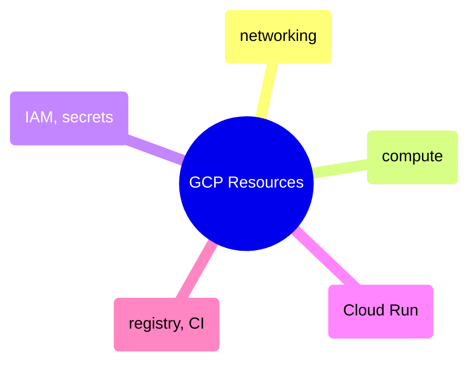

# GCP Resources

Terraform configurations for provisioning GCP infrastructure — networking, compute instances, IAM and secrets, Cloud Run services, and container registry with CI integration.

> [!abstract]- [[01-terraform-networking]]

> [!abstract]- [[02-terraform-compute]]

> [!abstract]- [[03-terraform-iam-and-secrets]]

> [!abstract]- [[04-terraform-cloud-run]]

> [!abstract]- [[05-terraform-registry-and-ci]]
