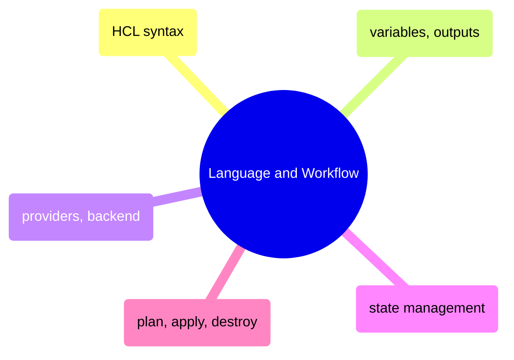

# Language and Workflow

HCL syntax fundamentals, variable and output management, provider configuration, state management, and the core plan/apply/destroy workflow.

> [!abstract]- [[01-hcl-syntax-basics]]
>
> - [[hcl-syntax-basics#Blocks and Arguments|Blocks and arguments]]
> - [[hcl-syntax-basics#File Naming and Organization|File naming and organization]]
> - [[hcl-syntax-basics#Terraform Name vs GCP Name|Terraform name vs GCP name]]
> - [[hcl-syntax-basics#Block Types|Block types]]
> - [[hcl-syntax-basics#Declarative vs Imperative|Declarative vs imperative]]

> [!abstract]- [[03-terraform-variables-and-outputs]]
>
> - [[terraform-variables-and-outputs#Input Variables — variables.tf|Input variables]]
> - [[terraform-variables-and-outputs#Setting Variable Values|Setting variable values]]
> - [[terraform-variables-and-outputs#Locals — Computed Values|Locals and computed values]]
> - [[terraform-variables-and-outputs#Output Values — outputs.tf|Output values]]
> - [[terraform-variables-and-outputs#Querying Outputs|Querying outputs]]

> [!abstract]- [[02-terraform-providers-and-backend]]
>
> - [[terraform-providers-and-backend#Provider and Backend Configuration|Provider and backend configuration]]
> - [[terraform-providers-and-backend#Why Remote State?|Why remote state]]
> - [[terraform-providers-and-backend#The terraform Block|The terraform block]]

> [!abstract]- [[04-terraform-state-management]]
>
> - [[terraform-state-management#What Is the State File?|What is the state file]]
> - [[terraform-state-management#Remote State in GCS|Remote state in GCS]]
> - [[terraform-state-management#State Locking|State locking]]
> - [[terraform-state-management#Inspecting State|Inspecting state]]
> - [[terraform-state-management#Moving Resources in State|Moving resources in state]]
> - [[terraform-state-management#State Security|State security]]

> [!abstract]- [[05-terraform-plan-apply-destroy]]
>
> - [[terraform-plan-apply-destroy#How terraform apply Works|How apply works]]
> - [[terraform-plan-apply-destroy#Core Commands|Core commands]]
> - [[terraform-plan-apply-destroy#Importing Existing Resources|Importing existing resources]]
> - [[terraform-plan-apply-destroy#Common Issues and Fixes|Common issues and fixes]]
