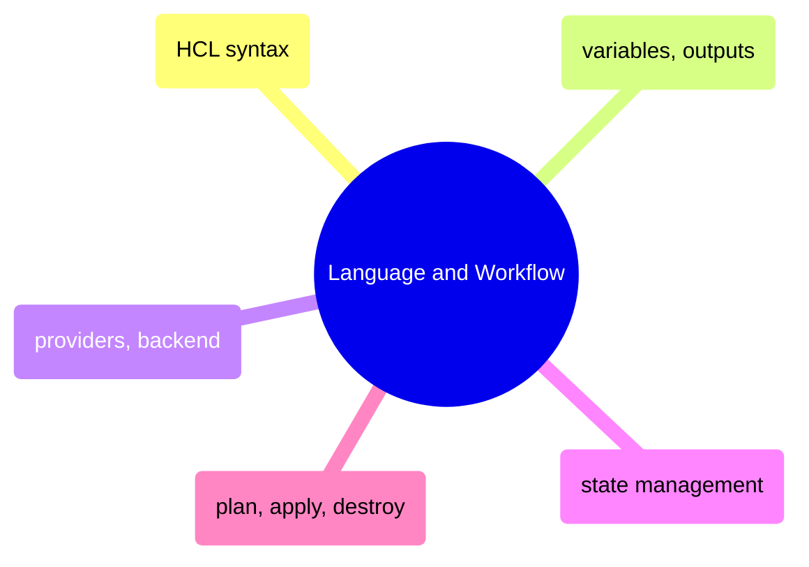

# Language and Workflow

HCL syntax fundamentals, variable and output management, provider configuration, state management, and the core plan/apply/destroy workflow.

> [!abstract]- [[01-hcl-syntax-basics]]

> [!abstract]- [[03-terraform-variables-and-outputs]]

> [!abstract]- [[02-terraform-providers-and-backend]]

> [!abstract]- [[04-terraform-state-management]]

> [!abstract]- [[05-terraform-plan-apply-destroy]]
