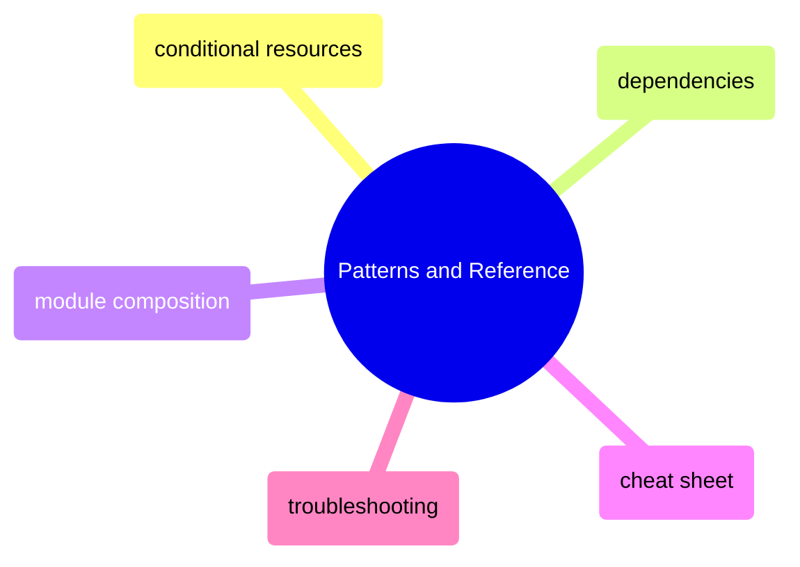

# Patterns and Reference

Reusable Terraform patterns — conditional resources, dependency management, module composition — plus a cheat sheet and troubleshooting guide.

> [!abstract]- [[terraform-conditional-resources]]
>
> - [[terraform-conditional-resources#count — Conditional Creation|Count conditional creation]]
> - [[terraform-conditional-resources#for_each — Multiple Instances from a Collection|for_each multiple instances]]
> - [[terraform-conditional-resources#Dynamic Blocks|Dynamic blocks]]
> - [[terraform-conditional-resources#Ternary Operator Patterns|Ternary operator patterns]]
> - [[terraform-conditional-resources#Referencing Conditional Resources|Referencing conditional resources]]

> [!abstract]- [[terraform-resource-dependencies]]
>
> - [[terraform-resource-dependencies#How the Dependency Graph Works|How the dependency graph works]]
> - [[terraform-resource-dependencies#Implicit Dependencies — Resource References|Implicit dependencies]]
> - [[terraform-resource-dependencies#Traversing Nested Attributes|Traversing nested attributes]]
> - [[terraform-resource-dependencies#Explicit Dependencies — depends_on|Explicit dependencies]]
> - [[terraform-resource-dependencies#Circular Dependencies|Circular dependencies]]

> [!abstract]- [[terraform-module-composition]]
>
> - [[terraform-module-composition#Module Basics|Module basics]]
> - [[terraform-module-composition#Module Directory Structure|Module directory structure]]
> - [[terraform-module-composition#Multi-Environment with Modules|Multi-environment with modules]]
> - [[terraform-module-composition#Environment Promotion Pattern|Environment promotion pattern]]
> - [[terraform-module-composition#When to Extract a Module|When to extract a module]]

> [!abstract]- [[terraform-cheat-sheet]]
>
> - [[terraform-cheat-sheet#Core Workflow|Core workflow commands]]
> - [[terraform-cheat-sheet#State Commands|State commands]]
> - [[terraform-cheat-sheet#Resource Targeting|Resource targeting]]
> - [[terraform-cheat-sheet#HCL Functions Reference|HCL functions reference]]
> - [[terraform-cheat-sheet#Common Patterns|Common patterns]]

> [!abstract]- [[terraform-problems]]
>
> - [[terraform-problems#Critical — Infrastructure Destruction|Critical problems]]
> - [[terraform-problems#High — Infrastructure Drift|High severity drift and blocking]]
> - [[terraform-problems#Moderate — Operational Pain|Moderate operational pain]]
> - [[terraform-problems#Low — Annoyances|Low severity annoyances]]
