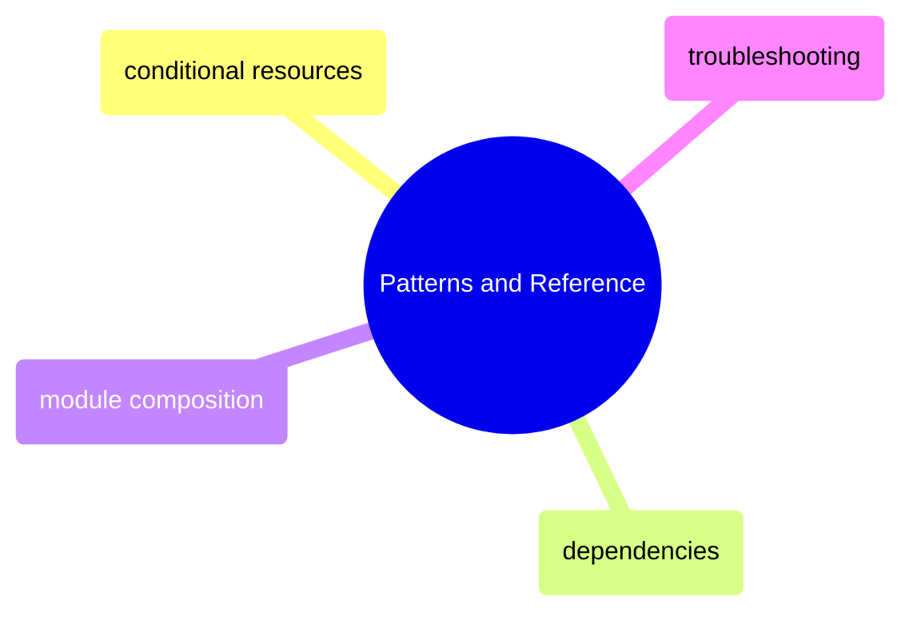

# Patterns and Reference

Reusable Terraform patterns — conditional resources, dependency management, module composition — plus a troubleshooting guide.

> [!abstract]- [[02-conditional-resources]]

> [!abstract]- [[01-resource-dependencies]]

> [!abstract]- [[03-module-composition]]

> [!abstract]- [[problems]]
