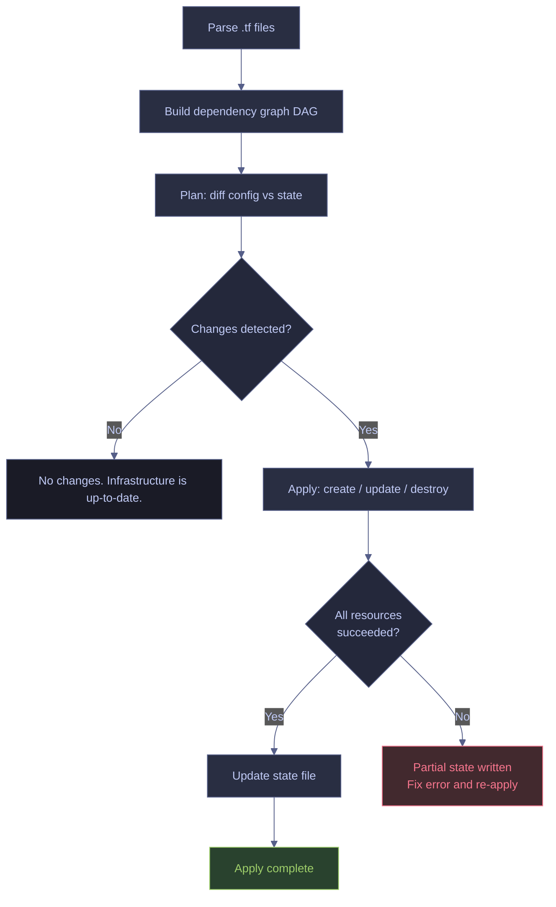

# Terraform Plan, Apply, and Destroy

> [!quote]
> "Plans are worthless, but planning is everything."
>
> — **Dwight D. Eisenhower**

The Terraform core workflow is declarative: you describe infrastructure in `.tf` files, and Terraform computes a diff against current state, shows you a plan, and applies only what changed. Understanding each step — including when to use targeted applies, how to import existing resources, and how to inspect state — is essential for safe infrastructure management.

## How terraform apply Works

When you run `terraform apply`, Terraform executes a five-phase sequence internally. Understanding each phase — especially parallelism behavior and the lack of rollback on failure — prevents surprises in production.

1. **Parse** — merges all `.tf` files in the working directory into a single in-memory configuration. File order does not matter; Terraform treats all `.tf` files as one unit
2. **Build dependency graph** — analyzes resource references (e.g., `google_compute_network.main.id`) and explicit `depends_on` declarations to build a directed acyclic graph (DAG) that determines creation order
3. **Plan** — compares the desired state from `.tf` files with the current state in `.tfstate` and computes a diff. Each resource is marked as create (`+`), update (`~`), destroy (`-`), or replace (`-/+`)
4. **Apply** — creates, updates, or deletes resources. Independent resources are applied **in parallel** (default 10 concurrent operations, configurable with `-parallelism=N`). Dependent resources wait for their upstream dependencies to complete
5. **Update state** — writes the new resource attributes and metadata to the configured backend (e.g., a GCS bucket) after each resource operation, not just at the end

> [!danger] No Rollback on Partial Failure
> If `terraform apply` fails mid-execution (e.g., API quota exceeded, permission denied on one resource), Terraform does **not** roll back resources that were already created. The state file reflects what was actually provisioned. You must run `terraform plan` again to see remaining drift and re-apply.

> [!success] Safe Recovery from Partial Apply
> After a failed apply, run `terraform plan` to see what still needs to change. Terraform's state file is updated after each individual resource operation, so it accurately reflects the partially-applied state. Fix the root cause (quota, permissions, config error) and re-apply — Terraform will pick up where it left off.



---

## Core Commands

### Initialize — Download Providers and Set Up Backend

`terraform init` is the first command you run in any Terraform working directory. It downloads provider plugins (e.g., the GCP provider binary) into a local `.terraform/` directory, initializes the configured backend (e.g., a GCS bucket for remote state), and generates `.terraform.lock.hcl` to pin exact provider versions for reproducible builds.

```bash
terraform init
```

Run `init` once after:
- Cloning a repository for the first time
- Adding a new provider to `required_providers`
- Changing the backend configuration

Use `-chdir` to run from a different directory — common in CI scripts and monorepos where Terraform configs live in a subdirectory.

```bash
terraform -chdir=infra init
```

> [!tip] Re-initialization Flags
> Use `terraform init -upgrade` to update providers to the latest version allowed by your version constraints. Use `terraform init -reconfigure` to reinitialize the backend without migrating existing state — useful when switching between backend configurations (e.g., from local to GCS).

### Plan — Preview Changes Without Applying

`terraform plan` reads the current state from the backend, compares it against your `.tf` configuration, and outputs a human-readable diff showing what Terraform would change. The `-out` flag saves a binary plan file that can be passed to `terraform apply` to guarantee that exactly what you reviewed is what gets applied — no drift from state changes between plan and apply.

```bash
terraform plan -out=tfplan
```

Use `terraform plan -destroy` to preview what a `terraform destroy` would remove, without actually destroying anything.

```bash
terraform plan -destroy
```

> [!warning] Always Review the Plan
> Never run `terraform apply` without first reviewing `terraform plan`. Terraform can and will destroy production resources if the configuration changes. Look specifically for lines beginning with `-` (destroy) and `~` (update in-place). Check for `# forces replacement` annotations — these mean the resource will be destroyed and recreated.

> [!success] Safe Apply Pattern
> Always save the plan first and apply from the saved file: `terraform plan -out=tfplan && terraform apply tfplan`. This guarantees that exactly what you reviewed is what gets applied — no surprises from state changes that occurred between `plan` and `apply`.

#### Plan Output Symbols

Each resource in the plan output is prefixed with a symbol indicating the operation Terraform will perform.

| Symbol | Meaning | Example Trigger |
|--------|---------|-----------------|
| `+` | Resource will be created | New resource block added to config |
| `-` | Resource will be destroyed | Resource block removed from config |
| `~` | Resource will be updated in-place | Mutable argument changed (e.g., `labels`) |
| `-/+` | Resource will be destroyed and recreated | Immutable argument changed (e.g., `location` on a BigQuery dataset) |
| `<=` | Data source will be read | `data` block referencing external resource |

### Apply — Execute the Plan

`terraform apply` provisions, modifies, or destroys real infrastructure to match the configuration. When given a saved plan file, it executes that exact plan without re-prompting. When run without a plan file, it generates a new plan interactively and asks for confirmation before proceeding.

```bash
terraform apply tfplan
```

Running without a saved plan shows the plan inline and requires interactive confirmation. This is convenient for development but risky in CI — use a saved plan file in automated pipelines.

```bash
terraform apply
```

Use `-auto-approve` to skip the interactive confirmation prompt. Only appropriate in non-production automation with proper plan review gates upstream.

```bash
terraform apply -auto-approve
```

> [!example] Data Pipeline Approach
> In production data engineering workflows, `terraform apply` is typically run **manually** — not in CI/CD. CI/CD handles application code (Docker images, Cloud Run deployments), while infrastructure changes are deliberate, reviewed, and applied by hand.

#### Apply Only Specific Resources

Target a single resource when adding something new to an existing configuration without touching everything else. Terraform will plan and apply only the specified resource and its dependencies.

```bash
terraform -chdir=infra apply -target=google_compute_instance.airflow
```

> [!warning] Targeted Apply Creates Drift Risk
> Using `-target` repeatedly can create inconsistencies where the state diverges from what a full `terraform plan` would produce. Dependencies that aren't explicitly targeted may be skipped.

> [!success] Always Follow Up with a Full Plan
> After using `-target`, run a full `terraform plan` (without `-target`) to verify the overall state is consistent. Use targeted applies as a surgical tool, not a habit.

### Destroy — Tear Down Resources

`terraform destroy` is the inverse of `apply` — it removes every resource tracked in the current Terraform state. After destruction, the state file is updated to reflect that no resources are managed. This is irreversible at the infrastructure level.

```bash
terraform destroy
```

> [!danger] Destroy is Permanent
> `terraform destroy` will remove **all** GCP resources managed by this configuration — VMs, Cloud Run services, firewall rules, service accounts, and secrets. There is no undo. Data stored in destroyed resources (BigQuery tables, Cloud SQL databases, GCS buckets) is permanently lost unless backed up externally.

> [!success] Protect Critical Resources
> Set `deletion_protection = true` on stateful resources: Cloud SQL instances, BigQuery tables, and Compute Engine VMs. Terraform will refuse to destroy protected resources until you explicitly set `deletion_protection = false` in the config and apply. For targeted cleanup, use `terraform destroy -target=<resource>` to remove only a specific resource.

#### Destroy a Specific Resource

Target individual resources for destruction without affecting the rest of the configuration. Useful for cleaning up dev resources or removing a single component.

```bash
terraform destroy -target=google_compute_instance.airflow
```

---

## State Inspection Commands

Terraform provides several commands for inspecting current state without modifying infrastructure. These are essential for debugging, auditing, and understanding what Terraform currently manages.

### Resource Listing and Details

`terraform state list` displays every resource currently tracked in the state file. `terraform state show` displays all attributes of a single resource, including computed values like IDs and IP addresses that only exist after provisioning.

```bash
terraform state list
```

```bash
terraform state show google_compute_instance.project_sql
```

Both commands support `-chdir` for running against a subdirectory.

```bash
terraform -chdir=infra state list
```

```bash
terraform -chdir=infra state show google_cloud_run_v2_service.dashboard
```

### Validation and Formatting

`terraform validate` checks configuration syntax and internal consistency (e.g., references to undefined variables, invalid argument types) without accessing the backend or any remote API. `terraform fmt` rewrites `.tf` files to the canonical HCL style.

```bash
terraform validate
```

```bash
terraform fmt
```

> [!tip] CI Pipeline Integration
> Run `terraform fmt -check` and `terraform validate` in CI before `plan` to catch syntax errors and style drift early. Both commands are fast, require no credentials, and exit with a non-zero code on failure.

### Output Inspection

`terraform output` displays the values of all output variables defined in the configuration. Use it to retrieve computed values (URLs, IP addresses, resource IDs) after an apply.

```bash
terraform -chdir=infra output
```

```bash
terraform -chdir=infra output dashboard_url
```

### State Summary

`terraform show` renders the entire state or a saved plan file in human-readable format. Useful for reviewing the full state at a glance or inspecting what a saved plan file contains before applying.

```bash
terraform show
```

```bash
terraform show tfplan
```

---

## Importing Existing Resources

When a resource was created outside of Terraform — manually in the GCP Console, via `gcloud`, or by another tool — you can bring it under Terraform management without recreating it. Import only writes to the state file; it does not generate `.tf` configuration. You must write the matching resource block yourself and iterate until `terraform plan` shows no changes.

### CLI Import Workflow

The `terraform import` command takes a Terraform resource address and a cloud provider resource ID, then adds the existing resource to the state file.

```bash
terraform import google_compute_instance.project_sql \
  projects/data-platform-prod/zones/europe-west1-b/instances/data-pipeline-sql
```

```bash
terraform -chdir=infra import google_cloud_run_v2_service.dashboard \
  projects/data-platform-prod/locations/europe-west1/services/data-pipeline-dashboard
```

> [!todo] Import Procedure
> 1. Write the `resource` block in your `.tf` files — Terraform needs the resource type and local name to map the import
> 2. Run `terraform import <resource_address> <cloud_resource_id>`
> 3. Run `terraform plan` — Terraform shows diffs between your `.tf` configuration and the actual resource attributes
> 4. Update your `.tf` file to match the real resource (eliminate diffs)
> 5. Run `terraform plan` again — should show "No changes. Infrastructure is up-to-date."

> [!warning] Import Does Not Generate Configuration
> `terraform import` only adds the resource to the state file. It does not create or modify any `.tf` files. If you skip step 1 and import without a matching resource block, the next `terraform plan` will show the resource as needing to be destroyed.

> [!success] Use terraform show After Import
> Run `terraform state show <resource_address>` immediately after import to see all attributes of the imported resource. Use this output as a reference when writing the matching `.tf` configuration.

### Declarative Import Blocks

Terraform 1.5 introduced `import` blocks that declare imports directly in HCL, replacing the CLI workflow for most use cases. The import is executed during `terraform plan` and `terraform apply`, making it reviewable and version-controllable.

```hcl
import {
  to = google_compute_instance.project_sql
  id = "projects/data-platform-prod/zones/europe-west1-b/instances/data-pipeline-sql"
}
```

The `import` block can be placed in any `.tf` file. After a successful apply, remove the `import` block — it is only needed for the initial import. Combined with `terraform plan -generate-config-out=generated.tf` (Terraform 1.5+), Terraform can also generate an initial `.tf` configuration for the imported resource.

> [!info] Terraform 1.5+ Required
> Declarative `import` blocks and `-generate-config-out` require Terraform 1.5 or later. Earlier versions must use the `terraform import` CLI command.

---

## Common Issues and Fixes

The following errors appear frequently when working with Terraform and GCP. Each row links the error message to its root cause and the recommended fix.

| Error | Cause | Fix |
|-------|-------|-----|
| `Resource already exists (409)` | Resource was created outside Terraform | `terraform import` to bring it under management |
| `deletion_protection` error | Trying to destroy a protected resource | Set `deletion_protection = false` in `.tf`, apply, then destroy |
| `provenance` error on Cloud Run | Docker image built with BuildKit provenance | Build with `--provenance=false` flag |
| `Permission denied` on apply | Terraform service account lacks roles | Check `gcloud auth list`, ensure correct account is active |
| State lock error | Another `terraform apply` is running | Wait, or force-unlock with `terraform force-unlock <LOCK_ID>` |
| `Error acquiring the state lock` | Stale lock from a crashed apply | Verify no other process is running, then `terraform force-unlock <LOCK_ID>` |
| `Provider produced inconsistent result` | Provider bug or API eventual consistency | Re-run `terraform plan` — if persistent, pin provider version and file an issue |

---

## Multi-Environment Patterns

For managing dev, staging, and prod environments, extract common infrastructure patterns into reusable modules. Each module encapsulates the resources for one environment (Pub/Sub topics, BigQuery datasets, service accounts, IAM bindings), parameterized by variables. Promote changes from dev → staging → prod by applying the same module with different variable values.

```hcl
module "pipeline_env" {
  source     = "./modules/pipeline-env"
  env        = "prod"
  project_id = var.project_id
  region     = var.region
}
```

> [!question] Module Granularity
> Should you create one large module per environment or many small modules per service? Start with one module per environment for simple projects. Split into per-service modules when different services have different lifecycles or ownership boundaries.

See [terraform-module-composition](https://alp78.github.io/elysium/07-Terraform/Patterns/terraform-module-composition) for module design patterns and [terraform-resource-dependencies](https://alp78.github.io/elysium/07-Terraform/Patterns/terraform-resource-dependencies) for how Terraform resolves inter-module dependencies.

---

## Exit Codes

Terraform CLI commands return specific exit codes that are useful for scripting and CI pipeline logic. The `-detailed-exitcode` flag on `terraform plan` is particularly important — it distinguishes between "no changes" and "changes pending" without applying anything.

| Code | Meaning | When |
|------|---------|------|
| `0` | Success, no changes | `plan` finds infrastructure matches config; `apply` completes |
| `1` | Error | Any command that fails (syntax error, API error, permission denied) |
| `2` | Success, changes pending | `plan -detailed-exitcode` detects drift between config and state |

```bash
terraform plan -detailed-exitcode
```

> [!tip] Use Exit Code 2 in CI
> In CI pipelines, run `terraform plan -detailed-exitcode` and branch on the exit code: `0` means no action needed, `2` means changes are pending and require review, `1` means something is broken. This avoids parsing plan text output.

---

## Terraform Environment Variables

Terraform behavior can be controlled via environment variables. These are especially useful in CI/CD pipelines and wrapper scripts where you cannot pass flags interactively.

| Variable | Description |
|----------|-------------|
| `TF_LOG` | Log level: `TRACE`, `DEBUG`, `INFO`, `WARN`, `ERROR`, `OFF` |
| `TF_LOG_PATH` | Write logs to this file instead of stderr |
| `TF_VAR_name` | Set variable `name` (overrides `.tfvars` files) |
| `TF_CLI_ARGS` | Default CLI flags appended to every command |
| `TF_CLI_ARGS_plan` | Default flags for `terraform plan` only |
| `TF_CLI_ARGS_apply` | Default flags for `terraform apply` only |
| `TF_DATA_DIR` | Override the `.terraform` directory path |
| `TF_WORKSPACE` | Set the active workspace |
| `TF_IN_AUTOMATION` | Set to any non-empty value to suppress interactive prompts and adjust output for CI |
| `TF_INPUT` | Set to `0` to disable interactive prompts globally |
| `TF_REGISTRY_DISCOVERY_RETRY` | Number of registry discovery retries |
| `GOOGLE_CREDENTIALS` | Path to a GCP service account key JSON file |
| `GOOGLE_APPLICATION_CREDENTIALS` | Path used by Application Default Credentials |
| `GOOGLE_PROJECT` | Default GCP project ID for the google provider |
| `GOOGLE_REGION` | Default GCP region for the google provider |

#### Enable trace logging to a file

```bash
TF_LOG=TRACE TF_LOG_PATH=terraform.log terraform plan
```

#### Set a variable via environment

```bash
TF_VAR_project_id=my-project terraform plan
```

#### CI automation mode

Combines `TF_IN_AUTOMATION` (adjusts output formatting and suppresses suggestions) with `TF_INPUT=0` (disables interactive prompts) for headless execution.

```bash
TF_IN_AUTOMATION=1 TF_INPUT=0 terraform apply -auto-approve
```

---

## Related

**Terraform Fundamentals:**
- [hcl-syntax-basics](https://alp78.github.io/elysium/07-Terraform/Fundamentals/hcl-syntax-basics) — HCL block types, expressions, and type system
- [terraform-providers-and-backend](https://alp78.github.io/elysium/07-Terraform/Fundamentals/terraform-providers-and-backend) — provider configuration and GCS backend setup
- [terraform-state-management](https://alp78.github.io/elysium/07-Terraform/Fundamentals/terraform-state-management) — remote state, locking, and state manipulation commands
- [terraform-variables-and-outputs](https://alp78.github.io/elysium/07-Terraform/Fundamentals/terraform-variables-and-outputs) — how variables are defined and consumed

**Patterns:**
- [terraform-module-composition](https://alp78.github.io/elysium/07-Terraform/Patterns/terraform-module-composition) — multi-environment module patterns
- [terraform-resource-dependencies](https://alp78.github.io/elysium/07-Terraform/Patterns/terraform-resource-dependencies) — dependency graph and lifecycle meta-arguments

**GCP:**
- [gcs-buckets-and-lifecycle](https://alp78.github.io/elysium/06-GCP/Storage/gcs-buckets-and-lifecycle) — GCS bucket management (used as Terraform state backend)
- [service-accounts-and-iam](https://alp78.github.io/elysium/06-GCP/Security/service-accounts-and-iam) — IAM roles required by the Terraform service account

**CI/CD:**
- [github-actions-ci-cd](https://alp78.github.io/elysium/10-GitHub-Actions/github-actions-ci-cd) — CI/CD pipelines for `terraform plan` and `apply` automation

## References

- [Terraform CLI Commands](https://developer.hashicorp.com/terraform/cli/commands)
- [Terraform Import](https://developer.hashicorp.com/terraform/cli/import)
- [Terraform Import Block](https://developer.hashicorp.com/terraform/language/import)
