```mermaid
%%{init: {'theme': 'dark', 'themeVariables': {
  'primaryColor': '#292e42',
  'primaryTextColor': '#c0caf5',
  'primaryBorderColor': '#565f89',
  'lineColor': '#565f89',
  'secondaryColor': '#1a1b26',
  'tertiaryColor': '#24283b',
  'noteTextColor': '#c0caf5',
  'noteBkgColor': '#292e42',
  'textColor': '#c0caf5',
  'fontSize': '14px'
}}}%%
flowchart LR
    A[terraform init] --> B[Read state\nfrom GCS]
    B --> C[Acquire lock]
    C --> D[terraform plan\nDiff: config vs state vs API]
    D --> E[terraform apply\nCreate / Update / Destroy]
    E --> F[Write updated\nstate to GCS]
    F --> G[Release lock]

    style A fill:#292e42,stroke:#565f89,color:#c0caf5
    style B fill:#292e42,stroke:#565f89,color:#c0caf5
    style C fill:#24283b,stroke:#f7768e,color:#c0caf5
    style D fill:#292e42,stroke:#565f89,color:#c0caf5
    style E fill:#292e42,stroke:#565f89,color:#c0caf5
    style F fill:#292e42,stroke:#565f89,color:#c0caf5
    style G fill:#24283b,stroke:#9ece6a,color:#c0caf5
```

# Terraform State Management

> [!quote]
> "The source of truth is the single place where the system's current state is definitively recorded."
>
> — **Martin Kleppmann**, *Designing Data-Intensive Applications* (2017)

Terraform state is the source of truth that maps your `.tf` configuration to real infrastructure resources. Understanding how state works, how to protect it, and how to safely manipulate it is critical for production infrastructure management.

## The State File

The state file (`terraform.tfstate`) is a JSON document that maps every resource in your `.tf` files to its real cloud counterpart (resource IDs, IPs, URIs, etc.). When you run `terraform plan`, Terraform executes a four-step reconciliation cycle:

1. Reads the current state (remote or local)
2. Queries the provider API to see what actually exists
3. Computes the diff between your `.tf` files and the current state
4. Generates a plan showing what will change

> [!warning] The State File Is Sacred
>
> If you lose the state file, Terraform doesn't know what exists and will try to recreate everything — causing duplicates, conflicts, and potentially destroying running services. Always use remote state. Never delete the state file.

> [!success] Use Remote State with Versioning
>
> Configure the `backend "gcs"` block in `main.tf` to store state in a GCS bucket, and enable object versioning on that bucket. If the state file is corrupted or accidentally deleted, you can restore a previous version with `gcloud storage cp "gs://<bucket>/path/default.tfstate#<generation>" gs://<bucket>/path/default.tfstate`.



---

## Remote State in GCS

The `backend "gcs"` block in `main.tf` stores state remotely in Google Cloud Storage. This is the recommended approach for any team or CI/CD-driven workflow — it centralizes state, enables locking, and protects against local machine failures. See [GCS buckets and lifecycle](https://alp78.github.io/elysium/06-GCP/Storage/gcs-buckets-and-lifecycle) for the underlying GCS concepts (versioning, lifecycle rules, IAM).

```hcl
terraform {
  required_version = ">= 1.5"

  required_providers {
    google = {
      source  = "hashicorp/google"
      version = "~> 6.0"
    }
  }

  backend "gcs" {
    bucket = "data-pipeline-tf-state"
    prefix = "terraform/state"
  }
}
```

| Field | Value | Meaning |
|-------|-------|---------|
| `bucket` | `data-pipeline-tf-state` | The GCS bucket name. This bucket must exist **before** `terraform init` — Terraform does not create it. |
| `prefix` | `terraform/state` | A path prefix inside the bucket. The actual state file is stored at `terraform/state/default.tfstate`. Using a prefix allows multiple Terraform configurations to share one bucket without colliding. |

**Why remote state?**
- If the state file is local, only one machine can run `terraform apply`
- With GCS backend, the state is centralized and locked during operations — preventing concurrent modifications
- The state survives if your laptop dies
- The GCS bucket access controls protect sensitive values stored in state (passwords, connection strings)

> [!info] GCS Bucket Must Pre-exist
>
> Create the state bucket manually (or via a separate bootstrap Terraform config) before running `terraform init`. The GCS backend cannot create its own bucket.

> [!warning] No Concurrent Applies
>
> Never Run Concurrent `terraform apply` on the Same State.
> Even with GCS locking, two engineers running `terraform plan` simultaneously can both see the same "clean" state, then apply conflicting changes. The second apply may overwrite the first's changes or corrupt state. Use CI/CD pipelines (GitHub Actions, Cloud Build) as the single point of entry for `terraform apply` in shared environments.

> [!success] Enforce a Single Apply Path
>
> Designate one CI/CD pipeline (e.g., a Cloud Build trigger or a GitHub Actions workflow) as the only entry point for `terraform apply` in shared environments. Engineers run `terraform plan` locally to review changes, then merge to main and let the pipeline apply. This eliminates race conditions and ensures the state lock is always held by a single, serialized process.

### Bootstrap the State Bucket

The state bucket must exist before `terraform init` can configure the backend. Create it once, manually or via a separate bootstrap config. Link CI/CD as the single apply path — see [GitHub Actions workflows](https://alp78.github.io/elysium/10-GitHub-Actions) for pipeline integration.

#### Create the GCS state bucket

```bash
gcloud storage buckets create gs://data-pipeline-tf-state \
  --location=europe-west1 \
  --uniform-bucket-level-access
```

---

## State Locking

GCS backend supports automatic state locking during operations. When `terraform plan` or `terraform apply` runs, Terraform creates a `.tflock` file in the same GCS bucket alongside the state file. Any concurrent operation that attempts to acquire the lock will fail immediately with a lock error, preventing two processes from modifying state simultaneously.

If Terraform crashes mid-operation (e.g., network failure during `terraform apply`), the lock file remains in GCS because the process never completed its cleanup. This is called a stale lock — Terraform did not release it gracefully, and no operation is actually holding it.

#### Lock error output

```text
Error acquiring the state lock
Lock Info:
  ID:        abc-123-def
  Path:      gs://data-pipeline-tf-state/terraform/state/default.tflock
  Operation: OperationTypePlan
  Who:       user@machine
  Created:   2026-03-22 14:00:00
```

### Force-Unlock

When a Terraform process crashes or is terminated mid-operation, the lock file persists in GCS. Use `terraform force-unlock` to manually remove it. The `LOCK_ID` is the `ID` field shown in the lock error output above.

#### Remove a stale lock

```bash
terraform force-unlock <LOCK_ID>
```

> [!warning] Force-Unlock Carefully
>
> Only force-unlock if you are certain no other `terraform apply` is running. Unlocking while an apply is in progress can corrupt the state file.

> [!success] Verify Before Unlocking
>
> Before running `terraform force-unlock`, confirm that no pipeline, CI job, or team member is currently running an apply. Check your CI/CD platform's active job list and verify the GCS lock file timestamp. Only proceed with the unlock if the holding process has clearly crashed or been terminated.

---

## terraform state Commands

Use `terraform state` subcommands to inspect and manipulate state without modifying real infrastructure.

### Inspecting State

These read-only commands let you examine what Terraform is currently managing without modifying state or infrastructure. Use them to verify state contents after imports, moves, or applies.

#### List all managed resources

`terraform state list` prints every resource address in state — one per line. Use it to get a quick inventory of what Terraform controls.

```bash
terraform -chdir=infra state list
```

```text
google_artifact_registry_repository.data-pipeline
google_cloud_run_v2_job.pipeline
google_cloud_run_v2_job.setup
google_cloud_run_v2_service.dashboard
google_cloud_run_v2_service_iam_member.dashboard_public
google_compute_firewall.allow_apm
google_compute_firewall.allow_airflow_ui
google_compute_firewall.allow_iap
google_compute_firewall.allow_sql
google_compute_firewall.deny_all_ingress
google_compute_instance.airflow
google_compute_instance.sql
google_compute_network.main
google_compute_router.main
google_compute_router_nat.main
google_compute_subnetwork.main
google_iam_service_account.airflow
google_iam_service_account.pipeline
google_secret_manager_secret.db_password
google_secret_manager_secret_version.db_password
```

#### Show details of a specific resource

`terraform state show` prints all attributes Terraform has recorded for a single resource — IDs, IPs, URIs, computed values, and metadata. This is useful for debugging or verifying that an import captured the correct values.

```bash
terraform -chdir=infra state show google_cloud_run_v2_service.dashboard
```

#### Show the full state in human-readable format

`terraform show` renders the entire state file in a readable format. For large states, pipe through `less` or redirect to a file.

```bash
terraform -chdir=infra show
```

### Moving Resources in State

`terraform state mv` renames a resource in state without destroying and recreating it. Use this when refactoring `.tf` files — for example, renaming a resource's Terraform-internal name or moving a resource into a module. The real infrastructure is untouched; only the state mapping changes.

After running `state mv`, update your `.tf` files to use the new resource name, then run `terraform plan` to confirm "No changes."

#### Rename a resource with terraform state mv

```bash
terraform state mv google_compute_instance.project_sql google_compute_instance.sql
```

#### Declarative alternative — moved block (Terraform 1.1+)

Instead of running a CLI command, you can declare the rename directly in your `.tf` files using a `moved` block. Terraform processes the move automatically on the next `plan` or `apply`, then you can remove the `moved` block once the migration is complete.

> [!info] Requires Terraform 1.1+
>
> The `moved` block was introduced in Terraform 1.1. For older versions, use `terraform state mv` instead.

```hcl
moved {
  from = google_compute_instance.project_sql
  to   = google_compute_instance.sql
}
```

> [!tip] Prefer moved Blocks Over CLI state mv
>
> `moved` blocks are version-controlled, self-documenting, and apply consistently across all team members' environments. They also work across module boundaries (moving a resource into or out of a module). Reserve `terraform state mv` for one-off fixes or when you need to move resources between entirely separate state files.

### Removing Resources from State

`terraform state rm` removes a resource from state without destroying the real cloud resource. Use this when you want Terraform to "forget" about a resource — for example, when migrating it to a different Terraform configuration or handing it off to manual management.

After running `state rm`, Terraform no longer tracks that resource. A subsequent `terraform plan` will show the resource definition in your `.tf` files as a new resource to create, since it no longer exists in state.

#### Detach a resource from Terraform management

```bash
terraform state rm google_compute_instance.airflow
```

> [!warning] Never Edit State Manually
>
> Never edit `terraform.tfstate` directly in a text editor. Use `terraform state mv` and `terraform state rm` for all state manipulation. Manual edits corrupt the state and can cause all resources to be destroyed on the next apply.

> [!success] Use state subcommands for Safe Manipulation
>
> Use `terraform state mv <old> <new>` to rename a resource's Terraform-internal name after refactoring, and `terraform state rm <resource>` to detach a resource from management. Both commands update state safely without touching the real infrastructure.

> [!danger] State rm Then Apply Destroys Resources
>
> `terraform state rm` Followed by `terraform apply` Destroys Resources.
> If you `terraform state rm` a resource and then run `terraform apply`, Terraform sees the resource definition in your `.tf` files but not in state, so it tries to create a new one. If the resource already exists in GCP (which it does -- you just removed it from state), the apply either fails with a "resource already exists" error or, worse, creates a duplicate. Always pair `terraform state rm` with either removing the resource block from `.tf` files or immediately importing it back into a different state.

> [!success] Remove the Block or Re-import Immediately
>
> After `terraform state rm <resource>`, immediately either delete the corresponding resource block from your `.tf` files (if you no longer want Terraform to manage it) or run `terraform import <resource_type>.<name> <gcp_id>` to re-attach it to the correct state. Run `terraform plan` after either action and confirm "No changes" before proceeding.

### Importing Existing Resources

When a resource was created outside Terraform (manually, via `gcloud`, or by another tool), use `terraform import` to bring it under Terraform management without recreating it. The command takes two arguments: the Terraform resource address (`<type>.<name>`) and the cloud resource ID.

You must have a corresponding `resource` block in your `.tf` files before importing — Terraform needs a target address to map the real resource to.

#### Import a GCE instance

```bash
terraform import google_compute_instance.project_sql \
  projects/data-platform-prod/zones/europe-west1-b/instances/data-pipeline-sql
```

#### Import a Cloud Run service

```bash
terraform import google_cloud_run_v2_service.dashboard \
  projects/data-platform-prod/locations/europe-west1/services/data-pipeline-dashboard
```

#### Import a Secret Manager secret

```bash
terraform import google_secret_manager_secret.db_password \
  projects/data-platform-prod/secrets/data-pipeline-db-password
```

> [!todo] Post-Import Workflow
>
> 1. Run `terraform plan` — Terraform shows the diff between your `.tf` config and the actual resource
> 2. Update `.tf` arguments to match the real resource (close all diffs)
> 3. Run `terraform plan` again — confirm "No changes" before proceeding

#### Declarative alternative — import block (Terraform 1.5+)

Instead of running `terraform import` from the CLI, you can declare imports directly in your `.tf` files using an `import` block. Terraform processes the import on the next `plan` or `apply`, then you can remove the `import` block once the resource is in state.

> [!info] Requires Terraform 1.5+
>
> The `import` block was introduced in Terraform 1.5. For older versions, use `terraform import` CLI instead. From Terraform 1.6+, the `id` field supports variables and data source references for dynamic import targets.

```hcl
import {
  to = google_compute_instance.project_sql
  id = "projects/data-platform-prod/zones/europe-west1-b/instances/data-pipeline-sql"
}
```

> [!tip] Prefer import Blocks for Reproducibility
>
> `import` blocks are version-controlled and can be reviewed in a PR before applying. They also support `terraform plan` preview — you can see exactly what Terraform will import and what diffs it detects before running `apply`. The CLI `terraform import` command modifies state immediately with no preview step.

### Drift Detection with Refresh-Only Apply

When infrastructure is modified outside Terraform (manual console changes, `gcloud` commands, another tool), the state file becomes stale — it no longer reflects reality. Use `terraform apply -refresh-only` to update state to match actual infrastructure without making any changes.

> [!info] Replaces the Deprecated terraform refresh
>
> The standalone `terraform refresh` command was deprecated in Terraform 0.15.4. Use `terraform apply -refresh-only` instead — it provides the same functionality but shows a plan preview and requires explicit approval before modifying state.

#### Detect and reconcile drift

```bash
terraform apply -refresh-only
```

Terraform queries the provider API for every resource in state, compares actual attributes to stored attributes, and shows what state values will be updated. No infrastructure is created, modified, or destroyed — only the state file changes.

> [!warning] Refresh-Only Does Not Fix Config Drift
>
> `terraform apply -refresh-only` updates state to match reality, but it does not update your `.tf` files. After a refresh-only apply, run `terraform plan` to see if your config now differs from the refreshed state — then update `.tf` files to close the gap.

> [!success] Run Refresh-Only Before Plan in Shared Environments
>
> In CI/CD pipelines or multi-engineer teams, run `terraform apply -refresh-only -auto-approve` before `terraform plan` to ensure the plan is computed against the actual current state, not a stale snapshot from a previous apply.

### Advanced State Operations

`terraform state pull` and `terraform state push` allow direct manipulation of the state file as JSON. These are low-level commands intended for state migrations, debugging, or disaster recovery — not routine operations.

#### Download state as JSON

`terraform state pull` downloads the current state from the backend and prints it to stdout as JSON.

```bash
terraform state pull > state-backup.json
```

#### Upload a modified state file

`terraform state push` uploads a local state file to the backend, replacing the current state. Terraform validates the serial number to prevent accidental overwrites — the pushed state must have a serial equal to or greater than the current remote state.

```bash
terraform state push state-backup.json
```

> [!danger] State Push Can Corrupt Your Infrastructure
>
> Pushing an outdated or incorrectly modified state file can cause Terraform to destroy or recreate resources on the next apply. The serial number check prevents accidental rollbacks, but it cannot detect logical errors in the state content.

> [!success] Always Pull Before Push
>
> If you need to modify state manually: (1) pull the current state, (2) make targeted edits to the JSON, (3) push it back. Never edit a locally cached state file that may be out of date. Prefer `terraform state mv` and `terraform state rm` over direct JSON edits whenever possible.

---

## Verification After Apply

After `terraform apply`, run these commands to confirm the state reflects reality and no configuration drift remains. A clean apply should produce "No changes" on a subsequent plan.

#### View all outputs

```bash
terraform -chdir=infra output
```

#### View a specific output

```bash
terraform -chdir=infra output dashboard_url
```

#### Confirm no drift remains

```bash
terraform -chdir=infra plan
```

#### Validate configuration syntax

```bash
terraform -chdir=infra validate
```

---

## State Security

Terraform stores all resource attributes in state — including database passwords, API keys, and secret values passed via `google_secret_manager_secret_version`. The state file must be treated with the same security posture as your secret manager. See [service accounts and IAM](https://alp78.github.io/elysium/06-GCP/Security/service-accounts-and-iam) for GCP IAM fundamentals, and [secrets management](https://alp78.github.io/elysium/06-GCP/Security/secrets-management) for how secrets flow through infrastructure.

Three controls are essential for the state bucket:

1. **Restrict access** — only the Terraform service account and human administrators should have IAM permissions on the state bucket
2. **Enable versioning** — GCS bucket versioning lets you recover a corrupted state file from a previous version
3. **Enable object encryption** — GCS encrypts at rest by default; optionally use CMEK for compliance requirements

> [!danger] State Contains Plaintext Secrets
>
> Anyone with read access to the GCS state bucket can extract every secret in your infrastructure — database passwords, API keys, connection strings. Never grant `allUsers` or `allAuthenticatedUsers` access. Enable GCS audit logging so every state file read is recorded in Cloud Audit Logs. Never download state files to local machines.

> [!success] Lock Down the State Bucket
>
> Apply three controls to the state bucket: (1) restrict IAM to the Terraform service account and named admins only; (2) enable GCS audit logging so every state file read is recorded in Cloud Audit Logs; (3) enable bucket versioning for state recovery. Use `uniform_bucket_level_access = true` and `public_access_prevention = "enforced"` in the bucket's Terraform definition.

#### Enable versioning on the state bucket

```bash
gcloud storage buckets update gs://data-pipeline-tf-state --versioning
```

#### Recover a previous state version

If the current state is corrupted, list all object versions to find the last known good generation, then overwrite the current state file with it.

```bash
gcloud storage objects list gs://data-pipeline-tf-state/terraform/state/ --all-versions
```

```bash
gcloud storage cp "gs://data-pipeline-tf-state/terraform/state/default.tfstate#<generation>" \
  gs://data-pipeline-tf-state/terraform/state/default.tfstate
```

## Related

- [terraform-providers-and-backend](https://alp78.github.io/elysium/07-Terraform/Fundamentals/terraform-providers-and-backend) — backend "gcs" block configuration
- [terraform-plan-apply-destroy](https://alp78.github.io/elysium/07-Terraform/Fundamentals/terraform-plan-apply-destroy) — the workflow that reads and updates state
- [terraform-variables-and-outputs](https://alp78.github.io/elysium/07-Terraform/Fundamentals/terraform-variables-and-outputs) — outputs extracted from state after apply
- [GCS buckets and lifecycle](https://alp78.github.io/elysium/06-GCP/Storage/gcs-buckets-and-lifecycle) — GCS concepts underpinning the state backend (versioning, lifecycle, IAM)
- [Service accounts and IAM](https://alp78.github.io/elysium/06-GCP/Security/service-accounts-and-iam) — IAM controls for the Terraform service account and state bucket
- [Secrets management](https://alp78.github.io/elysium/06-GCP/Security/secrets-management) — secrets that appear as plaintext in state

## References

- [Terraform State](https://developer.hashicorp.com/terraform/language/state)
- [GCS Backend](https://developer.hashicorp.com/terraform/language/backend/gcs)
- [terraform state commands](https://developer.hashicorp.com/terraform/cli/commands/state)
- [moved blocks](https://developer.hashicorp.com/terraform/language/moved)
- [import blocks](https://developer.hashicorp.com/terraform/language/import)
