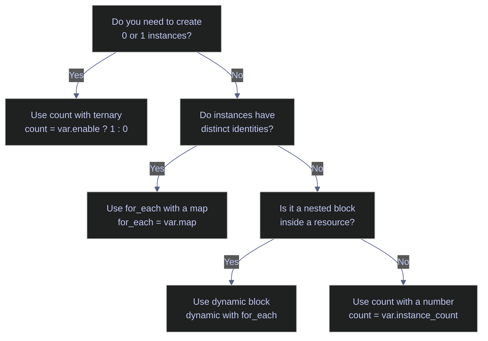

# Terraform Conditional Resources

> [!quote]
> "Flexibility in software is a double-edged sword. Every option you add also adds complexity."
>
> — **John Ousterhout**, *A Philosophy of Software Design* (2018)

Terraform uses `count` for conditional resource creation and `for_each` for creating multiple instances from a collection. These are the primary mechanisms for parameterized, reusable infrastructure configurations.

## count — Conditional Creation

The `count` meta-argument controls how many instances of a resource Terraform creates. Setting `count = 0` suppresses the resource entirely — Terraform skips it during plan and apply. Setting `count = 1` creates exactly one instance. The standard pattern combines `count` with a ternary expression to gate resource creation on a boolean condition or a non-empty variable.

### Boolean Toggle Pattern

A ternary expression evaluates a condition and returns `1` (create) or `0` (skip). When a variable is empty or a feature flag is false, the resource is not created at all.

```hcl
count = var.dd_api_key != "" ? 1 : 0
```

When `count` is present on a resource, Terraform tracks it as a list in state — even when `count = 1`. All references to the resource must use index notation: `google_service_account.datadog[0].email`. If `count` changes from `1` to `0` on an existing resource, Terraform plans a destroy action for that resource.

> [!tip] Cleaner Access with `one()` (Terraform 0.15+)
>
> The `one()` function accepts a list of zero or one elements and returns either the element or `null`. This avoids the `[0]` index that errors when the list is empty:
>
> ```hcl
> output "datadog_sa_email" {
>   value = one(google_service_account.datadog[*].email)
> }
> ```
>
> `one(resource.name[*].attr)` returns `null` when `count = 0` and the attribute value when `count = 1`. Using `resource.name[0].attr` instead would cause a plan error when the resource does not exist.

### Optional Datadog Integration

The data pipeline project makes Datadog entirely optional — when `dd_api_key` is empty, no Datadog resources are created. Every resource in the Datadog chain (service account, IAM bindings, secret version) uses the same `count` condition, so they are all created or all skipped as a unit.

#### Conditional service account

The service account is only created when a Datadog API key is provided. The `count` ternary checks if the variable is non-empty.

```hcl
resource "google_service_account" "datadog" {
  count        = var.dd_api_key != "" ? 1 : 0
  account_id   = "data-pipeline-datadog"
  display_name = "Datadog GCP Integration"
}
```

#### Conditional IAM binding

All IAM bindings for Datadog also use `count` with the same condition. The `[0]` index on `google_service_account.datadog[0].email` is required because any resource with `count` is tracked as a list in state — even when `count = 1`.

```hcl
resource "google_project_iam_member" "datadog_monitoring" {
  count   = var.dd_api_key != "" ? 1 : 0
  project = var.project_id
  role    = "roles/monitoring.viewer"
  member  = "serviceAccount:${google_service_account.datadog[0].email}"
}
```

#### Conditional secret version

The Datadog secret container (`google_secret_manager_secret`) is always created so the slot exists in the project, but the version containing the actual key value is only created when the key is provided. This "always create the container, conditionally create the value" pattern means enabling Datadog later requires only one `terraform apply`, not a refactor.

```hcl
resource "google_secret_manager_secret_version" "dd_api_key" {
  count       = var.dd_api_key != "" ? 1 : 0
  secret      = google_secret_manager_secret.dd_api_key.id
  secret_data = var.dd_api_key
}
```

### Conditional Firewall with Dynamic IP

The Airflow UI firewall rule conditionally includes the admin's IP address in its source ranges. Rather than toggling the entire resource with `count`, this pattern uses `compact(concat(...))` to build a dynamic list of CIDR ranges where optional elements are included or excluded based on a variable.

```hcl
resource "google_compute_firewall" "allow_airflow_ui" {
  name    = "data-pipeline-allow-airflow"
  network = google_compute_network.main.name

  allow {
    protocol = "tcp"
    ports    = ["8080"]
  }

  source_ranges = compact(concat(
    ["35.235.240.0/20"],
    var.admin_ip != "" ? ["${var.admin_ip}/32"] : []
  ))
  target_tags = ["airflow"]
}
```

#### compact + concat + ternary — function chain breakdown

Each function in the chain transforms the list incrementally. The ternary produces either a single-element list or an empty list, `concat` merges it with the base CIDR range, and `compact` removes any empty strings.

| Expression | Input | Output |
|---|---|---|
| `var.admin_ip != "" ? ["${var.admin_ip}/32"] : []` | `"203.0.113.42"` | `["203.0.113.42/32"]` |
| `var.admin_ip != "" ? ["${var.admin_ip}/32"] : []` | `""` | `[]` (empty list) |
| `concat(["35.235.240.0/20"], [...])` | Two lists | Merged list |
| `compact([...])` | List with possible empty strings | List with empty strings removed |

The result is that `source_ranges` always contains the IAP proxy range (`35.235.240.0/20`) and optionally the admin IP.

### Referencing Conditional Resources

When a resource uses `count`, any reference to it must account for the possibility that it does not exist. Referencing a `count`-gated resource without an index causes a plan error when `count = 0`.

> [!danger] Direct Reference Without Index
>
> Referencing a `count`-gated resource without the `[0]` index causes Terraform to fail during plan when the resource does not exist:
>
> ```hcl
> member = "serviceAccount:${google_service_account.datadog.email}"
> ```

> [!success] Guard with Matching count Condition
>
> Place the same `count` condition on the dependent resource so it is also skipped when the parent does not exist. Always use the `[0]` index when referencing:
>
> ```hcl
> resource "google_project_iam_member" "datadog_monitoring" {
>   count   = var.dd_api_key != "" ? 1 : 0
>   member  = "serviceAccount:${google_service_account.datadog[0].email}"
> }
> ```

---

## for_each — Multiple Instances from a Collection

The `for_each` meta-argument creates one resource instance per element in a map or set. Unlike `count`, which uses numeric indices, `for_each` assigns each instance a string key derived from the map key or set element. This makes additions and removals safe — Terraform targets only the specific key that changed, without renumbering or recreating other instances.

### Map Iteration Pattern

Pass a map to `for_each` to create one resource per key-value pair. Inside the resource block, `each.key` returns the map key and `each.value` returns the corresponding value.

```hcl
variable "environments" {
  default = {
    dev  = "europe-west1"
    prod = "europe-west1"
  }
}

resource "google_bigquery_dataset" "env_dataset" {
  for_each   = var.environments
  dataset_id = "pipeline_${each.key}"
  location   = each.value
}
```

This creates two datasets: `pipeline_dev` and `pipeline_prod`. Removing the `dev` key from the map destroys only that dataset — `pipeline_prod` is unaffected.

#### Accessing for_each resource instances

Reference a specific instance by its string key. To iterate over all instances in an output, use a `for` expression.

```hcl
google_bigquery_dataset.env_dataset["prod"].dataset_id
```

```hcl
output "dataset_ids" {
  value = { for k, v in google_bigquery_dataset.env_dataset : k => v.dataset_id }
}
```

> [!info] for_each Limitations
>
> - **Must be known at plan time** — the map or set passed to `for_each` cannot depend on resource attributes that are only computed during apply. If the set depends on a remote value, use an intermediate `local` with a static key set.
> - **No sensitive values as keys** — Terraform always displays instance keys in plan output. Using a sensitive variable as a key produces a hard error.
> - **Mutually exclusive with count** — a resource block cannot use both `count` and `for_each`.
> - **Lists must be converted** — `for_each` accepts maps and sets, not lists. Convert with `toset()`: `for_each = toset(["dashboard", "pipeline", "airflow"])`.

#### for_each with modules (Terraform 0.13+)

Terraform 0.13 introduced `for_each` support on `module` blocks, allowing multiple instances of a module from a single declaration. Module instances are addressed as `module.name["key"]`. Modules called with `for_each` must not contain their own `provider` blocks — this is incompatible with multi-instance module calls.

```hcl
module "dataset" {
  source   = "./modules/bigquery-dataset"
  for_each = var.environments

  dataset_id = "pipeline_${each.key}"
  location   = each.value
}
```

### count vs for_each Comparison

The two meta-arguments serve different purposes. Use `count` for binary conditional creation (0 or 1 instances). Use `for_each` when creating multiple instances with distinct identities.

| | `count` | `for_each` |
|---|---|---|
| **Use case** | Conditional (0 or 1) or simple repetition | Multiple instances with distinct identifiers |
| **Index** | Numeric: `resource[0]`, `resource[1]` | String key: `resource["dev"]`, `resource["prod"]` |
| **Removal behavior** | Removing an element renumbers all subsequent instances | Removing a key deletes only that instance |
| **Refactoring** | Risky — index shift destroys and recreates | Safe — key changes are explicit |

> [!warning] count Index Shift
>
> If you use `count = 3` to create 3 instances and then remove the first, Terraform renumbers index `[1]` to `[0]` and `[2]` to `[1]`, causing TWO resources to be destroyed and recreated. Use `for_each` with a map whenever the instances have distinct identities.

> [!success] Safe Pattern — Use for_each with Distinct Keys
>
> Replace `count`-based repetition with `for_each` over a map or set when instances have unique identities. Removing a key deletes only that instance without renumbering others: `for_each = toset(["dashboard", "pipeline", "airflow"])`. Reserve `count` for binary conditional creation (`count = var.enable_x ? 1 : 0`).

### Dynamic Blocks

A `dynamic` block generates repeated nested blocks inside a resource. Use it when the number of nested blocks (such as firewall `allow` rules or IAM `binding` entries) varies based on input variables. The `dynamic` keyword replaces the nested block name, and `for_each` iterates over a collection to produce one nested block per element.

```hcl
resource "google_compute_firewall" "example" {
  name    = "allow-ports"
  network = google_compute_network.main.name

  dynamic "allow" {
    for_each = var.allowed_ports
    content {
      protocol = "tcp"
      ports    = [allow.value]
    }
  }

  source_ranges = ["0.0.0.0/0"]
}
```

With `var.allowed_ports = ["80", "443", "8080"]`, this creates three `allow` blocks. By default, the iterator variable name matches the block type name (`allow.value` in this example).

#### iterator — custom iterator variable

The `iterator` argument overrides the default iterator name. This is required when a nested block type shares a name with an outer variable or when nesting multiple `dynamic` blocks where the default names would collide.

```hcl
dynamic "origin" {
  for_each = var.origins
  iterator = orig
  content {
    domain = orig.value.domain
    path   = orig.value.path
  }
}
```

> [!info] Dynamic Block Limitations
>
> - **Cannot generate meta-argument blocks** — `lifecycle`, `provisioner`, and `connection` blocks cannot be produced with `dynamic`. Terraform processes these before expression evaluation.
> - **Avoid overuse** — HashiCorp recommends writing nested blocks literally where possible. Excessive use of `dynamic` makes configuration harder to read and signals that the module may not be creating a useful abstraction.

---

## Ternary Operator Patterns

The HCL ternary operator (`condition ? true_value : false_value`) is the primary mechanism for inline conditional logic in Terraform. It appears in resource arguments, variable defaults, and `count`/`for_each` expressions. These patterns cover the most common forms.

### Common Ternary Forms

Each form serves a different purpose — from constructing environment-aware names to toggling entire resources.

#### String interpolation

Embed a ternary inside string interpolation to produce environment-specific names or labels. The condition selects between two string fragments.

```hcl
name = "data-pipeline-${var.environment == "prod" ? "api" : "api-dev"}"
```

#### Boolean flag ternary

Set a boolean argument based on an environment or feature flag. This pattern is common for `deletion_protection`, `force_destroy`, and similar safety toggles.

```hcl
deletion_protection = var.environment == "prod" ? true : false
```

#### Conditional resource creation

The most common ternary use — gating resource creation with `count`. A truthy condition creates one instance, a falsy condition creates none.

```hcl
count = var.enable_monitoring ? 1 : 0
```

#### Nested ternary

Chains multiple conditions to select from three or more values. Use sparingly — nested ternaries become unreadable quickly. For three or more branches, consider a `local` map lookup instead.

```hcl
machine_type = var.environment == "prod" ? "e2-standard-4" : (var.environment == "staging" ? "e2-standard-2" : "e2-medium")
```

> [!tip] Replace Nested Ternaries with Map Lookups
>
> When selecting from more than two values, a `local` map is clearer and easier to extend:
>
> ```hcl
> locals {
>   machine_types = {
>     prod    = "e2-standard-4"
>     staging = "e2-standard-2"
>     dev     = "e2-medium"
>   }
> }
>
> machine_type = local.machine_types[var.environment]
> ```

---

## Migrating from count to for_each

Refactoring a resource from `count` to `for_each` changes its state address — Terraform sees the old indexed instances as deleted and the new keyed instances as new, planning a destroy-and-recreate cycle. The `moved` block (Terraform 1.1+) tells Terraform that a resource has been relocated without requiring destruction.

### moved Block Syntax

A `moved` block maps an old state address to a new one. Terraform updates the state file during the next `terraform apply` without destroying the resource. Each integer index from the `count`-based resource must be explicitly mapped to the corresponding string key in the `for_each`-based resource.

```hcl
moved {
  from = google_bigquery_dataset.env_dataset[0]
  to   = google_bigquery_dataset.env_dataset["dev"]
}

moved {
  from = google_bigquery_dataset.env_dataset[1]
  to   = google_bigquery_dataset.env_dataset["prod"]
}
```

> [!danger] Migration Without moved Blocks
>
> Switching from `count` to `for_each` without `moved` blocks causes Terraform to plan destruction of all existing instances (addressed by index) and creation of new instances (addressed by key). For stateful resources like databases, buckets, or VMs, this means data loss.

> [!success] Declare moved Blocks Before Applying
>
> Add `moved` blocks mapping every `[index]` to its `["key"]` equivalent before running `terraform apply`. Terraform updates the state addresses in-place without touching the real infrastructure. Remove the `moved` blocks after all environments have been updated.

> [!info] moved Block Scope
>
> `moved` blocks work within a single Terraform configuration. Cross-stack migrations (moving a resource between separate state files) require the imperative `terraform state mv` command or third-party tools like `tfmigrate`.

---

## Decision Guide

Use this decision tree to select the right conditional pattern for a given scenario.

| Scenario | Pattern |
|---|---|
| Optional integration (e.g., Datadog) | `count = var.api_key != "" ? 1 : 0` |
| Multiple environments (dev/prod) | `for_each = toset(["dev", "prod"])` |
| Conditional argument value | Ternary: `var.env == "prod" ? "e2-standard-4" : "e2-medium"` |
| Conditional list element (e.g., firewall IP) | `compact(concat(base_ips, var.ip != "" ? [var.ip] : []))` |
| Multiple similar resources with distinct identities | `for_each = var.dataset_map` |
| Variable number of nested blocks | `dynamic` block with `for_each` |
| Three or more value branches | `local` map lookup instead of nested ternary |



## Related

**Terraform chapter**

- [terraform-variables-and-outputs](https://alp78.github.io/elysium/07-Terraform/Fundamentals/terraform-variables-and-outputs) — the variables that drive `count` conditions
- [terraform-state-management](https://alp78.github.io/elysium/07-Terraform/Fundamentals/terraform-state-management) — state address changes when switching between `count` and `for_each`
- [terraform-resource-dependencies](https://alp78.github.io/elysium/07-Terraform/Patterns/terraform-resource-dependencies) — how Terraform resolves dependencies for conditional resources
- [terraform-module-composition](https://alp78.github.io/elysium/07-Terraform/Patterns/terraform-module-composition) — `for_each` with modules for multi-environment patterns
- [terraform-iam-and-secrets](https://alp78.github.io/elysium/07-Terraform/GCP-Resources/terraform-iam-and-secrets) — real-world use of conditional Datadog resources
- [terraform-networking](https://alp78.github.io/elysium/07-Terraform/GCP-Resources/terraform-networking) — the conditional admin IP firewall rule

**GCP services (Folder 06)**

- [service-accounts-and-iam](https://alp78.github.io/elysium/06-GCP/Security/service-accounts-and-iam) — the GCP service accounts created conditionally in the Datadog examples
- [secrets-management](https://alp78.github.io/elysium/06-GCP/Security/secrets-management) — Secret Manager secrets and versions used with conditional `count`

## References

- [Terraform count meta-argument](https://developer.hashicorp.com/terraform/language/meta-arguments/count)
- [Terraform for_each meta-argument](https://developer.hashicorp.com/terraform/language/meta-arguments/for_each)
- [Terraform dynamic blocks](https://developer.hashicorp.com/terraform/language/expressions/dynamic-blocks)
- [Terraform moved blocks](https://developer.hashicorp.com/terraform/language/moved)
- [Terraform one() function](https://developer.hashicorp.com/terraform/language/functions/one)
