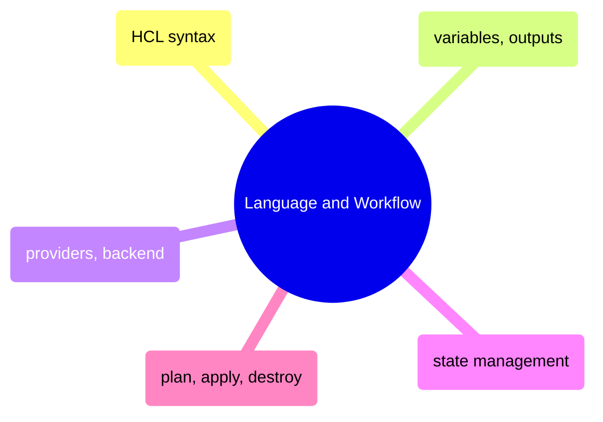
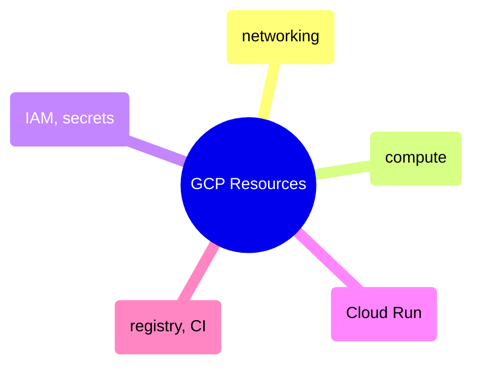
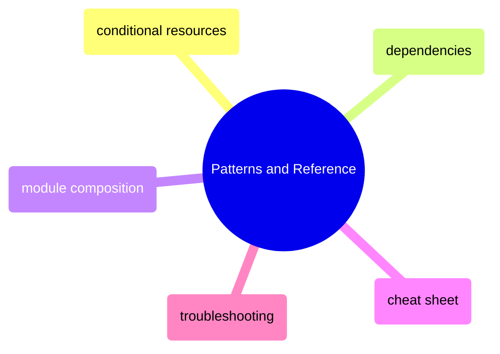
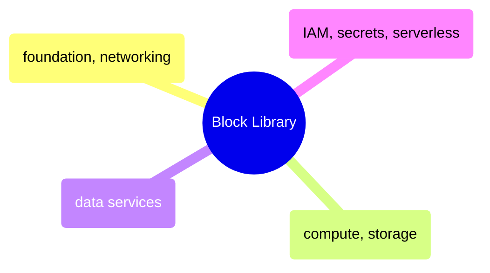

# MOC: Terraform

Infrastructure as code from HCL syntax to production GCP provisioning —
19 pages covering language fundamentals, resource configuration, composition
patterns, and a copy-paste block library. Expand any section to browse contents.

> [!example]- Language and Workflow
>
> > [!abstract]- [[hcl-syntax-basics]]
> >
> > - [[hcl-syntax-basics#Blocks and Arguments|Blocks and arguments]]
> > - [[hcl-syntax-basics#File Naming and Organization|File naming and organization]]
> > - [[hcl-syntax-basics#Terraform Name vs GCP Name|Terraform name vs GCP name]]
> > - [[hcl-syntax-basics#Block Types|Block types]]
> > - [[hcl-syntax-basics#Declarative vs Imperative|Declarative vs imperative]]
>
> > [!abstract]- [[terraform-variables-and-outputs]]
> >
> > - [[terraform-variables-and-outputs#Input Variables — variables.tf|Input variables]]
> > - [[terraform-variables-and-outputs#Setting Variable Values|Setting variable values]]
> > - [[terraform-variables-and-outputs#Locals — Computed Values|Locals and computed values]]
> > - [[terraform-variables-and-outputs#Output Values — outputs.tf|Output values]]
> > - [[terraform-variables-and-outputs#Querying Outputs|Querying outputs]]
>
> > [!abstract]- [[terraform-providers-and-backend]]
> >
> > - [[terraform-providers-and-backend#Provider and Backend Configuration|Provider and backend configuration]]
> > - [[terraform-providers-and-backend#Why Remote State?|Why remote state]]
> > - [[terraform-providers-and-backend#The `required_providers` Block|Required providers block]]
>
> > [!abstract]- [[terraform-state-management]]
> >
> > - [[terraform-state-management#What Is the State File?|What is the state file]]
> > - [[terraform-state-management#Remote State in GCS|Remote state in GCS]]
> > - [[terraform-state-management#State Locking|State locking]]
> > - [[terraform-state-management#Inspecting State|Inspecting state]]
> > - [[terraform-state-management#Moving Resources in State|Moving resources in state]]
> > - [[terraform-state-management#State Security|State security]]
>
> > [!abstract]- [[terraform-plan-apply-destroy]]
> >
> > - [[terraform-plan-apply-destroy#How terraform apply Works|How apply works]]
> > - [[terraform-plan-apply-destroy#Core Commands|Core commands]]
> > - [[terraform-plan-apply-destroy#Importing Existing Resources|Importing existing resources]]
> > - [[terraform-plan-apply-destroy#Common Issues and Fixes|Common issues and fixes]]

> [!example]- GCP Resources
>
> > [!abstract]- [[terraform-networking]]
> >
> > - [[terraform-networking#Networking Concepts|Networking concepts]]
> > - [[terraform-networking#Architecture Overview|Architecture overview]]
> > - [[terraform-networking#Resource: VPC Network|VPC network]]
> > - [[terraform-networking#Resource: Cloud NAT|Cloud NAT]]
> > - [[terraform-networking#Firewall Rules|Firewall rules]]
>
> > [!abstract]- [[terraform-compute]]
> >
> > - [[terraform-compute#Architecture Context|Architecture context]]
> > - [[terraform-compute#Resource: Airflow VM|Airflow VM]]
> > - [[terraform-compute#Boot Disk — Container-Optimized OS|Boot disk and Container-Optimized OS]]
> > - [[terraform-compute#Resource: SQL Server VM|SQL Server VM]]
> > - [[terraform-compute#Allow Stopping for Update|Allow stopping for update]]
>
> > [!abstract]- [[terraform-iam-and-secrets]]
> >
> > - [[terraform-iam-and-secrets#Core Service Accounts|Core service accounts]]
> > - [[terraform-iam-and-secrets#IAM Bindings|IAM bindings]]
> > - [[terraform-iam-and-secrets#Secret Manager — secrets.tf|Secret Manager]]
> > - [[terraform-iam-and-secrets#Conditional Datadog Resources|Conditional Datadog resources]]
> > - [[terraform-iam-and-secrets#CI/CD Service Account — ci.tf|CI service account]]
>
> > [!abstract]- [[terraform-cloud-run]]
> >
> > - [[terraform-cloud-run#Resource: Dashboard Service|Dashboard service]]
> > - [[terraform-cloud-run#VPC Access — Direct Egress|VPC access and direct egress]]
> > - [[terraform-cloud-run#Resource: Pipeline Job|Pipeline job]]
> > - [[terraform-cloud-run#Service vs Job Comparison|Service vs job comparison]]
> > - [[terraform-cloud-run#Double-Nested Template|Double-nested template]]
>
> > [!abstract]- [[terraform-registry-and-ci]]
> >
> > - [[terraform-registry-and-ci#Artifact Registry — registry.tf|Artifact Registry]]
> > - [[terraform-registry-and-ci#Cleanup Policies|Cleanup policies]]
> > - [[terraform-registry-and-ci#CI/CD Service Account — ci.tf|CI service account]]
> > - [[terraform-registry-and-ci#GitHub Actions Workflow Integration|GitHub Actions integration]]

> [!example]- Patterns and Reference
>
> > [!abstract]- [[terraform-conditional-resources]]
> >
> > - [[terraform-conditional-resources#count — Conditional Creation|Count conditional creation]]
> > - [[terraform-conditional-resources#for_each — Multiple Instances from a Collection|for_each multiple instances]]
> > - [[terraform-conditional-resources#Dynamic Blocks|Dynamic blocks]]
> > - [[terraform-conditional-resources#Ternary Operator Patterns|Ternary operator patterns]]
> > - [[terraform-conditional-resources#Referencing Conditional Resources|Referencing conditional resources]]
>
> > [!abstract]- [[terraform-resource-dependencies]]
> >
> > - [[terraform-resource-dependencies#How the Dependency Graph Works|How the dependency graph works]]
> > - [[terraform-resource-dependencies#Implicit Dependencies — Resource References|Implicit dependencies]]
> > - [[terraform-resource-dependencies#Traversing Nested Attributes|Traversing nested attributes]]
> > - [[terraform-resource-dependencies#Explicit Dependencies — depends_on|Explicit dependencies]]
> > - [[terraform-resource-dependencies#Circular Dependencies|Circular dependencies]]
>
> > [!abstract]- [[terraform-module-composition]]
> >
> > - [[terraform-module-composition#Module Basics|Module basics]]
> > - [[terraform-module-composition#Module Directory Structure|Module directory structure]]
> > - [[terraform-module-composition#Multi-Environment with Modules|Multi-environment with modules]]
> > - [[terraform-module-composition#Environment Promotion Pattern|Environment promotion pattern]]
> > - [[terraform-module-composition#When to Extract a Module|When to extract a module]]
>
> > [!abstract]- [[terraform-cheat-sheet]]
> >
> > - [[terraform-cheat-sheet#Core Workflow|Core workflow commands]]
> > - [[terraform-cheat-sheet#State Commands|State commands]]
> > - [[terraform-cheat-sheet#Resource Targeting|Resource targeting]]
> > - [[terraform-cheat-sheet#HCL Functions Reference|HCL functions reference]]
> > - [[terraform-cheat-sheet#Common Patterns|Common patterns]]
>
> > [!abstract]- [[terraform-problems]]
> >
> > - [[terraform-problems#Critical — Infrastructure Destruction / Data Loss|Critical problems]]
> > - [[terraform-problems#High — Infrastructure Drift / Team Blocking|High severity drift and blocking]]
> > - [[terraform-problems#Moderate — Operational Pain|Moderate operational pain]]
> > - [[terraform-problems#Low — Annoyances / Team Friction|Low severity annoyances]]

> [!example]- Block Library
>
> > [!abstract]- [[tf-foundation-and-networking]]
> >
> > - [[tf-foundation-and-networking#Foundation Blocks|Foundation blocks]]
> > - [[tf-foundation-and-networking#Networking Blocks|Networking blocks]]
> > - [[tf-foundation-and-networking#Firewall Rules|Firewall rules]]
> > - [[tf-foundation-and-networking#VPC Peering|VPC peering]]
> > - [[tf-foundation-and-networking#Private Service Connect|Private Service Connect]]
>
> > [!abstract]- [[tf-compute-and-storage]]
> >
> > - [[tf-compute-and-storage#Compute Engine Blocks|Compute Engine blocks]]
> > - [[tf-compute-and-storage#Disk Management|Disk management]]
> > - [[tf-compute-and-storage#Cloud Storage Blocks|Cloud Storage blocks]]
> > - [[tf-compute-and-storage#Bucket IAM — Grant Access to Members|Bucket IAM]]
> > - [[tf-compute-and-storage#Bucket Notification — Trigger Pub/Sub on Object Finalize|Bucket notifications]]
>
> > [!abstract]- [[tf-data-services]]
> >
> > - [[tf-data-services#BigQuery Blocks|BigQuery blocks]]
> > - [[tf-data-services#Firestore Blocks|Firestore blocks]]
> > - [[tf-data-services#Dataflow Blocks|Dataflow blocks]]
> > - [[tf-data-services#Cloud SQL Blocks|Cloud SQL blocks]]
> > - [[tf-data-services#Monitoring and Logging Blocks|Monitoring and logging blocks]]
>
> > [!abstract]- [[tf-iam-secrets-serverless]]
> >
> > - [[tf-iam-secrets-serverless#IAM Blocks|IAM blocks]]
> > - [[tf-iam-secrets-serverless#Secret Manager Blocks|Secret Manager blocks]]
> > - [[tf-iam-secrets-serverless#Cloud Run Blocks|Cloud Run blocks]]
> > - [[tf-iam-secrets-serverless#Cloud Functions Blocks|Cloud Functions blocks]]
> > - [[tf-iam-secrets-serverless#Pub/Sub Blocks|Pub/Sub blocks]]
> > - [[tf-iam-secrets-serverless#Artifact Registry Blocks|Artifact Registry blocks]]

## Cross-References

- [[moc-gcp|GCP]] — The GCP services these Terraform configs provision
- [[moc-github-actions|GitHub Actions]] — CI/CD pipelines that run terraform plan/apply
- [[moc-data-architecture|Data Architecture]] — Architecture decisions that drive infrastructure choices
