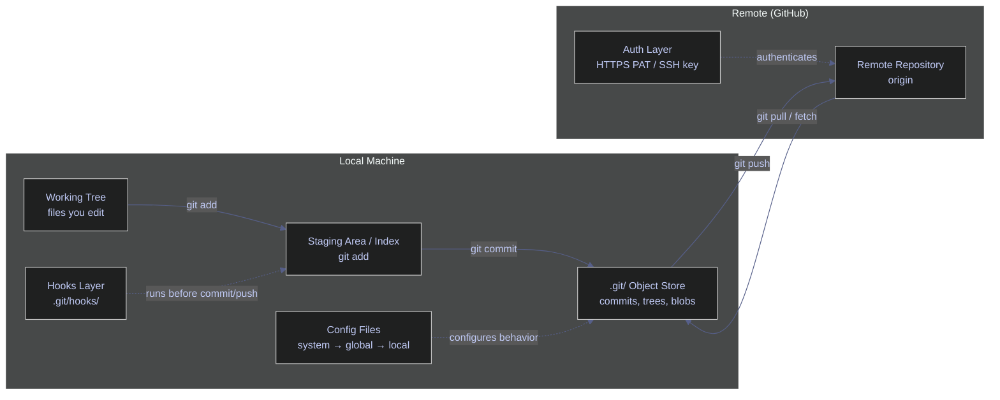
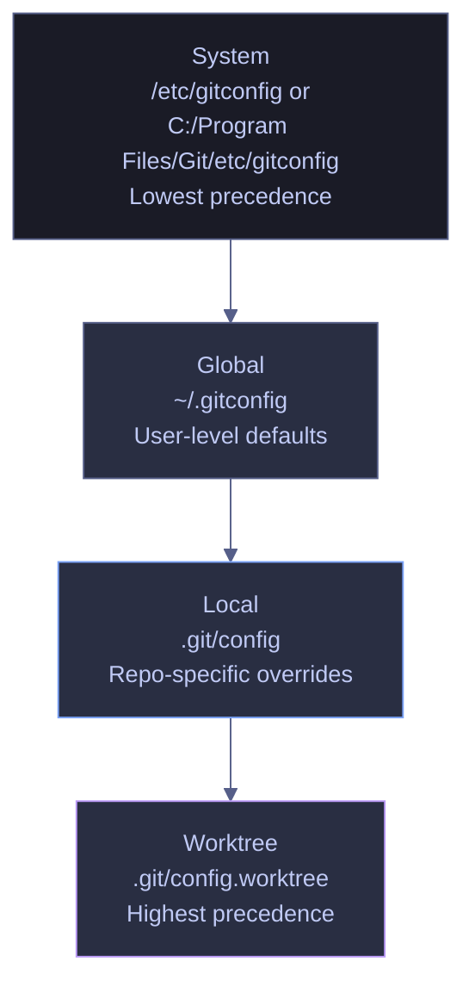

# Git Setup and Configuration

> [!quote]+
>
> "Git proved I could be more than a one-hit wonder."
>
> — **Linus Torvalds**, TED interview (2016)

> [!abstract]- Summary
>
> Explains how to turn a new machine or repository into a production-ready Git environment by covering installation, identity, authentication, config precedence, line-ending policy, repository bootstrap, and pre-commit quality gates.
>
> **Mental model and installation**
> - Relates the working tree, staging area, object store, config files, hooks, remotes, and auth flow before covering Git installation on Windows, macOS, Linux, and WSL
> - Verifies the active Git binary and highlights why Windows Git and WSL Git behave as separate environments with separate configs and credentials
>
> **Identity, authentication, and credentials**
> - Configures `user.name` and `user.email`, compares HTTPS PAT versus SSH key workflows, and sets credential helpers for GitHub, enterprise SSO, and cross-platform use
> - Distinguishes global, local, and system settings so personal and work identities do not bleed across repositories
>
> **Configuration and normalization**
> - Explains config-scope precedence, recommended global defaults, editor and pager settings, line-ending normalization, and `.gitattributes` policy for mixed-OS teams
> - Covers cross-platform file behavior, executable bits, case sensitivity, and other defaults that create noisy diffs or subtle collaboration bugs
>
> **Repository bootstrap and safeguards**
> - Creates or clones repositories, sets the default branch, adds remotes, and prepares pre-commit hooks as automated quality gates for secrets, linting, and formatting
> - Extends the setup to data-engineering teams, enterprise environments, large repositories, and new-machine onboarding checklists
>
> **Operations and safety**
> - Warnings: mismatched config scope, PAT or SSH misconfiguration, WSL/Windows separation, line-ending drift, and large-binary handling that should move to Git LFS
> - Recommendations: prefer shared normalization in `.gitattributes`, use credential helpers instead of embedding secrets, validate install and auth end to end, and separate work vs personal identity deliberately
> - Troubleshooting: setup cookbook plus final validation for install-path, auth, scope, line-ending, and clone/bootstrap failures

> [!note]- Glossary
>
> **Git**
> - A distributed version control system that records file changes as snapshots (commits) in a local repository, with optional synchronization to remote servers. In plain terms, software that remembers every change ever made to your files and lets teams collaborate on the same project.
> - Every command in this chapter operates through Git.
>
> > [!info] Operational nuance
> >
> > Treat this as a concrete Git object, state, or workflow term rather than as a loose synonym. The commands in the note behave differently depending on this exact meaning.
>
> ---
>
> **Version control**
> - A system that records changes to files over time so you can recall any version later. In plain terms, an undo history for your entire project that never expires.
> - Without it, overwritten work is lost permanently.
>
> > [!info] Operational nuance
> >
> > Treat this as a concrete Git object, state, or workflow term rather than as a loose synonym. The commands in the note behave differently depending on this exact meaning.
>
> ---
>
> **Repository (repo)**
> - A directory tracked by Git, containing the working tree and a hidden `.git/` folder that stores the complete history, configuration, and object database. In plain terms, a project folder with a complete memory of every change ever made.
> - Every Git operation targets a repository.
>
> > [!info] Policy layer
> >
> > This term usually belongs to shared repository policy or machine defaults. Fixing it locally can hide the real team-wide setting if you do not check the whole policy chain.
>
> ---
>
> **Working tree / working directory**
> - The actual files on disk that you edit, outside the `.git/` directory. In plain terms, what you see in your file explorer or VS Code.
> - Changes here are not recorded until staged and committed.
>
> > [!info] Operational nuance
> >
> > Treat this as a concrete Git object, state, or workflow term rather than as a loose synonym. The commands in the note behave differently depending on this exact meaning.
>
> ---
>
> **Staging area / index**
> - A buffer between the working tree and the next commit. Files are added here with `git add` before they become part of a commit. In plain terms, a prep table — you choose exactly which changes go into the next snapshot.
> - Gives fine-grained control over what each commit includes.
>
> > [!info] Operational nuance
> >
> > Treat this as a concrete Git object, state, or workflow term rather than as a loose synonym. The commands in the note behave differently depending on this exact meaning.
>
> ---
>
> **Commit**
> - An immutable snapshot of all tracked files at a point in time, identified by a unique SHA-1 hash. Contains the tree, parent pointer(s), author, committer, timestamp, and message. In plain terms, a save point in a game — you can always go back to any previous save.
> - The fundamental unit of history in Git.
>
> > [!warning] Pointer semantics matter
> >
> > Git stores this as reference state rather than as a second copy of files. Many confusing behaviors come from moving refs while file contents stay the same.
>
> ---
>
> **Branch**
> - A lightweight, movable pointer to a commit. The default branch is typically `main`. Branches let you work on features or fixes without affecting the mainline. In plain terms, a parallel universe where you can experiment freely. If it works, you merge it back.
> - Enables concurrent work and isolation of changes.
>
> > [!warning] Pointer semantics matter
> >
> > Git stores this as reference state rather than as a second copy of files. Many confusing behaviors come from moving refs while file contents stay the same.
>
> ---
>
> **Default branch**
> - The branch Git creates when you initialize a repository (`main` by convention, `master` historically). The branch that pull requests typically target. In plain terms, the "production" line of your project.
> - Mismatching default branch names between local and remote causes confusion.
>
> > [!warning] Pointer semantics matter
> >
> > Git stores this as reference state rather than as a second copy of files. Many confusing behaviors come from moving refs while file contents stay the same.
>
> ---
>
> **Remote**
> - A copy of the repository hosted on a server (GitHub, GitLab, Bitbucket). The default remote is named `origin`. In plain terms, the shared copy on GitHub that everyone syncs with.
> - Enables collaboration — `push` sends commits to the remote, `pull` brings them down.
>
> > [!warning] Pointer semantics matter
> >
> > Git stores this as reference state rather than as a second copy of files. Many confusing behaviors come from moving refs while file contents stay the same.
>
> ---
>
> **`origin`**
> - The conventional name for the default remote repository, automatically set by `git clone`. In plain terms, the "home server" your local repo syncs with.
> - Almost every push/pull command targets `origin` by default.
>
> > [!warning] Pointer semantics matter
> >
> > Git stores this as reference state rather than as a second copy of files. Many confusing behaviors come from moving refs while file contents stay the same.
>
> ---
>
> **Tracking branch**
> - A local branch that has an upstream relationship with a remote branch (e.g., `main` tracks `origin/main`). In plain terms, your local branch "knows" which remote branch it corresponds to.
> - Enables `git pull` and `git push` without specifying the remote and branch every time.
>
> > [!warning] Pointer semantics matter
> >
> > Git stores this as reference state rather than as a second copy of files. Many confusing behaviors come from moving refs while file contents stay the same.
>
> ---
>
> **`HEAD`**
> - A pointer to the current commit you are working on. Usually points to the tip of the current branch. In detached HEAD state, it points directly to a commit. In plain terms, your "you are here" marker on the timeline.
> - Determines what you see in your working tree and what the next commit builds on.
>
> > [!warning] Pointer semantics matter
> >
> > Git stores this as reference state rather than as a second copy of files. Many confusing behaviors come from moving refs while file contents stay the same.
>
> ---
>
> **SHA / hash**
> - A 40-character hexadecimal string (often abbreviated to 7–8 characters) computed from the commit contents. Uniquely identifies a commit. In plain terms, a fingerprint for a commit — no two commits have the same one.
> - Used to reference specific commits in `checkout`, `revert`, `cherry-pick`, and log inspection.
>
> > [!info] Operational nuance
> >
> > Treat this as a concrete Git object, state, or workflow term rather than as a loose synonym. The commands in the note behave differently depending on this exact meaning.
>
> ---
>
> **Clone**
> - The operation of downloading a complete copy of a remote repository (all branches, tags, full history) to your local machine. In plain terms, downloading the entire project with its full memory.
> - The standard way to start working on an existing project.
>
> > [!warning] Pointer semantics matter
> >
> > Git stores this as reference state rather than as a second copy of files. Many confusing behaviors come from moving refs while file contents stay the same.
>
> ---
>
> **Init**
> - The operation of creating a new Git repository from scratch in an existing directory by generating the `.git/` subdirectory. In plain terms, turning a regular folder into a Git-tracked project.
> - Used when starting a brand-new project that has no remote yet.
>
> > [!info] Operational nuance
> >
> > Treat this as a concrete Git object, state, or workflow term rather than as a loose synonym. The commands in the note behave differently depending on this exact meaning.
>
> ---
>
> **Fork**
> - A server-side copy of someone else's repository under your own GitHub account. Not a Git-native concept — it is a GitHub/GitLab feature. In plain terms, making your own copy of someone else's project to experiment with independently.
> - Standard workflow for open-source contributions.
>
> > [!info] Operational nuance
> >
> > Treat this as a concrete Git object, state, or workflow term rather than as a loose synonym. The commands in the note behave differently depending on this exact meaning.
>
> ---
>
> **Pull request (PR)**
> - A request to merge one branch into another, with a code review interface. Called "merge request" (MR) on GitLab. In plain terms, raising your hand and saying "I've finished this work, please review and merge it."
> - The primary mechanism for code review and controlled merging in teams.
>
> > [!warning] Pointer semantics matter
> >
> > Git stores this as reference state rather than as a second copy of files. Many confusing behaviors come from moving refs while file contents stay the same.
>
> ---
>
> **Config scope**
> - The level at which a Git configuration value is stored: system, global, local, or worktree. More specific scopes override broader ones. In plain terms, whether a setting applies to the entire machine, your user account, one repo, or one worktree.
> - Misconfigured scope causes identity mismatches, wrong credentials, or unexpected behavior.
>
> > [!info] Policy layer
> >
> > This term usually belongs to shared repository policy or machine defaults. Fixing it locally can hide the real team-wide setting if you do not check the whole policy chain.
>
> ---
>
> **Global config**
> - Configuration stored in `~/.gitconfig` (or `$XDG_CONFIG_HOME/git/config`). Applies to all repositories for the current OS user. In plain terms, your personal default settings across all projects.
> - Identity, editor, credential helper, and aliases typically live here.
>
> > [!info] Policy layer
> >
> > This term usually belongs to shared repository policy or machine defaults. Fixing it locally can hide the real team-wide setting if you do not check the whole policy chain.
>
> ---
>
> **Local config**
> - Configuration stored in `.git/config` inside a specific repository. Overrides global and system values for that repo only. In plain terms, settings specific to one project (e.g., a work email different from your personal email).
> - Essential for multi-identity setups (personal vs. work).
>
> > [!info] Policy layer
> >
> > This term usually belongs to shared repository policy or machine defaults. Fixing it locally can hide the real team-wide setting if you do not check the whole policy chain.
>
> ---
>
> **System config**
> - Configuration stored in the Git installation directory (e.g., `C:/Program Files/Git/etc/gitconfig`). Applies to every user on the machine. Lowest precedence. In plain terms, machine-wide defaults set by the IT department or installer.
> - Rarely edited manually; useful for corporate standardization.
>
> > [!info] Policy layer
> >
> > This term usually belongs to shared repository policy or machine defaults. Fixing it locally can hide the real team-wide setting if you do not check the whole policy chain.
>
> ---
>
> **Credential helper**
> - A Git subsystem that stores and retrieves authentication credentials so you are not prompted on every remote operation. In plain terms, a password manager for Git.
> - Without one, Git prompts for your username and password on every `push`, `pull`, and `fetch`.
>
> > [!danger] Security boundary
> >
> > This term touches authentication, identity, or trust. Treat it as secret or policy material rather than as ordinary repository metadata.
>
> ---
>
> **PAT (Personal Access Token)**
> - A token generated on GitHub (Settings → Developer settings → Tokens) that replaces passwords for HTTPS authentication. Has configurable scopes and expiry. In plain terms, a password with an expiry date and limited powers.
> - GitHub no longer accepts account passwords for Git operations over HTTPS — PATs are required.
>
> > [!danger] Security boundary
> >
> > This term touches authentication, identity, or trust. Treat it as secret or policy material rather than as ordinary repository metadata.
>
> ---
>
> **SSH key**
> - A cryptographic key pair (public + private) used for passwordless authentication. The public key is uploaded to GitHub; the private key stays on your machine. In plain terms, a digital passport — GitHub recognizes your machine without needing a password.
> - Preferred by many engineers for convenience; required when HTTPS is impractical.
>
> > [!danger] Security boundary
> >
> > This term touches authentication, identity, or trust. Treat it as secret or policy material rather than as ordinary repository metadata.
>
> ---
>
> **Git hook**
> - A script stored in `.git/hooks/` that Git executes automatically at specific lifecycle events (pre-commit, pre-push, post-merge, etc.). In plain terms, an automated quality gate — runs checks before you can commit or push.
> - Catches secrets, lint errors, and formatting issues before they reach the repository.
>
> > [!info] Policy layer
> >
> > This term usually belongs to shared repository policy or machine defaults. Fixing it locally can hide the real team-wide setting if you do not check the whole policy chain.
>
> ---
>
> **Pre-commit hook**
> - A hook that runs before a commit is created. If it exits with a non-zero status, the commit is aborted. In plain terms, a bouncer at the door — your commit only goes through if the checks pass.
> - The most commonly used hook; the `pre-commit` framework manages these declaratively.
>
> > [!info] Policy layer
> >
> > This term usually belongs to shared repository policy or machine defaults. Fixing it locally can hide the real team-wide setting if you do not check the whole policy chain.
>
> ---
>
> **`.gitignore`**
> - A file listing patterns of files and directories that Git should not track. Supports glob syntax. In plain terms, a "do not touch" list for Git.
> - Prevents secrets, build artifacts, virtual environments, and large generated files from entering the repository.
>
> > [!danger] Security boundary
> >
> > This term touches authentication, identity, or trust. Treat it as secret or policy material rather than as ordinary repository metadata.
>
> ---
>
> **`.gitattributes`**
> - A file that defines per-path attributes — most importantly, line-ending normalization rules. Checked into the repository and shared with all collaborators. In plain terms, a team-wide policy file for how Git handles specific file types.
> - The canonical solution for mixed-OS line-ending issues (safer than `core.autocrlf` alone).
>
> > [!danger] Security boundary
> >
> > This term touches authentication, identity, or trust. Treat it as secret or policy material rather than as ordinary repository metadata.
>
> ---
>
> **Line endings (LF / CRLF)**
> - LF (`\n`) is the Unix/macOS line terminator. CRLF (`\r\n`) is the Windows line terminator. Mismatch between contributors causes noisy diffs that touch every line. In plain terms, different operating systems use different invisible characters to mark the end of a line.
> - A misconfigured team produces diffs that show every line as changed even when only one word was edited.
>
> > [!info] Policy layer
> >
> > This term usually belongs to shared repository policy or machine defaults. Fixing it locally can hide the real team-wide setting if you do not check the whole policy chain.
>
> ---
>
> **Commit signing**
> - Cryptographic signature embedded in a commit or tag, proving the author's identity. Git supports GPG and SSH signing backends. In plain terms, a tamper-proof seal that says "this commit really came from me."
> - Many production teams require signed commits. GitHub shows a green "Verified" badge on signed commits.
>
> > [!info] Operational nuance
> >
> > Treat this as a concrete Git object, state, or workflow term rather than as a loose synonym. The commands in the note behave differently depending on this exact meaning.
>
> ---
>
> **Git LFS (Large File Storage)**
> - An extension that replaces large files with lightweight pointer files in the repository, storing actual contents on a separate LFS server. In plain terms, a delivery service for big files — Git tracks a receipt, the actual parcel lives elsewhere.
> - Without LFS, large binaries bloat the repository and make clones slow for everyone forever.
>
> > [!warning] Pointer semantics matter
> >
> > Git stores this as reference state rather than as a second copy of files. Many confusing behaviors come from moving refs while file contents stay the same.
>
> ---
>
> **Partial clone**
> - A clone that downloads only commit and tree objects, fetching file contents (blobs) on demand as they are checked out. Enabled with `--filter=blob:none`. In plain terms, downloading the table of contents without the full book — pages are fetched as you read them.
> - Drastically reduces initial clone time and disk usage for large repositories.
>
> > [!info] Scale and workflow tradeoff
> >
> > This feature improves developer ergonomics or repository scale, but it adds assumptions that automation and teammates also need to understand.
>
> ---
>
> **Sparse checkout**
> - A mode that limits which directories appear in the working tree. Files outside the sparse set are not checked out (and with partial clone, not downloaded). In plain terms, checking out only the chapters you need from a large book.
> - Essential for monorepo workflows where each engineer only needs a subset of the codebase.
>
> > [!info] Scale and workflow tradeoff
> >
> > This feature improves developer ergonomics or repository scale, but it adds assumptions that automation and teammates also need to understand.


## Mental Model — How Git's Layers Connect

Before running any commands, understand how the pieces fit together. The diagram below shows the relationship between the files you edit, the local Git machinery, the remote server, and the configuration and hook layers that govern behavior.



**Reading the diagram:**

- **Working tree** — the files on disk you edit with your IDE or text editor.
- **Staging area (index)** — `git add` moves changes here. Only staged changes become part of the next commit.
- **`.git/` object store** — `git commit` creates an immutable snapshot and stores it here. This is the local history.
- **Config files** — three scopes (system, global, local) control Git's behavior. The most specific scope wins.
- **Hooks layer** — scripts in `.git/hooks/` run automatically at lifecycle events (before commit, before push, etc.).
- **Remote repository** — the shared copy on GitHub. `git push` sends commits up; `git pull` / `git fetch` brings them down.
- **Auth layer** — HTTPS with PAT or SSH key authenticates your identity to the remote.

---

## Installing Git

Git must be installed before any other step. The installation method depends on your operating system.

### Windows | Git | install on Windows

#### Install Git for Windows

On a new Windows machine or after a fresh OS install. It is typically triggered by `git --version` returns "command not found" or the version is below 2.39. Requires administrator privileges for the default installer. No restart needed. Install the Git CLI, Git Bash shell, and optional GUI tools.

Download the installer from [git-scm.com/downloads/win](https://git-scm.com/downloads/win) and run it. Alternatively, use `winget` from a PowerShell terminal:

*Install Git via winget (Windows Package Manager):*

```powershell
winget install --id Git.Git -e --source winget
```

> [!tip] Installer options to pay attention to
>
> - **Default editor:** choose VS Code or your preferred editor (the default is Vim).
> - **PATH environment:** select "Git from the command line and also from 3rd-party software" to make `git` available in PowerShell, CMD, and Git Bash.
> - **Line ending conversions:** the installer defaults to `core.autocrlf=true` (convert LF→CRLF on checkout, CRLF→LF on commit). This is correct for most Windows users on mixed-OS teams.
> - **Credential helper:** select "Git Credential Manager" (the default since Git 2.39+).

### macOS | Git | install on macOS

#### Install Git on macOS

On a new Mac or after a major OS upgrade. It is typically triggered by `git --version` returns the Apple-bundled version (often outdated) or "command not found.". No admin required for Homebrew install. Xcode Command Line Tools also provide a Git binary. Install a current Git version with full feature support.

macOS ships a Git binary as part of Xcode Command Line Tools, but it is often outdated. Install a current version via Homebrew:

*Install Git via Homebrew:*

```bash
brew install git
```

After installation, verify the Homebrew version is first on `$PATH`:

*Verify the active Git binary location:*

```bash
which git
```

```text
/opt/homebrew/bin/git
```

If the output shows `/usr/bin/git`, the Xcode version is still taking precedence. Add Homebrew to your `$PATH` in `~/.zshrc`.

### Linux | Git | install on Linux

#### Install Git on Linux

On a new Linux machine, container, or VM. It is typically triggered by `git --version` returns "command not found.". Requires `sudo` for package manager installation. Install the Git CLI.

*Install Git on Debian/Ubuntu:*

```bash
sudo apt-get update && sudo apt-get install -y git
```

*Install Git on Fedora/RHEL:*

```bash
sudo dnf install -y git
```

*Install Git on Alpine (common in Docker images):*

```bash
apk add --no-cache git
```

### Windows | WSL | Git in WSL

#### Install Git in WSL

When using Windows Subsystem for Linux for development. It is typically triggered by `git --version` inside the WSL distribution returns "command not found" or an outdated version. WSL has its own filesystem and its own Git installation, separate from Git for Windows. Credentials, config, and hooks are independent. Install Git inside the Linux distribution running under WSL.

WSL distributions are standard Linux — use the `apt` or `dnf` commands above. Note that **Git for Windows and WSL Git are separate installations** with separate configurations. Setting `user.email` in Git for Windows does not affect WSL, and vice versa.

> [!warning] WSL and Windows Git are independent
>
> - `~/.gitconfig` inside WSL is a different file from `C:\Users\<you>\.gitconfig` on the Windows side.
> - SSH keys in `~/.ssh/` inside WSL are not visible to Git for Windows, and vice versa.
> - Credential helpers configured in Git for Windows do not apply inside WSL.
> - If you work in both environments, configure both independently.

> [!success] Share credentials between Windows and WSL
>
> Inside WSL, configure Git to delegate credential storage to the Windows Credential Manager:
> `git config --global credential.helper "/mnt/c/Program\ Files/Git/mingw64/bin/git-credential-manager.exe"`

### Git | verify installation

#### Verify Git installation

After installing, verify the version from a terminal:

*Check the installed Git version:*

```bash
git --version
```

```text
git version 2.53.0.windows.1
```

If the command is not found, the installation did not add Git to your `PATH`. On Windows, restart your terminal or run the installer again and ensure the PATH option is selected.

---

## Identity Configuration

Git embeds an author name and email in every commit object. These values are mandatory — Git refuses to create a commit without them. The email address also determines whether GitHub attributes the commit to your profile on the contribution graph.

### Git | config | set user identity

#### Set the global author name

Once on each new machine, before the first commit. It is typically triggered by first-time Git setup or `git config --get user.name` returns empty. `--global` writes to `~/.gitconfig`. Applies to all repos for the current user. Does not require admin. Set the display name that appears in `git log` output and GitHub commit attribution.

*Set the author name for all repositories on this machine:*

```bash
git config --global user.name "alp78"
```

#### Set the global author email

Immediately after setting `user.name`. It is typically triggered by `git config --get user.email` returns empty or the wrong address. The email must match a verified email on your GitHub account for commits to be attributed to your profile. Set the email that appears in every commit and links your work to your GitHub identity.

*Set the author email for all repositories:*

```bash
git config --global user.email "alexper.recovery@gmail.com"
```

> [!warning] Email must match your GitHub account
>
> If `user.email` does not match a verified email on your GitHub account, commits will appear as "unrecognized" — they will not count toward your contribution graph and will not link to your profile avatar.

> [!success] Find your verified email on GitHub
>
> Go to **GitHub → Settings → Emails** to see your verified addresses. Use that exact value. If you prefer to keep your email private, use the GitHub noreply address: `<id>+<username>@users.noreply.github.com` (visible on the same settings page).

#### Use the GitHub noreply email for privacy

When you want commits attributed to your GitHub profile without exposing your real email. It is typically triggered by privacy policy, personal preference, or corporate guidance. GitHub generates a unique noreply address for every account. Find it at GitHub → Settings → Emails → "Keep my email addresses private.". Prevent your real email from appearing in public commit history while maintaining contribution attribution.

*Set the noreply email as your global author email:*

```bash
git config --global user.email "12345678+alp78@users.noreply.github.com"
```

> [!tip] Enable the email privacy setting on GitHub
>
> On GitHub → Settings → Emails, check **"Keep my email addresses private"** and **"Block command line pushes that expose my email."** The second option rejects pushes that use a non-noreply email, preventing accidental exposure.

#### Use a different identity for a specific repository

When you contribute to a repository that requires a different email (e.g., work vs. personal). It is typically triggered by the repo belongs to a different organization or requires a different identity. `--local` writes to `.git/config` inside the repository. Overrides `--global` for this repo only. Ensure commits in this repo use the correct identity without changing the global default.

*Set a repo-specific email (local scope):*

```bash
git config --local user.email "alex@stockindex.example.com"
```

*Verify the effective email in this repo:*

```bash
git config --get user.email
```

```text
alex@stockindex.example.com
```

*Verify both scopes are visible:*

```bash
git config --list --show-scope | grep user.email
```

```text
global	user.email=alexper.recovery@gmail.com
local	user.email=alex@stockindex.example.com
```

The local value takes precedence. Remove it to revert to the global default:

*Remove the local override:*

```bash
git config --local --unset user.email
```

> [!tip] Conditional includes for automatic identity switching
>
> Instead of setting `--local` in every repo, use `includeIf` in `~/.gitconfig` to automatically apply a different identity based on the repo's filesystem path:
>
> ```ini
> # ~/.gitconfig
> [includeIf "gitdir:~/work/"]
>     path = ~/.gitconfig-work
>
> # ~/.gitconfig-work
> [user]
>     email = alex@stockindex.example.com
>     name = Alex Perrier
> ```
>
> Any repository cloned under `~/work/` automatically uses the work identity. No per-repo `--local` configuration needed.

---

## Authentication

Git communicates with remote repositories (GitHub) over HTTPS or SSH. GitHub no longer accepts account passwords for Git operations — you must use a Personal Access Token (PAT) or SSH key.

### Git | Authentication | HTTPS with PAT

HTTPS is the default protocol when you clone with a `https://github.com/...` URL. Authentication requires a Personal Access Token (PAT) instead of your GitHub password.

#### Generate a Personal Access Token on GitHub

Before the first `git push` or `git clone` over HTTPS, or when an existing token expires. It is typically triggered by git prompts for a password or returns `Authentication failed`. Browser-based operation on GitHub.com. Tokens are scoped and have configurable expiry. Create a credential that Git can use to authenticate with GitHub over HTTPS.

> [!todo] Generate a PAT (classic)
>
> 1. Go to **GitHub → Settings → Developer settings → Personal access tokens → Tokens (classic)**.
> 2. Click **Generate new token (classic)**.
> 3. Set a descriptive note (e.g., `laptop-2026`).
> 4. Set an expiration (90 days is a reasonable balance between security and convenience).
> 5. Select scopes: at minimum `repo` (full repository access). Add `workflow` if you use GitHub Actions.
> 6. Click **Generate token** and **copy it immediately** — GitHub will not show it again.

> [!warning] PATs are secrets
>
> - Never commit a PAT to a repository, paste it in Slack, or store it in an unencrypted file.
> - If a PAT is compromised, revoke it immediately on GitHub → Settings → Developer settings → Tokens.
> - Set the shortest practical expiry. 90-day tokens are standard in most organizations.

> [!success] Store the PAT securely using a credential helper
>
> Configure Git to cache credentials in the OS secure keychain (see the Credential Helpers section below). After the first successful `git push`, the PAT is stored and you will not be prompted again until it expires.

#### Validate HTTPS authentication

After configuring the PAT and credential helper, to confirm everything works. It is typically triggered by initial setup or after a PAT rotation. Requires a valid PAT and network access to github.com. Confirm that Git can authenticate with GitHub over HTTPS.

*Test HTTPS authentication using the GitHub CLI:*

```bash
gh auth status
```

```text
github.com
  ✓ Logged in to github.com account alp78 (keyring)
  - Active account: true
  - Git operations protocol: https
  - Token: gho_************************************
  - Token scopes: 'delete_repo', 'gist', 'read:org', 'repo', 'workflow'
```

The `gh auth status` command confirms the active account, protocol, and token scopes. If using `gh` as the credential helper (recommended), this is the single source of truth for HTTPS authentication status.

### Git | Authentication | SSH keys

SSH authentication uses a cryptographic key pair. The private key stays on your machine; the public key is uploaded to GitHub. Once configured, Git operations over SSH (`git@github.com:...` URLs) authenticate silently.

#### Generate an SSH key pair

Once per machine, or when rotating keys. It is typically triggered by no SSH key exists yet, or `ssh -T git@github.com` returns "Permission denied.". Runs locally. The private key is stored in `~/.ssh/`. Requires no network access. Create a cryptographic identity for SSH authentication.

*Generate an Ed25519 SSH key pair:*

```bash
ssh-keygen -t ed25519 -C "alexper.recovery@gmail.com"
```

> [!info]- ssh-keygen flags breakdown
>
> - `-t ed25519` — key type. Ed25519 is shorter, faster, and more secure than RSA. Use `-t rsa -b 4096` only if your organization requires RSA.
> - `-C "email"` — a comment embedded in the public key for identification. Convention is to use your email.
> - The command prompts for a file path (default: `~/.ssh/id_ed25519`) and an optional passphrase. A passphrase adds a second factor — if the private key file is stolen, the passphrase is still required.

#### Add the public key to GitHub

After generating the key pair. It is typically triggered by `ssh -T git@github.com` returns "Permission denied (publickey).". Browser-based operation on GitHub.com, or via `gh ssh-key add`. Register your public key so GitHub recognizes your machine.

> [!todo] Add the SSH key to GitHub
>
> 1. Copy the public key: `cat ~/.ssh/id_ed25519.pub` and copy the entire output.
> 2. Go to **GitHub → Settings → SSH and GPG keys → New SSH key**.
> 3. Paste the public key. Set a title that identifies the machine (e.g., `work-laptop-2026`).
> 4. Click **Add SSH key**.
>
> Alternatively, use the GitHub CLI:
> ```bash
> gh ssh-key add ~/.ssh/id_ed25519.pub --title "work-laptop-2026"
> ```

#### Start the SSH agent and add your key

In every new terminal session where you need SSH authentication (or configure your shell profile to do it automatically). It is typically triggered by `ssh -T git@github.com` returns "Could not open a connection to your authentication agent.". The SSH agent caches your decrypted private key in memory so you do not have to type the passphrase repeatedly. Make the private key available for SSH operations without repeated passphrase prompts.

*Start the SSH agent and add your key (Linux/macOS):*

```bash
eval "$(ssh-agent -s)"
ssh-add ~/.ssh/id_ed25519
```

*Start the SSH agent on Windows (Git Bash):*

```bash
eval "$(ssh-agent -s)"
ssh-add ~/.ssh/id_ed25519
```

> [!tip] Persist the SSH agent across sessions
>
> - **macOS:** add `AddKeysToAgent yes` and `UseKeychain yes` to `~/.ssh/config`. The macOS Keychain stores the passphrase permanently.
> - **Linux:** add `eval "$(ssh-agent -s)"` and `ssh-add` to `~/.bashrc` or `~/.zshrc`.
> - **Windows (Git Bash):** add the same lines to `~/.bashrc`. Alternatively, enable the Windows OpenSSH Agent service via `Services.msc` → "OpenSSH Authentication Agent" → set to Automatic.

#### Test SSH connectivity to GitHub

After adding the public key to GitHub and starting the agent. It is typically triggered by first-time SSH setup or troubleshooting authentication failures. Requires network access to github.com on port 22. Some corporate networks block port 22. Verify that SSH authentication works end-to-end.

*Test SSH authentication with GitHub:*

```bash
ssh -T git@github.com
```

```text
Hi alp78! You've successfully authenticated, but GitHub does not provide shell access.
```

A success message confirms the key is recognized. If you see "Permission denied (publickey)," the key is not loaded in the agent or not added to GitHub.

> [!warning] Corporate networks may block SSH (port 22)
>
> If `ssh -T git@github.com` hangs or times out, your network may be blocking outbound SSH traffic. This is common on corporate networks with restrictive firewalls.

> [!success] Use SSH over HTTPS port 443 as a fallback
>
> Add this to `~/.ssh/config` to tunnel SSH through port 443:
>
> ```
> Host github.com
>     Hostname ssh.github.com
>     Port 443
>     User git
> ```
>
> Then test again: `ssh -T git@github.com`. This works on almost all networks that allow HTTPS traffic.

### Git | Authentication | comparison

| Method | Security | Convenience | Best For |
|---|---|---|---|
| **HTTPS + PAT** | Token scoped and time-limited. Stored in OS keychain via credential helper. | Works through all firewalls. No agent setup. | Default recommendation. Corporate environments. CI/CD. |
| **SSH key** | Strong cryptographic auth. Passphrase adds second factor. | Passwordless once agent is running. Requires port 22 (or 443 workaround). | Engineers who prefer key-based auth. Environments where PATs are impractical. |
| **`gh` CLI as credential helper** | Delegates to `gh auth login`. Token managed by `gh`. | Zero manual token management. `gh auth refresh` handles renewal. | Teams using the GitHub CLI. Simplest HTTPS setup. |
| **`credential.helper store`** | **Insecure.** Plaintext file at `~/.git-credentials`. | Zero dependencies. | **Never recommended.** Only for isolated, ephemeral environments. |

### Git | Authentication | commit signing

Many production teams require signed commits or signed tags to prove that commits genuinely come from the claimed author and have not been tampered with. GitHub shows a green "Verified" badge next to signed commits. Git supports two signing backends: GPG (the traditional method) and SSH (simpler, available since Git 2.34).

#### Sign commits with SSH key (recommended)

Once per machine, as part of identity setup. It is typically triggered by team policy requires signed commits, or you want the "Verified" badge on GitHub. Uses your existing SSH key — no GPG toolchain needed. Requires Git 2.34+. Cryptographically sign every commit with your SSH key.

*Configure SSH-based commit signing:*

```bash
git config --global gpg.format ssh
git config --global user.signingkey ~/.ssh/id_ed25519.pub
git config --global commit.gpgsign true
```

The three settings:

- `gpg.format ssh` — tells Git to use SSH instead of GPG for signing.
- `user.signingkey` — points to the **public** key file. Git uses the corresponding private key (loaded in the SSH agent) to create the signature.
- `commit.gpgsign true` — signs every commit automatically. Without this, you must pass `-S` on each `git commit`.

> [!info] Upload the signing key to GitHub
>
> The public key must be added to GitHub **as a signing key** (not just an authentication key):
>
> 1. Go to **GitHub → Settings → SSH and GPG keys → New SSH key**.
> 2. Set **Key type** to **Signing Key**.
> 3. Paste the contents of `~/.ssh/id_ed25519.pub`.
>
> You can use the same key for both authentication and signing, but it must be registered separately for each purpose.

#### Sign commits with GPG

When your team or organization requires GPG signing specifically (common in regulated industries). It is typically triggered by team policy mandates GPG-signed commits, or you need to sign tags with a GPG identity. Requires the GPG toolchain (`gpg` or `gpg2`) installed on the machine. More complex setup than SSH signing. Sign commits with a GPG key for organizations that require GPG-based verification.

*Configure GPG-based commit signing:*

```bash
gpg --list-secret-keys --keyid-format=long
```

Find your key ID from the output (the 16-character hex string after `sec   ed25519/`), then:

```bash
git config --global user.signingkey <KEY-ID>
git config --global commit.gpgsign true
```

> [!tip] GPG on Windows — configure the GPG program path
>
> Git for Windows may not find the GPG binary automatically. Set it explicitly:
>
> ```bash
> git config --global gpg.program "C:/Program Files (x86)/GnuPG/bin/gpg.exe"
> ```
>
> Adjust the path to match your GPG installation.

#### Sign tags

Tags can be signed independently of commits. Annotated tags with `-s` use the configured signing key:

*Create a signed annotated tag:*

```bash
git tag -s v1.0.0 -m "Release v1.0.0"
```

*Verify a signed tag:*

```bash
git tag -v v1.0.0
```

> [!question] SSH signing vs GPG signing
>
> - **SSH signing** (Git 2.34+) is simpler — reuses your existing SSH key, no GPG toolchain needed, easier to configure. Recommended for most teams.
> - **GPG signing** is the traditional method, required by some regulated organizations and open-source projects. More complex setup (key generation, keyring management, expiry handling).
> - Both produce the "Verified" badge on GitHub. Choose based on team policy.

| Flag | Syntax | Description |
|---|---|---|
| `gpg.format` | `git config --global gpg.format ssh` | Set signing backend to SSH (alternative: `openpgp`) |
| `user.signingkey` | `git config --global user.signingkey <key>` | Path to SSH public key, or GPG key ID |
| `commit.gpgsign` | `git config --global commit.gpgsign true` | Automatically sign all commits |
| `tag.gpgsign` | `git config --global tag.gpgsign true` | Automatically sign all annotated tags |
| `-S` | `git commit -S` | Sign a single commit (without global auto-sign) |
| `-s` | `git tag -s <tag>` | Create a signed annotated tag |
| `-v` | `git tag -v <tag>` | Verify a signed tag's signature |

### Git | Authentication | multiple accounts on one machine

Engineers often work with multiple GitHub accounts on the same machine — a personal account and one or more corporate accounts. The `~/.ssh/config` file routes SSH traffic to the correct key based on a per-host alias, and conditional includes in `~/.gitconfig` apply the correct identity automatically based on the repository's filesystem path.

#### Configure SSH routing for multiple accounts

When you have multiple GitHub accounts (personal + work) and use SSH authentication for both. It is typically triggered by `git push` on a work repo authenticates as your personal account, or vice versa. SSH uses the first matching key by default. Without explicit routing, the wrong key is offered for the wrong account. Ensure each repository authenticates with the correct GitHub account.

> [!info]- Full multi-account SSH and Git identity setup
>
> The setup has two parts: SSH routing (which key to use) and Git identity (which name/email to embed in commits).
>
> **Part 1 — SSH key routing via `~/.ssh/config`:**
>
> Generate a separate key for each account:
> ```bash
> ssh-keygen -t ed25519 -C "personal@example.com" -f ~/.ssh/id_ed25519_personal
> ssh-keygen -t ed25519 -C "alex@stockindex.example.com" -f ~/.ssh/id_ed25519_work
> ```
>
> Add each public key to the corresponding GitHub account (Settings → SSH and GPG keys).
>
> **Part 2 — Git identity via conditional includes in `~/.gitconfig`:**
>
> Conditional includes automatically set the correct `user.name` and `user.email` based on the repository's filesystem path. No per-repo `--local` configuration needed.

*Create `~/.ssh/config` with per-host aliases:*

```text
# Personal GitHub account
Host github-personal
    HostName github.com
    User git
    IdentityFile ~/.ssh/id_ed25519_personal
    IdentitiesOnly yes

# Work GitHub account
Host github-work
    HostName github.com
    User git
    IdentityFile ~/.ssh/id_ed25519_work
    IdentitiesOnly yes
```

The `IdentitiesOnly yes` directive prevents the SSH agent from offering other keys — only the specified key is used for each host alias.

*Clone repos using the host alias instead of `github.com`:*

```bash
# Personal repo
git clone git@github-personal:alp78/my-side-project.git

# Work repo
git clone git@github-work:stockindex-corp/esg-pipeline.git
```

*For existing repos, update the remote URL to use the alias:*

```bash
git remote set-url origin git@github-work:stockindex-corp/esg-pipeline.git
```

*Create `~/.gitconfig` with conditional identity switching:*

```text
[user]
    name = alp78
    email = personal@example.com

[includeIf "gitdir:~/work/"]
    path = ~/.gitconfig-work
```

*Create `~/.gitconfig-work`:*

```text
[user]
    name = Alex Perrier
    email = alex@stockindex.example.com
```

Any repository cloned under `~/work/` automatically uses the work identity. All other repositories use the personal identity. No per-repo `--local` configuration needed.

> [!warning] `gitdir:` paths must end with a trailing slash
>
> The `includeIf "gitdir:~/work/"` pattern must end with `/` to match all repositories under that directory. Without the trailing slash, only a repository named exactly `work` would match.

> [!success] Verify the active identity per repo
>
> In any repository, run `git config --get user.email` to confirm the correct identity is resolved. Run `git config --list --show-scope` to see whether the value comes from `global` or an `includeIf` include.

---

## Credential Helpers

By default, Git prompts for credentials on every remote operation. A credential helper stores credentials securely so you authenticate once and Git reuses the stored credentials silently.

### Git | credential.helper | OS-native credential managers

#### Configure the recommended credential helper

Once per machine, as part of initial setup. It is typically triggered by git prompts for a password on every `push` or `pull`. `--global` writes to `~/.gitconfig`. Credential helpers are OS-specific. Store authentication credentials in the OS secure keychain so Git never prompts again.

*Windows — use Git Credential Manager (included with Git for Windows 2.39+):*

```bash
git config --global credential.helper manager
```

*macOS — use the system Keychain:*

```bash
git config --global credential.helper osxkeychain
```

*Linux — use `git-credential-store` with libsecret (GNOME Keyring) or KWallet:*

```bash
git config --global credential.helper /usr/lib/git-core/git-credential-libsecret
```

> [!tip] Use `gh` CLI as the credential helper (recommended for GitHub)
>
> If you have the GitHub CLI (`gh`) installed, it can act as the credential helper. This is the simplest setup — `gh auth login` handles token generation, storage, and renewal:
>
> ```bash
> gh auth setup-git
> ```
>
> This writes the following to `~/.gitconfig`:
> ```ini
> [credential "https://github.com"]
>     helper =
>     helper = !'C:\\Program Files\\GitHub CLI\\gh.exe' auth git-credential
> ```
>
> After this, all HTTPS Git operations to GitHub authenticate through `gh` automatically.

#### Credential helper plaintext storage (not recommended)

Only in ephemeral, single-user environments (CI containers, disposable VMs). It is typically triggered by no OS keychain is available and you cannot install one. Writes credentials in plaintext to `~/.git-credentials`. Anyone with read access to your home directory can read them. Eliminate password prompts in environments where security is managed at a different layer.

*Store credentials in plaintext (insecure):*

```bash
git config --global credential.helper store
```

> [!danger] `credential.helper store` saves passwords in plaintext
>
> The file `~/.git-credentials` is readable by any process running as your user. On shared machines, other users with admin access can also read it. **Never use this on a shared, production, or corporate-managed machine.**

> [!success] Use the OS credential manager instead
>
> On Windows: `credential.helper manager`. On macOS: `credential.helper osxkeychain`. On Linux: `credential.helper libsecret` or use `gh auth setup-git`. All store credentials encrypted in the OS keychain.

---

## Configuration Scope and Precedence

Git reads configuration from four scopes, in order of increasing precedence. A value set in a more specific scope overrides the same key in a broader scope.

### Git | config | scope hierarchy



| Scope | Flag | File Location | Applies To | Use When |
|---|---|---|---|---|
| **System** | `--system` | `C:/Program Files/Git/etc/gitconfig` (Windows) or `/etc/gitconfig` (Linux/macOS) | All users, all repos on the machine | Corporate IT sets machine-wide defaults (line endings, proxy). Rarely edited manually. |
| **Global** | `--global` | `~/.gitconfig` or `$XDG_CONFIG_HOME/git/config` | All repos for the current OS user | Personal identity, editor, aliases, credential helper, pull strategy. |
| **Local** | `--local` (default) | `.git/config` inside the repo | The current repository only | Work email different from personal, repo-specific merge strategy, custom hooks path. |
| **Worktree** | `--worktree` | `.git/config.worktree` | The current worktree only (requires `extensions.worktreeConfig=true`) | Rarely needed — advanced multi-worktree setups. |

**Precedence rule:** worktree > local > global > system. The most specific scope wins.

### Git | config | inspect configuration values

#### View all resolved configuration values

*List all configuration keys with their resolved values:*

```bash
git config --list
```

```text
diff.astextplain.textconv=astextplain
filter.lfs.clean=git-lfs clean -- %f
filter.lfs.smudge=git-lfs smudge -- %f
filter.lfs.process=git-lfs filter-process
filter.lfs.required=true
http.sslbackend=schannel
core.autocrlf=true
core.fscache=true
core.symlinks=false
pull.rebase=false
init.defaultbranch=master
user.email=alexper.recovery@gmail.com
user.name=alp78
core.editor=nano
```

#### View all values with their scope

*List all values showing which scope each comes from:*

```bash
git config --list --show-scope
```

```text
system	diff.astextplain.textconv=astextplain
system	filter.lfs.clean=git-lfs clean -- %f
system	filter.lfs.smudge=git-lfs smudge -- %f
system	filter.lfs.process=git-lfs filter-process
system	filter.lfs.required=true
system	http.sslbackend=schannel
system	core.autocrlf=true
system	core.fscache=true
system	core.symlinks=false
system	pull.rebase=false
system	init.defaultbranch=master
global	user.email=alexper.recovery@gmail.com
global	user.name=alp78
global	core.editor=nano
local	core.repositoryformatversion=0
local	core.filemode=false
local	core.bare=false
local	core.logallrefupdates=true
local	core.symlinks=false
local	core.ignorecase=true
local	remote.origin.url=https://github.com/alp78/git-lab.git
local	remote.origin.fetch=+refs/heads/*:refs/remotes/origin/*
local	branch.main.remote=origin
local	branch.main.merge=refs/heads/main
```

#### View all values with their source file

*List all values showing the file each comes from:*

```bash
git config --list --show-origin
```

```text
file:C:/Program Files/Git/etc/gitconfig    diff.astextplain.textconv=astextplain
file:C:/Program Files/Git/etc/gitconfig    core.autocrlf=true
file:C:/Users/aperi/.gitconfig             user.email=alexper.recovery@gmail.com
file:C:/Users/aperi/.gitconfig             user.name=alp78
file:C:/Users/aperi/.gitconfig             core.editor=nano
file:.git/config                           remote.origin.url=https://github.com/alp78/git-lab.git
file:.git/config                           branch.main.remote=origin
```

#### Query a single value

*Get the resolved value of a specific key:*

```bash
git config --get user.email
```

```text
alexper.recovery@gmail.com
```

#### Unset a configuration value

To remove a value from a specific scope without affecting other scopes. It is typically triggered by a local override is no longer needed, or a misconfigured value must be removed. `--unset` removes the key from the targeted scope only. Other scopes are unaffected. Clean up configuration without side effects.

*Remove a local config override:*

```bash
git config --local --unset user.email
```

| Flag | Syntax | Description |
|---|---|---|
| `--list` | `git config --list` | Print all resolved key-value pairs across all scopes |
| `--show-origin` | `git config --list --show-origin` | Show the config file path where each value is defined |
| `--show-scope` | `git config --list --show-scope` | Show the scope (system/global/local/worktree) for each value |
| `--get <key>` | `git config --get user.email` | Print the resolved value of a single key |
| `--get-all <key>` | `git config --get-all credential.helper` | Print all values for a multivalued key |
| `--unset <key>` | `git config --unset <key>` | Remove a key from the targeted scope |
| `--unset-all <key>` | `git config --unset-all <key>` | Remove all values for a multivalued key |
| `--global` | `git config --global <key> <value>` | Write to `~/.gitconfig` (all repos for the current user) |
| `--local` | `git config --local <key> <value>` | Write to `.git/config` (current repo only; default scope) |
| `--system` | `git config --system <key> <value>` | Write to the system-wide config (requires admin) |
| `--edit` | `git config --global --edit` | Open the config file for the given scope in the configured editor |

---

## Recommended Global Defaults

These settings form a safe, professional baseline for data engineers. Apply them once on a new machine after setting identity and credential helper.

### Git | config | recommended settings table

| Key | Recommended Value | Scope | Rationale | Caveats |
|---|---|---|---|---|
| `user.name` | Your full name or handle | Global | Identifies you in every commit. | Use `--local` to override per-repo if needed. |
| `user.email` | Your GitHub-verified email | Global | Links commits to your GitHub profile. | Use noreply address for public repos. |
| `init.defaultBranch` | `main` | Global | Aligns with GitHub's default. Avoids `master` ↔ `main` confusion. | Older tutorials may still reference `master`. |
| `core.editor` | `"code --wait"` or `nano` | Global | Controls editor for commit messages, interactive rebase, merge conflict markers. | `--wait` is required for VS Code so Git waits for you to close the editor tab. |
| `pull.rebase` | `false` | Global | Default pull strategy is merge. Prevents accidental history rewriting for beginners. | Teams that prefer linear history should set `true` and train on rebase workflows. |
| `fetch.prune` | `true` | Global | Automatically removes remote-tracking references to branches that no longer exist on the remote. | No downside. Keeps `git branch -r` clean. |
| `push.default` | `current` | Global | Pushes the current branch to a same-named remote branch. Safer than `matching` (which pushes all branches). | `simple` (the default since Git 2.0) is also acceptable; `current` is slightly more convenient. |
| `rebase.autoStash` | `true` | Global | Automatically stashes uncommitted changes before rebase and pops them after. | Prevents "cannot rebase: you have unstaged changes" errors. |
| `core.autocrlf` | `true` (Windows) / `input` (macOS/Linux) | Global | Normalizes line endings. See the Line Endings section below. | Prefer `.gitattributes` for team-wide enforcement. |
| `core.safecrlf` | `warn` | Global | Warns if a line-ending conversion is irreversible. | Set to `true` to block irreversible conversions entirely. |
| `core.filemode` | `false` (Windows) | Local | Ignores executable-bit changes on Windows (where the filesystem does not track them). | Only relevant on Windows. Linux/macOS should leave it at `true`. |
| `credential.helper` | `manager` (Windows) / `osxkeychain` (macOS) | Global | Stores credentials in the OS secure keychain. | See the Credential Helpers section. |
| `gpg.format` | `ssh` | Global | Use SSH keys for commit signing (simpler than GPG). | Requires Git 2.34+. Skip if team does not require signing. |
| `user.signingkey` | `~/.ssh/id_ed25519.pub` | Global | Public key used for SSH commit signing. | Must be uploaded to GitHub as a **signing key**. |
| `commit.gpgsign` | `true` | Global | Automatically sign all commits. | Skip if team does not require signing. Adds ~50ms per commit. |

### Git | config | apply recommended defaults

#### Apply the baseline configuration

*Set all recommended global defaults in one session:*

```bash
git config --global init.defaultBranch main
git config --global core.editor "code --wait"
git config --global pull.rebase false
git config --global fetch.prune true
git config --global push.default current
git config --global rebase.autoStash true
git config --global core.safecrlf warn
```

### Git | config | useful aliases

#### Create command shortcuts

Git aliases let you define short names for long or frequently used commands. They are stored under `[alias]` in `~/.gitconfig` and invoked as `git <alias>`.

*Define common aliases:*

```bash
git config --global alias.st status
git config --global alias.co checkout
git config --global alias.br "branch -vv"
git config --global alias.lg "log --oneline --graph --all --decorate"
git config --global alias.undo "reset --soft HEAD~1"
git config --global alias.last "log -1 HEAD --stat"
git config --global alias.unstage "reset HEAD --"
```

`git st` runs `git status`. `git lg` shows a compact graph of all branches. `git undo` moves the last commit back to staged without discarding changes. `git br` shows branches with their tracking status.

---

## Line Endings and File Normalization

Line-ending differences between operating systems are the #1 source of noisy, meaningless diffs on mixed-OS teams. This section explains the problem and provides the canonical solution.

### Git | Line Endings | LF vs CRLF

#### What are line endings?

Every text file uses an invisible character sequence to mark the end of each line:

- **LF** (`\n`, hex `0A`) — used by Linux and macOS.
- **CRLF** (`\r\n`, hex `0D 0A`) — used by Windows.

When a Windows developer commits files with CRLF endings and a macOS developer opens them, or vice versa, Git sees every line as changed even if the visible content is identical. This produces diffs that touch hundreds of lines with no meaningful change.

#### How `core.autocrlf` works

`core.autocrlf` controls automatic line-ending conversion during checkout and commit:

| Value | On checkout (repo → working tree) | On commit (working tree → repo) | Best for |
|---|---|---|---|
| `true` | Convert LF → CRLF | Convert CRLF → LF | **Windows developers** on mixed-OS teams. Files on disk have CRLF; repo stores LF. |
| `input` | No conversion | Convert CRLF → LF | **macOS/Linux developers** on mixed-OS teams. Files on disk stay as-is; repo stores LF. |
| `false` | No conversion | No conversion | Only if the entire team uses the same OS and you manage endings manually. |

> [!warning] `core.autocrlf` alone is not enough for teams
>
> `core.autocrlf` is a **per-machine setting**. If one developer sets it to `true` and another to `false`, the repo gets a mix of LF and CRLF files. There is no team-wide enforcement.

> [!success] Use `.gitattributes` as the canonical team-wide policy
>
> `.gitattributes` is checked into the repository and applies to every collaborator regardless of their local config. It is the authoritative solution for mixed-OS teams.

### Git | Line Endings | .gitattributes

#### Create a `.gitattributes` file for line-ending normalization

Once per repository, committed to version control. It is typically triggered by setting up a new repo or fixing line-ending churn in an existing one. `.gitattributes` lives in the repo root. It overrides `core.autocrlf` for the patterns it covers. Enforce consistent line endings in the repository regardless of each developer's OS or local config.

*Create a `.gitattributes` file with standard normalization rules:*

```text
# Set default behavior: normalize to LF in the repo, convert to OS-native on checkout
* text=auto

# Force LF for files that must always use LF (scripts, CI configs)
*.sh text eol=lf
*.py text eol=lf
*.yml text eol=lf
*.yaml text eol=lf
*.json text eol=lf
*.sql text eol=lf
*.tf text eol=lf
*.hcl text eol=lf
Makefile text eol=lf
Dockerfile text eol=lf

# Force CRLF for Windows-specific files
*.bat text eol=crlf
*.cmd text eol=crlf
*.ps1 text eol=crlf

# Binary files — do not normalize or diff
*.png binary
*.jpg binary
*.ico binary
*.zip binary
*.gz binary
*.parquet binary
*.avro binary
*.pkl binary
```

> [!info]- `.gitattributes` directives breakdown
>
> - `* text=auto` — let Git detect text files and normalize their endings to LF in the repo. On checkout, convert to the OS-native ending.
> - `*.sh text eol=lf` — force LF regardless of OS. Critical for shell scripts, which break on CRLF.
> - `*.ps1 text eol=crlf` — force CRLF for PowerShell scripts on Windows.
> - `*.parquet binary` — mark binary files so Git does not try to normalize or diff them.

#### Normalize an existing repository after adding `.gitattributes`

After adding or modifying `.gitattributes` in a repo that already has mixed line endings. It is typically triggered by `git diff` shows line-ending changes on files you did not edit. This re-normalizes all tracked files. Produces a one-time diff that corrects all endings. Bring all existing files into compliance with the new `.gitattributes` policy.

*Re-normalize all files in the repository:*

```bash
git add --renormalize .
git commit -m "chore: normalize line endings per .gitattributes"
```

> [!tip] Diagnosing line-ending noise in diffs
>
> If `git diff` shows every line changed in a file, check for line-ending mismatch:
>
> ```bash
> git diff --check
> ```
>
> This flags lines with whitespace errors including mixed line endings. After adding `.gitattributes` and re-normalizing, the noise should disappear.

---

## Cross-Platform File Behavior

Beyond line endings, several filesystem differences across operating systems affect Git behavior. Understanding these prevents subtle bugs and noisy diffs on mixed-OS teams.

### Git | Cross-Platform | filesystem differences

| Issue | Windows | macOS | Linux | Git Config / Fix |
|---|---|---|---|---|
| **Line endings** | CRLF (`\r\n`) | LF (`\n`) | LF (`\n`) | `.gitattributes` with `* text=auto` |
| **Case sensitivity** | Case-insensitive (`Readme.md` = `readme.md`) | Case-insensitive by default (HFS+) | Case-sensitive | `core.ignorecase=true` on Windows/macOS (default). Avoid relying on case differences in filenames. |
| **File permissions / executable bit** | Not tracked (NTFS does not store Unix permissions) | Tracked | Tracked | `core.filemode=false` on Windows (set automatically by Git for Windows). |
| **Path length** | 260-character limit by default | No practical limit | No practical limit | Enable long paths: `git config --system core.longpaths true` (requires admin). |
| **Symlinks** | Not supported by default (require Developer Mode) | Supported | Supported | `core.symlinks=false` on Windows (default). Enable with Developer Mode. |

> [!warning] Case-sensitivity trap on macOS and Windows
>
> If a Linux developer creates both `Config.py` and `config.py` in the same directory, macOS and Windows cannot distinguish them — one file silently overwrites the other on checkout. Git will track both, but the working tree can only contain one.

> [!success] Prevent case conflicts
>
> Establish a team convention: **all filenames are lowercase with hyphens or underscores.** Enforce it with a pre-commit hook or CI check. Avoid renaming files by case only (e.g., `README.md` → `Readme.md`) — this requires a two-step rename through a temporary name on case-insensitive filesystems.

> [!warning] Windows 260-character path limit
>
> Deep directory nesting (common in `node_modules/`, `.terraform/`, Python virtualenvs) can exceed the 260-character Windows path limit, causing `Filename too long` errors on clone or checkout.

> [!success] Enable long paths on Windows
>
> ```bash
> git config --system core.longpaths true
> ```
>
> This requires an admin terminal. Also enable the Windows group policy: **Computer Configuration → Administrative Templates → System → Filesystem → Enable Win32 long paths.**

---

## Creating and Cloning Repositories

Use `git init` to start a new repository from scratch, or `git clone` to download an existing one from a remote. These are the two entry points into any Git workflow.

### Git | init | initialize a new repository

`git init` turns any directory into a Git repository by creating the hidden `.git/` subdirectory. Use this when starting a brand-new project locally. If the project already exists on a remote (GitHub, GitLab), use `git clone` instead.

#### Create a new repository

Starting a brand-new project that has no remote yet. It is typically triggered by `ls -la .git` returns "No such file or directory.". Does not require network access. Creates `.git/` in the current directory with the default branch name from `init.defaultBranch`. Initialize Git tracking in an existing directory.

*Initialize a new Git repository:*

```bash
git init
```

```text
Initialized empty Git repository in C:/Users/aperi/AppData/Local/Temp/git-init-demo/.git/
```

> [!info] What `git init` creates
>
> The `.git/` subdirectory contains:
>
> - `HEAD` — pointer to the current branch (initially `refs/heads/main` or `refs/heads/master`)
> - `config` — local repository configuration
> - `objects/` — the object database (commits, trees, blobs)
> - `refs/` — branch and tag pointers
> - `hooks/` — sample hook scripts (not active until renamed)
> - `info/` — auxiliary information (e.g., `exclude` patterns)

*Contents of `.git/` after initialization:*

```bash
ls .git/
```

```text
HEAD
config
description
hooks
info
objects
refs
```

| Flag | Syntax | Description |
|---|---|---|
| `-b <name>` / `--initial-branch <name>` | `git init -b main` | Set the name of the first branch (overrides `init.defaultBranch`) |
| `--bare` | `git init --bare` | Create a repository with no working tree — used for server/remote repos |
| `--template <dir>` | `git init --template /path` | Populate `.git/` from a custom template directory (custom hooks, config) |
| `--shared[=<perms>]` | `git init --shared=group` | Set group-write permissions for shared server repositories |

### Git | clone | download a remote repository

`git clone` downloads a repository from a remote URL to your local machine, including all branches, tags, and the full commit history. The remote is automatically registered as `origin`.

#### Clone a repository

When joining an existing project or setting up a new machine. It is typically triggered by the repo exists on GitHub and you need a local copy. Requires network access and authentication (PAT or SSH key). Creates a new directory named after the repository. Get a complete, working copy of a remote repository with full history.

*Clone a repository over HTTPS:*

```bash
git clone https://github.com/alp78/git-lab.git
```

```text
Cloning into 'git-lab'...
```

#### Verify the clone immediately after

After cloning, verify the remote URL, current branch, and tracking relationship:

*Check remotes:*

```bash
git remote -v
```

```text
origin	https://github.com/alp78/git-lab.git (fetch)
origin	https://github.com/alp78/git-lab.git (push)
```

*Check the current branch and tracking:*

```bash
git branch -a
```

```text
* main
  remotes/origin/main
```

*Check working tree status:*

```bash
git status
```

```text
On branch main
Your branch is up to date with 'origin/main'.

nothing to commit, working tree clean
```

*View commit history:*

```bash
git log --oneline
```

```text
7f5dfe6 chore: add pre-commit configuration
71f876e feat: add stock pipeline skeleton with tests and gitignore
0850a8c initial commit: add README
```

#### Clone into a specific directory

*Clone into a custom directory name:*

```bash
git clone https://github.com/alp78/git-lab.git my-project
```

#### Clone a specific branch

*Clone and check out a specific branch (full history):*

```bash
git clone --branch develop https://github.com/org/repo.git
```

*Clone a single branch only (reduce download size):*

```bash
git clone --branch develop --single-branch https://github.com/org/repo.git
```

#### Shallow clone — latest commit only

In CI/CD pipelines, automated builds, or when you only need the latest code and not the history. It is typically triggered by clone time or disk space is a concern, and full history is not required. `--depth 1` fetches only the most recent commit. Some Git operations (`bisect`, `blame` across history) will not work without unshallowing. Minimize clone time and disk usage.

*Create a shallow clone with depth 1:*

```bash
git clone --depth 1 https://github.com/alp78/git-lab.git /tmp/git-lab-shallow
```

```text
Cloning into '/tmp/git-lab-shallow'...
```

> [!warning] Shallow clone limitations
>
> - Cannot `git push` to the remote without first unshallowing.
> - Cannot run `git bisect`, `git log --all`, or other commands that require full history traversal.
> - `git blame` only shows the most recent commit for every line.

> [!success] Unshallow when full history is needed
>
> ```bash
> git fetch --unshallow
> ```
>
> Converts a shallow clone into a full clone. After this, all history commands work normally.

> [!tip] Shallow clones in CI/CD
>
> GitHub Actions uses `actions/checkout` with `fetch-depth: 1` by default — a shallow clone. This is correct for most build and test jobs. Set `fetch-depth: 0` only when you need full history (e.g., generating changelogs, running `git describe`).

| Flag | Syntax | Description |
|---|---|---|
| `--depth <n>` | `git clone --depth 1 <url>` | Shallow clone: fetch only the last N commits |
| `-b` / `--branch <name>` | `git clone -b develop <url>` | Check out the specified branch after cloning |
| `--single-branch` | `git clone --single-branch -b main <url>` | Fetch only the specified branch; omit all other remote refs |
| `--bare` | `git clone --bare <url>` | Clone without a working tree (for server/mirror repos) |
| `--mirror` | `git clone --mirror <url>` | Clone all refs including remote tracking; implies `--bare` |
| `--recurse-submodules` | `git clone --recurse-submodules <url>` | Automatically initialize and clone all submodules |
| `--shallow-submodules` | `git clone --shallow-submodules <url>` | Shallow-clone each submodule to depth 1 |
| `--filter=blob:none` | `git clone --filter=blob:none <url>` | Partial clone: download commit/tree objects only, fetch blobs on demand (Git 2.19+) |

### Git | clone | partial clone and sparse checkout for large repos

Large monorepos (thousands of files, deep directory trees, gigabytes of history) make a standard `git clone` slow and disk-heavy. Git provides two complementary features for working efficiently in these repositories:

- **Partial clone** (`--filter=blob:none`) downloads only commit and tree objects during clone. File contents (blobs) are fetched on demand as you check them out. This drastically reduces initial clone time.
- **Sparse checkout** limits which directories appear in your working tree. Files outside the sparse set are not checked out, saving disk space and reducing noise. Combined with partial clone, files outside the sparse set are never even downloaded.

Together they enable a "clone the structure, check out only what you need" workflow — essential for data engineering teams working in monorepos that contain infrastructure code, multiple pipelines, shared libraries, and documentation side by side.

#### Partial clone with sparse checkout

When joining a large monorepo or setting up a new machine for a repo where you only need a subset of directories. It is typically triggered by standard `git clone` takes too long, uses too much disk, or downloads irrelevant code. Requires Git 2.25+ for sparse checkout, Git 2.19+ for partial clone. The remote must support partial clone (GitHub, GitLab, and Bitbucket all do). Full history is available — only blob downloads are deferred. Get a working checkout of a large repo in seconds, with only the directories you need on disk.

*Step 1 — partial clone with sparse mode:*

```bash
git clone --filter=blob:none --sparse https://github.com/alp78/git-lab.git /tmp/git-lab-sparse
```

```text
Cloning into 'C:/Users/aperi/AppData/Local/Temp/git-lab-sparse'...
```

This downloads commit and tree metadata but no file contents. The working tree contains only root-level files.

*Step 2 — select the directories you need:*

```bash
cd /tmp/git-lab-sparse
git sparse-checkout set src tests
```

*Step 3 — verify the sparse set:*

```bash
git sparse-checkout list
```

```text
src
tests
```

Only the `src/` and `tests/` directories (and root-level files) are checked out. All other directories exist in the Git history but are not materialized on disk. Git downloads blob contents for checked-out files on demand.

*Add more directories later:*

```bash
git sparse-checkout add docs infra
```

*Return to full checkout:*

```bash
git sparse-checkout disable
```

> [!warning] Sparse checkout changes what's visible, not what's tracked
>
> Files outside the sparse set are not deleted from Git history — they are hidden from your working tree. `git log` still shows commits that touched those files. `git status` only reports on files in the sparse set. If you add a directory to the sparse set later, Git downloads and checks out its contents.

> [!success] Combine with depth for maximum speed
>
> For CI or quick exploration, combine partial clone, sparse checkout, and shallow depth:
>
> ```bash
> git clone --filter=blob:none --sparse --depth 1 https://github.com/org/monorepo.git
> cd monorepo
> git sparse-checkout set pipelines/esg
> ```
>
> This gives you only the latest commit, only the tree structure, and only the files in `pipelines/esg/` — a 30-second setup for a 10 GB monorepo.

> [!tip] Sparse checkout for data engineering monorepos
>
> In monorepos with multiple pipelines (`pipelines/pricing/`, `pipelines/esg/`, `pipelines/risk/`, `infra/`, `libs/`), each engineer can check out only their pipeline and shared libraries:
>
> ```bash
> git sparse-checkout set pipelines/esg libs/common
> ```
>
> This avoids downloading test fixtures, models, and generated artifacts from other teams' pipelines. When you need to cross-reference another pipeline, add it: `git sparse-checkout add pipelines/pricing`.

| Flag | Syntax | Description |
|---|---|---|
| `--sparse` | `git clone --sparse <url>` | Enable sparse checkout mode during clone (only root files checked out) |
| `set` | `git sparse-checkout set <dir> [<dir>...]` | Define the directories to include in the working tree |
| `add` | `git sparse-checkout add <dir>` | Add a directory to the existing sparse set |
| `list` | `git sparse-checkout list` | Show the current sparse checkout directories |
| `disable` | `git sparse-checkout disable` | Return to full working tree (all files checked out) |
| `init` | `git sparse-checkout init --cone` | Initialize sparse checkout in cone mode (directory-based, faster) |
| `reapply` | `git sparse-checkout reapply` | Re-apply sparse patterns after config changes |

---

## Pre-Commit Hooks — Automated Quality Gates

Git hooks are scripts stored in `.git/hooks/` that execute automatically at lifecycle events — before a commit, before a push, after a merge, etc. The `pre-commit` framework makes hook management declarative and shareable across the team via a versioned `.pre-commit-config.yaml` file.

### Git | Hooks | what hooks are and how they work

#### Understanding Git hooks

A Git hook is an executable script in `.git/hooks/` that Git runs at a specific point in its workflow. If the script exits with a non-zero status, the operation is aborted.

Key hooks:

| Hook | Trigger | Common Use |
|---|---|---|
| `pre-commit` | Before a commit is created | Lint, format, secrets scanning |
| `commit-msg` | After the commit message is entered | Enforce message conventions (e.g., Conventional Commits) |
| `pre-push` | Before `git push` sends data to the remote | Run tests, prevent force-push to `main` |
| `post-merge` | After a successful `git merge` | Install dependencies, rebuild assets |
| `pre-rebase` | Before `git rebase` begins | Warn if rebasing a shared branch |

Hooks are **local only** — they live in `.git/hooks/`, which is not tracked by Git. This means hooks are not automatically shared when someone clones the repo. The `pre-commit` framework solves this problem.

> [!warning] Hooks can be bypassed with `--no-verify`
>
> Any developer can skip pre-commit and commit-msg hooks by adding `--no-verify` to their commit command. Hooks are a convenience and first line of defense, not an enforcement mechanism.

> [!success] Enforce checks in CI as the mandatory second line
>
> Run the same checks in your CI pipeline (GitHub Actions, GitLab CI). Local hooks catch issues early and fast; CI catches everything that slips through.

### Git | Hooks | pre-commit framework

The `pre-commit` framework manages hooks declaratively through a `.pre-commit-config.yaml` file in the repo root. It downloads, caches, and runs hook implementations from external repositories.

#### Install the pre-commit framework

Once per machine (or once per virtual environment). It is typically triggered by `pre-commit --version` returns "command not found.". Requires Python and pip. Installs into the active Python environment. Make the `pre-commit` CLI available for configuring and running hooks.

*Install pre-commit via pip:*

```bash
pip install pre-commit
```

*Verify the installation:*

```bash
pre-commit --version
```

```text
pre-commit 4.5.1
```

#### Create the hook configuration file

Once per repository, committed to version control. It is typically triggered by setting up a new repo or adding hooks to an existing one. `.pre-commit-config.yaml` lives in the repo root. Each entry under `repos` points to a hook repository, a pinned revision, and hook IDs. Define which checks run before every commit.

*Example `.pre-commit-config.yaml` for a data engineering repository:*

```yaml
repos:
  - repo: https://github.com/pre-commit/pre-commit-hooks
    rev: v5.0.0
    hooks:
      - id: trailing-whitespace
      - id: end-of-file-fixer
      - id: check-yaml
      - id: check-added-large-files
  - repo: https://github.com/gitleaks/gitleaks
    rev: v8.22.1
    hooks:
      - id: gitleaks
  - repo: https://github.com/astral-sh/ruff-pre-commit
    rev: v0.11.5
    hooks:
      - id: ruff
      - id: ruff-format
```

> [!tip] Recommended hooks for data engineering teams
>
> - **trailing-whitespace** / **end-of-file-fixer** — clean whitespace. Prevents noisy diffs.
> - **check-yaml** — validates YAML syntax (Airflow DAGs, dbt `schema.yml`, GitHub Actions workflows).
> - **check-added-large-files** — blocks accidentally committed data files, models, or binaries.
> - **gitleaks** — scans for hardcoded secrets (API keys, passwords, GCP service account keys).
> - **ruff** — Python linting (replaces flake8, isort, pyflakes). **ruff-format** — Python formatting (replaces black).
> - **sqlfluff** — SQL linting and formatting (add via `repo: https://github.com/sqlfluff/sqlfluff`).
> - **terraform_fmt** / **terraform_validate** — Terraform formatting and validation (add via `repo: https://github.com/antonbabenko/pre-commit-terraform`).

#### Install hooks in the local repository

Once per clone, after cloning a repo that has `.pre-commit-config.yaml`. It is typically triggered by `.git/hooks/pre-commit` does not exist or is a sample file. Writes the hook script into `.git/hooks/`. After this, hooks run automatically before every `git commit`. Activate the pre-commit hooks for this repository.

*Register hooks in the local repository:*

```bash
pre-commit install
```

```text
pre-commit installed at .git/hooks/pre-commit
```

#### Run all hooks against the entire codebase

On first setup (to validate the entire codebase), after adding new hooks, or in CI pipelines. It is typically triggered by initial clone, new hook added, or CI pipeline step. Runs every configured hook against every file in the repository, not just staged changes. Verify the entire codebase passes all checks.

*Run all hooks on all files:*

```bash
pre-commit run --all-files
```

```text
trim trailing whitespace.................................................Passed
fix end of files.........................................................Passed
check yaml...............................................................Passed
check for added large files..............................................Passed
Detect hardcoded secrets.................................................Passed
ruff.....................................................................Passed
ruff-format..............................................................Passed
```

#### Update hooks to the latest versions

Periodically (monthly or quarterly) to pick up bug fixes and new rules. It is typically triggered by scheduled maintenance or when a hook version is known to have a bug. Updates the `rev` field in `.pre-commit-config.yaml` to the latest tag for each repo. Commit the changes afterward. Keep hook implementations current without manual version tracking.

*Auto-update all hook versions:*

```bash
pre-commit autoupdate
```

```text
[https://github.com/pre-commit/pre-commit-hooks] updating v5.0.0 -> v6.0.0
[https://github.com/gitleaks/gitleaks] updating v8.22.1 -> v8.30.0
[https://github.com/astral-sh/ruff-pre-commit] updating v0.11.5 -> v0.15.10
```

After `autoupdate`, commit the modified `.pre-commit-config.yaml` to share the updated versions with the team.

#### Run a single hook by name

*Run only the gitleaks hook on all files:*

```bash
pre-commit run gitleaks --all-files
```

#### Debug a failing hook

When a hook fails and the output is unclear. It is typically triggered by `pre-commit run` exits non-zero with insufficient detail. `--verbose` shows full hook output even for passing checks. Diagnose exactly what the hook is checking and why it failed.

*Run hooks with verbose output:*

```bash
pre-commit run --all-files --verbose
```

*Show the diff of auto-fixed files when a formatting hook fails:*

```bash
pre-commit run --all-files --show-diff-on-failure
```

#### When `--no-verify` is acceptable

> [!question] When is it safe to skip hooks?
>
> - **Acceptable:** merge commits where hooks already passed on both branches, emergency hotfixes followed by a CI run, documentation-only commits where code hooks are irrelevant.
> - **Not acceptable:** "the hook is annoying," "I'll fix it later," or "I'm in a hurry." If a hook fails, fix the issue — do not bypass the gate.

| Flag | Syntax | Description |
|---|---|---|
| `install` | `pre-commit install` | Write hook scripts into `.git/hooks/` |
| `run` | `pre-commit run` | Run hooks against staged files only |
| `--all-files` | `pre-commit run --all-files` | Run hooks against all repository files |
| `--files <path>` | `pre-commit run --files src/foo.py` | Run hooks against specific files only |
| `--hook-stage <stage>` | `pre-commit run --hook-stage push` | Target a specific stage (`commit`, `push`, `merge-commit`) |
| `--verbose` | `pre-commit run --verbose` | Show full hook output even for passing checks |
| `--show-diff-on-failure` | `pre-commit run --show-diff-on-failure` | Display the diff of auto-fixed files when a hook fails |
| `autoupdate` | `pre-commit autoupdate` | Update all hooks to their latest tagged version |
| `clean` | `pre-commit clean` | Remove cached hook environments |
| `uninstall` | `pre-commit uninstall` | Remove the hook script from `.git/hooks/` |

---

## Data Engineering Team Setup Guidance

Data engineering repositories have specific setup concerns beyond standard software projects. This section provides concrete recommendations for common repo types.

### Git | Data Engineering | repository setup patterns

#### Python repositories

- **`.gitignore`:** exclude `__pycache__/`, `*.pyc`, `.venv/`, `*.egg-info/`, `dist/`, `build/`, `.pytest_cache/`, `.mypy_cache/`, `.ruff_cache/`.
- **Hooks:** `ruff` (lint + format), `gitleaks` (secrets), `check-added-large-files` (prevent data files).
- **Line endings:** `.gitattributes` with `*.py text eol=lf`.
- **Lock files:** commit `requirements.txt` or `uv.lock`. Do not commit `*.egg` files.
- **Virtual environments:** never commit `.venv/` — add to `.gitignore`.

#### SQL repositories

- **Hooks:** `sqlfluff` (lint + format), `check-yaml` (for dbt `schema.yml`).
- **Line endings:** `*.sql text eol=lf`. SQL files with CRLF cause issues in some database clients and CI pipelines.
- **Naming convention:** lowercase filenames with underscores. Avoid spaces — they break many CLI tools.

#### dbt repositories

- **`.gitignore`:** exclude `target/`, `dbt_packages/`, `logs/`, `dbt_modules/`.
- **Hooks:** `sqlfluff` with dbt dialect, `check-yaml`, `trailing-whitespace`.
- **Config:** commit `dbt_project.yml`, `profiles.yml` (without credentials), and `packages.yml`.

#### Terraform repositories

- **`.gitignore`:** exclude `.terraform/`, `*.tfstate`, `*.tfstate.backup`, `*.tfplan`, `.terraform.lock.hcl` (debatable — many teams commit the lock file for reproducibility).
- **Hooks:** `terraform_fmt`, `terraform_validate`, `gitleaks`.
- **Secrets:** never commit `*.tfvars` files containing credentials. Use environment variables or a secrets manager.

#### Airflow / orchestration repositories

- **`.gitignore`:** exclude `logs/`, `airflow.db`, `airflow.cfg` (if generated), `__pycache__/`.
- **Hooks:** `ruff`, `check-yaml`, `gitleaks`.
- **DAG structure:** one DAG per file, stored in `dags/`. Avoid deeply nested directories — Airflow's DAG discovery can have path-length issues on Windows.

#### Notebooks

- **Git and notebooks:** Jupyter notebooks (`.ipynb`) are JSON files with embedded outputs (images, data). They produce unreadable diffs and large file sizes.
- **Recommendation:** use `nbstripout` as a pre-commit hook to strip outputs before committing. This keeps diffs clean and file sizes small.
- **Alternative:** use [Jupytext](https://github.com/mwouts/jupytext) to pair notebooks with `.py` files and commit only the `.py` versions.
- **`.gitignore`:** exclude `.ipynb_checkpoints/`.

#### Large files / Git LFS

Git LFS (Large File Storage) replaces large files in your repository with lightweight pointer files, while storing the actual file contents on a separate LFS server. This keeps clone times fast and repository sizes manageable. For data engineering teams handling Parquet files, serialized ML models, test fixtures, or large CSV datasets, LFS is an installation-day concern — not something to discover after the first 200 MB commit is rejected.

Adopt Git LFS before the repository starts absorbing assets that Git handles poorly: files above roughly 50 MB, binary artifacts such as models and images, large data snapshots, and any file type whose revisions are expensive to diff but expensive to lose.

**Cost:** Git LFS requires a paid plan on GitHub for storage and bandwidth beyond the free tier (1 GB storage, 1 GB/month bandwidth per account).

##### Install and verify Git LFS

On every new machine, before cloning any repository that uses LFS-tracked files. It is typically triggered by `git lfs version` returns "command not found," or cloned LFS files contain pointer text instead of actual data. Git LFS is a separate binary that hooks into Git. On Windows, it is included with Git for Windows 2.39+. On macOS/Linux, it must be installed separately. Ensure LFS is available and initialized before touching any repository with large tracked files.

*Check if Git LFS is already installed:*

```bash
git lfs version
```

```text
git-lfs/3.7.1 (GitHub; windows amd64; go 1.25.1; git b84b3384)
```

If the command is not found, install Git LFS:

*Install Git LFS on macOS:*

```bash
brew install git-lfs
```

*Install Git LFS on Debian/Ubuntu:*

```bash
sudo apt-get install git-lfs
```

*Initialize Git LFS (required once per machine):*

```bash
git lfs install
```

```text
Updated Git hooks.
Git LFS initialized.
```

This registers the LFS clean/smudge filters in your global `~/.gitconfig` and installs the necessary Git hooks. Without this step, LFS-tracked files will appear as small pointer files instead of their actual content.

##### Track file patterns with LFS

When adding a new binary or large file type to a repository. It is typically triggered by a new file type needs LFS tracking (e.g., adding Parquet fixtures to a test suite). `git lfs track` adds patterns to `.gitattributes`. The `.gitattributes` file must be committed to share LFS tracking rules with all collaborators. Tell Git which file patterns should be stored in LFS instead of the regular object database.

*Track common data engineering file types:*

```bash
git lfs track "*.parquet" "*.pkl" "*.h5"
```

```text
Tracking "*.parquet"
Tracking "*.pkl"
Tracking "*.h5"
```

*Verify tracked patterns:*

```bash
git lfs track
```

```text
Listing tracked patterns
    *.parquet (.gitattributes)
    *.pkl (.gitattributes)
    *.h5 (.gitattributes)
Listing excluded patterns
```

*Always commit `.gitattributes` after adding LFS patterns:*

```bash
git add .gitattributes
git commit -m "chore: track parquet, pkl, h5 files with Git LFS"
```

##### Verify LFS is working in a cloned repo

After cloning a repository that uses LFS, to confirm actual file contents were downloaded — not just pointer files. It is typically triggered by files look wrong (small text files where large binaries are expected), or `git lfs pull` was not triggered. Read-only check. If LFS was not initialized before the clone, files will contain pointer text. Confirm LFS files are fully downloaded and ready to use.

*Check LFS environment and endpoint:*

```bash
git lfs env
```

*If LFS files are pointer stubs, force-download the actual content:*

```bash
git lfs pull
```

> [!warning] LFS files appear as pointer text if LFS is not initialized
>
> If you clone a repo before running `git lfs install`, LFS-tracked files contain pointer text like `version https://git-lfs.github.com/spec/v1` instead of actual data. This silently breaks pipelines that expect real Parquet/CSV/model files.

> [!success] Fix LFS pointer files after the fact
>
> Run `git lfs install` followed by `git lfs pull` to download the actual file contents. For CI, ensure LFS is installed in the container image and use `lfs: true` in `actions/checkout`.

#### Secrets scanning

- **Critical:** never commit API keys, passwords, service account JSON files, `.env` files, or PATs.
- **Pre-commit:** use `gitleaks` as the first hook in every repository.
- **GitHub-side:** enable GitHub Secret Scanning (Settings → Code security and analysis → Secret scanning) for an additional layer.
- **If a secret is accidentally committed:** rotate the secret immediately. Removing it from a future commit does not remove it from history. Use `git filter-repo` or BFG Repo-Cleaner to purge it from all history.

---

## Corporate and Enterprise Edge Cases

Enterprise environments introduce additional complexity beyond standard Git setup. This section addresses common corporate infrastructure issues.

### Git | Enterprise | proxy and certificate issues

#### Corporate proxy configuration

When Git operations hang or time out behind a corporate proxy. It is typically triggered by `git clone` or `git push` fails with connection timeout or SSL errors. Corporate proxies intercept HTTPS traffic. Git needs to know the proxy address. Route Git HTTPS traffic through the corporate proxy.

*Configure Git to use a corporate proxy:*

```bash
git config --global http.proxy http://proxy.corp.example.com:8080
git config --global https.proxy http://proxy.corp.example.com:8080
```

*Remove proxy configuration (e.g., when working from home):*

```bash
git config --global --unset http.proxy
git config --global --unset https.proxy
```

#### Custom CA certificate (TLS interception)

When Git returns SSL certificate errors behind a corporate firewall that performs TLS inspection. It is typically triggered by `SSL certificate problem: unable to get local issuer certificate` or similar errors. Corporate firewalls often re-sign HTTPS traffic with an internal CA. Git does not trust this CA by default. Tell Git to trust the corporate CA certificate.

*Point Git to the corporate CA bundle:*

```bash
git config --global http.sslCAInfo /path/to/corporate-ca-bundle.crt
```

> [!danger] Never disable SSL verification globally
>
> `git config --global http.sslVerify false` is a common but dangerous workaround. It disables certificate validation for all Git operations, making you vulnerable to man-in-the-middle attacks.

> [!success] Add the corporate CA to the trust store instead
>
> Ask your IT department for the corporate CA certificate. Add it to Git's CA bundle with `http.sslCAInfo`, or add it to the OS trust store so all applications trust it.

#### SSO-enforced organizations

GitHub organizations can enforce SAML SSO. When SSO is enabled, PATs must be **authorized** for the organization after creation:

1. Generate the PAT normally.
2. Go to **GitHub → Settings → Developer settings → Personal access tokens**.
3. Click the token → **Configure SSO** → **Authorize** for the organization.

Without this step, Git operations against the organization's repos return `403 Forbidden`.

#### Managed laptops with system-level Git config

Corporate machines may have a system-level `gitconfig` (in the Git installation directory) set by IT. This can silently set `core.autocrlf`, proxy settings, or credential helpers.

*Check for system-level overrides:*

```bash
git config --list --show-scope | grep "^system"
```

If unexpected values appear, consult IT before overriding — they may be there for a reason (proxy, CA, compliance).

#### Devcontainers and ephemeral environments

In devcontainers, Codespaces, or ephemeral CI environments:

- **Identity:** set `user.name` and `user.email` in the container's `Dockerfile` or `.devcontainer.json`.
- **Credentials:** use `GITHUB_TOKEN` (automatically available in GitHub Actions and Codespaces) or mount the host's credential helper.
- **Hooks:** run `pre-commit install` in the container's `postCreateCommand`.

---

## New-Machine Onboarding Sequence

This section consolidates everything above into a step-by-step flow for setting up Git on a brand-new machine. Follow it in order.

### Git | Onboarding | step-by-step setup

> [!todo] New-machine Git setup — complete checklist
>
> 1. **Install Git** — use the instructions in the Installing Git section for your OS.
> 2. **Verify version** — `git --version` (expect 2.39+ for modern features).
> 3. **Set identity** — `git config --global user.name` and `git config --global user.email`.
> 4. **Choose auth method** — HTTPS with PAT (recommended) or SSH key.
> 5. **Configure credential helper** — `credential.helper manager` (Windows), `osxkeychain` (macOS), or `gh auth setup-git`.
> 6. **Configure commit signing** (if required) — SSH signing (`gpg.format ssh`, `user.signingkey`, `commit.gpgsign true`) or GPG signing.
> 7. **Configure multi-account SSH** (if applicable) — create `~/.ssh/config` with per-host aliases and `includeIf` in `~/.gitconfig`.
> 8. **Apply recommended defaults** — `init.defaultBranch main`, `core.editor`, `pull.rebase false`, `fetch.prune true`, etc.
> 9. **Set aliases** — `st`, `co`, `lg`, `undo`, etc.
> 10. **Install Git LFS** — `git lfs install` (verify with `git lfs version`).
> 11. **Validate config** — `git config --list --show-scope` to verify all values.
> 12. **Clone a test repo** — `git clone https://github.com/alp78/git-lab.git`.
> 13. **Verify clone** — `git remote -v`, `git branch -a`, `git status`, `git log --oneline`.
> 14. **Install pre-commit** — `pip install pre-commit` then `pre-commit install` in the cloned repo.
> 15. **Run hook checks** — `pre-commit run --all-files`.
> 16. **Create a test commit** — edit a file, `git add`, `git commit`, verify hooks run (and signing if configured).
> 17. **Push the test commit** — `git push` to verify authentication works end-to-end.

---

## Troubleshooting Cookbook

Common onboarding and setup problems with step-by-step diagnosis and fixes.

### Git | Troubleshooting | common setup issues

#### `git` command not found

**Cause:** Git is not installed or not on the system PATH.
**Fix:** install Git (see Installing Git section). On Windows, restart the terminal after installation. Verify with `git --version`.

#### Wrong or missing `user.email`

**Cause:** `user.email` not set, or set to the wrong address.
**Diagnosis:** `git config --get user.email`
**Fix:** `git config --global user.email "correct@email.com"`

#### Contributions not showing on GitHub

**Cause:** the commit email does not match any verified email on your GitHub account.
**Diagnosis:** `git log --format="%ae" -1` — check what email the last commit used.
**Fix:** go to GitHub → Settings → Emails → verify the email. Then fix future commits: `git config --global user.email "verified@email.com"`. To fix existing commits, use `git rebase -i` with `exec git commit --amend --author="..."` (destructive — rewrites history).

#### Authentication failed over HTTPS

**Cause:** PAT expired, revoked, or never created. GitHub no longer accepts passwords.
**Diagnosis:** `gh auth status` — check if the token is valid.
**Fix:** generate a new PAT on GitHub → Settings → Developer settings → Tokens. If using `gh`: `gh auth login`.

#### `Permission denied (publickey)` over SSH

**Cause:** SSH key not loaded in the agent, not added to GitHub, or wrong key file.
**Diagnosis:**

```bash
ssh -vT git@github.com
```

Check which key files are being offered. Check `ssh-add -l` for loaded keys.
**Fix:** `ssh-add ~/.ssh/id_ed25519`, then verify `ssh -T git@github.com`.

#### Host key verification failed

**Cause:** GitHub's SSH host key changed or was never trusted.
**Fix:** add GitHub's host keys manually:

```bash
ssh-keyscan github.com >> ~/.ssh/known_hosts
```

#### Remote repository not found

**Cause:** wrong URL, no access to the repo, or PAT lacks the `repo` scope.
**Diagnosis:** `git remote -v` — verify the URL. Try opening it in a browser.
**Fix:** correct the URL with `git remote set-url origin <correct-url>`. Verify PAT scope includes `repo`.

#### `pre-commit: command not found`

**Cause:** `pre-commit` is not installed in the active Python environment.
**Fix:** `pip install pre-commit` in the correct environment. Verify with `pre-commit --version`.

#### Editor opens `vi` unexpectedly

**Cause:** `core.editor` not set. Git falls back to `vi` on Linux/macOS.
**Fix:** `git config --global core.editor "code --wait"` (or `nano`, `vim`, etc.).

#### CRLF/LF warnings or noisy diffs

**Cause:** line-ending mismatch between OS and repo.
**Fix:** add `.gitattributes` with `* text=auto` and run `git add --renormalize .` (see Line Endings section).

#### `detected dubious ownership in repository`

**Cause:** the repository directory is owned by a different OS user. Git refuses to operate as a security measure (CVE-2022-24765).
**Fix:**

```bash
git config --global --add safe.directory /path/to/repo
```

> [!warning] Understand before you add `safe.directory`
>
> This error exists to protect you from running Git in a directory an attacker controls. Only add `safe.directory` for directories you trust. Common legitimate trigger: repos on network drives, USB drives, or WSL-mounted Windows paths.

#### Hooks not executable / permission denied on `.git/hooks/*`

**Cause:** on Linux/macOS, hook scripts must be executable (`chmod +x`).
**Fix:** `chmod +x .git/hooks/pre-commit`. When using the `pre-commit` framework, `pre-commit install` handles this automatically.

---

## Final Setup Validation Checklist

Run this checklist after completing the onboarding sequence to verify everything works.

### Git | Validation | post-setup checks

| # | Check | Command | Expected Result |
|---|---|---|---|
| 1 | Git version | `git --version` | 2.39+ |
| 2 | Author name | `git config --get user.name` | Your name or handle |
| 3 | Author email | `git config --get user.email` | Your GitHub-verified email |
| 4 | Default branch | `git config --get init.defaultBranch` | `main` |
| 5 | Editor | `git config --get core.editor` | Your preferred editor |
| 6 | Credential helper | `git config --get credential.helper` | `manager`, `osxkeychain`, or `gh` helper |
| 7 | Commit signing | `git config --get commit.gpgsign` | `true` (if team requires signing) |
| 8 | Auth test (HTTPS) | `gh auth status` | `✓ Logged in to github.com` |
| 9 | Auth test (SSH) | `ssh -T git@github.com` | `Hi <user>! You've successfully authenticated` |
| 10 | Multi-account routing | `ssh -T git@github-work` (if configured) | Correct account authenticated |
| 11 | Git LFS installed | `git lfs version` | Version string (e.g., `git-lfs/3.7.1`) |
| 12 | Git LFS initialized | `git lfs env` | Endpoint and filter config present |
| 13 | Clone works | `git clone <url>` + `git remote -v` | Remote URL matches, branch tracks `origin/main` |
| 14 | Hooks installed | `ls .git/hooks/pre-commit` | File exists (not `.sample`) |
| 15 | Hooks pass | `pre-commit run --all-files` | All checks pass |
| 16 | Push works | `git push` (after a test commit) | No authentication errors |
| 17 | Line-ending policy | `cat .gitattributes` | `* text=auto` present |
| 18 | Secrets scanning | `pre-commit run gitleaks --all-files` | Passed (no secrets detected) |

---

## Related

- [git-daily-workflow](https://alp78.github.io/elysium/08-Git/02-git-daily-workflow) — status, add, commit, push, pull commands for everyday work
- [git-branching-and-merging](https://alp78.github.io/elysium/08-Git/03-git-branching-and-merging) — creating, switching, merging, and deleting branches
- [git-remote-management](https://alp78.github.io/elysium/08-Git/05-git-remote-management) — adding remotes, SSH key authentication, push/pull/fetch
- [gitignore-patterns](https://alp78.github.io/elysium/08-Git/07-gitignore-patterns) — excluding files from Git tracking and Git LFS for large files
- [pull-requests-and-code-review](https://alp78.github.io/elysium/08-Git/06-pull-requests-and-code-review) — the PR workflow built on top of branches and remotes

## References

- [Git Official Documentation — git-config](https://git-scm.com/docs/git-config)
- [Git Official Documentation — git-init](https://git-scm.com/docs/git-init)
- [Git Official Documentation — git-clone](https://git-scm.com/docs/git-clone)
- [Git Official Documentation — gitattributes](https://git-scm.com/docs/gitattributes)
- [Pro Git Book — Getting Started: First-Time Git Setup](https://git-scm.com/book/en/v2/Getting-Started-First-Time-Git-Setup)
- [GitHub Docs — Managing your personal access tokens](https://docs.github.com/en/authentication/keeping-your-account-and-data-secure/managing-your-personal-access-tokens)
- [GitHub Docs — Connecting to GitHub with SSH](https://docs.github.com/en/authentication/connecting-to-github-with-ssh)
- [pre-commit Framework Documentation](https://pre-commit.com/)
