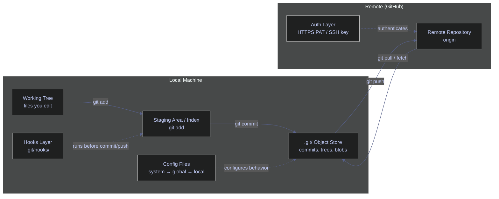
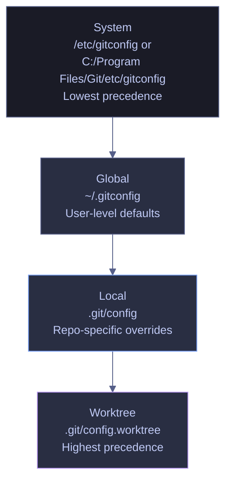

# Git Setup and Configuration

> [!quote] Linus Torvalds on Git
>
> "Git proved I could be more than a one-hit wonder."
>
> — **Linus Torvalds**, TED interview (2016)

Git is a distributed version control system created by Linus Torvalds in 2005. It tracks every change to every file in a project, lets multiple engineers work on the same codebase simultaneously, and provides tools to merge, revert, and inspect work at any point in history. This page is a **complete, zero-assumption setup guide** — a reader who has never used Git can follow it end-to-end to configure a production-ready environment, and a senior engineer will find it operationally complete and precise.

---

## Core Concepts Glossary

Understanding Git's terminology is the foundation for everything else. These terms appear throughout all Git documentation, team communication, and CI/CD pipeline definitions.

| Term | Definition | Plain-English Meaning | Why It Matters |
|---|---|---|---|
| **Git** | A distributed version control system that records file changes as snapshots (commits) in a local repository, with optional synchronization to remote servers. | Software that remembers every change ever made to your files and lets teams collaborate on the same project. | Every command in this chapter operates through Git. |
| **Version control** | A system that records changes to files over time so you can recall any version later. | An undo history for your entire project that never expires. | Without it, overwritten work is lost permanently. |
| **Repository (repo)** | A directory tracked by Git, containing the working tree and a hidden `.git/` folder that stores the complete history, configuration, and object database. | A project folder with a complete memory of every change ever made. | Every Git operation targets a repository. |
| **Working tree / working directory** | The actual files on disk that you edit, outside the `.git/` directory. | What you see in your file explorer or VS Code. | Changes here are not recorded until staged and committed. |
| **Staging area / index** | A buffer between the working tree and the next commit. Files are added here with `git add` before they become part of a commit. | A prep table — you choose exactly which changes go into the next snapshot. | Gives fine-grained control over what each commit includes. |
| **Commit** | An immutable snapshot of all tracked files at a point in time, identified by a unique SHA-1 hash. Contains the tree, parent pointer(s), author, committer, timestamp, and message. | A save point in a game — you can always go back to any previous save. | The fundamental unit of history in Git. |
| **Branch** | A lightweight, movable pointer to a commit. The default branch is typically `main`. Branches let you work on features or fixes without affecting the mainline. | A parallel universe where you can experiment freely. If it works, you merge it back. | Enables concurrent work and isolation of changes. |
| **Default branch** | The branch Git creates when you initialize a repository (`main` by convention, `master` historically). The branch that pull requests typically target. | The "production" line of your project. | Mismatching default branch names between local and remote causes confusion. |
| **Remote** | A copy of the repository hosted on a server (GitHub, GitLab, Bitbucket). The default remote is named `origin`. | The shared copy on GitHub that everyone syncs with. | Enables collaboration — `push` sends commits to the remote, `pull` brings them down. |
| **`origin`** | The conventional name for the default remote repository, automatically set by `git clone`. | The "home server" your local repo syncs with. | Almost every push/pull command targets `origin` by default. |
| **Tracking branch** | A local branch that has an upstream relationship with a remote branch (e.g., `main` tracks `origin/main`). | Your local branch "knows" which remote branch it corresponds to. | Enables `git pull` and `git push` without specifying the remote and branch every time. |
| **`HEAD`** | A pointer to the current commit you are working on. Usually points to the tip of the current branch. In detached HEAD state, it points directly to a commit. | Your "you are here" marker on the timeline. | Determines what you see in your working tree and what the next commit builds on. |
| **SHA / hash** | A 40-character hexadecimal string (often abbreviated to 7–8 characters) computed from the commit contents. Uniquely identifies a commit. | A fingerprint for a commit — no two commits have the same one. | Used to reference specific commits in `checkout`, `revert`, `cherry-pick`, and log inspection. |
| **Clone** | The operation of downloading a complete copy of a remote repository (all branches, tags, full history) to your local machine. | Downloading the entire project with its full memory. | The standard way to start working on an existing project. |
| **Init** | The operation of creating a new Git repository from scratch in an existing directory by generating the `.git/` subdirectory. | Turning a regular folder into a Git-tracked project. | Used when starting a brand-new project that has no remote yet. |
| **Fork** | A server-side copy of someone else's repository under your own GitHub account. Not a Git-native concept — it is a GitHub/GitLab feature. | Making your own copy of someone else's project to experiment with independently. | Standard workflow for open-source contributions. |
| **Pull request (PR)** | A request to merge one branch into another, with a code review interface. Called "merge request" (MR) on GitLab. | Raising your hand and saying "I've finished this work, please review and merge it." | The primary mechanism for code review and controlled merging in teams. |
| **Config scope** | The level at which a Git configuration value is stored: system, global, local, or worktree. More specific scopes override broader ones. | Whether a setting applies to the entire machine, your user account, one repo, or one worktree. | Misconfigured scope causes identity mismatches, wrong credentials, or unexpected behavior. |
| **Global config** | Configuration stored in `~/.gitconfig` (or `$XDG_CONFIG_HOME/git/config`). Applies to all repositories for the current OS user. | Your personal default settings across all projects. | Identity, editor, credential helper, and aliases typically live here. |
| **Local config** | Configuration stored in `.git/config` inside a specific repository. Overrides global and system values for that repo only. | Settings specific to one project (e.g., a work email different from your personal email). | Essential for multi-identity setups (personal vs. work). |
| **System config** | Configuration stored in the Git installation directory (e.g., `C:/Program Files/Git/etc/gitconfig`). Applies to every user on the machine. Lowest precedence. | Machine-wide defaults set by the IT department or installer. | Rarely edited manually; useful for corporate standardization. |
| **Credential helper** | A Git subsystem that stores and retrieves authentication credentials so you are not prompted on every remote operation. | A password manager for Git. | Without one, Git prompts for your username and password on every `push`, `pull`, and `fetch`. |
| **PAT (Personal Access Token)** | A token generated on GitHub (Settings → Developer settings → Tokens) that replaces passwords for HTTPS authentication. Has configurable scopes and expiry. | A password with an expiry date and limited powers. | GitHub no longer accepts account passwords for Git operations over HTTPS — PATs are required. |
| **SSH key** | A cryptographic key pair (public + private) used for passwordless authentication. The public key is uploaded to GitHub; the private key stays on your machine. | A digital passport — GitHub recognizes your machine without needing a password. | Preferred by many engineers for convenience; required when HTTPS is impractical. |
| **Git hook** | A script stored in `.git/hooks/` that Git executes automatically at specific lifecycle events (pre-commit, pre-push, post-merge, etc.). | An automated quality gate — runs checks before you can commit or push. | Catches secrets, lint errors, and formatting issues before they reach the repository. |
| **Pre-commit hook** | A hook that runs before a commit is created. If it exits with a non-zero status, the commit is aborted. | A bouncer at the door — your commit only goes through if the checks pass. | The most commonly used hook; the `pre-commit` framework manages these declaratively. |
| **`.gitignore`** | A file listing patterns of files and directories that Git should not track. Supports glob syntax. | A "do not touch" list for Git. | Prevents secrets, build artifacts, virtual environments, and large generated files from entering the repository. |
| **`.gitattributes`** | A file that defines per-path attributes — most importantly, line-ending normalization rules. Checked into the repository and shared with all collaborators. | A team-wide policy file for how Git handles specific file types. | The canonical solution for mixed-OS line-ending issues (safer than `core.autocrlf` alone). |
| **Line endings (LF / CRLF)** | LF (`\n`) is the Unix/macOS line terminator. CRLF (`\r\n`) is the Windows line terminator. Mismatch between contributors causes noisy diffs that touch every line. | Different operating systems use different invisible characters to mark the end of a line. | A misconfigured team produces diffs that show every line as changed even when only one word was edited. |

---

## Mental Model — How Git's Layers Connect

Before running any commands, understand how the pieces fit together. The diagram below shows the relationship between the files you edit, the local Git machinery, the remote server, and the configuration and hook layers that govern behavior.



**Reading the diagram:**

- **Working tree** — the files on disk you edit with your IDE or text editor.
- **Staging area (index)** — `git add` moves changes here. Only staged changes become part of the next commit.
- **`.git/` object store** — `git commit` creates an immutable snapshot and stores it here. This is the local history.
- **Config files** — three scopes (system, global, local) control Git's behavior. The most specific scope wins.
- **Hooks layer** — scripts in `.git/hooks/` run automatically at lifecycle events (before commit, before push, etc.).
- **Remote repository** — the shared copy on GitHub. `git push` sends commits up; `git pull` / `git fetch` brings them down.
- **Auth layer** — HTTPS with PAT or SSH key authenticates your identity to the remote.

---

## Installing Git

Git must be installed before any other step. The installation method depends on your operating system.

### Windows | Git | install on Windows

#### Install Git for Windows

**When to run:** on a new Windows machine or after a fresh OS install.
**Trigger:** `git --version` returns "command not found" or the version is below 2.39.
**Context:** requires administrator privileges for the default installer. No restart needed.
**Purpose:** install the Git CLI, Git Bash shell, and optional GUI tools.

Download the installer from [git-scm.com/downloads/win](https://git-scm.com/downloads/win) and run it. Alternatively, use `winget` from a PowerShell terminal:

*Install Git via winget (Windows Package Manager):*

```powershell
winget install --id Git.Git -e --source winget
```

> [!tip] Installer options to pay attention to
>
> - **Default editor:** choose VS Code or your preferred editor (the default is Vim).
> - **PATH environment:** select "Git from the command line and also from 3rd-party software" to make `git` available in PowerShell, CMD, and Git Bash.
> - **Line ending conversions:** the installer defaults to `core.autocrlf=true` (convert LF→CRLF on checkout, CRLF→LF on commit). This is correct for most Windows users on mixed-OS teams.
> - **Credential helper:** select "Git Credential Manager" (the default since Git 2.39+).

### macOS | Git | install on macOS

#### Install Git on macOS

**When to run:** on a new Mac or after a major OS upgrade.
**Trigger:** `git --version` returns the Apple-bundled version (often outdated) or "command not found."
**Context:** no admin required for Homebrew install. Xcode Command Line Tools also provide a Git binary.
**Purpose:** install a current Git version with full feature support.

macOS ships a Git binary as part of Xcode Command Line Tools, but it is often outdated. Install a current version via Homebrew:

*Install Git via Homebrew:*

```bash
brew install git
```

After installation, verify the Homebrew version is first on `$PATH`:

*Verify the active Git binary location:*

```bash
which git
```

```text
/opt/homebrew/bin/git
```

If the output shows `/usr/bin/git`, the Xcode version is still taking precedence. Add Homebrew to your `$PATH` in `~/.zshrc`.

### Linux | Git | install on Linux

#### Install Git on Linux

**When to run:** on a new Linux machine, container, or VM.
**Trigger:** `git --version` returns "command not found."
**Context:** requires `sudo` for package manager installation.
**Purpose:** install the Git CLI.

*Install Git on Debian/Ubuntu:*

```bash
sudo apt-get update && sudo apt-get install -y git
```

*Install Git on Fedora/RHEL:*

```bash
sudo dnf install -y git
```

*Install Git on Alpine (common in Docker images):*

```bash
apk add --no-cache git
```

### Windows | WSL | Git in WSL

#### Install Git in WSL

**When to run:** when using Windows Subsystem for Linux for development.
**Trigger:** `git --version` inside the WSL distribution returns "command not found" or an outdated version.
**Context:** WSL has its own filesystem and its own Git installation, separate from Git for Windows. Credentials, config, and hooks are independent.
**Purpose:** install Git inside the Linux distribution running under WSL.

WSL distributions are standard Linux — use the `apt` or `dnf` commands above. Note that **Git for Windows and WSL Git are separate installations** with separate configurations. Setting `user.email` in Git for Windows does not affect WSL, and vice versa.

> [!warning] WSL and Windows Git are independent
>
> - `~/.gitconfig` inside WSL is a different file from `C:\Users\<you>\.gitconfig` on the Windows side.
> - SSH keys in `~/.ssh/` inside WSL are not visible to Git for Windows, and vice versa.
> - Credential helpers configured in Git for Windows do not apply inside WSL.
> - If you work in both environments, configure both independently.

> [!success] Share credentials between Windows and WSL
>
> Inside WSL, configure Git to delegate credential storage to the Windows Credential Manager:
> `git config --global credential.helper "/mnt/c/Program\ Files/Git/mingw64/bin/git-credential-manager.exe"`

### Git | verify installation

#### Verify Git installation

After installing, verify the version from a terminal:

*Check the installed Git version:*

```bash
git --version
```

```text
git version 2.53.0.windows.1
```

If the command is not found, the installation did not add Git to your `PATH`. On Windows, restart your terminal or run the installer again and ensure the PATH option is selected.

---

## Identity Configuration

Git embeds an author name and email in every commit object. These values are mandatory — Git refuses to create a commit without them. The email address also determines whether GitHub attributes the commit to your profile on the contribution graph.

### Git | config | set user identity

#### Set the global author name

**When to run:** once on each new machine, before the first commit.
**Trigger:** first-time Git setup or `git config --get user.name` returns empty.
**Context:** `--global` writes to `~/.gitconfig`. Applies to all repos for the current user. Does not require admin.
**Purpose:** set the display name that appears in `git log` output and GitHub commit attribution.

*Set the author name for all repositories on this machine:*

```bash
git config --global user.name "alp78"
```

#### Set the global author email

**When to run:** immediately after setting `user.name`.
**Trigger:** `git config --get user.email` returns empty or the wrong address.
**Context:** the email must match a verified email on your GitHub account for commits to be attributed to your profile.
**Purpose:** set the email that appears in every commit and links your work to your GitHub identity.

*Set the author email for all repositories:*

```bash
git config --global user.email "alexper.recovery@gmail.com"
```

> [!warning] Email must match your GitHub account
>
> If `user.email` does not match a verified email on your GitHub account, commits will appear as "unrecognized" — they will not count toward your contribution graph and will not link to your profile avatar.

> [!success] Find your verified email on GitHub
>
> Go to **GitHub → Settings → Emails** to see your verified addresses. Use that exact value. If you prefer to keep your email private, use the GitHub noreply address: `<id>+<username>@users.noreply.github.com` (visible on the same settings page).

#### Use the GitHub noreply email for privacy

**When to run:** when you want commits attributed to your GitHub profile without exposing your real email.
**Trigger:** privacy policy, personal preference, or corporate guidance.
**Context:** GitHub generates a unique noreply address for every account. Find it at GitHub → Settings → Emails → "Keep my email addresses private."
**Purpose:** prevent your real email from appearing in public commit history while maintaining contribution attribution.

*Set the noreply email as your global author email:*

```bash
git config --global user.email "12345678+alp78@users.noreply.github.com"
```

> [!tip] Enable the email privacy setting on GitHub
>
> On GitHub → Settings → Emails, check **"Keep my email addresses private"** and **"Block command line pushes that expose my email."** The second option rejects pushes that use a non-noreply email, preventing accidental exposure.

#### Use a different identity for a specific repository

**When to run:** when you contribute to a repository that requires a different email (e.g., work vs. personal).
**Trigger:** the repo belongs to a different organization or requires a different identity.
**Context:** `--local` writes to `.git/config` inside the repository. Overrides `--global` for this repo only.
**Purpose:** ensure commits in this repo use the correct identity without changing the global default.

*Set a repo-specific email (local scope):*

```bash
git config --local user.email "alex@stockindex.example.com"
```

*Verify the effective email in this repo:*

```bash
git config --get user.email
```

```text
alex@stockindex.example.com
```

*Verify both scopes are visible:*

```bash
git config --list --show-scope | grep user.email
```

```text
global	user.email=alexper.recovery@gmail.com
local	user.email=alex@stockindex.example.com
```

The local value takes precedence. Remove it to revert to the global default:

*Remove the local override:*

```bash
git config --local --unset user.email
```

> [!tip] Conditional includes for automatic identity switching
>
> Instead of setting `--local` in every repo, use `includeIf` in `~/.gitconfig` to automatically apply a different identity based on the repo's filesystem path:
>
> ```ini
> # ~/.gitconfig
> [includeIf "gitdir:~/work/"]
>     path = ~/.gitconfig-work
>
> # ~/.gitconfig-work
> [user]
>     email = alex@stockindex.example.com
>     name = Alex Perrier
> ```
>
> Any repository cloned under `~/work/` automatically uses the work identity. No per-repo `--local` configuration needed.

---

## Authentication

Git communicates with remote repositories (GitHub) over HTTPS or SSH. GitHub no longer accepts account passwords for Git operations — you must use a Personal Access Token (PAT) or SSH key.

### Git | Authentication | HTTPS with PAT

HTTPS is the default protocol when you clone with a `https://github.com/...` URL. Authentication requires a Personal Access Token (PAT) instead of your GitHub password.

#### Generate a Personal Access Token on GitHub

**When to run:** before the first `git push` or `git clone` over HTTPS, or when an existing token expires.
**Trigger:** Git prompts for a password or returns `Authentication failed`.
**Context:** browser-based operation on GitHub.com. Tokens are scoped and have configurable expiry.
**Purpose:** create a credential that Git can use to authenticate with GitHub over HTTPS.

> [!todo] Generate a PAT (classic)
>
> 1. Go to **GitHub → Settings → Developer settings → Personal access tokens → Tokens (classic)**.
> 2. Click **Generate new token (classic)**.
> 3. Set a descriptive note (e.g., `laptop-2026`).
> 4. Set an expiration (90 days is a reasonable balance between security and convenience).
> 5. Select scopes: at minimum `repo` (full repository access). Add `workflow` if you use GitHub Actions.
> 6. Click **Generate token** and **copy it immediately** — GitHub will not show it again.

> [!warning] PATs are secrets
>
> - Never commit a PAT to a repository, paste it in Slack, or store it in an unencrypted file.
> - If a PAT is compromised, revoke it immediately on GitHub → Settings → Developer settings → Tokens.
> - Set the shortest practical expiry. 90-day tokens are standard in most organizations.

> [!success] Store the PAT securely using a credential helper
>
> Configure Git to cache credentials in the OS secure keychain (see the Credential Helpers section below). After the first successful `git push`, the PAT is stored and you will not be prompted again until it expires.

#### Validate HTTPS authentication

**When to run:** after configuring the PAT and credential helper, to confirm everything works.
**Trigger:** initial setup or after a PAT rotation.
**Context:** requires a valid PAT and network access to github.com.
**Purpose:** confirm that Git can authenticate with GitHub over HTTPS.

*Test HTTPS authentication using the GitHub CLI:*

```bash
gh auth status
```

```text
github.com
  ✓ Logged in to github.com account alp78 (keyring)
  - Active account: true
  - Git operations protocol: https
  - Token: gho_************************************
  - Token scopes: 'delete_repo', 'gist', 'read:org', 'repo', 'workflow'
```

The `gh auth status` command confirms the active account, protocol, and token scopes. If using `gh` as the credential helper (recommended), this is the single source of truth for HTTPS authentication status.

### Git | Authentication | SSH keys

SSH authentication uses a cryptographic key pair. The private key stays on your machine; the public key is uploaded to GitHub. Once configured, Git operations over SSH (`git@github.com:...` URLs) authenticate silently.

#### Generate an SSH key pair

**When to run:** once per machine, or when rotating keys.
**Trigger:** no SSH key exists yet, or `ssh -T git@github.com` returns "Permission denied."
**Context:** runs locally. The private key is stored in `~/.ssh/`. Requires no network access.
**Purpose:** create a cryptographic identity for SSH authentication.

*Generate an Ed25519 SSH key pair:*

```bash
ssh-keygen -t ed25519 -C "alexper.recovery@gmail.com"
```

> [!info]- ssh-keygen flags breakdown
>
> - `-t ed25519` — key type. Ed25519 is shorter, faster, and more secure than RSA. Use `-t rsa -b 4096` only if your organization requires RSA.
> - `-C "email"` — a comment embedded in the public key for identification. Convention is to use your email.
> - The command prompts for a file path (default: `~/.ssh/id_ed25519`) and an optional passphrase. A passphrase adds a second factor — if the private key file is stolen, the passphrase is still required.

#### Add the public key to GitHub

**When to run:** after generating the key pair.
**Trigger:** `ssh -T git@github.com` returns "Permission denied (publickey)."
**Context:** browser-based operation on GitHub.com, or via `gh ssh-key add`.
**Purpose:** register your public key so GitHub recognizes your machine.

> [!todo] Add the SSH key to GitHub
>
> 1. Copy the public key: `cat ~/.ssh/id_ed25519.pub` and copy the entire output.
> 2. Go to **GitHub → Settings → SSH and GPG keys → New SSH key**.
> 3. Paste the public key. Set a title that identifies the machine (e.g., `work-laptop-2026`).
> 4. Click **Add SSH key**.
>
> Alternatively, use the GitHub CLI:
> ```bash
> gh ssh-key add ~/.ssh/id_ed25519.pub --title "work-laptop-2026"
> ```

#### Start the SSH agent and add your key

**When to run:** in every new terminal session where you need SSH authentication (or configure your shell profile to do it automatically).
**Trigger:** `ssh -T git@github.com` returns "Could not open a connection to your authentication agent."
**Context:** the SSH agent caches your decrypted private key in memory so you do not have to type the passphrase repeatedly.
**Purpose:** make the private key available for SSH operations without repeated passphrase prompts.

*Start the SSH agent and add your key (Linux/macOS):*

```bash
eval "$(ssh-agent -s)"
ssh-add ~/.ssh/id_ed25519
```

*Start the SSH agent on Windows (Git Bash):*

```bash
eval "$(ssh-agent -s)"
ssh-add ~/.ssh/id_ed25519
```

> [!tip] Persist the SSH agent across sessions
>
> - **macOS:** add `AddKeysToAgent yes` and `UseKeychain yes` to `~/.ssh/config`. The macOS Keychain stores the passphrase permanently.
> - **Linux:** add `eval "$(ssh-agent -s)"` and `ssh-add` to `~/.bashrc` or `~/.zshrc`.
> - **Windows (Git Bash):** add the same lines to `~/.bashrc`. Alternatively, enable the Windows OpenSSH Agent service via `Services.msc` → "OpenSSH Authentication Agent" → set to Automatic.

#### Test SSH connectivity to GitHub

**When to run:** after adding the public key to GitHub and starting the agent.
**Trigger:** first-time SSH setup or troubleshooting authentication failures.
**Context:** requires network access to github.com on port 22. Some corporate networks block port 22.
**Purpose:** verify that SSH authentication works end-to-end.

*Test SSH authentication with GitHub:*

```bash
ssh -T git@github.com
```

```text
Hi alp78! You've successfully authenticated, but GitHub does not provide shell access.
```

A success message confirms the key is recognized. If you see "Permission denied (publickey)," the key is not loaded in the agent or not added to GitHub.

> [!warning] Corporate networks may block SSH (port 22)
>
> If `ssh -T git@github.com` hangs or times out, your network may be blocking outbound SSH traffic. This is common on corporate networks with restrictive firewalls.

> [!success] Use SSH over HTTPS port 443 as a fallback
>
> Add this to `~/.ssh/config` to tunnel SSH through port 443:
>
> ```
> Host github.com
>     Hostname ssh.github.com
>     Port 443
>     User git
> ```
>
> Then test again: `ssh -T git@github.com`. This works on almost all networks that allow HTTPS traffic.

### Git | Authentication | comparison

| Method | Security | Convenience | Best For |
|---|---|---|---|
| **HTTPS + PAT** | Token scoped and time-limited. Stored in OS keychain via credential helper. | Works through all firewalls. No agent setup. | Default recommendation. Corporate environments. CI/CD. |
| **SSH key** | Strong cryptographic auth. Passphrase adds second factor. | Passwordless once agent is running. Requires port 22 (or 443 workaround). | Engineers who prefer key-based auth. Environments where PATs are impractical. |
| **`gh` CLI as credential helper** | Delegates to `gh auth login`. Token managed by `gh`. | Zero manual token management. `gh auth refresh` handles renewal. | Teams using the GitHub CLI. Simplest HTTPS setup. |
| **`credential.helper store`** | **Insecure.** Plaintext file at `~/.git-credentials`. | Zero dependencies. | **Never recommended.** Only for isolated, ephemeral environments. |

---

## Credential Helpers

By default, Git prompts for credentials on every remote operation. A credential helper stores credentials securely so you authenticate once and Git reuses the stored credentials silently.

### Git | credential.helper | OS-native credential managers

#### Configure the recommended credential helper

**When to run:** once per machine, as part of initial setup.
**Trigger:** Git prompts for a password on every `push` or `pull`.
**Context:** `--global` writes to `~/.gitconfig`. Credential helpers are OS-specific.
**Purpose:** store authentication credentials in the OS secure keychain so Git never prompts again.

*Windows — use Git Credential Manager (included with Git for Windows 2.39+):*

```bash
git config --global credential.helper manager
```

*macOS — use the system Keychain:*

```bash
git config --global credential.helper osxkeychain
```

*Linux — use `git-credential-store` with libsecret (GNOME Keyring) or KWallet:*

```bash
git config --global credential.helper /usr/lib/git-core/git-credential-libsecret
```

> [!tip] Use `gh` CLI as the credential helper (recommended for GitHub)
>
> If you have the GitHub CLI (`gh`) installed, it can act as the credential helper. This is the simplest setup — `gh auth login` handles token generation, storage, and renewal:
>
> ```bash
> gh auth setup-git
> ```
>
> This writes the following to `~/.gitconfig`:
> ```ini
> [credential "https://github.com"]
>     helper =
>     helper = !'C:\\Program Files\\GitHub CLI\\gh.exe' auth git-credential
> ```
>
> After this, all HTTPS Git operations to GitHub authenticate through `gh` automatically.

#### Credential helper plaintext storage (not recommended)

**When to run:** only in ephemeral, single-user environments (CI containers, disposable VMs).
**Trigger:** no OS keychain is available and you cannot install one.
**Context:** writes credentials in plaintext to `~/.git-credentials`. Anyone with read access to your home directory can read them.
**Purpose:** eliminate password prompts in environments where security is managed at a different layer.

*Store credentials in plaintext (insecure):*

```bash
git config --global credential.helper store
```

> [!danger] `credential.helper store` saves passwords in plaintext
>
> The file `~/.git-credentials` is readable by any process running as your user. On shared machines, other users with admin access can also read it. **Never use this on a shared, production, or corporate-managed machine.**

> [!success] Use the OS credential manager instead
>
> On Windows: `credential.helper manager`. On macOS: `credential.helper osxkeychain`. On Linux: `credential.helper libsecret` or use `gh auth setup-git`. All store credentials encrypted in the OS keychain.

---

## Configuration Scope and Precedence

Git reads configuration from four scopes, in order of increasing precedence. A value set in a more specific scope overrides the same key in a broader scope.

### Git | config | scope hierarchy



| Scope | Flag | File Location | Applies To | Use When |
|---|---|---|---|---|
| **System** | `--system` | `C:/Program Files/Git/etc/gitconfig` (Windows) or `/etc/gitconfig` (Linux/macOS) | All users, all repos on the machine | Corporate IT sets machine-wide defaults (line endings, proxy). Rarely edited manually. |
| **Global** | `--global` | `~/.gitconfig` or `$XDG_CONFIG_HOME/git/config` | All repos for the current OS user | Personal identity, editor, aliases, credential helper, pull strategy. |
| **Local** | `--local` (default) | `.git/config` inside the repo | The current repository only | Work email different from personal, repo-specific merge strategy, custom hooks path. |
| **Worktree** | `--worktree` | `.git/config.worktree` | The current worktree only (requires `extensions.worktreeConfig=true`) | Rarely needed — advanced multi-worktree setups. |

**Precedence rule:** worktree > local > global > system. The most specific scope wins.

### Git | config | inspect configuration values

#### View all resolved configuration values

*List all configuration keys with their resolved values:*

```bash
git config --list
```

```text
diff.astextplain.textconv=astextplain
filter.lfs.clean=git-lfs clean -- %f
filter.lfs.smudge=git-lfs smudge -- %f
filter.lfs.process=git-lfs filter-process
filter.lfs.required=true
http.sslbackend=schannel
core.autocrlf=true
core.fscache=true
core.symlinks=false
pull.rebase=false
init.defaultbranch=master
user.email=alexper.recovery@gmail.com
user.name=alp78
core.editor=nano
```

#### View all values with their scope

*List all values showing which scope each comes from:*

```bash
git config --list --show-scope
```

```text
system	diff.astextplain.textconv=astextplain
system	filter.lfs.clean=git-lfs clean -- %f
system	filter.lfs.smudge=git-lfs smudge -- %f
system	filter.lfs.process=git-lfs filter-process
system	filter.lfs.required=true
system	http.sslbackend=schannel
system	core.autocrlf=true
system	core.fscache=true
system	core.symlinks=false
system	pull.rebase=false
system	init.defaultbranch=master
global	user.email=alexper.recovery@gmail.com
global	user.name=alp78
global	core.editor=nano
local	core.repositoryformatversion=0
local	core.filemode=false
local	core.bare=false
local	core.logallrefupdates=true
local	core.symlinks=false
local	core.ignorecase=true
local	remote.origin.url=https://github.com/alp78/git-lab.git
local	remote.origin.fetch=+refs/heads/*:refs/remotes/origin/*
local	branch.main.remote=origin
local	branch.main.merge=refs/heads/main
```

#### View all values with their source file

*List all values showing the file each comes from:*

```bash
git config --list --show-origin
```

```text
file:C:/Program Files/Git/etc/gitconfig    diff.astextplain.textconv=astextplain
file:C:/Program Files/Git/etc/gitconfig    core.autocrlf=true
file:C:/Users/aperi/.gitconfig             user.email=alexper.recovery@gmail.com
file:C:/Users/aperi/.gitconfig             user.name=alp78
file:C:/Users/aperi/.gitconfig             core.editor=nano
file:.git/config                           remote.origin.url=https://github.com/alp78/git-lab.git
file:.git/config                           branch.main.remote=origin
```

#### Query a single value

*Get the resolved value of a specific key:*

```bash
git config --get user.email
```

```text
alexper.recovery@gmail.com
```

#### Unset a configuration value

**When to run:** to remove a value from a specific scope without affecting other scopes.
**Trigger:** a local override is no longer needed, or a misconfigured value must be removed.
**Context:** `--unset` removes the key from the targeted scope only. Other scopes are unaffected.
**Purpose:** clean up configuration without side effects.

*Remove a local config override:*

```bash
git config --local --unset user.email
```

| Flag | Syntax | Description |
|---|---|---|
| `--list` | `git config --list` | Print all resolved key-value pairs across all scopes |
| `--show-origin` | `git config --list --show-origin` | Show the config file path where each value is defined |
| `--show-scope` | `git config --list --show-scope` | Show the scope (system/global/local/worktree) for each value |
| `--get <key>` | `git config --get user.email` | Print the resolved value of a single key |
| `--get-all <key>` | `git config --get-all credential.helper` | Print all values for a multivalued key |
| `--unset <key>` | `git config --unset <key>` | Remove a key from the targeted scope |
| `--unset-all <key>` | `git config --unset-all <key>` | Remove all values for a multivalued key |
| `--global` | `git config --global <key> <value>` | Write to `~/.gitconfig` (all repos for the current user) |
| `--local` | `git config --local <key> <value>` | Write to `.git/config` (current repo only; default scope) |
| `--system` | `git config --system <key> <value>` | Write to the system-wide config (requires admin) |
| `--edit` | `git config --global --edit` | Open the config file for the given scope in the configured editor |

---

## Recommended Global Defaults

These settings form a safe, professional baseline for data engineers. Apply them once on a new machine after setting identity and credential helper.

### Git | config | recommended settings table

| Key | Recommended Value | Scope | Rationale | Caveats |
|---|---|---|---|---|
| `user.name` | Your full name or handle | Global | Identifies you in every commit. | Use `--local` to override per-repo if needed. |
| `user.email` | Your GitHub-verified email | Global | Links commits to your GitHub profile. | Use noreply address for public repos. |
| `init.defaultBranch` | `main` | Global | Aligns with GitHub's default. Avoids `master` ↔ `main` confusion. | Older tutorials may still reference `master`. |
| `core.editor` | `"code --wait"` or `nano` | Global | Controls editor for commit messages, interactive rebase, merge conflict markers. | `--wait` is required for VS Code so Git waits for you to close the editor tab. |
| `pull.rebase` | `false` | Global | Default pull strategy is merge. Prevents accidental history rewriting for beginners. | Teams that prefer linear history should set `true` and train on rebase workflows. |
| `fetch.prune` | `true` | Global | Automatically removes remote-tracking references to branches that no longer exist on the remote. | No downside. Keeps `git branch -r` clean. |
| `push.default` | `current` | Global | Pushes the current branch to a same-named remote branch. Safer than `matching` (which pushes all branches). | `simple` (the default since Git 2.0) is also acceptable; `current` is slightly more convenient. |
| `rebase.autoStash` | `true` | Global | Automatically stashes uncommitted changes before rebase and pops them after. | Prevents "cannot rebase: you have unstaged changes" errors. |
| `core.autocrlf` | `true` (Windows) / `input` (macOS/Linux) | Global | Normalizes line endings. See the Line Endings section below. | Prefer `.gitattributes` for team-wide enforcement. |
| `core.safecrlf` | `warn` | Global | Warns if a line-ending conversion is irreversible. | Set to `true` to block irreversible conversions entirely. |
| `core.filemode` | `false` (Windows) | Local | Ignores executable-bit changes on Windows (where the filesystem does not track them). | Only relevant on Windows. Linux/macOS should leave it at `true`. |
| `credential.helper` | `manager` (Windows) / `osxkeychain` (macOS) | Global | Stores credentials in the OS secure keychain. | See the Credential Helpers section. |

### Git | config | apply recommended defaults

#### Apply the baseline configuration

*Set all recommended global defaults in one session:*

```bash
git config --global init.defaultBranch main
git config --global core.editor "code --wait"
git config --global pull.rebase false
git config --global fetch.prune true
git config --global push.default current
git config --global rebase.autoStash true
git config --global core.safecrlf warn
```

### Git | config | useful aliases

#### Create command shortcuts

Git aliases let you define short names for long or frequently used commands. They are stored under `[alias]` in `~/.gitconfig` and invoked as `git <alias>`.

*Define common aliases:*

```bash
git config --global alias.st status
git config --global alias.co checkout
git config --global alias.br "branch -vv"
git config --global alias.lg "log --oneline --graph --all --decorate"
git config --global alias.undo "reset --soft HEAD~1"
git config --global alias.last "log -1 HEAD --stat"
git config --global alias.unstage "reset HEAD --"
```

`git st` runs `git status`. `git lg` shows a compact graph of all branches. `git undo` moves the last commit back to staged without discarding changes. `git br` shows branches with their tracking status.

---

## Line Endings and File Normalization

Line-ending differences between operating systems are the #1 source of noisy, meaningless diffs on mixed-OS teams. This section explains the problem and provides the canonical solution.

### Git | Line Endings | LF vs CRLF

#### What are line endings?

Every text file uses an invisible character sequence to mark the end of each line:

- **LF** (`\n`, hex `0A`) — used by Linux and macOS.
- **CRLF** (`\r\n`, hex `0D 0A`) — used by Windows.

When a Windows developer commits files with CRLF endings and a macOS developer opens them, or vice versa, Git sees every line as changed even if the visible content is identical. This produces diffs that touch hundreds of lines with no meaningful change.

#### How `core.autocrlf` works

`core.autocrlf` controls automatic line-ending conversion during checkout and commit:

| Value | On checkout (repo → working tree) | On commit (working tree → repo) | Best for |
|---|---|---|---|
| `true` | Convert LF → CRLF | Convert CRLF → LF | **Windows developers** on mixed-OS teams. Files on disk have CRLF; repo stores LF. |
| `input` | No conversion | Convert CRLF → LF | **macOS/Linux developers** on mixed-OS teams. Files on disk stay as-is; repo stores LF. |
| `false` | No conversion | No conversion | Only if the entire team uses the same OS and you manage endings manually. |

> [!warning] `core.autocrlf` alone is not enough for teams
>
> `core.autocrlf` is a **per-machine setting**. If one developer sets it to `true` and another to `false`, the repo gets a mix of LF and CRLF files. There is no team-wide enforcement.

> [!success] Use `.gitattributes` as the canonical team-wide policy
>
> `.gitattributes` is checked into the repository and applies to every collaborator regardless of their local config. It is the authoritative solution for mixed-OS teams.

### Git | Line Endings | .gitattributes

#### Create a `.gitattributes` file for line-ending normalization

**When to run:** once per repository, committed to version control.
**Trigger:** setting up a new repo or fixing line-ending churn in an existing one.
**Context:** `.gitattributes` lives in the repo root. It overrides `core.autocrlf` for the patterns it covers.
**Purpose:** enforce consistent line endings in the repository regardless of each developer's OS or local config.

*Create a `.gitattributes` file with standard normalization rules:*

```text
# Set default behavior: normalize to LF in the repo, convert to OS-native on checkout
* text=auto

# Force LF for files that must always use LF (scripts, CI configs)
*.sh text eol=lf
*.py text eol=lf
*.yml text eol=lf
*.yaml text eol=lf
*.json text eol=lf
*.sql text eol=lf
*.tf text eol=lf
*.hcl text eol=lf
Makefile text eol=lf
Dockerfile text eol=lf

# Force CRLF for Windows-specific files
*.bat text eol=crlf
*.cmd text eol=crlf
*.ps1 text eol=crlf

# Binary files — do not normalize or diff
*.png binary
*.jpg binary
*.ico binary
*.zip binary
*.gz binary
*.parquet binary
*.avro binary
*.pkl binary
```

> [!info]- `.gitattributes` directives breakdown
>
> - `* text=auto` — let Git detect text files and normalize their endings to LF in the repo. On checkout, convert to the OS-native ending.
> - `*.sh text eol=lf` — force LF regardless of OS. Critical for shell scripts, which break on CRLF.
> - `*.ps1 text eol=crlf` — force CRLF for PowerShell scripts on Windows.
> - `*.parquet binary` — mark binary files so Git does not try to normalize or diff them.

#### Normalize an existing repository after adding `.gitattributes`

**When to run:** after adding or modifying `.gitattributes` in a repo that already has mixed line endings.
**Trigger:** `git diff` shows line-ending changes on files you did not edit.
**Context:** this re-normalizes all tracked files. Produces a one-time diff that corrects all endings.
**Purpose:** bring all existing files into compliance with the new `.gitattributes` policy.

*Re-normalize all files in the repository:*

```bash
git add --renormalize .
git commit -m "chore: normalize line endings per .gitattributes"
```

> [!tip] Diagnosing line-ending noise in diffs
>
> If `git diff` shows every line changed in a file, check for line-ending mismatch:
>
> ```bash
> git diff --check
> ```
>
> This flags lines with whitespace errors including mixed line endings. After adding `.gitattributes` and re-normalizing, the noise should disappear.

---

## Cross-Platform File Behavior

Beyond line endings, several filesystem differences across operating systems affect Git behavior. Understanding these prevents subtle bugs and noisy diffs on mixed-OS teams.

### Git | Cross-Platform | filesystem differences

| Issue | Windows | macOS | Linux | Git Config / Fix |
|---|---|---|---|---|
| **Line endings** | CRLF (`\r\n`) | LF (`\n`) | LF (`\n`) | `.gitattributes` with `* text=auto` |
| **Case sensitivity** | Case-insensitive (`Readme.md` = `readme.md`) | Case-insensitive by default (HFS+) | Case-sensitive | `core.ignorecase=true` on Windows/macOS (default). Avoid relying on case differences in filenames. |
| **File permissions / executable bit** | Not tracked (NTFS does not store Unix permissions) | Tracked | Tracked | `core.filemode=false` on Windows (set automatically by Git for Windows). |
| **Path length** | 260-character limit by default | No practical limit | No practical limit | Enable long paths: `git config --system core.longpaths true` (requires admin). |
| **Symlinks** | Not supported by default (require Developer Mode) | Supported | Supported | `core.symlinks=false` on Windows (default). Enable with Developer Mode. |

> [!warning] Case-sensitivity trap on macOS and Windows
>
> If a Linux developer creates both `Config.py` and `config.py` in the same directory, macOS and Windows cannot distinguish them — one file silently overwrites the other on checkout. Git will track both, but the working tree can only contain one.

> [!success] Prevent case conflicts
>
> Establish a team convention: **all filenames are lowercase with hyphens or underscores.** Enforce it with a pre-commit hook or CI check. Avoid renaming files by case only (e.g., `README.md` → `Readme.md`) — this requires a two-step rename through a temporary name on case-insensitive filesystems.

> [!warning] Windows 260-character path limit
>
> Deep directory nesting (common in `node_modules/`, `.terraform/`, Python virtualenvs) can exceed the 260-character Windows path limit, causing `Filename too long` errors on clone or checkout.

> [!success] Enable long paths on Windows
>
> ```bash
> git config --system core.longpaths true
> ```
>
> This requires an admin terminal. Also enable the Windows group policy: **Computer Configuration → Administrative Templates → System → Filesystem → Enable Win32 long paths.**

---

## Creating and Cloning Repositories

Use `git init` to start a new repository from scratch, or `git clone` to download an existing one from a remote. These are the two entry points into any Git workflow.

### Git | init | initialize a new repository

`git init` turns any directory into a Git repository by creating the hidden `.git/` subdirectory. Use this when starting a brand-new project locally. If the project already exists on a remote (GitHub, GitLab), use `git clone` instead.

#### Create a new repository

**When to run:** starting a brand-new project that has no remote yet.
**Trigger:** `ls -la .git` returns "No such file or directory."
**Context:** does not require network access. Creates `.git/` in the current directory with the default branch name from `init.defaultBranch`.
**Purpose:** initialize Git tracking in an existing directory.

*Initialize a new Git repository:*

```bash
git init
```

```text
Initialized empty Git repository in C:/Users/aperi/AppData/Local/Temp/git-init-demo/.git/
```

> [!info] What `git init` creates
>
> The `.git/` subdirectory contains:
>
> - `HEAD` — pointer to the current branch (initially `refs/heads/main` or `refs/heads/master`)
> - `config` — local repository configuration
> - `objects/` — the object database (commits, trees, blobs)
> - `refs/` — branch and tag pointers
> - `hooks/` — sample hook scripts (not active until renamed)
> - `info/` — auxiliary information (e.g., `exclude` patterns)

*Contents of `.git/` after initialization:*

```bash
ls .git/
```

```text
HEAD
config
description
hooks
info
objects
refs
```

| Flag | Syntax | Description |
|---|---|---|
| `-b <name>` / `--initial-branch <name>` | `git init -b main` | Set the name of the first branch (overrides `init.defaultBranch`) |
| `--bare` | `git init --bare` | Create a repository with no working tree — used for server/remote repos |
| `--template <dir>` | `git init --template /path` | Populate `.git/` from a custom template directory (custom hooks, config) |
| `--shared[=<perms>]` | `git init --shared=group` | Set group-write permissions for shared server repositories |

### Git | clone | download a remote repository

`git clone` downloads a repository from a remote URL to your local machine, including all branches, tags, and the full commit history. The remote is automatically registered as `origin`.

#### Clone a repository

**When to run:** when joining an existing project or setting up a new machine.
**Trigger:** the repo exists on GitHub and you need a local copy.
**Context:** requires network access and authentication (PAT or SSH key). Creates a new directory named after the repository.
**Purpose:** get a complete, working copy of a remote repository with full history.

*Clone a repository over HTTPS:*

```bash
git clone https://github.com/alp78/git-lab.git
```

```text
Cloning into 'git-lab'...
```

#### Verify the clone immediately after

After cloning, verify the remote URL, current branch, and tracking relationship:

*Check remotes:*

```bash
git remote -v
```

```text
origin	https://github.com/alp78/git-lab.git (fetch)
origin	https://github.com/alp78/git-lab.git (push)
```

*Check the current branch and tracking:*

```bash
git branch -a
```

```text
* main
  remotes/origin/main
```

*Check working tree status:*

```bash
git status
```

```text
On branch main
Your branch is up to date with 'origin/main'.

nothing to commit, working tree clean
```

*View commit history:*

```bash
git log --oneline
```

```text
7f5dfe6 chore: add pre-commit configuration
71f876e feat: add stock pipeline skeleton with tests and gitignore
0850a8c initial commit: add README
```

#### Clone into a specific directory

*Clone into a custom directory name:*

```bash
git clone https://github.com/alp78/git-lab.git my-project
```

#### Clone a specific branch

*Clone and check out a specific branch (full history):*

```bash
git clone --branch develop https://github.com/org/repo.git
```

*Clone a single branch only (reduce download size):*

```bash
git clone --branch develop --single-branch https://github.com/org/repo.git
```

#### Shallow clone — latest commit only

**When to run:** in CI/CD pipelines, automated builds, or when you only need the latest code and not the history.
**Trigger:** clone time or disk space is a concern, and full history is not required.
**Context:** `--depth 1` fetches only the most recent commit. Some Git operations (`bisect`, `blame` across history) will not work without unshallowing.
**Purpose:** minimize clone time and disk usage.

*Create a shallow clone with depth 1:*

```bash
git clone --depth 1 https://github.com/alp78/git-lab.git /tmp/git-lab-shallow
```

```text
Cloning into '/tmp/git-lab-shallow'...
```

> [!warning] Shallow clone limitations
>
> - Cannot `git push` to the remote without first unshallowing.
> - Cannot run `git bisect`, `git log --all`, or other commands that require full history traversal.
> - `git blame` only shows the most recent commit for every line.

> [!success] Unshallow when full history is needed
>
> ```bash
> git fetch --unshallow
> ```
>
> Converts a shallow clone into a full clone. After this, all history commands work normally.

> [!tip] Shallow clones in CI/CD
>
> GitHub Actions uses `actions/checkout` with `fetch-depth: 1` by default — a shallow clone. This is correct for most build and test jobs. Set `fetch-depth: 0` only when you need full history (e.g., generating changelogs, running `git describe`).

| Flag | Syntax | Description |
|---|---|---|
| `--depth <n>` | `git clone --depth 1 <url>` | Shallow clone: fetch only the last N commits |
| `-b` / `--branch <name>` | `git clone -b develop <url>` | Check out the specified branch after cloning |
| `--single-branch` | `git clone --single-branch -b main <url>` | Fetch only the specified branch; omit all other remote refs |
| `--bare` | `git clone --bare <url>` | Clone without a working tree (for server/mirror repos) |
| `--mirror` | `git clone --mirror <url>` | Clone all refs including remote tracking; implies `--bare` |
| `--recurse-submodules` | `git clone --recurse-submodules <url>` | Automatically initialize and clone all submodules |
| `--shallow-submodules` | `git clone --shallow-submodules <url>` | Shallow-clone each submodule to depth 1 |
| `--filter=blob:none` | `git clone --filter=blob:none <url>` | Partial clone: download commit/tree objects only, fetch blobs on demand (Git 2.19+) |

---

## Pre-Commit Hooks — Automated Quality Gates

Git hooks are scripts stored in `.git/hooks/` that execute automatically at lifecycle events — before a commit, before a push, after a merge, etc. The `pre-commit` framework makes hook management declarative and shareable across the team via a versioned `.pre-commit-config.yaml` file.

### Git | Hooks | what hooks are and how they work

#### Understanding Git hooks

A Git hook is an executable script in `.git/hooks/` that Git runs at a specific point in its workflow. If the script exits with a non-zero status, the operation is aborted.

Key hooks:

| Hook | Trigger | Common Use |
|---|---|---|
| `pre-commit` | Before a commit is created | Lint, format, secrets scanning |
| `commit-msg` | After the commit message is entered | Enforce message conventions (e.g., Conventional Commits) |
| `pre-push` | Before `git push` sends data to the remote | Run tests, prevent force-push to `main` |
| `post-merge` | After a successful `git merge` | Install dependencies, rebuild assets |
| `pre-rebase` | Before `git rebase` begins | Warn if rebasing a shared branch |

Hooks are **local only** — they live in `.git/hooks/`, which is not tracked by Git. This means hooks are not automatically shared when someone clones the repo. The `pre-commit` framework solves this problem.

> [!warning] Hooks can be bypassed with `--no-verify`
>
> Any developer can skip pre-commit and commit-msg hooks by adding `--no-verify` to their commit command. Hooks are a convenience and first line of defense, not an enforcement mechanism.

> [!success] Enforce checks in CI as the mandatory second line
>
> Run the same checks in your CI pipeline (GitHub Actions, GitLab CI). Local hooks catch issues early and fast; CI catches everything that slips through.

### Git | Hooks | pre-commit framework

The `pre-commit` framework manages hooks declaratively through a `.pre-commit-config.yaml` file in the repo root. It downloads, caches, and runs hook implementations from external repositories.

#### Install the pre-commit framework

**When to run:** once per machine (or once per virtual environment).
**Trigger:** `pre-commit --version` returns "command not found."
**Context:** requires Python and pip. Installs into the active Python environment.
**Purpose:** make the `pre-commit` CLI available for configuring and running hooks.

*Install pre-commit via pip:*

```bash
pip install pre-commit
```

*Verify the installation:*

```bash
pre-commit --version
```

```text
pre-commit 4.5.1
```

#### Create the hook configuration file

**When to run:** once per repository, committed to version control.
**Trigger:** setting up a new repo or adding hooks to an existing one.
**Context:** `.pre-commit-config.yaml` lives in the repo root. Each entry under `repos` points to a hook repository, a pinned revision, and hook IDs.
**Purpose:** define which checks run before every commit.

*Example `.pre-commit-config.yaml` for a data engineering repository:*

```yaml
repos:
  - repo: https://github.com/pre-commit/pre-commit-hooks
    rev: v5.0.0
    hooks:
      - id: trailing-whitespace
      - id: end-of-file-fixer
      - id: check-yaml
      - id: check-added-large-files
  - repo: https://github.com/gitleaks/gitleaks
    rev: v8.22.1
    hooks:
      - id: gitleaks
  - repo: https://github.com/astral-sh/ruff-pre-commit
    rev: v0.11.5
    hooks:
      - id: ruff
      - id: ruff-format
```

> [!tip] Recommended hooks for data engineering teams
>
> - **trailing-whitespace** / **end-of-file-fixer** — clean whitespace. Prevents noisy diffs.
> - **check-yaml** — validates YAML syntax (Airflow DAGs, dbt `schema.yml`, GitHub Actions workflows).
> - **check-added-large-files** — blocks accidentally committed data files, models, or binaries.
> - **gitleaks** — scans for hardcoded secrets (API keys, passwords, GCP service account keys).
> - **ruff** — Python linting (replaces flake8, isort, pyflakes). **ruff-format** — Python formatting (replaces black).
> - **sqlfluff** — SQL linting and formatting (add via `repo: https://github.com/sqlfluff/sqlfluff`).
> - **terraform_fmt** / **terraform_validate** — Terraform formatting and validation (add via `repo: https://github.com/antonbabenko/pre-commit-terraform`).

#### Install hooks in the local repository

**When to run:** once per clone, after cloning a repo that has `.pre-commit-config.yaml`.
**Trigger:** `.git/hooks/pre-commit` does not exist or is a sample file.
**Context:** writes the hook script into `.git/hooks/`. After this, hooks run automatically before every `git commit`.
**Purpose:** activate the pre-commit hooks for this repository.

*Register hooks in the local repository:*

```bash
pre-commit install
```

```text
pre-commit installed at .git/hooks/pre-commit
```

#### Run all hooks against the entire codebase

**When to run:** on first setup (to validate the entire codebase), after adding new hooks, or in CI pipelines.
**Trigger:** initial clone, new hook added, or CI pipeline step.
**Context:** runs every configured hook against every file in the repository, not just staged changes.
**Purpose:** verify the entire codebase passes all checks.

*Run all hooks on all files:*

```bash
pre-commit run --all-files
```

```text
trim trailing whitespace.................................................Passed
fix end of files.........................................................Passed
check yaml...............................................................Passed
check for added large files..............................................Passed
Detect hardcoded secrets.................................................Passed
ruff.....................................................................Passed
ruff-format..............................................................Passed
```

#### Update hooks to the latest versions

**When to run:** periodically (monthly or quarterly) to pick up bug fixes and new rules.
**Trigger:** scheduled maintenance or when a hook version is known to have a bug.
**Context:** updates the `rev` field in `.pre-commit-config.yaml` to the latest tag for each repo. Commit the changes afterward.
**Purpose:** keep hook implementations current without manual version tracking.

*Auto-update all hook versions:*

```bash
pre-commit autoupdate
```

```text
[https://github.com/pre-commit/pre-commit-hooks] updating v5.0.0 -> v6.0.0
[https://github.com/gitleaks/gitleaks] updating v8.22.1 -> v8.30.0
[https://github.com/astral-sh/ruff-pre-commit] updating v0.11.5 -> v0.15.10
```

After `autoupdate`, commit the modified `.pre-commit-config.yaml` to share the updated versions with the team.

#### Run a single hook by name

*Run only the gitleaks hook on all files:*

```bash
pre-commit run gitleaks --all-files
```

#### Debug a failing hook

**When to run:** when a hook fails and the output is unclear.
**Trigger:** `pre-commit run` exits non-zero with insufficient detail.
**Context:** `--verbose` shows full hook output even for passing checks.
**Purpose:** diagnose exactly what the hook is checking and why it failed.

*Run hooks with verbose output:*

```bash
pre-commit run --all-files --verbose
```

*Show the diff of auto-fixed files when a formatting hook fails:*

```bash
pre-commit run --all-files --show-diff-on-failure
```

#### When `--no-verify` is acceptable

> [!question] When is it safe to skip hooks?
>
> - **Acceptable:** merge commits where hooks already passed on both branches, emergency hotfixes followed by a CI run, documentation-only commits where code hooks are irrelevant.
> - **Not acceptable:** "the hook is annoying," "I'll fix it later," or "I'm in a hurry." If a hook fails, fix the issue — do not bypass the gate.

| Flag | Syntax | Description |
|---|---|---|
| `install` | `pre-commit install` | Write hook scripts into `.git/hooks/` |
| `run` | `pre-commit run` | Run hooks against staged files only |
| `--all-files` | `pre-commit run --all-files` | Run hooks against all repository files |
| `--files <path>` | `pre-commit run --files src/foo.py` | Run hooks against specific files only |
| `--hook-stage <stage>` | `pre-commit run --hook-stage push` | Target a specific stage (`commit`, `push`, `merge-commit`) |
| `--verbose` | `pre-commit run --verbose` | Show full hook output even for passing checks |
| `--show-diff-on-failure` | `pre-commit run --show-diff-on-failure` | Display the diff of auto-fixed files when a hook fails |
| `autoupdate` | `pre-commit autoupdate` | Update all hooks to their latest tagged version |
| `clean` | `pre-commit clean` | Remove cached hook environments |
| `uninstall` | `pre-commit uninstall` | Remove the hook script from `.git/hooks/` |

---

## Data Engineering Team Setup Guidance

Data engineering repositories have specific setup concerns beyond standard software projects. This section provides concrete recommendations for common repo types.

### Git | Data Engineering | repository setup patterns

#### Python repositories

- **`.gitignore`:** exclude `__pycache__/`, `*.pyc`, `.venv/`, `*.egg-info/`, `dist/`, `build/`, `.pytest_cache/`, `.mypy_cache/`, `.ruff_cache/`.
- **Hooks:** `ruff` (lint + format), `gitleaks` (secrets), `check-added-large-files` (prevent data files).
- **Line endings:** `.gitattributes` with `*.py text eol=lf`.
- **Lock files:** commit `requirements.txt` or `uv.lock`. Do not commit `*.egg` files.
- **Virtual environments:** never commit `.venv/` — add to `.gitignore`.

#### SQL repositories

- **Hooks:** `sqlfluff` (lint + format), `check-yaml` (for dbt `schema.yml`).
- **Line endings:** `*.sql text eol=lf`. SQL files with CRLF cause issues in some database clients and CI pipelines.
- **Naming convention:** lowercase filenames with underscores. Avoid spaces — they break many CLI tools.

#### dbt repositories

- **`.gitignore`:** exclude `target/`, `dbt_packages/`, `logs/`, `dbt_modules/`.
- **Hooks:** `sqlfluff` with dbt dialect, `check-yaml`, `trailing-whitespace`.
- **Config:** commit `dbt_project.yml`, `profiles.yml` (without credentials), and `packages.yml`.

#### Terraform repositories

- **`.gitignore`:** exclude `.terraform/`, `*.tfstate`, `*.tfstate.backup`, `*.tfplan`, `.terraform.lock.hcl` (debatable — many teams commit the lock file for reproducibility).
- **Hooks:** `terraform_fmt`, `terraform_validate`, `gitleaks`.
- **Secrets:** never commit `*.tfvars` files containing credentials. Use environment variables or a secrets manager.

#### Airflow / orchestration repositories

- **`.gitignore`:** exclude `logs/`, `airflow.db`, `airflow.cfg` (if generated), `__pycache__/`.
- **Hooks:** `ruff`, `check-yaml`, `gitleaks`.
- **DAG structure:** one DAG per file, stored in `dags/`. Avoid deeply nested directories — Airflow's DAG discovery can have path-length issues on Windows.

#### Notebooks

- **Git and notebooks:** Jupyter notebooks (`.ipynb`) are JSON files with embedded outputs (images, data). They produce unreadable diffs and large file sizes.
- **Recommendation:** use `nbstripout` as a pre-commit hook to strip outputs before committing. This keeps diffs clean and file sizes small.
- **Alternative:** use [Jupytext](https://github.com/mwouts/jupytext) to pair notebooks with `.py` files and commit only the `.py` versions.
- **`.gitignore`:** exclude `.ipynb_checkpoints/`.

#### Large files / Git LFS

- **When to use:** files larger than 50 MB (GitHub's soft limit), binary assets (images, models, data files), or files that change frequently and are not diffable.
- **Setup:**

```bash
git lfs install
git lfs track "*.parquet" "*.csv.gz" "*.pkl" "*.h5"
git add .gitattributes
```

- **Cost:** Git LFS requires a paid plan on GitHub for storage and bandwidth beyond the free tier (1 GB storage, 1 GB/month bandwidth).

#### Secrets scanning

- **Critical:** never commit API keys, passwords, service account JSON files, `.env` files, or PATs.
- **Pre-commit:** use `gitleaks` as the first hook in every repository.
- **GitHub-side:** enable GitHub Secret Scanning (Settings → Code security and analysis → Secret scanning) for an additional layer.
- **If a secret is accidentally committed:** rotate the secret immediately. Removing it from a future commit does not remove it from history. Use `git filter-repo` or BFG Repo-Cleaner to purge it from all history.

---

## Corporate and Enterprise Edge Cases

Enterprise environments introduce additional complexity beyond standard Git setup. This section addresses common corporate infrastructure issues.

### Git | Enterprise | proxy and certificate issues

#### Corporate proxy configuration

**When to run:** when Git operations hang or time out behind a corporate proxy.
**Trigger:** `git clone` or `git push` fails with connection timeout or SSL errors.
**Context:** corporate proxies intercept HTTPS traffic. Git needs to know the proxy address.
**Purpose:** route Git HTTPS traffic through the corporate proxy.

*Configure Git to use a corporate proxy:*

```bash
git config --global http.proxy http://proxy.corp.example.com:8080
git config --global https.proxy http://proxy.corp.example.com:8080
```

*Remove proxy configuration (e.g., when working from home):*

```bash
git config --global --unset http.proxy
git config --global --unset https.proxy
```

#### Custom CA certificate (TLS interception)

**When to run:** when Git returns SSL certificate errors behind a corporate firewall that performs TLS inspection.
**Trigger:** `SSL certificate problem: unable to get local issuer certificate` or similar errors.
**Context:** corporate firewalls often re-sign HTTPS traffic with an internal CA. Git does not trust this CA by default.
**Purpose:** tell Git to trust the corporate CA certificate.

*Point Git to the corporate CA bundle:*

```bash
git config --global http.sslCAInfo /path/to/corporate-ca-bundle.crt
```

> [!danger] Never disable SSL verification globally
>
> `git config --global http.sslVerify false` is a common but dangerous workaround. It disables certificate validation for all Git operations, making you vulnerable to man-in-the-middle attacks.

> [!success] Add the corporate CA to the trust store instead
>
> Ask your IT department for the corporate CA certificate. Add it to Git's CA bundle with `http.sslCAInfo`, or add it to the OS trust store so all applications trust it.

#### SSO-enforced organizations

GitHub organizations can enforce SAML SSO. When SSO is enabled, PATs must be **authorized** for the organization after creation:

1. Generate the PAT normally.
2. Go to **GitHub → Settings → Developer settings → Personal access tokens**.
3. Click the token → **Configure SSO** → **Authorize** for the organization.

Without this step, Git operations against the organization's repos return `403 Forbidden`.

#### Managed laptops with system-level Git config

Corporate machines may have a system-level `gitconfig` (in the Git installation directory) set by IT. This can silently set `core.autocrlf`, proxy settings, or credential helpers.

*Check for system-level overrides:*

```bash
git config --list --show-scope | grep "^system"
```

If unexpected values appear, consult IT before overriding — they may be there for a reason (proxy, CA, compliance).

#### Devcontainers and ephemeral environments

In devcontainers, Codespaces, or ephemeral CI environments:

- **Identity:** set `user.name` and `user.email` in the container's `Dockerfile` or `.devcontainer.json`.
- **Credentials:** use `GITHUB_TOKEN` (automatically available in GitHub Actions and Codespaces) or mount the host's credential helper.
- **Hooks:** run `pre-commit install` in the container's `postCreateCommand`.

---

## New-Machine Onboarding Sequence

This section consolidates everything above into a step-by-step flow for setting up Git on a brand-new machine. Follow it in order.

### Git | Onboarding | step-by-step setup

> [!todo] New-machine Git setup — complete checklist
>
> 1. **Install Git** — use the instructions in the Installing Git section for your OS.
> 2. **Verify version** — `git --version` (expect 2.39+ for modern features).
> 3. **Set identity** — `git config --global user.name` and `git config --global user.email`.
> 4. **Choose auth method** — HTTPS with PAT (recommended) or SSH key.
> 5. **Configure credential helper** — `credential.helper manager` (Windows), `osxkeychain` (macOS), or `gh auth setup-git`.
> 6. **Apply recommended defaults** — `init.defaultBranch main`, `core.editor`, `pull.rebase false`, `fetch.prune true`, etc.
> 7. **Set aliases** — `st`, `co`, `lg`, `undo`, etc.
> 8. **Validate config** — `git config --list --show-scope` to verify all values.
> 9. **Clone a test repo** — `git clone https://github.com/alp78/git-lab.git`.
> 10. **Verify clone** — `git remote -v`, `git branch -a`, `git status`, `git log --oneline`.
> 11. **Install pre-commit** — `pip install pre-commit` then `pre-commit install` in the cloned repo.
> 12. **Run hook checks** — `pre-commit run --all-files`.
> 13. **Create a test commit** — edit a file, `git add`, `git commit`, verify hooks run.
> 14. **Push the test commit** — `git push` to verify authentication works end-to-end.

---

## Troubleshooting Cookbook

Common onboarding and setup problems with step-by-step diagnosis and fixes.

### Git | Troubleshooting | common setup issues

#### `git` command not found

**Cause:** Git is not installed or not on the system PATH.
**Fix:** install Git (see Installing Git section). On Windows, restart the terminal after installation. Verify with `git --version`.

#### Wrong or missing `user.email`

**Cause:** `user.email` not set, or set to the wrong address.
**Diagnosis:** `git config --get user.email`
**Fix:** `git config --global user.email "correct@email.com"`

#### Contributions not showing on GitHub

**Cause:** the commit email does not match any verified email on your GitHub account.
**Diagnosis:** `git log --format="%ae" -1` — check what email the last commit used.
**Fix:** go to GitHub → Settings → Emails → verify the email. Then fix future commits: `git config --global user.email "verified@email.com"`. To fix existing commits, use `git rebase -i` with `exec git commit --amend --author="..."` (destructive — rewrites history).

#### Authentication failed over HTTPS

**Cause:** PAT expired, revoked, or never created. GitHub no longer accepts passwords.
**Diagnosis:** `gh auth status` — check if the token is valid.
**Fix:** generate a new PAT on GitHub → Settings → Developer settings → Tokens. If using `gh`: `gh auth login`.

#### `Permission denied (publickey)` over SSH

**Cause:** SSH key not loaded in the agent, not added to GitHub, or wrong key file.
**Diagnosis:**

```bash
ssh -vT git@github.com
```

Check which key files are being offered. Check `ssh-add -l` for loaded keys.
**Fix:** `ssh-add ~/.ssh/id_ed25519`, then verify `ssh -T git@github.com`.

#### Host key verification failed

**Cause:** GitHub's SSH host key changed or was never trusted.
**Fix:** add GitHub's host keys manually:

```bash
ssh-keyscan github.com >> ~/.ssh/known_hosts
```

#### Remote repository not found

**Cause:** wrong URL, no access to the repo, or PAT lacks the `repo` scope.
**Diagnosis:** `git remote -v` — verify the URL. Try opening it in a browser.
**Fix:** correct the URL with `git remote set-url origin <correct-url>`. Verify PAT scope includes `repo`.

#### `pre-commit: command not found`

**Cause:** `pre-commit` is not installed in the active Python environment.
**Fix:** `pip install pre-commit` in the correct environment. Verify with `pre-commit --version`.

#### Editor opens `vi` unexpectedly

**Cause:** `core.editor` not set. Git falls back to `vi` on Linux/macOS.
**Fix:** `git config --global core.editor "code --wait"` (or `nano`, `vim`, etc.).

#### CRLF/LF warnings or noisy diffs

**Cause:** line-ending mismatch between OS and repo.
**Fix:** add `.gitattributes` with `* text=auto` and run `git add --renormalize .` (see Line Endings section).

#### `detected dubious ownership in repository`

**Cause:** the repository directory is owned by a different OS user. Git refuses to operate as a security measure (CVE-2022-24765).
**Fix:**

```bash
git config --global --add safe.directory /path/to/repo
```

> [!warning] Understand before you add `safe.directory`
>
> This error exists to protect you from running Git in a directory an attacker controls. Only add `safe.directory` for directories you trust. Common legitimate trigger: repos on network drives, USB drives, or WSL-mounted Windows paths.

#### Hooks not executable / permission denied on `.git/hooks/*`

**Cause:** on Linux/macOS, hook scripts must be executable (`chmod +x`).
**Fix:** `chmod +x .git/hooks/pre-commit`. When using the `pre-commit` framework, `pre-commit install` handles this automatically.

---

## Final Setup Validation Checklist

Run this checklist after completing the onboarding sequence to verify everything works.

### Git | Validation | post-setup checks

| # | Check | Command | Expected Result |
|---|---|---|---|
| 1 | Git version | `git --version` | 2.39+ |
| 2 | Author name | `git config --get user.name` | Your name or handle |
| 3 | Author email | `git config --get user.email` | Your GitHub-verified email |
| 4 | Default branch | `git config --get init.defaultBranch` | `main` |
| 5 | Editor | `git config --get core.editor` | Your preferred editor |
| 6 | Credential helper | `git config --get credential.helper` | `manager`, `osxkeychain`, or `gh` helper |
| 7 | Auth test (HTTPS) | `gh auth status` | `✓ Logged in to github.com` |
| 8 | Auth test (SSH) | `ssh -T git@github.com` | `Hi <user>! You've successfully authenticated` |
| 9 | Clone works | `git clone <url>` + `git remote -v` | Remote URL matches, branch tracks `origin/main` |
| 10 | Hooks installed | `ls .git/hooks/pre-commit` | File exists (not `.sample`) |
| 11 | Hooks pass | `pre-commit run --all-files` | All checks pass |
| 12 | Push works | `git push` (after a test commit) | No authentication errors |
| 13 | Line-ending policy | `cat .gitattributes` | `* text=auto` present |
| 14 | Secrets scanning | `pre-commit run gitleaks --all-files` | Passed (no secrets detected) |

---

## Related

- [git-daily-workflow](https://alp78.github.io/elysium/08-Git/02-git-daily-workflow) — status, add, commit, push, pull commands for everyday work
- [git-branching-and-merging](https://alp78.github.io/elysium/08-Git/03-git-branching-and-merging) — creating, switching, merging, and deleting branches
- [git-remote-management](https://alp78.github.io/elysium/08-Git/05-git-remote-management) — adding remotes, SSH key authentication, push/pull/fetch
- [gitignore-patterns](https://alp78.github.io/elysium/08-Git/07-gitignore-patterns) — excluding files from Git tracking and Git LFS for large files
- [pull-requests-and-code-review](https://alp78.github.io/elysium/08-Git/06-pull-requests-and-code-review) — the PR workflow built on top of branches and remotes

## References

- [Git Official Documentation — git-config](https://git-scm.com/docs/git-config)
- [Git Official Documentation — git-init](https://git-scm.com/docs/git-init)
- [Git Official Documentation — git-clone](https://git-scm.com/docs/git-clone)
- [Git Official Documentation — gitattributes](https://git-scm.com/docs/gitattributes)
- [Pro Git Book — Getting Started: First-Time Git Setup](https://git-scm.com/book/en/v2/Getting-Started-First-Time-Git-Setup)
- [GitHub Docs — Managing your personal access tokens](https://docs.github.com/en/authentication/keeping-your-account-and-data-secure/managing-your-personal-access-tokens)
- [GitHub Docs — Connecting to GitHub with SSH](https://docs.github.com/en/authentication/connecting-to-github-with-ssh)
- [pre-commit Framework Documentation](https://pre-commit.com/)
