# Git Daily Workflow

> [!quote]
>
> "As far as I'm concerned, if the code isn't checked into source control, it doesn't exist."
>
> — **Jeff Atwood**, codinghorror.com

Git is not optional for data engineering. Every SQL migration, every DAG definition, every pipeline configuration, and every Terraform module must be version-controlled. This page is a self-contained operational guide to the commands and workflows a data engineer runs dozens of times per day — from checking status through staging, committing, pushing, pulling, branching, resolving conflicts, undoing mistakes, and collaborating safely with a team.

## Terminology

Every term used on this page is defined here. If a term appears in a command explanation and is unfamiliar, return to this table.

| Term | Definition |
|---|---|
| **Git** | A distributed version control system that tracks changes to files as a series of snapshots (commits). Every collaborator has a complete copy of the entire history. |
| **Repository (repo)** | A directory tracked by Git. Contains the working tree, the `.git` directory (which holds all history, branches, and metadata), and optionally a remote counterpart on a hosting platform. |
| **Local repository** | The repo on your machine. All commits, branches, and history are stored locally in `.git`. You do not need a network connection to commit, branch, or inspect history. |
| **Remote repository** | A copy of the repo hosted on a platform like GitHub, GitLab, or Bitbucket. Teams push to and pull from remotes to share work. |
| **origin** | The default name Git gives to the remote you cloned from. `origin/main` means "the `main` branch as it exists on the remote called `origin`." |
| **upstream** | In fork-based workflows, the original repository that your fork was created from. In branch tracking, the remote branch that a local branch is linked to (e.g., `origin/feat/my-feature` is the upstream of `feat/my-feature`). |
| **clone** | Create a local copy of a remote repository, including all branches and history. `git clone <url>` downloads everything and sets up `origin` automatically. |
| **commit** | A snapshot of all staged files at a point in time. Each commit has a unique SHA hash, a parent pointer (forming a directed acyclic graph), an author, a timestamp, and a message. |
| **SHA / commit hash** | A 40-character hexadecimal string (e.g., `f322cce...`) that uniquely identifies a commit. Git commands accept the first 7–12 characters as a short form. |
| **branch** | A movable pointer to a commit. Creating a branch is instant and cheap — it just creates a new pointer. When you commit on a branch, the pointer advances to the new commit. |
| **default branch** | The main line of development — typically called `main` (or `master` in older repos). Protected branches often require pull requests and CI checks before merging. |
| **feature branch** | A branch created from `main` to isolate work on a specific feature, fix, or task. Merged back into `main` via pull request when complete. |
| **working tree** | The actual files on disk in your project directory. This is where you edit code. Changes here are "unstaged" until you run `git add`. |
| **staging area (index)** | An intermediate zone between the working tree and the next commit. `git add` moves changes into the staging area. `git commit` captures everything in the staging area as a new commit. |
| **tracked file** | A file that Git knows about — it exists in the last commit or has been staged with `git add`. Git monitors tracked files for modifications. |
| **untracked file** | A file in the working tree that Git does not know about. It has never been added or committed. Untracked files appear in `git status` under "Untracked files." |
| **modified file** | A tracked file whose content has changed since the last commit. It appears in `git status` under "Changes not staged for commit" until staged. |
| **HEAD** | A pointer to the current commit — specifically, to the branch you are on. `HEAD -> main` means you are on `main` and HEAD points to the latest commit on that branch. |
| **checkout / switch** | Move HEAD to a different branch (or commit). `git switch` (Git 2.23+) is the modern command for branch switching. `git checkout` still works but mixes branch-switching with file-restoring, which can be confusing. |
| **fetch** | Download new commits, branches, and tags from a remote without modifying your working tree or local branches. Updates remote-tracking branches (e.g., `origin/main`). Always safe. |
| **pull** | Shorthand for `git fetch` + `git merge` (or `git fetch` + `git rebase` if configured). Downloads remote changes and integrates them into your current branch. May cause merge conflicts. |
| **push** | Upload local commits to the remote. `git push` sends your branch's new commits to the remote counterpart. Fails if the remote has commits you do not have (non-fast-forward). |
| **merge** | Combine two branches by creating a merge commit that has two parents. Preserves the full branching history. |
| **rebase** | Replay commits from one branch on top of another, rewriting their SHAs. Produces a linear history as if the work was done sequentially. |
| **fast-forward** | A merge where the target branch has no new commits since the source branched off. Git simply moves the pointer forward — no merge commit needed. |
| **divergence** | When both the local and remote branches have commits the other does not. Requires a merge or rebase to reconcile. |
| **merge conflict** | Occurs when two branches modify the same lines in the same file. Git cannot auto-merge and marks the file with conflict markers (`<<<<<<<`, `=======`, `>>>>>>>`). The developer must resolve manually. |
| **stash** | Temporarily shelve uncommitted changes (staged and/or unstaged) so you can switch branches or pull without committing incomplete work. Changes are saved in a stack and can be restored later. |
| **revert** | Create a new commit that undoes the changes of a previous commit. Safe for shared branches because it does not rewrite history. |
| **reset** | Move the branch pointer backward to an earlier commit. `--soft` keeps changes staged, `--mixed` (default) unstages them, `--hard` discards them. Rewrites history — dangerous after pushing. |
| **restore** | Discard or unstage changes to specific files without affecting the branch pointer. `git restore <file>` discards working tree changes. `git restore --staged <file>` unstages. (Git 2.23+) |
| **reflog** | A local log of every position HEAD has pointed to — every checkout, commit, reset, rebase, and merge. The safety net for recovering lost commits. Entries expire after ~90 days. |
| **pull request (PR)** | A request on the hosting platform to merge one branch into another. PRs enable code review, CI checks, and approval workflows before changes reach the default branch. |
| **branch protection** | Rules enforced on the hosting platform that restrict direct pushes, require reviews, require passing CI, or forbid force-pushes to a branch. Typically applied to `main`. |
| **force push** | Overwrite the remote branch with your local version, discarding any remote commits that differ. Dangerous on shared branches — can destroy teammates' work. |
| **`--force-with-lease`** | A safer variant of force push that refuses to overwrite if the remote has commits you have not fetched. Use this instead of `--force` on personal branches after a rebase or amend. |
| **cherry-pick** | Copy a single commit from one branch to another as a new commit with a different SHA but identical diff. Used for backporting hotfixes to release branches without merging the entire source branch. |
| **interactive rebase** | A mode of `git rebase -i` that lets you edit, reorder, squash, fixup, or drop individual commits on a branch before merging. The primary tool for cleaning up branch history before PR review. |
| **fixup commit** | A commit created with `git commit --fixup=<SHA>` that is intended to be folded into an earlier commit during interactive rebase with `--autosquash`. Named `fixup! <original message>` automatically. |
| **worktree** | A separate working directory linked to the same Git repository. Each worktree has its own checked-out branch and index, but all worktrees share commit history and reflog. Avoids the stash-switch-restore cycle for parallel work. |

## The Git Mental Model

Understanding where changes live at each stage prevents most daily mistakes. Git has four distinct locations for your data.

```
┌──────────────────────────────────────────────────────────────┐
│                     Remote Repository                        │
│                   (GitHub / GitLab)                           │
│                                                              │
│   git push ↑                              ↓ git fetch/pull   │
├──────────────────────────────────────────────────────────────┤
│                    Local Commit History                       │
│               (.git directory on disk)                        │
│                                                              │
│   git commit ↑                            ↓ git reset        │
├──────────────────────────────────────────────────────────────┤
│                      Staging Area                            │
│                   (also called "index")                       │
│                                                              │
│   git add ↑                ↓ git restore --staged            │
├──────────────────────────────────────────────────────────────┤
│                       Working Tree                           │
│              (the files you actually edit)                    │
│                                                              │
│                    ↓ git restore (discard)                    │
└──────────────────────────────────────────────────────────────┘
```

**Where changes live before staging:** in the working tree only. They exist on disk but Git has not recorded them. If you delete or overwrite the file, the changes are gone.

**What staging does:** `git add` copies the current state of a file into the staging area. The staging area is a snapshot of exactly what will go into the next commit. You can stage selectively — different hunks of different files — to craft precise, atomic commits.

**What a commit captures:** a permanent snapshot of everything in the staging area at the moment you run `git commit`. The commit object stores the snapshot, a pointer to its parent commit(s), the author, the timestamp, and the message. Once committed, the data is safe in `.git` and recoverable via `reflog` even if you reset or rebase.

**Why push is separate from commit:** commits are local. Your teammates cannot see them until you `git push` to the remote. This means you can commit frequently (even work-in-progress saves) without affecting anyone else, then push a clean set of commits when ready.

**The difference between local and remote state:** after `git fetch`, your remote-tracking branches (`origin/main`, `origin/feat/...`) update to reflect the remote, but your local branches do not change. `git pull` fetches and then merges (or rebases) the remote changes into your current local branch.

**How branches relate to commits:** a branch is just a pointer to a commit. When you commit on a branch, the pointer moves forward. Multiple branches can point to the same commit. HEAD points to the branch you are currently on.

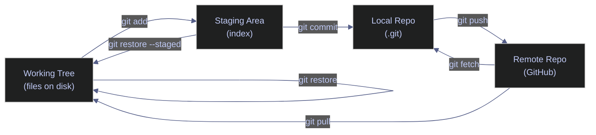

## Checking Status and Reviewing Changes

The first thing to do when starting work — or before any commit — is to understand the current state of the repository: what branch you are on, what has changed, what is staged, and what is untracked.

### Git | status | inspect working tree and staging area

#### Show full working directory state

**When to run:** at the start of a work session, before staging, before committing, and after any operation that modifies files.
**Trigger:** beginning of any workflow step, or after pull/merge/rebase to verify the result.
**Context:** runs locally, read-only, no side effects.
**Purpose:** see which files are modified, staged, untracked, or in conflict — the starting point for every decision.

*Display current branch, staged changes, unstaged changes, and untracked files.*

```bash
git status
```

```text
On branch feat/add-signals
Changes not staged for commit:
  (use "git add <file>..." to update what will be committed)
  (use "git restore <file>..." to discard changes in working directory)
	modified:   src/pipeline.py

Untracked files:
  (use "git add <file>..." to include in what will be committed)
	src/signals/

no changes added to commit (use "git add" and/or "git commit -a")
```

The output has four zones: (1) branch name and tracking status, (2) staged changes ("Changes to be committed"), (3) unstaged modifications ("Changes not staged for commit"), and (4) untracked files. If a zone has no files, it is omitted.

#### Show compact one-line-per-file status

**When to run:** when the full output is too verbose and you need a quick scan.
**Trigger:** routine check during rapid iteration.
**Context:** read-only. The two-column format uses position to encode state: left column = staging area, right column = working tree.
**Purpose:** fast overview of all changed files in a scannable format.

*Display one file per line with two-character status codes.*

```bash
git status -s
```

```text
 M src/pipeline.py
?? src/signals/
```

| Code | Position | Meaning |
|---|---|---|
| `M` | Left | File is modified and staged |
| `M` | Right | File is modified but not staged |
| `A` | Left | New file staged for commit |
| `D` | Left | File deletion staged |
| `D` | Right | File deleted from working tree but not staged |
| `??` | Both | Untracked file |
| `R` | Left | File renamed and staged |
| `UU` | Both | Unmerged — merge conflict |

### Git | diff | review changes line by line

#### View unstaged changes

**When to run:** before `git add`, to review what you have modified.
**Trigger:** after editing files, before staging.
**Context:** read-only. Compares working tree against the staging area.
**Purpose:** verify exactly what changed before deciding what to stage.

*Show the line-by-line difference between working tree and staging area.*

```bash
git diff
```

```text
diff --git a/src/pipeline.py b/src/pipeline.py
index c54f1d6..f93b9a2 100644
--- a/src/pipeline.py
+++ b/src/pipeline.py
@@ -18,3 +18,9 @@ def transform(raw: dict) -> dict:
         "close_price": float(raw["close"]),
         "volume": int(raw["volume"]),
     }
+
+
+def validate(record: dict) -> bool:
+    """Validate a transformed record before loading."""
+    required = {"ticker", "close_price", "volume"}
+    return required.issubset(record.keys()) and record["close_price"] > 0
```

Lines prefixed with `+` are additions. Lines prefixed with `-` are deletions. The `@@` line shows the location in the file (line numbers and context).

#### View staged changes before committing

**When to run:** after `git add`, as a final review before `git commit`.
**Trigger:** pre-commit verification.
**Context:** read-only. Compares the staging area against the last commit — shows exactly what will be committed.
**Purpose:** confirm the commit will contain exactly the intended changes, nothing more.

*Show the difference between the staging area and the last commit.*

```bash
git diff --staged
```

```text
diff --git a/src/signals/__init__.py b/src/signals/__init__.py
new file mode 100644
index 0000000..e69de29
diff --git a/src/signals/momentum.py b/src/signals/momentum.py
new file mode 100644
index 0000000..e329523
--- /dev/null
+++ b/src/signals/momentum.py
@@ -0,0 +1,27 @@
+"""Momentum signal — rate-of-change and RSI for daily close prices."""
+
+import logging
...
```

#### Preview all branch changes for a PR

**When to run:** before opening a pull request, to review the full diff between your branch and `main`.
**Trigger:** PR preparation.
**Context:** read-only. The three-dot syntax (`main...HEAD`) shows changes since the branch diverged from main, excluding changes that landed on main after branching.
**Purpose:** see the complete set of changes that the PR will introduce.

*Show all changes accumulated on the current branch relative to main.*

```bash
git diff main...HEAD --stat
```

```text
 src/pipeline.py         |  6 ++++++
 src/signals/__init__.py |  0
 src/signals/momentum.py | 27 +++++++++++++++++++++++++++
 3 files changed, 33 insertions(+)
```

### Git | log | inspect commit history

#### View recent commit history (compact)

**When to run:** to check what has happened on the branch recently.
**Trigger:** before starting work, after pulling, or when investigating history.
**Context:** read-only. Shows one commit per line in `<short-sha> <subject>` format.
**Purpose:** quick, scannable overview of recent commits.

*Display the last 10 commits in one-line format.*

```bash
git log --oneline -10
```

```text
2c08cf5 feat: add validate function to pipeline
f322cce feat: add momentum signal module with ROC and RSI
7f5dfe6 chore: add pre-commit configuration
71f876e feat: add stock pipeline skeleton with tests and gitignore
0850a8c initial commit: add README
```

#### View history with branch topology

**When to run:** to understand how branches have diverged, merged, or where HEAD sits relative to the remote.
**Trigger:** investigating branch relationships, after fetch, or when debugging history.
**Context:** read-only. Adds an ASCII branch graph and branch/tag labels to each commit line.
**Purpose:** visualize the DAG structure — where branches split, where they merged, and which commits are only on which branches.

*Display commit graph with branch labels.*

```bash
git log --oneline --graph --decorate --all -10
```

```text
* 0565e9a (origin/main, origin/HEAD) refactor: extract symbol loader to utils module
| * 2c08cf5 (HEAD -> feat/add-signals, origin/feat/add-signals) feat: add validate function to pipeline
| * f322cce feat: add momentum signal module with ROC and RSI
|/
* 7f5dfe6 (main) chore: add pre-commit configuration
* 71f876e feat: add stock pipeline skeleton with tests and gitignore
* 0850a8c initial commit: add README
```

The `*` marks commits. Lines connecting `*` marks show parent-child relationships. Branch names in parentheses show which pointers reference each commit. `HEAD ->` indicates the currently checked-out branch.

| Flag | Syntax | Description |
|---|---|---|
| `--oneline` | `git log --oneline` | One commit per line: short SHA + subject |
| `--graph` | `git log --graph` | Draw ASCII DAG graph on the left |
| `--decorate` | `git log --decorate` | Show branch names and tags next to commits |
| `--all` | `git log --all` | Show all branches, not just the current one |
| `-n` | `git log -10` | Limit output to the last *n* commits |
| `--stat` | `git log --stat` | Show file change summary per commit |
| `-p` | `git log -p` | Show full diff for each commit |
| `--author` | `git log --author="alp78"` | Filter by author name or email |
| `--since` | `git log --since="2 weeks ago"` | Filter by date |
| `--grep` | `git log --grep="fix:"` | Filter by commit message pattern |
| `--follow` | `git log --follow -- file.py` | Track a file through renames |

## Staging Changes

Staging is the act of selecting which changes to include in the next commit. The staging area (index) sits between your working tree and your commit history — it lets you craft precise, atomic commits.

### Git | add | stage files for the next commit

#### Stage a specific file

**When to run:** after editing a file, when you want to include that file in the next commit.
**Trigger:** ready to commit a specific change.
**Context:** state-changing — copies the current file content into the staging area. Does not create a commit.
**Purpose:** mark a specific file for inclusion in the next commit.

*Stage a single file by name.*

```bash
git add src/signals/momentum.py
```

#### Stage all changes in a directory

**When to run:** when all changes under a directory belong in the same commit.
**Trigger:** completing work on a module or package.
**Context:** stages all modified, new, and deleted files under the specified paths.
**Purpose:** batch-stage an entire directory without naming each file.

*Stage all files under the specified directories.*

```bash
git add src/signals/ tests/
```

#### Stage all changes in the entire repo

**When to run:** when every change in the repo belongs in the next commit.
**Trigger:** rarely — typically only in personal repos or after careful review.
**Context:** `-A` stages every change across the entire repo: new, modified, and deleted files.
**Purpose:** stage everything at once.

*Stage all new, modified, and deleted files in the repository.*

```bash
git add -A
```

> [!warning] Avoid git add -A in production repos
>
> In repositories with sensitive files (`.env`, service account keys, credentials), `git add -A` can accidentally stage secrets or large binary files. Use `.gitignore` as a safety net, but do not rely on it as your primary defense.

> [!success] Stage files explicitly by name
>
> Name files or directories directly: `git add src/signals/momentum.py`. Use `git add -p` to review and cherry-pick individual hunks within a file before staging.

#### Interactive staging — choose hunks within files

**When to run:** when a file contains multiple unrelated changes and you want to commit them separately.
**Trigger:** a file has both a bug fix and a new feature, or formatting changes mixed with logic changes.
**Context:** patch mode presents each change hunk and prompts `y/n/s/e` to stage, skip, split, or edit it.
**Purpose:** craft atomic commits by selecting specific hunks from a file, not the entire file.

> [!info]- Hunk selection options in patch mode
>
> - `y` — stage this hunk
> - `n` — skip this hunk
> - `s` — split the hunk into smaller hunks (if possible)
> - `e` — manually edit the hunk
> - `q` — quit, do not stage remaining hunks
> - `?` — show help for all options

*Enter interactive patch mode to stage individual hunks.*

```bash
git add -p
```

#### Unstage a file — keep working changes

**When to run:** after accidentally staging a file that should not be in the next commit.
**Trigger:** `git status` shows a file under "Changes to be committed" that does not belong there.
**Context:** removes the file from the staging area but keeps the working tree changes intact. `git restore --staged` (Git 2.23+) is the modern form; `git reset HEAD <file>` is the legacy equivalent.
**Purpose:** undo a `git add` without losing your edits.

*Remove a file from the staging area without discarding changes.*

```bash
git restore --staged src/pipeline.py
```

| Flag | Syntax | Description |
|---|---|---|
| *(file)* | `git add <file>` | Stage a specific file |
| *(dir)* | `git add <dir>/` | Stage all changes under a directory |
| `-A` | `git add -A` | Stage all changes (new, modified, deleted) across the repo |
| `.` | `git add .` | Stage all changes in the current directory and below |
| `-p` | `git add -p` | Interactive patch mode — stage individual hunks |
| `-u` | `git add -u` | Stage modifications and deletions (not new files) |
| `-n` | `git add -n` | Dry run — show what would be staged without staging |

## Creating Commits

Each `git commit` records a snapshot of the staging area as a new node in the commit DAG. The branch pointer advances to the new commit, and HEAD follows it.


*A linear commit history on `main`. Commit A is the initial commit, B builds on A, and C builds on B. Each commit stores a snapshot of the staged files and a pointer to its parent. The branch pointer `main` moves forward with each new commit, and `HEAD` follows it.*

### Git | commit | create a snapshot of staged changes

#### Create a commit with an inline message

**When to run:** after staging the changes you want to record.
**Trigger:** `git diff --staged` confirms the right changes are staged.
**Context:** state-changing — creates a new commit object in `.git`. The commit is local until pushed.
**Purpose:** permanently record the staged snapshot with a descriptive message.

*Create a commit with the specified message.*

```bash
git commit -m "feat: add momentum signal module with ROC and RSI"
```

```text
[feat/add-signals f322cce] feat: add momentum signal module with ROC and RSI
 2 files changed, 27 insertions(+)
 create mode 100644 src/signals/__init__.py
 create mode 100644 src/signals/momentum.py
```

The output shows: the branch, the short SHA, the message, and a summary of files changed.

#### Create a commit with title and body

**When to run:** when the commit needs a longer explanation — motivation, context, caveats, or a link to an issue.
**Trigger:** complex changes that a one-line subject cannot explain.
**Context:** pass a second `-m` flag to add a body below the subject line. Git separates them with a blank line in the commit object. The subject should be under 72 characters.
**Purpose:** provide context for reviewers and future investigators.

*Create a commit with a subject line and a description body.*

```bash
git commit -m "feat: add validate function to pipeline" -m "Validates transformed records before BigQuery load. Checks required fields and positive close_price."
```

```text
[feat/add-signals 2c08cf5] feat: add validate function to pipeline
 1 file changed, 6 insertions(+)
```

#### Amend the last commit

**When to run:** to fix a typo in the last commit message, or to add a forgotten file to the last commit.
**Trigger:** immediately after committing, before pushing, when you notice an error.
**Context:** state-changing — replaces the last commit with a new one. The old commit gets a new SHA and is removed from the branch tip, but survives in the reflog for ~90 days.
**Purpose:** correct the most recent commit without creating a new one.

**Before amend:**


*Before amend: A and B are good commits on `main`. C (marked red) is the most recent commit — its message contains a typo or it is missing a file. `HEAD` and the branch pointer both point to C.*

**After amend:**

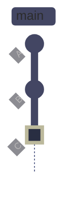

*After amend: `--amend` discards C and creates C' (marked green) in its place. C' has a new SHA, the corrected message, and optionally includes newly staged files. The branch pointer now points to C'. The original C is no longer on any branch but remains recoverable via `git reflog` for ~90 days.*

*Replace the last commit with a corrected version.*

```bash
git commit --amend -m "feat: add momentum signal module with ROC and RSI calculations"
```

> [!danger] Never amend a pushed commit on a shared branch
>
> Amending a pushed commit rewrites its SHA, creating a fork in history. Anyone who has pulled the original commit will get "divergent branches" errors on their next pull. On shared branches, use `git revert` instead.

> [!success] Safe alternatives to amend after push
>
> - **Shared branches:** use `git revert <SHA>` to create a reverse commit without rewriting history.
> - **Personal feature branches** (sole contributor, not yet reviewed): amend locally, then push with `git push --force-with-lease` to avoid overwriting concurrent pushes.

### Conventional Commit Format

Use present tense imperative ("add", "fix", "update" — not "added", "fixed"). Keep the first line under 72 characters.

| Prefix | Use | Example |
|---|---|---|
| `feat:` | New feature or functionality | `feat: add daily signal fetcher` |
| `fix:` | Bug fix | `fix: prevent forward-fill beyond today's date` |
| `refactor:` | Code restructuring (no behavior change) | `refactor: read symbols from DB instead of files` |
| `docs:` | Documentation only | `docs: add pipeline architecture diagram` |
| `test:` | Adding or updating tests | `test: add unit tests for signal transforms` |
| `chore:` | Maintenance (dependencies, configs) | `chore: update yfinance to 0.2.31` |
| `ci:` | CI/CD changes | `ci: add Python 3.12 to test matrix` |
| `perf:` | Performance improvement | `perf: batch BigQuery inserts by 1000 rows` |
| `build:` | Build system or dependencies | `build: pin pandas to >=2.0,<3.0` |

> [!tip] Write the message for the reviewer, not for yourself
>
> A commit message explains **why** the change was made, not what files were touched (that is visible in the diff). Bad: `update pipeline.py`. Good: `fix: prevent NaN close prices from reaching BigQuery load`.

## Pushing to the Remote

Pushing uploads local commits to the remote repository so teammates can see them. Push is the transition from "local work" to "shared work."

### Git | push | upload local commits to the remote

#### Push commits on a tracked branch

**When to run:** after committing, when you are ready for the team to see the changes.
**Trigger:** work is ready for review or collaboration.
**Context:** state-changing on the remote. Sends your local commits to the tracked remote branch. Fails if the remote has commits you do not have (non-fast-forward rejection).
**Purpose:** share your commits with the team.

*Upload local commits to the remote tracking branch.*

```bash
git push
```

```text
To https://github.com/alp78/git-lab.git
   2c08cf5..f89093f  feat/add-signals -> feat/add-signals
```

#### Push a new branch and set upstream tracking

**When to run:** the first time you push a branch that does not yet exist on the remote.
**Trigger:** after creating a feature branch and making the first commit.
**Context:** `-u` (or `--set-upstream`) creates the remote branch and links the local branch to it. After this, plain `git push` works without specifying the remote or branch name.
**Purpose:** publish a new branch to the remote and establish tracking.

*Push a new branch to the remote and set upstream tracking.*

```bash
git push -u origin feat/add-signals
```

```text
To https://github.com/alp78/git-lab.git
 * [new branch]      feat/add-signals -> feat/add-signals
branch 'feat/add-signals' set up to track 'origin/feat/add-signals'.
```

#### Delete a remote branch

**When to run:** after a PR has been merged and the branch is no longer needed.
**Trigger:** post-merge cleanup.
**Context:** state-changing on the remote — removes the branch from the hosting platform. The `--delete-branch` flag in `gh pr merge` does this automatically.
**Purpose:** keep the remote tidy by removing stale branches.

*Remove a branch from the remote repository.*

```bash
git push origin --delete feat/old-branch
```

| Flag | Syntax | Description |
|---|---|---|
| *(default)* | `git push` | Push current branch to its tracked upstream |
| `-u` / `--set-upstream` | `git push -u origin <branch>` | Push and set upstream tracking reference |
| `--delete` | `git push origin --delete <branch>` | Delete a remote branch |
| `--force-with-lease` | `git push --force-with-lease` | Force push only if remote matches your last fetch |
| `--force` | `git push --force` | Force push — overwrites remote unconditionally (**dangerous**) |
| `--tags` | `git push --tags` | Push all local tags to the remote |
| `--dry-run` | `git push --dry-run` | Show what would be pushed without pushing |

## Pulling from the Remote

Pulling downloads new commits from the remote and integrates them into your current branch. There are three levels of caution: fetch (inspect only), pull with merge, and pull with rebase.

### Git | fetch | download without merging

#### Fetch all new data from the remote

**When to run:** to check what teammates have pushed without modifying your local branches or working tree.
**Trigger:** start of a work session, before deciding to merge or rebase.
**Context:** read-only locally. Downloads new commits, branches, and tags. Updates remote-tracking branches (`origin/main`, etc.) but does not touch your files or local branches.
**Purpose:** safely inspect what has changed on the remote before integrating.

*Download new data from the remote without merging.*

```bash
git fetch
```

```text
From https://github.com/alp78/git-lab
   7f5dfe6..0565e9a  main       -> origin/main
```

After fetching, inspect the new commits before integrating:

*Check how many commits your local main is behind the remote.*

```bash
git log main..origin/main --oneline
```

> [!tip] Fetch is always safe
>
> `git fetch` never modifies your files, your staging area, or your local branches. When in doubt about what has changed on the remote, fetch first and inspect with `git log origin/main --oneline` before pulling.

### Git | pull | download and integrate remote changes

#### Pull with merge (default)

**When to run:** when you want to integrate remote changes into your current branch.
**Trigger:** after `git fetch` shows new commits, or directly when starting work.
**Context:** state-changing — equivalent to `git fetch` + `git merge`. If your local branch has diverged from the remote, creates a merge commit. May cause merge conflicts.
**Purpose:** bring your local branch up to date with the remote.

*Download and merge the latest remote changes.*

```bash
git pull
```

```text
Updating 7f5dfe6..3dfc084
Fast-forward
 src/pipeline.py |  5 +++--
 src/utils.py    | 12 ++++++++++++
 2 files changed, 15 insertions(+), 2 deletions(-)
 create mode 100644 src/utils.py
```

When the output says "Fast-forward," your branch had no local commits that the remote did not — Git simply moved the pointer forward without creating a merge commit.

#### Pull with rebase for linear history

**When to run:** when you want to integrate remote changes without creating a merge commit — keeping history linear.
**Trigger:** your branch has local commits and the remote has new commits (divergence).
**Context:** equivalent to `git fetch` + `git rebase`. Replays your local commits on top of the remote commits, rewriting their SHAs. May cause conflicts that must be resolved per-commit during the rebase.
**Purpose:** maintain a clean, linear commit history without noise merge commits.

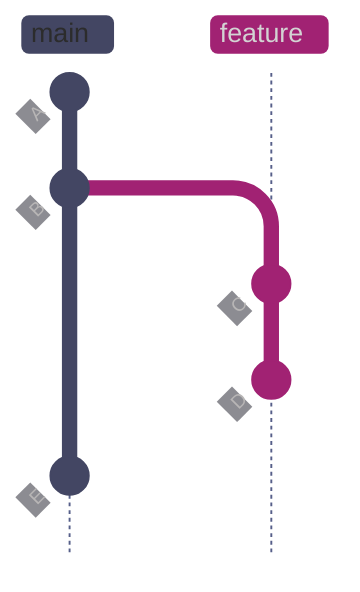

*Before pull --rebase: both branches share ancestors A and B. After branching, the feature branch added commits C and D locally. Meanwhile, a teammate pushed commit E to `main` on the remote. The two branches have diverged — they share a common base (B) but have independent commits that the other branch does not have.*

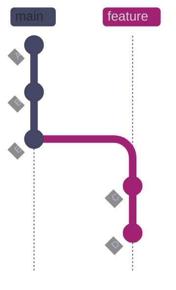

*After pull --rebase: Git first fast-forwards `main` to include E, then replays the feature branch's commits one at a time on top of E. C becomes C' and D becomes D' — the diffs are identical but the SHAs change because each commit now has a different parent. The result is a clean linear history where the feature work appears to have started after E, eliminating the divergence without a merge commit.*

*Pull remote changes and rebase local commits on top.*

```bash
git pull --rebase
```

> [!warning] Pull without rebase creates noise merge commits
>
> The default `git pull` creates a merge commit every time your branch has diverged from the remote — even by a single commit. Over time this pollutes history with dozens of "Merge branch 'main' of ..." commits that make `git log` unreadable.

> [!success] Set rebase as the default pull strategy
>
> Configure rebase globally: `git config --global pull.rebase true`. After this, plain `git pull` always replays your local commits on top of the remote branch, keeping history linear without requiring the `--rebase` flag.

> [!warning] Pull with uncommitted changes
>
> `git pull` can refuse to run or create surprise merge conflicts if you have uncommitted changes in files that the remote also modified.

> [!success] Stash first, then pull
>
> Run `git stash && git pull && git stash pop` to temporarily shelve your changes, pull, then restore them. If `stash pop` causes conflicts, resolve them normally.

| Flag | Syntax | Description |
|---|---|---|
| *(default)* | `git pull` | Fetch + merge from tracked upstream |
| `--rebase` | `git pull --rebase` | Fetch + rebase local commits on top of remote |
| `--ff-only` | `git pull --ff-only` | Only pull if fast-forward is possible (no divergence) |
| `--no-commit` | `git pull --no-commit` | Merge but do not auto-commit (inspect first) |
| `--autostash` | `git pull --rebase --autostash` | Auto-stash and restore uncommitted changes around the rebase |

## The Feature Branch Workflow

This is the standard workflow used by data engineering teams. A feature branch isolates work-in-progress from `main` — commits accumulate on the branch, are reviewed via PR, then squash-merged into `main` as a single clean commit.

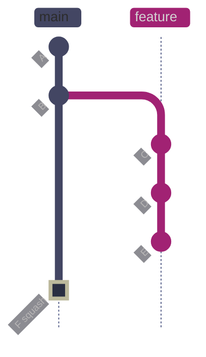

*A feature branch workflow. The branch was created from B on `main`. Commits C (initial implementation), D (refinement), and E (review fix) accumulated on the feature branch during development and code review. When the PR is approved, all three commits are squash-merged into a single commit F (marked green) on `main`. F contains the combined diff of C+D+E but appears as one clean entry in `main`'s history. The feature branch is then deleted.*

### Git | switch | create and switch branches

#### Start a feature branch from updated main

**When to run:** at the start of a new task or feature.
**Trigger:** a ticket, task, or idea is ready to be worked on.
**Context:** `git switch -c` creates a new branch and switches to it. Always branch from an up-to-date `main` to avoid inheriting stale code.
**Purpose:** isolate your work from the main line of development.

> [!todo] Complete feature branch lifecycle
>
> 1. **Update main:** `git switch main && git pull`
> 2. **Create branch:** `git switch -c feat/add-signals`
> 3. **Make changes:** edit files, run tests
> 4. **Stage and commit:** `git add src/signals/ && git commit -m "feat: add momentum signals"`
> 5. **Push branch:** `git push -u origin feat/add-signals`
> 6. **Create PR:** `gh pr create --title "feat: add momentum signal module"`
> 7. **Address review:** make fixes, push new commits
> 8. **Merge:** `gh pr merge --squash --delete-branch`
> 9. **Clean up locally:** `git switch main && git pull && git branch -d feat/add-signals`

*Switch to main, pull latest, and create a new feature branch.*

```bash
git switch main && git pull
```

```text
Switched to branch 'main'
Your branch is up to date with 'origin/main'.
Already up to date.
```

*Create and switch to a new feature branch.*

```bash
git switch -c feat/add-signals
```

```text
Switched to a new branch 'feat/add-signals'
```

> [!info] git switch vs git checkout
>
> `git switch` (Git 2.23+) is the modern replacement for `git checkout` when switching branches: `git switch -c` replaces `git checkout -b`, and `git switch <branch>` replaces `git checkout <branch>`. Both forms work — `git checkout` still exists but mixes branch-switching with file-restoring, which can be confusing.

### Git | gh pr | create and merge pull requests

#### Create a pull request from the command line

**When to run:** after pushing a feature branch, when the work is ready for review.
**Trigger:** `git push -u origin feat/add-signals` succeeded.
**Context:** requires GitHub CLI (`gh`). Creates the PR on GitHub with title, body, and optionally reviewers, labels, and milestones.
**Purpose:** open a pull request for code review without leaving the terminal.

*Create a PR for the current branch.*

```bash
gh pr create --title "feat: add momentum signal module" --body "Add ROC, RSI, and moving average functions to the signals package.

## Changes
- New src/signals/momentum.py with rate_of_change, rsi, and moving_average
- Add validate function to pipeline module

## Test plan
- Unit tests for each signal function
- Integration test with sample price data"
```

```text
https://github.com/alp78/git-lab/pull/1
```

#### Merge a PR with squash and delete the branch

**When to run:** after the PR is approved and CI passes.
**Trigger:** approval and green CI status.
**Context:** `--squash` combines all branch commits into a single commit on `main`. `--delete-branch` removes the remote branch after merging.
**Purpose:** land the feature on main as a single clean commit.

*Squash-merge the PR and delete the remote branch.*

```bash
gh pr merge --squash --delete-branch
```

### Branch Sync Decisions

When your feature branch is behind `main` (because teammates have merged other PRs), you need to bring it up to date. The choice between merge and rebase depends on the situation.

> [!question] Merge or rebase to sync with main?
>
> - **Rebase** (preferred for feature branches): `git fetch && git rebase origin/main`. Produces a clean linear history. Safe when you are the only person working on the branch.
> - **Merge** (preferred for shared branches): `git fetch && git merge origin/main`. Preserves the exact branching history. Required when multiple people are committing to the branch.
> - **Rule of thumb:** if you are the sole author of the branch, rebase. If others have pushed commits to it, merge.

> [!danger] Never rebase a shared branch
>
> Rebasing rewrites commit SHAs. If anyone else has pulled commits from the branch, their history will diverge from yours, causing "divergent branches" errors and potential data loss. Only rebase branches where you are the sole contributor.

> [!success] Use --force-with-lease after rebase
>
> After rebasing a branch you have already pushed, use `git push --force-with-lease` instead of `--force`. This refuses to overwrite the remote if it has commits you have not fetched — protecting against concurrent pushes by teammates.

| Situation | Action | Command |
|---|---|---|
| Feature branch behind main, sole author | Rebase onto main | `git fetch && git rebase origin/main` |
| Feature branch behind main, shared branch | Merge main into branch | `git fetch && git merge origin/main` |
| Push rejected (non-fast-forward) on personal branch | Pull with rebase | `git pull --rebase` |
| Push rejected on shared branch | Pull with merge | `git pull` |
| After rebase, need to update remote | Force push safely | `git push --force-with-lease` |
| After amend on unpushed commit | Normal push | `git push` |
| After amend on pushed personal branch | Force push safely | `git push --force-with-lease` |

## Cleaning Up Branch History Before Review

Before opening or updating a PR, senior engineers clean up their feature branch history — squashing fixup commits, rewording messages, and reordering commits so the branch tells a clear story for reviewers. Interactive rebase is the primary tool for this.

### Git | rebase -i | interactive history cleanup

Interactive rebase lets you edit, reorder, squash, or drop individual commits on your branch. This is the most common pre-PR history-cleanup workflow. Each commit is listed in an editor with an action keyword that tells Git what to do with it.

> [!info]- Interactive rebase action keywords
>
> Each commit in the interactive rebase editor is listed oldest-first with an action keyword:
>
> - `pick` — use the commit as-is
> - `reword` — use the commit but open the editor to change its message
> - `edit` — pause the rebase at this commit so you can amend it (add files, split it, etc.)
> - `squash` — combine this commit with the previous one, keeping both messages (editor opens to merge them)
> - `fixup` — combine this commit with the previous one, discarding this commit's message
> - `drop` — remove the commit entirely from the branch

#### Clean up a feature branch before opening a PR

**When to run:** after development is complete, before opening or updating a PR.
**Trigger:** the branch has accumulated WIP commits, typo fixes, or debug commits that should not appear in the final review.
**Context:** local operation that rewrites history. Only safe on branches where you are the sole contributor, or branches that have not been pulled by others. After rebasing, you must force-push with `--force-with-lease`.
**Purpose:** produce a clean, reviewable commit history that tells a coherent story.

*View the commits on the branch before cleanup.*

```bash
git log --oneline -5
```

```text
ba61ab0 chore: update README with pipeline docs
4752f8d fixup! feat: add data quality checks
7b41c1b feat: add data quality checks
72edabc merge: integrate centralized logging module
b948ccd feat: add centralized logging module
```

The branch has three commits: the main feature (data quality checks), a fixup commit that should be folded into it, and a documentation update. The `fixup!` prefix signals that `4752f8d` should be absorbed into `7b41c1b`.

#### Use --autosquash to automatically fold fixup commits

**When to run:** when your branch has commits prefixed with `fixup!` or `squash!` that match earlier commit messages.
**Trigger:** you used `git commit --fixup=<SHA>` during development to create commits that should be folded into earlier work.
**Context:** `--autosquash` automatically reorders and marks fixup/squash commits in the interactive editor. Requires the `-i` flag.
**Purpose:** one-command cleanup of fixup commits without manual editor editing.

*Run interactive rebase with autosquash to fold fixup commits.*

```bash
git rebase -i --autosquash HEAD~3
```

```text
Successfully rebased and updated refs/heads/demo/rebase-cleanup.
```

*Verify the cleaned-up history — the fixup commit has been absorbed.*

```bash
git log --oneline -3
```

```text
8b32aae chore: update README with pipeline docs
6887984 feat: add data quality checks
72edabc merge: integrate centralized logging module
```

The three commits have been reduced to two: the fixup commit was folded into the feature commit, and the documentation update remains separate. The branch is now clean for PR review.

> [!tip] The fixup commit workflow
>
> During development, when you spot an issue in an earlier commit:
>
> 1. **Fix the issue** and stage the fix: `git add <file>`
> 2. **Create a fixup commit:** `git commit --fixup=<SHA-of-original-commit>`
> 3. Git names it `fixup! <original message>` automatically
> 4. **Before PR:** run `git rebase -i --autosquash HEAD~N` — fixup commits are automatically folded into their targets
>
> This is cleaner than amending, especially when fixing commits that are not the most recent.

> [!danger] Never interactively rebase commits that have been pulled by others
>
> Interactive rebase rewrites commit SHAs. If anyone else has pulled your branch, their local history will diverge from yours. Only rebase branches where you are the sole contributor.

> [!success] Force-push safely after interactive rebase
>
> After rebasing a branch you have already pushed, use `git push --force-with-lease` to update the remote. This refuses to overwrite the remote if it has commits you have not fetched — protecting against concurrent pushes.

| Flag | Syntax | Description |
|---|---|---|
| `-i` | `git rebase -i <base>` | Interactive rebase — edit, reorder, squash, or drop commits |
| `--autosquash` | `git rebase -i --autosquash` | Automatically reorder fixup! and squash! commits |
| `--fixup=<SHA>` | `git commit --fixup=<SHA>` | Create a fixup commit targeting the specified commit |
| `--squash=<SHA>` | `git commit --squash=<SHA>` | Create a squash commit targeting the specified commit |
| `--abort` | `git rebase --abort` | Cancel rebase and restore original branch state |
| `--continue` | `git rebase --continue` | Resume rebase after resolving a conflict |
| `--skip` | `git rebase --skip` | Skip the current conflicting commit |

## Cherry-Pick for Backports and Hotfixes

In real teams, engineers often need to apply a single commit from one branch to another without merging the entire branch. Cherry-pick copies a commit's diff as a new commit on the current branch. The most common use cases are backporting a bugfix to a release branch and applying a hotfix to multiple branches simultaneously.

### Git | cherry-pick | copy a commit between branches

#### Backport a hotfix to a release branch

**When to run:** when a critical fix lands on `main` and must also be applied to an active release branch that cannot accept a full merge.
**Trigger:** a production bug is fixed on `main`, and the fix must be backported to `release/2026-Q2` without merging unrelated features.
**Context:** local operation. Creates a new commit on the target branch with the same diff but a different SHA. The `-x` flag appends "(cherry picked from commit ...)" to the message, documenting the source for auditability.
**Purpose:** selectively apply one commit's changes to a different branch.

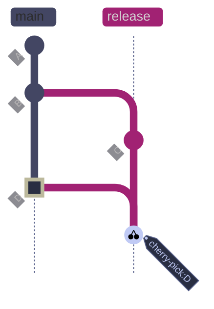

*Cherry-pick backport: commit D (marked green) is a hotfix that landed on `main`. The release branch diverged at B and has its own commit C (release prep). Cherry-pick copies D's diff onto the release branch as a new commit D' with a different SHA. D' includes "(cherry picked from commit ...)" in its message when `-x` is used. The original D remains on main untouched. D' and D have identical diffs but different SHAs and different parents.*

*Switch to the release branch and cherry-pick the hotfix with traceability.*

```bash
git switch release/2026-Q2
git cherry-pick -x 3c60ed4
```

```text
[release/2026-Q2 18b043e] fix: handle NaN values in price feed
 Date: Sun Apr 12 17:19:10 2026 +0200
 1 file changed, 8 insertions(+)
 create mode 100644 src/hotfix_price_feed.py
```

*Verify the cherry-pick message includes the source reference.*

```bash
git log -1 --format="%B"
```

```text
fix: handle NaN values in price feed

(cherry picked from commit 3c60ed47aeac5fd3223cc8fc7c0bee7497444788)
```

> [!warning] Cherry-pick creates duplicate commits
>
> The cherry-picked commit and the original have different SHAs but identical diffs. If both branches are later merged, Git may flag the duplicate changes as a conflict. This is especially common in data engineering repos where the same migration file appears on multiple branches.

> [!success] Always use -x for traceability
>
> The `-x` flag appends the source commit SHA to the message. When a reviewer or incident responder sees the cherry-picked commit, they can immediately trace it back to the original fix on `main`. Without `-x`, the connection is invisible.

> [!tip] Cherry-pick workflow for incident response
>
> 1. **Fix the bug on main** — create a branch, fix, get it reviewed, merge to main
> 2. **Identify the fix commit SHA:** `git log --oneline -5`
> 3. **Switch to the release branch:** `git switch release/2026-Q2`
> 4. **Cherry-pick with traceability:** `git cherry-pick -x <SHA>`
> 5. **Push the release branch:** `git push`
> 6. **Tag the release patch:** `git tag -a v2026.Q2.1 -m "patch: NaN price feed fix"`

| Flag | Syntax | Description |
|---|---|---|
| `-x` | `git cherry-pick -x <SHA>` | Append "(cherry picked from commit ...)" to the message |
| `-n` | `git cherry-pick -n <SHA>` | Apply changes without committing (stage only) |
| `-e` | `git cherry-pick -e <SHA>` | Edit the commit message before committing |
| `--abort` | `git cherry-pick --abort` | Cancel cherry-pick and restore pre-operation state |
| `--continue` | `git cherry-pick --continue` | Resume after resolving a conflict |
| `--skip` | `git cherry-pick --skip` | Skip the current commit and continue |

## Parallel-Context Work with Worktrees

When you need to work on two branches simultaneously — a hotfix while mid-feature, or a code review while running a long build — `git worktree` provides a better alternative to the stash-switch-restore cycle. Each worktree is a separate directory linked to the same repository, with its own checked-out branch and index.

### Git | worktree | concurrent branch checkouts

#### Work on a hotfix without leaving your feature branch

**When to run:** when you need to switch context to another branch but do not want to stash, commit WIP, or disrupt your current working tree.
**Trigger:** urgent hotfix needed while you have uncommitted work on a feature branch, or you need to compare behavior across branches side-by-side.
**Context:** local operation. Creates a new directory linked to the same `.git` directory. You cannot check out a branch that is already checked out in another worktree. All worktrees share the same commit history, reflog, and configuration.
**Purpose:** eliminate the stash-switch-restore churn for parallel work.

*Create a worktree for the release branch in a sibling directory.*

```bash
git worktree add ../git-lab-hotfix release/2026-Q2
```

```text
Preparing worktree (checking out 'release/2026-Q2')
HEAD is now at 18b043e fix: handle NaN values in price feed
```

*List active worktrees to see all checked-out branches.*

```bash
git worktree list
```

```text
C:/Users/aperi/DEV/git-lab        3c60ed4 [main]
C:/Users/aperi/DEV/git-lab-hotfix 18b043e [release/2026-Q2]
```

Now you can work in `../git-lab-hotfix` on the release branch while your feature branch remains untouched in the main directory. When done:

*Remove the worktree when the parallel work is finished.*

```bash
git worktree remove ../git-lab-hotfix
```

> [!tip] When to use worktrees vs stash
>
> - **Stash** is good for quick context switches (< 5 minutes) — review a PR, check a config, run a single test.
> - **Worktrees** are better for sustained parallel work — running a long build on one branch while developing on another, or comparing pipeline outputs between branches side-by-side.
> - **Rule of thumb:** if you find yourself stashing and popping more than twice in an hour, use a worktree instead.

> [!tip] Worktrees for data engineering
>
> Worktrees are particularly useful when:
>
> - Running a long `dbt build` or `pytest` suite on one branch while continuing development on another
> - Comparing query outputs between a feature branch and `main` side-by-side
> - Applying a hotfix to a release branch while keeping a migration-in-progress untouched

| Flag | Syntax | Description |
|---|---|---|
| `add` | `git worktree add <path> <branch>` | Create a new worktree for a branch |
| `list` | `git worktree list` | List all active worktrees |
| `remove` | `git worktree remove <path>` | Remove a worktree directory |
| `prune` | `git worktree prune` | Clean up stale worktree metadata |
| `--force` | `git worktree remove --force <path>` | Remove even with uncommitted changes |

## Handling Merge Conflicts

A merge conflict occurs when two branches modify the same lines in the same file and Git cannot determine which version to keep. Conflicts must be resolved manually.

### Git | merge conflict | resolve overlapping changes

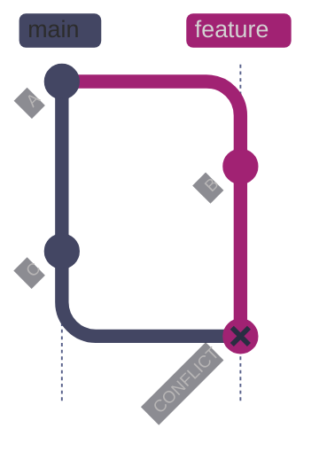

*A merge conflict scenario. Commit A adds `config.yaml` with `timeout_seconds: 300` and `retry_count: 3`. The feature branch is created from A and commit B changes those values to `timeout_seconds: 600` and `retry_count: 5`. Independently, commit C on `main` changes the same lines to `timeout_seconds: 900` and `retry_count: 2`. When the feature branch attempts to merge `main`, Git finds that both branches modified the same lines in the same file and cannot determine which version to keep — the merge halts at CONFLICT (marked red), requiring manual resolution before a commit can be created.*

#### How conflicts happen

Conflicts arise when:
1. Two branches modify the same line(s) in the same file
2. One branch deletes a file that the other branch modifies
3. Both branches add a file with the same name but different content

Git can auto-merge changes that touch different parts of a file. It only reports a conflict when changes overlap.

#### Recognize conflict markers

When a merge or rebase encounters a conflict, Git writes both versions into the file with marker lines:

```text
<<<<<<< HEAD
  schedule: "0 18 * * 1-5"
  timeout_seconds: 600
  retry_count: 5
=======
  schedule: "0 17 * * 1-5"
  timeout_seconds: 900
  retry_count: 2
>>>>>>> main
```

| Marker | Meaning |
|---|---|
| `<<<<<<< HEAD` | Start of your current branch's version |
| `=======` | Separator between the two versions |
| `>>>>>>> main` | End of the incoming branch's version |

Everything between `<<<<<<<` and `=======` is your version. Everything between `=======` and `>>>>>>>` is the incoming version. You must choose one, combine both, or write something entirely new — then delete all three marker lines.

#### Resolve a merge conflict step by step

> [!todo] Merge conflict resolution procedure
>
> 1. **Run the merge:** `git merge main` — Git reports which files have conflicts.
> 2. **Check status:** `git status` shows conflicted files under "Unmerged paths."
> 3. **Open each conflicted file** and search for `<<<<<<<` markers.
> 4. **Edit the file** — remove the markers and keep the correct content.
> 5. **Stage the resolved file:** `git add <file>` — this tells Git the conflict is resolved.
> 6. **Repeat** for every conflicted file.
> 7. **Complete the merge:** `git commit` (Git auto-generates the merge commit message).
> 8. **Verify:** `git diff HEAD~1` to confirm the result, run tests.

Real example — merging a feature branch that modified `config.yaml` when main also modified it:

*Attempt the merge, which triggers a conflict.*

```bash
git merge main
```

```text
Auto-merging config.yaml
CONFLICT (content): Merge conflict in config.yaml
Automatic merge failed; fix conflicts and then commit the result.
```

*Check which files are in conflict.*

```bash
git status
```

```text
On branch feat/update-timeout
You have unmerged paths.
  (fix conflicts and run "git commit")
  (use "git merge --abort" to abort the merge)

Unmerged paths:
  (use "git add <file>..." to mark resolution)
	both modified:   config.yaml

no changes added to commit (use "git add" and/or "git commit -a")
```

*View the conflict markers in the file.*

```bash
cat config.yaml
```

```text
pipeline:
  name: stock-ingest
<<<<<<< HEAD
  schedule: "0 18 * * 1-5"
  timeout_seconds: 600
  retry_count: 5
=======
  schedule: "0 17 * * 1-5"
  timeout_seconds: 900
  retry_count: 2
>>>>>>> main
  source: yfinance
  target: bigquery
  dataset: raw_prices
```

After editing the file to resolve the conflict (keeping the schedule from main, the timeout from the branch, and a compromised retry count):

*Stage the resolved file and complete the merge.*

```bash
git add config.yaml
git commit -m "merge: reconcile timeout and schedule changes"
```

```text
[feat/update-timeout a793a3f] merge: reconcile timeout and schedule changes
```

#### Abort a merge safely

**When to run:** when you realize the merge should not proceed — the conflict is too complex, you need more information, or you started from the wrong branch.
**Trigger:** mid-conflict, before committing.
**Context:** `git merge --abort` restores the working tree and staging area to the state before the merge started. No data is lost.
**Purpose:** cleanly back out of a merge without leaving partial conflict markers.

*Abort the merge and restore pre-merge state.*

```bash
git merge --abort
```

### Git | rebase conflict | resolve during replay

During a rebase, Git replays your commits one at a time on top of the target branch. A conflict can occur at any replayed commit. The resolution process is per-commit.

**Before rebase** (branch diverged from main):

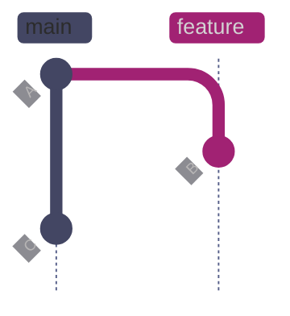

*Before rebase: both branches diverged from A. The feature branch's commit B adds `"exchange": "NYSE"` to the `transform()` return dict. Meanwhile, commit C on `main` adds `"source": "yfinance"` and changes the `"currency"` line to `raw.get("currency", "USD")` in the same function at the same line range. When `git rebase main` runs, Git attempts to replay B on top of C — but B's diff context no longer matches because C changed the surrounding lines, producing a conflict.*

**After rebase** (conflict resolved, commit replayed with new SHA):

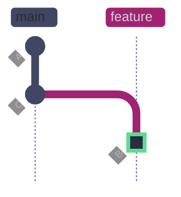

*After rebase: the conflict is resolved by keeping all three fields (`currency` with dynamic lookup from C, `source` from C, and `exchange` from B). Git creates B' (marked green) — a new commit with the resolved content, parented on C instead of A. B' has a different SHA than B because its parent and tree changed. The feature branch now extends linearly from `main` with no divergence.*

#### Resolve a rebase conflict step by step

> [!todo] Rebase conflict resolution procedure
>
> 1. **Start the rebase:** `git rebase main` — Git reports a conflict at a specific commit.
> 2. **Check status:** `git status` shows which commit is being replayed and which files conflict.
> 3. **Open each conflicted file** and resolve the markers.
> 4. **Stage the resolved files:** `git add <file>`.
> 5. **Continue the rebase:** `git rebase --continue` — Git replays the next commit.
> 6. **Repeat** if additional commits also conflict.
> 7. **Verify:** `git log --oneline` and run tests.

Real example — rebasing a branch that added an `exchange` field while main added a `source` field to the same function:

*Start the rebase, which encounters a conflict.*

```bash
git rebase main
```

```text
Rebasing (1/1)Auto-merging src/pipeline.py
CONFLICT (content): Merge conflict in src/pipeline.py
error: could not apply a6d06dd... feat: add exchange field to transform output
hint: Resolve all conflicts manually, mark them as resolved with
hint: "git add/rm <conflicted_files>", then run "git rebase --continue".
hint: You can instead skip this commit: run "git rebase --skip".
hint: To abort and get back to the state before "git rebase", run "git rebase --abort".
Could not apply a6d06dd... # feat: add exchange field to transform output
```

*Check the conflict state.*

```bash
git status
```

```text
interactive rebase in progress; onto 9f5b14f
Last command done (1 command done):
   pick a6d06dd # feat: add exchange field to transform output
No commands remaining.
You are currently rebasing branch 'demo/rebase-conflict' on '9f5b14f'.
  (fix conflicts and then run "git rebase --continue")
  (use "git rebase --skip" to skip this patch)
  (use "git rebase --abort" to check out the original branch)

Unmerged paths:
  (use "git restore --staged <file>..." to unstage)
  (use "git add <file>..." to mark resolution)
	both modified:   src/pipeline.py

no changes added to commit (use "git add" and/or "git commit -a")
```

*View the conflict markers — our branch's version (exchange) vs main's version (source + dynamic currency).*

```text
<<<<<<< HEAD
        "currency": raw.get("currency", "USD"),
        "source": "yfinance",
=======
        "currency": "USD",
        "exchange": "NYSE",
>>>>>>> a6d06dd (feat: add exchange field to transform output)
```

After editing to include all three fields, stage and continue:

*Stage the resolved file and continue the rebase.*

```bash
git add src/pipeline.py
git rebase --continue
```

```text
[detached HEAD 815c081] feat: add exchange field to transform output
 1 file changed, 1 insertion(+)
Successfully rebased and updated refs/heads/demo/rebase-conflict.
```

#### Abort a rebase safely

*Abort the rebase and restore the branch to its pre-rebase state.*

```bash
git rebase --abort
```

> [!warning] Semantic conflicts that Git cannot detect
>
> Git resolves conflicts at the text level — it compares lines. It cannot detect **semantic conflicts** where two changes touch different lines but are logically incompatible. Examples:
>
> - Branch A renames a function; branch B adds a call to the old name in a different file.
> - Branch A changes a column type in a migration; branch B adds a query that depends on the old type.
> - Branch A updates a config default; branch B adds code that assumes the old default.
>
> **Always run tests after resolving conflicts** to catch semantic issues that text-level merging cannot see.

> [!success] Prevent semantic conflicts with CI
>
> Configure branch protection to require passing CI checks before merging. Automated tests, linting, and type checking catch many semantic conflicts that Git's text-level merge cannot detect.

## Recovery and Undo

Mistakes happen. Git provides multiple undo mechanisms at different levels of destructiveness. The key is knowing which tool is appropriate for how far the mistake has propagated.

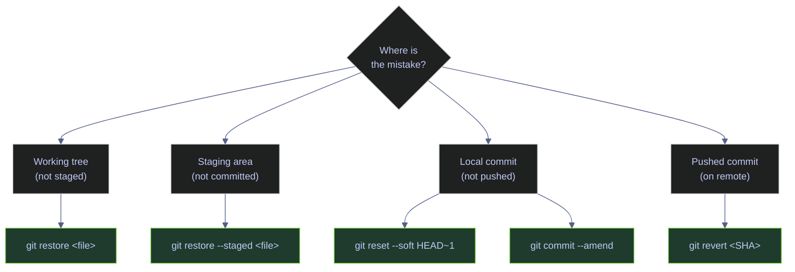

### Git | restore | discard or unstage changes

#### Discard unstaged edits to one file

**When to run:** when you want to throw away your working tree changes to a specific file and revert it to the last committed version.
**Trigger:** you edited a file and want to start over on that file.
**Context:** **destructive** — discards working tree changes permanently. Does not affect staged changes or commits.
**Purpose:** revert a file to its last committed state.

*Discard all working tree changes to a specific file.*

```bash
git restore README.md
```

| What it changes | Working tree — file is reverted to the committed version |
|---|---|
| What it does NOT change | Staging area, commit history |
| Danger level | **Medium** — changes are permanently lost (not recoverable unless the file was also saved elsewhere) |
| Safe after push? | N/A — operates on the working tree only |

#### Discard unstaged edits to all files

*Discard all working tree changes across the entire repo.*

```bash
git restore .
```

> [!danger] git restore . is irreversible
>
> This discards all unstaged changes to every tracked file. There is no undo — the changes are not in the staging area, not committed, and not in the reflog.

> [!success] Stash before discarding if unsure
>
> If you might need the changes later, run `git stash` instead of `git restore .`. The stash preserves the changes and you can retrieve them with `git stash pop`.

#### Unstage a file — keep working changes

*Remove a file from the staging area without discarding edits.*

```bash
git restore --staged src/pipeline.py
```

| What it changes | Staging area — file is removed from "to be committed" |
|---|---|
| What it does NOT change | Working tree (your edits remain), commit history |
| Danger level | **None** — edits are preserved in the working tree |

#### Restore a deleted tracked file

**When to run:** when you accidentally deleted a tracked file from the working tree.
**Trigger:** `git status` shows the file as deleted.
**Context:** restores the file from the last commit.
**Purpose:** recover a deleted file.

*Restore a deleted file from the last commit.*

```bash
git restore src/pipeline.py
```

### Git | clean | remove untracked files

#### Preview what would be removed

**When to run:** before cleaning, to verify which files will be deleted.
**Trigger:** untracked build artifacts, temp files, or scratch files are cluttering the working tree.
**Context:** `-n` is a dry run — shows what would be removed without removing anything.
**Purpose:** inspect before cleaning.

*Dry run — show which untracked files and directories would be removed.*

```bash
git clean -n -d
```

```text
Would remove scratch.py
Would remove tmp_data/
```

#### Remove untracked files and directories

*Delete all untracked files and directories.*

```bash
git clean -fd
```

```text
Removing scratch.py
Removing tmp_data/
```

> [!danger] git clean -fd is irreversible
>
> Deleted untracked files are not in Git history and cannot be recovered. Always run `git clean -n` first to preview.

> [!success] Use -n (dry run) first
>
> Always run `git clean -n -d` before `git clean -fd` to verify what will be removed.

| Flag | Syntax | Description |
|---|---|---|
| `-n` | `git clean -n` | Dry run — show what would be removed |
| `-f` | `git clean -f` | Force — actually remove untracked files |
| `-d` | `git clean -fd` | Include untracked directories |
| `-x` | `git clean -fx` | Also remove files ignored by `.gitignore` |
| `-X` | `git clean -fX` | Remove only ignored files (e.g., build artifacts) |

### Git | reset | move the branch pointer backward


*Before reset: `main` points to C (marked red), which is the commit to undo. Running `git reset --soft HEAD~1` moves the branch pointer and `HEAD` back to B. Commit C is removed from the branch history — `git log` no longer shows it. However, all of C's changes remain in the staging area, ready to be re-committed with a corrected message or different file selection. The orphaned commit C still exists in the object store and is recoverable via `git reflog` for ~90 days.*

#### Undo the last commit — keep changes staged

**When to run:** immediately after committing, when you realize the commit was wrong but want to keep the changes staged for a new commit.
**Trigger:** bad commit message, or you committed from the wrong branch.
**Context:** `--soft` moves the branch pointer back one commit but keeps all changes in the staging area. The commit is removed from the branch but remains in the reflog.
**Purpose:** undo a commit without losing any work.

*Move HEAD back one commit, keep changes staged.*

```bash
git reset --soft HEAD~1
```

| Mode | Changes after reset | Danger level |
|---|---|---|
| `--soft` | Changes remain staged | **Low** — nothing lost |
| `--mixed` (default) | Changes remain in working tree, unstaged | **Low** — nothing lost |
| `--hard` | Changes are discarded entirely | **High** — unrecoverable unless reflog |

> [!danger] Never reset a pushed commit on a shared branch
>
> `git reset` rewrites history. If the commit has been pushed and others have pulled it, reset will cause divergence. Use `git revert` instead.

> [!success] Use git revert for pushed commits
>
> `git revert <SHA>` creates a new commit that undoes the specified commit's changes, without rewriting history. Safe for shared branches.

### Git | revert | safely undo a pushed commit

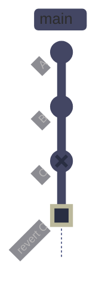

*A revert operation. Commits A and B are good. Commit C (marked red) introduced a bug — for example, it added a `"source"` field that breaks a downstream consumer. Running `git revert C` does not remove C from history. Instead, it creates a new commit "revert C" (marked green) that applies the exact inverse of C's diff: every line C added is deleted, every line C deleted is restored. The branch pointer advances to the revert commit. Both C and the revert remain visible in `git log`, preserving the full audit trail — critical for shared branches where rewriting history is forbidden.*

#### Create a reverse commit

**When to run:** when you need to undo a commit that has already been pushed to a shared branch.
**Trigger:** a bug was introduced by a specific commit, or a change needs to be rolled back in production.
**Context:** state-changing — creates a new commit that is the exact inverse of the specified commit. Does not rewrite history.
**Purpose:** undo a commit's changes while preserving the full audit trail.

*Create a new commit that reverses the changes of the specified commit.*

```bash
git revert 9f5b14f --no-edit
```

```text
[main 5581892] Revert "feat: add source field and dynamic currency"
 1 file changed, 1 insertion(+), 2 deletions(-)
```

| What it changes | Creates a new commit that undoes the target commit's changes |
|---|---|
| What it does NOT change | Existing history — all prior commits remain |
| Danger level | **None** — fully safe on shared branches |
| Safe after push? | **Yes** — this is the correct tool for undoing pushed commits |

### Git | reflog | recover lost commits

#### View the reflog

**When to run:** when you have lost a commit — after a bad reset, a dropped stash, or an aborted rebase — and need to find it.
**Trigger:** `git log` does not show the commit you are looking for, but you know it existed.
**Context:** read-only. The reflog records every position HEAD has pointed to, including commits removed by reset, rebase, or amend. Entries expire after ~90 days.
**Purpose:** find the SHA of a lost commit so you can recover it.

*Show the last 10 reflog entries.*

```bash
git reflog -10
```

```text
9f5b14f HEAD@{0}: checkout: moving from demo/rebase-conflict to main
815c081 HEAD@{1}: rebase (finish): returning to refs/heads/demo/rebase-conflict
815c081 HEAD@{2}: rebase (continue): feat: add exchange field to transform output
9f5b14f HEAD@{3}: rebase (start): checkout main
a6d06dd HEAD@{4}: checkout: moving from main to demo/rebase-conflict
9f5b14f HEAD@{5}: commit: feat: add source field and dynamic currency
4b59560 HEAD@{6}: checkout: moving from demo/rebase-conflict to main
a6d06dd HEAD@{7}: commit: feat: add exchange field to transform output
4b59560 HEAD@{8}: checkout: moving from main to demo/rebase-conflict
4b59560 HEAD@{9}: checkout: moving from feat/update-timeout to main
```

To recover a lost commit, find its SHA in the reflog and create a branch from it:

*Recover a lost commit by creating a branch at its SHA.*

```bash
git branch recovery-branch a6d06dd
```

### Undo Command Comparison

| Command | What it does | What it does NOT change | Danger | Safe after push? |
|---|---|---|---|---|
| `git restore <file>` | Reverts working tree file to last commit | Staging area, history | Medium | N/A |
| `git restore --staged <file>` | Unstages a file | Working tree, history | None | N/A |
| `git reset --soft HEAD~1` | Removes last commit, keeps staged | Working tree | Low | No |
| `git reset --mixed HEAD~1` | Removes last commit, unstages | Working tree | Low | No |
| `git reset --hard HEAD~1` | Removes last commit, discards all changes | Nothing preserved | **High** | No |
| `git revert <SHA>` | Creates a reverse commit | Existing history | None | **Yes** |
| `git commit --amend` | Replaces last commit | Older history | Low | No (unless `--force-with-lease`) |
| `git reflog` | Shows HEAD history (read-only) | Nothing | None | N/A |

## Stashing Changes

Stash temporarily shelves uncommitted changes so you can switch context — switch branches, pull, or handle an urgent task — without committing incomplete work.

### Git | stash | shelve and restore uncommitted changes

#### Save current changes to a named stash

**When to run:** when you need to switch branches or pull but have uncommitted changes you do not want to commit yet.
**Trigger:** need to context-switch (urgent bug, code review, pull from remote) while in the middle of work.
**Context:** state-changing — saves staged and unstaged changes to tracked files into a stash stack, then reverts the working tree to the last commit state. Untracked files are not included unless `-u` is specified.
**Purpose:** temporarily park work-in-progress without creating a commit.

*Save tracked changes to a named stash.*

```bash
git stash push -m "wip: moving average function"
```

```text
Saved working directory and index state On feat/add-signals: wip: moving average function
```

#### Stash including untracked files

*Save tracked and untracked files to the stash.*

```bash
git stash push -u -m "wip: includes new scratch files"
```

#### List all stashes

*Show all entries in the stash stack.*

```bash
git stash list
```

```text
stash@{0}: On feat/add-signals: wip: moving average function
```

#### Inspect stash contents without applying

*Show a summary of changed files in a stash entry.*

```bash
git stash show stash@{0}
```

```text
 src/signals/momentum.py | 7 +++++++
 1 file changed, 7 insertions(+)
```

*Show the full diff of a stash entry.*

```bash
git stash show -p stash@{0}
```

#### Apply the most recent stash — keep in stack

**When to run:** when you want to restore stashed changes but keep the stash entry as a safety backup.
**Trigger:** returning to the context you stashed.
**Context:** applies the stash on top of the current working tree. May cause conflicts if the working tree has changed since the stash was created.
**Purpose:** restore work-in-progress while keeping the stash entry.

*Apply the latest stash without removing it from the stack.*

```bash
git stash apply
```

#### Pop the most recent stash — apply and remove

*Apply the latest stash and remove it from the stack.*

```bash
git stash pop
```

```text
On branch feat/add-signals
Your branch is up to date with 'origin/feat/add-signals'.

Changes not staged for commit:
  (use "git add <file>..." to update what will be committed)
  (use "git restore <file>..." to discard changes in working directory)
	modified:   src/signals/momentum.py

no changes added to commit (use "git add" and/or "git commit -a")
Dropped refs/stash@{0} (421b4d2d1e11aa8521af119ea15132a52ffa400a)
```

#### Drop a specific stash entry

*Remove a stash entry without applying it.*

```bash
git stash drop stash@{0}
```

#### Clear all stashes

*Remove all stash entries.*

```bash
git stash clear
```

> [!danger] git stash clear is irreversible
>
> All stash entries are permanently deleted. There is no reflog for stashes.

> [!success] Drop individual stashes instead
>
> Use `git stash drop stash@{N}` to remove specific entries rather than clearing the entire stack.

#### Create a branch from a stash

**When to run:** when stashed work has grown large enough to deserve its own branch.
**Trigger:** the stash contains significant work that should be reviewed independently.
**Context:** creates a new branch from the commit where the stash was originally created, applies the stash, and drops it.
**Purpose:** convert stashed work into a proper branch.

*Create a branch from a stash entry.*

```bash
git stash branch feat/moving-average stash@{0}
```

> [!tip] When stash is useful vs when it is a bad habit
>
> **Good uses:**
>
> - Quick context switch to review a PR or fix an urgent bug
> - Shelving changes before a `git pull` that might conflict
> - Temporarily parking experimental changes while you try a different approach
>
> **Bad habits:**
>
> - Using stash as a long-term storage mechanism — stashes have no message context, no history, and are easy to forget. Commit to a branch instead.
> - Accumulating dozens of stashes — if `git stash list` returns more than 3–4 entries, some of that work should be committed or discarded.
> - Stashing instead of committing WIP — `git commit -m "wip: checkpoint"` on a feature branch is safer and more visible.

| Flag | Syntax | Description |
|---|---|---|
| `push` | `git stash push` | Save changes to a new stash entry (default subcommand) |
| `-m` | `git stash push -m "name"` | Add a descriptive message to the stash |
| `-u` | `git stash push -u` | Include untracked files |
| `-a` | `git stash push -a` | Include untracked and ignored files |
| `list` | `git stash list` | Show all stash entries |
| `show` | `git stash show stash@{N}` | Show changed files in a stash entry |
| `show -p` | `git stash show -p stash@{N}` | Show full diff of a stash entry |
| `apply` | `git stash apply` | Apply latest stash, keep in stack |
| `pop` | `git stash pop` | Apply latest stash, remove from stack |
| `drop` | `git stash drop stash@{N}` | Remove a specific stash entry |
| `clear` | `git stash clear` | Remove all stash entries |
| `branch` | `git stash branch <name> stash@{N}` | Create a branch from a stash entry |

## Data-Engineering-Specific Git Guidance

Data engineering repositories have unique characteristics that require specific Git practices. This section covers what to commit, what to ignore, and how to handle common data-engineering artifacts.

### What to Commit vs What to Ignore

| Artifact | Commit? | Rationale |
|---|---|---|
| SQL migration scripts | **Yes** | Numbered sequentially (`V001__create_ohlcv.sql`). Never modify a committed migration — create a new one. |
| DAG definitions (Airflow, Dagster) | **Yes** | DAGs are code. Version them, review them, deploy via CI/CD. |
| dbt models, macros, tests | **Yes** | Core dbt project files are source code. |
| dbt `target/`, `dbt_packages/`, `logs/` | **No** | Generated artifacts — add to `.gitignore`. |
| Jupyter notebooks (`.ipynb`) | **It depends** | Commit if the notebook is a deliverable or documentation. Add `nbstripout` as a pre-commit hook to strip cell outputs (which bloat diffs and may contain secrets). |
| Python source code | **Yes** | All application and pipeline code. |
| `requirements.txt`, `pyproject.toml` | **Yes** | Dependency manifests are essential for reproducibility. |
| Lock files (`poetry.lock`, `uv.lock`) | **Yes** | Locks pin exact versions for reproducible builds. |
| `.env`, `.env.local` | **No** | Contains secrets — add to `.gitignore`. |
| Service account keys (`.json`) | **No** | Credentials must never touch Git. Use secret managers. |
| `__pycache__/`, `.pytest_cache/` | **No** | Generated by Python runtime — add to `.gitignore`. |
| `.terraform/`, `*.tfstate` | **No** | State files contain sensitive data. Store state remotely. |
| Parquet, CSV, Avro data files | **No** | Store in object storage (GCS, S3). Reference by URI. If small fixtures are needed for tests, use Git LFS: `git lfs track "*.parquet"`. |
| Compiled SQL, manifest files | **No** | Generated output — rebuild from source. |
| IDE configs (`.vscode/`, `.idea/`) | **It depends** | Shared workspace settings can be committed; personal settings should not. |

> [!tip] Configure .gitignore from day one
>
> A comprehensive `.gitignore` is the first file to commit in a data engineering repository. It prevents accidental commits of secrets, data files, and build artifacts before they happen.

### Code Review Concerns for Data Engineers

> [!warning] Schema changes require extra review scrutiny
>
> SQL migrations, dbt model changes, and Terraform infrastructure modifications have production impact that code changes do not. A bad migration can corrupt data, a bad dbt model can break downstream reporting, and a bad Terraform change can destroy infrastructure.

> [!success] Review practices for high-impact changes
>
> - **Schema migrations:** require at least two reviewers. Test against a staging database before merging. Verify rollback scripts exist.
> - **DAG changes:** verify schedule expressions, dependency ordering, and idempotency. Run the DAG in a test environment.
> - **Config changes:** diff the before and after values explicitly. Pipeline configs control runtime behavior — a wrong timeout or retry count can cause silent failures.
> - **dbt model changes:** run `dbt test` and `dbt run` in CI. Check for column type changes that break downstream consumers.

## Common Daily Failures and Fixes

These are the errors you will encounter most frequently in daily work, with step-by-step fixes.

### Error | Non-fast-forward push rejection

```text
! [rejected]        feat/add-signals -> feat/add-signals (non-fast-forward)
error: failed to push some refs to 'github.com:org/repo.git'
hint: Updates were rejected because the tip of your current branch is behind
hint: its remote counterpart.
```

**Cause:** the remote branch has commits you do not have locally.
**Fix:** pull and integrate first, then push.

```bash
git pull --rebase && git push
```

### Error | Accidental commit on main

**Cause:** you committed to `main` instead of a feature branch.
**Fix:** create a branch from your commit, then reset `main`.

```bash
git branch feat/my-work
git reset --hard HEAD~1
git switch feat/my-work
```

> [!warning] This uses reset --hard on main
>
> Only safe if you have NOT pushed the accidental commit. If already pushed, use `git revert` instead.

### Error | Committed the wrong file

**Cause:** a file was staged and committed that should not have been.
**Fix (not yet pushed):** amend the commit after unstaging the file.

```bash
git reset HEAD~1 --soft
git restore --staged secrets.env
git commit -m "feat: original commit message"
```

### Error | Forgot to include a file in the last commit

**Fix:** stage the forgotten file and amend.

```bash
git add forgotten_file.py
git commit --amend --no-edit
```

### Error | Bad commit message

**Fix:** amend with a new message (only if not yet pushed to a shared branch).

```bash
git commit --amend -m "fix: correct commit message"
```

### Error | Detached HEAD

```text
You are in 'detached HEAD' state. You can look around, make experimental
changes and commit them, and you can discard any commits you make in this
state without impacting any branches by switching back to a branch.
```

**Cause:** you checked out a specific commit SHA, a tag, or a remote branch without creating a local branch.
**Fix:** if you have uncommitted work, create a branch. If not, switch to an existing branch.

```bash
git switch -c recovery-branch
```

Or to return to an existing branch:

```bash
git switch main
```

### Error | Accidentally committed a secret

**Cause:** a `.env` file, API key, or service account JSON was committed.
**Fix:** this is a security incident. The secret is now in Git history permanently.

> [!danger] Secrets in Git history are permanent
>
> Removing the file from the latest commit is not enough. The secret remains in Git history and can be extracted with `git log --all --full-history -- path/to/secret`. Assume the secret is compromised and rotate it immediately.

> [!success] Purge and rotate immediately
>
> 1. **Rotate the credential immediately** — assume it is compromised regardless of repo visibility.
> 2. **Purge from history:** `git filter-repo --path secrets.env --invert-paths` or use BFG Repo-Cleaner.
> 3. **Force-push all branches** after purging.
> 4. **Notify all collaborators** to re-clone (their local copies still contain the old history).
> 5. **Add the file to `.gitignore`** to prevent recurrence.
> 6. **Install `git-secrets`** or `detect-secrets` as a pre-commit hook to prevent future leaks.

### Error | Deleted file needs recovery

**Fix:** restore from the last commit.

```bash
git restore path/to/deleted/file.py
```

If the file was deleted in a previous commit, restore from that commit:

```bash
git log --all --full-history -- path/to/file.py
git restore --source <SHA> -- path/to/file.py
```

### Error | Branch already exists / upstream mismatch

```text
fatal: a branch named 'feat/my-feature' already exists
```

**Fix:** delete the old branch first (if it has been merged), or use a different name.

```bash
git branch -d feat/my-feature
git switch -c feat/my-feature
```

If the tracking is wrong:

```bash
git branch --set-upstream-to=origin/feat/my-feature feat/my-feature
```

## Best Practices for Data Pipeline Teams

### Rules for Distributed Teams

- **Never push directly to main** — always use pull requests.
- **Never force-push to shared branches** — use `--force-with-lease` on personal branches only.
- **Pull before you push** to avoid non-fast-forward rejections.
- **Keep PRs small and focused** — one feature, one fix, or one migration per PR.
- **Write descriptive PR descriptions** explaining **why**, not just what.
- **Delete branches after merging** — use `--delete-branch` flag in `gh pr merge`.
- **Use branch protection rules on main** — require reviews, passing CI, no force-push.
- **Tag releases** so you can always find what is deployed.
- **Keep `.gitignore` comprehensive from day one.**
- **Never commit secrets** — use environment variables and secret managers.

### History Cleanliness vs Auditability

> [!question] Small commits or squashed history?
>
> - **Small commits** preserve the full development story — each step is individually revertible and blameable. Preferred for long-lived branches, infrastructure changes, and when debugging with `git bisect`.
> - **Squash merges** produce a clean main-branch history with one commit per PR. Preferred for feature branches with many WIP commits that clutter the log.
> - **Recommended default:** squash-merge feature branches into main. Keep individual commits on long-lived branches and for migrations/infrastructure.

### Review-Fix Commit Hygiene

When a PR receives review comments, you need to push follow-up commits. The decision between pushing new commits and squashing into existing ones affects both the reviewer's experience and the final history quality.

> [!question] Push follow-up commits or squash into the original?
>
> This depends on where you are in the review cycle:
>
> - **During active review (round 1, round 2):** push follow-up commits with descriptive messages like `fix: address review — validate ticker format before insert`. This lets the reviewer see exactly what changed since their last review by viewing only the new commits, rather than re-reading the entire diff.
> - **After final approval, before merge:** if the team uses squash-merge (recommended), the individual commits are collapsed into one — no cleanup needed. If the team uses merge commits, consider an interactive rebase to fold fixup commits before the merge.
> - **If the reviewer specifically asks for a clean history:** use `git commit --fixup=<SHA>` for each fix, then `git rebase -i --autosquash` followed by `git push --force-with-lease` to present a clean branch. Warn the reviewer that you force-pushed so they re-fetch.

#### Decision procedure for "review round 2"

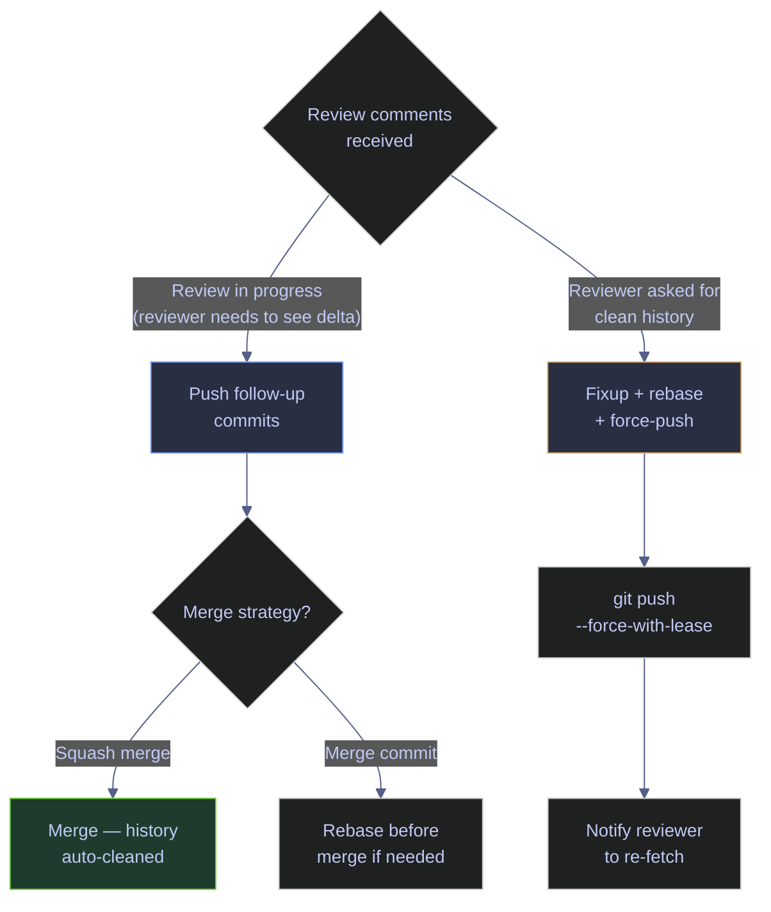

*Decision flowchart: during active review, push follow-up commits so the reviewer can inspect only the delta. If the team uses squash-merge, the follow-up commits are automatically collapsed on merge. If the team uses merge commits and the reviewer wants a clean branch, use fixup + interactive rebase + force-push, then notify the reviewer to re-fetch.*

> [!tip] Audit-friendly vs clean history — when each matters
>
> - **Audit-friendly** (keep all commits): preferred for database migrations, compliance-sensitive changes, infrastructure modifications, and any change where "who changed what and when" may be questioned later. The full commit trail is the evidence.
> - **Clean history** (squash/fixup): preferred for feature work, refactoring, and changes where the development journey is not operationally relevant — only the final result matters. Clean history makes `git bisect` and `git log` more useful on `main`.
> - **Default recommendation:** use squash-merge for feature branches, but switch to merge commits for migration branches and infrastructure changes where auditability outweighs cleanliness.

### Anti-Patterns to Avoid

| Anti-pattern | Why it is harmful | What to do instead |
|---|---|---|
| Committing directly to main | Bypasses code review, CI, and branch protection | Always use feature branches and PRs |
| Giant PRs (500+ lines) | Impossible to review thoroughly, high risk of bugs | Break work into smaller, reviewable increments |
| "WIP" commits on main | Pollutes history, confuses `git bisect` | WIP commits belong on feature branches, squash before merging |
| Force-pushing shared branches | Destroys teammates' local history | Use `--force-with-lease` on personal branches only |
| Ignoring CI failures | Broken main blocks the entire team | Fix or revert immediately |
| Accumulating stashes | Stashes are invisible, easy to forget, hard to manage | Commit WIP to a branch or discard |
| Rebasing after others have pulled | Creates divergent histories, causes cascading conflicts | Only rebase unpushed or sole-contributor branches |

### Reviewing Large Diffs Safely

> [!tip] Techniques for reviewing large PRs
>
> - **Review commit by commit** rather than the full diff: `gh pr diff --patch | git apply --stat`
> - **Focus on high-risk files first:** migrations, configs, CI pipelines, security-sensitive code
> - **Use `git diff --stat`** to get the file-level overview before diving into line-level changes
> - **Check for unintended files:** generated artifacts, lock file churn, IDE config changes
> - **Run the branch locally** for any change that affects runtime behavior

### Coordinating Risky Changes

For schema migrations, pipeline rewrites, and infrastructure changes:

1. **Announce the change** in the team channel before opening the PR.
2. **Use a dedicated branch prefix** (e.g., `migration/`, `infra/`) to signal high-impact work.
3. **Require two reviewers** for changes that affect production data or infrastructure.
4. **Test against staging** before merging. For dbt: `dbt run --target staging`. For SQL: run against a test database.
5. **Merge during low-traffic windows** — not during peak pipeline execution.
6. **Monitor after merging** — watch dashboards and alerts for the first execution cycle.

## Quick Reference

| Action | Command |
|---|---|
| Check status | `git status` |
| Compact status | `git status -s` |
| View unstaged changes | `git diff` |
| View staged changes | `git diff --staged` |
| View branch diff for PR | `git diff main...HEAD --stat` |
| Recent history | `git log --oneline -10` |
| History with graph | `git log --oneline --graph --decorate --all` |
| Stage a file | `git add <file>` |
| Stage everything | `git add -A` |
| Interactive stage | `git add -p` |
| Unstage a file | `git restore --staged <file>` |
| Commit | `git commit -m "msg"` |
| Commit with body | `git commit -m "title" -m "body"` |
| Amend last commit | `git commit --amend -m "msg"` |
| Push | `git push` |
| Push new branch | `git push -u origin <branch>` |
| Delete remote branch | `git push origin --delete <branch>` |
| Pull (merge) | `git pull` |
| Pull (rebase) | `git pull --rebase` |
| Fetch only | `git fetch` |
| Create branch | `git switch -c <branch>` |
| Switch branch | `git switch <branch>` |
| Discard file changes | `git restore <file>` |
| Undo last commit (keep staged) | `git reset --soft HEAD~1` |
| Revert pushed commit | `git revert <SHA>` |
| Stash changes | `git stash push -m "name"` |
| Apply stash | `git stash pop` |
| List stashes | `git stash list` |
| Recover lost commit | `git reflog` |
| Remove untracked files | `git clean -fd` |
| Interactive rebase (cleanup) | `git rebase -i HEAD~N` |
| Autosquash fixup commits | `git rebase -i --autosquash HEAD~N` |
| Create a fixup commit | `git commit --fixup=<SHA>` |
| Cherry-pick with traceability | `git cherry-pick -x <SHA>` |
| Create a worktree | `git worktree add <path> <branch>` |
| List worktrees | `git worktree list` |
| Remove a worktree | `git worktree remove <path>` |
| Create PR | `gh pr create --title "title"` |
| Merge PR (squash) | `gh pr merge --squash --delete-branch` |
