# Git Branching and Merging

> [!quote]
> "In git, we like branches so much that once you realize you have to have a special branch anyway, you might as well have many."
>
> — **Linus Torvalds**, Git mailing list

Branching isolates work so that multiple features, fixes, and experiments can proceed in parallel without interfering with each other. Merging integrates completed work back into the main branch. Together they form the core collaboration mechanism in Git — every team workflow, from trunk-based development to Gitflow, is built on top of branching and merging primitives.

This page covers the full lifecycle: creating branches, switching between them, stashing uncommitted work, merging with different strategies, rebasing for linear history, cherry-picking individual commits, using worktrees for parallel checkouts, and recovering from mistakes. Every command is demonstrated with real outputs from the [git-lab](https://github.com/alp78/git-lab) repository.

## Key Terms

| Term | Definition |
|---|---|
| **Branch** | A lightweight movable pointer (41-byte file) that points to a commit SHA. Creating a branch does not copy files — it only creates a new pointer. |
| **HEAD** | A special pointer that tracks which branch (or commit) you are currently working on. Normally HEAD points to a branch name; in detached HEAD state it points directly to a commit SHA. |
| **Working tree** | The set of files on disk that you edit directly. Also called the working directory. |
| **Staging area (index)** | A buffer between the working tree and the next commit. Only staged changes are included when you run `git commit`. |
| **Commit SHA** | The unique 40-character hexadecimal hash that identifies each commit. A commit points to its parent(s), forming a directed acyclic graph (DAG). |
| **DAG (Directed Acyclic Graph)** | The commit history structure. Each commit points to one or more parents, forming a graph that never loops back on itself. Branches and merges create forks and joins in this graph. |
| **Merge base** | The most recent common ancestor commit shared by two branches. Git uses it as the reference point when performing a three-way merge. |
| **Merge commit** | A commit with two parents — one from each branch being joined. Created by three-way merges and `--no-ff` merges. |
| **Fast-forward** | A merge where the target branch has no new commits since the branch point. Git simply moves the branch pointer forward — no merge commit is created. |
| **Remote-tracking branch** | A local read-only reference (e.g., `origin/main`) that mirrors the state of a branch on the remote server at the time of the last `fetch` or `pull`. |
| **Upstream tracking branch** | The remote-tracking branch that a local branch is configured to push to and pull from. Set with `git push -u` or `git branch --set-upstream-to`. |
| **Detached HEAD** | A state where HEAD points directly at a commit SHA instead of a branch name. New commits made in this state are not on any branch and become unreachable once you switch away. |
| **Reflog** | A local log of every HEAD movement (commits, checkouts, resets, rebases). Entries expire after approximately 90 days. The reflog is the primary recovery mechanism for lost commits. |
| **Stash** | A temporary storage stack for uncommitted changes. Stashing saves modified tracked files and staged changes, then resets the working tree to a clean state. |
| **Worktree** | A separate working directory linked to the same Git repository. Each worktree has its own checked-out branch and index, but all worktrees share the same commit history and reflog. |
| **Interactive rebase** | A mode of `git rebase -i` that lets you edit, reorder, squash, fixup, or drop individual commits on a branch. The primary tool for cleaning up branch history before PR review. |
| **Fixup commit** | A commit created with `git commit --fixup=<SHA>` that is intended to be folded into an earlier commit during interactive rebase with `--autosquash`. Named `fixup! <original message>` automatically. |
| **Cherry-pick** | Copy a single commit from one branch to another as a new commit with a different SHA but identical diff. Used for backporting hotfixes to release branches without merging the entire source branch. |

## Conceptual Model

Before working with branches, it helps to understand how the five layers of Git state relate to each other. Every Git operation moves data between these layers.

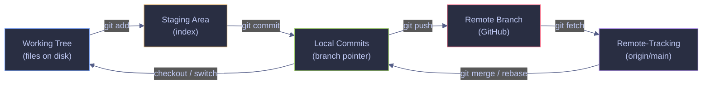

*The five layers of Git state. Editing files changes the working tree. `git add` moves changes to the staging area. `git commit` creates a new commit on the current branch. `git push` sends local commits to the remote. `git fetch` updates remote-tracking branches. `git merge` or `git rebase` integrates remote-tracking changes into local commits. `git switch` updates the working tree to match a different branch.*

A **branch** is a 41-byte file containing a commit SHA. When you commit, Git moves the branch pointer forward to the new commit. When you create a branch, Git creates a new pointer at your current commit — no files are copied, no history is duplicated. This makes branches extremely cheap: creating, switching, and deleting branches are near-instant operations regardless of repository size.

**HEAD** determines where new commits go. Normally HEAD points to a branch name (e.g., `refs/heads/main`), and when you commit, both HEAD and the branch pointer advance. In detached HEAD state, HEAD points directly to a commit SHA — new commits are created but no branch pointer tracks them.

## Branch Operations

Creating, switching, and managing branches are the most frequent Git operations. Every branch is just a pointer — branches are cheap to create and delete.

### Git | branch | create and switch branches

A branch is an independent line of development. Creating a branch adds a new pointer at your current commit and lets you make changes without affecting other branches. Switching branches updates your working tree to match the target branch's latest commit. If you have uncommitted changes that conflict with the target branch, Git refuses to switch.

> [!info] git switch vs git checkout
>
> Git 2.23 (August 2019) split the overloaded `git checkout` into two focused commands: `git switch` for changing branches and `git restore` for discarding file changes. The old `git checkout` still works but `git switch` is safer — it refuses to switch if uncommitted changes would conflict with the target branch, whereas `git checkout` can silently discard work when used with file paths. All examples in this page use the modern `git switch` command.

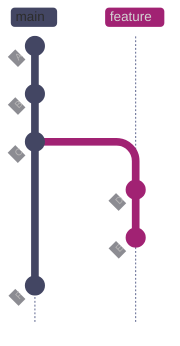

*Feature branch created at commit C. Commits D and E develop the feature while main advances to F independently. Both branches share history A→B→C. The feature branch pointer is at E, the main branch pointer is at F. The two branches have diverged — merging will be required to integrate them.*

#### Create and switch to a new branch

**When to run:** at the start of any new unit of work — a feature, bugfix, experiment, or spike.
**Trigger:** a new task is assigned, a bug is reported, or you want to try something without affecting main.
**Context:** runs locally, no network operation. Creates a branch pointer at the current HEAD commit and switches to it.
**Purpose:** isolate your changes from the main branch so that incomplete work does not affect other team members.

*Create a new branch named `feature/esg-scoring` at the current HEAD commit and switch to it.*

```bash
git switch -c feature/esg-scoring
```

```text
Switched to a new branch 'feature/esg-scoring'
```

> [!tip] Branch naming conventions
>
> Most teams use a prefix convention to categorize branches at a glance:
>
> - `feature/` — new functionality
> - `fix/` or `hotfix/` — bug fixes
> - `chore/` — maintenance, dependency updates, CI changes
> - `docs/` — documentation-only changes
> - `experiment/` — throwaway exploratory work
>
> Keep branch names short and lowercase with hyphens: `feature/esg-scoring`, not `Feature/ESG_Scoring_Module_v2`. Some CI systems and shell completions break on uppercase or special characters.

#### Switch between existing branches

**When to run:** when you need to move to a different branch — to review a colleague's work, apply a hotfix, or return to main.
**Trigger:** context switch between tasks, or preparing to merge.
**Context:** local operation. Updates the working tree and HEAD. If you have uncommitted changes that conflict with files on the target branch, the switch is rejected with an error.
**Purpose:** change the active branch so that new commits go to the correct line of development.

*Switch the working tree and HEAD to point at the `main` branch.*

```bash
git switch main
```

```text
Switched to branch 'main'
Your branch is up to date with 'origin/main'.
```

#### List local and remote branches

**When to run:** to see which branches exist, which one is active, and what each branch's latest commit is.
**Trigger:** orientation at the start of a session, before merging, or when cleaning up stale branches.
**Context:** local operation, read-only.
**Purpose:** identify the current branch (marked with `*`), see the latest commit on each branch, and discover remote-tracking branches.

*List all local branches with their latest commit.*

```bash
git branch -v
```

```text
  feat/add-signals       f89093f feat: add moving average function to signals
  feature/data-validator fced9c9 feat: add data validation module
  feature/logging-setup  b948ccd feat: add centralized logging module
  feature/risk-metrics   9478700 feat: add Sharpe ratio calculation
* main                   72edabc merge: integrate centralized logging module
```

*List all branches including remote-tracking branches.*

```bash
git branch -a
```

```text
  feat/add-signals
  feature/data-validator
  feature/logging-setup
  feature/risk-metrics
* main
  remotes/origin/HEAD -> origin/main
  remotes/origin/feat/add-signals
  remotes/origin/main
```

#### List merged and unmerged branches

**When to run:** before cleaning up branches after a merge cycle, or to audit which feature branches still have outstanding work.
**Trigger:** sprint cleanup, branch housekeeping, or pre-release audit.
**Context:** local operation, read-only. Compares branch tips against the current branch.
**Purpose:** identify which branches have been fully integrated (safe to delete) and which still contain unmerged commits.

*Show branches whose commits are all reachable from the current branch (safe to delete).*

```bash
git branch --merged
```

```text
  feature/data-validator
  feature/logging-setup
* main
```

*Show branches with commits not yet merged into the current branch.*

```bash
git branch --no-merged
```

```text
  feat/add-signals
  feature/risk-metrics
```

> [!warning] Detached HEAD from checking out a commit
>
> If you check out a specific commit SHA instead of a branch name (`git checkout abc1234`), you enter **detached HEAD** state — HEAD points directly at a commit, not a branch. Any new commits you make are not on any branch and will become unreachable once you switch away.

> [!success] Save work from detached HEAD
>
> Create a branch before switching away: `git switch -c my-rescue-branch`. This attaches your commits to a named branch, preventing them from being garbage-collected.

*Enter detached HEAD state by checking out a specific commit.*

```bash
git checkout f280460
```

```text
Note: switching to 'f280460'.

You are in 'detached HEAD' state. You can look around, make experimental
changes and commit them, and you can discard any commits you make in this
state without impacting any branches by switching back to a branch.

If you want to create a new branch to retain commits you create, you may
do so (now or later) by using -c with the switch command. Example:

  git switch -c <new-branch-name>

Or undo this operation with:

  git switch -

Turn off this advice by setting config variable advice.detachedHead to false

HEAD is now at f280460 chore: update requirements with pandas and ruff
```

| Flag | Syntax | Description |
|---|---|---|
| `-c` | `git switch -c <branch>` | Create a new branch and switch to it |
| `-d` | `git switch -d <commit>` | Switch to a specific commit in detached HEAD mode |
| `--discard-changes` | `git switch --discard-changes <branch>` | Switch and discard uncommitted changes |
| `-` | `git switch -` | Switch to the previously checked-out branch |
| `-a` | `git branch -a` | List all branches including remote-tracking |
| `-v` | `git branch -v` | Show last commit on each branch |
| `-d` | `git branch -d <branch>` | Delete branch (only if merged) |
| `-D` | `git branch -D <branch>` | Force-delete branch (even if unmerged) |
| `-m` | `git branch -m <old> <new>` | Rename a branch |
| `--merged` | `git branch --merged` | List branches already merged into current branch |
| `--no-merged` | `git branch --no-merged` | List branches not yet merged into current branch |
| `--set-upstream-to` | `git branch --set-upstream-to=<remote>/<branch>` | Set the upstream tracking branch |

### Git | stash | save and restore uncommitted work

A stash is a temporary storage area for uncommitted changes. When you stash, Git saves your modified tracked files and staged changes onto a stack, then reverts your working directory to a clean state matching the last commit. You can re-apply stashed changes later on the same branch or a different one. Stashing is essential when you need to switch branches mid-work without committing half-finished code.

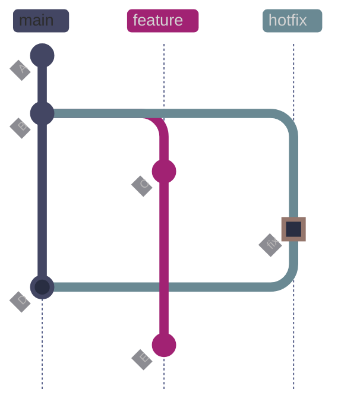

*Working on feature (commit C), you stash uncommitted changes and switch to hotfix. After committing the fix (marked green) and merging it to main (D), you switch back to feature and pop the stash to resume work (commit E). Stashing lets you context-switch without half-finished commits polluting your history.*

#### Save uncommitted changes to the stash

**When to run:** when you need to switch branches but have uncommitted work that is not ready to commit.
**Trigger:** a colleague asks for a code review, a hotfix is needed on main, or you want to `git pull` on a dirty working tree.
**Context:** local operation. Saves staged and unstaged modifications to the stash stack, then resets the working tree to the last commit. The `-m` flag adds a descriptive message.
**Purpose:** temporarily park incomplete work so the working tree is clean for other operations.

*Stash all modified tracked files with a descriptive message.*

```bash
git stash push -m "WIP: currency convert function"
```

```text
Saved working directory and index state On feature/currency-converter: WIP: currency convert function
```

#### List all stash entries

**When to run:** when you need to find a specific stash entry or see how many stashes are on the stack.
**Trigger:** before popping or applying a stash, to confirm which entry you want.
**Context:** local, read-only.
**Purpose:** display all stash entries with their index, source branch, and message.

*View all entries on the stash stack.*

```bash
git stash list
```

```text
stash@{0}: On feature/currency-converter: WIP: currency convert function
```

#### Restore and remove the most recent stash

**When to run:** after switching back to the branch where you stashed your work, or after the interrupting task is complete.
**Trigger:** returning to a paused task.
**Context:** local operation. Applies the stash entry to the working tree and removes it from the stack. If the stash conflicts with current changes, the pop fails and the stash remains on the stack — resolve conflicts manually and then drop the stash with `git stash drop`.
**Purpose:** resume work from where you left off.

*Pop the most recent stash entry back into the working tree.*

```bash
git stash pop
```

```text
On branch feature/currency-converter
Changes not staged for commit:
  (use "git add <file>..." to update what will be committed)
  (use "git restore <file>..." to discard changes in working directory)
	modified:   src/currency.py

no changes added to commit (use "git add" and/or "git commit -a")
Dropped refs/stash@{0} (890150239f83f2ed99cc3fceec50ed1b3c1593e2)
```

#### Apply a specific stash without removing it

**When to run:** when you want to apply the same stash to multiple branches, or when you want to keep the stash as a backup.
**Trigger:** applying a stash to a branch other than where it was created, or testing whether the stash applies cleanly before committing to the pop.
**Context:** local operation. Applies the specified stash entry but does not remove it from the stack.
**Purpose:** re-apply saved changes without consuming the stash entry.

*Apply stash entry at index 0 without removing it from the stack.*

```bash
git stash apply stash@{0}
```

> [!warning] Stash skips untracked files by default
>
> `git stash push` only saves modified tracked files. New files that have never been staged are left behind in the working tree. Switching branches after stashing can leave orphan untracked files in the wrong branch.

> [!success] Include untracked files
>
> Use `git stash push -u` (or `--include-untracked`) to stash untracked files too. Use `git stash push -a` (or `--all`) to also include ignored files. For data engineering repos, this is important when you have new migration files, DAG definitions, or config files that have not yet been staged.

> [!tip] Stash workflow for data engineering
>
> Data engineering repos often have generated artifacts (compiled dbt models, Airflow DAG bags, `.pyc` files) that should not be stashed. Use `git stash push -m "WIP: description" -- src/ tests/` to stash only specific paths, keeping generated directories untouched.

| Flag | Syntax | Description |
|---|---|---|
| `-m` | `git stash push -m "msg"` | Add a descriptive message to the stash |
| `-u` | `git stash push -u` | Include untracked files in the stash |
| `-a` | `git stash push -a` | Include untracked and ignored files |
| `-p` | `git stash push -p` | Interactively select hunks to stash |
| `--keep-index` | `git stash push --keep-index` | Stash unstaged changes but keep staged changes in the index |
| `pop` | `git stash pop` | Apply and remove the most recent stash entry |
| `apply` | `git stash apply stash@{N}` | Apply a specific stash without removing it |
| `drop` | `git stash drop stash@{N}` | Remove a specific stash entry |
| `clear` | `git stash clear` | Remove all stash entries |
| `show` | `git stash show -p stash@{N}` | Show the diff of a stash entry |
| `--` | `git stash push -- <path>` | Stash only changes in the specified path(s) |

### Git | branch | delete branches

After a branch is merged, it should be deleted to keep the branch list clean. Git offers a safe delete that checks merge status and a force delete that skips the check.

#### Safe delete a merged branch

**When to run:** after a branch has been merged into the target branch and is no longer needed.
**Trigger:** PR merged, feature complete, or sprint cleanup.
**Context:** local operation. Git checks whether the branch's commits are reachable from the current branch or its upstream. If unmerged commits exist, the delete is rejected.
**Purpose:** remove stale branch pointers without risk of losing unmerged work.

*Delete a branch that has been fully merged.*

```bash
git branch -d feature/esg-scoring
```

```text
Deleted branch feature/esg-scoring (was 0cab331).
```

#### Force-delete an unmerged branch

**When to run:** when you intentionally want to discard an experimental or abandoned branch that was never merged.
**Trigger:** experiment abandoned, spike completed, or duplicate branch identified.
**Context:** local operation. Bypasses the merge check. If the branch has unmerged commits and has not been pushed to a remote, that work is only recoverable via `git reflog` for approximately 90 days.
**Purpose:** remove a branch regardless of merge status.

> [!danger] -D force-deletes without merge check
>
> `git branch -D` bypasses the safety check and deletes unconditionally. If the branch has unmerged commits and has not been pushed to a remote, that work is only recoverable via `git reflog` for approximately 90 days.

> [!success] Recover a force-deleted branch
>
> Find the branch tip in the reflog with `git reflog` and recreate it: `git branch recovered-branch <sha>`. The reflog retains entries for approximately 90 days by default.

*Force-delete a branch regardless of merge status.*

```bash
git branch -D feature/currency-converter
```

```text
Deleted branch feature/currency-converter (was 0a2cd39).
```

### Git | worktree | parallel working directories

`git worktree` (Git 2.5+) lets you check out multiple branches simultaneously in separate directories, all sharing the same `.git` repository. This avoids the stash-switch-restore cycle when working on a hotfix while a feature branch has uncommitted work. Each worktree has its own checked-out branch, working tree, and index — but they share the commit history, reflog, and configuration.

> [!tip] Worktrees for data engineering
>
> Worktrees are particularly useful when you need to:
>
> - Run a long dbt build on one branch while developing on another
> - Compare pipeline outputs between branches side-by-side
> - Apply a hotfix to production while keeping an in-progress migration untouched
> - Run tests on a feature branch while continuing development on a different branch

#### Create a parallel working directory

**When to run:** when you need to work on two branches simultaneously without stashing.
**Trigger:** hotfix needed while mid-feature, or need to compare behavior across branches.
**Context:** local operation. Creates a new directory linked to the same repository. You cannot check out a branch that is already checked out in another worktree.
**Purpose:** work on multiple branches in parallel without losing context.

*Create a new worktree directory for the `feature/currency-converter` branch.*

```bash
git worktree add ../git-lab-hotfix feature/currency-converter
```

```text
Preparing worktree (checking out 'feature/currency-converter')
HEAD is now at 0a2cd39 feat: add currency converter skeleton
```

#### List active worktrees

**When to run:** to see which worktrees are active and which branches they have checked out.
**Trigger:** before creating a new worktree (to avoid conflicts), or during cleanup.
**Context:** local, read-only.
**Purpose:** display all worktree paths and their checked-out branches.

*Show all worktrees linked to the current repository.*

```bash
git worktree list
```

```text
C:/Users/aperi/DEV/git-lab        7dd85e2 [main]
C:/Users/aperi/DEV/git-lab-hotfix 0a2cd39 [feature/currency-converter]
```

#### Remove a worktree

**When to run:** after the work in the extra worktree is complete.
**Trigger:** hotfix merged, comparison done, or worktree no longer needed.
**Context:** local operation. Removes the worktree directory and its administrative files. The branch remains — only the extra working directory is deleted.
**Purpose:** clean up worktree directories to avoid confusion and disk usage.

*Remove a worktree directory.*

```bash
git worktree remove ../git-lab-hotfix
```

| Flag | Syntax | Description |
|---|---|---|
| `add` | `git worktree add <path> <branch>` | Create a new worktree for a branch |
| `list` | `git worktree list` | List all active worktrees |
| `remove` | `git worktree remove <path>` | Remove a worktree directory |
| `prune` | `git worktree prune` | Clean up stale worktree metadata |
| `--detach` | `git worktree add --detach <path> <commit>` | Create a worktree in detached HEAD mode |
| `--force` | `git worktree remove --force <path>` | Remove a worktree even if it has uncommitted changes |

## Merging Strategies

Merging is how completed work on one branch gets integrated into another. Git offers several merge approaches, each producing a different commit history shape. The choice affects how your project history reads, how easy it is to revert features, and how clean the DAG looks.

See [merge-vs-rebase-vs-squash](https://alp78.github.io/elysium/08-Git/04-merge-vs-rebase-vs-squash) for a detailed strategy comparison. For resolving conflicts that arise during merges, see [git-merge-conflicts](https://alp78.github.io/elysium/08-Git/10-git-merge-conflicts).

### Git | merge | fast-forward merge

A fast-forward merge occurs when the target branch (e.g., `main`) has not received any new commits since the feature branch was created. Git simply moves the `main` pointer forward to the feature branch's tip — no merge commit is created. The result is a perfectly linear history with no branching visible in `git log --graph`.

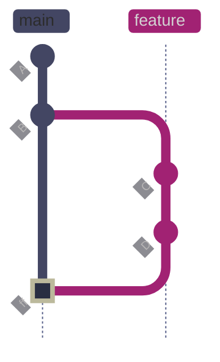

*Fast-forward merge: main had no new commits since the branch point at B. Git moves the main pointer forward from B to D (marked green). No merge commit is created — the history stays perfectly linear. After the merge, main and feature both point to commit D. The feature branch can be safely deleted.*

#### Merge with fast-forward (default behavior)

**When to run:** when you want to integrate a feature branch into main and main has not diverged.
**Trigger:** feature complete and ready to merge, no conflicting work on main.
**Context:** local operation. Requires switching to the target branch first (`git switch main`). The merge updates the branch pointer — no new commit is created.
**Purpose:** integrate feature work into main with a clean linear history.

*Switch to main and fast-forward merge the feature branch.*

```bash
git switch main
git merge feature/esg-scoring
```

```text
Updating 07a7f46..0cab331
Fast-forward
 src/esg_scoring.py        | 11 +++++++++++
 tests/test_esg_scoring.py | 16 ++++++++++++++++
 2 files changed, 27 insertions(+)
 create mode 100644 src/esg_scoring.py
 create mode 100644 tests/test_esg_scoring.py
```

The output shows `Fast-forward` — Git moved the `main` pointer from `07a7f46` to `0cab331` without creating a merge commit. The diffstat shows which files changed and how many lines were added or removed.

### Git | merge | three-way merge

A three-way merge occurs when both branches have new commits since they diverged. Git finds the common ancestor (merge base), compares both branch tips against it, and creates a **merge commit** with two parents. This preserves the complete history of both branches, showing exactly when they diverged and when they were joined.

The name "three-way" refers to the three commits Git compares: the merge base (common ancestor), the tip of the current branch, and the tip of the branch being merged. Git uses the `ort` merge strategy by default (replacing the older `recursive` strategy since Git 2.34).

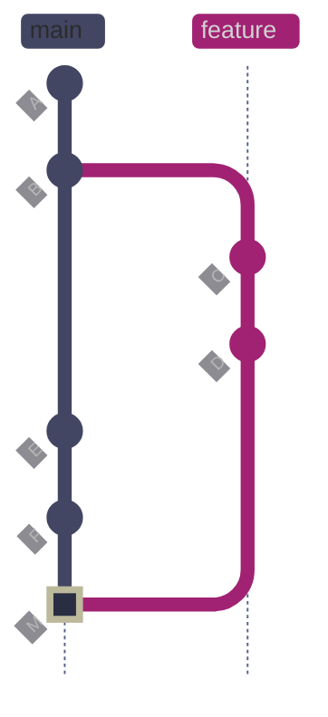

*Three-way merge: main advanced to F while feature developed C and D independently. B is the merge base — the last commit both branches share. Git compares the state at B against the tips F and main, and C/D on feature, combining changes from both sides. The result is merge commit M (marked green), which has two parents: F (from main) and D (from feature). Both branches' full history is preserved in the DAG, making it clear when the feature started and when it was integrated.*

#### Merge with three-way strategy

**When to run:** when both your branch and the target branch have diverged — both received new commits since the fork point.
**Trigger:** merging a feature branch after main has received other work (other features merged, hotfixes applied).
**Context:** local operation. If the same lines were modified on both branches, Git raises a merge conflict that must be resolved manually before the merge commit can be created.
**Purpose:** integrate diverged branches while preserving the complete history of both.

*Merge a feature branch that has diverged from main.*

```bash
git switch main
git merge feature/data-validator
```

```text
Merge made by the 'ort' strategy.
 src/data_validator.py | 14 ++++++++++++++
 1 file changed, 14 insertions(+)
 create mode 100644 src/data_validator.py
```

*The resulting commit graph shows the merge commit joining the two branches.*

```bash
git log --oneline --graph -6
```

```text
*   6de68b1 Merge branch 'feature/data-validator'
|\  
| * fced9c9 feat: add data validation module
* | baeaf6a chore: update pipeline configuration with rate limits
|/  
* 0cab331 test: add ESG scoring unit tests
* 02a138c feat: add ESG scoring module skeleton
* 07a7f46 Reapply "feat: add source field and dynamic currency"
```

The graph shows the fork at `0cab331` (where feature diverged) and the join at `6de68b1` (the merge commit). The `|\` and `|/` lines show the two branches running in parallel before merging.

### Git | merge | force merge commit with --no-ff

The `--no-ff` flag forces Git to create a merge commit even when a fast-forward is possible. This keeps the branch boundary visible in `git log --graph`, making it easier to identify which commits belonged to a feature branch and to revert an entire feature by reverting the single merge commit.

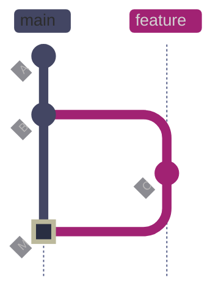

*--no-ff merge: even though main could fast-forward to C, Git creates merge commit M (marked green) with two parents — B (from main) and C (from feature). The branch boundary is preserved in the graph. Compare this to a fast-forward merge, which would simply move the main pointer to C without any visual record of the branch.*

#### Merge with explicit merge commit

**When to run:** when you want to preserve the branch boundary in the commit history, even when a fast-forward is possible.
**Trigger:** team policy requires visible merge commits, or you want the option to revert an entire feature with a single `git revert`.
**Context:** local operation. Creates a merge commit with two parents.
**Purpose:** maintain a visible record of when feature work was integrated.

*Force a merge commit even though fast-forward is possible.*

```bash
git switch main
git merge --no-ff feature/logging-setup -m "merge: integrate centralized logging module"
```

```text
Merge made by the 'ort' strategy.
 src/logger.py | 15 +++++++++++++++
 1 file changed, 15 insertions(+)
 create mode 100644 src/logger.py
```

*The graph shows the explicit merge commit preserving the branch boundary.*

```bash
git log --oneline --graph -4
```

```text
*   72edabc merge: integrate centralized logging module
|\  
| * b948ccd feat: add centralized logging module
|/  
* 7dd85e2 feat: add volatility calculation
* f280460 chore: update requirements with pandas and ruff
```

> [!tip] Enforce --no-ff as team policy
>
> Many teams enforce `--no-ff` as a default so that every feature branch merge is explicitly recorded in the graph. Set it globally with `git config --global merge.ff false` or per-repository with `git config merge.ff false`. GitHub, GitLab, and Bitbucket all create merge commits by default when merging PRs through the web UI.

#### Restrict to fast-forward only

**When to run:** when you want the merge to succeed only if a fast-forward is possible — failing explicitly if the branches have diverged.
**Trigger:** CI/CD pipelines that require linear history, or when you want to confirm that a rebase was done before merging.
**Context:** local operation. The merge is aborted if fast-forward is not possible.
**Purpose:** enforce linear history by rejecting merges that would create a merge commit.

*Attempt a fast-forward-only merge (fails if branches have diverged).*

```bash
git merge --ff-only feature/risk-metrics
```

```text
fatal: Not possible to fast-forward, aborting.
```

The merge fails because `main` and `feature/risk-metrics` have diverged — both have commits the other does not. To make this merge possible, rebase the feature branch onto main first.

#### Cancel a merge in progress

**When to run:** when a merge produces conflicts you do not want to resolve right now.
**Trigger:** unexpected conflicts, wrong branch merged, or need to discuss with the team before resolving.
**Context:** local operation. Restores the working tree and index to the state before the merge began. No merge commit is created.
**Purpose:** cleanly back out of a merge without leaving the repository in a conflicted state.

*Abort a merge in progress and restore pre-merge state.*

```bash
git merge --abort
```

| Flag | Syntax | Description |
|---|---|---|
| `--no-ff` | `git merge --no-ff <branch>` | Force a merge commit even when fast-forward is possible |
| `--ff-only` | `git merge --ff-only <branch>` | Only merge if fast-forward is possible; abort otherwise |
| `--squash` | `git merge --squash <branch>` | Combine all branch commits into one changeset without committing |
| `--abort` | `git merge --abort` | Cancel a merge in progress and restore pre-merge state |
| `--continue` | `git merge --continue` | Resume a merge after resolving conflicts |
| `--no-commit` | `git merge --no-commit <branch>` | Perform the merge but stop before creating the merge commit |
| `-m` | `git merge -m "msg" <branch>` | Set the merge commit message |
| `--stat` | `git merge --stat <branch>` | Show diffstat after merge (default) |
| `--strategy` | `git merge -s <strategy> <branch>` | Use a specific merge strategy (ort, recursive, octopus, ours) |

### Git | rebase | linear history

Rebasing takes every commit on your branch and replays them one by one on top of the target branch's latest commit. The result is a perfectly linear history — it looks like you started your work after the latest `main` commit, even if you actually started days or weeks ago. The trade-off: every replayed commit gets a **new SHA hash** because the parent commit has changed, which means you are rewriting history.

**Before rebase:**

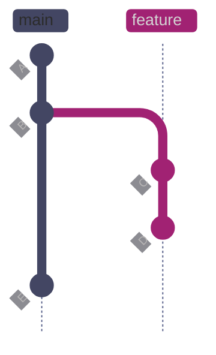

*Before rebase: feature branch diverged from main at B. Feature has commits C (add volatility calculation) and D (add Sharpe ratio). Meanwhile, main advanced to E (update requirements). The two branches share history A→B but have diverged since — C and D are based on B, not on E.*

**After rebase:**

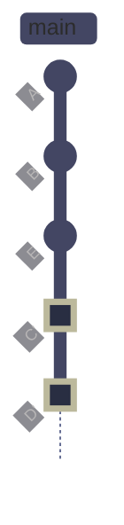

*After `git rebase main`: Git first identifies the merge base (B), then replays the feature branch's commits one at a time on top of E. C becomes C' (marked green) and D becomes D' (marked green) — the diffs are identical but the SHAs change because each commit now has a different parent (C' is based on E instead of B, D' is based on C' instead of C). The result is a clean linear history where the feature work appears to have started after E, eliminating the divergence without a merge commit. The original commits C and D are orphaned and will be garbage-collected after the reflog expires (~90 days).*

#### Rebase onto a new base

**When to run:** before merging a feature branch, to ensure it applies cleanly on top of the latest main.
**Trigger:** main has received new commits since you branched off, and you want linear history.
**Context:** local operation that rewrites history. Must be on the feature branch. Each commit is replayed in order — if a conflict occurs, the rebase pauses and you must resolve it before continuing with `git rebase --continue`.
**Purpose:** produce a linear history so the feature branch can be fast-forward merged into main.

*Rebase the feature branch onto the tip of main.*

```bash
git switch feature/risk-metrics
git rebase main
```

```text
Successfully rebased and updated refs/heads/feature/risk-metrics.
```

*Verify the linear history after rebase.*

```bash
git log --oneline --graph -5
```

```text
* 9478700 feat: add Sharpe ratio calculation
* 3b1c373 feat: add volatility calculation
* f280460 chore: update requirements with pandas and ruff
*   6de68b1 Merge branch 'feature/data-validator'
|\  
| * fced9c9 feat: add data validation module
```

The commits now sit on top of `f280460` (the tip of main when the rebase ran), not on top of the old branch point. The feature branch can now be fast-forward merged into main.

#### Interactive rebase — clean up branch history before PR

**When to run:** before opening or updating a PR, to clean up the commit history — squash fixup commits, reword messages, reorder commits, or drop accidental commits. This is the most common senior-engineer history-cleanup workflow.
**Trigger:** branch has accumulated WIP commits, typo fixes, debug commits, or fixup commits that should be folded before review.
**Context:** local operation that rewrites history. Opens an editor listing each commit with an action keyword. Never use interactive rebase on commits that have been pushed to a shared branch. After rebasing a pushed personal branch, use `git push --force-with-lease`.
**Purpose:** produce a clean, reviewable commit history that tells a coherent story for reviewers.

> [!info]- Interactive rebase action keywords
>
> Each commit in the interactive rebase editor is prefixed with an action keyword:
>
> - `pick` — use the commit as-is
> - `reword` — use the commit but edit its message
> - `edit` — pause the rebase at this commit so you can amend it (add files, split it, etc.)
> - `squash` — combine this commit with the previous one, keeping both messages (editor opens to merge them)
> - `fixup` — combine this commit with the previous one, discarding this commit's message
> - `drop` — remove the commit entirely
>
> Commits are listed oldest-first. Reordering the lines reorders the commits.

*View the commits before cleanup — the branch has a fixup commit that should be folded.*

```bash
git log --oneline -5
```

```text
ba61ab0 chore: update README with pipeline docs
4752f8d fixup! feat: add data quality checks
7b41c1b feat: add data quality checks
72edabc merge: integrate centralized logging module
b948ccd feat: add centralized logging module
```

The `fixup!` prefix on `4752f8d` signals that this commit should be absorbed into `7b41c1b` (the commit whose message it matches).

#### Autosquash fixup commits

**When to run:** when your branch has commits prefixed with `fixup!` or `squash!` that match earlier commit messages.
**Trigger:** you used `git commit --fixup=<SHA>` during development to create commits that should be folded into earlier work.
**Context:** `--autosquash` automatically reorders and marks fixup/squash commits in the interactive editor. Requires the `-i` flag.
**Purpose:** one-command cleanup of fixup commits without manual editor editing.

*Run interactive rebase with autosquash to fold fixup commits.*

```bash
git rebase -i --autosquash HEAD~3
```

```text
Successfully rebased and updated refs/heads/demo/rebase-cleanup.
```

*Verify the cleaned-up history — the fixup commit has been absorbed.*

```bash
git log --oneline -3
```

```text
8b32aae chore: update README with pipeline docs
6887984 feat: add data quality checks
72edabc merge: integrate centralized logging module
```

Three commits reduced to two: the fixup was folded into the feature commit. The branch is now clean for PR review.

> [!tip] The fixup commit workflow
>
> During development, when you spot an issue in an earlier commit:
>
> 1. **Fix the issue** and stage the fix: `git add <file>`
> 2. **Create a fixup commit:** `git commit --fixup=<SHA-of-original-commit>`
> 3. Git names it `fixup! <original message>` automatically
> 4. **Before PR:** run `git rebase -i --autosquash HEAD~N` — fixup commits are automatically folded into their targets
> 5. **Push:** `git push --force-with-lease` if the branch was already pushed
>
> This is cleaner than amending, especially when fixing commits that are not the most recent.

> [!tip] Squash vs fixup
>
> Use `fixup` when you want to discard the fixup commit's message entirely and keep only the original commit's message. Use `squash` when both messages are meaningful and should be concatenated. In practice, `fixup` is used far more often — the fixup commit's message is usually just "fix typo" or "address review comment."

#### Cancel a rebase in progress

**When to run:** when a rebase produces conflicts you do not want to resolve, or you realize you are rebasing the wrong branch.
**Trigger:** unexpected conflicts, wrong base branch, or need to discuss with the team.
**Context:** local operation. Restores the branch to its exact state before the rebase began. No commits are rewritten.
**Purpose:** cleanly back out of a rebase without leaving the repository in a broken state.

*Abort a rebase and restore the original branch state.*

```bash
git rebase --abort
```

> [!danger] Never rebase shared branches
>
> Rebasing rewrites commit SHAs. If others have pulled your branch and you rebase, their local copies will have different SHAs for the same changes. The next `git pull` will create duplicate commits or conflicts. This applies to any branch that has been pushed and is used by other developers — including `main`, `develop`, `release/*`, and any branch with open PRs.

> [!success] Safe rebase workflow
>
> Only rebase commits that have not been pushed to a shared remote. If you must update a pushed feature branch after rebase, use `git push --force-with-lease` — this refuses to push if the remote has commits you have not seen, preventing you from overwriting a colleague's work. Never use `git push --force` on shared branches.

> [!question] When to rebase vs when to merge?
>
> **Rebase** when you want linear history and the branch is local or only used by you. **Merge** when the branch is shared, when you want to preserve the full branching story, or when team policy requires merge commits for auditability. For data engineering teams, dbt and Airflow DAG repos often benefit from merge commits because they make it easier to identify which feature introduced a breaking change to a model or DAG.

| Flag | Syntax | Description |
|---|---|---|
| `-i` | `git rebase -i <base>` | Interactive rebase — edit, reorder, squash, or drop commits |
| `--onto` | `git rebase --onto <new-base> <old-base> <branch>` | Rebase a range of commits onto a different base |
| `--abort` | `git rebase --abort` | Cancel rebase and restore original branch state |
| `--continue` | `git rebase --continue` | Resume rebase after resolving a conflict |
| `--skip` | `git rebase --skip` | Skip the current conflicting commit and continue |
| `--autosquash` | `git rebase -i --autosquash` | Automatically reorder fixup! and squash! commits |
| `--autostash` | `git rebase --autostash` | Stash uncommitted changes before rebase, re-apply after |
| `--update-refs` | `git rebase --update-refs` | Automatically update dependent branch refs during rebase |

### Git | cherry-pick | copy individual commits

Cherry-picking copies a single commit from one branch to another. Git applies the diff introduced by the chosen commit as a new commit on the current branch. The new commit has a different SHA but identical changes. This is useful for applying a specific fix from a development branch to a release branch without merging everything.

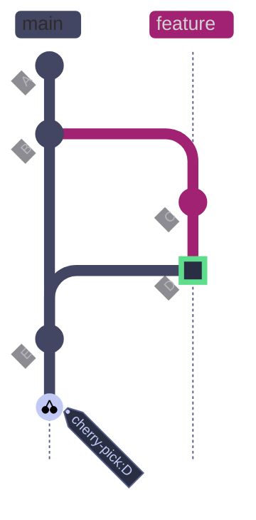

*Cherry-pick copies commit D (marked green on feature) from feature to main as a new commit D' (the cherry-pick result on main). D' has a different SHA than D but contains the exact same diff. The original D remains on feature untouched. D' is an independent commit — it has no parent relationship with D in the DAG. If the feature branch is later fully merged into main, Git may flag the duplicated changes as a conflict.*

#### Copy a commit to the current branch

**When to run:** when you need a specific commit from another branch without merging the entire branch.
**Trigger:** a critical bugfix is on a feature branch but the feature is not ready to merge, a specific commit needs to be backported to a release branch, or a single commit from an abandoned branch needs to be preserved.
**Context:** local operation. Requires the target commit's SHA. If the cherry-picked changes conflict with the current branch, Git pauses and you must resolve conflicts before continuing.
**Purpose:** selectively apply one commit's changes without bringing the full branch history.

*Cherry-pick a specific commit by SHA from the feature branch.*

```bash
git switch main
git cherry-pick 3b1c373
```

```text
[main 7dd85e2] feat: add volatility calculation
 Date: Sun Apr 12 16:59:09 2026 +0200
 1 file changed, 13 insertions(+)
 create mode 100644 src/risk_metrics.py
```

The output shows that Git created a new commit `7dd85e2` on main with the same changes and message as the original commit `3b1c373`. The date is preserved from the original commit.

#### Backport a hotfix to a release branch with traceability

**When to run:** when a critical fix lands on `main` and must also be applied to an active release branch that cannot accept a full merge.
**Trigger:** a production bug is fixed on `main`, and the fix must be backported to `release/2026-Q2` without merging unrelated features.
**Context:** the `-x` flag appends "(cherry picked from commit ...)" to the message, documenting the source commit for auditability. This is critical for incident response — reviewers and on-call engineers can trace the backport to the original fix.
**Purpose:** selectively apply one commit's changes to a release branch with full traceability.

*Cherry-pick a hotfix from main to the release branch with source tracing.*

```bash
git switch release/2026-Q2
git cherry-pick -x 3c60ed4
```

```text
[release/2026-Q2 18b043e] fix: handle NaN values in price feed
 Date: Sun Apr 12 17:19:10 2026 +0200
 1 file changed, 8 insertions(+)
 create mode 100644 src/hotfix_price_feed.py
```

*Verify the cherry-pick message includes the source reference.*

```bash
git log -1 --format="%B"
```

```text
fix: handle NaN values in price feed

(cherry picked from commit 3c60ed47aeac5fd3223cc8fc7c0bee7497444788)
```

The `(cherry picked from commit ...)` line lets anyone trace this commit back to the original fix on `main`. Without `-x`, the connection between the two commits is invisible.

> [!tip] Cherry-pick workflow for incident response
>
> 1. **Fix the bug on main** — branch, fix, review, merge
> 2. **Identify the fix commit SHA:** `git log --oneline -5`
> 3. **Switch to the release branch:** `git switch release/2026-Q2`
> 4. **Cherry-pick with traceability:** `git cherry-pick -x <SHA>`
> 5. **Push the release branch:** `git push`
> 6. **Tag the release patch:** `git tag -a v2026.Q2.1 -m "patch: NaN price feed fix"`

> [!warning] Cherry-pick creates duplicate commits
>
> The cherry-picked commit and the original have different SHAs but identical diffs. If both branches are later merged, Git may flag the duplicate changes as a conflict. This is especially problematic in data engineering repos where the same migration file or DAG definition appears on multiple branches.

> [!success] Avoid duplicates with rebase
>
> If you plan to merge the full branch later, prefer `git rebase` over cherry-picking individual commits. Rebase replays all commits and avoids the duplication problem. If you must cherry-pick, use `git cherry-pick -x <sha>` to append "(cherry picked from commit ...)" to the message — this helps team members identify the duplicate later.

| Flag | Syntax | Description |
|---|---|---|
| `-n` | `git cherry-pick -n <sha>` | Apply changes without committing (stage only) |
| `-x` | `git cherry-pick -x <sha>` | Append "(cherry picked from commit ...)" to the message |
| `-e` | `git cherry-pick -e <sha>` | Edit the commit message before committing |
| `--abort` | `git cherry-pick --abort` | Cancel cherry-pick and restore pre-operation state |
| `--continue` | `git cherry-pick --continue` | Resume after resolving a conflict |
| `--skip` | `git cherry-pick --skip` | Skip the current commit and continue with the next |

## Data Engineering Branch Patterns

Data engineering repositories have specific branching challenges that general-purpose Git guides rarely address. Database migrations, DAG definitions, generated artifacts, and shared SQL files create situations where standard branching advice breaks down.

### Migration collisions

Database migration frameworks (Alembic, Flyway, dbt migrations) assign sequential version numbers or timestamps to migration files. When two branches independently create migrations, they may conflict:

- **Sequential numbering (Alembic):** both branches create `V003_` — only one can win
- **Timestamp-based (Flyway):** both branches create `V20260412_` — if timestamps collide, the second deployment fails
- **dbt model overlap:** both branches modify the same model — `git merge` handles file conflicts, but the compiled SQL may have semantic conflicts that Git cannot detect

> [!tip] Migration branching strategy
>
> - Assign migration numbers at merge time, not at branch creation time
> - Use a CI check that validates migration ordering after merge
> - For dbt, run `dbt compile` in CI on every PR to catch semantic conflicts early
> - For Alembic, use `alembic check` (added in Alembic 1.9) to detect diverged heads

### DAG conflicts in Airflow

Airflow DAG files define task dependencies in Python. Two branches modifying the same DAG's task graph can merge cleanly at the file level but produce an invalid DAG at runtime (circular dependencies, missing tasks, broken sensor references).

> [!warning] DAG merges can be silently broken
>
> Git merge resolves file-level conflicts but cannot validate DAG semantics. A merge that looks clean in `git log` may produce a broken DAG that fails at parse time or, worse, at execution time.

> [!success] Validate DAGs after merge
>
> Run `airflow dags test <dag_id>` or `python -c "from dags.my_dag import dag"` in CI after every merge to catch import errors and circular dependencies before deployment.

### Generated artifacts and large files

Data pipelines often produce generated files: compiled dbt models, serialized ML models, Parquet files, or exported notebooks. These files should generally not be committed, but when they are (e.g., for reproducibility), they create large diffs and frequent merge conflicts.

> [!tip] Keep generated files out of branch history
>
> - Add generated directories to `.gitignore` (`target/`, `dbt_packages/`, `__pycache__/`)
> - Use Git LFS for large binary files that must be tracked (models, datasets)
> - Use CI to generate and publish artifacts rather than committing them
> - For notebooks, use `nbstripout` as a pre-commit hook to remove cell outputs before commit

### Release and hotfix branches

Data platforms with SLA-driven deployments (market-close pipelines, overnight batch jobs) need a clear release branching strategy:

> [!info] Release branch workflow for data pipelines
>
> 1. **Cut a release branch** from main: `git switch -c release/2026-Q2`
> 2. **Only bugfixes** go onto the release branch — new features stay on main
> 3. **Hotfixes** branch from the release branch: `git switch -c hotfix/fix-price-feed -b release/2026-Q2`
> 4. **Merge hotfixes** back to both the release branch and main
> 5. **Tag the release** when deployed: `git tag -a v2026.Q2.1 -m "Q2 release patch 1"`

## Branch Recovery

Git's reflog is the safety net for branch operations — it records every time HEAD moves (commits, checkouts, resets, rebases) for approximately 90 days. Even if you delete a branch or run `reset --hard`, the commits still exist in the object database and are reachable via the reflog.

### Git | reset | undo last commit

Undoing the last commit is one of the most common recovery operations. The three `reset` modes determine what happens to the changes from the undone commit: `--soft` keeps them staged, `--mixed` (default) keeps them in the working tree but unstaged, and `--hard` discards them entirely.

**Before reset:**

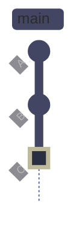

*Current state: HEAD and main both point at commit C (marked green). C is the merge commit integrating the centralized logging module. The next command will undo C by moving the branch pointer backward.*

**After `git reset --soft HEAD~1`:**

```mermaid
%%{init: {'theme': 'dark', 'themeVariables': {
  'primaryColor': '#292e42',
  'primaryTextColor': '#c0caf5',
  'primaryBorderColor': '#565f89',
  'lineColor': '#565f89',
  'secondaryColor': '#1a1b26',
  'tertiaryColor': '#24283b',
  'noteTextColor': '#c0caf5',
  'noteBkgColor': '#292e42',
  'textColor': '#c0caf5',
  'fontSize': '14px'
}, 'gitGraph': {'mainBranchName': 'main'}}}%%
gitGraph TB:
  commit id: "A"
  commit id: "B" type: HIGHLIGHT
```

*After reset: HEAD and main moved back to B (marked green). Commit C is removed from the branch but still exists in the object database — it is reachable via the reflog for ~90 days. With `--soft`, C's changes remain staged in the index, ready to be recommitted. With `--mixed` (default), C's changes are in the working tree but unstaged. With `--hard`, C's changes are discarded entirely from both the index and working tree.*

#### Undo commit, keep changes staged

**When to run:** when you committed too early, with the wrong message, or want to combine the last commit's changes with additional work.
**Trigger:** immediate realization that the last commit was premature or incorrect.
**Context:** local operation. Moves the branch pointer back one commit. The changes from the undone commit remain in the staging area. Safe to use on unpushed commits.
**Purpose:** undo the last commit while preserving all changes for recommitting.

*Move HEAD back one commit, keeping changes staged.*

```bash
git reset --soft HEAD~1
```

*Verify the state after reset.*

```bash
git status
```

```text
On branch main
Changes to be committed:
  (use "git restore --staged <file>..." to unstage)
	new file:   src/logger.py
```

The changes from the undone merge commit (adding `src/logger.py`) are now staged and ready to be recommitted.

> [!danger] git reset --hard discards uncommitted work
>
> `git reset --hard HEAD~1` moves HEAD back and permanently discards all changes in the working tree and staging area. Unlike committed work, uncommitted changes are not recorded in the reflog and cannot be recovered.

> [!success] Check reflog before hard reset
>
> If you accidentally ran `reset --hard`, committed changes survive in the reflog for approximately 90 days: `git reflog` → find the SHA → `git reset --hard <sha>` to restore. Uncommitted work, however, is permanently lost.

| Mode | Syntax | HEAD moves | Index (staging) | Working tree |
|---|---|---|---|---|
| `--soft` | `git reset --soft HEAD~1` | Back 1 commit | Changes stay staged | Unchanged |
| `--mixed` | `git reset HEAD~1` | Back 1 commit | Changes unstaged | Changes preserved |
| `--hard` | `git reset --hard HEAD~1` | Back 1 commit | Cleared | Cleared |

### Git | reflog | recover lost commits

The reflog records every HEAD movement — commits, checkouts, merges, rebases, and resets. Even "deleted" commits survive here. Use `git reflog` to find the SHA of the lost commit, then create a new branch or reset to it.

#### Find lost commits in the reflog

**When to run:** after a destructive operation (reset, rebase, branch deletion) when you need to find the SHA of a commit that is no longer on any branch.
**Trigger:** accidental `reset --hard`, force-deleted branch, botched rebase, or any situation where commits seem to have disappeared.
**Context:** local operation, read-only. The reflog is local to your machine — it is not pushed to remotes and is not visible to other team members.
**Purpose:** locate the SHA of a lost commit so it can be recovered.

*Display the local history of HEAD movements.*

```bash
git reflog -10
```

```text
7dd85e2 HEAD@{0}: reset: moving to HEAD~1
72edabc HEAD@{1}: checkout: moving from rescue/detached-work to main
f280460 HEAD@{2}: checkout: moving from f280460 to rescue/detached-work
f280460 HEAD@{3}: checkout: moving from main to f280460
72edabc HEAD@{4}: merge feature/logging-setup: Merge made by the 'ort' strategy.
7dd85e2 HEAD@{5}: checkout: moving from feature/logging-setup to main
b948ccd HEAD@{6}: commit: feat: add centralized logging module
7dd85e2 HEAD@{7}: checkout: moving from main to feature/logging-setup
7dd85e2 HEAD@{8}: reset: moving to HEAD
7dd85e2 HEAD@{9}: checkout: moving from main to main
```

Each line shows: the commit SHA, the reflog index (`HEAD@{N}`), the action that moved HEAD, and a description. Entry `HEAD@{0}` is the most recent movement. The reflog shows the exact sequence of operations — you can trace back through resets, checkouts, merges, and rebases to find any commit that was ever referenced by HEAD.

#### Restore a lost branch from the reflog

**When to run:** after finding the target SHA in the reflog.
**Trigger:** branch was deleted (`git branch -D`), commits were lost to a reset, or a rebase went wrong.
**Context:** local operation. Creates a new branch pointer at the specified SHA.
**Purpose:** attach a branch name to an orphaned commit, making it reachable and safe from garbage collection.

*Create a new branch pointing to a commit found in the reflog.*

```bash
git branch recovered-feature 72edabc
```

*Or reset the current branch to the recovered commit.*

```bash
git reset --hard 72edabc
```

> [!warning] Reflog entries expire
>
> By default, reflog entries for reachable commits expire after 90 days and entries for unreachable commits expire after 30 days. These values are configured by `gc.reflogExpire` and `gc.reflogExpireUnreachable`. After expiration, the commit objects may be garbage-collected and become permanently unrecoverable.

> [!success] Extend reflog retention for critical repos
>
> For production-critical repositories, extend the reflog retention: `git config gc.reflogExpire 180.days` and `git config gc.reflogExpireUnreachable 90.days`. This provides a longer safety net for recovery operations.

## Merge Strategy Decision Matrix

The following matrix summarizes when to use each integration strategy. The right choice depends on whether the branch is shared, whether you need linear history, and whether you want to preserve the branching story.

| Scenario | Recommended strategy | Why |
|---|---|---|
| Feature branch, linear history wanted | Rebase then fast-forward merge | Clean linear history, easy to bisect |
| Feature branch, shared with others | Three-way merge (--no-ff) | Preserves branch boundary, safe for shared branches |
| Feature branch, many small fixup commits | Interactive rebase then merge | Clean up history before integration |
| Single bugfix commit needed on release | Cherry-pick with `-x` | Apply only the fix, document the source |
| Hotfix needs to go to main AND release | Cherry-pick to both branches | Fastest path for urgent fixes |
| Branch has been pushed, others have pulled | Merge only, never rebase | Rebase would rewrite shared history |
| PR merge on GitHub/GitLab | Squash and merge or merge commit | Platform handles the merge strategy |
| Long-lived release branch | Merge with --no-ff | Auditability of what was included in each release |

## Review-Fix Commit Hygiene

When a PR receives review comments, you need to push follow-up commits to address them. The decision between pushing new commits, amending, or squashing into existing commits affects both the reviewer's experience and the final branch history quality. This section provides an explicit decision procedure for "review round 2" workflows.

### When to push follow-up commits vs when to squash

> [!question] Push follow-up commits or fixup+squash?
>
> This depends on where you are in the review cycle and your team's merge strategy:
>
> - **During active review (round 1, round 2):** push follow-up commits with descriptive messages like `fix: address review — validate ticker format before insert`. This lets the reviewer see exactly what changed since their last review by inspecting only the new commits, rather than re-reading the entire diff.
> - **After final approval, before merge:** if the team uses squash-merge (recommended for feature branches), the individual commits are collapsed into one — no cleanup needed. If the team uses merge commits, consider an interactive rebase to fold fixup commits before the merge lands.
> - **If the reviewer specifically asks for a clean history:** use `git commit --fixup=<SHA>` for each review fix, then `git rebase -i --autosquash` followed by `git push --force-with-lease` to present a clean branch. Warn the reviewer that you force-pushed so they re-fetch.

### Decision procedure for updating a PR

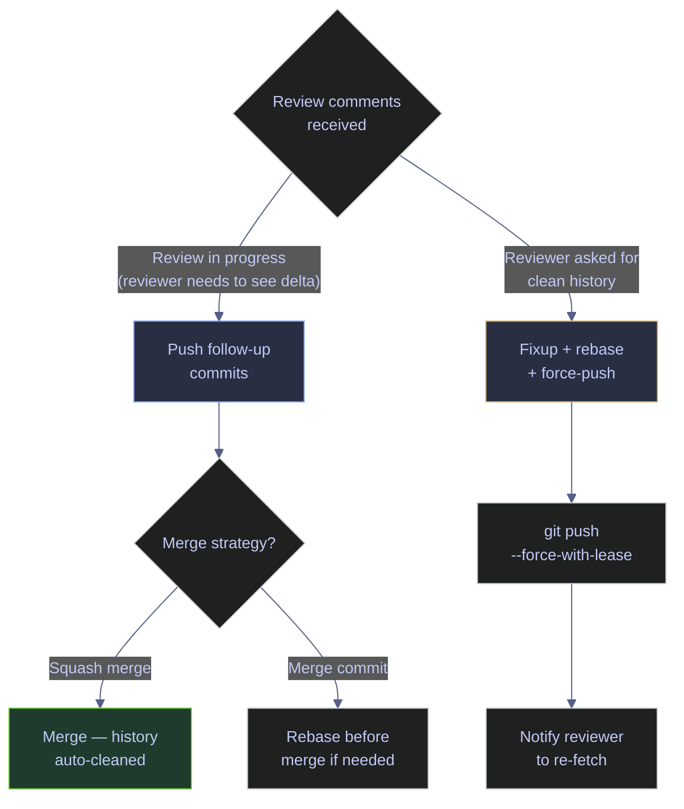

*Decision flowchart for updating a PR after review comments. During active review, push follow-up commits so the reviewer can inspect only the delta since their last review. If the team uses squash-merge, the follow-up commits are automatically collapsed on merge — no cleanup needed. If the team uses merge commits and the reviewer wants a clean branch, use `git commit --fixup` + `git rebase -i --autosquash` + `git push --force-with-lease`, then notify the reviewer to re-fetch.*

### Audit-friendly vs clean history

Not all branches should be cleaned up the same way. The right approach depends on what the branch contains:

| Branch type | Recommended approach | Why |
|---|---|---|
| Feature branch (new functionality) | Squash-merge or fixup before merge | Only the final result matters on `main`. Clean history makes `git bisect` and `git log` more useful. |
| Migration branch (schema changes) | Merge commit, keep all commits | Each migration step is an audit artifact. Squashing can obscure the order of operations and make rollbacks harder to reason about. |
| Infrastructure / Terraform branch | Merge commit, keep all commits | "Who changed what and when" may be questioned during incidents. The full commit trail is the evidence. |
| Hotfix branch (single commit) | Fast-forward or cherry-pick | The branch is a single commit — no cleanup needed. |
| Refactoring branch (code moves) | Squash-merge | The intermediate states (move file, fix imports, update tests) are not individually meaningful. |

> [!tip] Default recommendation
>
> Use squash-merge for feature branches and refactoring. Use merge commits for migration branches, infrastructure changes, and any work where auditability outweighs cleanliness. Configure this per-PR on GitHub (the merge button dropdown lets you choose each time) rather than enforcing a single strategy repository-wide.

## Operating Guidance

- **Branch early, branch often.** Branches are cheap. Never work directly on `main` — even a one-line fix should go through a branch.
- **Delete merged branches.** Use `git branch --merged` to find branches that have been integrated, then delete them. Stale branches create confusion and make `git branch -v` noisy.
- **Rebase before merge for clean history.** If your team values linear history, rebase your feature branch onto main before merging. This makes `git bisect` and `git log` more useful.
- **Never rebase shared branches.** If anyone else has pulled your branch, use merge instead. Rebasing shared branches creates duplicate commits and merge conflicts.
- **Use `--force-with-lease`, never `--force`.** If you must push after a rebase, `--force-with-lease` checks that the remote has not changed since your last fetch. `--force` overwrites unconditionally and can destroy a colleague's work.
- **Stash before switching.** If you have uncommitted work and need to switch branches, stash first with a descriptive message. Use `git stash push -u -m "description"` to include untracked files.
- **Use worktrees for parallel work.** If you frequently context-switch between branches, `git worktree` avoids the stash-switch-restore cycle entirely.
- **Check the reflog first.** Before panicking about lost work, run `git reflog`. Almost everything in Git is recoverable for at least 30 days.
- **Run `git branch --no-merged` before cutting a release.** This ensures no feature work is accidentally left behind.
- **Validate after merge in data pipelines.** File-level merge resolution does not guarantee semantic correctness. Always run `dbt compile`, `airflow dags test`, or your equivalent validation step after merging branches that touch pipeline code.
