# Merge vs Rebase vs Squash

> [!quote]
> "I want clean history, but that really means (a) clean and (b) history."
>
> — **Linus Torvalds**, Git mailing list

Three strategies for integrating changes from one branch into another. Each produces a different commit history shape: a standard merge preserves branch topology with a merge commit, rebase replays commits linearly with new SHAs, and squash merge collapses all branch commits into one. Choosing the wrong strategy for your context can make history hard to read, bisect, or revert — and in the worst case, can destroy teammates' work by rewriting shared history.

## Key Definitions

Every term used in this page is defined here. If a term appears in a command output or diagram, this table is the reference.

| Term | Definition |
|---|---|
| **Merge commit** | A commit with two parent pointers — one from each branch being joined. It records the integration point where two lines of work converged. Created by `git merge` when branches have diverged. |
| **Fast-forward** | When the target branch has not diverged from the source, Git moves the branch pointer forward to the source tip without creating a merge commit. No new commit is produced — the pointer simply advances. |
| **Three-way merge** | The merge algorithm Git uses when branches have diverged. It compares three snapshots: the common ancestor, the tip of the current branch, and the tip of the branch being merged. The result is a new merge commit combining both diffs. |
| **Common ancestor** | The most recent commit shared by both branches before they diverged. Git finds this automatically using `git merge-base`. It is the reference point for computing diffs during a merge or rebase. |
| **Rebase** | Detaching commits from their original base and replaying them one by one onto a new base commit. Each replayed commit receives a new SHA because its parent pointer changes. The content (diff) is identical but the identity (hash) is not. |
| **SHA (commit hash)** | A 40-character hexadecimal identifier computed from a commit's content, parent pointer(s), author, timestamp, and message. Changing any of these — including the parent — produces a different SHA. |
| **History rewriting** | Any operation that changes existing commit SHAs: rebase, amend, interactive rebase, filter-branch. After rewriting, the original commits become orphaned and are retained in the reflog for approximately 90 days. |
| **Squash merge** | Combining all commits from a branch into a single staged changeset on the target branch. The individual commits are discarded from the target's log. The branch pointer is not advanced. |
| **Reflog** | A local log of every position HEAD and branch pointers have occupied. It records orphaned commits after rebase or amend, making recovery possible within the default 90-day expiry window. |
| **Force push** | Overwriting a remote branch with local history that has diverged from the remote's history. Required after rebase because the rewritten SHAs no longer match the remote. `--force-with-lease` is the safe variant — it refuses if the remote has commits you have not fetched. |
| **ort strategy** | The default merge strategy since Git 2.34, replacing the older `recursive` strategy. It handles renames, directory merges, and large repositories more efficiently. |
| **Branch pointer** | A lightweight movable reference that points to a specific commit SHA. Creating a branch, merging, and rebasing all work by moving these pointers — no files are copied. |
| **Orphaned commit** | A commit that is no longer reachable from any branch pointer. It still exists in the object store and can be found via `git reflog` until garbage collection removes it (default: 90 days for unreachable objects). |
| **Merge traceability** | The ability to determine, from `git log --graph`, when a set of changes was integrated and from which branch. Standard merge preserves this via the merge commit's two parents. Rebase and squash discard it. |
| **Conflict markers** | Lines Git writes into a file when it cannot automatically merge a region. `<<<<<<< HEAD`, `=======`, and `>>>>>>> branch` delimit the two versions. The developer must edit the file to resolve the conflict, then stage it. |
| **rerere** | "Reuse recorded resolution" — a Git feature that remembers how you resolved a conflict and automatically applies the same resolution if the same conflict pattern appears again. Enabled with `git config rerere.enabled true`. |
| **zdiff3** | An enhanced conflict marker style (Git 2.35+) that shows three sections — yours, the common ancestor, and theirs — making it easier to understand what each side changed. Enabled with `git config merge.conflictstyle zdiff3`. |
| **Merge queue** | A server-side feature (GitHub, GitLab) that serializes PR merges — each PR is tested against the accumulated changes of all PRs ahead of it in the queue, preventing broken builds on `main`. |
| **Stacked PRs** | A workflow where PR2 depends on PR1, PR3 depends on PR2, and so on. Each PR's branch is based on the previous PR's branch rather than on `main`. |
| **DCO (Developer Certificate of Origin)** | A lightweight mechanism for contributors to certify they have the right to submit code. Implemented via `Signed-off-by:` trailers in commit messages. Required by many open-source projects and some regulated companies. |
| **Semi-linear merge** | A server-side merge mode (GitLab, Azure DevOps) that rebases the branch onto the target first, then creates a merge commit. Combines the benefits of rebase (up-to-date branch) with merge (traceability). |

## Conceptual Model

Before learning the commands, understand the three graph shapes that result from each strategy. Every Git repository is a directed acyclic graph (DAG) of commits. Each strategy modifies this graph differently.

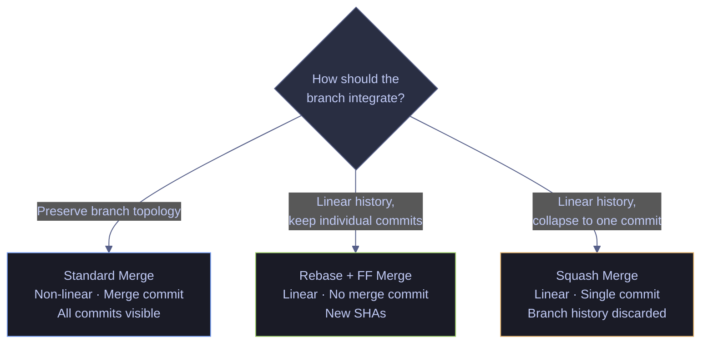

*The three integration strategies produce fundamentally different graph shapes. Standard merge creates a non-linear graph with merge commits preserving branch topology. Rebase produces a linear graph by replaying commits with new SHAs. Squash merge produces a linear graph by collapsing all branch commits into a single commit.*

### Merge vs rebase vs squash | comparison table

| Aspect | Standard Merge | Rebase | Squash Merge |
|---|---|---|---|
| **History shape** | Non-linear (merge commits) | Linear | Linear (single commit) |
| **Preserves individual commits** | Yes — all commits remain in log | Yes — replayed with new SHAs | No — collapsed into one |
| **Creates merge commit** | Yes — two-parent commit | No | No |
| **Changes existing SHAs** | No — existing commits untouched | Yes — every replayed commit gets a new SHA | No — original branch commits remain, but are not referenced by target |
| **Branch traceability** | Full — merge commit records which branch was integrated | None — commits appear as if written directly on target | None — single commit, no branch record |
| **Bisectability** | Full — each original commit is individually testable | Full — each replayed commit is individually testable | Reduced — only the single squash commit can be tested |
| **Revert granularity** | Individual commits or the entire merge commit | Individual commits | Only the single squash commit |
| **Requires force-push** | No | Yes — if branch was previously pushed | No |
| **Safe on shared branches** | Yes | No — rewrites history others may have pulled | Yes |

## Standard Merge

A standard merge joins two branches by creating a new **merge commit** — a commit with two parents, one from each branch. The full history of both branches is preserved: every individual commit on the feature branch remains visible in `git log --graph`. HEAD advances to the new merge commit; existing branch pointers are not rewritten.

Git uses the **ort** merge strategy (default since Git 2.34) to perform a **three-way merge**: it finds the common ancestor of the two branch tips, computes the diff from the ancestor to each tip, and combines both diffs into a single result. If the same region of a file was modified on both branches, Git reports a **merge conflict** that must be resolved manually.

A **fast-forward merge** is a special case: if the target branch has not diverged (no new commits since the branch was created), Git simply advances the branch pointer to the source tip without creating a merge commit. The `--no-ff` flag forces a merge commit even when fast-forward is possible, preserving the record that a feature branch existed.

### git merge | three-way merge

A three-way merge creates a new commit with two parent commits: the tip of the current branch and the tip of the branch being merged. Git finds the common ancestor automatically and applies both diffs. The working tree, staging area, and HEAD all advance to the new merge commit.

**Before merge:**

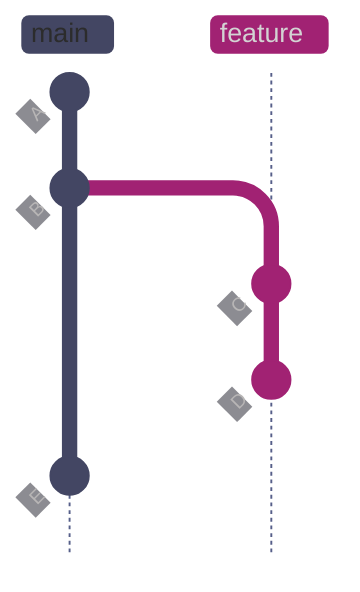

*Main has commits A and B, then advanced to E (adding pipeline configuration constants). The feature branch forked from B and has two commits: C (currency code validator) and D (unit tests). B is the common ancestor. Because main advanced to E independently, the branches have diverged — Git cannot fast-forward and must perform a three-way merge using snapshots B, D, and E.*

**After merge:**

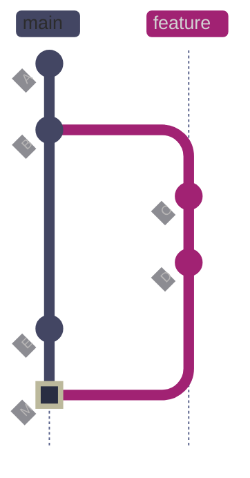

*After `git merge demo/merge-strategy`, Git creates merge commit M (marked green) with two parents: E (the tip of main) and D (the tip of the feature branch). Both branch histories remain fully visible in `git log --graph`. Commits C and D retain their original SHAs — nothing is rewritten. The merge commit M records exactly when and where the integration happened, providing full traceability.*

#### Switch to the receiving branch

**When to run:** Before any merge — you must be on the branch that will receive the changes.
**Trigger:** Starting a branch integration workflow.
**Context:** Local operation. Read-only (no commits created). Switches HEAD, working tree, and staging area.
**Purpose:** Position HEAD on the target branch so the merge commit will be recorded there.

*Switch to main before merging the feature branch.*

```bash
git checkout main
```

#### Merge the feature branch

**When to run:** After switching to the receiving branch, when the feature is complete and ready to integrate.
**Trigger:** PR approval, feature completion, or scheduled integration.
**Context:** Local state-changing operation. Creates a new merge commit on the current branch. Does not affect the remote until you push.
**Purpose:** Integrate all commits from the feature branch into main, preserving the full commit history and branch topology.

*Merge the feature branch into main using the default three-way merge strategy.*

```bash
git merge demo/merge-strategy -m "merge: integrate currency code validator"
```

```text
Merge made by the 'ort' strategy.
 src/currency_validator.py        | 11 +++++++++++
 tests/test_currency_validator.py | 16 ++++++++++++++++
 2 files changed, 27 insertions(+)
 create mode 100644 src/currency_validator.py
 create mode 100644 tests/test_currency_validator.py
```

The output confirms the **ort** strategy was used. Two files were created with a total of 27 insertions. The merge commit has two parents — the previous tip of main and the tip of the feature branch.

#### Verify the merge graph

*Inspect the commit graph to confirm the merge commit has two parent lines.*

```bash
git log --oneline --graph -8
```

```text
*   11df7ed merge: integrate currency code validator
|\
| * c34c0f0 test: add currency validator unit tests
| * 72ccff9 feat: add currency code validator for price feed
* | 54daa03 chore: add pipeline configuration constants
|/
* 3c60ed4 fix: handle NaN values in price feed
*   72edabc merge: integrate centralized logging module
|\
| * b948ccd feat: add centralized logging module
|/
```

The `|\` and `|/` lines show the branch topology. Commit `11df7ed` is the merge commit with two parents: `54daa03` (main's previous tip) and `c34c0f0` (feature's tip). Every individual commit on the feature branch remains visible and individually revertible.

### git merge --no-ff | force merge commit

When a feature branch has not diverged from main (no new commits on main since the branch was created), Git defaults to a fast-forward — it just moves the main pointer forward. The `--no-ff` flag overrides this behavior and forces a merge commit even when fast-forward is possible.

This is useful for preserving the record that a feature branch existed. Without `--no-ff`, the feature commits appear as if they were made directly on main, losing the grouping context.

**Before --no-ff merge:**

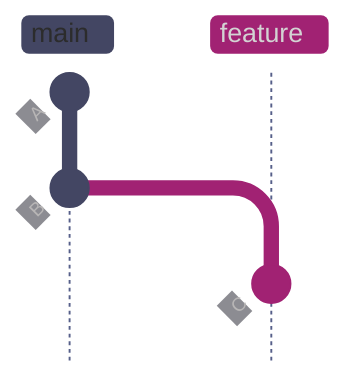

*Main is at B. The feature branch has one commit C (US market holiday calendar). Main has not advanced — a plain `git merge` would fast-forward, moving main's pointer to C without creating a merge commit. The branch record would be lost.*

**After --no-ff merge:**

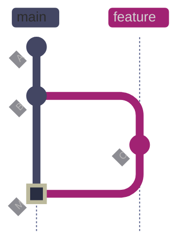

*With `--no-ff`, Git creates merge commit M (marked green) even though fast-forward was possible. The merge commit has two parents: B (main) and C (feature). The branch topology is preserved in the graph — `git log --graph` will show the feature branch as a separate line that was merged in.*

#### Force a merge commit on a non-diverged branch

**When to run:** When merging a feature branch that has not diverged from main, but you want to preserve the branch topology in the log.
**Trigger:** Team policy requires merge commits for traceability, or you want `git log --graph` to show the feature as a distinct branch.
**Context:** Local state-changing operation. Creates a merge commit even when fast-forward would produce the same tree content.
**Purpose:** Record the integration point and preserve the visual grouping of feature commits in the graph.

*Force a merge commit for the holiday calendar branch, even though main has not diverged.*

```bash
git merge --no-ff demo/noff-merge -m "merge: add US market holiday calendar"
```

```text
Merge made by the 'ort' strategy.
 src/holidays.py | 13 +++++++++++++
 1 file changed, 13 insertions(+)
 create mode 100644 src/holidays.py
```

### git merge --ff-only | refuse non-fast-forward

The `--ff-only` flag tells Git to merge only if a fast-forward is possible. If the branches have diverged, the merge is aborted. This is useful in CI/CD pipelines and automated scripts where a diverged state indicates the branch needs to be rebased first.

#### Reject a merge when branches have diverged

**When to run:** In CI pipelines or scripts where you want to guarantee linear history — if the branch needs a three-way merge, the script should fail and require a rebase first.
**Trigger:** Automated merge step in a deployment pipeline.
**Context:** Local operation. If the merge cannot fast-forward, Git exits with code 128 and no changes are made.
**Purpose:** Enforce linear history by refusing to create merge commits.

*Attempt to fast-forward merge a branch that has diverged from main.*

```bash
git merge --ff-only demo/ffonly-test
```

```text
fatal: Not possible to fast-forward, aborting.
```

The merge was rejected because `demo/ffonly-test` branched from an earlier commit and main has advanced since then. To proceed, rebase the branch onto main first, then retry with `--ff-only`.

| Flag | Syntax | Description |
|---|---|---|
| `--no-ff` | `git merge --no-ff <branch>` | Force a merge commit even when fast-forward is possible |
| `--ff-only` | `git merge --ff-only <branch>` | Refuse to merge if fast-forward is not possible — exit with error |
| `--squash` | `git merge --squash <branch>` | Collapse all commits into one staged change without committing (see Squash Merge section) |
| `--abort` | `git merge --abort` | Abort an in-progress merge and restore the pre-merge state |
| `--continue` | `git merge --continue` | Continue a merge after resolving conflicts (equivalent to `git commit`) |
| `--no-commit` | `git merge --no-commit <branch>` | Perform the merge but stop before creating the commit, allowing inspection |
| `-m` | `git merge -m "msg" <branch>` | Override the auto-generated merge commit message |
| `--strategy` | `git merge --strategy=ort <branch>` | Specify the merge strategy (default: `ort` since Git 2.34) |
| `--strategy-option` | `git merge -X theirs <branch>` | Pass options to the merge strategy (e.g., `theirs` to auto-resolve conflicts favoring the incoming branch) |
| `--verify` | `git merge --verify <branch>` | Run pre-merge and commit-msg hooks (default behavior) |
| `--no-verify` | `git merge --no-verify <branch>` | Skip pre-merge and commit-msg hooks |
| `--stat` | `git merge --stat <branch>` | Show a diffstat after merge (default behavior) |
| `--no-stat` | `git merge --no-stat <branch>` | Suppress the diffstat after merge |

## Rebase

Rebasing detaches your commits from where they originally branched off and **replays** them one by one on top of the target branch's latest commit. Each replayed commit gets a **new SHA** — the content (diff) is identical but the parent pointer changes, which changes the hash. The result is a clean, linear history with no merge commits, as if the feature work started after all main-branch commits were already in place.

Because rebase rewrites history (new SHAs), it must only be used on **local or private branches**. If others have already pulled the branch, the rewritten commits will diverge from their copies — their next `git pull` will see conflicting histories and produce duplicate commits or merge conflicts that are painful to untangle.

After rebasing, the feature branch is a direct descendant of the target branch. A subsequent `git merge` from the target will fast-forward — no merge commit is created. This is the core value proposition: rebase + fast-forward merge produces a perfectly linear history.

### git rebase | replay commits on new base

The rebase operation moves the branch's fork point from the original common ancestor to the current tip of the target branch, then replays each commit in order. If any commit conflicts with the new base, Git pauses and asks you to resolve it before continuing with `git rebase --continue`. The original commits become orphaned and are retained in the reflog for approximately 90 days.

**Before rebase:**


*Main has advanced to E (retry decorator with exponential backoff) since the feature branch forked from the merge commit after B. The feature branch has two commits: C (market hours utility, SHA d571276) and D (market hours tests, SHA fad1518). The common ancestor is the merge commit. Both branches have diverged — a plain merge would create a merge commit. Rebase will instead replay C and D onto E.*

**After rebase:**

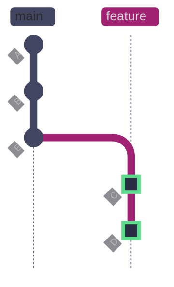

*After `git rebase main`: Git first identifies E as main's tip, then replays the feature branch's commits one at a time on top of E. C becomes C' (marked green, new SHA 4db58ad) and D becomes D' (marked green, new SHA cc230bc). The diffs are identical to the originals, but the SHAs changed because each commit now has a different parent. The original commits (d571276 and fad1518) are orphaned and visible only in the reflog. The feature branch is now a direct descendant of main — a fast-forward merge will produce a fully linear history with no merge commit.*

> [!danger] Never Rebase Shared Branches
>
> Rebasing rewrites commit SHAs. If others have pulled your branch, the rewritten commits will diverge from their copies. Their next `git pull` will attempt to merge the old history with the new one, producing duplicate commits and confusing conflicts. Only rebase branches that no one else has checked out.
>
> - **Shared branch** = any branch that another person has fetched, checked out, or based work on.
> - **Private branch** = a branch that exists only in your local repository, or a pushed branch that you are the sole contributor to and no one has based work on.

> [!success] Use Merge to Update a Shared Branch
>
> While your PR is open and teammates may have checked out your branch, use `git merge origin/main` to incorporate upstream changes. This adds a merge commit but does not rewrite any existing SHAs, keeping all references stable for everyone who has pulled the branch.

#### Switch to the feature branch

**When to run:** Before rebasing — rebase operates on the currently checked-out branch.
**Trigger:** You want to update your feature branch with the latest changes from main before opening a PR.
**Context:** Local operation. Switches HEAD, working tree, and staging area to the feature branch.
**Purpose:** Position HEAD on the branch whose commits will be replayed.

*Switch to the feature branch that will be rebased.*

```bash
git checkout demo/rebase-strategy
```

#### Rebase onto main

**When to run:** After fetching the latest main and switching to your feature branch.
**Trigger:** Main has advanced since you branched, and you want a linear history without a merge commit.
**Context:** Local history-rewriting operation. Every commit on the feature branch gets a new SHA. If the branch was previously pushed, you must force-push after rebasing. Conflicts are resolved commit-by-commit.
**Purpose:** Replay all feature commits on top of main's latest tip, producing a linear history.

*Rebase the feature branch onto the current tip of main.*

```bash
git rebase main
```

```text
Successfully rebased and updated refs/heads/demo/rebase-strategy.
```

The original commits (d571276, fad1518) have been replaced by new commits (4db58ad, cc230bc) with different SHAs but identical diffs.

#### Verify the rebase with reflog

*The reflog preserves the original commit SHAs before the rebase, enabling recovery if needed.*

```bash
git reflog demo/rebase-strategy
```

```text
cc230bc demo/rebase-strategy@{0}: rebase (finish): refs/heads/demo/rebase-strategy onto 290604d
fad1518 demo/rebase-strategy@{1}: commit: test: add market hours configuration tests
d571276 demo/rebase-strategy@{2}: commit: feat: add market hours utility for exchange scheduling
11df7ed demo/rebase-strategy@{3}: branch: Created from main
```

The reflog shows the branch was created from main at `11df7ed`, had two commits (d571276, fad1518), and was rebased onto `290604d`. The original SHAs are recoverable with `git reset --hard fad1518` within the 90-day reflog window.

#### Fast-forward merge after rebase

**When to run:** After rebasing your feature branch, switch to main and merge. Because the feature is now a direct descendant, Git fast-forwards.
**Trigger:** Rebase completed successfully — feature branch is ready to integrate.
**Context:** Local state-changing operation. Moves main's pointer forward. No merge commit is created.
**Purpose:** Integrate the rebased feature into main, producing a fully linear history.

*Switch to main and fast-forward merge the rebased feature branch.*

```bash
git checkout main
git merge demo/rebase-strategy
```

```text
Updating 290604d..cc230bc
Fast-forward
 src/market_hours.py        | 18 ++++++++++++++++++
 tests/test_market_hours.py |  8 ++++++++
 2 files changed, 26 insertions(+)
 create mode 100644 src/market_hours.py
 create mode 100644 tests/test_market_hours.py
```

The output says `Fast-forward` — no merge commit was created. Main's pointer moved from `290604d` directly to `cc230bc`. The resulting history is perfectly linear: every commit appears in sequence with no branch forks or merge commits.

### git push --force-with-lease | safe force push after rebase

If you pushed your branch to the remote before rebasing, the remote still has the old SHAs. After rebase, a regular `git push` will be rejected because the histories have diverged. You must force-push — but use `--force-with-lease`, not `--force`.

`--force-with-lease` checks that the remote branch is still at the position you last fetched. If someone else pushed new commits to the branch since your last fetch, the push is rejected — protecting their work. Plain `--force` overwrites the remote unconditionally, which can destroy commits that teammates pushed.

#### Force push a rebased branch safely

**When to run:** After rebasing a branch that was previously pushed to the remote.
**Trigger:** `git push` was rejected with "non-fast-forward" because the rebased SHAs differ from the remote's.
**Context:** Remote state-changing operation. Overwrites the remote branch history. `--force-with-lease` provides a safety check against overwriting teammates' work.
**Purpose:** Update the remote branch with the rebased history while verifying no one else has pushed to it.

> [!danger] Never use --force on shared branches
>
> `git push --force` overwrites the remote branch unconditionally. If a teammate pushed commits after your last fetch, those commits are permanently lost from the remote. There is no confirmation prompt — the overwrite is immediate and silent.

> [!success] Always use --force-with-lease
>
> `git push --force-with-lease` compares the remote ref to your local tracking ref. If someone else pushed commits you have not fetched, the push fails with a clear error. Fetch first, resolve any conflicts, and retry.

*Force push the rebased branch with the safety lease check.*

```bash
git push --force-with-lease
```

| Flag | Syntax | Description |
|---|---|---|
| `--onto` | `git rebase --onto main A feat` | Replay commits reachable from `feat` but not from `A` onto `main` — transplant a subset of commits |
| `-i` | `git rebase -i HEAD~N` | Interactive rebase: reorder, squash, fixup, edit, or drop the last N commits |
| `--continue` | `git rebase --continue` | Continue replaying after resolving a conflict on the current commit |
| `--abort` | `git rebase --abort` | Abort the rebase entirely and restore the branch to its original state |
| `--skip` | `git rebase --skip` | Skip the current conflicting commit and continue replaying the rest |
| `--autosquash` | `git rebase -i --autosquash` | Automatically reorder `fixup!` and `squash!` commits to match their targets |
| `--autostash` | `git rebase --autostash` | Stash uncommitted changes before rebase, apply them after — avoids "dirty working tree" errors |
| `--no-ff` | `git rebase --no-ff` | Force cherry-pick instead of fast-forward for commits that could be applied directly |
| `--keep-base` | `git rebase --keep-base main` | Rebase onto the merge-base of the branch and main, preserving the fork point — useful for reformatting commits without changing the base |
| `--update-refs` | `git rebase --update-refs` | Automatically update stacked branch pointers during rebase (Git 2.38+) |

## Squash Merge

Squash merging takes all the commits on a feature branch and **condenses them into a single staged changeset** on the target branch. Unlike a standard merge, `git merge --squash` does not create the commit automatically — it stages all changes and you write one final commit message. The feature branch's individual commit history is discarded from the target's log.

After a squash merge, the feature branch pointer is **not** advanced. Git does not record any relationship between the squash commit and the original branch — there is no parent link back to the feature commits. The branch should be deleted after the squash commit is made.

Squash merge is the right choice when the branch contains many small, incremental, or "work in progress" commits that individually add no value to main's history. The final squash commit should have a clear, descriptive message that summarizes the entire body of work.

### git merge --squash | collapse branch into single commit

The squash operation takes the combined diff between the common ancestor and the tip of the feature branch, applies it to the working tree and staging area of the target branch, then stops. No commit is created — the staging area contains all changes, and you create the final commit manually with a descriptive message.

**Before squash merge:**

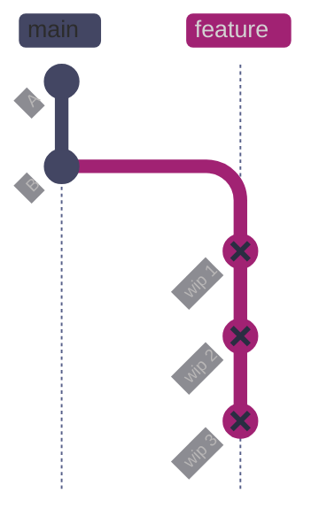

*The feature branch has three noisy WIP commits (marked red): "wip: scaffold sector mapper" (af11f2e), "wip: add GICS lookup table and get_sector function" (bdb06a8), and "fix typo in sector weight calc" (72b29d6). These commits represent iterative development that is not useful in main's permanent history. Individually, they are not meaningful to bisect or revert.*

**After squash merge:**

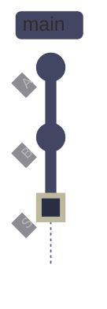

*After `git merge --squash` and `git commit`, commit S (marked green, SHA 38abae3) appears on main as a single commit containing the combined diff of all three WIP commits. The feature branch pointer was not advanced — it still points to 72b29d6. There is no parent link from S back to the feature branch, so `git log --graph` shows S as a regular single-parent commit, not a merge. The feature branch should be deleted after this step.*

> [!warning] Squash discards individual commit history
>
> After a squash merge, all individual commits on the feature branch are collapsed into one. You lose:
>
> - **Bisect granularity** — `git bisect` can only identify the squash commit, not the specific change within the branch that introduced a bug.
> - **Revert granularity** — you can only revert the entire squash commit, not a specific sub-change.
> - **Author attribution** — if multiple people committed to the branch, only the squash committer appears in main's log.

> [!success] Use Standard Merge for Meaningful History
>
> For feature branches with multiple distinct commits that reviewers or future debuggers will want to inspect individually, use `git merge` (without `--squash`). Each commit remains visible in `git log --graph` and can be individually reverted or bisected.

#### Switch to the receiving branch

*Switch to main before performing the squash merge.*

```bash
git checkout main
```

#### Stage all feature commits as a single changeset

**When to run:** When the feature branch is complete but its commit history is noisy — WIP commits, typo fixes, or iterative scaffolding that adds no value to main.
**Trigger:** PR ready for merge, and the team policy is squash-merge for small features.
**Context:** Local state-changing operation. Stages all changes from the feature branch but does not create a commit. HEAD is not updated until you commit manually.
**Purpose:** Collapse all branch commits into a single staged changeset, ready for a descriptive commit message.

*Squash merge the feature branch — this stages all changes without committing.*

```bash
git merge --squash demo/squash-strategy
```

```text
Updating cc230bc..72b29d6
Fast-forward
Squash commit -- not updating HEAD
 src/sector_mapper.py | 19 +++++++++++++++++++
 1 file changed, 19 insertions(+)
 create mode 100644 src/sector_mapper.py
```

The output confirms `Squash commit -- not updating HEAD`. All changes are staged but no commit exists yet. The staging area contains the combined diff of all three feature branch commits.

#### Create the squash commit

**When to run:** Immediately after `git merge --squash` — the staging area has all changes ready.
**Trigger:** Squash merge completed successfully.
**Context:** Local state-changing operation. Creates a single commit on main. The commit message should summarize all work from the feature branch.
**Purpose:** Record the feature as a single, well-described commit in main's history.

*Commit the squashed changes with a descriptive message.*

```bash
git commit -m "feat: add GICS sector mapper with portfolio weight calculation"
```

```text
[main 38abae3] feat: add GICS sector mapper with portfolio weight calculation
 1 file changed, 19 insertions(+)
 create mode 100644 src/sector_mapper.py
```

#### Delete the feature branch after squash

**When to run:** After the squash commit is confirmed on main.
**Trigger:** Squash merge workflow is complete.
**Context:** Local operation. The feature branch pointer was not advanced by the squash merge — it still points to the last WIP commit. Deleting it prevents confusion.
**Purpose:** Clean up the stale branch reference.

*Delete the feature branch locally after squash merge.*

```bash
git branch -d demo/squash-strategy
```

> [!tip] Use -D if Git refuses -d
>
> After a squash merge, Git may refuse `git branch -d` because it cannot detect that the branch's commits were merged (the squash commit has no parent link to the feature branch). Use `git branch -D` to force-delete the branch when you are certain the squash commit captured all changes.

| Flag | Syntax | Description |
|---|---|---|
| `--squash` | `git merge --squash <branch>` | Stage all changes from the branch as a single changeset without committing |
| `--no-commit` | `git merge --no-commit <branch>` | Perform the merge but stop before creating the commit |
| `--abort` | `git merge --abort` | Abort the in-progress merge and restore the pre-merge state |

## Interactive Rebase — Clean Up Before PR

Interactive rebase (`git rebase -i`) lets you rewrite the last N commits on your branch: squash multiple commits into one, reword messages, reorder commits, edit a commit's content, or drop commits entirely. This is a **local history cleanup** tool — use it on your private branch before opening a PR to present a clean, professional commit history.

Interactive rebase is different from squash merge: it gives you fine-grained control over which commits to keep, combine, or discard, whereas squash merge collapses everything into one.

### git rebase -i | interactive commit editing

The interactive rebase opens a todo list of commits with an action keyword for each. The default action is `pick` (keep the commit as-is). You change the keyword to control what happens to each commit.

| Keyword | Effect |
|---|---|
| `pick` | Keep the commit as-is |
| `reword` | Keep the commit but edit its message |
| `edit` | Pause at this commit to amend its content |
| `squash` | Combine this commit with the one above it, merging both messages |
| `fixup` | Combine this commit with the one above it, discarding this commit's message |
| `drop` | Remove this commit entirely |

**Before interactive rebase:**

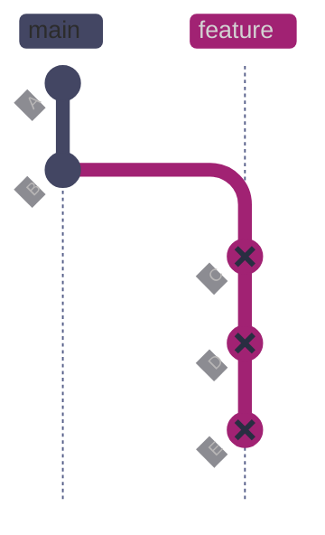

*Feature branch has three messy commits (marked red): C ("wip: start dag scheduler", SHA 54d4f4d), D ("wip: add imports", SHA 36482e9), and E ("fix: lint error in dag scheduler", SHA 96b7c31). These should be combined into a single clean commit before opening a PR.*

**After interactive rebase:**

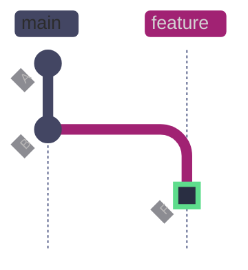

*After `git rebase -i HEAD~3` with `fixup` on commits D and E: all three commits are combined into a single commit F (marked green, new SHA 7d92958). The diffs from D and E are folded into F, and their commit messages are discarded. The result is a single clean commit ready for PR review. The original commits (54d4f4d, 36482e9, 96b7c31) are orphaned and recoverable via reflog.*

#### Squash messy commits with fixup

**When to run:** Before opening a PR, when your branch has WIP, typo-fix, or iterative commits that should be combined.
**Trigger:** Branch has multiple commits where only the combined result matters.
**Context:** Local history-rewriting operation. Rewrites SHAs for all affected commits. If the branch was previously pushed, force-push is required after.
**Purpose:** Present a clean, professional commit history for review.

> [!info]- How interactive rebase with fixup works
>
> `git rebase -i HEAD~3` opens a todo list of the last 3 commits. Changing `pick` to `fixup` on a commit combines it with the commit above it, discarding the fixup commit's message. The todo list for this example:
>
> ```text
> pick 54d4f4d wip: start dag scheduler
> fixup 36482e9 wip: add imports
> fixup 96b7c31 fix: lint error in dag scheduler
> ```
>
> Commits 2 and 3 are folded into commit 1. The resulting single commit keeps the message "wip: start dag scheduler" (which you would then reword to something descriptive).

*Before interactive rebase — three messy commits on the feature branch.*

```bash
git log --oneline -4
```

```text
96b7c31 fix: lint error in dag scheduler
36482e9 wip: add imports
54d4f4d wip: start dag scheduler
06f13ca merge: add US market holiday calendar
```

*After interactive rebase with fixup — three commits collapsed into one.*

```bash
git log --oneline -3
```

```text
7d92958 wip: start dag scheduler
06f13ca merge: add US market holiday calendar
63b9cd5 feat: add US market holiday calendar for 2026
```

The three commits have been combined into a single commit `7d92958`. The original SHAs (54d4f4d, 36482e9, 96b7c31) no longer appear in the branch log but remain in the reflog for recovery.

> [!tip] Use fixup commits for deferred cleanup
>
> Instead of amending a commit directly, create a new commit with `git commit --fixup=<target-SHA>`. Later, `git rebase -i --autosquash` will automatically place the fixup commit after its target and mark it with the `fixup` keyword. This is especially useful during code review — you can push individual fix commits for reviewers to inspect, then squash them before merging.

## Conflict Resolution Across Strategies

Merge conflicts arise when both branches modify the same region of the same file. All three strategies can produce conflicts, but the mechanics, timing, and recovery differ significantly. Understanding these differences is essential because conflict risk is one of the central tradeoffs among strategies.

### Merge vs rebase vs squash | conflict handling comparison

| Aspect | Standard Merge | Rebase | Squash Merge |
|---|---|---|---|
| **When conflicts appear** | Once, at merge time — Git compares the two branch tips against the common ancestor | Per-commit — each replayed commit can conflict independently with the new base | Once — Git computes a combined diff and applies it; conflicts reflect the aggregate difference |
| **Conflict scope** | Full branch diff vs target — all changes from the branch are evaluated together | One commit at a time — earlier commits may conflict even if later ones would not | Aggregate diff — the same as merge, but represented as a single changeset |
| **Abort** | `git merge --abort` restores the pre-merge state completely | `git rebase --abort` restores the branch to its exact pre-rebase state | `git merge --abort` (same as standard merge — squash uses the same merge machinery) |
| **Continue** | Resolve all files, `git add`, then `git commit` (or `git merge --continue`) | Resolve the current commit's conflicts, `git add`, then `git rebase --continue` — repeat for each conflicting commit | Resolve all files, `git add`, then `git commit` (manual commit step) |
| **Skip** | Not applicable — merge is a single operation | `git rebase --skip` drops the current conflicting commit and continues with the next | Not applicable |
| **Worst case** | One round of conflict resolution | N rounds (one per conflicting commit) — long-lived branches with many commits can require repeated resolution | One round, but the aggregate diff may be larger and harder to understand than individual commit diffs |

### Conflict markers explained

When Git cannot automatically merge a file, it writes **conflict markers** into the file that show both versions of the conflicting region. The markers divide the file into three or four sections depending on the merge style.

#### Standard merge conflict markers

During a standard merge or squash merge, Git writes three-section markers:

```text
<<<<<<< HEAD
CACHE_TTL = 120
MAX_CONNECTIONS = 10
=======
CACHE_TTL = 600
RETRY_COUNT = 3
TIMEOUT = 30
>>>>>>> demo/conflict-merge
```

- `<<<<<<< HEAD` — start of the version on your current branch (the branch you are merging *into*)
- `=======` — separator between the two versions
- `>>>>>>> demo/conflict-merge` — end of the version from the branch being merged

Everything between `<<<<<<< HEAD` and `=======` is your branch's version. Everything between `=======` and `>>>>>>> branch-name` is the incoming branch's version. To resolve, delete the markers and keep the correct content (which may be a combination of both).

#### Rebase conflict markers

During a rebase, the sides are reversed from what you might expect:

```text
CACHE_TTL = 120
MAX_CONNECTIONS = 10
RETRY_COUNT = 3
TIMEOUT = 30
<<<<<<< HEAD
LOG_LEVEL = "INFO"
=======
LOG_LEVEL = "DEBUG"
>>>>>>> 9bf5af5 (feat: add debug log level)
```

- `<<<<<<< HEAD` — during rebase, HEAD points to the **target branch** (the branch you are rebasing *onto*), not your feature branch
- `>>>>>>> 9bf5af5 (feat: add debug log level)` — the commit currently being replayed from your feature branch

> [!warning] Rebase Reverses the Sides
>
> In a merge, `HEAD` is your branch and the incoming branch is "theirs." In a rebase, `HEAD` is the target branch (e.g., `main`) and "theirs" is the commit being replayed from your feature branch. This reversal confuses many developers and can lead to accidentally keeping the wrong version.

> [!success] Use `--ours` and `--theirs` Carefully During Rebase
>
> During rebase, `--ours` refers to the target branch (main) and `--theirs` refers to the commit being replayed (your feature commit). This is the opposite of merge semantics. When in doubt, open the file and inspect the conflict markers directly rather than using `git checkout --ours` or `--theirs`.

#### Three-way diff markers with diff3

The default two-section conflict markers omit the common ancestor, making it harder to understand what each side changed. Enable `diff3` (or the newer `zdiff3`) to include the ancestor version:

```bash
git config --global merge.conflictstyle zdiff3
```

With `zdiff3` enabled, conflict markers show three sections:

```text
<<<<<<< HEAD
LOG_LEVEL = "INFO"
||||||| parent of 9bf5af5
LOG_LEVEL = "INFO"
=======
LOG_LEVEL = "DEBUG"
>>>>>>> 9bf5af5 (feat: add debug log level)
```

The `||||||| parent of ...` section shows the common ancestor version. This makes the intent of each change clear: the ancestor had `"INFO"`, HEAD kept `"INFO"`, and the incoming commit changed it to `"DEBUG"`.

> [!tip] Always Use zdiff3
>
> `zdiff3` (Git 2.35+) is an improvement over `diff3` that automatically collapses regions where only one side changed, reducing the number of conflict markers. Set it as the default for all repositories:
>
> ```bash
> git config --global merge.conflictstyle zdiff3
> ```

### Git | rerere | reuse recorded resolutions

`rerere` (reuse recorded resolution) is a Git feature that records how you resolved a conflict and automatically applies the same resolution if the same conflict appears again. This is especially valuable during rebase workflows where you may encounter the same conflict multiple times — for example, when rebasing a long-lived feature branch repeatedly as main advances.

#### Enable rerere

```bash
git config --global rerere.enabled true
```

#### How rerere works

When rerere is enabled and a conflict occurs, Git records the pre-image (the conflicted state) and, after you resolve it, the post-image (your resolution). If the same conflict appears in a future merge or rebase, Git automatically applies the recorded resolution.

During the conflict in git-lab, rerere recorded the pre-image:

```text
Recorded preimage for 'config.py'
```

After resolving and continuing the rebase, rerere stored the resolution:

```text
Recorded resolution for 'config.py'.
```

If the same conflict occurs again (e.g., when rebasing the same branch after main advances further), rerere will apply the stored resolution automatically, printing `Resolved 'config.py' using previous resolution` instead of stopping with conflict markers.

> [!tip] rerere Is Especially Valuable for Rebase Workflows
>
> Rebase resolves conflicts commit-by-commit. If you rebase a branch with 10 commits and the first commit conflicts, you resolve it. If you later rebase again (after main advances further), the same conflict reappears. With rerere enabled, the second rebase applies your stored resolution automatically. Without rerere, you resolve the same conflict manually every time.

> [!warning] rerere Can Apply Incorrect Resolutions
>
> If the context around a conflict changes significantly between rebases, a previously recorded resolution may produce incorrect results. Always verify the output after rerere applies a resolution. Use `git rerere forget <file>` to discard a recorded resolution that is no longer correct.

> [!success] Verify and Forget Stale Resolutions
>
> After rerere auto-resolves a conflict, inspect the file before staging:
>
> ```bash
> git diff config.py      # review the auto-applied resolution
> git rerere forget config.py  # discard if the resolution is wrong
> ```

### Mergetool workflow

For complex conflicts involving multiple regions or large files, a visual mergetool provides a three-pane view showing the base (ancestor), local (current branch), and remote (incoming branch) versions side by side.

#### Configure and launch a mergetool

```bash
git config --global merge.tool vimdiff
```

When a conflict occurs, launch the configured tool:

```bash
git mergetool
```

Git opens each conflicted file in the configured editor with three panes (base, local, remote) and a fourth pane for the merged result. After resolving, save and close the editor. Git marks the file as resolved and creates a `.orig` backup of the conflicted version.

> [!tip] Popular Mergetools for Data Engineers
>
> - **VS Code** — `git config --global merge.tool vscode` (requires `code` on PATH)
> - **IntelliJ / PyCharm** — built-in three-way merge, launched via IDE Git integration
> - **vimdiff** — terminal-based, available everywhere, no GUI dependency
> - **meld** — GTK-based visual diff, good for large files

> [!warning] Clean Up .orig Files After Mergetool
>
> `git mergetool` creates `.orig` backup files that should not be committed. Either add `*.orig` to `.gitignore` or configure Git to skip them:
>
> ```bash
> git config --global mergetool.keepBackup false
> ```

## Choosing a Strategy

The right strategy depends on the type of branch, its commit quality, whether the branch is shared, and whether the team values linear history over preserved context. Consistency within a team matters more than which strategy is theoretically optimal — document the default in your contributing guide and enforce it via branch protection rules.

### Strategy decision matrix

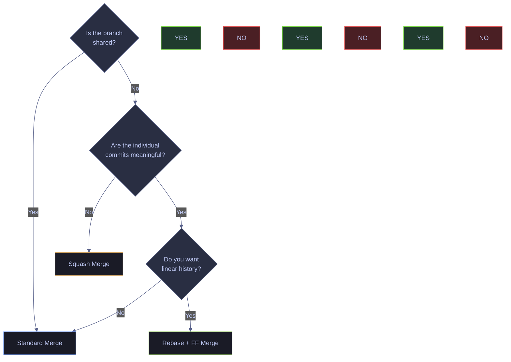

### Scenario-to-strategy matrix

| Scenario | Strategy | Rationale | Follow-up |
|---|---|---|---|
| Multi-commit feature with meaningful history | **Merge** | Preserves individual commits for bisect and revert. Merge commit records integration point. | `git merge --no-ff` to ensure merge commit even if fast-forward is possible. |
| Single developer, clean linear history preferred | **Rebase** | Commits appear sequentially on main with no merge noise. Each commit remains individually testable. | `git rebase main` then `git merge --ff-only` from main. |
| Branch with many WIP/fixup commits | **Squash** | Only the combined result matters. Eliminates noise from main's log. | `git merge --squash` then `git commit` with descriptive message. Delete branch after. |
| Hotfix with 1–2 commits | **Rebase or Squash** | Both produce linear history. Rebase keeps individual commits; squash combines them. | For single-commit fixes, the result is identical either way. |
| Long-lived branch (e.g., develop → main) | **Merge** | The merge commit marks the release integration point. Both parent histories remain intact for audit. | `git merge --no-ff` to preserve the branch record. |
| PR under active review, colleagues have checked out | **Merge** | Rebase would rewrite SHAs that teammates have pulled. Squash would discard their commit attribution. | `git merge origin/main` to update. Never rebase a shared branch. |
| Stacked PRs (PR2 depends on PR1) | **Rebase** | After PR1 merges, rebase PR2 onto main to remove the dependency. Use `--update-refs` (Git 2.38+) to maintain stacked branch pointers. | `git rebase --update-refs main` |
| Automated dependency bump (e.g., Dependabot) | **Squash** | One commit per dependency update keeps main clean. Individual bump commits add no diagnostic value. | Configure GitHub repo to default to "Squash and merge" for bot PRs. |

### Data-engineering scenarios

> [!example] dbt model refactor across multiple files
>
> A branch touches 15 dbt model files over 8 commits (initial refactor, test fixes, schema updates, doc updates). Each commit modifies a coherent set of files.
>
> **Use standard merge.** The individual commits map to distinct logical changes (model logic → test updates → schema → docs). Future debugging will benefit from `git bisect` across these commits if a model breaks. The merge commit records when this refactor was integrated.

> [!example] Airflow DAG migration — single logical change
>
> A branch has 6 commits: "wip scaffold", "add tasks", "fix import", "lint fix", "update connection_id", "add docstring". All commits modify the same `dags/etl_pipeline.py` file.
>
> **Use squash merge.** The individual commits are iterative development noise. A single commit with a clear message — `feat: migrate ETL pipeline to TaskFlow API` — is easier to audit and revert as a unit.

> [!example] Terraform infrastructure change
>
> A branch modifies a Terraform module, runs `terraform plan` to verify, then updates variable defaults. Three commits, all touching the same module.
>
> **Use squash merge.** Infrastructure changes should be atomic in the log — either the entire change is applied or it is reverted. Partial reverts of Terraform changes are dangerous. The squash commit makes revert safe and auditable.

> [!example] Database migration with generated SQL diffs
>
> A branch adds a migration file generated by Alembic or dbt, plus a manual data-fix script. Two distinct commits.
>
> **Use standard merge.** Migration files are individually significant — you need to know which migration was introduced and when. Squashing would hide the distinction between the migration definition and the data fix.

### Team policy and branch protection

> [!info] Enforcing a default strategy via GitHub branch protection
>
> GitHub allows repository admins to restrict which merge methods are available on pull requests. Under **Settings → Branches → Branch protection rules**, you can:
>
> - Allow only "Squash and merge" — enforces linear history with one commit per PR.
> - Allow only "Rebase and merge" — enforces linear history preserving individual commits.
> - Allow only "Create a merge commit" — preserves branch topology and traceability.
> - Allow a combination — lets PR authors choose per-PR.
>
> **Recommendation for data-engineering teams:** allow "Squash and merge" as the default for small features and bot PRs, and "Create a merge commit" for multi-commit features and releases. Disable "Rebase and merge" on the server side to prevent accidental SHA rewrites on shared branches — developers who want linear history can rebase locally before merging.

### Platform merge behavior — GitHub, GitLab, Bitbucket, Azure DevOps

All major Git hosting platforms expose merge strategies through their pull/merge request UI, but each platform implements them differently. The CLI behavior (`git merge`, `git rebase`) is consistent everywhere — it is the **server-side** behavior that varies.

#### GitHub

| UI Button | CLI Equivalent | Behavior Details |
|---|---|---|
| **Create a merge commit** | `git merge --no-ff` | Always creates a merge commit, regardless of divergence. Adds a `Merge pull request #N` default message. |
| **Squash and merge** | `git merge --squash` + `git commit` | One commit on main per PR. Concatenates all commit messages into the squash commit body by default. |
| **Rebase and merge** | `git rebase` + fast-forward | Replays PR commits linearly onto main. |

> [!info] GitHub Always Rewrites SHAs for "Rebase and merge"
>
> Even if the PR branch is already up to date with main, GitHub's "Rebase and merge" creates new commit SHAs — it does not fast-forward in place. GitHub adds a `committer` field and timestamp that differ from the original commits. Do not rely on SHA matching between your local branch and main after using this option.

> [!info] GitHub Merge Queues
>
> GitHub merge queues (available on Team and Enterprise plans) serialize PR merges to prevent broken builds on `main`. When enabled, PRs join a queue, are tested against the latest main + all PRs ahead in the queue, and merge only if tests pass. The merge queue uses the merge strategy configured in branch protection. This eliminates the "green PR turns red after merge" race condition.

#### GitLab

| UI Button | CLI Equivalent | Behavior Details |
|---|---|---|
| **Merge commit** | `git merge --no-ff` | Same as GitHub. Adds `See merge request !N` to the default message. |
| **Merge commit with semi-linear history** | Rebase + `git merge --no-ff` | First rebases the branch onto target, then creates a merge commit. Ensures the branch is up to date but preserves the merge commit for traceability. |
| **Fast-forward merge** | `git rebase` + fast-forward | Requires the branch to be rebased onto target first. No merge commit. Preserves original commit SHAs (unlike GitHub's "Rebase and merge"). |
| **Squash commit** | `git merge --squash` + `git commit` | Collapses all commits into one. GitLab preserves the original branch reference in the squash commit message by default. |

> [!info] GitLab's Semi-Linear History Is Unique
>
> GitLab's "semi-linear history" option rebases the branch first, then creates a merge commit. This guarantees that the merge commit's first parent always points to a commit that is on the target branch, making `git log --first-parent` produce a clean linear timeline while still preserving the merge commit for traceability. No other major platform offers this exact mode.

#### Bitbucket

| UI Button | CLI Equivalent | Behavior Details |
|---|---|---|
| **Merge commit** | `git merge --no-ff` | Always creates a merge commit. |
| **Squash** | `git merge --squash` + `git commit` | Single commit. Bitbucket concatenates commit messages by default. |
| **Fast-forward** | Fast-forward only | Only available if the branch is directly ahead of target. No SHA rewriting. |

Bitbucket does not offer a "rebase and merge" option through the UI. Teams wanting rebase-based linear history must rebase locally before merging.

#### Azure DevOps

| UI Button | CLI Equivalent | Behavior Details |
|---|---|---|
| **Merge (no fast-forward)** | `git merge --no-ff` | Always creates a merge commit. Default strategy. |
| **Squash merge** | `git merge --squash` + `git commit` | Single commit. Azure DevOps populates the commit message from the PR title and description. |
| **Rebase and fast-forward** | `git rebase` + fast-forward | Rebases then fast-forwards. SHAs are rewritten (new committer timestamp). |
| **Semi-linear merge** | Rebase + `git merge --no-ff` | Same concept as GitLab's semi-linear: rebase first, then create a merge commit. |

> [!info] Azure DevOps Branch Policies
>
> Azure DevOps allows administrators to require a specific merge strategy at the branch policy level — more granular than GitHub's repository-level protection. Policies can enforce minimum reviewer count, linked work items, successful builds, and a specific merge type (merge, squash, rebase, or semi-linear) per target branch.

#### Cross-platform comparison summary

| Capability | GitHub | GitLab | Bitbucket | Azure DevOps |
|---|---|---|---|---|
| Merge commit | Yes | Yes | Yes | Yes |
| Squash merge | Yes | Yes | Yes | Yes |
| Rebase + FF | Yes (rewrites SHAs) | Yes (preserves SHAs) | No (UI) | Yes (rewrites SHAs) |
| Semi-linear merge | No | Yes | No | Yes |
| Merge queues | Yes (Team/Enterprise) | Yes (Premium) | No | No (use pipeline gates) |
| Strategy enforcement | Branch protection rules | Project merge settings | Branch permissions | Branch policies |
| Squash commit message source | Concatenated commit messages | Concatenated commit messages | Concatenated commit messages | PR title + description |

## Governance, Compliance, and Attribution

In regulated environments — financial services, healthcare, government contracting, SOC 2 compliance — the choice of merge strategy has implications beyond code history. Auditors and compliance officers care about who authored a change, whether it was reviewed, whether it was cryptographically signed, and whether the commit trail is immutable.

### Signed commits and strategy interaction

Git supports cryptographic signing of commits (GPG or SSH) to prove authorship. Each strategy interacts with signatures differently.

| Strategy | Signature Behavior |
|---|---|
| **Standard merge** | All original commit signatures are preserved. The merge commit can be independently signed by the person performing the merge. |
| **Rebase** | All signatures are **invalidated** — rebased commits have new SHAs, so the original signatures no longer match. The rebased commits can be re-signed, but this requires the original author's key or a team-wide re-signing policy. |
| **Squash merge** | All original signatures are **discarded** — the squash commit is a new commit signed by whoever performs the squash. Original author signatures are lost. |

> [!warning] Rebase and Squash Invalidate Commit Signatures
>
> If your organization requires cryptographically signed commits for audit compliance, rebase and squash both break the signature chain. Rebased commits need re-signing; squashed commits only carry the squasher's signature.

> [!success] Use Standard Merge in Signature-Required Environments
>
> Standard merge preserves all original commit signatures intact. The merge commit itself can be additionally signed by the integrator, providing a two-layer cryptographic trail: author signed the work, integrator signed the merge.

### DCO and trailer preservation

The Developer Certificate of Origin (DCO) uses `Signed-off-by:` trailers in commit messages to certify that the contributor has the right to submit the code. Many open-source projects and regulated companies require DCO sign-off on every commit.

| Strategy | Trailer Behavior |
|---|---|
| **Standard merge** | All `Signed-off-by:` trailers on individual commits are preserved. The merge commit can carry its own sign-off. |
| **Rebase** | Trailers are preserved — the commit message (including trailers) is copied to the rebased commit. |
| **Squash merge** | Platform-dependent. GitHub concatenates all commit messages (including trailers) into the squash commit body. GitLab and Azure DevOps do the same by default. However, if the squash message is manually edited, trailers may be accidentally removed. |

> [!tip] Verify DCO Trailers After Squash
>
> After a squash merge, verify that all `Signed-off-by:` trailers from contributing authors appear in the final commit message. If they are missing, the commit may fail DCO checks. Platforms like GitHub provide a "co-authored-by" trailer that can be added manually:
>
> ```text
> Co-authored-by: Jane Doe <jane@example.com>
> Co-authored-by: John Smith <john@example.com>
> ```

### Multi-author attribution after squash

Squash merge collapses all commits into one, which means only the person who performs the squash appears as the commit author. If multiple people contributed to the branch, their authorship is lost from `git log` and `git blame`.

| Attribution Method | How It Works | Limitation |
|---|---|---|
| **Co-authored-by trailer** | Add `Co-authored-by:` lines to the squash commit message | GitHub renders these in the UI; `git log` shows them; `git blame` does not attribute lines to co-authors |
| **Standard merge instead** | Use `git merge --no-ff` to preserve individual commits with their original authors | Adds a merge commit and non-linear history |
| **Interactive rebase before squash** | Use `git rebase -i` to selectively combine commits by author, keeping one commit per contributor | Requires manual effort; partial squash |

> [!warning] Squash Erases Multi-Author Attribution
>
> In repositories with compliance requirements for individual author tracking (SOX, SOC 2, GDPR data processor audits), squash merge may violate the attribution chain. If an auditor asks "who wrote line 42?", `git blame` on a squashed commit returns only the squasher, not the original author.

> [!success] Preserve Attribution in Regulated Repositories
>
> Use standard merge (`git merge --no-ff`) in repositories subject to audit requirements. Each commit retains its original author, timestamp, and signature. The merge commit provides the integration timestamp and the reviewer's identity.

### Merge strategy and regulated review requirements

Many compliance frameworks (SOC 2 Type II, PCI DSS, HIPAA, FedRAMP) require evidence that:

1. **Every change was reviewed** — at least one person other than the author approved it
2. **The review is traceable** — the approval is linked to the specific commits that were reviewed
3. **The trail is immutable** — the commit history cannot be rewritten after review

| Requirement | Standard Merge | Rebase | Squash |
|---|---|---|---|
| Review linked to specific commits | Yes — reviewed commits remain intact with same SHAs | No — SHAs change after rebase; review was against different SHAs | Partially — review was against individual commits, but the merged artifact is a different (single) commit |
| Immutable trail after merge | Yes — no history rewriting | Requires `--force-with-lease` push which does rewrite | Yes — the squash commit itself is immutable |
| Author identity preserved | Yes | Yes (but needs re-signing) | Only the squasher's identity |

> [!info] Compliance Recommendation
>
> For repositories subject to regulatory audit: enforce standard merge via branch protection, require signed commits, enable branch protection rules that prevent force-push to main, and require status checks (CI) plus at least one reviewer approval. This configuration is available on all four major platforms (GitHub, GitLab, Bitbucket, Azure DevOps).

## Workflow Models and Strategy Selection

The merge strategy you choose is not independent of your branching model. Different workflow models have strong opinions about which strategies are appropriate. Understanding these models helps you choose a default strategy that aligns with your team's branching and release practices.

### Trunk-based development

In trunk-based development, all engineers commit directly to `main` (or to very short-lived feature branches that merge within hours). The goal is to minimize divergence and keep `main` always deployable.

**Preferred strategy:** **Squash merge** for the rare feature branches (keeps main linear), or direct commits to main (no merge needed). Rebase is acceptable for short-lived branches. Standard merge with merge commits is avoided because it adds noise to an already-linear history.

**Ban consideration:** Some trunk-based teams ban long-lived feature branches entirely — if a branch lives longer than a day, it must be broken into smaller increments.

### GitHub Flow

GitHub Flow uses `main` as the only long-lived branch. Feature branches are created from `main`, developed, reviewed via PR, and merged back. No release branches, no develop branch.

**Preferred strategy:** **Squash merge** (one commit per PR, clean `main` history) or **standard merge** (`--no-ff`, preserves feature branch topology). The choice depends on whether the team values linear history or branch traceability.

**Ban consideration:** Some teams ban rebase-and-merge on the server side to prevent accidental SHA rewrites, allowing only local rebase before merge.

### Release-branch model (Git Flow)

Git Flow uses `main`, `develop`, `release/*`, and `hotfix/*` branches. Features merge to `develop`, releases are cut from `develop`, and hotfixes go to both `main` and `develop`.

**Preferred strategy:** **Standard merge** (`--no-ff`) for all integration points — `develop` → `release/*`, `release/*` → `main`, `hotfix/*` → `main`. The merge commits serve as release markers and integration records. Squash merge for individual feature branches into `develop` is acceptable if the team prefers clean develop history.

**Ban consideration:** Rebase should be banned on `develop`, `release/*`, and `main` — these are shared branches. Local rebase of feature branches before merging to `develop` is safe.

### Merge queues

Merge queues (GitHub, GitLab Premium) serialize PR merges to guarantee that `main` never breaks. PRs enter a queue, are rebased/tested against the accumulated changes of all PRs ahead of them, and merge only if tests pass.

**Strategy interaction:** Merge queues work with any configured merge strategy (merge, squash, rebase). The queue handles the serialization; the strategy handles the history shape. The main benefit is eliminating the race condition where two PRs are independently green but break when combined.

> [!tip] Merge Queues for Data-Engineering CI
>
> If your CI runs dbt tests, Airflow DAG validation, or Terraform plan, these checks can take minutes. Without a merge queue, two PRs can merge in quick succession and break `main` because their combined changes conflict (e.g., both modify the same dbt model). A merge queue tests each PR against all preceding changes before allowing the merge.

### Stacked PRs

Stacked PRs are a workflow where PR2 depends on PR1, PR3 depends on PR2, and so on. Each PR builds on the previous one's branch.

**Preferred strategy:** **Rebase** with `--update-refs` (Git 2.38+). After PR1 merges, rebase PR2 onto main to remove the dependency on PR1's branch. `--update-refs` automatically updates the stacked branch pointers.

**Complications:** If the platform uses squash merge for PR1, PR2's commits still reference the pre-squash SHAs. The rebase of PR2 will replay those commits, potentially causing conflicts with the squash commit that already contains the same changes. This is a known pain point — some teams avoid stacking PRs when squash merge is the default.

> [!warning] Squash Merge Breaks Stacked PR Chains
>
> If PR1 is squash-merged, the individual commits from PR1's branch are replaced by a single squash commit on main. PR2, which was based on PR1's branch, still references the original (now-orphaned) commits. Rebasing PR2 onto main will attempt to replay those commits, often producing conflicts or duplicate changes.

> [!success] Use Standard Merge or Rebase-and-Merge for Stacked PRs
>
> If your team regularly uses stacked PRs, configure the platform to use standard merge or rebase-and-merge (not squash) for the base PRs in a stack. This preserves the commit-level dependency chain and makes rebasing dependent PRs straightforward.

### When to ban a strategy entirely

| Scenario | Strategy to Ban | Reason |
|---|---|---|
| Regulated repository with audit requirements | Ban rebase-and-merge on server | SHA rewriting breaks the review-to-commit traceability chain |
| Repository with mandatory commit signing | Ban rebase and squash on server | Both invalidate original signatures |
| Team with stacked PR workflow | Ban squash on server (for base PRs) | Squash orphans dependent branch commits |
| Monorepo with many contributors | Ban force-push to all shared branches | History rewriting in a monorepo affects everyone |
| Open-source project with DCO | Ban squash unless trailers are preserved | Squash can lose `Signed-off-by:` trailers if messages are edited |

## Operating Guidance

> [!abstract] Ten rules for integration strategy
>
> 1. **Default to merge** for team branches. It is the safest strategy and preserves the most information.
> 2. **Rebase only private branches.** If anyone else has fetched or checked out the branch, use merge.
> 3. **Squash for noise, not for substance.** Squash when the individual commits add no diagnostic or audit value.
> 4. **Always use `--force-with-lease`**, never `--force`, when pushing after a rebase.
> 5. **Clean up locally before opening a PR.** Use `git rebase -i` to squash WIP commits into meaningful units while the branch is still private.
> 6. **Delete feature branches after merge.** Stale branches clutter the repo and create confusion about what is active.
> 7. **Use `--no-ff` when branch topology matters.** This preserves the merge commit and the visual record of the feature branch in the graph.
> 8. **Use `--ff-only` in CI pipelines.** If the merge cannot fast-forward, fail the pipeline and require a rebase.
> 9. **Document the team default.** Put the preferred strategy in `CONTRIBUTING.md` and enforce it with branch protection rules.
> 10. **Audit-heavy environments should prefer merge.** The merge commit provides a clear, immutable record of what was integrated and when.

## Troubleshooting and Recovery

### Recovery | undo a bad merge

If a merge introduced a bug or merged the wrong branch, revert the merge commit without rewriting history.

*Revert a merge commit, specifying which parent line to keep.*

```bash
git revert -m 1 <merge-commit-SHA>
```

The `-m 1` flag tells Git to keep the first parent (main's history) and reverse the changes from the second parent (the merged branch). This creates a new commit that undoes the merge without rewriting any history — safe for shared branches.

### Recovery | undo a rebase

If a rebase went wrong, use the reflog to find the pre-rebase state and reset.

*Find the pre-rebase commit in the reflog and reset to it.*

```bash
git reflog
git reset --hard <pre-rebase-SHA>
```

The reflog shows every position the branch pointer occupied. Find the entry before the rebase started and reset to it. All rebased commits are discarded and the branch returns to its original state.

### Recovery | undo a squash merge

A squash merge can be reverted like any regular commit.

*Revert the squash commit to undo all changes it introduced.*

```bash
git revert <squash-commit-SHA>
```

Because the squash commit is a single-parent commit, no `-m` flag is needed. Git reverses all changes introduced by the squash and creates a new revert commit.

---

## Related

- [merge conflicts](https://alp78.github.io/elysium/08-Git/10-git-merge-conflicts) — resolving conflicts that arise from any merge strategy
- [recovery and undo](https://alp78.github.io/elysium/08-Git/11-git-recovery-and-undo) — reverting a bad merge or undoing a rebase with reflog
- [remote management](https://alp78.github.io/elysium/08-Git/05-git-remote-management) — force-push safely after rebase with `--force-with-lease`
- [branching and merging](https://alp78.github.io/elysium/08-Git/03-git-branching-and-merging) — branch lifecycle, merge mechanics, and fast-forward behavior
