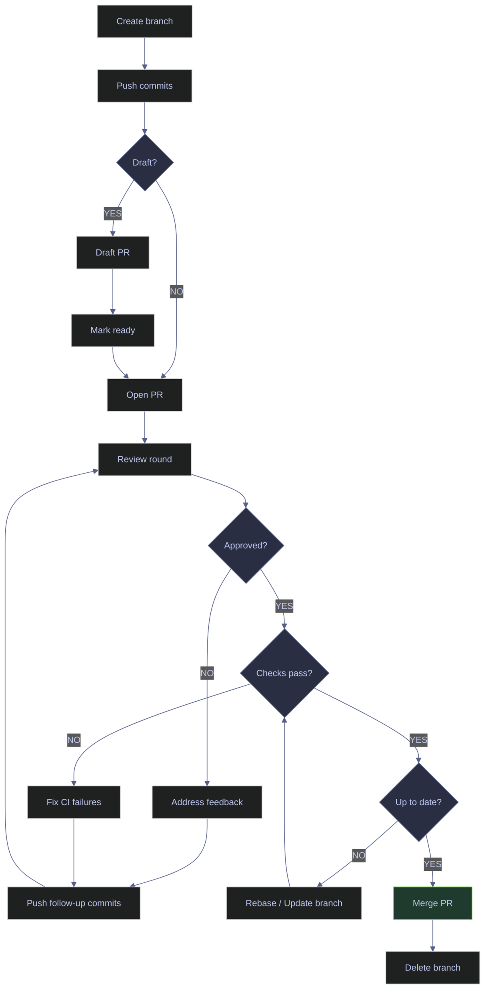
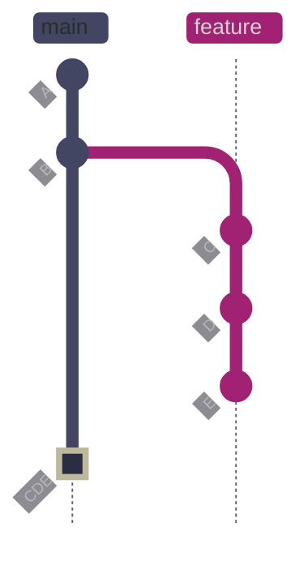
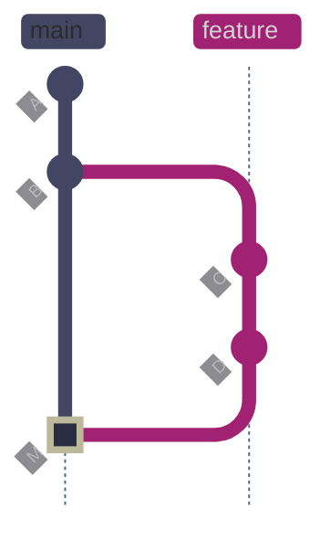
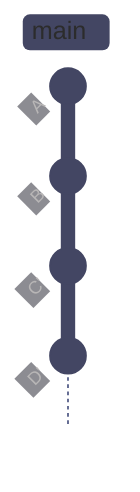
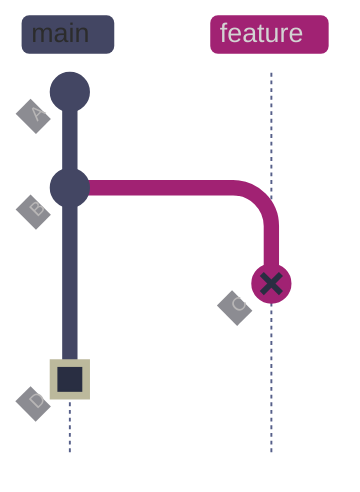
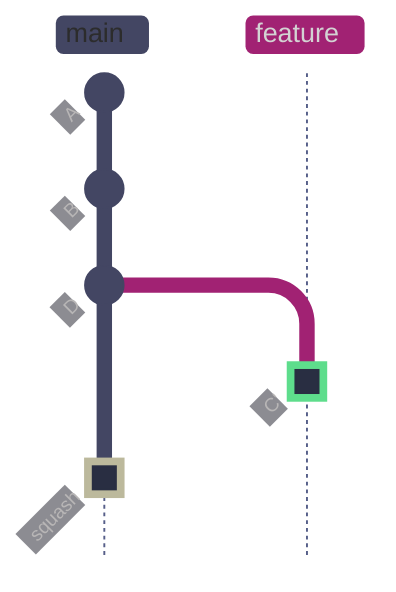

# Pull Requests and Code Review

> [!quote] Linus's Law
>
> "Given enough eyeballs, all bugs are shallow."
>
> — **Eric S. Raymond**, *The Cathedral and the Bazaar* (1999)

A **pull request** (PR) is GitHub's mechanism for proposing, discussing, and merging changes from one branch into another. It wraps a Git branch diff in a collaboration layer: reviewers inspect the code, automated checks run, and the merge is gated until all configured requirements pass. This page covers the complete PR lifecycle — from creation through review rounds to merge — plus branch protection, merge policies, recovery from diverged branches, and review checklists for data-engineering artifacts.

## Key Definitions

Every term used throughout this page is defined here. The table is the single source of truth for PR and review vocabulary.

| Term | Definition |
|------|-----------|
| **Pull request (PR)** | A GitHub object that proposes merging one branch (the *head*) into another (the *base*). It records the diff, hosts review discussion, triggers CI checks, and gates the merge button. |
| **Base branch** | The target branch the PR merges into — usually `main` or `develop`. |
| **Head branch** | The source branch containing the proposed changes. |
| **Draft PR** | A PR explicitly marked as work-in-progress. The merge button is disabled until the author marks it "Ready for review." CI checks still run. |
| **Review** | A structured evaluation of the PR's changes by a teammate. GitHub supports three review actions: *approve*, *request changes*, and *comment*. |
| **Approval** | A review verdict that signals the changes are acceptable. Branch protection rules can require a minimum number of approvals before merge. |
| **Requested changes** | A review verdict that blocks the merge button until the author addresses the feedback and the reviewer dismisses or updates their review. |
| **Dismiss stale reviews** | A branch protection option that automatically invalidates existing approvals when new commits are pushed to the PR, forcing a fresh review. |
| **Required checks** | CI status checks that must pass before the merge button is enabled. Configured in branch protection rules. |
| **Branch protection rule** | A GitHub setting on a branch (typically `main`) that enforces policies: required reviews, required checks, up-to-date branch, no force-push, no deletion. |
| **CODEOWNERS** | A file (`.github/CODEOWNERS`) that automatically assigns reviewers based on which files a PR modifies. |
| **Merge queue** | A GitHub feature that serializes PR merges, rebasing each PR onto the latest base before merging. Prevents broken builds from concurrent merges. |
| **Mergeability** | Whether GitHub can create a clean merge commit. A PR is "not mergeable" when its head branch has diverged from the base and Git cannot automatically reconcile the histories. |
| **Squash merge** | A merge strategy that collapses all PR commits into a single new commit on the base branch. Individual commit history is discarded. |
| **Merge commit** | A merge strategy that creates a two-parent commit joining the head and base histories. All original commits are preserved. |
| **Rebase merge** | A merge strategy that replays each head-branch commit on top of the base, one by one, producing new SHAs. No merge commit is created. |
| **Force-push with lease** | `git push --force-with-lease` — overwrites the remote branch only if no one else has pushed since your last fetch. The safe way to push rewritten history (e.g., after rebase). |

## Conceptual Model

A pull request moves through a series of states. Understanding these states — and what transitions between them — prevents surprises during review.



*The PR lifecycle flowchart. A PR begins when the author pushes a branch and opens (or drafts) a pull request. It cycles through review rounds until approved, waits for CI checks to pass, requires the branch to be up-to-date with the base, and then merges. The "Rebase / Update branch" step is the most common failure point — it is covered in detail in the case study section below.*

## PR Lifecycle

The PR lifecycle covers creating a branch-based proposal, having teammates review it, then merging it into the base branch using one of three merge strategies. GitHub compares the head branch against the base, runs CI checks, and gates the merge button until reviews and checks pass.

### GitHub CLI | gh pr create | open a pull request

`gh pr create` opens a new pull request from the current branch against the repository's default base branch (usually `main`). The command reads the local branch, finds its remote tracking branch, and creates the PR on GitHub. It returns the PR URL on success.

#### Create a PR with title and body

**When to run:** After pushing a feature branch with all commits ready for review.
**Trigger:** Feature branch is complete and pushed to the remote.
**Context:** Runs from the feature branch in a local clone. Read-only locally — creates a PR object on GitHub.
**Purpose:** Propose the branch's changes for review and eventual merge into the base branch.

*Create a pull request for the SQL migration branch.*

```bash
gh pr create --title "Add market hours migration" --body "Adds market_hours table for exchange scheduling."
```

```text
https://github.com/alp78/git-lab/pull/2
```

#### Create a PR with a structured body

**When to run:** When the PR description needs sections, checklists, or formatting that exceeds a single sentence.
**Trigger:** Any PR that modifies schemas, DAGs, infrastructure, or shared configuration.
**Context:** The `--body` flag accepts full markdown. Use a heredoc to pass multi-line content without escaping.
**Purpose:** Give reviewers enough context to evaluate the change without reading every diff line.

> [!tip] Use heredoc for multi-line PR bodies
>
> Shell heredocs pass markdown to `--body` without escaping quotes or newlines. The `EOF` delimiter can be any string — `'EOF'` (single-quoted) prevents variable expansion.

*Create a PR with a summary and test plan.*

```bash
gh pr create --title "Add market hours migration" --body "$(cat <<'EOF'
## Summary

- Adds `market_hours` table for exchange scheduling
- Seeds NYSE, LSE, and TSE trading hours
- Migration follows naming convention `001_<description>.sql`

## Test plan

- [ ] Run migration against staging database
- [ ] Verify `market_hours` table contains 3 rows
- [ ] Confirm timezone values match IANA standard
EOF
)"
```

```text
https://github.com/alp78/git-lab/pull/2
```

#### Create a draft PR

**When to run:** When work is in progress and you want CI feedback but do not want the PR to be mergeable yet.
**Trigger:** Starting a complex feature where early CI validation or team visibility is valuable.
**Context:** Draft PRs run CI checks but disable the merge button. Reviewers can see the code but their approvals do not count until the draft is promoted.
**Purpose:** Signal "not ready for merge" while still getting automated feedback.

*Open a draft PR for the dbt staging model.*

```bash
gh pr create --draft --title "WIP: dbt staging model for daily prices" --body "Work in progress — adding staging model for daily price normalization."
```

```text
https://github.com/alp78/git-lab/pull/3
```

> [!warning] Draft PRs block merge
>
> A `--draft` PR cannot be merged until explicitly marked as "Ready for review" via the GitHub UI or `gh pr ready`. CI checks still run on draft PRs, but the merge button is disabled. This prevents accidental merges of incomplete work.

> [!success] Mark ready when work is complete
>
> Run `gh pr ready <number>` or click "Ready for review" in the GitHub UI once the branch is complete and all CI checks pass. This unblocks the merge button and notifies reviewers.

*Mark the draft PR as ready for review.*

```bash
gh pr ready 3
```

```text
✓ Pull request alp78/git-lab#3 is marked as "ready for review"
```

#### Create a PR with reviewer, assignee, and label

**When to run:** When the team uses labels for triage or when a specific reviewer should be notified immediately.
**Trigger:** PRs that touch specific domains (testing, infrastructure, data quality).
**Context:** Labels must already exist on the repository. Create them with `gh label create` if needed.
**Purpose:** Route the PR to the correct reviewer and categorize it for project tracking.

*Create a PR with a label and assignee.*

```bash
gh pr create --title "Add data quality checks for pipeline" \
  --body "Adds pytest-based data quality checks for ticker, volume, and OHLC ordering." \
  --label "testing"
```

```text
https://github.com/alp78/git-lab/pull/9
```

| Flag | Syntax | Description |
|------|--------|-------------|
| `--title` | `gh pr create --title "..."` | Set the PR title |
| `--body` | `gh pr create --body "..."` | Set the PR description (supports markdown) |
| `--base` | `gh pr create --base develop` | Target a specific base branch (default: repo default branch) |
| `--draft` | `gh pr create --draft` | Mark as work-in-progress; merge button disabled |
| `--assignee` | `gh pr create --assignee @me` | Assign the PR to a user |
| `--reviewer` | `gh pr create --reviewer alice` | Request a reviewer |
| `--label` | `gh pr create --label bug` | Attach a label (must exist on the repo) |
| `--milestone` | `gh pr create --milestone v2.0` | Associate with a milestone |
| `--template` | `gh pr create --template bug.md` | Use a PR template from `.github/PULL_REQUEST_TEMPLATE/` |
| `--fill` | `gh pr create --fill` | Auto-fill title and body from commit messages |
| `--web` | `gh pr create --web` | Open the browser to create the PR interactively |

### GitHub CLI | gh pr list | list open pull requests

`gh pr list` displays all open PRs in the current repository. Each row shows the PR number, title, head branch, state, and creation time. Use flags to filter by state, label, author, or assignee.

#### List all open PRs

**When to run:** During daily standup, before starting work, or when checking what needs review.
**Trigger:** Routine check on team activity or looking for a specific PR.
**Context:** Read-only. Queries the GitHub API for the current repository.
**Purpose:** See all open work and identify PRs needing attention.

*List all open pull requests.*

```bash
gh pr list
```

```text
9  Add data quality checks for pipeline  feat/data-quality-checks  OPEN   2026-04-12T15:47:52Z
```

#### List PRs in all states

*List all PRs including merged and closed.*

```bash
gh pr list --state all
```

```text
9  Add data quality checks for pipeline    feat/data-quality-checks  OPEN    2026-04-12T15:47:52Z
8  Update settings for production          feat/update-settings      MERGED  2026-04-12T15:46:36Z
7  Add portfolio risk calculator           feat/risk-calculator      MERGED  2026-04-12T15:45:47Z
6  Add config validation utilities         fix/config-validation     MERGED  2026-04-12T15:44:55Z
5  Add Terraform VPC for data platform     feat/terraform-vpc        MERGED  2026-04-12T15:44:11Z
4  Add daily OHLCV ingestion DAG           feat/airflow-scheduler    MERGED  2026-04-12T15:43:53Z
3  WIP: dbt staging model for daily prices feat/dbt-staging          MERGED  2026-04-12T15:42:25Z
2  Add market hours migration              feat/sql-migration        MERGED  2026-04-12T15:42:05Z
1  feat: add momentum signal module        feat/add-signals          MERGED  2026-04-12T14:21:04Z
```

| Flag | Syntax | Description |
|------|--------|-------------|
| `--state` | `gh pr list --state all` | Filter by state: `open`, `closed`, `merged`, `all` |
| `--label` | `gh pr list --label bug` | Filter by label |
| `--author` | `gh pr list --author @me` | Filter by PR author |
| `--assignee` | `gh pr list --assignee alice` | Filter by assignee |
| `--search` | `gh pr list --search "review:required"` | GitHub search qualifier syntax |
| `--limit` | `gh pr list --limit 50` | Maximum number of results (default: 30) |
| `--json` | `gh pr list --json number,title,state` | Output specific fields as JSON |

### GitHub CLI | gh pr view | inspect PR details

`gh pr view` displays a single PR's full detail: title, state, author, labels, reviewer status, CI check results, and the description body. This is the command reviewers run to understand a PR before checking out the code.

#### View a PR's details

**When to run:** Before starting a code review, or when checking the status of your own PR.
**Trigger:** A PR notification arrives, or you need to check CI status.
**Context:** Read-only. Queries the GitHub API.
**Purpose:** Understand the PR's current state — who authored it, what it changes, what reviews and checks are pending.

*View PR #9 details.*

```bash
gh pr view 9
```

```text
title:	Add data quality checks for pipeline
state:	OPEN
author:	alp78
labels:	testing
assignees:
reviewers:
projects:
milestone:
number:	9
url:	https://github.com/alp78/git-lab/pull/9
additions:	24
deletions:	0
auto-merge:	disabled
--
Adds pytest-based data quality checks for ticker, volume, and OHLC ordering.
```

*Open a PR in the browser.*

```bash
gh pr view 9 --web
```

| Flag | Syntax | Description |
|------|--------|-------------|
| `--web` | `gh pr view 9 --web` | Open the PR in the default browser |
| `--json` | `gh pr view 9 --json state,checks` | Output specific fields as JSON |
| `--comments` | `gh pr view 9 --comments` | Include review comments |

### GitHub CLI | gh pr checkout | test a PR locally

`gh pr checkout` fetches the PR's head branch from the remote and switches the local working tree to it. This lets a reviewer build, run tests, and inspect the code locally before approving.

#### Check out a PR branch for local testing

**When to run:** When a PR needs manual testing, debugging, or a local build to verify correctness.
**Trigger:** A reviewer wants to go beyond reading the diff — they need to run the code.
**Context:** Modifies the local working tree. Fetches from the remote. Requires a clean working tree (stash or commit first).
**Purpose:** Get the PR's exact code on your machine for testing.

*Check out PR #9 for local testing.*

```bash
gh pr checkout 9
```

```text
Switched to branch 'feat/data-quality-checks'
Your branch is up to date with 'origin/feat/data-quality-checks'.
```

### GitHub CLI | gh pr diff | view the PR diff

`gh pr diff` shows the unified diff of all changes in the PR, similar to what you see on the "Files changed" tab in the GitHub UI.

#### View the diff of a PR

**When to run:** When you want to review changes in the terminal without opening the browser.
**Trigger:** Quick review of small PRs or scripting diff analysis.
**Context:** Read-only. Outputs the diff to stdout.
**Purpose:** Inspect exactly what the PR changes, file by file.

*View the diff of PR #2 (market hours migration).*

```bash
gh pr diff 2
```

```text
diff --git a/migrations/001_add_market_hours.sql b/migrations/001_add_market_hours.sql
new file mode 100644
index 0000000..e7d618f
--- /dev/null
+++ b/migrations/001_add_market_hours.sql
@@ -0,0 +1,15 @@
+-- Migration: 001_add_market_hours
+-- Adds market hours table for exchange scheduling
+
+CREATE TABLE IF NOT EXISTS market_hours (
+    exchange_code VARCHAR(10) PRIMARY KEY,
+    open_time     TIME NOT NULL,
+    close_time    TIME NOT NULL,
+    timezone      VARCHAR(50) NOT NULL,
+    is_active     BOOLEAN DEFAULT TRUE
+);
+
+INSERT INTO market_hours (exchange_code, open_time, close_time, timezone) VALUES
+    ('NYSE', '09:30', '16:00', 'America/New_York'),
+    ('LSE',  '08:00', '16:30', 'Europe/London'),
+    ('TSE',  '09:00', '15:00', 'Asia/Tokyo');
```

### GitHub CLI | gh pr review | submit a review

`gh pr review` submits a review on a PR. GitHub supports three review actions: **comment** (neutral feedback), **approve** (vote to merge), and **request-changes** (block merge until addressed). You cannot approve your own PRs.

#### Submit a review comment

**When to run:** When you have feedback that does not block the merge but should be addressed.
**Trigger:** You see a style issue, a question, or an optional improvement.
**Context:** Creates a review on GitHub. Does not change the PR's mergeability state.
**Purpose:** Provide non-blocking feedback to the author.

*Leave a review comment on PR #6.*

```bash
gh pr review 6 --comment --body "Consider adding validation for exchange codes (e.g., NYSE, LSE). Also, the date parser should handle timezone-aware datetimes."
```

#### Approve a PR

**When to run:** When the code is correct, tests pass, and you are satisfied the PR is ready to merge.
**Trigger:** Completed review with no blocking issues.
**Context:** Creates an approval review. If branch protection requires N approvals, this counts as one.
**Purpose:** Signal that the reviewer endorses the changes.

> [!warning] Cannot approve your own PR
>
> GitHub blocks self-approvals. Attempting `gh pr review --approve` on your own PR returns: `Review Can not approve your own pull request`.

> [!success] Request a teammate's review
>
> Use `gh pr edit <number> --add-reviewer teammate` to request a review from someone else. On solo repos without collaborators, disable the "require approvals" branch protection rule.

*Approve a PR (must be a different author).*

```bash
gh pr review 6 --approve --body "Approved — schema is clean, seeds are correct."
```

#### Request changes on a PR

**When to run:** When the code has issues that must be fixed before merge.
**Trigger:** Security flaw, logic bug, missing test, or policy violation found during review.
**Context:** Blocks the merge button until the reviewer either dismisses or updates their review after the author pushes fixes.
**Purpose:** Enforce a fix before the code reaches the base branch.

*Request changes on a PR.*

```bash
gh pr review 9 --request-changes --body "validate_ticker must reject numeric strings like '123'. Add a test case."
```

| Flag | Syntax | Description |
|------|--------|-------------|
| `--approve` | `gh pr review 9 --approve` | Approve the PR |
| `--request-changes` | `gh pr review 9 --request-changes` | Request changes (blocks merge) |
| `--comment` | `gh pr review 9 --comment` | Leave a neutral comment |
| `--body` | `gh pr review 9 --approve --body "LGTM"` | Attach a message to the review |

### GitHub CLI | gh pr close / reopen | manage PR state

PRs can be closed without merging (abandoned, superseded, or deferred) and reopened later if the work resumes.

#### Close a PR

**When to run:** When a PR is abandoned, superseded by another PR, or deferred to a future milestone.
**Trigger:** Decision to not merge this branch.
**Context:** Closes the PR on GitHub. Does not delete the branch. Does not affect the local clone.
**Purpose:** Signal that this work is no longer active.

*Close PR #6 with a comment explaining why.*

```bash
gh pr close 6 --comment "Closing — will revisit after the migration PR lands."
```

```text
✓ Closed pull request alp78/git-lab#6 (Add config validation utilities)
```

#### Reopen a closed PR

**When to run:** When a previously closed PR becomes relevant again.
**Trigger:** The blocking dependency has been resolved, or the team decided to proceed with the work.
**Context:** Reopens the PR on GitHub. The branch must still exist on the remote.
**Purpose:** Resume the review process without creating a new PR.

*Reopen PR #6.*

```bash
gh pr reopen 6
```

```text
✓ Reopened pull request alp78/git-lab#6 (Add config validation utilities)
```

| Flag | Syntax | Description |
|------|--------|-------------|
| `--comment` | `gh pr close 6 --comment "reason"` | Attach a comment when closing |
| `--delete-branch` | `gh pr close 6 --delete-branch` | Also delete the remote branch |

## Merging PRs

GitHub supports three merge strategies. Each produces a different commit graph shape on the base branch. The choice affects history readability, bisectability, and audit compliance. All strategies accept `--delete-branch` to remove the feature branch from GitHub after merge.

### GitHub CLI | gh pr merge --squash | squash merge

Squash merge collapses every commit on the feature branch into a single new commit on the base branch. The feature branch's individual commit history is not preserved — the base receives one clean commit per PR. The squash commit is a brand-new object with a new SHA and no parent relationship to the original branch commits.

#### Squash merge a PR

**When to run:** When you want one commit per PR on the base branch — the most common default for teams.
**Trigger:** PR is approved, checks pass, branch is up to date.
**Context:** Creates a new commit on the base branch. Deletes the remote feature branch if `--delete-branch` is passed.
**Purpose:** Produce a clean, linear history where each PR is one commit.



*Squash merge: commits C, D, and E from the feature branch are collapsed into a single new commit CDE (marked green) on main. The feature branch's individual commits are discarded from main's history. CDE is a brand-new commit object with a new SHA — it has no parent relationship to C, D, or E. Main's history shows one entry per PR.*

*Squash merge PR #2 and delete the remote branch.*

```bash
gh pr merge 2 --squash --delete-branch
```

```text
✓ Squashed and merged pull request #2 (Add market hours migration)
✓ Deleted branch feat/sql-migration
```

> [!tip] Local branch cleanup after squash merge
>
> After `gh pr merge --squash`, `git branch -d` may warn the local branch "is not fully merged" because the squash commit has a different SHA than the original branch commits. This warning is cosmetic — the changes are on main as the squash commit. Use `git branch -d` anyway, or `git branch -D` to force-delete.

### GitHub CLI | gh pr merge --merge | standard merge

Standard merge creates a **merge commit** with two parents: the tip of the base and the tip of the feature branch. The feature branch's full commit history is preserved and visible in `git log --graph`. Use when an audit trail of individual commits matters — regulated environments, compliance-sensitive repositories, or when bisect needs to see each change independently.

#### Standard merge a PR

**When to run:** When audit policy requires preserving the full branch history.
**Trigger:** PR approved and checks pass. Team policy mandates merge commits.
**Context:** Creates a merge commit on the base branch. Feature branch commits become part of main's history graph.
**Purpose:** Preserve the complete development timeline with branch structure visible.



*Standard merge: merge commit M (marked green) joins the two histories. Commits C and D from the feature branch are preserved in main's history. The graph shows that the branch existed — `git log --graph` displays the fork-and-join pattern. M has two parents: the previous tip of main (B) and the tip of the feature branch (D).*

*Merge PR #4 with a standard merge commit.*

```bash
gh pr merge 4 --merge --delete-branch
```

```text
✓ Merged pull request #4 (Add daily OHLCV ingestion DAG)
✓ Deleted branch feat/airflow-scheduler
```

### GitHub CLI | gh pr merge --rebase | rebase merge

Rebase merge replays each feature branch commit on top of the base, one by one, without creating a merge commit. Individual commits are preserved and visible in `git log`, but receive **new SHAs** — they are new commit objects because each now has a different parent than the original. Use when you want clean linear history with individual commits visible.

#### Rebase merge a PR

**When to run:** When the team values linear history but also wants to see individual commits (not just one squash commit per PR).
**Trigger:** PR approved and checks pass. Team prefers linear history.
**Context:** Creates new commit objects on the base branch. Original SHAs on the feature branch become unreachable.
**Purpose:** Produce a linear history that preserves individual commit granularity.



*Rebase merge: commits C and D from the feature branch are replayed linearly on top of B as C' and D'. The primed notation indicates these are new commit objects with new SHAs — the diffs are identical to the originals, but each commit now has B (or C') as its parent instead of the original branching point. No merge commit is created. The result is a straight-line history.*

*Rebase merge PR #5.*

```bash
gh pr merge 5 --rebase --delete-branch
```

```text
✓ Rebased and merged pull request #5 (Add Terraform VPC for data platform)
✓ Deleted branch feat/terraform-vpc
```

### Merge Strategy Comparison

| Aspect | `--squash` | `--merge` | `--rebase` |
|--------|-----------|-----------|------------|
| **Commits on base** | One new commit per PR | Original commits + merge commit | Original commits replayed (new SHAs) |
| **History shape** | Linear | Fork-and-join graph | Linear |
| **Individual commits visible** | No | Yes | Yes |
| **SHA preservation** | No (new SHA) | Yes (originals preserved) | No (new SHAs) |
| **Bisectability** | Per-PR only | Per-commit | Per-commit |
| **Audit trail** | PR-level | Full branch history | Individual commits, no branch record |
| **Best for** | Most teams — clean history | Regulated / compliance environments | Teams wanting linear + per-commit |
| **`git branch -d` after** | May warn "not merged" (cosmetic) | Clean deletion | May warn "not merged" (cosmetic) |
| **Merge conflicts** | Resolved before merge | Resolved in merge commit | Resolved per-commit during replay |

> [!question] Which merge strategy should your team use?
>
> - **Default recommendation:** `--squash` for most teams. One commit per PR keeps `git log` clean and makes reverts trivial (`git revert <squash-sha>`).
> - **Audit-heavy environments:** `--merge` when compliance requires a full timeline of individual changes with branch structure visible.
> - **Linear purists:** `--rebase` when the team wants per-commit granularity without merge bubbles in the graph.
> - **Enforce consistency:** Use branch protection settings to restrict which strategies are allowed on the repository (Settings → General → Pull Requests).

| Flag | Syntax | Description |
|------|--------|-------------|
| `--squash` | `gh pr merge 2 --squash` | Squash all branch commits into one on base |
| `--merge` | `gh pr merge 4 --merge` | Create a merge commit (full history preserved) |
| `--rebase` | `gh pr merge 5 --rebase` | Replay commits linearly (new SHAs, no merge commit) |
| `--delete-branch` | `gh pr merge 2 --squash --delete-branch` | Delete the remote branch after merging |
| `--auto` | `gh pr merge 2 --squash --auto` | Enable auto-merge when all checks pass |
| `--subject` | `gh pr merge 2 --squash --subject "feat: ..."` | Override the merge commit message subject |
| `--body` | `gh pr merge 2 --squash --body "..."` | Override the merge commit message body |

## Branch Protection and Merge Policies

Branch protection rules enforce team policies on critical branches. They prevent direct pushes, require reviews, mandate CI checks, and ensure branches are up to date before merge. These are GitHub platform features — not Git mechanics.

### GitHub | Branch protection | configure rules for main

Branch protection rules are configured per-branch in the repository settings. The most common target is `main`. Rules can be configured via the GitHub UI (Settings → Branches → Branch protection rules) or via the GitHub API.

#### Configure branch protection via the API

**When to run:** When setting up a new repository or automating governance.
**Trigger:** Repository creation, team onboarding, or security audit.
**Context:** Requires admin access to the repository. The API call modifies repository settings on GitHub.
**Purpose:** Enforce code quality and review requirements before code reaches the base branch.

> [!info]- Branch protection API payload
>
> - `required_status_checks.strict: true` — the branch must be up to date with the base before merging (prevents "not mergeable" after concurrent merges)
> - `required_pull_request_reviews.required_approving_review_count: 1` — at least one approval required
> - `required_pull_request_reviews.dismiss_stale_reviews: true` — new pushes invalidate existing approvals, forcing re-review
> - `enforce_admins: false` — admins can bypass (set `true` for strict enforcement)
> - `restrictions: null` — no restrictions on who can push (set to specific teams/users for restricted branches)

*Set up branch protection requiring 1 approval and up-to-date status.*

```bash
gh api repos/alp78/git-lab/branches/main/protection \
  -X PUT --input - << 'JSON'
{
  "required_status_checks": {
    "strict": true,
    "contexts": []
  },
  "enforce_admins": false,
  "required_pull_request_reviews": {
    "required_approving_review_count": 1,
    "dismiss_stale_reviews": true
  },
  "restrictions": null
}
JSON
```

*Verify the protection rules.*

```bash
gh api repos/alp78/git-lab/branches/main/protection \
  --jq '{required_reviews: .required_pull_request_reviews.required_approving_review_count, dismiss_stale: .required_pull_request_reviews.dismiss_stale_reviews, strict_status: .required_status_checks.strict}'
```

```text
{"dismiss_stale":true,"required_reviews":1,"strict_status":true}
```

#### Remove branch protection

**When to run:** When the rules are no longer needed (e.g., sandbox repos, temporary relaxation for emergency fixes).
**Trigger:** Admin decision to remove protection.
**Context:** Requires admin access. Removes all protection rules from the branch.
**Purpose:** Restore unrestricted access to the branch.

*Remove branch protection from main.*

```bash
gh api repos/alp78/git-lab/branches/main/protection -X DELETE
```

### Branch Protection Rules Reference

| Rule | What it enforces | Recommended for |
|------|-----------------|-----------------|
| **Require pull request reviews** | PRs must be approved before merge. Configurable: number of approvals, dismiss stale reviews, require review from code owners. | All shared repositories |
| **Require status checks** | Named CI checks must pass before merge. `strict` mode forces the branch to be up to date with the base. | Any repo with CI/CD |
| **Require branches to be up to date** | The PR branch must include the latest base branch commits. Prevents the "not mergeable" error by catching divergence early. | Teams with frequent concurrent PRs |
| **Require signed commits** | Only GPG or SSH signed commits are accepted. | Security-sensitive repos |
| **Require linear history** | Disallows merge commits — only squash and rebase merges are allowed. | Teams enforcing linear history |
| **Include administrators** | Admins cannot bypass the rules. | Production/compliance branches |
| **Restrict force-pushes** | Prevents `git push --force` to the branch. | All production branches |
| **Restrict deletions** | Prevents the branch from being deleted. | `main`, `release/*` branches |
| **Require merge queue** | PRs must go through the merge queue instead of direct merge. The queue serializes merges and validates each PR against the latest base. | High-traffic repos with many concurrent PRs |

### GitHub | CODEOWNERS | automatic reviewer assignment

A `CODEOWNERS` file in `.github/CODEOWNERS` automatically assigns reviewers based on which files a PR modifies. When branch protection requires code owner review, the assigned owner must approve before merge.

#### CODEOWNERS syntax

**When to run:** When setting up a new repository or when team ownership boundaries change.
**Trigger:** Repository governance setup, onboarding new teams, or reorganizing code ownership.
**Context:** The file lives at `.github/CODEOWNERS` in the repository root. GitHub reads it on every PR creation and assigns reviewers automatically.
**Purpose:** Ensure the right people review changes to the code they own.

> [!info]- CODEOWNERS syntax rules
>
> - One rule per line: `<pattern> <owner> [<owner>...]`
> - Patterns use the same syntax as `.gitignore` — `*` matches any file, `**` matches directories recursively
> - Owners are GitHub usernames (`@user`) or team slugs (`@org/team`)
> - Later rules override earlier ones — put general rules first, specific rules last
> - Lines starting with `#` are comments

*Example CODEOWNERS file for a data engineering repository.*

```text
# Default owner for everything
*                           @data-eng-team

# SQL migrations require DBA review
migrations/                 @dba-team

# Airflow DAGs require platform team review
dags/                       @platform-team

# Terraform infra requires SRE review
infra/                      @sre-team

# CI/CD config requires DevOps review
.github/                    @devops-team

# dbt models require analytics team review
models/                     @analytics-team
```

## Review Workflow

Code review is the human gate in the PR lifecycle. This section covers how to conduct reviews effectively, handle review rounds, and manage the push-review-push cycle.

### Review | Author checklist | before requesting review

Before requesting review, the author should verify the PR meets minimum quality standards. A self-review catches issues that waste reviewer time.

> [!todo] Author pre-review checklist
>
> 1. **Read your own diff** — `gh pr diff` or the GitHub "Files changed" tab. Look for debug prints, TODO comments, commented-out code, and unintended changes.
> 2. **Run tests locally** — do not rely on CI alone. Tests should pass on your machine first.
> 3. **Check PR size** — if the diff exceeds ~400 lines, consider splitting into smaller PRs. Large PRs get superficial reviews.
> 4. **Write a meaningful description** — explain *why* the change was made, not just *what* changed. Link to the issue or ticket.
> 5. **Remove dead code** — do not leave commented-out blocks or unused imports.
> 6. **Check for secrets** — search the diff for API keys, passwords, tokens, connection strings. Use `git diff --cached | grep -i "password\|secret\|token\|api_key"` as a quick scan.
> 7. **Verify migrations** — if the PR includes schema changes, confirm both up and down migrations exist and are idempotent.
> 8. **Tag the right reviewers** — use `--reviewer` on create, or `gh pr edit --add-reviewer` after.

### Review | Reviewer checklist | conducting a code review

> [!todo] Reviewer checklist
>
> 1. **Understand the context** — read the PR description, linked issue, and any design documents before looking at code.
> 2. **Check the diff size** — if >400 lines, ask the author to split. You cannot review what you cannot hold in working memory.
> 3. **Review for correctness first** — does the logic do what the description says? Are edge cases handled?
> 4. **Review for safety** — no SQL injection, no hardcoded secrets, no unbounded queries, no missing error handling on external calls.
> 5. **Review for maintainability** — clear naming, no magic numbers, tests cover the critical paths.
> 6. **Check generated files** — if the PR touches generated code (protobuf, OpenAPI, dbt docs), verify it was regenerated correctly. Do not review generated diffs line-by-line.
> 7. **Test locally if unsure** — `gh pr checkout <number>`, build, and run.
> 8. **Leave actionable feedback** — "this is wrong" is not actionable. "This query lacks a WHERE clause, which causes a full table scan — add `WHERE trade_date >= '2026-01-01'`" is actionable.
> 9. **Approve or request changes** — do not leave a review in "comment" state if you have a blocking opinion. Make your intent clear.

### Review | Handling review rounds | push-review-push cycle

After a reviewer requests changes, the author pushes follow-up commits to address the feedback, then re-requests review. This cycle continues until the reviewer approves.

> [!tip] Review round best practices
>
> - **Push follow-up commits, do not amend** — follow-up commits let the reviewer see only what changed since their last review (`gh pr diff` after the push shows the incremental changes). Amending and force-pushing replaces the entire diff, making it hard to see what was addressed.
> - **Re-request review explicitly** — GitHub does not automatically re-notify reviewers when you push. Run `gh pr edit <number> --add-reviewer <reviewer>` or click "Re-request review" in the UI.
> - **Reference the feedback** — in your follow-up commit message, reference the review comment: "address review: add WHERE clause to daily_prices query".
> - **Resolve conversations** — after addressing a comment, click "Resolve conversation" in the GitHub UI so the reviewer can see which items are handled.
> - **Squash on merge, not before** — keep the follow-up commits separate during review. Use `--squash` when merging to collapse them into one clean commit on main.

### Review | Stacked PRs | sequential dependent changes

Stacked PRs are a series of PRs where each builds on the previous one. PR 2 targets the branch of PR 1 instead of `main`. This pattern lets a developer break large features into reviewable pieces without waiting for each PR to merge before starting the next.

> [!info]- How stacked PRs work
>
> 1. Create `feat/step-1` from `main`, push and open PR 1 (base: `main`).
> 2. Create `feat/step-2` from `feat/step-1`, push and open PR 2 (base: `feat/step-1`).
> 3. Create `feat/step-3` from `feat/step-2`, push and open PR 3 (base: `feat/step-2`).
> 4. When PR 1 is merged into `main`, **change the base** of PR 2 from `feat/step-1` to `main` using `gh pr edit 2 --base main`.
> 5. Repeat as each PR in the stack merges.

> [!warning] Stacked PRs require careful base management
>
> If you forget to update the base after merging an earlier PR in the stack, the later PR's diff will include all the commits from the already-merged PR, confusing reviewers.

> [!success] Update the base after each merge
>
> After merging PR N, immediately run `gh pr edit <N+1> --base main` to retarget the next PR in the stack. Then rebase the remaining stacked branches: `git rebase main feat/step-2`.

## Data-Engineering Review Checklists

Data-engineering PRs require domain-specific review beyond general code quality. SQL migrations can break production tables, Airflow DAGs can stall pipelines, and Terraform changes can destroy infrastructure. These checklists supplement the general reviewer checklist above.

### Review | SQL migrations | schema change checklist

> [!todo] SQL migration review checklist
>
> 1. **Idempotency** — does the migration use `IF NOT EXISTS` / `IF EXISTS` guards? Running it twice must not fail.
> 2. **Rollback migration** — is there a corresponding down migration? Can it be reversed safely?
> 3. **Column additions** — does `ALTER TABLE ADD COLUMN` include a `DEFAULT` value? Adding a NOT NULL column without a default on a large table locks the table.
> 4. **Index creation** — is `CREATE INDEX CONCURRENTLY` used (PostgreSQL) to avoid table locks? For SQL Server, is the index created `ONLINE`?
> 5. **Data backfill** — if the migration backfills data, is it batched? Unbounded `UPDATE` statements on millions of rows cause lock escalation.
> 6. **Foreign keys** — do new foreign keys reference tables that exist in all environments (dev, staging, prod)?
> 7. **Naming convention** — does the migration follow the team's naming pattern (e.g., `NNN_description.sql`)?
> 8. **No `DROP` without confirmation** — `DROP TABLE` and `DROP COLUMN` must have explicit team sign-off. Flag these in the review.

### Review | Airflow DAGs | pipeline change checklist

> [!todo] Airflow DAG review checklist
>
> 1. **Import test** — can the DAG be imported without errors? (`python -c "from dags.my_dag import dag"`)
> 2. **Schedule** — is the cron expression correct? Does `catchup=False` or `True` match the team's policy?
> 3. **Retries** — are `retries` and `retry_delay` configured? Zero retries on a transient-failure-prone task (API calls, database connections) causes unnecessary alerts.
> 4. **Idempotency** — does each task produce the same result when run multiple times for the same execution date?
> 5. **Secrets** — are credentials passed via Airflow Variables, Connections, or environment variables — never hardcoded in the DAG file?
> 6. **Task dependencies** — does the `>>` chain reflect the actual data flow? A task reading from a table should depend on the task that writes to it.
> 7. **SLA / timeout** — are `execution_timeout` and `sla` set on tasks that can hang?

### Review | Terraform / IaC | infrastructure change checklist

> [!todo] Terraform review checklist
>
> 1. **Plan output** — has the author included `terraform plan` output in the PR description? Review the plan, not just the HCL.
> 2. **Destructive changes** — does the plan show any `destroy` or `replace` actions? These require explicit team sign-off.
> 3. **State management** — is state stored remotely (GCS, S3, Terraform Cloud)? Never commit `terraform.tfstate` to the repo.
> 4. **Secrets** — are sensitive values (`password`, `api_key`) marked as `sensitive = true`? Are they sourced from a secrets manager, not hardcoded?
> 5. **Naming** — do resource names follow the team's naming convention?
> 6. **Blast radius** — does the change affect shared resources (VPCs, IAM roles, DNS)? Changes to shared infra need broader review.

### Review | dbt models | transformation change checklist

> [!todo] dbt model review checklist
>
> 1. **Model materialization** — is the model materialized as `table`, `view`, or `incremental`? Incremental models must have a valid `is_incremental()` block.
> 2. **Source freshness** — does the model reference a source with freshness checks configured?
> 3. **Tests** — are there `unique`, `not_null`, and `accepted_values` tests on key columns in the `.yml` file?
> 4. **Grain** — is the model's grain (one row per what?) documented?
> 5. **SELECT \*** — avoid `SELECT *` in production models. Explicit column lists prevent silent schema drift.
> 6. **Jinja hygiene** — are `{{ ref() }}` and `{{ source() }}` used instead of hardcoded table names?

### Review | Notebooks | Jupyter notebook review checklist

> [!todo] Notebook review checklist
>
> 1. **Clear outputs** — are cell outputs cleared before commit? Large outputs bloat the repo and make diffs unreadable.
> 2. **Execution order** — do cells run top-to-bottom without errors? (Run Restart & Run All before committing.)
> 3. **No secrets** — scan for API keys, tokens, connection strings in cell outputs or code.
> 4. **No absolute paths** — paths like `/home/alice/data/` break on other machines. Use relative paths or environment variables.
> 5. **Reproducibility** — are dependencies pinned? Is there a `requirements.txt` or `environment.yml`?

## Recovering a Diverged PR — Rebase Case Study

This scenario happens regularly: you create a feature branch, another PR gets merged into main while yours is open, and GitHub blocks your squash merge with: *"Pull Request is not mergeable."*

### The Situation

1. Main has commit B — the latest when you created your feature branch.
2. You push commit C on `feat/update-settings`, modifying `config/settings.py`.
3. Meanwhile, another commit lands on main (commit D) that also modifies `config/settings.py`.
4. Your PR diverges from main: GitHub cannot create a clean merge commit.

**Before rebase — diverged history:**



*Feature branch diverges from main after B. Commit D (marked green) landed on main from another merged PR. Commit C (marked red) is on the feature branch, modifying the same file. Main and feature have diverged — Git cannot auto-merge because both D and C changed `config/settings.py`. GitHub reports "Pull Request is not mergeable."*

### GitHub CLI | gh pr merge | merge failure

#### Attempt the squash merge

**When to run:** After opening a PR, when you expect the branch to be mergeable.
**Trigger:** PR is approved and you want to merge.
**Context:** If the branch has diverged from main, GitHub returns a "not mergeable" error.
**Purpose:** Attempt to merge — the error message confirms the divergence.

*Attempt to squash merge the diverged PR.*

```bash
gh pr merge 8 --squash
```

```text
GraphQL: Pull Request is not mergeable (mergePullRequest)
```

### Git | rebase | rebase onto updated main

The fix: rebase the feature branch onto the latest main. This replays your commits on top of main's new state, resolving conflicts along the way.

#### Step 1 — Fetch the latest main

*Fetch the latest main from the remote.*

```bash
git fetch origin main
```

```text
From https://github.com/alp78/git-lab
 * branch            main       -> FETCH_HEAD
```

#### Step 2 — Rebase onto origin/main

*Rebase the feature branch onto the fetched main.*

```bash
git rebase origin/main
```

```text
Auto-merging config/settings.py
CONFLICT (add/add): Merge conflict in config/settings.py
error: could not apply 3008d95... feat: update settings for production
hint: Resolve all conflicts manually, mark them as resolved with
hint: "git add/rm <conflicted_files>", then run "git rebase --continue".
```

Git pauses at the conflicting commit. The working tree now contains conflict markers in `config/settings.py`.

#### Step 3 — Resolve the conflict

During rebase, `HEAD` refers to the target branch (main), not your commit. The conflict markers show main's version above `=======` and your branch's version below.

```text
<<<<<<< HEAD
"""Application settings."""

DATABASE_URL = "postgresql://localhost:5432/market_data"
CACHE_TTL = 300
MAX_RETRIES = 3
LOG_LEVEL = "INFO"
=======
"""Application settings for data pipeline."""

DATABASE_URL = "postgresql://prod-db:5432/market_data"
CACHE_TTL = 600
MAX_RETRIES = 5
LOG_LEVEL = "WARNING"
BATCH_SIZE = 1000
>>>>>>> 3008d95 (feat: update settings for production)
```

Edit the file to keep the correct version, removing all marker lines (`<<<<<<<`, `=======`, `>>>>>>>`). Then mark the file resolved and continue the rebase.

*Mark the conflict resolved and continue.*

```bash
git add config/settings.py
```

```bash
git rebase --continue
```

```text
Successfully rebased and updated refs/heads/feat/update-settings.
```

> [!warning] Rebase rewrites history
>
> After rebase, every replayed commit has a new SHA because its parent chain has changed. A normal `git push` is rejected — the remote still has the old SHAs.

> [!success] Use --force-with-lease for safe force-push
>
> `--force-with-lease` only succeeds if no one else has pushed to this branch since your last fetch. It prevents overwriting a teammate's work. Always prefer this over `--force`.

#### Step 4 — Force-push the rebased branch

*Push the rebased branch, safely overwriting the remote.*

```bash
git push --force-with-lease origin feat/update-settings
```

```text
+ 3008d95...74d200e feat/update-settings -> feat/update-settings (forced update)
```

#### Step 5 — Squash merge the rebased PR

Now that the branch is a linear extension of main, the squash merge succeeds.

*Squash merge the rebased PR.*

```bash
gh pr merge 8 --squash --delete-branch
```

```text
✓ Squashed and merged pull request #8 (Update settings for production)
✓ Deleted branch feat/update-settings
```

**After rebase — linear history, PR merged:**



*After rebase and squash merge: the feature branch's commit C is replayed on top of D as C' (marked green) — same diff, new SHA, new parent (D instead of B). The squash merge then collapses C' into a single commit on main (marked green). The divergence is eliminated, and main has a clean linear history.*

### Recovery Reference

| Situation | Command | What it does |
|-----------|---------|-------------|
| Abort a rebase in progress | `git rebase --abort` | Returns the branch to its exact pre-rebase state |
| Skip a single conflicting commit | `git rebase --skip` | Drops the current commit and continues replaying the rest |
| Undo a completed rebase | `git reflog` → `git reset --hard <pre-rebase-SHA>` | Restores the branch to the commit before the rebase started |
| Force-push rejected (someone else pushed) | `git fetch` → `git rebase origin/<branch>` → retry push | Incorporate their changes first, then force-push |

## Team Workflow and Operating Guidance

Standard conventions for collaborative PR-based development on shared repositories.

### Feature Branch Workflow

The standard cycle for all feature work on a shared repository.

```text
1. git checkout main && git pull                        # Start from latest main
2. git checkout -b feat/my-feature                      # Create feature branch
3. Make changes, commit frequently with clear messages   # Develop
4. git push -u origin feat/my-feature                   # Push to remote
5. gh pr create --title "Add feature X"                 # Open PR
6. Teammates review, you address feedback                # Review rounds
7. gh pr merge --squash --delete-branch                  # Merge
8. git checkout main && git pull                        # Sync local
9. git branch -d feat/my-feature                        # Clean up local branch
```

### Operating Rules

Non-negotiable conventions for shared repository hygiene and safe collaboration.

1. **Never push directly to main** — always use PRs. Branch protection enforces this.
2. **Never force-push to shared branches** — only force-push your own feature branches, and only with `--force-with-lease`.
3. **Pull before you push** — `git fetch origin main` before starting work. Avoid divergence from the start.
4. **Keep PRs small and focused** — one feature, one bug fix, or one refactor per PR. Large PRs get slow, superficial reviews.
5. **Write descriptive PR descriptions** — explain *why*, not just *what*. Link to the issue or ticket. Include test plans for non-trivial changes.
6. **Delete branches after merging** — use `--delete-branch` on merge. Stale branches clutter the remote.
7. **Use branch protection on main** — require reviews, passing CI, up-to-date branches, no force-push.
8. **Tag releases** — so you can always find what is deployed. See [git-tagging-and-releases](https://alp78.github.io/elysium/08-Git/git-tagging-and-releases).
9. **Review within 24 hours** — stale PRs block teammates. If you cannot review, delegate.
10. **Squash on merge, not before** — keep follow-up commits visible during review; collapse them at merge time.

### PR Templates

GitHub supports PR templates that pre-fill the description when a new PR is created. Store templates in `.github/PULL_REQUEST_TEMPLATE/` or as a single `.github/pull_request_template.md`.

> [!example] PR template for data engineering
>
> ```markdown
> ## Summary
>
> <!-- What does this PR do and why? -->
>
> ## Changes
>
> - [ ] Schema migration
> - [ ] DAG / pipeline change
> - [ ] dbt model
> - [ ] Infrastructure (Terraform)
> - [ ] Application code
> - [ ] Tests
> - [ ] Configuration
>
> ## Test plan
>
> <!-- How was this tested? Include commands, screenshots, or CI links. -->
>
> ## Rollback plan
>
> <!-- How do we undo this change if it breaks production? -->
>
> ## Checklist
>
> - [ ] No secrets in code or outputs
> - [ ] Migrations are idempotent
> - [ ] Tests pass locally
> - [ ] PR is < 400 lines (or justified)
> ```

## Troubleshooting and Recovery

Common failure modes during the PR lifecycle and how to recover from each.

| Problem | Cause | Fix |
|---------|-------|-----|
| `Pull Request is not mergeable` | Branch diverged from base — another PR was merged first | Rebase onto latest base: `git fetch origin main && git rebase origin/main && git push --force-with-lease` |
| `Review Can not approve your own pull request` | GitHub blocks self-approval | Request review from a teammate: `gh pr edit --add-reviewer <user>` |
| Merge button greyed out | Branch protection requirements not met (missing approvals, failing checks, or branch not up to date) | Check `gh pr checks` and `gh pr view` to identify which requirement is blocking |
| `no checks reported on the branch` | No CI workflow configured, or the workflow doesn't match the branch pattern | Verify `.github/workflows/` YAML files have `on: pull_request:` trigger matching the branch |
| Force push rejected | Someone else pushed to the branch since your last fetch | `git fetch origin <branch>` → rebase → retry `--force-with-lease` |
| PR diff shows unexpected files | Branch was created from an outdated base | Rebase onto latest main to clean the diff |
| Stale approvals dismissed | Branch protection has "dismiss stale reviews" enabled and new commits were pushed | Re-request review after pushing fixes |
| Draft PR cannot be merged | PR is still in draft state | Run `gh pr ready <number>` to mark it ready |

## GitHub CLI Quick Reference

| Command | Description |
|---------|-------------|
| `gh pr create --title "..." --body "..."` | Create a PR |
| `gh pr create --draft` | Create a draft PR |
| `gh pr ready <number>` | Mark draft as ready |
| `gh pr list` | List open PRs |
| `gh pr list --state all` | List all PRs (open + closed + merged) |
| `gh pr view <number>` | View PR details |
| `gh pr view <number> --web` | Open PR in browser |
| `gh pr diff <number>` | View PR diff |
| `gh pr checkout <number>` | Check out PR branch locally |
| `gh pr review <number> --approve` | Approve a PR |
| `gh pr review <number> --request-changes` | Request changes |
| `gh pr review <number> --comment --body "..."` | Leave a review comment |
| `gh pr merge <number> --squash` | Squash merge |
| `gh pr merge <number> --merge` | Standard merge |
| `gh pr merge <number> --rebase` | Rebase merge |
| `gh pr merge <number> --squash --delete-branch` | Merge and delete remote branch |
| `gh pr merge <number> --squash --auto` | Auto-merge when checks pass |
| `gh pr close <number>` | Close without merging |
| `gh pr reopen <number>` | Reopen a closed PR |
| `gh pr edit <number> --add-reviewer <user>` | Add a reviewer |
| `gh pr edit <number> --base main` | Change the base branch |
| `gh pr checks <number>` | View CI check status |

## Related

- [git-daily-workflow](https://alp78.github.io/elysium/08-Git/git-daily-workflow) — the daily commit/push/pull cycle that feeds into PRs
- [git-branching-and-merging](https://alp78.github.io/elysium/08-Git/git-branching-and-merging) — creating and managing branches
- [merge-vs-rebase-vs-squash](https://alp78.github.io/elysium/08-Git/merge-vs-rebase-vs-squash) — detailed strategy comparison with team-size recommendations
- [git-remote-management](https://alp78.github.io/elysium/08-Git/git-remote-management) — `--force-with-lease` and remote push safety
- [git-merge-conflicts](https://alp78.github.io/elysium/08-Git/git-merge-conflicts) — resolving conflict markers during rebase and stash pop
- [git-recovery-and-undo](https://alp78.github.io/elysium/08-Git/git-recovery-and-undo) — stash and reflog for recovery
- [github-actions-ci-cd](https://alp78.github.io/elysium/10-GitHub-Actions/github-actions-ci-cd) — the CI/CD that runs on PRs

## References

- [GitHub CLI pr commands](https://cli.github.com/manual/gh_pr)
- [About pull requests](https://docs.github.com/en/pull-requests/collaborating-with-pull-requests/proposing-changes-to-your-work-with-pull-requests/about-pull-requests)
- [About branch protection rules](https://docs.github.com/en/repositories/configuring-branches-and-merges-in-your-repository/managing-protected-branches/about-protected-branches)
- [About code owners](https://docs.github.com/en/repositories/managing-your-repositorys-settings-and-features/customizing-your-repository/about-code-owners)
- [About merge queues](https://docs.github.com/en/repositories/configuring-branches-and-merges-in-your-repository/configuring-pull-request-merges/managing-a-merge-queue)
