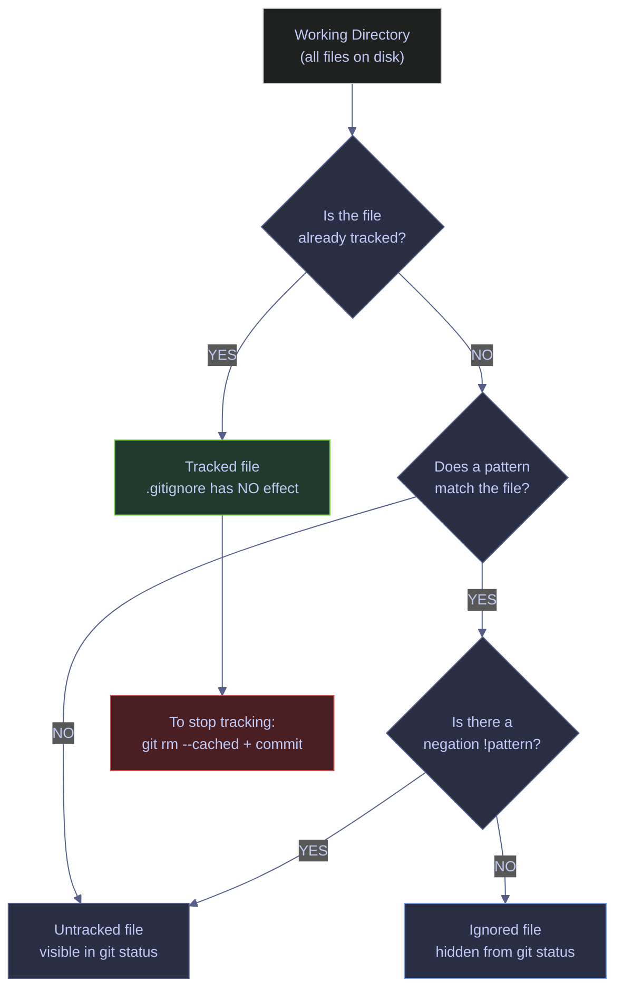
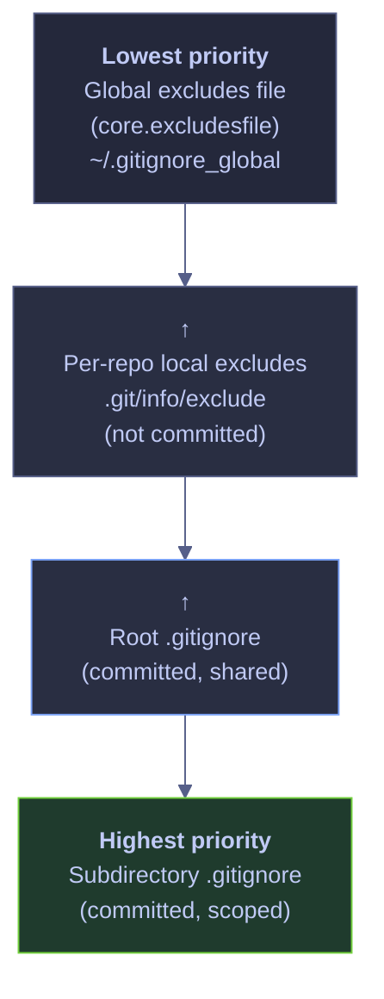
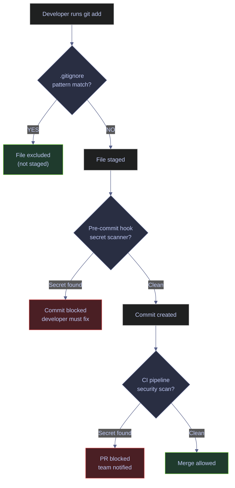

# .gitignore Patterns

> [!quote]
> "Perfection is achieved, not when there is nothing more to add, but when there is nothing left to take away."
>
> — **Antoine de Saint-Exupéry**, *Terre des hommes* (1939)

> [!abstract]- Summary
>
> Explains how `.gitignore`, ignore precedence, and related repository-hygiene files keep secrets, generated artifacts, local environments, and large binaries out of Git without hiding files that should still be versioned.
>
> **Ignore model and pattern syntax**
> - Defines `.gitignore`, glob matching, negation, anchored paths, directory rules, and precedence across repo, global, and command-line ignore sources
> - Shows why ignore rules are about untracked files only and why pattern specificity matters when repositories mix source, build output, notebooks, data, and temporary tooling files
>
> **Diagnosis and cleanup**
> - Uses diagnostic commands to explain why a path is ignored or still tracked, then removes already-committed files from the index without deleting local working copies
> - Covers secret exposure recovery boundaries so readers do not mistake ignore rules for retroactive history cleanup
>
> **Templates and repository hygiene**
> - Builds practical ignore templates for data engineering, connects `.gitignore` to `.gitattributes`, `.gitkeep`, and other hygiene files, and introduces Git LFS for large binary assets
> - Explains where generated data, local virtual environments, lockfiles, notebooks, and build directories should live so the repository stays reviewable and portable
>
> **Operations and safety**
> - Warnings: ignored files already tracked in history, over-broad patterns that hide real source files, secret commits that require history cleanup, and large binaries that should move to LFS
> - Recommendations: keep ignore rules explicit, test patterns with diagnostics, separate team-wide from global ignores, and review templates whenever new tooling or artifact types appear
> - Troubleshooting: pattern precedence, tracked-file cleanup, secret-recovery boundaries, and repository-noise diagnosis

> [!note]- Glossary
>
> **`.gitignore`**
> - A text file containing glob patterns that tell Git which untracked files to exclude from `git add` and `git status`. Can exist at the repository root, in any subdirectory (scoped rules), or as a global file.
> - It matters in this note because the workflows for ignore rules, repository hygiene, and secret or large-file prevention ask you to choose or interpret this operation deliberately instead of treating nearby Git commands as interchangeable.
>
> > [!danger] Security boundary
> >
> > This term touches authentication, identity, or trust. Treat it as secret or policy material rather than as ordinary repository metadata.
>
> ---
>
> **Tracked file**
> - A file that exists in Git's index (staging area). Git monitors it for changes. Adding a tracked file to `.gitignore` does not untrack it — the file remains tracked until explicitly removed from the index.
> - It matters in this note because the workflows for ignore rules, repository hygiene, and secret or large-file prevention read or change this part of Git's state directly, and misunderstanding it leads to the wrong command or the wrong safety assumption.
>
> > [!info] Policy layer
> >
> > This term usually belongs to shared repository policy or machine defaults. Fixing it locally can hide the real team-wide setting if you do not check the whole policy chain.
>
> ---
>
> **Untracked file**
> - A file in the working directory that Git does not know about. Untracked files appear in `git status` unless they match a `.gitignore` pattern.
> - It matters in this note because the workflows for ignore rules, repository hygiene, and secret or large-file prevention read or change this part of Git's state directly, and misunderstanding it leads to the wrong command or the wrong safety assumption.
>
> > [!danger] Security boundary
> >
> > This term touches authentication, identity, or trust. Treat it as secret or policy material rather than as ordinary repository metadata.
>
> ---
>
> **Index (staging area)**
> - The intermediate area between the working directory and the next commit. `git add` copies files into the index; `git commit` records the index as a snapshot.
> - It matters in this note because the workflows for ignore rules, repository hygiene, and secret or large-file prevention ask you to choose or interpret this operation deliberately instead of treating nearby Git commands as interchangeable.
>
> > [!info] Operational nuance
> >
> > Treat this as a concrete Git object, state, or workflow term rather than as a loose synonym. The commands in the note behave differently depending on this exact meaning.
>
> ---
>
> **Glob pattern**
> - A wildcard pattern used for filename matching. `.gitignore` supports `*` (any characters except `/`), `?` (single character), `[...]` (character class), and `**` (any number of directories).
> - It matters in this note because the workflows for ignore rules, repository hygiene, and secret or large-file prevention read or change this part of Git's state directly, and misunderstanding it leads to the wrong command or the wrong safety assumption.
>
> > [!danger] Security boundary
> >
> > This term touches authentication, identity, or trust. Treat it as secret or policy material rather than as ordinary repository metadata.
>
> ---
>
> **Negation pattern**
> - A pattern prefixed with `!` that re-includes a file previously excluded by an earlier pattern. Order matters — the last matching rule wins.
> - It matters in this note because the workflows for ignore rules, repository hygiene, and secret or large-file prevention read or change this part of Git's state directly, and misunderstanding it leads to the wrong command or the wrong safety assumption.
>
> > [!danger] Security boundary
> >
> > This term touches authentication, identity, or trust. Treat it as secret or policy material rather than as ordinary repository metadata.
>
> ---
>
> **Trailing slash**
> - A `/` at the end of a pattern restricts the match to directories only. `logs/` matches the directory; `logs` matches both files and directories named `logs`.
> - It matters in this note because the workflows for ignore rules, repository hygiene, and secret or large-file prevention read or change this part of Git's state directly, and misunderstanding it leads to the wrong command or the wrong safety assumption.
>
> > [!danger] Security boundary
> >
> > This term touches authentication, identity, or trust. Treat it as secret or policy material rather than as ordinary repository metadata.
>
> ---
>
> **Leading slash**
> - A `/` at the start of a pattern anchors the match to the repository root. `/build` matches only `build` at the root, not `src/build`.
> - It matters in this note because the workflows for ignore rules, repository hygiene, and secret or large-file prevention read or change this part of Git's state directly, and misunderstanding it leads to the wrong command or the wrong safety assumption.
>
> > [!danger] Security boundary
> >
> > This term touches authentication, identity, or trust. Treat it as secret or policy material rather than as ordinary repository metadata.
>
> ---
>
> **`**` (double star)**
> - Matches zero or more directories. `**/logs` matches `logs` at any depth. `src/**/*.py` matches all `.py` files anywhere under `src/`.
> - It matters in this note because the workflows for ignore rules, repository hygiene, and secret or large-file prevention read or change this part of Git's state directly, and misunderstanding it leads to the wrong command or the wrong safety assumption.
>
> > [!info] Operational nuance
> >
> > Treat this as a concrete Git object, state, or workflow term rather than as a loose synonym. The commands in the note behave differently depending on this exact meaning.
>
> ---
>
> **`.git/info/exclude`**
> - A per-repository ignore file that is not committed and not shared with collaborators. Use for personal ignores that should not appear in `.gitignore`.
> - It matters in this note because the workflows for ignore rules, repository hygiene, and secret or large-file prevention read or change this part of Git's state directly, and misunderstanding it leads to the wrong command or the wrong safety assumption.
>
> > [!info] Policy layer
> >
> > This term usually belongs to shared repository policy or machine defaults. Fixing it locally can hide the real team-wide setting if you do not check the whole policy chain.
>
> ---
>
> **Global excludes file**
> - A user-level ignore file configured via `core.excludesfile`. Applies to every repository on the machine. Ideal for OS artifacts and IDE directories.
> - It matters in this note because the workflows for ignore rules, repository hygiene, and secret or large-file prevention read or change this part of Git's state directly, and misunderstanding it leads to the wrong command or the wrong safety assumption.
>
> > [!info] Policy layer
> >
> > This term usually belongs to shared repository policy or machine defaults. Fixing it locally can hide the real team-wide setting if you do not check the whole policy chain.
>
> ---
>
> **`.gitattributes`**
> - A committed file that controls per-path settings such as line-ending normalization, diff drivers, merge strategies, and Git LFS tracking. Not an ignore mechanism — it changes how Git handles files, not whether it tracks them.
> - It matters in this note because the workflows for ignore rules, repository hygiene, and secret or large-file prevention read or change this part of Git's state directly, and misunderstanding it leads to the wrong command or the wrong safety assumption.
>
> > [!danger] Security boundary
> >
> > This term touches authentication, identity, or trust. Treat it as secret or policy material rather than as ordinary repository metadata.
>
> ---
>
> **Git LFS**
> - Git Large File Storage. Replaces large binary files with lightweight text pointers in the repository, storing the actual content on a separate LFS server. Configured through `.gitattributes`.
> - It matters in this note because the workflows for ignore rules, repository hygiene, and secret or large-file prevention ask you to choose or interpret this operation deliberately instead of treating nearby Git commands as interchangeable.
>
> > [!warning] Pointer semantics matter
> >
> > Git stores this as reference state rather than as a second copy of files. Many confusing behaviors come from moving refs while file contents stay the same.
>
> ---
>
> **`git rm --cached`**
> - Removes a file from the index without deleting it from the working directory. The file becomes untracked in the next commit.
> - It matters in this note because the workflows for ignore rules, repository hygiene, and secret or large-file prevention ask you to choose or interpret this operation deliberately instead of treating nearby Git commands as interchangeable.
>
> > [!info] Operational nuance
> >
> > Treat this as a concrete Git object, state, or workflow term rather than as a loose synonym. The commands in the note behave differently depending on this exact meaning.
>
> ---
>
> **`git check-ignore`**
> - Diagnostic command that reports which `.gitignore` rule matches a given path, including the source file and line number.
> - It matters in this note because the workflows for ignore rules, repository hygiene, and secret or large-file prevention ask you to choose or interpret this operation deliberately instead of treating nearby Git commands as interchangeable.
>
> > [!danger] Security boundary
> >
> > This term touches authentication, identity, or trust. Treat it as secret or policy material rather than as ordinary repository metadata.
>
> ---
>
> **Precedence**
> - When multiple ignore sources define patterns, Git evaluates them in order of increasing specificity: global excludes → `.git/info/exclude` → root `.gitignore` → subdirectory `.gitignore`. Within a single file, later lines override earlier lines.
> - It matters in this note because the workflows for ignore rules, repository hygiene, and secret or large-file prevention read or change this part of Git's state directly, and misunderstanding it leads to the wrong command or the wrong safety assumption.
>
> > [!danger] Security boundary
> >
> > This term touches authentication, identity, or trust. Treat it as secret or policy material rather than as ordinary repository metadata.


## Conceptual Model

The ignore system operates at the boundary between the working directory and the index. It applies only to untracked files — files that Git has never committed. Tracked files are invisible to `.gitignore` regardless of what patterns exist.



*Git evaluates every file in the working directory against this decision tree. Tracked files bypass the ignore system entirely — `.gitignore` patterns only apply to untracked files. If a tracked file should now be ignored, you must first remove it from the index with `git rm --cached`, commit the removal, and then the `.gitignore` pattern takes effect going forward. Negation patterns (`!`) can re-include files that would otherwise be ignored, but only if the parent directory itself is not ignored with a trailing slash.*

### Ignore Rule Precedence

Git evaluates ignore rules from four sources, in order of increasing priority. A pattern in a more specific source overrides a pattern in a less specific source. Within a single file, later lines override earlier lines.



*Git merges all four ignore sources when evaluating a path. A subdirectory `.gitignore` has the highest priority and overrides rules from the root `.gitignore`, which in turn overrides `.git/info/exclude`, which overrides the global excludes file. This means a team-committed `.gitignore` always wins over personal or machine-level exclusions. Within each file, later lines override earlier lines — place negation patterns (`!`) after the patterns they override.*

| Source | Scope | Committed | Shared with team | Use case |
|---|---|---|---|---|
| `~/.gitignore_global` | All repos on machine | No | No | OS artifacts (`.DS_Store`, `Thumbs.db`), IDE dirs (`.idea/`, `.vscode/`) |
| `.git/info/exclude` | Single repo | No | No | Personal scratch files, local test data, editor backups |
| Root `.gitignore` | Entire repo | Yes | Yes | Language artifacts, build dirs, secrets patterns, data dirs |
| Subdirectory `.gitignore` | That directory tree | Yes | Yes | Overrides or additions scoped to a module or package |

## Pattern Syntax and Matching Rules

The pattern language used in `.gitignore` is a subset of shell globbing. Each line in the file is a pattern. Blank lines are ignored. Lines starting with `#` are comments.

### Pattern-Behavior Matrix

| Pattern | What it matches | Explanation |
|---|---|---|
| `.env` | Any file or directory named `.env` at any depth | Bare name without `/` matches anywhere in the tree |
| `*.pyc` | All files ending in `.pyc` at any depth | `*` matches any characters except `/` |
| `__pycache__/` | Any directory named `__pycache__` at any depth | Trailing `/` restricts the match to directories only |
| `/build` | Only `build` at the repository root | Leading `/` anchors to the root — `src/build` is not matched |
| `data/*` | All files and directories directly inside `data/` | Does not match `data/` itself — Git enters the directory to check contents, which allows negation patterns to work |
| `data/` | The `data` directory and everything inside it | Git never descends into the directory — negation patterns for files inside it have no effect |
| `!data/samples/` | Re-include the `data/samples/` directory | Negation works only if the parent uses `data/*` (not `data/`), because Git must enter the directory to see the exception |
| `*.log` | All files ending in `.log` at any depth | Wildcard matches across directory boundaries when no `/` appears in the pattern |
| `logs/**/*.log` | All `.log` files at any depth under `logs/` | `**` matches zero or more intermediate directories |
| `**/migrations` | Any file or directory named `migrations` at any depth | Leading `**` anchors to any directory level |
| `doc/*.txt` | `doc/notes.txt` but not `doc/server/deploy.txt` | A single `*` does not match `/` — only one directory level |
| `doc/**/*.txt` | `doc/notes.txt` and `doc/server/deploy.txt` | `**` crosses directory boundaries |
| `secrets/**` | Everything inside `secrets/` at any depth | Matches all files and subdirectories recursively |
| `terraform.tfvars` | Any `terraform.tfvars` at any depth | No leading `/`, so it matches in any directory |
| `/terraform.tfvars` | Only `terraform.tfvars` at the repo root | Leading `/` anchors to root — `infra/terraform.tfvars` is not matched |
| `config.[yj]?ml` | Matches `config.yaml`, `config.yml`, `config.json` — but not `config.toml` | `[yj]` matches one character from the set; `?` matches exactly one character |

> [!warning] Negation Does Not Work When the Parent Directory Is Ignored
>
> If `.gitignore` contains `data/` (with trailing slash), Git skips the entire directory during traversal. A subsequent `!data/samples/test_fixture.csv` is never evaluated because Git never looks inside `data/`. The negation is silently ignored.

> [!success] Use Wildcard Contents Instead of Directory Ignore for Exceptions
>
> Replace `data/` with `data/*` in `.gitignore`. This tells Git to ignore the contents of `data/` rather than the directory itself. Git now enters the directory and evaluates each file, allowing `!data/samples/` to take effect. The pattern pair:
> ```gitignore
> data/*
> !data/samples/
> ```

> [!tip] Use a Language-Specific Template as a Starting Point
>
> GitHub maintains a curated collection of `.gitignore` templates for dozens of languages and frameworks at [github/gitignore](https://github.com/github/gitignore). When creating a repository on GitHub, the UI offers a template selector. Start with the official Python or Terraform template and add project-specific patterns on top.

## Ignore Sources

Git supports four distinct locations for ignore rules. Each serves a different scope and audience.

### Git | .gitignore | repository-level ignore file

The `.gitignore` file at the repository root is the primary ignore configuration. It is committed to the repository and shared with all collaborators. Subdirectory `.gitignore` files can override or extend the root rules for their directory tree.

#### View the current .gitignore

**When to run:** when auditing which patterns are active for the repository.
**Trigger:** onboarding to a new repository, reviewing what is excluded before adding files, troubleshooting why a file does not appear in `git status`.
**Context:** runs in any shell. Read-only — displays the file contents.
**Purpose:** inspect the active ignore rules so you know what Git will and will not track.

*Display the contents of the repository root `.gitignore`.*

```bash
cat .gitignore
```

```text
# ── Python ──────────────────────────────────────────
__pycache__/
*.pyc
*.pyo
*.egg-info/
dist/
build/
.venv/
venv/
.pytest_cache/
.mypy_cache/
.ruff_cache/
.coverage
htmlcov/

# ── Environment & Secrets ──────────────────────────
.env
.env.*
secrets/
service-account-key.json
*.key
*.pem
*.p12

# ── Data & Artifacts ───────────────────────────────
data/*
!data/samples/
logs/
*.log

# ── Notebooks ──────────────────────────────────────
.ipynb_checkpoints/

# ── dbt ────────────────────────────────────────────
target/
dbt_packages/
compiled/

# ── Terraform ──────────────────────────────────────
.terraform/
*.tfstate
*.tfstate.backup
terraform.tfvars

# ── IDE & OS ───────────────────────────────────────
.idea/
.vscode/
*.swp
*.swo
*~
.DS_Store
Thumbs.db
desktop.ini
```

### Git | .git/info/exclude | local-only ignore file

The `.git/info/exclude` file works identically to `.gitignore` but is never committed and never shared. It lives inside the `.git` directory, which is not tracked. Use this for personal ignores — scratch directories, editor backup files, or local test data that only you generate.

#### View the local exclude file

**When to run:** when you need to add a personal ignore rule that should not appear in the team's `.gitignore`.
**Trigger:** you have a file (personal notes, local test output, scratch directory) that only exists on your machine and should be ignored without affecting collaborators.
**Context:** the file is at `.git/info/exclude` inside the repository. Editing it is a local-only action — it is never committed or pushed.
**Purpose:** keep personal working files out of `git status` without modifying the shared `.gitignore`.

*Display the local exclude file with custom rules added.*

```bash
cat .git/info/exclude
```

```text
# git ls-files --others --exclude-from=.git/info/exclude
# Lines that start with '#' are comments.
# For a project mostly in C, the following would be a good set of
# exclude patterns (uncomment them if you want to use them):
# *.[oa]
# *~
scratch/
notes.txt
```

### Git | core.excludesfile | global ignore file

The global excludes file applies to every repository on the machine. Configure it once and it silently ignores OS artifacts, IDE directories, and credential file extensions everywhere — without polluting each repository's `.gitignore` with machine-specific patterns.

#### Set the global excludes file path

**When to run:** once during initial workstation setup, or when moving to a new machine.
**Trigger:** first-time Git configuration.
**Context:** runs `git config --global`, which writes to `~/.gitconfig`. The excludes file itself is a plain text file using the same pattern syntax as `.gitignore`.
**Purpose:** configure a machine-wide ignore file that applies to all repositories.

*Set `core.excludesfile` to point to `~/.gitignore_global`.*

```bash
git config --global core.excludesfile ~/.gitignore_global
```

#### Recommended global ignore patterns

*A global ignore file covering OS artifacts, IDE directories, and credential file extensions.*

```gitignore
# OS artifacts
.DS_Store
Thumbs.db
desktop.ini

# IDE directories
.idea/
.vscode/
*.swp
*~

# Credentials (never commit)
*.key
*.pem
*.p12
*.pfx
```

> [!info] What Belongs in Global vs Local .gitignore
>
> - **Global (`~/.gitignore_global`):** patterns that are about your machine, not the project — OS files, IDE configuration, editor swap files, credential extensions.
> - **Local (`.gitignore`):** patterns that are about the project — build artifacts, virtual environments, compiled files, data directories, project-specific secrets files.
>
> If every developer on the team would need the same pattern, it belongs in the committed `.gitignore`. If only you need it because of your OS or editor, it belongs in the global file or `.git/info/exclude`.

## Diagnosing Ignore Rules

When a file is unexpectedly hidden or unexpectedly visible in `git status`, use these diagnostic commands to understand which rule applies and where it comes from.

### Git | check-ignore | explain why a file is ignored

`git check-ignore` tests one or more paths against the ignore rules and reports whether each path is ignored. With the `-v` (verbose) flag, it prints the source file, line number, and matching pattern — essential for debugging complex ignore configurations.

#### Check which rule ignores a specific file

**When to run:** when a file does not appear in `git status` and you need to know which rule is responsible.
**Trigger:** unexpected behavior — a file you expect to see is hidden, or a file you expect to be ignored is showing up.
**Context:** read-only diagnostic. Does not modify any files or state.
**Purpose:** identify the exact `.gitignore` file, line number, and pattern that matches a given path.

*Run `git check-ignore -v` against multiple paths to see which rules match.*

```bash
git check-ignore -v .env secrets/api_keys.env data/raw/trades_2026.csv \
  data/samples/test_fixture.csv infra/terraform.tfstate \
  target/manifest.json .DS_Store service-account-key.json
```

```text
.gitignore:17:.env	.env
.gitignore:19:secrets/	secrets/api_keys.env
.gitignore:26:data/*	data/raw/trades_2026.csv
.gitignore:41:*.tfstate	infra/terraform.tfstate
.gitignore:35:target/	target/manifest.json
.gitignore:51:.DS_Store	.DS_Store
.gitignore:20:service-account-key.json	service-account-key.json
```

Each line shows: the ignore source file, the line number, the matching pattern, and the path that was tested. Notice that `data/samples/test_fixture.csv` does not appear in the output — it is not ignored because the negation pattern `!data/samples/` on line 27 re-includes it.

#### Check ignore rules from standard input

**When to run:** when you need to test many paths at once, or when piping paths from another command.
**Trigger:** bulk auditing of ignore rules across a file list.
**Context:** read-only. Accepts paths from standard input, one per line.
**Purpose:** batch-test which files in a list are ignored and which are not.

> [!info]- Flag Breakdown
>
> - `--stdin` reads file paths from standard input (one per line) instead of command-line arguments
> - `-v` (verbose) prints the matching rule source, line number, and pattern for each ignored path
> - Paths that are not ignored produce no output — only matched (ignored) paths appear

*Pipe a list of paths to `git check-ignore` to identify which are ignored.*

```bash
printf '.env\ndata/raw/trades.csv\nsrc/pipeline.py\ninfra/terraform.tfstate\n.DS_Store\ndata/samples/test_fixture.csv' \
  | git check-ignore -v --stdin
```

```text
.gitignore:17:.env	.env
.gitignore:26:data/*	data/raw/trades.csv
.gitignore:41:*.tfstate	infra/terraform.tfstate
.gitignore:51:.DS_Store	.DS_Store
```

`src/pipeline.py` and `data/samples/test_fixture.csv` do not appear — they are tracked or not ignored. Only ignored paths produce output.

#### Verify a file is ignored by a global rule

**When to run:** when you need to confirm that a global ignore rule (from `core.excludesfile`) is applying correctly.
**Trigger:** debugging whether a machine-level ignore pattern is taking effect.
**Context:** read-only. The output shows the full path to the global ignore file when the matching rule comes from there.
**Purpose:** distinguish between local and global ignore sources.

*Check a `.pfx` file that is only covered by the global ignore file.*

```bash
git check-ignore -v test.pfx
```

```text
C:/Users/aperi/.gitignore_global:16:*.pfx	test.pfx
```

The output shows the global file path (`C:/Users/aperi/.gitignore_global`) and line number (`16`), confirming the rule comes from the machine-level configuration rather than the repository's `.gitignore`.

| Flag | Syntax | Description |
|---|---|---|
| `-v` / `--verbose` | `git check-ignore -v <path>` | Show which `.gitignore` file, line number, and pattern matched |
| `-n` / `--non-matching` | `git check-ignore -vn <path>` | Show non-ignored paths too (must combine with `-v`) |
| `--stdin` | `git check-ignore --stdin` | Read file paths from standard input, one per line |
| `-q` / `--quiet` | `git check-ignore -q <path>` | Suppress output; exit code only: 0 = ignored, 1 = not ignored |
| `-z` | `git check-ignore -z --stdin` | Use NUL byte as delimiter (for paths with special characters) |
| `--no-index` | `git check-ignore --no-index <path>` | Check against ignore rules even if the file is tracked in the index |

### Git | status --ignored | list all ignored files

`git status --ignored` appends a section listing all files that match ignore rules. This gives a full inventory of what Git is excluding in the current working tree.

#### List all ignored files in the repository

**When to run:** when auditing what is being excluded from version control.
**Trigger:** periodic repository hygiene review, onboarding to a new project, verifying that sensitive files are properly ignored.
**Context:** read-only. Shows the standard `git status` output plus an additional "Ignored files" section.
**Purpose:** get a complete picture of what Git sees and what it hides.

*Run `git status --ignored` to see both tracked changes and ignored files.*

```bash
git status --ignored
```

```text
On branch demo/gitignore-patterns
Ignored files:
  (use "git add -f <file>..." to include in what will be committed)
	.DS_Store
	.env
	.idea/
	.ruff_cache/
	.terraform/
	.vscode/
	Thumbs.db
	build/
	compiled/
	data/raw/
	dbt_packages/
	dist/
	infra/terraform.tfstate
	infra/terraform.tfstate.backup
	infra/terraform.tfvars
	logs/
	notebooks/.ipynb_checkpoints/
	secrets/
	service-account-key.json
	src/__pycache__/
	target/

nothing to commit, working tree clean
```

### Git | ls-files | list tracked or ignored files

`git ls-files` lists files that Git knows about. Without flags, it lists tracked files. With `--others --ignored --exclude-standard`, it lists all files that are present on disk but excluded by ignore rules — a more detailed view than `git status --ignored` because it shows individual files inside ignored directories.

#### List all tracked files

**When to run:** when you need to see exactly what Git is tracking in the current branch.
**Trigger:** verifying that a file was successfully untracked, auditing repository contents.
**Context:** read-only. Lists files in the index.
**Purpose:** confirm which files are under version control.

*List all files currently tracked by Git.*

```bash
git ls-files
```

```text
.gitignore
.pre-commit-config.yaml
README.md
analytics/risk.py
config.py
config.yaml
config/settings.py
config/validation.py
dags/daily_ingest.py
infra/vpc.tf
migrations/001_add_market_hours.sql
models/staging/stg_daily_prices.sql
requirements.txt
src/__init__.py
src/config.py
src/currency_validator.py
src/data_validator.py
src/esg_scoring.py
src/holidays.py
src/hotfix_price_feed.py
src/logger.py
src/market_hours.py
src/pipeline.py
src/retry.py
src/risk_metrics.py
src/sector_mapper.py
src/signals/__init__.py
src/signals/momentum.py
src/utils.py
tests/test_currency_validator.py
tests/test_esg_scoring.py
tests/test_market_hours.py
tests/test_pipeline.py
```

#### List all ignored files with full paths

**When to run:** when `git status --ignored` shows directories but you need to see the individual files inside them.
**Trigger:** investigating exactly which files inside an ignored directory are being excluded, especially before a cleanup or migration.
**Context:** read-only. `--others` shows untracked files, `--ignored` filters to only ignored ones, `--exclude-standard` applies all ignore sources.
**Purpose:** get a file-by-file inventory of everything Git is ignoring.

*List every individual ignored file, including files inside ignored directories.*

```bash
git ls-files --others --ignored --exclude-standard
```

```text
.DS_Store
.env
.idea/workspace.xml
.ruff_cache/.gitignore
.ruff_cache/CACHEDIR.TAG
.terraform/providers/registry.txt
.vscode/settings.json
Thumbs.db
build/lib.txt
compiled/stg_daily_prices.sql
data/raw/trades_2026.csv
dbt_packages/dbt_utils.txt
dist/git_lab-0.1.0-py3-none-any.whl
infra/terraform.tfstate
infra/terraform.tfstate.backup
infra/terraform.tfvars
logs/airflow_scheduler.log
logs/debug_2026-04-12.log
notebooks/.ipynb_checkpoints/exploration-checkpoint.ipynb
secrets/api_keys.env
service-account-key.json
src/__pycache__/pipeline.cpython-312.pyc
src/__pycache__/utils.cpython-312.pyc
target/catalog.json
target/manifest.json
```

| Flag | Syntax | Description |
|---|---|---|
| *(no flags)* | `git ls-files` | List all tracked files in the index |
| `--others` | `git ls-files --others` | List untracked files (files on disk but not in the index) |
| `--ignored` | `git ls-files --ignored` | Filter to only ignored files (requires `--exclude-*` flag) |
| `--exclude-standard` | `git ls-files --exclude-standard` | Apply all standard ignore sources (`.gitignore`, `.git/info/exclude`, global) |
| `--cached` | `git ls-files --cached` | List files in the index (default behavior, explicit form) |
| `--deleted` | `git ls-files --deleted` | List tracked files that have been deleted from the working directory |
| `--modified` | `git ls-files --modified` | List tracked files that have been modified in the working directory |
| `-z` | `git ls-files -z` | Use NUL byte as delimiter (for paths with special characters) |
| `--error-unmatch` | `git ls-files --error-unmatch <file>` | Exit with error if a given path is not tracked |

## Stop Tracking Committed Files

Once a file is committed to the repository, adding it to `.gitignore` has no effect on that file. Git continues to track it because it already exists in the index. To stop tracking a file while keeping it on disk, use `git rm --cached` to remove it from the index, then commit. Going forward, the `.gitignore` pattern prevents it from being re-added.

### Git | rm --cached | remove a file from the index

`git rm --cached` removes a file from Git's staging area (index) while leaving it on the filesystem. After running this command and committing, Git treats the file as untracked. If a matching `.gitignore` pattern exists, the file becomes ignored.

> [!warning] History Is Not Erased
>
> `git rm --cached` removes the file from future commits only. It remains in all previous commits. Anyone with repository access can retrieve it from the history using `git log`, `git show`, or `git checkout` of an older commit.

> [!success] For Secrets, Scrub History After Untracking
>
> If the file contained credentials, API keys, or other sensitive data, untracking is not sufficient. You must also rewrite history with `git filter-repo` or BFG Repo-Cleaner and force-push. See the Secret Recovery section below.

#### Untrack a single file

**When to run:** after discovering that a file that should be in `.gitignore` was accidentally committed.
**Trigger:** seeing a secrets file, environment file, or generated artifact in `git ls-files` output.
**Context:** `git rm --cached` modifies the index (staging area). The file remains on disk. You must commit the change and ensure the file is listed in `.gitignore` to prevent re-addition.
**Purpose:** stop Git from tracking a specific file without deleting it from the working directory.

> [!todo] Untrack a Single File
>
> 1. Verify the file is tracked: `git ls-files .env`
> 2. Ensure the file is listed in `.gitignore`
> 3. Remove from index: `git rm --cached .env`
> 4. Stage `.gitignore` if modified: `git add .gitignore`
> 5. Commit both changes together
> 6. Push to share the removal with collaborators

*Remove `.env` from the index — the file stays on disk.*

```bash
git rm --cached .env
```

```text
rm '.env'
```

*Stage the `.gitignore` update and commit.*

```bash
git add .gitignore && git commit -m "chore: stop tracking .env, restore .gitignore rule"
```

```text
[demo/gitignore-patterns 3454539] chore: stop tracking .env, restore .gitignore rule
 2 files changed, 1 insertion(+), 2 deletions(-)
 delete mode 100644 .env
```

The output shows `delete mode 100644 .env` — this means the file was removed from the index (and thus from the next commit's tree), not from disk. The `.env` file is still present in the working directory but now ignored by Git.

#### Untrack an entire directory

**When to run:** when an entire directory of files was committed by mistake (log directories, cache folders, build output).
**Trigger:** discovering tracked files that match a directory-level `.gitignore` pattern.
**Context:** the `-r` flag is required for recursive removal. `--cached` ensures files stay on disk. Preview with `-n` (dry run) first to verify what will be removed.
**Purpose:** bulk-remove a directory from tracking without deleting its contents.

*Preview what would be removed (dry run).*

```bash
git rm -n -r --cached logs/
```

```text
rm 'logs/airflow_scheduler.log'
rm 'logs/debug_2026-04-12.log'
```

*Remove the directory from the index.*

```bash
git rm -r --cached logs/
```

```text
rm 'logs/airflow_scheduler.log'
rm 'logs/debug_2026-04-12.log'
```

*Commit the removal.*

```bash
git commit -m "chore: stop tracking logs directory"
```

```text
[demo/gitignore-patterns 8ac272d] chore: stop tracking logs directory
 2 files changed, 2 deletions(-)
 delete mode 100644 logs/airflow_scheduler.log
 delete mode 100644 logs/debug_2026-04-12.log
```

*Verify the files still exist on disk.*

```bash
ls -la logs/
```

```text
total 10
drwxr-xr-x 1 Alex 197121  0 Apr 12 18:13 .
drwxr-xr-x 1 Alex 197121  0 Apr 12 18:15 ..
-rw-r--r-- 1 Alex 197121 44 Apr 12 18:15 airflow_scheduler.log
-rw-r--r-- 1 Alex 197121 42 Apr 12 18:15 debug_2026-04-12.log
```

The log files remain on disk for local use but are no longer tracked by Git.

| Flag | Syntax | Description |
|---|---|---|
| `--cached` | `git rm --cached <file>` | Remove from the index only; keep the file on disk |
| `-r` | `git rm -r --cached <dir>` | Recurse into directories — required for directory removal |
| `-f` / `--force` | `git rm -f <file>` | Override the safety check that prevents removal when the file has staged changes that differ from both HEAD and the working tree |
| `-n` / `--dry-run` | `git rm -n <file>` | Show what would be removed without actually removing anything |
| `-q` / `--quiet` | `git rm -q <file>` | Suppress the per-file `rm` output |
| `--pathspec-from-file` | `git rm --cached --pathspec-from-file=list.txt` | Read paths to remove from a file (one path per line) |

## Data-Engineering .gitignore Templates

This section provides ready-to-use `.gitignore` blocks organized by technology. Copy the relevant sections into your project's `.gitignore` and adjust paths to match your directory structure.

### Template | Python | virtual environments, compiled files, caches

Python projects generate compiled bytecode, virtual environment directories, package build artifacts, and tool caches that must not be committed.

```gitignore
# Virtual environments
.venv/
venv/
env/

# Compiled bytecode
__pycache__/
*.pyc
*.pyo

# Package build artifacts
*.egg-info/
dist/
build/

# Tool caches
.pytest_cache/
.mypy_cache/
.ruff_cache/
.tox/

# Coverage reports
.coverage
htmlcov/
coverage.xml
```

### Template | dbt | target, packages, compiled SQL

dbt compiles models into SQL, downloads packages into `dbt_packages/`, and writes manifests and run results to `target/`. None of these belong in version control — they are generated from the committed model files.

```gitignore
# dbt compiled output
target/
compiled/

# dbt package downloads (installed from packages.yml)
dbt_packages/
dbt_modules/

# dbt debug logs
logs/
```

### Template | Airflow | logs, DAG caches, local executor state

Airflow generates scheduler logs, task instance logs, and local executor state. The DAG files themselves are committed; the runtime artifacts are not.

```gitignore
# Airflow logs (scheduler, task instances, webserver)
logs/
airflow-*.pid

# Local executor state
airflow.db
airflow-webserver.pid
unittests.cfg

# Compiled DAGs (Airflow 2.x serialization cache)
__pycache__/
```

### Template | Terraform | state, providers, variable secrets

Terraform state files contain the full infrastructure graph including sensitive outputs. Variable files often contain passwords, API keys, and service account credentials. The `.terraform/` directory contains downloaded provider binaries that can be hundreds of megabytes.

```gitignore
# Terraform state (contains infrastructure secrets)
*.tfstate
*.tfstate.backup
.terraform/

# Variable files with secrets
terraform.tfvars
*.auto.tfvars

# Crash log
crash.log

# Override files (local dev overrides)
override.tf
override.tf.json
*_override.tf
*_override.tf.json
```

> [!info] Commit terraform.lock.hcl
>
> The dependency lock file `.terraform.lock.hcl` records the exact provider versions used. Most teams commit this file to ensure reproducible `terraform init` across environments. Do not add it to `.gitignore` unless your team has a specific reason to regenerate it on every init.

### Template | Notebooks | checkpoints, outputs, large cells

Jupyter notebooks store cell outputs (including images, HTML, and large dataframes) inside the `.ipynb` file itself. Checkpoint files are auto-saved copies that duplicate content.

```gitignore
# Jupyter checkpoint files
.ipynb_checkpoints/

# nbconvert output
*.nbconvert.*

# Papermill output notebooks
output_notebooks/
```

> [!tip] Consider nbstripout for Output Cleaning
>
> Instead of ignoring notebook files entirely, use [nbstripout](https://github.com/kynan/nbstripout) as a Git filter or pre-commit hook. It strips cell outputs from notebooks before committing, keeping the code versioned while removing large binary outputs, images, and dataframes from the repository.

### Template | Secrets and Credentials | environment files, keys, tokens

These patterns catch the most common credential file formats. They should appear in every project's `.gitignore` regardless of language or framework.

```gitignore
# Environment files
.env
.env.*
.env.local
.env.production

# Service account keys
service-account-key.json
*-credentials.json

# Certificate and key files
*.key
*.pem
*.p12
*.pfx
*.crt

# Secrets directories
secrets/
.secrets/
```

> [!danger] .gitignore Is Not a Security Control
>
> `.gitignore` prevents accidental `git add` of matching files, but it does not prevent `git add -f` (force add). It also does not protect against secrets embedded in non-matching filenames (e.g., hardcoded API keys inside `config.py`). `.gitignore` is a convenience tool, not a security boundary.

> [!success] Layer Defenses Beyond .gitignore
>
> Combine `.gitignore` with pre-commit secret scanners (`detect-secrets`, `gitleaks`, `truffleHog`) that inspect file contents — not just filenames — before every commit. Use CI-level scanning as a second layer to catch anything that bypasses local hooks.

### Template | OS and IDE | machine-specific noise

These patterns belong in the global excludes file (`~/.gitignore_global`) rather than in each project's `.gitignore`, since they are machine-specific. If your team has not standardized on global excludes, include them in the project `.gitignore` as a fallback.

```gitignore
# macOS
.DS_Store
._*

# Windows
Thumbs.db
desktop.ini
ehthumbs.db

# Linux
*~
*.swp
*.swo

# JetBrains IDEs
.idea/

# VS Code
.vscode/
```

## Secret Recovery

Secrets that have been committed exist in Git history permanently until the history is rewritten. The `.gitignore` and `git rm --cached` workflow only affects future commits — all prior commits still contain the secret. Recovery requires two separate steps: rotating the exposed credential and rewriting the repository history.

> [!danger] Rotate Credentials Immediately — Before Any Git Work
>
> If you committed a secret (API key, password, service account key), **rotate it first**. Anyone who has ever fetched the repository has already seen it. Go to your cloud console (GCP IAM, Azure Key Vault, AWS IAM) and revoke the exposed credential before spending time on Git history cleanup.

> [!success] Rotation Sequence
>
> 1. Revoke the exposed credential in the cloud console or secrets manager
> 2. Generate a new credential
> 3. Update all systems that use the credential (CI/CD, deployed services, local `.env` files)
> 4. Only then proceed to rewrite Git history

### Git | filter-repo | rewrite history to remove files

`git filter-repo` is the officially recommended replacement for the deprecated `git filter-branch`. It rewrites every commit in the repository's history, removing or modifying files across all branches and tags. It is fast, safe, and handles edge cases (submodules, signed commits) that `filter-branch` does not.

#### Remove a file from all history

**When to run:** after rotating an exposed credential, when you need to remove the file from every historical commit.
**Trigger:** a secret file was found in the repository history via `git log --all -- <path>` or a secret scanner alert.
**Context:** destructive operation. Rewrites all commits that touched the file, changing their SHAs. All collaborators must re-clone or hard-reset after force-push. Requires `git-filter-repo` to be installed (`pip install git-filter-repo`).
**Purpose:** permanently remove a file from all historical commits so it cannot be recovered from the repository.

> [!info]- Flag Breakdown
>
> - `--path path/to/secret.json` specifies which file to target
> - `--invert-paths` inverts the selection — instead of keeping only the named path, it removes it from every commit
> - Combined: "rewrite every commit to exclude this file"

*Remove the secret file from every commit in all branches and tags.*

```bash
git filter-repo --path path/to/secret.json --invert-paths
```

*Force-push all branches after rewriting history.*

```bash
git push --force --all
```

### BFG Repo-Cleaner | faster alternative for large repositories

BFG is a separate Java tool designed specifically for history scrubbing. It is faster than `git filter-repo` on very large repositories (100k+ commits) but requires Java and has a narrower feature set — it cannot perform arbitrary rewrites, only file deletion and text replacement.

#### Delete files with BFG

**When to run:** when `git filter-repo` is too slow on a very large repository, or when you need to replace text strings (passwords, tokens) across all history.
**Trigger:** same as `filter-repo` — secret exposure in repository history.
**Context:** requires Java runtime. Operates on a bare clone. Rewrites all commit SHAs. Force-push and team re-clone required afterward.
**Purpose:** remove files or replace text strings across all historical commits.

*Delete a specific file from all history using BFG.*

```bash
java -jar bfg.jar --delete-files secret-file.json
```

*Clean up dangling objects after BFG rewrites history.*

```bash
git reflog expire --expire=now --all && git gc --prune=now --aggressive
```

*Force-push all branches.*

```bash
git push --force --all
```

### git filter-branch | deprecated legacy tool

`git filter-branch` is built into Git but deprecated since Git 2.24 in favor of `git filter-repo`. Documented here as a reference for environments where `git filter-repo` cannot be installed.

#### Remove a file with filter-branch

**When to run:** only when `git filter-repo` and BFG are both unavailable.
**Trigger:** legacy environment without Python or Java.
**Context:** slow, error-prone, and deprecated. Rewrites commit SHAs. Force-push required.
**Purpose:** last-resort history rewriting for environments with no alternative.

*Remove a file from all history using the deprecated filter-branch.*

```bash
git filter-branch --force --index-filter \
  'git rm --cached --ignore-unmatch path/to/secret.json' \
  --prune-empty --tag-name-filter cat -- --all
```

*Force-push all branches.*

```bash
git push --force --all
```

> [!warning] Force-Push After Any History Rewrite Is Destructive
>
> After using any history rewrite tool (`filter-repo`, BFG, or `filter-branch`), you must force-push all branches. This is destructive — every collaborator's local branches become orphaned. Anyone who pulls without resetting will create duplicate commits.

> [!success] Notify the Team Before Force-Pushing Rewritten History
>
> 1. Announce the rewrite in your team channel before force-pushing
> 2. Share the instruction for collaborators: `git fetch --all && git reset --hard origin/main`
> 3. Alternatively, ask collaborators to delete and re-clone the repository
> 4. Any local branch based on old history must be rebased onto the new commits

| Tool | Speed | Requirements | Capabilities | Recommended |
|---|---|---|---|---|
| `git filter-repo` | Fast | Python 3.5+ | File removal, path rewriting, content replacement, mailmap | Yes — official replacement |
| BFG Repo-Cleaner | Fastest | Java 8+ | File deletion, text replacement only | For very large repos |
| `git filter-branch` | Slow | Built-in | Arbitrary index/tree filters | No — deprecated since Git 2.24 |

## Repo-Hygiene Architecture

`.gitignore` is one layer in a defense-in-depth strategy for keeping repositories clean, secure, and performant. Each layer addresses a different failure mode.



*A clean commit passes through three defense layers. `.gitignore` prevents known-bad file patterns from being staged. Pre-commit hooks (using tools like `detect-secrets` or `gitleaks`) scan the actual file contents before the commit is created — catching secrets embedded in code files that `.gitignore` cannot see. CI pipeline scanning provides a final safety net at the pull request level, blocking merges when secrets or policy violations are detected. Each layer catches failures that the previous layer missed.*

| Layer | Tool examples | What it catches | Limitation |
|---|---|---|---|
| **`.gitignore`** | Built-in Git | Known file patterns (`.env`, `*.key`, `*.tfstate`) | Only matches filenames — cannot detect secrets embedded in code |
| **Pre-commit hooks** | `detect-secrets`, `gitleaks`, `truffleHog`, `pre-commit` | Secrets in file contents, large files, formatting violations | Developer can bypass with `--no-verify` (governance issue) |
| **CI pipeline scanning** | GitHub Advanced Security, `gitleaks` action, Snyk | Secrets in PRs, dependency vulnerabilities, license violations | Runs after push — the secret is already in a remote branch |
| **`.gitattributes` + LFS** | Git LFS, `gitattributes` | Large binary files that inflate repository size | Requires LFS server infrastructure and per-repo configuration |
| **Branch protection** | GitHub branch rules | Force-push prevention, required reviews, status checks | Does not scan content — enforces process only |

## Git LFS — Large File Storage

Git stores every version of every file as a complete snapshot in its object database. A 500 MB Parquet file changed 10 times produces 5 GB of repository history. Git LFS replaces large files with lightweight text pointers in the repository, storing the actual content on a separate LFS server. This keeps clone and fetch operations fast while still versioning large files alongside code.

> [!info] When to Use Git LFS
>
> Use LFS for binary files that must be versioned alongside code: test fixtures, sample datasets, model artifacts, compiled assets. Do not use LFS for production data — store that in object storage (GCS, S3) and reference by path. LFS is for files that are:
>
> - Binary (not meaningfully diffable as text)
> - Larger than ~10 MB
> - Changed infrequently but must be available on `git clone`

### Git | lfs track | configure large file tracking

`git lfs track` registers file patterns in `.gitattributes`, instructing Git to manage matching files through LFS rather than storing them directly in the object database. The `.gitattributes` file must itself be committed — LFS tracking only takes effect after `.gitattributes` is part of the repository.

#### Install LFS and track patterns

**When to run:** during repository setup, before committing any large files.
**Trigger:** the project will contain binary files (data samples, model artifacts, compiled assets) that exceed ~10 MB.
**Context:** `git lfs install` is a one-time per-machine setup. `git lfs track` modifies `.gitattributes` in the working directory. You must commit `.gitattributes` before adding large files.
**Purpose:** configure Git to route large files through LFS instead of the regular object database.

> [!warning] LFS Must Be Configured Before First Commit of Large Files
>
> If you commit a large file before running `git lfs track`, it goes into the regular Git object database. You must then use `git lfs migrate import` to retroactively move it to LFS — which rewrites history and requires a force-push.

> [!success] Always Commit .gitattributes First
>
> Run `git lfs track` for all patterns, then `git add .gitattributes && git commit` before adding any large files. This ensures LFS intercepts the files on their first commit.

*Install Git LFS (one-time per machine).*

```bash
git lfs install
```

*Track common data-engineering binary patterns.*

```bash
git lfs track "*.parquet"
git lfs track "*.pkl"
git lfs track "*.csv"
git lfs track "data/samples/**"
```

*Commit `.gitattributes` before adding any large files.*

```bash
git add .gitattributes
git commit -m "chore: configure Git LFS for data files"
```

#### Migrate existing large files to LFS

**When to run:** after discovering that large files were committed to the regular object database before LFS was configured.
**Trigger:** slow clone times, large repository size, or `git lfs ls-files` showing no entries for files that should be in LFS.
**Context:** `git lfs migrate import` rewrites history — all commits that touched the matching files get new SHAs. Force-push and team re-clone required.
**Purpose:** retroactively move large files from the Git object database to LFS across all branches and tags.

*Check which files LFS is currently managing.*

```bash
git lfs ls-files
```

*Migrate all Parquet files across all history into LFS.*

```bash
git lfs migrate import --include="*.parquet" --everything
```

*Force-push all branches after the migration.*

```bash
git push --force --all
```

> [!tip] GitHub LFS Storage Limits
>
> Free GitHub accounts get 1 GB LFS storage + 1 GB bandwidth per month. Each additional 50 GB data pack costs $5/month. For large datasets, store in GCS or S3 and reference by path — Git LFS is for files that must be versioned alongside code (test fixtures, model artifacts), not for production data.

| Flag | Syntax | Description |
|---|---|---|
| `--lockable` | `git lfs track --lockable "*.psd"` | Mark pattern as lockable (enables LFS file locking) |
| `--not-lockable` | `git lfs track --not-lockable "*.psd"` | Remove lockable attribute from a tracked pattern |
| `--filename` | `git lfs track --filename <file>` | Match an exact filename rather than a glob pattern |
| Flag | Syntax | Description |
|---|---|---|
| `--include` | `git lfs migrate import --include="*.parquet"` | Specify which file patterns to migrate |
| `--everything` | `git lfs migrate import --everything` | Process all branches and tags (not just current branch) |
| `--above` | `git lfs migrate import --above=10mb` | Migrate all files above a size threshold |

## Troubleshooting

| Symptom | Cause | Fix |
|---|---|---|
| File appears in `git status` despite being in `.gitignore` | File is already tracked (was committed before the ignore rule) | `git rm --cached <file>` and commit |
| Negation pattern `!file` has no effect | Parent directory is ignored with trailing slash (`dir/`) | Change `dir/` to `dir/*` so Git enters the directory |
| `git check-ignore -v` shows no output for a file | The file is not ignored — it is either tracked or simply untracked | Check `git ls-files <file>` to see if it is tracked |
| `git add -f <file>` overrides `.gitignore` | Force-add bypasses ignore rules by design | Remove with `git rm --cached` if added by mistake |
| `.gitignore` changes do not take effect after commit | The `.gitignore` itself was not staged and committed | `git add .gitignore && git commit` |
| Pattern `*.log` does not match `logs/app.log` | It does — `*.log` without a `/` matches at any depth | Verify with `git check-ignore -v logs/app.log` |
| Pattern `build` matches a file named `build` | Without trailing `/`, the pattern matches both files and directories | Add trailing slash `build/` to match only directories |
| Global ignore not working | `core.excludesfile` not configured or points to wrong path | Run `git config --global core.excludesfile` to verify the path |
| Secret committed despite `.gitignore` | File was force-added (`-f`), or the pattern was added after the commit | Rotate the credential, scrub history with `git filter-repo`, force-push |
| Repository clone is slow / very large | Large binary files committed to the regular object database | Configure Git LFS and use `git lfs migrate import` to move them |

## Operating Guidance

1. **Start every repository with a `.gitignore`.** Create it before the first commit. Use a language template from [github/gitignore](https://github.com/github/gitignore) as a starting point.
2. **Keep OS and IDE patterns in the global excludes file.** Do not pollute project `.gitignore` with `.DS_Store`, `Thumbs.db`, or `.idea/` — configure `core.excludesfile` once per machine.
3. **Use `data/*` instead of `data/` when you need exceptions.** The trailing-slash form prevents Git from entering the directory, silently defeating negation patterns.
4. **Run `git check-ignore -v` before debugging .gitignore issues.** It tells you exactly which file, line, and pattern matches — no guesswork.
5. **Never rely on `.gitignore` as a security control.** It prevents accidental staging, not intentional bypass. Layer pre-commit secret scanners and CI scanning.
6. **Rotate secrets immediately when exposed.** Do not wait for the history scrub. Anyone who fetched the repo already has the credential.
7. **Commit `.gitattributes` before adding large files.** LFS tracking only takes effect after `.gitattributes` is committed.
8. **Use `git rm --cached` — not `git rm` — to untrack files.** The `--cached` flag is the difference between removing from the index and deleting from disk.
9. **Preview with `git rm -n` before bulk removal.** The dry-run flag shows what would be removed without actually removing anything.
10. **Audit ignored files periodically.** Run `git ls-files --others --ignored --exclude-standard` quarterly to verify that sensitive files are not leaking through.

## Quick Reference

| Task | Command |
|---|---|
| View current ignore rules | `cat .gitignore` |
| Check why a file is ignored | `git check-ignore -v <path>` |
| List all ignored files | `git status --ignored` |
| List all ignored files (detailed) | `git ls-files --others --ignored --exclude-standard` |
| List all tracked files | `git ls-files` |
| Untrack a single file | `git rm --cached <file>` |
| Untrack a directory | `git rm -r --cached <dir>` |
| Preview untrack (dry run) | `git rm -n -r --cached <dir>` |
| Force-add an ignored file | `git add -f <file>` |
| Set global excludes file | `git config --global core.excludesfile ~/.gitignore_global` |
| Check global excludes path | `git config --global core.excludesfile` |
| Install Git LFS | `git lfs install` |
| Track a pattern with LFS | `git lfs track "*.parquet"` |
| List LFS-managed files | `git lfs ls-files` |
| Migrate files to LFS | `git lfs migrate import --include="*.parquet" --everything` |
| Remove file from all history | `git filter-repo --path <file> --invert-paths` |
| Remove file with BFG | `java -jar bfg.jar --delete-files <file>` |
| Verify no secrets in commit | `git diff --cached --name-only` (manual) or pre-commit hooks (automated) |

## Related

- [git-daily-workflow](https://alp78.github.io/elysium/08-Git/git-daily-workflow) — the daily workflow that benefits from a clean .gitignore
- [git-remote-management](https://alp78.github.io/elysium/08-Git/git-remote-management) — force-push after history rewrite
- [git-recovery-and-undo](https://alp78.github.io/elysium/08-Git/git-recovery-and-undo) — history rewriting with filter-repo and BFG

## References

- [gitignore documentation](https://git-scm.com/docs/gitignore)
- [git-filter-repo](https://github.com/newren/git-filter-repo)
- [BFG Repo-Cleaner](https://rtyley.github.io/bfg-repo-cleaner/)
- [GitHub: Removing sensitive data](https://docs.github.com/en/authentication/keeping-your-account-and-data-secure/removing-sensitive-data-from-a-repository)
- [GitHub .gitignore templates](https://github.com/github/gitignore)
- [nbstripout](https://github.com/kynan/nbstripout)
