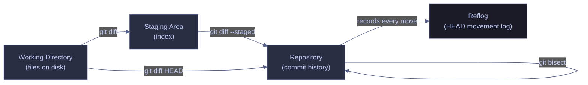
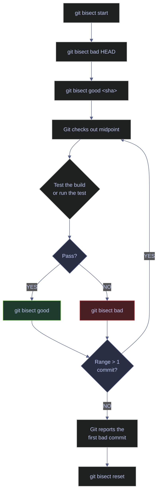

# Git History and Inspection

> [!quote]+
> "The past is never dead. It's not even past."
>
> --- **William Faulkner**, *Requiem for a Nun* (1951)

> [!abstract]- Summary
>
> Explains Git's inspection toolbox for tracing what changed, who changed it, and where regressions entered the history graph by combining `git log`, `git diff`, `git blame`, `git show`, `git reflog`, and `git bisect`.
>
> **History model and graph inspection**
> - Defines commits, parents, DAG traversal, references, and reflog scope before using `git log` views to read branch topology, commit metadata, and integration history
> - Distinguishes object identity from working-tree state so the note's commands answer investigation questions without mutating the repository unnecessarily
>
> **Comparing and attributing changes**
> - Uses `git diff` for file, branch, and commit comparisons, `git show` for object inspection, and `git blame` for line-level authorship and context tracing
> - Connects those tools to practical questions such as what changed, where it changed, who introduced it, and whether the current branch differs from the last reviewed baseline
>
> **Recovery-grade inspection workflows**
> - Applies `git reflog` to rewritten or lost history, uses `git bisect` to isolate regressions efficiently, and explains how to inspect rebased or force-pushed branches after history changes
> - Organizes the commands into repeatable investigation workflows for incidents, regressions, and audit questions
>
> **Operations and safety**
> - Warnings: reading stale refs, blaming generated or reformatted lines naively, losing context after rewritten history, and running mutation commands when inspection alone is enough
> - Recommendations: fetch before comparing to remotes, inspect with commit ranges deliberately, use bisect on reproducible tests only, and lean on reflog before assuming work is lost
> - Troubleshooting: workflows for missing commits, misleading blame output, hard-to-read diffs, and regression hunting across rewritten history

> [!note]- Glossary
>
> **commit**
> - An immutable snapshot of the entire repository at a point in time. Each commit stores a tree (directory structure), author, committer, timestamp, message, and one or more parent commit references.
> - It matters in this note because the workflows for history inspection, incident investigation, and regression isolation read or change this part of Git's state directly, and misunderstanding it leads to the wrong command or the wrong safety assumption.
>
> > [!info] Operational nuance
> >
> > Treat this as a concrete Git object, state, or workflow term rather than as a loose synonym. The commands in the note behave differently depending on this exact meaning.
>
> ---
>
> **SHA (hash)**
> - A 40-character hexadecimal string (SHA-1) that uniquely identifies a commit, tree, or blob object. Git commands accept short prefixes (7+ characters) when unambiguous.
> - It matters in this note because the workflows for history inspection, incident investigation, and regression isolation read or change this part of Git's state directly, and misunderstanding it leads to the wrong command or the wrong safety assumption.
>
> > [!info] Operational nuance
> >
> > Treat this as a concrete Git object, state, or workflow term rather than as a loose synonym. The commands in the note behave differently depending on this exact meaning.
>
> ---
>
> **HEAD**
> - A symbolic reference pointing to the currently checked-out commit. Usually points to a branch name, which in turn points to a commit SHA.
> - It matters in this note because the workflows for history inspection, incident investigation, and regression isolation read or change this part of Git's state directly, and misunderstanding it leads to the wrong command or the wrong safety assumption.
>
> > [!warning] Pointer semantics matter
> >
> > Git stores this as reference state rather than as a second copy of files. Many confusing behaviors come from moving refs while file contents stay the same.
>
> ---
>
> **ref**
> - A human-readable name that resolves to a SHA. Branches (`main`), tags (`v1.0.0`), and `HEAD` are all refs.
> - It matters in this note because the workflows for history inspection, incident investigation, and regression isolation read or change this part of Git's state directly, and misunderstanding it leads to the wrong command or the wrong safety assumption.
>
> > [!warning] Pointer semantics matter
> >
> > Git stores this as reference state rather than as a second copy of files. Many confusing behaviors come from moving refs while file contents stay the same.
>
> ---
>
> **DAG (directed acyclic graph)**
> - The data structure formed by commits and their parent pointers. Each commit points backward to its parent(s), creating a graph that can branch and merge but never cycle.
> - It matters in this note because the workflows for history inspection, incident investigation, and regression isolation read or change this part of Git's state directly, and misunderstanding it leads to the wrong command or the wrong safety assumption.
>
> > [!warning] Pointer semantics matter
> >
> > Git stores this as reference state rather than as a second copy of files. Many confusing behaviors come from moving refs while file contents stay the same.
>
> ---
>
> **range (`A..B`)**
> - The set of commits reachable from B but not from A. Reads as "everything B has that A does not."
> - It matters in this note because the workflows for history inspection, incident investigation, and regression isolation read or change this part of Git's state directly, and misunderstanding it leads to the wrong command or the wrong safety assumption.
>
> > [!info] Operational nuance
> >
> > Treat this as a concrete Git object, state, or workflow term rather than as a loose synonym. The commands in the note behave differently depending on this exact meaning.
>
> ---
>
> **symmetric difference (`A...B`)**
> - The set of commits reachable from either A or B, but not both. Shows what diverged on both sides since their common ancestor.
> - It matters in this note because the workflows for history inspection, incident investigation, and regression isolation read or change this part of Git's state directly, and misunderstanding it leads to the wrong command or the wrong safety assumption.
>
> > [!info] Operational nuance
> >
> > Treat this as a concrete Git object, state, or workflow term rather than as a loose synonym. The commands in the note behave differently depending on this exact meaning.
>
> ---
>
> **merge base**
> - The most recent common ancestor of two branches. Git computes it automatically when you use `...` (three-dot) notation.
> - It matters in this note because the workflows for history inspection, incident investigation, and regression isolation ask you to choose or interpret this operation deliberately instead of treating nearby Git commands as interchangeable.
>
> > [!warning] Pointer semantics matter
> >
> > Git stores this as reference state rather than as a second copy of files. Many confusing behaviors come from moving refs while file contents stay the same.
>
> ---
>
> **diff**
> - A textual representation of the changes between two states --- working directory, staging area (index), commits, or branches.
> - It matters in this note because the workflows for history inspection, incident investigation, and regression isolation read or change this part of Git's state directly, and misunderstanding it leads to the wrong command or the wrong safety assumption.
>
> > [!warning] Pointer semantics matter
> >
> > Git stores this as reference state rather than as a second copy of files. Many confusing behaviors come from moving refs while file contents stay the same.
>
> ---
>
> **unified diff**
> - The standard diff format showing removed lines (prefixed `-`, red) and added lines (prefixed `+`, green) with surrounding context lines.
> - It matters in this note because the workflows for history inspection, incident investigation, and regression isolation read or change this part of Git's state directly, and misunderstanding it leads to the wrong command or the wrong safety assumption.
>
> > [!info] Operational nuance
> >
> > Treat this as a concrete Git object, state, or workflow term rather than as a loose synonym. The commands in the note behave differently depending on this exact meaning.
>
> ---
>
> **hunk**
> - A contiguous block of changed lines within a unified diff, introduced by an `@@` header showing line numbers.
> - It matters in this note because the workflows for history inspection, incident investigation, and regression isolation read or change this part of Git's state directly, and misunderstanding it leads to the wrong command or the wrong safety assumption.
>
> > [!warning] Pointer semantics matter
> >
> > Git stores this as reference state rather than as a second copy of files. Many confusing behaviors come from moving refs while file contents stay the same.
>
> ---
>
> **blame**
> - Line-by-line annotation of a file showing which commit last modified each line, along with the author and date.
> - It matters in this note because the workflows for history inspection, incident investigation, and regression isolation read or change this part of Git's state directly, and misunderstanding it leads to the wrong command or the wrong safety assumption.
>
> > [!info] Operational nuance
> >
> > Treat this as a concrete Git object, state, or workflow term rather than as a loose synonym. The commands in the note behave differently depending on this exact meaning.
>
> ---
>
> **pickaxe (`-S`)**
> - A `git log` filter that finds commits where the number of occurrences of a given string changed --- detecting when code was introduced or removed.
> - It matters in this note because the workflows for history inspection, incident investigation, and regression isolation read or change this part of Git's state directly, and misunderstanding it leads to the wrong command or the wrong safety assumption.
>
> > [!info] Operational nuance
> >
> > Treat this as a concrete Git object, state, or workflow term rather than as a loose synonym. The commands in the note behave differently depending on this exact meaning.
>
> ---
>
> **reflog**
> - A local-only log of every position HEAD (or a branch tip) has occupied. Records checkouts, commits, rebases, resets, and amends. Not shared via push/fetch.
> - It matters in this note because the workflows for history inspection, incident investigation, and regression isolation read or change this part of Git's state directly, and misunderstanding it leads to the wrong command or the wrong safety assumption.
>
> > [!warning] History rewrite risk
> >
> > This changes or depends on rewritten history. Verify branch ownership and remote state before using the destructive variant of any related command.
>
> ---
>
> **bisect**
> - A binary-search algorithm that finds the exact commit introducing a regression by iteratively halving the commit range between a known-good and known-bad state.
> - It matters in this note because the workflows for history inspection, incident investigation, and regression isolation read or change this part of Git's state directly, and misunderstanding it leads to the wrong command or the wrong safety assumption.
>
> > [!info] Operational nuance
> >
> > Treat this as a concrete Git object, state, or workflow term rather than as a loose synonym. The commands in the note behave differently depending on this exact meaning.
>
> ---
>
> **patch (`-p`)**
> - The full diff output appended to each commit in `git log -p`, showing exactly what changed in every file.
> - It matters in this note because the workflows for history inspection, incident investigation, and regression isolation read or change this part of Git's state directly, and misunderstanding it leads to the wrong command or the wrong safety assumption.
>
> > [!danger] Security boundary
> >
> > This term touches authentication, identity, or trust. Treat it as secret or policy material rather than as ordinary repository metadata.
>
> ---
>
> **staging area (index)**
> - An intermediate state between the working directory and the next commit. `git add` moves changes into the index; `git commit` snapshots the index.
> - It matters in this note because the workflows for history inspection, incident investigation, and regression isolation ask you to choose or interpret this operation deliberately instead of treating nearby Git commands as interchangeable.
>
> > [!info] Operational nuance
> >
> > Treat this as a concrete Git object, state, or workflow term rather than as a loose synonym. The commands in the note behave differently depending on this exact meaning.
>
> ---
>
> **working directory**
> - The actual files on disk. Changes here are "unstaged" until added to the index.
> - It matters in this note because the workflows for history inspection, incident investigation, and regression isolation read or change this part of Git's state directly, and misunderstanding it leads to the wrong command or the wrong safety assumption.
>
> > [!info] Operational nuance
> >
> > Treat this as a concrete Git object, state, or workflow term rather than as a loose synonym. The commands in the note behave differently depending on this exact meaning.
>
> ---
>
> **range-diff**
> - A diff-of-diffs that compares two versions of a patch series (e.g., before and after a rebase), showing which commits were added, dropped, or modified between iterations.
> - It matters in this note because the workflows for history inspection, incident investigation, and regression isolation read or change this part of Git's state directly, and misunderstanding it leads to the wrong command or the wrong safety assumption.
>
> > [!danger] Security boundary
> >
> > This term touches authentication, identity, or trust. Treat it as secret or policy material rather than as ordinary repository metadata.
>
> ---
>
> **cherry**
> - A Git command that compares patches by content (not SHA) to identify which commits from one branch have already been applied to another, accounting for cherry-picks.
> - It matters in this note because the workflows for history inspection, incident investigation, and regression isolation read or change this part of Git's state directly, and misunderstanding it leads to the wrong command or the wrong safety assumption.
>
> > [!danger] Security boundary
> >
> > This term touches authentication, identity, or trust. Treat it as secret or policy material rather than as ordinary repository metadata.
>
> ---
>
> **mailmap**
> - A `.mailmap` file in the repository root that maps alternate author names and emails to a canonical identity, so contribution counts and blame attribution are accurate across identity changes.
> - It matters in this note because the workflows for history inspection, incident investigation, and regression isolation read or change this part of Git's state directly, and misunderstanding it leads to the wrong command or the wrong safety assumption.
>
> > [!info] Operational nuance
> >
> > Treat this as a concrete Git object, state, or workflow term rather than as a loose synonym. The commands in the note behave differently depending on this exact meaning.
>
> ---
>
> **partial clone**
> - A clone created with `--filter=blob:none` that downloads all commits and trees but defers blob (file content) downloads until accessed. Preserves full commit history while reducing initial clone size.
> - It matters in this note because the workflows for history inspection, incident investigation, and regression isolation ask you to choose or interpret this operation deliberately instead of treating nearby Git commands as interchangeable.
>
> > [!info] Scale and workflow tradeoff
> >
> > This feature improves developer ergonomics or repository scale, but it adds assumptions that automation and teammates also need to understand.
>
> ---
>
> **shallow clone**
> - A clone created with `--depth N` that contains only the last N commits. Breaks bisect, deep blame, and range-based inspection.
> - It matters in this note because the workflows for history inspection, incident investigation, and regression isolation ask you to choose or interpret this operation deliberately instead of treating nearby Git commands as interchangeable.
>
> > [!info] Operational nuance
> >
> > Treat this as a concrete Git object, state, or workflow term rather than as a loose synonym. The commands in the note behave differently depending on this exact meaning.


## Conceptual Model

Before using any inspection command, understand the three layers Git maintains and how inspection commands relate to them.



*`git diff` compares between layers. `git log`, `git show`, and `git blame` query the repository layer. `git reflog` queries the local HEAD movement log, which is never shared with remotes.*

Three distinct histories exist in every Git repository:

1. **Repository history** (`git log`) --- the permanent, shared DAG of commits. Pushed to remotes, visible to all collaborators.
2. **HEAD movement history** (`git reflog`) --- a local-only, append-only log of every position HEAD has occupied. Records checkouts, rebases, resets, amends. Never leaves the local machine.
3. **Working-tree state** (`git diff`, `git status`) --- the difference between what is on disk and what is committed. Ephemeral and local.

> [!info] All inspection commands are read-only
>
> Every command on this page is safe to run at any time. None of them modify the working directory, the staging area, or the commit history. The only exception is `git bisect`, which temporarily checks out commits during the search --- but `git bisect reset` restores HEAD to its original position.

---

## git log --- Browsing Commit History

`git log` traverses the commit DAG in reverse chronological order, displaying commit metadata and optionally the diff for each commit. It is the primary tool for understanding how a codebase evolved, who contributed what, and when specific changes landed.

### Git | log | basic viewing options

#### Display compact one-line history

As a first step when investigating any change --- to get a quick overview of recent activity. It is typically triggered by starting a debugging session, reviewing what landed since last pull, or orienting in an unfamiliar repository. Read-only. Runs locally. No permissions required beyond repository access. See the most recent commits at a glance with minimal noise.

The `--oneline` flag condenses each commit to a single line: the abbreviated 7-character SHA followed by the first line of the commit message. This is the most common starting point for browsing history.

*Show the 15 most recent commits in compact format.*

```bash
git log --oneline -15
```

```text
35c16f7 ops: set log level to INFO for production
cbcd74c merge: resolve config.py conflict — keep reduced TTL and connection limit, add retry settings
2eff67c fix: reduce cache TTL and add connection limit
eadb609 feat: update cache TTL and add retry settings
5644c58 feat: update settings for production (#8)
bb3d362 feat: add application settings
7baef30 feat: add portfolio risk calculator (#7)
2c8edad feat: add momentum signal module (#1)
5b59a9b feat: add config validation utilities (#6)
52aa8e6 feat: add Terraform VPC for data platform
0c2ffa5 Merge pull request #4 from alp78/feat/airflow-scheduler
349ecf7 feat: add daily OHLCV ingestion DAG
5f142f8 Merge pull request #3 from alp78/feat/dbt-staging
1b76f94 feat: add market hours migration (#2)
5643d9a feat: add dbt staging model for daily prices
```

Each line reads as: `<short-SHA> <commit-message-first-line>`. The `-15` flag limits output to the last 15 commits. Without `-n`, `git log` prints the entire history.

#### Display the branch DAG as an ASCII graph

When you need to understand branch topology --- where branches diverged, where merges happened, and which commits are on which branch. It is typically triggered by investigating a merge conflict, understanding PR history, or verifying that a rebase produced the expected linear history. Read-only. The `--all` flag includes all branches (local and remote-tracking), not just the currently checked-out branch. Visualize the commit DAG structure including branch and merge points.

> [!info]- Flag breakdown
>
> - `--oneline` --- one line per commit (short SHA + message)
> - `--graph` --- draw ASCII branch/merge lines on the left
> - `--all` --- include all branches, not just the current one
> - `-25` --- limit to the last 25 commits

*Draw the commit DAG for all branches, limited to 25 entries.*

```bash
git log --oneline --graph --all -25
```

```text
* 8ac272d chore: stop tracking logs directory
* 39f91b7 mistake: accidentally commit log directory
* 3454539 chore: stop tracking .env, restore .gitignore rule
* acb02fc mistake: accidentally commit .env file
* 4baa9a6 chore: update .gitignore with data-engineering patterns, add sample data
* 35c16f7 ops: set log level to INFO for production
*   cbcd74c merge: resolve config.py conflict — keep reduced TTL and connection limit, add retry settings
|\
| * eadb609 feat: update cache TTL and add retry settings
* | 2eff67c fix: reduce cache TTL and add connection limit
|/
| * 3fcc865 test: add data quality checks for pipeline
|/
* 5644c58 feat: update settings for production (#8)
| * 74d200e feat: update settings for production
|/
* bb3d362 feat: add application settings
* 7baef30 feat: add portfolio risk calculator (#7)
* 2c8edad feat: add momentum signal module (#1)
* 5b59a9b feat: add config validation utilities (#6)
| * 85e45dd feat: add portfolio risk calculator
|/
| * 48aa5ee feat: add config validation utilities
|/
* 52aa8e6 feat: add Terraform VPC for data platform
*   0c2ffa5 Merge pull request #4 from alp78/feat/airflow-scheduler
|\
| * 349ecf7 feat: add daily OHLCV ingestion DAG
|/
```

The `*` marks each commit. The `|`, `/`, and `\` characters draw the branch lines. Where two lines converge into a single `*`, a merge occurred (e.g., `cbcd74c`). Where a line diverges, a branch was created.

#### Filter commits by author

When reviewing a specific contributor's work --- for code review, sprint audits, or investigating who changed a specific area. It is typically triggered by preparing a review, auditing contributions, or tracing a change to its author. Read-only. The `--author` flag accepts a substring match against the author name or email. Case-insensitive. Narrow the log to commits from a specific person.

*Show the last 10 commits by author `alp78`.*

```bash
git log --author="alp78" --oneline -10
```

```text
35c16f7 ops: set log level to INFO for production
cbcd74c merge: resolve config.py conflict — keep reduced TTL and connection limit, add retry settings
2eff67c fix: reduce cache TTL and add connection limit
eadb609 feat: update cache TTL and add retry settings
5644c58 feat: update settings for production (#8)
bb3d362 feat: add application settings
7baef30 feat: add portfolio risk calculator (#7)
2c8edad feat: add momentum signal module (#1)
5b59a9b feat: add config validation utilities (#6)
52aa8e6 feat: add Terraform VPC for data platform
```

The `--author` flag matches any part of the author identity. `--author="alice"` matches `alice`, `alice@company.com`, and `Alice Smith`. Combine with `--since` and `--until` for date-bounded audits:

```bash
git log --author="alp78" --since="2026-04-01" --until="2026-04-13" --oneline
```

#### View the history of a specific file

When investigating the evolution of a single file --- how it changed over time, who changed it, and why. It is typically triggered by debugging a regression in a specific module, reviewing the change history of a configuration file, or auditing who modified a sensitive file. Read-only. The `--` separator prevents Git from confusing the file path with a branch name. Show only commits that touched the specified file.

*Show all commits that modified `config.py`.*

```bash
git log -- config.py --oneline
```

```text
35c16f7 ops: set log level to INFO for production
cbcd74c merge: resolve config.py conflict — keep reduced TTL and connection limit, add retry settings
2eff67c fix: reduce cache TTL and add connection limit
eadb609 feat: update cache TTL and add retry settings
102afc6 fix: set cache TTL to 300 seconds
```

The `--` is a safety separator: it tells Git that everything after it is a file path, not a branch name. This prevents ambiguity when a file happens to share a name with a branch.

> [!tip] Track file history across renames
>
> By default, `git log -- file` stops following history when the file was renamed. Add `--follow` to trace the file through renames:
>
> ```bash
> git log --follow -- src/pipeline.py --oneline
> ```

#### View commit count per author

When auditing contribution distribution across the team. It is typically triggered by sprint retrospectives, open-source contribution reviews, or identifying domain experts for a specific area. Read-only. `--all` includes all branches. Summarize total commit count per author.

`git shortlog` groups commits by author. The `-s` flag shows only the count (suppresses individual commit messages), and `-n` sorts by count descending.

*Show commit count per author across all branches.*

```bash
git shortlog -sn --all
```

```text
    70  alp78
     9  alp
```

Notice that the same person appears as two identities (`alp78` and `alp`) due to different Git configurations across machines or GitHub's noreply address. This is a common problem in multi-year repos where engineers change email addresses, switch laptops, or commit via the GitHub web UI. Audit counts become misleading unless identities are canonicalized --- see the `.mailmap` section below.

#### Normalize author identities with .mailmap

When `git shortlog` or `git log` shows the same person under multiple names or emails, distorting contribution counts and audit trails. It is typically triggered by onboarding audit, compliance review, or any time you need accurate per-author statistics across repository history. Read-only for reporting purposes. The `.mailmap` file is committed to the repository root. Once present, `git shortlog`, `git blame`, and any command using `%aN`/`%aE` format placeholders will automatically resolve identities. Map multiple author identities to a single canonical name and email so that audit counts, blame attribution, and contribution stats are accurate.

A `.mailmap` file maps alternate identities to a canonical form. The syntax is:

```text
Canonical Name <canonical@email.com> Alternate Name <alternate@email.com>
```

*Create a `.mailmap` file that maps the `alp` noreply identity to the canonical `alp78` identity.*

```bash
echo 'alp78 <alexper.recovery@gmail.com> alp <37634801+alp78@users.noreply.github.com>' > .mailmap
```

*Verify the shortlog now shows a single consolidated identity.*

```bash
git shortlog -sn --all
```

```text
   122  alp78
```

The 9 commits previously attributed to `alp` are now correctly counted under `alp78`. The mapping applies retroactively to all historical commits without rewriting any history.

### Git | log | advanced filters and formats

#### Search commit messages with --grep

When you know a keyword or issue number appeared in a commit message and need to find those commits. It is typically triggered by looking for all commits that reference a bug fix, a ticket number, or a feature name. Read-only. Case-sensitive by default; add `-i` for case-insensitive matching. The pattern is a basic regular expression. Filter the log to commits whose message matches a pattern.

*Find all commits with "fix" in the message.*

```bash
git log --grep="fix" --oneline
```

```text
2eff67c fix: reduce cache TTL and add connection limit
102afc6 fix: set cache TTL to 300 seconds
3c60ed4 fix: handle NaN values in price feed
4b59560 fix: reduce retries and adjust schedule for market close
3dfc084 fix: add type hints to transform function
```

#### Find when code was introduced or removed with -S (pickaxe)

When you need to find the exact commit that introduced a function, variable, constant, or configuration value --- or when it was removed. It is typically triggered by investigating when a specific feature was added, when a deprecated function was removed, or tracing the origin of a configuration constant. Read-only. `-S` searches for commits where the number of occurrences of the given string changed. This is different from `--grep`, which searches commit messages. Identify the commit that added or removed a specific string from the codebase.

> [!info] Pickaxe vs grep
>
> `--grep="CACHE_TTL"` finds commits whose *message* mentions `CACHE_TTL`. `-S "CACHE_TTL"` finds commits that *changed the number of occurrences* of the string `CACHE_TTL` in the actual code. Use `--grep` for message search, `-S` for code-change search.

*Find commits that added or removed the string `CACHE_TTL`.*

```bash
git log -S "CACHE_TTL" --oneline
```

```text
bb3d362 feat: add application settings
102afc6 fix: set cache TTL to 300 seconds
```

These two commits are the ones where `CACHE_TTL` first appeared (`102afc6`) and where it was added to a second file (`bb3d362`). Every other commit that merely changed the value (e.g., from `300` to `120`) does not appear because the count of occurrences did not change.

#### View full diffs per commit with -p

When you need to see exactly what changed in each commit, line by line --- the most thorough tool for root-cause analysis. It is typically triggered by investigating a regression, reviewing the full change history of a file, or auditing every modification made to a sensitive configuration. Read-only. Combines well with `-- file` to limit output to a single file. Show the complete patch (diff) for each commit.

*Show the full diff for each commit that touched `config.py`.*

```bash
git log -p -- config.py -3
```

```text
commit 35c16f79a0e95db0025818ef72708c3d92e34935
Author: alp78 <alexper.recovery@gmail.com>
Date:   Sun Apr 12 17:55:00 2026 +0200

    ops: set log level to INFO for production

diff --git a/config.py b/config.py
index b695fee..dea4f7f 100644
--- a/config.py
+++ b/config.py
@@ -2,3 +2,4 @@ CACHE_TTL = 120
 MAX_CONNECTIONS = 10
 RETRY_COUNT = 3
 TIMEOUT = 30
+LOG_LEVEL = "INFO"

commit 2eff67c8ad716c2f826e5124cea8907ac14db7ca
Author: alp78 <alexper.recovery@gmail.com>
Date:   Sun Apr 12 17:54:10 2026 +0200

    fix: reduce cache TTL and add connection limit

diff --git a/config.py b/config.py
index 03a0b42..18acb83 100644
--- a/config.py
+++ b/config.py
@@ -1 +1,2 @@
-CACHE_TTL = 300
+CACHE_TTL = 120
+MAX_CONNECTIONS = 10

commit 102afc6767649c5b5fa008b000d4d22d0e3a7d62
Author: alp78 <alexper.recovery@gmail.com>
Date:   Sun Apr 12 17:38:41 2026 +0200

    fix: set cache TTL to 300 seconds

diff --git a/config.py b/config.py
new file mode 100644
index 0000000..03a0b42
--- /dev/null
+++ b/config.py
@@ -0,0 +1 @@
+CACHE_TTL = 300
```

Reading bottom-to-top: `102afc6` created `config.py` with `CACHE_TTL = 300`. Then `2eff67c` changed it to `120` and added `MAX_CONNECTIONS`. Then `35c16f7` appended `LOG_LEVEL`. This gives you the complete evolutionary timeline of the file.

#### Use range notation to scope history

When you need to see only the commits between two specific points in history --- for example, what landed between two releases, or what a branch added since it diverged. It is typically triggered by release audits, PR reviews, or investigating what changed between a known-good state and the current state. Read-only. Two-dot (`A..B`) and three-dot (`A...B`) have different meanings. Limit log output to a specific range of commits.

Two range notations exist:

- **`A..B`** (two-dot) --- commits reachable from B but not from A. "What does B have that A doesn't?"
- **`A...B`** (three-dot, symmetric difference) --- commits reachable from either A or B, but not both. "What diverged on both sides?"

> [!info]- Range notation explained
>
> - `102afc6..35c16f7` --- shows every commit after `102afc6` up to and including `35c16f7`. This is equivalent to "what happened between these two commits."
> - `main...feat/data-quality-checks` with `--left-right` --- shows commits unique to each side, prefixed with `<` (left/main) or `>` (right/branch).

*Show all commits between `102afc6` and `35c16f7` (two-dot range).*

```bash
git log --oneline 102afc6..35c16f7
```

```text
35c16f7 ops: set log level to INFO for production
cbcd74c merge: resolve config.py conflict — keep reduced TTL and connection limit, add retry settings
2eff67c fix: reduce cache TTL and add connection limit
eadb609 feat: update cache TTL and add retry settings
5644c58 feat: update settings for production (#8)
bb3d362 feat: add application settings
7baef30 feat: add portfolio risk calculator (#7)
2c8edad feat: add momentum signal module (#1)
5b59a9b feat: add config validation utilities (#6)
52aa8e6 feat: add Terraform VPC for data platform
0c2ffa5 Merge pull request #4 from alp78/feat/airflow-scheduler
349ecf7 feat: add daily OHLCV ingestion DAG
5f142f8 Merge pull request #3 from alp78/feat/dbt-staging
1b76f94 feat: add market hours migration (#2)
5643d9a feat: add dbt staging model for daily prices
```

*Show the symmetric difference between `main` and a feature branch.*

```bash
git log --oneline --left-right main...feat/data-quality-checks
```

```text
< 35c16f7 ops: set log level to INFO for production
< cbcd74c merge: resolve config.py conflict — keep reduced TTL and connection limit, add retry settings
< 2eff67c fix: reduce cache TTL and add connection limit
< eadb609 feat: update cache TTL and add retry settings
> 3fcc865 test: add data quality checks for pipeline
```

Lines prefixed with `<` are commits only on `main`. Lines prefixed with `>` are commits only on the feature branch. This is the clearest way to see what each side has that the other does not.

#### Use custom format strings

When you need machine-parseable or custom-formatted log output for scripts, reports, or dashboards. It is typically triggered by building release notes, feeding commit data into a pipeline, or creating audit trails. Read-only. The `--format` string uses `%h` (short hash), `%an` (author name), `%ad` (author date), `%s` (subject), and many other placeholders. Control exactly which fields appear and in what format.

*Show short hash, date, and subject for the last 10 commits.*

```bash
git log --format="%h %ad %s" --date=short -10
```

```text
35c16f7 2026-04-12 ops: set log level to INFO for production
cbcd74c 2026-04-12 merge: resolve config.py conflict — keep reduced TTL and connection limit, add retry settings
2eff67c 2026-04-12 fix: reduce cache TTL and add connection limit
eadb609 2026-04-12 feat: update cache TTL and add retry settings
5644c58 2026-04-12 feat: update settings for production (#8)
bb3d362 2026-04-12 feat: add application settings
7baef30 2026-04-12 feat: add portfolio risk calculator (#7)
2c8edad 2026-04-12 feat: add momentum signal module (#1)
5b59a9b 2026-04-12 feat: add config validation utilities (#6)
52aa8e6 2026-04-12 feat: add Terraform VPC for data platform
```

Common format placeholders:

| Placeholder | Output |
|---|---|
| `%H` | Full 40-character SHA |
| `%h` | Abbreviated SHA (7 characters) |
| `%an` | Author name |
| `%ae` | Author email |
| `%ad` | Author date (use `--date=short` for `YYYY-MM-DD`) |
| `%s` | Subject (first line of commit message) |
| `%b` | Body (remainder of commit message) |
| `%d` | Ref names (`HEAD -> main`, `tag: v1.0.0`) |

#### Filter by merge status

When you need to see only merge commits (to understand integration points) or exclude them (to see only direct work). It is typically triggered by auditing merge history, understanding when branches were integrated, or reviewing only feature commits without merge noise. Read-only. Include or exclude merge commits from the log.

*Show only merge commits.*

```bash
git log --merges --oneline -5
```

```text
cbcd74c merge: resolve config.py conflict — keep reduced TTL and connection limit, add retry settings
0c2ffa5 Merge pull request #4 from alp78/feat/airflow-scheduler
5f142f8 Merge pull request #3 from alp78/feat/dbt-staging
06f13ca merge: add US market holiday calendar
11df7ed merge: integrate currency code validator
```

*Show only non-merge commits.*

```bash
git log --no-merges --oneline -10
```

```text
35c16f7 ops: set log level to INFO for production
2eff67c fix: reduce cache TTL and add connection limit
eadb609 feat: update cache TTL and add retry settings
5644c58 feat: update settings for production (#8)
bb3d362 feat: add application settings
7baef30 feat: add portfolio risk calculator (#7)
2c8edad feat: add momentum signal module (#1)
5b59a9b feat: add config validation utilities (#6)
52aa8e6 feat: add Terraform VPC for data platform
349ecf7 feat: add daily OHLCV ingestion DAG
```

| Flag | Syntax | Description |
|---|---|---|
| `--oneline` | `git log --oneline` | One line per commit: short SHA + message |
| `-n` | `git log -10` | Limit to last N commits |
| `--graph` | `git log --graph` | ASCII tree of the commit DAG |
| `--all` | `git log --all` | Include all branches, not just current |
| `--decorate` | `git log --decorate` | Show branch and tag labels on commits |
| `--author` | `git log --author="alice"` | Filter commits by author name (partial match) |
| `--since` | `git log --since="2 weeks ago"` | Show commits after a date |
| `--until` | `git log --until="2026-03-01"` | Show commits before a date |
| `-p` | `git log -p` | Include full diff patch per commit |
| `--stat` | `git log --stat` | Show changed files and line counts per commit |
| `--grep` | `git log --grep="fix"` | Filter by commit message pattern |
| `-S` | `git log -S "keyword"` | Pickaxe: commits that added or removed string |
| `-G` | `git log -G "regex"` | Commits where the diff matches a regex |
| `--follow` | `git log --follow -- file` | Follow renames through file history |
| `--no-merges` | `git log --no-merges` | Exclude merge commits |
| `--merges` | `git log --merges` | Show only merge commits |
| `--left-right` | `git log --left-right A...B` | Mark commits with `<` (left) or `>` (right) |
| `--diff-filter` | `git log --diff-filter=A` | Filter by change type: A=added, D=deleted, M=modified |
| `--format` | `git log --format="%h %s"` | Custom output format |
| `--date` | `git log --date=short` | Date format: short, iso, relative, unix |
| `--first-parent` | `git log --first-parent` | Follow only the first parent of merges (main line) |
| `--ancestry-path` | `git log --ancestry-path A..B` | Only commits that are ancestors of B and descendants of A |

---

## git diff --- Comparing Changes

`git diff` compares file contents between different states: working directory vs staging area, staging area vs last commit, or any two commits, branches, or tags. It is the primary tool for reviewing what you are about to commit and for understanding what changed in a branch or PR.

### Git | diff | comparing layers

#### Compare unstaged changes (working directory vs index)

Before staging, to review what you have modified but not yet added. It is typically triggered before running `git add`, to verify your changes are correct and complete. Read-only. Compares the working directory against the staging area (index). If you have already staged everything, this shows nothing. See what you have changed in the working tree that is not yet staged.

*Show unstaged changes.*

```bash
git diff
```

```text
diff --git a/config.py b/config.py
index bc890e4..2965d0b 100644
--- a/config.py
+++ b/config.py
@@ -1,5 +1,6 @@
 CACHE_TTL = 120
 MAX_CONNECTIONS = 10
 RETRY_COUNT = 5
-TIMEOUT = 30
+TIMEOUT = 60
 LOG_LEVEL = "INFO"
+DEBUG_MODE = False
```

Lines prefixed with `-` (red) were removed. Lines prefixed with `+` (green) were added. Context lines (no prefix) are unchanged but shown for orientation. The `@@ -1,5 +1,6 @@` header means: the old file started at line 1 and showed 5 lines; the new file starts at line 1 and shows 6 lines.

#### Compare staged changes (index vs last commit)

After staging with `git add`, to review exactly what will go into the next commit. It is typically triggered before running `git commit`, as a final review step. Read-only. Compares the staging area against HEAD. The `--cached` flag is a synonym for `--staged`. See exactly what the next commit will contain.

*Show staged changes.*

```bash
git diff --staged
```

```text
diff --git a/config.py b/config.py
index dea4f7f..bc890e4 100644
--- a/config.py
+++ b/config.py
@@ -1,5 +1,5 @@
 CACHE_TTL = 120
 MAX_CONNECTIONS = 10
-RETRY_COUNT = 3
+RETRY_COUNT = 5
 TIMEOUT = 30
 LOG_LEVEL = "INFO"
```

This shows that the staged change is: `RETRY_COUNT` changed from `3` to `5`. This is precisely what will be committed.

#### Compare branch changes since divergence (three-dot diff)

When reviewing a PR or feature branch --- to see only what the branch changed, excluding anything that happened on main after the branch was created. It is typically triggered by PR review, pre-merge validation, or understanding the scope of a branch. Read-only. The three-dot syntax (`main...branch`) automatically finds the merge base and shows only changes on the branch side. See the effective diff of a branch as it would appear in a PR.

> [!info] Two-dot vs three-dot diff
>
> - `git diff main..branch` compares the tips directly --- if main has new commits since the branch diverged, those show up as "removed" lines, which is usually not what you want.
> - `git diff main...branch` (three dots) finds the merge base and shows only what changed on the branch side. This matches what GitHub/GitLab display in a PR diff.

*Show what the `demo/bisect-history` branch changed since diverging from main.*

```bash
git diff --stat main...demo/bisect-history
```

```text
 dags/daily_ingest.py   |  7 +++++++
 src/esg_scoring.py     | 28 +++++++++++++++++++---------
 src/pipeline.py        |  1 +
 src/utils.py           | 19 +++++++++++--------
 tests/test_pipeline.py | 28 ++++++++++++++++++++++------
 5 files changed, 60 insertions(+), 23 deletions(-)
```

The `+` and `-` bar on the right shows the proportion of additions vs deletions per file. The summary line at the bottom gives totals.

### Git | diff | scoping and output options

#### List only changed filenames

When you need a quick inventory of which files were touched, without seeing the actual changes. It is typically triggered by estimating the scope of a change, identifying which reviewers to assign, or feeding a file list into another tool. Read-only. Get a clean list of changed files.

*List files changed on the current branch vs main.*

```bash
git diff --name-only main...demo/bisect-history
```

```text
dags/daily_ingest.py
src/esg_scoring.py
src/pipeline.py
src/utils.py
tests/test_pipeline.py
```

#### Reading a unified diff

Every unified diff block has a consistent structure:

```text
diff --git a/config.py b/config.py       ← files being compared
index dea4f7f..bc890e4 100644             ← blob hashes and file mode
--- a/config.py                           ← old version marker
+++ b/config.py                           ← new version marker
@@ -1,5 +1,5 @@                           ← hunk header: line ranges
 CACHE_TTL = 120                          ← context line (unchanged)
 MAX_CONNECTIONS = 10                     ← context line (unchanged)
-RETRY_COUNT = 3                          ← removed line (red)
+RETRY_COUNT = 5                          ← added line (green)
 TIMEOUT = 30                             ← context line (unchanged)
 LOG_LEVEL = "INFO"                       ← context line (unchanged)
```

The hunk header `@@ -1,5 +1,5 @@` reads as: "starting at line 1 in the old file, showing 5 lines; starting at line 1 in the new file, showing 5 lines." When the line counts differ, lines were added or removed.

| Flag | Syntax | Description |
|---|---|---|
| `--staged` / `--cached` | `git diff --staged` | Staged changes vs last commit |
| `..` | `git diff main..branch` | Diff between two branch tips directly |
| `...` | `git diff main...branch` | Changes on branch since divergence (merge base) |
| `HEAD~N` | `git diff HEAD~3` | Working directory vs N commits ago |
| `--name-only` | `git diff --name-only` | List only filenames, no diff content |
| `--name-status` | `git diff --name-status` | Filenames with change type (A/M/D/R) |
| `--stat` | `git diff --stat` | Files changed with line count summary |
| `--word-diff` | `git diff --word-diff` | Inline word-level diff instead of line-level |
| `-w` | `git diff -w` | Ignore all whitespace changes |
| `--ignore-blank-lines` | `git diff --ignore-blank-lines` | Ignore changes that only add/remove blank lines |
| `--diff-filter` | `git diff --diff-filter=A` | Filter by change type: A=added, D=deleted, M=modified, R=renamed |
| `--no-renames` | `git diff --no-renames` | Disable rename detection |
| `--color-words` | `git diff --color-words` | Word-level color diff without `[-` / `{+` markers |
| `-U<n>` | `git diff -U5` | Show N lines of context around each change (default 3) |

---

## git blame --- Tracing Authorship

`git blame` annotates each line of a file with the commit SHA, author, and date of the last change to that line. It answers "who wrote this line, when, and in which commit?" --- essential for understanding why code looks the way it does and for tracing decisions back to their original context.

### Git | blame | annotating files

#### Annotate an entire file

When you need to understand the authorship of every line in a file --- who last modified each line and when. It is typically triggered by investigating why a piece of code exists, finding the right person to ask about a decision, or auditing a configuration file. Read-only. Shows the state of the file at HEAD by default. Use `<commit> -- <file>` to blame at a different point in history. Map every line to its last-modifying commit, author, and date.

*Annotate every line of `src/pipeline.py` with authorship.*

```bash
git blame src/pipeline.py
```

```text
71f876ed (alp78 2026-04-12 15:35:30 +0200  1) """Stock data pipeline — daily ingestion and transformation."""
71f876ed (alp78 2026-04-12 15:35:30 +0200  2)
71f876ed (alp78 2026-04-12 15:35:30 +0200  3) import logging
71f876ed (alp78 2026-04-12 15:35:30 +0200  4)
71f876ed (alp78 2026-04-12 15:35:30 +0200  5) logger = logging.getLogger(__name__)
71f876ed (alp78 2026-04-12 15:35:30 +0200  6)
71f876ed (alp78 2026-04-12 15:35:30 +0200  7)
71f876ed (alp78 2026-04-12 15:35:30 +0200  8) def fetch_prices(ticker: str) -> dict:
71f876ed (alp78 2026-04-12 15:35:30 +0200  9)     """Fetch end-of-day prices for a given ticker."""
71f876ed (alp78 2026-04-12 15:35:30 +0200 10)     logger.info("Fetching prices for %s", ticker)
71f876ed (alp78 2026-04-12 15:35:30 +0200 11)     return {"ticker": ticker, "close": 42.50, "volume": 1_200_000}
71f876ed (alp78 2026-04-12 15:35:30 +0200 12)
71f876ed (alp78 2026-04-12 15:35:30 +0200 13)
3dfc084a (alp   2026-04-12 16:16:28 +0200 14) def transform(raw: dict[str, object]) -> dict[str, object]:
71f876ed (alp78 2026-04-12 15:35:30 +0200 15)     """Normalize and validate raw price data."""
71f876ed (alp78 2026-04-12 15:35:30 +0200 16)     return {
3dfc084a (alp   2026-04-12 16:16:28 +0200 17)         "ticker": str(raw["ticker"]),
71f876ed (alp78 2026-04-12 15:35:30 +0200 18)         "close_price": float(raw["close"]),
71f876ed (alp78 2026-04-12 15:35:30 +0200 19)         "volume": int(raw["volume"]),
07a7f46e (alp78 2026-04-12 16:20:09 +0200 20)         "currency": raw.get("currency", "USD"),
07a7f46e (alp78 2026-04-12 16:20:09 +0200 21)         "source": "yfinance",
71f876ed (alp78 2026-04-12 15:35:30 +0200 22)     }
2c8edad0 (alp   2026-04-12 17:45:59 +0200 23)
2c8edad0 (alp   2026-04-12 17:45:59 +0200 24)
2c8edad0 (alp   2026-04-12 17:45:59 +0200 25) def validate(record: dict) -> bool:
2c8edad0 (alp   2026-04-12 17:45:59 +0200 26)     """Validate a transformed record before loading."""
2c8edad0 (alp   2026-04-12 17:45:59 +0200 27)     required = {"ticker", "close_price", "volume"}
2c8edad0 (alp   2026-04-12 17:45:59 +0200 28)     return required.issubset(record.keys()) and record["close_price"] > 0
```

Each line is formatted as: `commit-sha (author date line-number) code`. Reading this output:

- Lines 1--13 and 15--16, 18--19, 22: authored by `alp78` in commit `71f876e` (the initial pipeline skeleton).
- Line 14, 17: modified by `alp` in commit `3dfc084` (added type hints).
- Lines 20--21: modified by `alp78` in commit `07a7f46` (added currency and source fields).
- Lines 23--28: added by `alp` in commit `2c8edad` (added the `validate` function).

#### Blame a specific line range

When you only care about a specific function or block, not the entire file. It is typically triggered by investigating a single function's authorship, or focusing on a specific configuration block. Read-only. The `-L start,end` flag restricts output to the given line range. Narrow blame output to a specific region of the file.

*Blame lines 1--5 of `config.py`.*

```bash
git blame -L 1,5 config.py
```

```text
2eff67c8 (alp78 2026-04-12 17:54:10 +0200 1) CACHE_TTL = 120
2eff67c8 (alp78 2026-04-12 17:54:10 +0200 2) MAX_CONNECTIONS = 10
eadb6095 (alp78 2026-04-12 17:54:02 +0200 3) RETRY_COUNT = 3
eadb6095 (alp78 2026-04-12 17:54:02 +0200 4) TIMEOUT = 30
35c16f79 (alp78 2026-04-12 17:55:00 +0200 5) LOG_LEVEL = "INFO"
```

Three different commits authored these five lines: `2eff67c` set `CACHE_TTL` and `MAX_CONNECTIONS`, `eadb609` set `RETRY_COUNT` and `TIMEOUT`, and `35c16f7` added `LOG_LEVEL`. The `-L` syntax also supports function names in some languages: `git blame -L :function_name file`.

#### Ignore whitespace-only changes with -w

When a reformatting commit (indentation changes, trailing whitespace cleanup) has obscured the true logical author of each line. It is typically triggered after running a code formatter (black, ruff, prettier) that touched every line, making blame attribute the entire file to the formatting commit. Read-only. `-w` ignores whitespace-only changes and attributes lines to the most recent commit that made a substantive change. See the real logical author of each line, not the last formatter.

*Blame `src/pipeline.py` while ignoring whitespace changes.*

```bash
git blame -w src/pipeline.py
```

> [!tip] Create a blame-ignore file for formatters
>
> If your team runs bulk formatting commits (e.g., adopting `black` or `ruff format`), create a `.git-blame-ignore-revs` file listing those commit SHAs. Then configure Git to use it:
>
> ```bash
> echo "abc1234def5678" >> .git-blame-ignore-revs
> git config blame.ignoreRevsFile .git-blame-ignore-revs
> ```
>
> This permanently skips those commits in blame output without needing `-w` every time. GitHub also respects this file in its web blame view.

#### Detect code moved from other files with -C

When a function or block was extracted from one file into another (refactoring), and blame incorrectly attributes the code to the extraction commit instead of the original author. It is typically triggered after a refactor that moved code between files, when you need to trace the original author. Read-only. `-C` searches other files in the same commit for the origin of moved lines. Use `-C -C` (repeated) for a more aggressive search across all files. Attribute lines to their true origin, even across file moves and copies.

```bash
git blame -C src/pipeline.py
```

| Flag | Syntax | Description |
|---|---|---|
| `-w` | `git blame -w <file>` | Ignore whitespace-only changes in attribution |
| `-C` | `git blame -C <file>` | Detect lines moved or copied from other files |
| `-C -C` | `git blame -C -C <file>` | More aggressive cross-file search |
| `-M` | `git blame -M <file>` | Detect lines moved within the same file |
| `-L` | `git blame -L 40,60 <file>` | Restrict output to a line range |
| `-L :func` | `git blame -L :transform <file>` | Restrict to a named function (language-dependent) |
| `-e` | `git blame -e <file>` | Show author email instead of name |
| `--since` | `git blame --since="1 year ago" <file>` | Ignore commits older than the given date |
| `--ignore-rev` | `git blame --ignore-rev <sha>` | Ignore a specific commit (formatting commits) |
| `--ignore-revs-file` | `git blame --ignore-revs-file .git-blame-ignore-revs` | Ignore all commits listed in a file |
| `-t` | `git blame -t <file>` | Show timestamps as Unix epoch |

---

## git show --- Inspecting Individual Objects

`git show` displays the full metadata and diff for a specific commit, tag, or blob object. The `ref:path` syntax extends it to retrieve file content at any point in history --- useful for comparing current code against a known-good version without checking out the commit.

### Git | show | viewing commits and files

#### Display full commit details

When you need the complete picture of a specific commit --- who made it, when, what the message says, and exactly what changed. It is typically triggered by following up on a blame result (to see the full commit context), reviewing a specific merge, or inspecting a tagged release. Read-only. Accepts any valid ref: short SHA, full SHA, branch name, tag, or symbolic ref like `HEAD`. See the complete metadata and diff for a single commit.

*Show the full details of commit `35c16f7`.*

```bash
git show 35c16f7
```

```text
commit 35c16f79a0e95db0025818ef72708c3d92e34935
Author: alp78 <alexper.recovery@gmail.com>
Date:   Sun Apr 12 17:55:00 2026 +0200

    ops: set log level to INFO for production

diff --git a/config.py b/config.py
index b695fee..dea4f7f 100644
--- a/config.py
+++ b/config.py
@@ -2,3 +2,4 @@ CACHE_TTL = 120
 MAX_CONNECTIONS = 10
 RETRY_COUNT = 3
 TIMEOUT = 30
+LOG_LEVEL = "INFO"
```

The output has two parts: the commit header (full SHA, author, date, message) and the unified diff of every file changed in that commit. For merge commits, `git show` displays the combined diff by default; use `git show --first-parent <sha>` to see the diff against the first parent only.

#### View the scope of a commit with --stat

When you need a quick summary of which files a commit touched and how many lines changed, without the full diff. It is typically triggered by reviewing the impact of a commit before reading the full diff, or auditing the scope of a merge. Read-only. See file-level change summary for a commit.

*Show the stat summary for commit `35c16f7`.*

```bash
git show 35c16f7 --stat
```

```text
commit 35c16f79a0e95db0025818ef72708c3d92e34935
Author: alp78 <alexper.recovery@gmail.com>
Date:   Sun Apr 12 17:55:00 2026 +0200

    ops: set log level to INFO for production

 config.py | 1 +
 1 file changed, 1 insertion(+)
```

#### Retrieve file content at a specific point in history

When you need to see what a file looked like at a specific commit, branch, or tag --- without checking out that commit and disrupting your working directory. It is typically triggered by comparing current code against a known-good version, investigating what a config file contained at a release boundary, or extracting a file from a past state. Read-only. Does not modify the working directory, staging area, or HEAD. Retrieve the exact content of a file at any point in history.

The `ref:path` syntax works with any valid ref --- commit SHA, branch name, tag, or `HEAD`.

*Show `config.py` as it exists on the current HEAD.*

```bash
git show HEAD:config.py
```

```text
CACHE_TTL = 120
MAX_CONNECTIONS = 10
RETRY_COUNT = 3
TIMEOUT = 30
LOG_LEVEL = "INFO"
```

*Show `config.py` as it existed at commit `102afc6` (the earliest version).*

```bash
git show 102afc6:config.py
```

```text
CACHE_TTL = 300
```

This reveals that the file originally contained only one line. The current five-line version evolved through multiple commits.

> [!tip] Extract a file to disk without checkout
>
> To save a file from a past commit without disrupting the working directory:
>
> ```bash
> git show v1.0.0:src/config.py > /tmp/config_v1.py
> ```
>
> This redirects the output to a temporary file for comparison or recovery.

| Flag | Syntax | Description |
|---|---|---|
| `--stat` | `git show <sha> --stat` | Summary of changed files and line counts |
| `--name-only` | `git show <sha> --name-only` | List only changed filenames |
| `--name-status` | `git show <sha> --name-status` | Filenames with change type (A/M/D) |
| `-q` | `git show -q <sha>` | Suppress diff output (metadata only) |
| `--format` | `git show --format="%H %s" <sha>` | Custom output format |
| `ref:path` | `git show HEAD:file.py` | Retrieve file content at a given ref |
| `--first-parent` | `git show --first-parent <sha>` | For merges: diff against first parent only |

---

## git reflog --- Local HEAD Movement History

The reflog is a local-only, append-only log of every position HEAD has occupied. Every checkout, commit, rebase, reset, amend, and merge is recorded. Unlike `git log`, which shows the commit DAG (shared history), `git reflog` shows the local movement of the HEAD pointer --- it is your personal undo timeline.

> [!warning] Reflog is local-only and expires
>
> Reflog entries are never shared via `push` or `fetch`. They exist only on the machine where the action happened. By default, entries older than 90 days (for reachable commits) or 30 days (for unreachable commits) are pruned by `git gc`. Do not rely on reflog as a long-term recovery mechanism.

> [!success] Extend reflog retention if needed
>
> For critical workstations, extend the expiry:
>
> ```bash
> git config gc.reflogExpire 180.days
> git config gc.reflogExpireUnreachable 90.days
> ```

### Git | reflog | viewing HEAD history

#### Display the reflog

When you need to find a commit that is no longer reachable from any branch --- after a bad reset, a lost branch, or a failed rebase. It is typically triggered by "Where was HEAD before I ran that reset?", "I accidentally deleted a branch --- what was its tip?", or "I need to undo a rebase.". Read-only (viewing). The reflog itself is a recovery tool --- once you find the SHA, you can use `git restore --source=<sha>`, `git switch --detach <sha>`, or `git reset` to restore. See every recent HEAD movement with timestamps.

*Show the last 15 reflog entries.*

```bash
git reflog -15
```

```text
35c16f7 HEAD@{0}: checkout: moving from main to main
35c16f7 HEAD@{1}: checkout: moving from main to main
35c16f7 HEAD@{2}: checkout: moving from demo/gitignore-patterns to main
8ac272d HEAD@{3}: commit: chore: stop tracking logs directory
39f91b7 HEAD@{4}: commit: mistake: accidentally commit log directory
3454539 HEAD@{5}: commit: chore: stop tracking .env, restore .gitignore rule
acb02fc HEAD@{6}: commit: mistake: accidentally commit .env file
4baa9a6 HEAD@{7}: commit: chore: update .gitignore with data-engineering patterns, add sample data
35c16f7 HEAD@{8}: checkout: moving from main to demo/gitignore-patterns
35c16f7 HEAD@{9}: checkout: moving from demo/conflict-rebase to main
96fe0bf HEAD@{10}: rebase (finish): returning to refs/heads/demo/conflict-rebase
96fe0bf HEAD@{11}: rebase (pick): feat: add batch size setting
39189d2 HEAD@{12}: rebase (continue): feat: add debug log level
35c16f7 HEAD@{13}: rebase (start): checkout main
2d828a0 HEAD@{14}: checkout: moving from main to demo/conflict-rebase
```

Each entry reads as: `<sha> HEAD@{N}: <action>: <detail>`. The `HEAD@{N}` syntax is a valid ref --- you can use it anywhere Git expects a commit reference:

- `HEAD@{0}` --- current position (same as `HEAD`)
- `HEAD@{1}` --- previous position
- `HEAD@{5}` --- five moves ago

Reading this reflog: entries 13--10 show a rebase session (start, continue, pick, finish). Entry 8 shows a branch checkout. Entries 7--3 show a series of commits on the `demo/gitignore-patterns` branch.

> [!tip] Use reflog to recover from a bad reset
>
> If you ran `git reset --hard` and lost commits:
>
> 1. Run `git reflog` to find the SHA of HEAD before the reset
> 2. Run `git reset --hard HEAD@{N}` where N is the reflog entry before the mistake
>
> The commits are still in the object database until `git gc` prunes them (30--90 days).

| Flag | Syntax | Description |
|---|---|---|
| `-n` | `git reflog -15` | Limit to last N entries |
| `--date=iso` | `git reflog --date=iso` | Show ISO timestamps instead of relative offsets |
| `--all` | `git reflog --all` | Show reflog for all refs, not just HEAD |
| `show <branch>` | `git reflog show main` | Show reflog for a specific branch |

---

## git bisect --- Finding the Commit That Broke Things

`git bisect` performs a binary search through the commit history to find the exact commit that introduced a regression. You mark one commit as "bad" (current broken state) and one as "good" (known working state), and Git checks out the midpoint. After testing each midpoint and marking it good or bad, Git narrows the range in O(log n) steps --- far faster than checking every commit manually.

### Git | bisect | binary search for regressions

#### The bisect algorithm



*The bisect algorithm halves the search space at each step. With N commits between good and bad, the culprit is found in at most ceil(log2(N)) steps. For 1,000 commits, that is 10 tests instead of 1,000.*

#### Run a bisect session

When a test, build, or behavior that used to work is now broken, and you need to find exactly which commit caused the regression. It is typically triggered by A CI test started failing, a performance regression appeared, data output changed unexpectedly, or a pipeline that used to succeed now fails. `git bisect` temporarily checks out commits during the search, so your working directory will change. **Always commit or stash any uncommitted work before starting.** `git bisect reset` at the end restores HEAD to its original position. Identify the exact commit that introduced a regression, with minimal manual effort.

> [!todo] Bisect workflow --- step by step
>
> 1. **Commit or stash** any uncommitted work
> 2. `git bisect start` --- enter bisect mode
> 3. `git bisect bad` --- mark the current commit (HEAD) as broken
> 4. `git bisect good <sha>` --- mark a known-good commit (e.g., last release tag)
> 5. Git checks out the midpoint. **Run your test.**
> 6. If the test passes: `git bisect good`. If it fails: `git bisect bad`.
> 7. Repeat step 5--6 until Git reports the first bad commit.
> 8. `git bisect reset` --- return HEAD to where you started

The following bisect session found the commit that increased `BATCH_SIZE` from 500 to 50,000, causing the ingestion pipeline to fail with memory errors.

*Start bisect, mark current HEAD as bad and a known-good commit.*

```bash
git bisect start
git bisect bad f44aa1a
git bisect good b28260e
```

```text
Bisecting: 1 revision left to test after this (roughly 1 step)
[4527c55c86e6555dcc26f40278d5e6218206f8b4] perf: increase batch size for faster ingestion
```

Git checked out the midpoint commit `4527c55`. After testing and finding `BATCH_SIZE = 50000`, mark it as bad:

```bash
git bisect bad
```

```text
Bisecting: 0 revisions left to test after this (roughly 0 steps)
[25b0d16a1b64fdcc3e337836141d330fa284a8df] feat: add validated flag to transform output
```

Git checked out `25b0d16`. Testing shows `BATCH_SIZE = 500` (correct), so mark it as good:

```bash
git bisect good
```

```text
4527c55c86e6555dcc26f40278d5e6218206f8b4 is the first bad commit
commit 4527c55c86e6555dcc26f40278d5e6218206f8b4
Author: alp78 <alexper.recovery@gmail.com>
Date:   Sun Apr 12 18:21:50 2026 +0200

    perf: increase batch size for faster ingestion

 dags/daily_ingest.py | 2 +-
 1 file changed, 1 insertion(+), 1 deletion(-)
```

Bisect found the culprit: commit `4527c55` changed `BATCH_SIZE` from 500 to 50,000 in `dags/daily_ingest.py`. The commit message "perf: increase batch size for faster ingestion" explains the intent, but the 100x increase caused out-of-memory failures in production.

*Always reset when done.*

```bash
git bisect reset
```

```text
Previous HEAD position was 25b0d16 feat: add validated flag to transform output
Switched to branch 'demo/bisect-history'
```

#### Automate bisect with a test script

When you can express the pass/fail condition as a script (exit code 0 = good, non-zero = bad). It is typically triggered by the regression is testable by a specific command (a unit test, a build, a query). `git bisect run` automates the entire process --- Git checks out each midpoint and runs your script, interpreting exit codes. Fully automate bisect without manual intervention.

```bash
git bisect start HEAD v1.0.0
git bisect run pytest tests/test_pipeline.py -x
```

Git will run `pytest tests/test_pipeline.py -x` at each midpoint. If pytest exits 0, the commit is marked good. If it exits non-zero, the commit is marked bad. When the search completes, Git reports the first bad commit and you run `git bisect reset`.

> [!warning] Bisect requires full history
>
> `git bisect` needs every commit between the good and bad boundaries. Shallow clones (`--depth 1`) will fail with "not a valid object" for commits outside the shallow range. Flaky tests can also mislead bisect if they produce incorrect pass/fail results at a checkpoint.

> [!success] Unshallow before bisecting
>
> Convert a shallow clone to a full clone:
>
> ```bash
> git fetch --unshallow
> ```
>
> For flaky tests, use `git bisect run` with a wrapper script that retries N times before declaring failure.

| Flag | Syntax | Description |
|---|---|---|
| `start` | `git bisect start` | Enter bisect mode |
| `bad` | `git bisect bad [<sha>]` | Mark a commit as broken (defaults to HEAD) |
| `good` | `git bisect good <sha>` | Mark a commit as working |
| `reset` | `git bisect reset` | Exit bisect mode and restore HEAD |
| `run` | `git bisect run <script>` | Automate bisect with a test script |
| `skip` | `git bisect skip` | Skip a commit that cannot be tested (e.g., won't build) |
| `log` | `git bisect log` | Show the bisect log (which commits were tested) |
| `replay` | `git bisect replay <logfile>` | Replay a saved bisect session |
| `visualize` | `git bisect visualize` | Open gitk to visualize the current bisect range |

---

## Inspecting Rewritten History

When a branch is rebased, force-pushed, or has commits amended, the commit SHAs change even if the logical content is identical or nearly identical. Standard `git log` and `git diff` cannot compare "version 1 of a patch series" against "version 2 of the same patch series" because they operate on individual commits and ranges, not on the correspondence between two sets of patches. Git provides two tools specifically for this problem: `git range-diff` and `git cherry` / `--cherry-mark`.

### Git | range-diff | comparing two versions of a patch series

`git range-diff` takes two commit ranges (representing version 1 and version 2 of a patch series) and produces a diff-of-diffs. For each commit in the first range, it finds the corresponding commit in the second range (matched by subject and patch similarity) and shows what changed between versions.

#### Compare two versions of a rebased branch

When reviewing a force-pushed PR where the author rebased, amended commits, or reordered patches. You need to see what actually changed between the old version and the new version, ignoring the trivial SHA differences from the rebase. It is typically triggered by A PR was force-pushed after review feedback. You need to verify the author addressed your comments without re-reviewing the entire series. Read-only. Requires both the old and new commit ranges. The syntax is `git range-diff <base1>..<tip1> <base2>..<tip2>`. Reviewers can also use the three-argument form `git range-diff <base> <tip1> <tip2>` when the base is shared. Show a commit-by-commit comparison of two versions of a patch series, highlighting what was added, removed, or modified between iterations.

> [!info]- range-diff output symbols
>
> - `=` --- the patch is identical in both versions (only the SHA changed due to rebase)
> - `!` --- the patch exists in both versions but the content differs (the author amended it)
> - `<` --- the patch exists only in the first range (it was dropped in v2)
> - `>` --- the patch exists only in the second range (it was added in v2)

*Compare two versions of a 3-commit patch series. Version 1 branched from `35c16f7`; version 2 is the same series with the third commit amended.*

```bash
git range-diff --creation-factor=100 35c16f7..demo/range-diff-v1 35c16f7..demo/range-diff-v2
```

```text
1:  91aa264 = 1:  19cacbf feat: add ESG adjustment factor
2:  36d4c1b = 2:  e685b34 feat: add sector weighting to ESG
3:  008814a ! 3:  903013b feat: add governance bonus parameter
    @@ src/esg_adjustment.py

      ADJUSTMENT_FACTOR = 1.05
      SECTOR_WEIGHT = 0.3
    -+GOVERNANCE_BONUS = 0.1
    ++GOVERNANCE_BONUS = 0.15
```

Reading the output:

- Commits 1 and 2 show `=` --- the patches are identical between v1 and v2 (only the SHA changed).
- Commit 3 shows `!` --- it exists in both versions but was modified. The inner diff shows what changed: `GOVERNANCE_BONUS` was updated from `0.1` to `0.15`. Lines prefixed with `-+` are from the old patch; lines prefixed with `++` are from the new patch.

This tells the reviewer: "The author only changed one value in the third commit --- you can skip re-reviewing commits 1 and 2."

> [!tip] Use --creation-factor for Better Matching
>
> The `--creation-factor` flag (default 60) controls how aggressively git matches commits between the two ranges. A higher value (e.g., 100) makes git try harder to pair commits even when the patches differ significantly. Use a higher value when commits were heavily amended between iterations.

| Flag | Syntax | Description |
|---|---|---|
| `<base1>..<tip1> <base2>..<tip2>` | `git range-diff A..B C..D` | Compare two ranges explicitly |
| `<base> <tip1> <tip2>` | `git range-diff base v1 v2` | Three-argument form (shared base) |
| `--creation-factor` | `git range-diff --creation-factor=100 ...` | Increase patch-matching threshold (default 60) |
| `--no-color` | `git range-diff --no-color ...` | Disable color (for piping to files) |
| `--stat` | `git range-diff --stat ...` | Show stat summary instead of full diff |

### Git | cherry | identifying already-applied commits

`git cherry` compares two branches by patch content (not SHA) to determine which commits have already been applied to the other side. This is essential when working with cherry-picked patches, where the same logical change exists on two branches with different SHAs.

#### Find commits not yet cherry-picked to upstream

When maintaining a long-lived branch (e.g., a release branch) where patches are selectively cherry-picked from main, and you need to know which patches are still missing. It is typically triggered by release management, backport tracking, or verifying that all fixes from a feature branch have been integrated. Read-only. `git cherry` compares patches by computing a symmetric diff of patch IDs (SHA of the diff content, ignoring commit metadata). A `+` prefix means the commit has **not** been applied to the upstream; a `-` prefix means an equivalent patch already exists. Identify which commits on a branch still need to be cherry-picked or merged to another branch.

*Check which commits on `demo/range-diff-v1` have not yet been cherry-picked into `main`.*

```bash
git cherry -v main demo/range-diff-v1
```

```text
- 91aa264ff82aee8f126ce04d7ae3c09b04cb6642 feat: add ESG adjustment factor
+ 36d4c1b83ab03c75881ebc52cb3c0f066db0cfa2 feat: add sector weighting to ESG
+ 008814adf8440bec80303d8307dc366b6f3879e6 feat: add governance bonus parameter
```

Reading the output:

- `-` on `91aa264` means an equivalent patch already exists in `main` (it was cherry-picked). The SHAs differ, but the patch content is the same.
- `+` on `36d4c1b` and `008814a` means these patches have no equivalent in `main` and still need to be applied.

#### Use --cherry-mark with git log for visual branch comparison

When you want to see the full symmetric difference between two branches with cherry-pick equivalence marked visually. It is typically triggered by reviewing which commits are unique to each side vs already shared (via cherry-pick), during release branch maintenance or backport audits. Read-only. `--cherry-mark` is a `git log` flag that works with the three-dot symmetric difference (`A...B`). Commits with an equivalent on the other side are marked `=`; unique commits are marked `+`. Visualize the relationship between two diverged branches accounting for cherry-picks.

*Show the symmetric difference between `main` and `demo/range-diff-v1` with cherry-pick markers.*

```bash
git log --cherry-mark --oneline main...demo/range-diff-v1
```

```text
= c77ba7b feat: add ESG adjustment factor
+ 008814a feat: add governance bonus parameter
+ 36d4c1b feat: add sector weighting to ESG
= 91aa264 feat: add ESG adjustment factor
```

The `=` marks on `c77ba7b` (main side) and `91aa264` (branch side) confirm these are equivalent patches --- the same logical change applied independently to both branches. The `+` marks on `008814a` and `36d4c1b` confirm those patches exist only on the branch.

> [!tip] Related Flags for Cherry-Pick Detection
>
> - `--cherry-pick` --- like `--cherry-mark` but omits equivalent commits entirely (hides the `=` entries)
> - `--left-only` / `--right-only` --- show only commits from one side of the symmetric difference
>
> Combine them for targeted views:
> ```bash
> git log --cherry-pick --right-only --oneline main...branch
> ```
> Shows only branch-side commits that have no equivalent on main.

---

## Investigation Workflows

These workflows combine multiple inspection commands to answer targeted operational questions.

### Git | investigation | blame-to-show drill-down

The most common investigation pattern: find who changed a line, then understand the full context of that change.

> [!todo] Blame-to-show workflow
>
> 1. Run `git blame -L <start>,<end> <file>` to find the commit SHA for the line in question
> 2. Run `git show <sha>` to see the full commit --- message, author, and every file changed
> 3. Run `git show <sha> --stat` to see the scope (how many files were touched)
> 4. Run `git log --oneline <sha>~5..<sha>` to see surrounding commits for context

*Step 1: Blame line 5 of `config.py` to find who set `LOG_LEVEL`.*

```bash
git blame -L 5,5 config.py
```

```text
35c16f79 (alp78 2026-04-12 17:55:00 +0200 5) LOG_LEVEL = "INFO"
```

*Step 2: Show the full commit that introduced it.*

```bash
git show 35c16f7 --stat
```

```text
commit 35c16f79a0e95db0025818ef72708c3d92e34935
Author: alp78 <alexper.recovery@gmail.com>
Date:   Sun Apr 12 17:55:00 2026 +0200

    ops: set log level to INFO for production

 config.py | 1 +
 1 file changed, 1 insertion(+)
```

The commit touched only `config.py` and added one line. The message explains the intent: setting the log level for production deployment.

### Git | investigation | data-engineering case studies

#### Tracing a config drift in pipeline settings

When a pipeline configuration value changed unexpectedly and you need to trace every modification. It is typically triggered by A pipeline starts failing with timeout or memory errors, and the configuration may have drifted from its original value. Read-only investigation pattern. Build a complete timeline of how a configuration value evolved.

> [!example] Trace the evolution of CACHE_TTL
>
> 1. **Find when the constant was introduced:**
>    ```bash
>    git log -S "CACHE_TTL" --oneline
>    ```
>    Result: `bb3d362` and `102afc6` --- introduced in `102afc6`, added to a second file in `bb3d362`.
>
> 2. **View the full change history with diffs:**
>    ```bash
>    git log -p -- config.py
>    ```
>    This reveals the progression: `300` → `120` (reduced), `300` → `600` (on a parallel branch, then merged with the `120` value winning).
>
> 3. **Check the current blame:**
>    ```bash
>    git blame -L 1,1 config.py
>    ```
>    Shows `2eff67c` --- the commit that set the final value of `120`.

#### Debugging a schema migration regression

After a dbt model or SQL migration changes output unexpectedly. It is typically triggered by row counts dropped, a column disappeared, or downstream dashboards show wrong data. Combine `git log -- models/`, `git diff`, and `git bisect` to isolate the change. Find exactly which migration or model change caused the regression.

> [!example] Isolate a dbt model regression
>
> 1. **List recent changes to dbt models:**
>    ```bash
>    git log --oneline -- models/ -10
>    ```
>
> 2. **Compare the model file at two points:**
>    ```bash
>    git diff v1.0.0 HEAD -- models/staging/stg_daily_prices.sql
>    ```
>
> 3. **If many commits touched the model, bisect:**
>    ```bash
>    git bisect start HEAD v1.0.0
>    git bisect run dbt test --select stg_daily_prices
>    ```
>
> 4. **After finding the culprit, inspect the full commit:**
>    ```bash
>    git show <culprit-sha>
>    ```

#### Auditing secrets exposure in history

When a credential, API key, or secret was accidentally committed and you need to determine the scope of exposure. It is typically triggered by A secrets scanner flagged a commit, or someone noticed a key in the codebase. Read-only investigation. Actual remediation (rotating the secret, rewriting history with `git filter-repo`) is a separate operation. Determine when the secret entered history, who committed it, and which branches contain it.

> [!danger] Secrets committed to Git are compromised
>
> Even if you delete the file in a subsequent commit, the secret remains in Git history and can be extracted by anyone with read access to the repository. The secret must be rotated immediately --- deleting the file from the working directory does not remove it from history.

> [!success] Remediation steps
>
> 1. **Rotate the secret immediately** --- change the API key, password, or token at the source
> 2. Use `git log -S "<secret-value>"` to find every commit that contains the secret
> 3. Use `git filter-repo` or BFG Repo-Cleaner to rewrite history (requires force-push and team coordination)
> 4. Add the file pattern to `.gitignore` and set up a pre-commit hook (e.g., `detect-secrets`) to prevent recurrence

#### Inspecting notebook (.ipynb) changes

When Jupyter notebooks are tracked in Git and you need to understand what changed between versions --- complicated by the JSON structure and base64-encoded cell outputs. It is typically triggered by A notebook's outputs or metadata changed unexpectedly, or a data scientist's PR contains notebook diffs that are unreadable in standard `git diff`. Notebooks are stored as JSON with embedded outputs (images, dataframes, tracebacks). Standard `git diff` shows raw JSON changes that are nearly impossible to review. Inspect meaningful content changes in notebooks while ignoring noise from output cells and execution counts.

> [!warning] Standard git diff Is Unreadable for Notebooks
>
> A single re-executed cell can produce hundreds of lines of JSON diff (base64 image data, execution counts, output arrays) even when the code is unchanged. This makes standard `git diff` useless for reviewing notebook changes.

> [!success] Strip Outputs Before Diffing
>
> Use `nbstripout` to remove cell outputs before committing, or configure a Git filter to strip outputs at diff time:
>
> ```bash
> # Install nbstripout and register it as a Git filter
> pip install nbstripout
> nbstripout --install --attributes .gitattributes
> ```
>
> After setup, `git diff` shows only source-code changes in notebooks. To see what output changed, use the `--no-textconv` flag to bypass the filter.

For notebooks already committed with outputs, inspect code-cell changes using pickaxe:

```bash
# Find commits that added or removed a specific function in any notebook
git log -S "def train_model" --oneline -- "*.ipynb"
```

```bash
# Show the diff of a specific notebook between two tags (use --word-diff for inline changes)
git diff --word-diff v1.0.0..v1.1.0 -- notebooks/exploration.ipynb
```

#### Inspecting binary and LFS-managed assets

When large binary files (parquet, model weights, datasets, images) are tracked via Git LFS and you need to understand their change history. It is typically triggered by A model artifact or dataset changed unexpectedly, or LFS pointer files appeared in a diff instead of the actual content. Git LFS stores binary content on a remote server and replaces files in the repo with small pointer files. Standard `git diff` shows pointer changes (SHA256 hashes), not content changes. `git log` works normally for tracking when files changed. Trace the history of large binary files and understand when specific versions were introduced.

```bash
# Show all commits that touched LFS-tracked parquet files
git log --oneline -- "data/**/*.parquet"

# Show which LFS files changed between two releases
git diff --stat v1.0.0..v2.0.0 -- "*.parquet" "*.pkl" "*.h5"

# Inspect the LFS pointer content at a specific tag
git show v1.0.0:models/risk_model.pkl
```

The last command shows the LFS pointer (not the binary content):

```text
version https://git-lfs.github.com/spec/v1
oid sha256:4d7a214614...
size 15728640
```

> [!tip] Use git lfs diff for Content-Aware Binary Comparison
>
> For supported formats (images, text-based data), `git lfs diff` can delegate to external diff tools:
>
> ```bash
> git lfs diff --stat HEAD~5..HEAD
> ```
>
> For opaque binaries (model weights, compiled objects), you can only track when they changed and how large each version was --- not what specifically changed inside them.

#### Inspecting submodule history

When a monorepo uses Git submodules for vendored dependencies or shared libraries, and you need to trace when a submodule was updated and to which commit. It is typically triggered by A submodule update broke the build, or you need to audit which version of a shared library was pinned at a specific release. Submodule updates appear in `git diff` as pointer changes (old commit → new commit). The actual content change is in the submodule's own repository. Trace submodule version changes and understand what was updated.

```bash
# Show submodule pointer changes in a commit
git diff --submodule=log v1.0.0..v1.1.0

# Show the submodule commit history between two pointer positions
git log --oneline --submodule v1.0.0..v1.1.0

# View what commit the submodule pointed to at a specific tag
git ls-tree v1.0.0 -- vendor/shared-lib
```

The `--submodule=log` format expands pointer changes into the submodule's commit log between the old and new pinned commits, making submodule updates reviewable without cloning the submodule separately.

#### Monorepo path-scoped inspection

When working in a monorepo containing multiple services, packages, or teams, and you need to scope inspection to a specific service's directory without noise from unrelated changes. It is typically triggered by debugging a regression in one service, auditing changes to a specific package, or reviewing team-specific commit history in a shared repository. All standard inspection commands accept path arguments. In monorepos, always scope by path to avoid drowning in unrelated changes. Limit all inspection output to a specific subtree of the repository.

```bash
# Log only commits touching the ingestion service
git log --oneline -- services/ingestion/

# Blame a file within a specific service directory
git blame services/ingestion/src/pipeline.py

# Diff only the dbt models directory between two releases
git diff --stat v1.0.0..v2.0.0 -- dbt/models/

# Shortlog scoped to a specific path (who contributed to this service)
git shortlog -sn --all -- services/ingestion/

# Pickaxe search scoped to Terraform files only
git log -S "instance_type" --oneline -- "infra/**/*.tf"
```

> [!tip] Combine Path Scoping with --first-parent for Clean Main-Line History
>
> In monorepos with many merge commits, `--first-parent` follows only the main line (skipping branch-internal commits). Combined with path scoping, this shows only the merge points where changes were integrated:
>
> ```bash
> git log --first-parent --oneline -- services/ingestion/
> ```

#### Partial-clone and huge-history caveats

When working with repositories that have been shallow-cloned (`--depth`), partially cloned (`--filter=blob:none`), or have very large histories (100k+ commits). It is typically triggered by an inspection command fails with "missing object", runs extremely slowly, or returns incomplete results. Shallow and partial clones intentionally omit objects to save disk and network. This breaks or limits several inspection commands. Understand which inspection commands work in reduced-history repositories and how to work around limitations.

| Command | Behavior in shallow clone | Behavior in partial clone (`--filter=blob:none`) |
|---------|--------------------------|--------------------------------------------------|
| `git log --oneline` | Shows only commits within the shallow depth | Full commit history available |
| `git log -p` | Fails for commits outside shallow boundary | Fetches blobs on demand (may be slow) |
| `git blame` | May fail or show truncated history | Fetches blobs on demand |
| `git bisect` | Fails if good/bad range exceeds shallow depth | Works (fetches objects as needed) |
| `git diff` | Fails for commits outside shallow boundary | Fetches blobs on demand |
| `git reflog` | Only records local actions (unaffected) | Only records local actions (unaffected) |

> [!warning] Shallow Clones Break Bisect and Deep History
>
> CI systems often use `--depth 1` for speed. This breaks `git bisect`, `git blame` (beyond the shallow boundary), `git log -S` (misses old commits), and range-based diffs. Never use shallow clones for debugging or auditing.

> [!success] Unshallow or Use Partial Clone Instead
>
> - **Unshallow:** `git fetch --unshallow` converts a shallow clone to full history
> - **Partial clone:** `git clone --filter=blob:none <url>` downloads all commits and trees but fetches file content on demand. This gives full `git log` and `git bisect` while saving initial clone time.
> - **For CI debugging:** configure CI to use `fetch-depth: 0` or partial clone when bisect/blame is needed

---

## Troubleshooting

| Symptom | Cause | Fix |
|---|---|---|
| `git log` shows nothing | Empty repository or detached HEAD on an empty commit | Run `git log --all` to check all branches. Run `git branch -a` to verify branches exist. |
| `git log -- file` shows nothing | File was renamed and `--follow` was not used | Add `--follow`: `git log --follow -- <file>` |
| `git diff` shows nothing | All changes are staged (or no changes exist) | Run `git diff --staged` to see staged changes |
| `git diff --staged` shows nothing | Nothing is staged | Run `git diff` to see unstaged changes, or `git status` for an overview |
| `git blame` shows the same commit for every line | A bulk-formatting commit touched every line | Use `git blame -w` or set up `.git-blame-ignore-revs` |
| `git bisect` fails with "not a valid object" | Shallow clone is missing the required commits | Run `git fetch --unshallow` to fetch full history |
| `git bisect` gives wrong results | Flaky test marked a good commit as bad (or vice versa) | Use `git bisect skip` for untestable commits. Run tests multiple times in the `bisect run` script. |
| `git reflog` is empty or short | Entries expired (90-day default) or this is a fresh clone (no local history) | Reflog only records local actions. Expired entries cannot be recovered. |
| `git show ref:path` fails with "does not exist" | The file did not exist at that commit, or the path is wrong | Verify the path with `git ls-tree <ref> -- <path>` |
| `git log --graph` output is unreadable | Too many branches interleaving | Add `--first-parent` to follow only the main line, or use `gitk --all` for a GUI view |
| `git shortlog` shows duplicate authors | Same person committed under different names or emails | Create a `.mailmap` file mapping alternates to a canonical identity |
| `git range-diff` shows `<`/`>` instead of `!` | Patches differ too much for the matcher to pair them | Increase `--creation-factor` (e.g., `--creation-factor=100`) to force matching |
| `git diff` on notebooks is unreadable | Notebooks store JSON with base64 output cells | Install `nbstripout` as a Git filter, or strip outputs before committing |
| `git blame` shows truncated history in CI | CI used `--depth 1` shallow clone | Use `fetch-depth: 0` or `git fetch --unshallow` before blame/bisect |
| `git diff` shows LFS pointers, not content | File is tracked by Git LFS | LFS pointer changes show SHA256 diffs. Use `git lfs diff` for content comparison |

---

## Operating Guidance

1. **Start broad, then narrow.** Begin with `git log --oneline`, then add `--author`, `--since`, `-- file`, `-S`, or `--grep` to filter.
2. **Use three-dot for PR reviews.** `git diff main...branch` shows what the branch changed. Two-dot includes unrelated main commits.
3. **Combine blame and show.** Blame finds the line's commit; show reveals the full context and intent.
4. **Automate bisect when possible.** `git bisect run <script>` eliminates human error and is faster for large ranges.
5. **Always reset after bisect.** Forgetting `git bisect reset` leaves HEAD in a detached state at a random commit.
6. **Use reflog as your safety net.** Before any risky operation (reset, rebase, amend), note the current `HEAD@{0}` SHA. You can always return.
7. **Ignore formatting in blame.** Use `-w` or `.git-blame-ignore-revs` to see past whitespace-only commits.
8. **Prefer `--stat` before `-p`.** Get the scope first, then dive into the full diff if needed.
9. **Never rely on reflog for long-term recovery.** It expires. For important state, create a branch or tag.
10. **Investigate before you fix.** Read the full commit (`git show`), understand the intent, check surrounding commits, and verify the fix addresses the root cause --- not just the symptom.

---

## Quick Reference

| Command | Purpose |
|---|---|
| `git log --oneline -20` | Last 20 commits, compact |
| `git log --oneline --graph --all` | All branches visualized as ASCII DAG |
| `git log --author="alice" --since="2 weeks ago"` | Author + date filter |
| `git log -- file.py` | Commits that touched a specific file |
| `git log --follow -- file.py` | File history through renames |
| `git log -S "keyword"` | Pickaxe: commits that added/removed a string |
| `git log --grep="fix"` | Filter by commit message pattern |
| `git log -p -- file.py` | Full diff per commit for a file |
| `git log --format="%h %an %s"` | Custom format output |
| `git log --merges` / `--no-merges` | Filter by merge status |
| `git log --oneline A..B` | Commits in B but not in A |
| `git log --left-right A...B` | Symmetric difference with side markers |
| `git shortlog -sn --all` | Commit count per author |
| `git diff` | Unstaged changes (working tree vs index) |
| `git diff --staged` | Staged changes (index vs HEAD) |
| `git diff main...HEAD` | Branch changes since divergence |
| `git diff --name-only` / `--stat` | File list / line count summary |
| `git blame file.py` | Who last modified each line |
| `git blame -L 40,60 file.py` | Blame a line range |
| `git blame -w file.py` | Blame ignoring whitespace |
| `git show <sha>` | Full commit details + diff |
| `git show <sha> --stat` | Commit file summary |
| `git show HEAD:file.py` | File content at HEAD |
| `git show v1.0.0:file.py` | File content at a tag |
| `git reflog -15` | Last 15 HEAD movements |
| `git bisect start` / `bad` / `good` | Start binary search for regression |
| `git bisect run <script>` | Automate bisect with a test |
| `git bisect reset` | Exit bisect and restore HEAD |
| `git range-diff base..v1 base..v2` | Compare two versions of a patch series |
| `git cherry -v main branch` | Find commits not yet cherry-picked to main |
| `git log --cherry-mark A...B` | Symmetric diff with cherry-pick markers |
| `git shortlog -sn --all` | Commit count per author (mailmap-aware) |
| `git check-mailmap "Name <email>"` | Test mailmap identity resolution |
| `git log --oneline -- path/` | Scope history to a specific directory |
| `git fetch --unshallow` | Convert shallow clone to full history |

## References

- [git log](https://git-scm.com/docs/git-log)
- [git diff](https://git-scm.com/docs/git-diff)
- [git blame](https://git-scm.com/docs/git-blame)
- [git show](https://git-scm.com/docs/git-show)
- [git bisect](https://git-scm.com/docs/git-bisect)
- [git reflog](https://git-scm.com/docs/git-reflog)
- [git range-diff](https://git-scm.com/docs/git-range-diff)
- [git cherry](https://git-scm.com/docs/git-cherry)
- [gitmailmap](https://git-scm.com/docs/gitmailmap)
