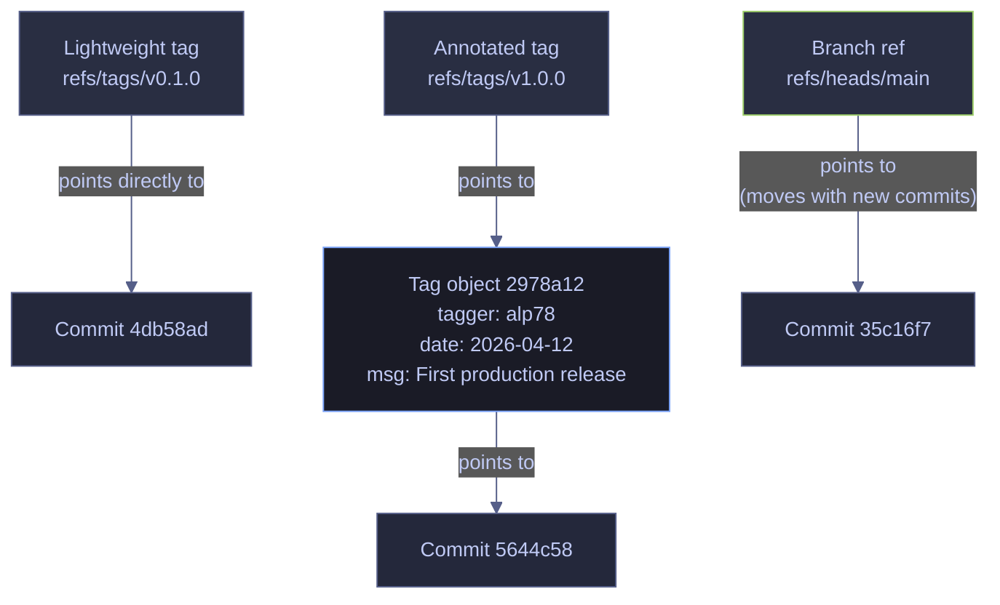
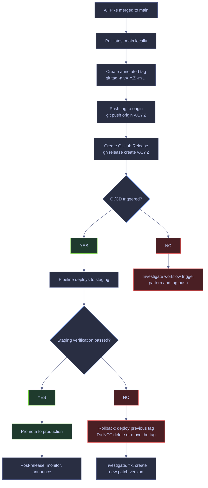
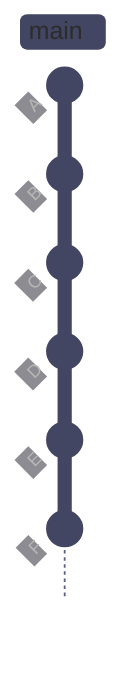

# Git Tagging and Releases

> [!quote]+
>
> "I was tired of everyone using version numbers in whatever way they wanted and knew we could do better if everyone agreed on what each part of a version number meant."

> [!abstract]- Summary
>
> Explains how immutable Git tags anchor release points, how semantic versioning and GitHub Releases turn those pointers into publishable artifacts, and how teams keep release metadata, automation, and governance consistent.
>
> **Tag model and core operations**
> - Defines lightweight, annotated, and signed tags, then covers creating, listing, filtering, pushing, and deleting tags without confusing them with branches or moving refs
> - Shows why tags are stable names for release commits and how that immutability shapes rollback, deployment, and reproducibility workflows
>
> **Versioning and release publication**
> - Connects semantic versioning to actual Git tag names, then layers GitHub Releases, release notes, release assets, and changelog structure on top of the underlying Git objects
> - Distinguishes what lives in Git itself versus what the hosting platform adds when a tag becomes a formal release artifact
>
> **Automation and governance**
> - Walks through release lifecycle stages, GitHub Actions integration, tag protection, immutability policy, and audit expectations for production release management
> - Explains where manual tagging is still appropriate and where automation should own tag creation, validation, and publication sequencing
>
> **Operations and safety**
> - Warnings: reusing tag names, unsigned or unaudited release points, mismatched SemVer intent, and automation pipelines that assume tags are mutable
> - Recommendations: prefer annotated or signed tags for real releases, keep release metadata deterministic, and protect high-value tag namespaces on the server side
> - Troubleshooting: tag push, deletion, release publication, versioning, and automation-trigger failures

> [!note]- Glossary
>
> **Tag**
> - A named reference that points to a specific commit SHA in the Git object database. Tags are immutable by convention — they should not be moved after creation.
> - It matters in this note because the workflows for tagging, release publication, versioning, and release governance ask you to choose or interpret this operation deliberately instead of treating nearby Git commands as interchangeable.
>
> > [!info] Operational nuance
> >
> > Treat this as a concrete Git object, state, or workflow term rather than as a loose synonym. The commands in the note behave differently depending on this exact meaning.
>
> ---
>
> **Lightweight tag**
> - A tag stored as a simple ref (a pointer to a commit SHA) with no additional metadata. Functionally identical to a branch that never moves.
> - It matters in this note because the workflows for tagging, release publication, versioning, and release governance ask you to choose or interpret this operation deliberately instead of treating nearby Git commands as interchangeable.
>
> > [!warning] Pointer semantics matter
> >
> > Git stores this as reference state rather than as a second copy of files. Many confusing behaviors come from moving refs while file contents stay the same.
>
> ---
>
> **Annotated tag**
> - A tag stored as a full Git object containing the tagger's name, email, date, and a message. The tag object points to the commit. Annotated tags are the standard for production releases.
> - It matters in this note because the workflows for tagging, release publication, versioning, and release governance ask you to choose or interpret this operation deliberately instead of treating nearby Git commands as interchangeable.
>
> > [!info] Operational nuance
> >
> > Treat this as a concrete Git object, state, or workflow term rather than as a loose synonym. The commands in the note behave differently depending on this exact meaning.
>
> ---
>
> **Signed tag**
> - An annotated tag that also includes a GPG or SSH cryptographic signature, allowing anyone to verify that the tag was created by the claimed author and has not been tampered with.
> - It matters in this note because the workflows for tagging, release publication, versioning, and release governance ask you to choose or interpret this operation deliberately instead of treating nearby Git commands as interchangeable.
>
> > [!info] Operational nuance
> >
> > Treat this as a concrete Git object, state, or workflow term rather than as a loose synonym. The commands in the note behave differently depending on this exact meaning.
>
> ---
>
> **Release**
> - A GitHub (or GitLab/Bitbucket) concept built on top of a Git tag. A release adds a title, release notes (markdown body), binary attachments, and metadata (draft, pre-release, latest) to a tag.
> - It matters in this note because the workflows for tagging, release publication, versioning, and release governance ask you to choose or interpret this operation deliberately instead of treating nearby Git commands as interchangeable.
>
> > [!info] Operational nuance
> >
> > Treat this as a concrete Git object, state, or workflow term rather than as a loose synonym. The commands in the note behave differently depending on this exact meaning.
>
> ---
>
> **Semantic version (SemVer)**
> - A versioning convention using the format `MAJOR.MINOR.PATCH` (e.g., `1.2.3`). Each part has a precise meaning: MAJOR for breaking changes, MINOR for backwards-compatible features, PATCH for backwards-compatible fixes.
> - It matters in this note because the workflows for tagging, release publication, versioning, and release governance read or change this part of Git's state directly, and misunderstanding it leads to the wrong command or the wrong safety assumption.
>
> > [!danger] Security boundary
> >
> > This term touches authentication, identity, or trust. Treat it as secret or policy material rather than as ordinary repository metadata.
>
> ---
>
> **Pre-release**
> - A version marked as not production-ready, indicated by a hyphen suffix: `v1.2.0-rc.1`, `v1.2.0-beta.3`. Pre-releases have lower precedence than their associated release.
> - It matters in this note because the workflows for tagging, release publication, versioning, and release governance ask you to choose or interpret this operation deliberately instead of treating nearby Git commands as interchangeable.
>
> > [!info] Operational nuance
> >
> > Treat this as a concrete Git object, state, or workflow term rather than as a loose synonym. The commands in the note behave differently depending on this exact meaning.
>
> ---
>
> **Build metadata**
> - Optional metadata appended with `+` that does not affect version precedence: `v1.2.0+build.42`. Ignored in version comparison.
> - It matters in this note because the workflows for tagging, release publication, versioning, and release governance read or change this part of Git's state directly, and misunderstanding it leads to the wrong command or the wrong safety assumption.
>
> > [!info] Policy layer
> >
> > This term usually belongs to shared repository policy or machine defaults. Fixing it locally can hide the real team-wide setting if you do not check the whole policy chain.
>
> ---
>
> **Hotfix release**
> - An urgent patch release that bypasses the normal release cycle to fix a critical bug in production. Typically a PATCH increment (e.g., `v1.1.0` → `v1.1.1`).
> - It matters in this note because the workflows for tagging, release publication, versioning, and release governance ask you to choose or interpret this operation deliberately instead of treating nearby Git commands as interchangeable.
>
> > [!danger] Security boundary
> >
> > This term touches authentication, identity, or trust. Treat it as secret or policy material rather than as ordinary repository metadata.
>
> ---
>
> **Rollback**
> - Reverting a production environment to a previously tagged release after a failed deployment. Rollback uses an existing tag — it does not create a new one.
> - It matters in this note because the workflows for tagging, release publication, versioning, and release governance read or change this part of Git's state directly, and misunderstanding it leads to the wrong command or the wrong safety assumption.
>
> > [!info] Operational nuance
> >
> > Treat this as a concrete Git object, state, or workflow term rather than as a loose synonym. The commands in the note behave differently depending on this exact meaning.
>
> ---
>
> **Changelog**
> - A human-readable log of notable changes for each release, typically generated from commit messages or PR titles between two tags.
> - It matters in this note because the workflows for tagging, release publication, versioning, and release governance read or change this part of Git's state directly, and misunderstanding it leads to the wrong command or the wrong safety assumption.
>
> > [!info] Operational nuance
> >
> > Treat this as a concrete Git object, state, or workflow term rather than as a loose synonym. The commands in the note behave differently depending on this exact meaning.
>
> ---
>
> **Release candidate (RC)**
> - A pre-release version considered feature-complete and ready for final testing: `v1.2.0-rc.1`. If no issues are found, the RC is promoted to the release.
> - It matters in this note because the workflows for tagging, release publication, versioning, and release governance ask you to choose or interpret this operation deliberately instead of treating nearby Git commands as interchangeable.
>
> > [!info] Operational nuance
> >
> > Treat this as a concrete Git object, state, or workflow term rather than as a loose synonym. The commands in the note behave differently depending on this exact meaning.
>
> ---
>
> **Tag object**
> - The Git object stored for an annotated tag. Contains the target commit SHA, tag name, tagger identity, date, message, and optional signature. Lightweight tags do not create a tag object.
> - It matters in this note because the workflows for tagging, release publication, versioning, and release governance ask you to choose or interpret this operation deliberately instead of treating nearby Git commands as interchangeable.
>
> > [!info] Operational nuance
> >
> > Treat this as a concrete Git object, state, or workflow term rather than as a loose synonym. The commands in the note behave differently depending on this exact meaning.
>
> ---
>
> **Ref**
> - A human-readable name (branch, tag, HEAD) that Git maps to a commit SHA. Tags are refs stored under `refs/tags/`.
> - It matters in this note because the workflows for tagging, release publication, versioning, and release governance read or change this part of Git's state directly, and misunderstanding it leads to the wrong command or the wrong safety assumption.
>
> > [!warning] Pointer semantics matter
> >
> > Git stores this as reference state rather than as a second copy of files. Many confusing behaviors come from moving refs while file contents stay the same.


## Conceptual Model

Before working with tags and releases, understand how they fit into the Git object model and how they differ from branches.

### Git | tags | how tags work in the object model

A Git repository stores four types of objects: blobs (file contents), trees (directory listings), commits (snapshots with parent pointers), and tags (annotated tag metadata). Every object is identified by a SHA-1 hash.

A **lightweight tag** is not a Git object — it is a ref stored as a file under `.git/refs/tags/` containing a single commit SHA. A **annotated tag** creates a new tag object in the database that points to the commit, and the ref points to the tag object.



*The lightweight tag v0.1.0 stores only a commit SHA — the ref file contains `4db58ad` and nothing else. The annotated tag v1.0.0 creates a separate tag object (`2978a12`) that stores the tagger identity, date, and message, then points to commit `5644c58`. The branch ref main also points to a commit, but unlike tags, it advances automatically when new commits are made. Tags are permanently anchored to their commit.*

You can verify the difference with `git cat-file -t`, which prints the object type:

*Print the object type of an annotated tag — returns `tag` (a tag object exists).*

```bash
git cat-file -t v1.0.0
```

```text
tag
```

*Print the object type of a lightweight tag — returns `commit` (no tag object, the ref points directly to the commit).*

```bash
git cat-file -t v0.1.0
```

```text
commit
```

### Git | tags vs branches | key differences

Tags and branches are both refs (named pointers to commits), but they serve fundamentally different purposes:

| Property | Branch | Tag |
|----------|--------|-----|
| **Moves with new commits** | Yes — `HEAD` advances the branch pointer on each commit | No — a tag always points to the same commit |
| **Purpose** | Active line of development | Historical marker for a specific point in time |
| **Stored as** | `refs/heads/<name>` | `refs/tags/<name>` |
| **Pushed by default** | Yes (`git push` pushes the current branch) | No (`git push` does not push tags — they must be pushed explicitly) |
| **Typical naming** | `main`, `feat/ohlcv-fetcher`, `hotfix/ttl-fix` | `v1.0.0`, `v1.2.0-rc.1` |
| **Can have metadata** | No | Yes (annotated tags store tagger, date, message, optional signature) |

### Git | tag types | lightweight vs annotated vs signed

Choosing the correct tag type depends on the use case. This decision matrix applies to all tagging scenarios:

| Scenario | Recommended type | Reason |
|----------|-----------------|--------|
| Production release | Annotated (`-a`) | Stores tagger identity, date, message — required for audit trails |
| Regulated environment (SOC 2, PCI DSS) | Signed (`-s`) | Cryptographic proof of who created the tag and that it has not been altered |
| Quick local bookmark | Lightweight | No metadata needed, easily created and deleted |
| CI/CD deployment trigger | Annotated (`-a`) | `git describe` and many CI tools only recognize annotated tags |
| Pre-release / release candidate | Annotated (`-a`) | Metadata documents the pre-release purpose and tagger |
| Temporary test marker | Lightweight | Disposable, no audit value |

> [!tip] Default to Annotated Tags
>
> When in doubt, use annotated tags. The metadata cost is negligible, and annotated tags work correctly with `git describe`, GitHub Releases, and CI/CD tag triggers. Lightweight tags silently fail in some of these contexts.

## Creating Tags

Tags are created locally and must be explicitly pushed to a remote. By default, `git tag` creates a lightweight tag on `HEAD`; use `-a` for an annotated tag with stored metadata.

### Git | tag | create and manage tags

`git tag` creates a named reference pointing to a specific commit. Tags are immutable by design — moving a tag after pushing it is a history-rewriting operation that should be avoided in any shared or audited environment.

#### Create a lightweight tag on HEAD

When you need a quick local marker for a commit — a temporary bookmark during development or debugging. It is typically triggered by you want to remember a specific commit without storing metadata. Local operation only. Creates a ref under `.git/refs/tags/`. Does not push to remote. Does not create a Git object. Mark the current `HEAD` with a named pointer that you can reference later (e.g., `git diff v0.1.0..HEAD`).

*Create a lightweight tag named `v0.1.0` pointing to the current HEAD commit.*

```bash
git tag v0.1.0
```

The `v` prefix and SemVer format are a community convention, not a Git requirement. Git accepts any string as a tag name, but `v` prefix + SemVer is the universal standard for release tags.

#### Create an annotated tag with a message

When marking a production release, milestone, or any commit that needs traceable metadata. It is typically triggered by A release is ready for publication, or a significant milestone commit needs permanent documentation. Local operation. Creates a tag object in the Git database containing tagger name, email, date, and message. The `-m` flag sets the message inline; without it, Git opens the configured editor. Create a permanent, metadata-rich marker suitable for production releases, audit trails, and CI/CD triggers.

*Create an annotated tag `v1.0.0` with a release message.*

```bash
git tag -a v1.0.0 -m "First production release — config validation, risk calculator, settings"
```

#### Tag a specific past commit

When a release should have been tagged at a prior commit but was not. It is typically triggered by retrospective tagging after confirming the correct commit SHA via `git log --oneline`. Local operation. The commit SHA must exist in the local repository. Use `git log --oneline` to locate the target. Apply a version tag to a historical commit without altering any existing history.

*Tag commit `06f13ca` retroactively as `v0.2.0`.*

```bash
git tag -a v0.2.0 -m "Add GICS sector mapper and market holiday calendar" 06f13ca
```

#### Inspect the full metadata of an annotated tag

When you need to verify who created a tag, when it was created, and what message was recorded. It is typically triggered by audit review, incident investigation, or release verification. Local read-only operation. For annotated tags, `git show` displays the tag object metadata followed by the tagged commit's diff. For lightweight tags, it shows only the commit. Confirm tagger identity, timestamp, and message before deploying from a tag.

*Display the tag object metadata and tagged commit details for `v1.0.0`.*

```bash
git show v1.0.0
```

```text
tag v1.0.0
Tagger: alp78 <alexper.recovery@gmail.com>
Date:   Sun Apr 12 18:26:47 2026 +0200

First production release — config validation, risk calculator, settings

commit 5644c583d6f512c56a38816666594f2ad3a347ed
Author: alp <37634801+alp78@users.noreply.github.com>
Date:   Sun Apr 12 17:47:07 2026 +0200

    feat: update settings for production (#8)

diff --git a/config/settings.py b/config/settings.py
index e722eb8..ae5a959 100644
--- a/config/settings.py
+++ b/config/settings.py
@@ -1,6 +1,7 @@
-"""Application settings."""
+"""Application settings for data pipeline."""

-DATABASE_URL = "postgresql://localhost:5432/market_data"
-CACHE_TTL = 300
-MAX_RETRIES = 3
-LOG_LEVEL = "INFO"
+DATABASE_URL = "postgresql://prod-db:5432/market_data"
+CACHE_TTL = 600
+MAX_RETRIES = 5
+LOG_LEVEL = "WARNING"
+BATCH_SIZE = 1000
```

The output has two parts. The first block (lines starting with `tag`, `Tagger`, `Date`) is the tag object metadata — this only exists for annotated tags. The second block is the commit that the tag points to, including its diff. For a lightweight tag, `git show` skips the tag object block and displays only the commit.

#### Inspect the raw tag object

When you need the machine-readable tag object contents without the commit diff. It is typically triggered by scripting, automation, or debugging tag storage internals. Local read-only operation. `git cat-file -p` prints the raw object contents. See the exact object SHA the tag targets, the object type, tagger identity, and message in a parseable format.

*Print the raw contents of the `v1.0.0` tag object.*

```bash
git cat-file -p v1.0.0
```

```text
object 5644c583d6f512c56a38816666594f2ad3a347ed
type commit
tag v1.0.0
tagger alp78 <alexper.recovery@gmail.com> 1776011207 +0200

First production release — config validation, risk calculator, settings
```

Each field: `object` is the commit SHA the tag points to. `type` confirms the target is a commit (tags can also point to trees or blobs, but release tags always point to commits). `tag` is the tag name. `tagger` is the identity and Unix timestamp. The message follows after a blank line.

| Flag | Syntax | Description |
|------|--------|-------------|
| `-a` | `git tag -a <name>` | Create an annotated tag (full Git object with metadata) |
| `-m` | `git tag -a <name> -m "msg"` | Set tag message inline (skips editor) |
| `-s` | `git tag -s <name>` | Create a GPG-signed annotated tag |
| `-u` | `git tag -u <key-id> <name>` | Sign with a specific GPG key |
| `-f` | `git tag -f <name>` | Force-overwrite an existing tag to current HEAD |
| `-d` | `git tag -d <name>` | Delete a local tag |
| `-v` | `git tag -v <name>` | Verify the GPG signature of a tag |
| `<commit>` | `git tag -a <name> <sha>` | Tag a specific past commit by SHA |
| `-e` | `git tag -a <name> -e` | Open the editor to compose the tag message |

## Listing and Filtering Tags

Tags are listed alphabetically by default. Use flags to filter by pattern, sort by version, display messages, or find tags that contain a specific commit.

### Git | tag | list, filter, and sort tags

`git tag` with no arguments prints all tag names. Use `-l` with a glob to filter by pattern, `-n` to show annotation messages, `--sort` to order by version, and `--contains` to find tags reachable from a specific commit.

#### List all tags

To see every tag in the repository. It is typically triggered by reviewing the release history or checking if a tag exists before creating one. Local read-only operation. Get a complete list of all tag names in alphabetical order.

*List all tags in the repository.*

```bash
git tag
```

```text
v0.1.0
v0.2.0
v0.3.0
v1.0.0
v1.1.0
v1.1.1
v1.2.0-rc.1
```

#### List tags with annotation messages

When you need to see what each release contains without running `git show` on each tag individually. It is typically triggered by release audit, changelog review, or team status check. Local read-only operation. For annotated tags, displays the first line of the tag message. For lightweight tags, displays the first line of the tagged commit message. Get a quick overview of what each release version contains.

*Display each tag name followed by the first line of its message.*

```bash
git tag -n
```

```text
v0.1.0          feat: add market hours utility for exchange scheduling
v0.2.0          Add GICS sector mapper and market holiday calendar
v0.3.0          Add dbt staging model and Airflow DAG
v1.0.0          First production release — config validation, risk calculator, settings
v1.1.0          Add cache tuning and conflict resolution
v1.1.1          Set log level to INFO for production
v1.2.0-rc.1     Release candidate for OHLCV fetcher
```

Notice that `v0.1.0` (a lightweight tag) shows the commit message, while the annotated tags show their tag messages.

#### Filter tags by glob pattern

When you only want to see tags matching a specific version range or prefix. It is typically triggered by finding all v1.x releases, or checking if a specific version already exists. Local read-only operation. The `-l` flag accepts standard glob patterns (`*`, `?`, `[...]`). Narrow the tag list to a specific range without manual scanning.

*List only tags starting with `v1.`.*

```bash
git tag -l "v1.*"
```

```text
v1.0.0
v1.1.0
v1.1.1
v1.2.0-rc.1
```

#### Sort tags by version in reverse order

When you need to find the latest release tag quickly. It is typically triggered by deployment scripts, CI/CD pipelines, or manual release verification. Local read-only operation. The `--sort=-version:refname` flag sorts by semantic version (respecting numeric ordering) in descending order. Without `version:refname`, tags sort lexicographically (where `v9.0.0` would sort after `v10.0.0`). Identify the most recent release version.

*List all tags sorted by version, latest first.*

```bash
git tag --sort=-version:refname
```

```text
v1.2.0-rc.1
v1.1.1
v1.1.0
v1.0.0
v0.3.0
v0.2.0
v0.1.0
```

#### Find tags that contain a specific commit

When you need to know which releases include a particular commit — for example, confirming a bug fix has been released. It is typically triggered by incident investigation ("which releases contain the fix for this bug?") or deployment verification. Local read-only operation. `--contains` lists every tag whose tagged commit is an ancestor of, or is, the specified commit. Trace which releases include a specific change.

*List all tags that contain commit `5644c58` (the v1.0.0 commit).*

```bash
git tag --contains 5644c58
```

```text
v1.0.0
v1.1.0
v1.1.1
```

All three tags are listed because `v1.1.0` and `v1.1.1` are tagged on commits that are descendants of `5644c58`.

#### Describe the current commit relative to tags

When you need a human-readable version string for the current `HEAD` — useful in build systems, Docker image tags, and deployment metadata. It is typically triggered by CI/CD build step, version stamping in artifacts, or identifying what version is currently checked out. Local read-only operation. `git describe --tags` finds the most recent tag reachable from `HEAD` and appends the number of additional commits and the abbreviated SHA if `HEAD` is not exactly at a tag. Generate a version string like `v1.1.1` (if on the tag) or `v1.1.1-3-gabcdef` (if 3 commits ahead of the tag).

*Describe the current HEAD relative to the nearest tag.*

```bash
git describe --tags
```

```text
v1.1.1
```

The output is exactly `v1.1.1` because `HEAD` is at the tagged commit. If there were 3 additional commits after the tag, the output would be `v1.1.1-3-g35c16f7` — where `3` is the commit count and `g35c16f7` is the abbreviated SHA with a `g` prefix (for "git").

> [!warning] git describe Ignores Lightweight Tags by Default
>
> Without `--tags`, `git describe` only considers annotated tags. If your repository uses lightweight tags for releases, `git describe` will skip them and potentially return a much older annotated tag or fail with "No names found."

> [!success] Always Use --tags or Annotated Tags
>
> Either pass `--tags` to include lightweight tags in the search, or — better — use annotated tags for all releases so `git describe` works without extra flags.

#### List tags with detailed metadata

When you need a structured view of all tags showing object types, SHAs, and dates — useful for auditing and scripting. It is typically triggered by release audit, CI/CD tag verification, or debugging tag types. Local read-only operation. `git for-each-ref` iterates over refs with custom format strings. Display tag name, object type (tag vs commit), object SHA, dereferenced commit SHA, and creation date in a single table.

> [!info]- Command Breakdown
>
> - `--format='...'` — custom output format using ref format placeholders
> - `%(refname:short)` — tag name without the `refs/tags/` prefix
> - `%(objecttype)` — `tag` for annotated tags, `commit` for lightweight tags
> - `%(objectname:short)` — abbreviated SHA of the ref target (tag object for annotated, commit for lightweight)
> - `%(*objectname:short)` — abbreviated SHA of the dereferenced object (the commit the tag points to, empty for lightweight)
> - `%(creatordate:short)` — creation date in `YYYY-MM-DD` format
> - `refs/tags` — only iterate over tag refs

*List all tags with their object type, SHA, target commit SHA, and creation date.*

```bash
git for-each-ref --format='%(refname:short) %(objecttype) %(objectname:short) %(*objectname:short) %(creatordate:short)' refs/tags
```

```text
v0.1.0 commit 4db58ad  2026-04-12
v0.2.0 tag 573d402 06f13ca 2026-04-12
v0.3.0 tag 0179355 0c2ffa5 2026-04-12
v1.0.0 tag 2978a12 5644c58 2026-04-12
v1.1.0 tag a2b78be cbcd74c 2026-04-12
v1.1.1 tag 73775c5 35c16f7 2026-04-12
v1.2.0-rc.1 tag 2908236 35c16f7 2026-04-12
```

Notice that `v0.1.0` has `objecttype` = `commit` and an empty dereferenced SHA — it is a lightweight tag pointing directly to the commit. All other tags have `objecttype` = `tag` and show both the tag object SHA and the target commit SHA.

| Flag | Syntax | Description |
|------|--------|-------------|
| `-l` | `git tag -l "v1.*"` | Filter tags by glob pattern |
| `-n` | `git tag -n` | Show first line of tag annotation alongside name |
| `-n<N>` | `git tag -n5` | Show first N lines of annotation per tag |
| `--sort` | `git tag --sort=-version:refname` | Sort by version in reverse order (latest first) |
| `--sort` | `git tag --sort=creatordate` | Sort by creation date (oldest first) |
| `--contains` | `git tag --contains <sha>` | List tags reachable from a specific commit |
| `--no-contains` | `git tag --no-contains <sha>` | List tags not reachable from a specific commit |
| `--merged` | `git tag --merged main` | List tags whose commits are ancestors of the named branch |
| `--points-at` | `git tag --points-at HEAD` | List tags that point exactly at the given commit |

## Pushing Tags

Tags exist only in the local repository until explicitly pushed. A standard `git push` does not include tags — this is by design, to prevent accidental publication of draft or test tags.

### Git | push | push tags to remote

Pushing a tag uploads the tag ref (and the tag object for annotated tags) to the remote. Once pushed to GitHub, the tag appears in the repository's Releases tab and can trigger GitHub Actions workflows configured with a tag pattern.

#### Push a single tag by name

When a release tag has been created and verified locally, and you are ready to publish it. It is typically triggered by release workflow step — after creating the annotated tag on `main` and confirming the correct commit. Network operation. Pushes one named tag to the specified remote. This is the preferred method for controlled release workflows — only the explicitly named tag is sent. Requires push access to the remote. Publish a specific release tag to GitHub without affecting any other local tags.

*Push the `v1.0.0` tag to origin.*

```bash
git push origin v1.0.0
```

```text
To https://github.com/alp78/git-lab.git
 * [new tag]         v1.0.0 -> v1.0.0
```

#### Push all local tags at once

When multiple tags need to be pushed and you have verified that no draft or test tags exist locally. It is typically triggered by initial repository setup, or after bulk-creating historical tags on a repository with no prior tags. Network operation. Pushes every local tag that does not yet exist on the remote. This includes lightweight tags, annotated tags, draft tags, and test tags — everything. Publish all unpushed tags in a single command.

*Push all local tags to origin.*

```bash
git push origin --tags
```

```text
To https://github.com/alp78/git-lab.git
 * [new tag]         v0.1.0 -> v0.1.0
 * [new tag]         v0.2.0 -> v0.2.0
 * [new tag]         v0.3.0 -> v0.3.0
 * [new tag]         v1.1.0 -> v1.1.0
 * [new tag]         v1.1.1 -> v1.1.1
```

> [!warning] --tags Pushes Everything Including Drafts
>
> `git push origin --tags` pushes every local tag — including work-in-progress tags, test markers, and tags you never intended to publish. Once pushed, tags are visible to all collaborators and may trigger CI/CD pipelines.

> [!success] Push Tags by Name for Controlled Releases
>
> Use `git push origin v1.0.0` to push only the specific release tag. Before using `--tags`, clean up local draft tags with `git tag -d <name>`. Alternatively, use `--follow-tags` (see below) which only pushes reachable annotated tags.

#### Push commits and reachable annotated tags together

When you want to push new commits and any annotated tags reachable from those commits in a single command — without pushing lightweight or unreachable tags. It is typically triggered by regular development push where you also want to publish annotated release tags without a separate push step. Network operation. `--follow-tags` is safer than `--tags` because it only pushes annotated tags that are reachable from the commits being pushed. Lightweight tags are ignored. Tags on commits not being pushed are ignored. Combine commit push and annotated tag push in one operation, reducing the chance of publishing stray tags.

*Push commits and any reachable annotated tags.*

```bash
git push --follow-tags
```

```text
Everything up-to-date
```

> [!tip] Make --follow-tags the Default
>
> To always push reachable annotated tags with your commits, set it globally:
> ```bash
> git config --global push.followTags true
> ```
> This eliminates the need to remember a separate `git push origin --tags` step after tagging releases.

| Flag | Syntax | Description |
|------|--------|-------------|
| `--tags` | `git push origin --tags` | Push all local tags not yet on the remote (annotated and lightweight) |
| `--follow-tags` | `git push --follow-tags` | Push commits and any reachable annotated tags (ignores lightweight tags) |
| `--delete` | `git push origin --delete <tag>` | Delete a tag from the remote |
| `:<tag>` | `git push origin :refs/tags/<tag>` | Alternative syntax for deleting a remote tag (pushes an empty ref) |

## Semantic Versioning

Git has no opinion on tag naming. The industry-standard convention is **Semantic Versioning (SemVer)**: `MAJOR.MINOR.PATCH`, typically prefixed with `v`.

### Git | semver | semantic versioning for release tags

Semantic versioning assigns meaning to each part of a version number. Teams that follow SemVer can communicate the nature of changes through the version number alone — consumers know whether an upgrade is safe without reading every commit.

The full specification is at [semver.org](https://semver.org). The core rules:

| Part | Increment when... | Example progression |
|------|--------------------|---------------------|
| **MAJOR** | You make incompatible API or schema changes — existing consumers break without modification | `v1.0.0` → `v2.0.0` |
| **MINOR** | You add functionality in a backwards-compatible manner — existing consumers continue working | `v1.0.0` → `v1.1.0` |
| **PATCH** | You make backwards-compatible bug fixes — no new functionality, no breaking changes | `v1.0.0` → `v1.0.1` |

#### Pre-release versions

A hyphen suffix marks a version as not yet production-ready. Pre-releases have lower precedence than the associated release version:

| Pre-release | Purpose |
|-------------|---------|
| `v1.2.0-alpha.1` | Early development, incomplete features, unstable |
| `v1.2.0-beta.1` | Feature-complete, undergoing testing |
| `v1.2.0-rc.1` | Release candidate — expected to become the release unless issues are found |

Pre-release identifiers are compared left to right: `v1.2.0-alpha.1` < `v1.2.0-beta.1` < `v1.2.0-rc.1` < `v1.2.0`.

#### Build metadata

Build metadata is appended with `+` and is ignored in version precedence. It exists for informational purposes only:

`v1.2.0+build.42`, `v1.2.0+20260412`, `v1.2.0-rc.1+ci.5678`

#### SemVer for data-engineering projects

Data platform and pipeline projects have domain-specific considerations for version increments:

| Change | SemVer part | Example |
|--------|-------------|---------|
| Breaking schema change (column rename, type change, partition key change) | MAJOR | `v1.0.0` → `v2.0.0` |
| New pipeline, new source, new model added | MINOR | `v1.0.0` → `v1.1.0` |
| Bug fix in transformation logic | PATCH | `v1.0.0` → `v1.0.1` |
| Airflow DAG schedule change (no schema change) | MINOR | `v1.1.0` → `v1.2.0` |
| dbt model refactor (same output schema) | PATCH | `v1.2.0` → `v1.2.1` |
| Terraform provider upgrade (breaking) | MAJOR | `v2.0.0` → `v3.0.0` |
| New Terraform resource (backwards-compatible) | MINOR | `v1.0.0` → `v1.1.0` |
| SQL migration adding a column (nullable, backwards-compatible) | MINOR | `v1.1.0` → `v1.2.0` |
| SQL migration adding NOT NULL constraint on existing column | MAJOR | `v1.0.0` → `v2.0.0` |

> [!question] When Is a Schema Change "Breaking"?
>
> A schema change is breaking if any existing consumer (dashboard, downstream pipeline, API client, report) would fail or produce incorrect results without modification. Adding a nullable column is backwards-compatible (MINOR). Renaming a column, changing a type, or removing a column is breaking (MAJOR) — even if you update all known consumers, external or undocumented consumers may break silently.

## GitHub Releases

A GitHub Release is a platform feature built on top of a Git tag. It adds a title, markdown release notes, binary file attachments, and metadata (draft, pre-release, latest) to an existing tag. Releases appear in the repository's Releases tab and provide a download page for each version.

### GitHub | releases | create and manage releases

GitHub Releases can be created through the web UI or the `gh` CLI. The CLI approach is preferred for reproducible, scriptable release workflows.

#### Create a release from an existing tag

After pushing an annotated tag to origin. It is typically triggered by release workflow — the tag exists on the remote and you are ready to publish the release with notes. Network operation. Requires `gh` CLI authenticated with push access. Creates a GitHub Release associated with the specified tag. The release appears in the Releases tab immediately. Publish a production release with descriptive release notes visible to all repository visitors.

> [!info]- Command Breakdown
>
> - `gh release create v1.0.0` — create a release for the tag `v1.0.0`
> - `--title "..."` — the release title displayed in the Releases tab
> - `--notes "..."` — the markdown body of the release notes

*Create a GitHub release for tag `v1.0.0` with release notes.*

```bash
gh release create v1.0.0 \
  --title "v1.0.0 — First Production Release" \
  --notes "## What's Changed

### Features
- Config validation utilities for pipeline settings
- Portfolio risk calculator with VaR and CVaR metrics
- Momentum signal module for trend detection
- Application settings for production deployment
- Terraform VPC for data platform infrastructure

### Infrastructure
- Airflow DAG for daily OHLCV ingestion
- dbt staging model for daily prices

**Full Changelog**: https://github.com/alp78/git-lab/commits/v1.0.0"
```

```text
https://github.com/alp78/git-lab/releases/tag/v1.0.0
```

The command returns the URL of the created release.

#### Create a pre-release

When publishing a release candidate or beta version that should not be marked as the latest stable release. It is typically triggered by release candidate (RC) is ready for testing but not yet approved for production. Network operation. The `--prerelease` flag marks the release with a "Pre-release" badge and prevents it from being shown as "Latest" in the Releases tab. Publish a version for testing while clearly signaling it is not production-ready.

*Create a pre-release for a release candidate tag.*

```bash
gh release create v1.2.0-rc.1 \
  --title "v1.2.0-rc.1 — Release Candidate" \
  --notes "Pre-release for testing OHLCV fetcher improvements" \
  --prerelease
```

```text
https://github.com/alp78/git-lab/releases/tag/v1.2.0-rc.1
```

#### List all releases

To review the current release history on GitHub. It is typically triggered by release audit, deployment planning, or verifying that a release was published correctly. Network operation. Reads from GitHub API. Get a summary of all published releases with their tags, titles, and dates.

*List all releases on the repository.*

```bash
gh release list
```

```text
v1.2.0-rc.1 — Release Candidate                Pre-release  v1.2.0-rc.1  2026-04-12T16:27:54Z
v1.1.1 — Production Logging Fix                 Latest       v1.1.1       2026-04-12T16:27:37Z
v1.1.0 — Cache Tuning and Conflict Resolution                v1.1.0       2026-04-12T16:27:31Z
v1.0.0 — First Production Release                            v1.0.0       2026-04-12T16:27:24Z
```

Each row shows the release title, status label (Latest, Pre-release, or blank), tag name, and publication timestamp.

#### View release details

When you need the full release notes, metadata, and attached assets for a specific release. It is typically triggered by deployment verification, incident response, or comparing release contents. Network operation. Reads the release object from GitHub API. Inspect the complete release record including author, dates, and release notes body.

*View the full details of the v1.0.0 release.*

```bash
gh release view v1.0.0
```

```text
title:      v1.0.0 — First Production Release
tag:        v1.0.0
draft:      false
prerelease: false
author:     alp78
created:    2026-04-12T16:26:47Z
published:  2026-04-12T16:27:24Z
url:        https://github.com/alp78/git-lab/releases/tag/v1.0.0
--
## What's Changed

### Features
- Config validation utilities for pipeline settings
- Portfolio risk calculator with VaR and CVaR metrics
- Momentum signal module for trend detection
- Application settings for production deployment
- Terraform VPC for data platform infrastructure

### Infrastructure
- Airflow DAG for daily OHLCV ingestion
- dbt staging model for daily prices

**Full Changelog**: https://github.com/alp78/git-lab/commits/v1.0.0
```

#### View commits between two releases

When generating a changelog or understanding exactly what changed between two versions. It is typically triggered by writing release notes, reviewing a release scope, or investigating when a change was introduced. Local read-only operation. The `tag1..tag2` range syntax shows all commits reachable from `tag2` but not from `tag1`. List the exact commits that a release version adds compared to its predecessor.

*Show all commits between v1.0.0 and v1.1.0.*

```bash
git log --oneline v1.0.0..v1.1.0
```

```text
cbcd74c merge: resolve config.py conflict — keep reduced TTL and connection limit, add retry settings
2eff67c fix: reduce cache TTL and add connection limit
eadb609 feat: update cache TTL and add retry settings
```

*Show all commits between v1.1.0 and v1.1.1.*

```bash
git log --oneline v1.1.0..v1.1.1
```

```text
35c16f7 ops: set log level to INFO for production
```

The single commit confirms that v1.1.1 is a minimal hotfix release containing only the logging change.

| Flag / Subcommand | Syntax | Description |
|------|--------|-------------|
| `create` | `gh release create <tag>` | Create a new release for the specified tag |
| `--title` | `gh release create <tag> --title "..."` | Set the release title |
| `--notes` | `gh release create <tag> --notes "..."` | Set the release notes body (markdown) |
| `--notes-file` | `gh release create <tag> --notes-file CHANGELOG.md` | Read release notes from a file |
| `--generate-notes` | `gh release create <tag> --generate-notes` | Auto-generate release notes from merged PRs and commits |
| `--prerelease` | `gh release create <tag> --prerelease` | Mark the release as a pre-release |
| `--draft` | `gh release create <tag> --draft` | Create the release as a draft (not published) |
| `--latest` | `gh release create <tag> --latest=false` | Override whether this release is marked as latest |
| `--target` | `gh release create <tag> --target main` | Specify the target branch (if the tag does not exist yet) |
| `list` | `gh release list` | List all releases |
| `view` | `gh release view <tag>` | View details of a specific release |
| `delete` | `gh release delete <tag>` | Delete a release (tag remains) |
| `edit` | `gh release edit <tag>` | Modify an existing release |
| `upload` | `gh release upload <tag> <file>` | Upload assets (binaries, artifacts) to a release |

## Release Lifecycle

A production release follows a structured workflow from final PR merge through tag creation, GitHub release, deployment trigger, verification, and potential rollback.

### Git / GitHub | releases | production release workflow



*The release lifecycle starts with all feature PRs merged to main. The operator pulls locally, creates an annotated tag, pushes the tag (which triggers CI/CD via a tag pattern), creates the GitHub Release with notes, verifies in staging, then promotes to production. If staging fails, the operator rolls back by deploying the previous tag — the failed tag is never deleted or moved, preserving the audit trail. A new patch version is created for the fix.*

#### Step 1 — Switch to main and pull latest

At the start of every release. It is typically triggered by all planned PRs for this release have been merged. Local operation. Ensures you are tagging the correct, up-to-date commit. Tagging a stale local copy misses commits merged by teammates. Guarantee the tag points to the latest `main` HEAD including all merged PRs.

*Switch to main and pull the latest commits.*

```bash
git checkout main && git pull
```

#### Step 2 — Create the annotated release tag

After confirming `main` is up to date and the commit log matches expectations. It is typically triggered by the release scope is finalized and ready for deployment. Local operation. Creates a tag object with metadata. Mark the exact commit that constitutes this release.

*Create an annotated tag for v1.1.1 with a descriptive message.*

```bash
git tag -a v1.1.1 -m "Set log level to INFO for production"
```

#### Step 3 — Push the tag to origin

After creating the tag locally and verifying it with `git show <tag>`. It is typically triggered by tag verified, ready to publish. Network operation. Once pushed, the tag is visible to all collaborators and may trigger CI/CD. Publish the release tag to GitHub.

*Push the v1.1.1 tag to the remote.*

```bash
git push origin v1.1.1
```

#### Step 4 — Create the GitHub Release

After the tag is visible on GitHub. It is typically triggered by tag push confirmed. Network operation via `gh` CLI. Attach release notes, metadata, and optional binary assets to the tag.

*Create the GitHub Release for v1.1.1.*

```bash
gh release create v1.1.1 \
  --title "v1.1.1 — Production Logging Fix" \
  --notes "## What's Changed

### Fixes
- Set log level to INFO for production (was WARNING)

**Full Changelog**: https://github.com/alp78/git-lab/compare/v1.1.0...v1.1.1"
```



*Commits A through D represent the work leading to v1.0.0. Commit E adds cache tuning and conflict resolution (tagged v1.1.0). Commit F sets the log level to INFO for production (tagged v1.1.1). Each tag permanently marks its commit — the branch pointer (main) continues to advance, but the tags remain fixed on their respective commits. Pushing v1.1.1 to origin triggers CI/CD deployment.*

### Git / GitHub | releases | emergency hotfix workflow

When a critical bug is found in production, the hotfix workflow bypasses the normal feature-branch cadence. The fix is committed directly to main (or a short-lived hotfix branch), tagged with the next PATCH version, and deployed immediately.

> [!todo] Emergency Hotfix Procedure
>
> 1. Identify the currently deployed tag: `git describe --tags`
> 2. Pull latest main: `git checkout main && git pull`
> 3. Apply the fix (direct commit or short-lived `hotfix/` branch merged immediately)
> 4. Tag with the next PATCH version: `git tag -a v1.1.2 -m "Hotfix: <description>"`
> 5. Push the tag: `git push origin v1.1.2`
> 6. Create the release: `gh release create v1.1.2 --title "v1.1.2 — Hotfix" --notes "..."`
> 7. Verify deployment in staging, then promote to production
> 8. Announce the hotfix in the team channel

### Git / GitHub | releases | failed-release rollback

If a release fails verification in staging or production, roll back to the previous known-good tag. Never delete or move the failed tag — it is part of the audit trail.

> [!danger] Never Delete a Failed Release Tag
>
> Deleting a published tag breaks the audit trail. Anyone who deployed from or referenced that tag will have a dangling reference. The tag documents that the release existed and failed — this is valuable information for incident reviews.

> [!success] Create a New Patch Version for the Fix
>
> After rolling back to the previous tag, fix the issue, and create a new PATCH version (e.g., `v1.2.1` to fix a problem in `v1.2.0`). The failed `v1.2.0` tag remains in history, and the new `v1.2.1` tag documents the correction.

> [!todo] Rollback Procedure
>
> 1. Identify the last known-good tag: review `gh release list` or `git tag --sort=-version:refname`
> 2. Deploy the known-good tag (e.g., redeploy `v1.1.1`)
> 3. Announce the rollback in the team channel
> 4. Investigate and fix the issue on a new branch
> 5. Merge the fix, create a new PATCH tag, and follow the normal release workflow

## Integration with GitHub Actions

Tags are a common CI/CD trigger. When you push a tag matching a configured pattern, a GitHub Actions workflow fires automatically.

### GitHub | Actions | trigger workflows on tag push

A workflow `on.push.tags` filter triggers the pipeline when a pushed ref matches the pattern. The most common pattern is `v*`, which matches any tag starting with `v`.

#### Tag-triggered workflow configuration

When setting up CI/CD for a repository that uses tag-based releases. It is typically triggered by repository setup or release automation design. Edit the workflow YAML file in `.github/workflows/`. The `on.push.tags` trigger fires only when a matching tag is pushed to the remote — local tag creation does not trigger it. Automate build, test, and deployment on every release tag push.

*Add this trigger block to a workflow YAML to fire on any tag starting with `v`.*

```yaml
on:
  push:
    tags:
      - 'v*'
```

This matches `v1.0.0`, `v2.3.1`, `v1.0.0-rc.1`, and any other tag with a `v` prefix. To match only stable releases (no pre-releases), use a more specific pattern:

```yaml
on:
  push:
    tags:
      - 'v[0-9]+.[0-9]+.[0-9]+'
```

> [!tip] Access the Tag Name in a Workflow
>
> Inside a GitHub Actions workflow triggered by a tag push, the tag name is available as:
> ```yaml
> ${{ github.ref_name }}    # e.g., "v1.0.0"
> ${{ github.ref }}         # e.g., "refs/tags/v1.0.0"
> ```
> Use `github.ref_name` to stamp Docker images, artifact names, or deployment metadata with the version.

> [!warning] Pre-Release Tags Also Match `v*`
>
> A pattern like `v*` matches both stable releases (`v1.0.0`) and pre-releases (`v1.0.0-rc.1`). If your production deployment workflow should not trigger on pre-releases, add a job-level condition:
> ```yaml
> jobs:
>   deploy:
>     if: "!contains(github.ref_name, '-')"
> ```

> [!success] Filter Pre-Releases with a Job Condition
>
> The condition `!contains(github.ref_name, '-')` evaluates to `true` for `v1.0.0` and `false` for `v1.0.0-rc.1`, because pre-release tags always contain a hyphen after the version number. This ensures the deploy job runs only for stable releases.

## Tag Governance and Immutability

In audit-sensitive environments (financial services, regulated industries, SOC 2, PCI DSS), tags are not just version markers — they are evidence that a specific commit was reviewed, approved, and deployed. Tag governance rules protect this audit trail.

### Git | tags | immutability policy and audit considerations

#### Tags are append-only in production

Once a tag has been pushed to a shared remote, it should be treated as immutable. Moving, deleting, or replacing a published tag has cascading consequences:

- **CI/CD pipelines** that deployed from the original tag now reference different code than what was actually deployed
- **Audit logs** that recorded the tag name no longer correspond to the original commit
- **Collaborators** who fetched the tag have a stale local copy that silently differs from the new remote tag
- **Container registries** and artifact stores tagged with the version now have mismatched provenance

> [!danger] Never Move a Published Tag
>
> Re-tagging an existing name (delete + recreate) changes what commit a version points to. Anyone who cached or deployed from the original tag is now running code different from what the tag implies. If a release was tagged on the wrong commit, create a new PATCH version instead.

> [!success] Create a Corrective Patch Version
>
> If `v1.2.0` was tagged on the wrong commit, do not delete and recreate it. Instead, create `v1.2.1` pointing to the correct commit. The original `v1.2.0` remains in history as evidence of the error, and `v1.2.1` documents the correction.

#### Signed tags for regulated environments

In environments requiring cryptographic proof of release authorship (SOC 2 access controls, PCI DSS change management, HIPAA audit trails), use signed tags. A signed tag includes a GPG or SSH signature that anyone can verify.

*Create a GPG-signed tag.*

```bash
git tag -s v1.3.0 -m "Signed production release"
```

*Verify a signed tag.*

```bash
git tag -v v1.0.0
```

```text
object 5644c583d6f512c56a38816666594f2ad3a347ed
type commit
tag v1.0.0
tagger alp78 <alexper.recovery@gmail.com> 1776011207 +0200

First production release — config validation, risk calculator, settings
error: no signature found
```

The `error: no signature found` message confirms that `v1.0.0` was created as an unsigned annotated tag. If the tag were signed, the output would show the GPG signature and verification status.

> [!tip] Configure Git to Sign Tags by Default
>
> To always create signed tags without remembering the `-s` flag:
> ```bash
> git config --global tag.gpgSign true
> ```
> This requires a GPG key configured with `git config --global user.signingkey <key-id>`.

#### Release notes best practices

Release notes serve three audiences: operators who deploy, developers who consume the API or schema, and auditors who review change history. Good release notes include:

| Section | Content | Audience |
|---------|---------|----------|
| **What's Changed** | Grouped by type: Features, Fixes, Breaking Changes | Developers |
| **Migration Guide** | Steps to handle breaking changes (schema migration, config update) | Operators |
| **Known Issues** | Open bugs that shipped with this release | Developers, Operators |
| **Deployment Notes** | Prerequisites, environment variables, infrastructure changes | Operators |
| **Full Changelog** | Link to the commit comparison on GitHub | Auditors |

## Deleting Tags

Tags should rarely be deleted once pushed. Deleting a published tag breaks reproducibility for anyone who deployed from it and cannot be cleanly undone for collaborators who have already fetched it. If a release tag pointed to the wrong commit, create a new patch version instead.

### Git | tag -d / push --delete | remove tags

`git tag -d` removes a tag from the local repository only. To also remove it from the remote, a separate `git push --delete` is required. Neither operation removes the underlying commit — only the named reference is deleted.

#### Delete a local tag

When a local draft or test tag is no longer needed and should be cleaned up before using `git push --tags`. It is typically triggered by local cleanup before a release push, or removing a mistakenly created tag that has not been pushed. Local operation only. Does not affect the remote. The tagged commit is not deleted — only the named ref. Remove a local tag reference that is no longer needed.

*Delete the local tag `v1.0.0-draft`.*

```bash
git tag -d v1.0.0-draft
```

```text
Deleted tag 'v1.0.0-draft' (was 35c16f7)
```

The output confirms the tag name and the commit SHA it pointed to. The commit `35c16f7` still exists in the repository.

#### Delete a remote tag

When a tag was accidentally pushed and must be removed from the remote — only for unpublished or draft tags. It is typically triggered by A test tag or pre-release was accidentally pushed and is confusing consumers or triggering unwanted CI/CD. Network operation. Removes the tag from the remote. Collaborators who already fetched the tag retain it locally until they run `git fetch --prune --tags`. Coordinate with the team before deleting. Remove a mistakenly pushed tag from the remote.

*Delete the tag `v0.0.1-test` from origin.*

```bash
git push origin --delete v0.0.1-test
```

```text
To https://github.com/alp78/git-lab.git
 - [deleted]         v0.0.1-test
```

> [!warning] Deleting Pushed Tags Affects Collaborators
>
> If collaborators have already fetched a tag, deleting it from the remote does not remove it from their local repos. They retain a stale tag that silently points to a commit with no corresponding remote tag.

> [!success] Coordinate Team-Wide Tag Cleanup
>
> Before running `git push origin --delete <tag>`, announce in the team channel. After deletion, teammates run:
> ```bash
> git fetch --prune --tags
> ```
> This removes any local tags that no longer exist on the remote.

| Flag | Syntax | Description |
|------|--------|-------------|
| `-d` | `git tag -d <name>` | Delete a local tag |
| `--delete` | `git push origin --delete <name>` | Delete a tag from the remote |

## Git Tagging and Releases Troubleshooting

Common tagging and release issues with diagnosis and resolution.

| Problem | Cause | Resolution |
|---------|-------|------------|
| `git describe` returns old tag or fails | Only lightweight tags exist; `git describe` defaults to annotated tags | Use `git describe --tags` or switch to annotated tags |
| Tag push rejected ("already exists") | Tag name already exists on the remote | Do not force-push. Create a new version instead (e.g., `v1.0.1`) |
| CI/CD did not trigger on tag push | Tag pattern in workflow YAML does not match the pushed tag | Verify the `on.push.tags` pattern matches (e.g., `v*` matches `v1.0.0`) |
| `git push` did not include tags | Tags are not pushed by default with `git push` | Use `git push origin <tag>` or `git push --follow-tags` |
| Collaborator has a stale tag after remote deletion | `git fetch` does not prune tags by default | Run `git fetch --prune --tags` or `git fetch -p -t` |
| `error: no signature found` on `git tag -v` | Tag was not signed (created with `-a` instead of `-s`) | Expected for unsigned tags. Use `-s` to create signed tags |
| Tag on wrong commit | Tag was created before pulling latest, or on the wrong branch | Do not move the tag. Create a new PATCH version on the correct commit |
| GitHub Release shows "Draft" | Release was created with `--draft` flag | Edit the release: `gh release edit <tag> --draft=false` |
| Pre-release deployed to production | CI/CD workflow does not filter pre-release tags | Add job condition: `if: "!contains(github.ref_name, '-')"` |
| `--follow-tags` did not push a lightweight tag | `--follow-tags` only pushes annotated tags | Push lightweight tags individually or use `--tags`. Better: switch to annotated tags |

## Operating Guidance

1. **Use annotated tags for all releases.** Lightweight tags are for temporary local bookmarks only.
2. **Push tags by name, not with `--tags`.** This prevents accidental publication of draft or test tags.
3. **Follow SemVer strictly.** Breaking changes increment MAJOR, new features increment MINOR, bug fixes increment PATCH.
4. **Never move or delete a published tag.** Create a new PATCH version for corrections.
5. **Always tag on `main` after pulling latest.** Tagging a stale local copy or a feature branch creates incorrect release markers.
6. **Write release notes for every production release.** Include what changed, migration steps, and known issues.
7. **Use `--follow-tags` or `push.followTags=true` for safer default behavior.** This pushes reachable annotated tags with commits.
8. **Sign tags in regulated environments.** Configure `tag.gpgSign=true` for automatic signing.
9. **Use `git describe --tags` in CI/CD** to generate version strings for build artifacts.
10. **Treat the Releases tab as the changelog.** Use `--generate-notes` or structured release notes to document every version.

## Quick Reference

| Goal | Command |
|------|---------|
| Create lightweight tag | `git tag v1.0.0` |
| Create annotated tag | `git tag -a v1.0.0 -m "Release message"` |
| Create signed tag | `git tag -s v1.0.0 -m "Signed release"` |
| Tag a past commit | `git tag -a v0.9.0 -m "msg" abc1234` |
| List all tags | `git tag` |
| List tags with messages | `git tag -n` |
| Filter tags by pattern | `git tag -l "v1.*"` |
| Sort tags by version (latest first) | `git tag --sort=-version:refname` |
| Find tags containing a commit | `git tag --contains <sha>` |
| Describe HEAD relative to tags | `git describe --tags` |
| Inspect tag metadata | `git show v1.0.0` |
| Inspect raw tag object | `git cat-file -p v1.0.0` |
| Check tag object type | `git cat-file -t v1.0.0` |
| List tags with metadata | `git for-each-ref --format='...' refs/tags` |
| Push one tag | `git push origin v1.0.0` |
| Push all tags | `git push origin --tags` |
| Push commits + reachable annotated tags | `git push --follow-tags` |
| Delete local tag | `git tag -d v1.0.0` |
| Delete remote tag | `git push origin --delete v1.0.0` |
| Prune stale remote tags | `git fetch --prune --tags` |
| Verify signed tag | `git tag -v v1.0.0` |
| Commits between two tags | `git log --oneline v1.0.0..v1.1.0` |
| Create GitHub release | `gh release create v1.0.0 --title "..." --notes "..."` |
| Create pre-release | `gh release create v1.0.0-rc.1 --prerelease` |
| List releases | `gh release list` |
| View release details | `gh release view v1.0.0` |
| Auto-generate release notes | `gh release create v1.0.0 --generate-notes` |
| Upload release asset | `gh release upload v1.0.0 artifact.tar.gz` |

## Related

- [git-daily-workflow](https://alp78.github.io/elysium/08-Git/02-git-daily-workflow) — the commit workflow that precedes tagging a release
- [git-history-and-inspection](https://alp78.github.io/elysium/08-Git/08-git-history-and-inspection) — `git show`, `git log` to find the commit to tag
- [pull-requests-and-code-review](https://alp78.github.io/elysium/08-Git/06-pull-requests-and-code-review) — merging the PR before tagging the release
