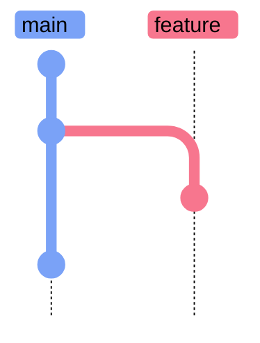
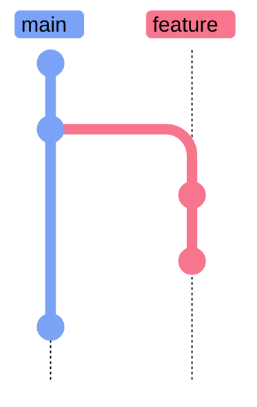
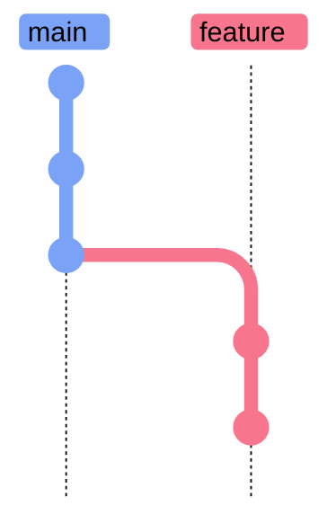
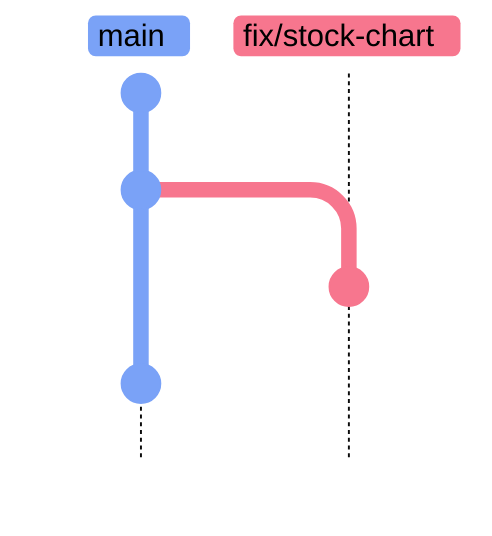
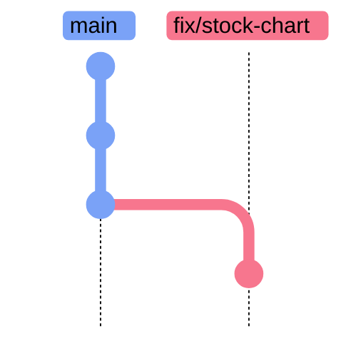

# Git Merge Conflict Resolution

> [!quote]
> "You can disagree with me as much as you want, but during this talk, by definition, anybody who disagrees is stupid and ugly."
>
> — **Linus Torvalds**, Git mailing list

Merge conflicts occur when two branches modify the same lines in the same file and Git cannot automatically decide which version to keep. They arise during `git merge`, `git rebase`, `git cherry-pick`, and `git stash pop`. This note explains conflict marker syntax, the step-by-step resolution process, tooling options, and prevention strategies.

## What a Merge Conflict Looks Like

A conflict arises when two branches diverge from a common ancestor and each modifies the same region of a file. Git detects the overlap at merge time and cannot decide which version to keep without your input.



*Figure: Both branches modified the same code after diverging at B. Commit C changed start_date on the feature branch while D changed it on main. Git cannot decide which version to keep.*

When Git encounters a conflict, it edits the affected file and inserts conflict markers:

```
<<<<<<< HEAD
start_date = "2024-01-01"
=======
start_date = "2023-06-01"
>>>>>>> feat/new-history
```

### Conflict Marker Syntax

Conflict markers divide the file into two competing versions. Understanding which section belongs to which branch is the first step before editing.

#### Merge conflict markers — reading HEAD vs incoming

| Marker | Meaning |
|--------|---------|
| `<<<<<<< HEAD` | Start of your current branch's version |
| `=======` | Divider between the two versions |
| `>>>>>>> feat/new-history` | End of the incoming branch's version |

Everything between `<<<<<<< HEAD` and `=======` is what your current branch (HEAD) has. Everything between `=======` and `>>>>>>> feat/new-history` is what the incoming branch has. Git is saying: "These two versions disagree. You decide which one to keep."

> [!info] Conflict Marker Labels Vary
>
> The marker labels change depending on the operation:
> - **`git merge`**: `HEAD` = your branch, `>>>>>>> branch-name` = the branch being merged in
> - **`git rebase`**: `HEAD` = the target branch (main), `>>>>>>> commit-sha (message)` = your commit being replayed
> - **`git stash pop`**: `Updated upstream` = the branch you switched to, `Stashed changes` = your stashed work

### Step-by-Step Merge Conflict Resolution Process

1. Identify conflicted files:

   ```bash
   git status
   ```

   ```text
   On branch main
   You have unmerged paths.

   Unmerged paths:
     (use "git add <file>..." to mark resolution)
           both modified:   config/settings.py

   no changes added to commit (use "git add" and/or "git commit -a")
   ```

   Files with conflicts are listed under "Unmerged paths" with `both modified`.

2. Open each conflicted file in your editor.

3. Find every `<<<<<<<` / `=======` / `>>>>>>>` block.

4. Edit the file to the correct final version — remove the markers and keep the desired code. You may keep one side, the other side, or combine both.

5. Stage each resolved file:

   ```bash
   git add filename.py
   ```

6. Complete the merge:

   ```bash
   git commit
   ```

   ```text
   [main 3a1b2c4] Merge branch 'feat/new-history'
   ```

   Git will pre-populate the commit message with merge information. You can edit it or accept the default.

> [!warning] Remove All Conflict Markers
>
> Do not leave conflict markers in your code.
> If you stage a file that still contains `<<<<<<<` markers, Git will accept the commit — but the file will be broken. Always verify the file is clean before running `git add`.

> [!warning] Binary files cannot be text-merged
>
> Merge conflicts in binary files (images, Parquet, compiled assets) show as "CONFLICT (binary)" with no conflict markers to edit. You must pick one entire version: `git checkout --ours file` or `git checkout --theirs file`, then `git add file`.

> [!success] Resolve Binary Conflicts
>
> Pick the correct version explicitly, then stage it:
> ```bash
> git checkout --ours path/to/file.parquet
> git add path/to/file.parquet
> ```

## Aborting a Merge

When conflicts are too complex to resolve immediately, or when you realize mid-way that your merge strategy was wrong, you can cancel the entire operation and return to a clean state.

### git merge --abort

`git merge --abort` cancels the in-progress merge and restores your working directory and index to the exact state they were in before you ran `git merge`.

#### git merge --abort — cancel merge and restore pre-merge state

```bash
git merge --abort
```

- `--abort` — cancel the in-progress merge entirely, restore the working directory to its pre-merge state

Use this when you start a merge, find the conflicts too complex to resolve now, and want to step back and reconsider your approach (e.g., rebase instead of merge, or coordinate with the teammate who made the conflicting changes).

> [!tip] Abort is always safe
>
> `git merge --abort` is completely safe. It restores your working directory exactly to where it was before you ran `git merge`. No work is lost.

## Visual Merge Tools

Text-based conflict marker editing works for simple conflicts. For complex multi-file conflicts, a visual merge tool presents both versions side by side and lets you accept or combine changes interactively.

### git mergetool

`git mergetool` opens the merge editor configured in your git config for each conflicted file in sequence. Without explicit configuration, Git attempts to open any available GUI diff tool on your system.

#### git mergetool — open configured GUI for all conflicted files

```bash
git mergetool
```

- `mergetool` — opens the configured GUI tool for side-by-side conflict resolution across all conflicted files

### VS Code Integration

VS Code has excellent built-in merge conflict resolution. When a file with conflict markers is open, VS Code displays inline action buttons above each conflict block:

- **Accept Current Change** — keep the HEAD (your branch) version
- **Accept Incoming Change** — keep the incoming branch's version
- **Accept Both Changes** — append both versions sequentially
- **Compare Changes** — open a diff view

To configure VS Code as the default merge tool globally:

```bash
git config --global merge.tool vscode
```

```bash
git config --global mergetool.vscode.cmd 'code --wait $MERGED'
```

After this, `git mergetool` opens VS Code for every conflicted file.

## Rebase Conflict Resolution

Conflicts during `git rebase` work the same way mechanically, but the workflow continues differently than a merge. Git pauses the rebase at each conflicting commit and waits for you to resolve before replaying the next one. Each commit in your branch is applied on top of the new base individually — so conflicts may occur multiple times, once per commit.

> [!danger] Never Rebase Published Branches
>
> Rebasing rewrites commit SHAs. If you rebase a branch that teammates have already pulled, their local history will diverge from the force-pushed remote — causing confusion and potential data loss.

> [!success] Safe Rebase Pattern
>
> Only rebase commits that have not been pushed to a shared remote, or on personal feature branches where you are the sole contributor. For shared branches, use `git merge` to incorporate upstream changes without rewriting history. See [merge-vs-rebase-vs-squash](https://alp78.github.io/elysium/08-Git/merge-vs-rebase-vs-squash) for strategy guidance.

**Before rebase:**



*Figure: Feature branch diverged from main at B. Commits C and D are on feature while E advanced main.*

**After rebase:**



*Figure: After rebase — C and D replayed as C' and D' on top of E with new SHAs. Any commit conflicting with E pauses the rebase for manual resolution.*

Commits C and D are replayed as C′ and D′ with new SHAs on top of E. Any commit that conflicts with E pauses the rebase for manual resolution.

### git rebase --continue

After resolving conflicts in the paused commit, stage the resolved file and resume replaying the remaining commits onto the base.

#### git rebase --continue — stage resolved file and resume the rebase

```bash
git add filename.py
```

```bash
git rebase --continue
```

- `git add` — mark the file as resolved (same as in merge resolution)
- `git rebase --continue` — apply the resolution and replay the next commit in the sequence

### Rebase Escape Hatches

When a rebase cannot proceed as planned, use these commands to abort the operation or skip the current conflicting commit.

#### git rebase --abort — cancel the entire rebase and restore pre-rebase state

```bash
git rebase --abort
```

#### git rebase --skip — discard the current commit and continue replaying the rest

```bash
git rebase --skip
```

Use `--skip` only when the conflicting commit is entirely redundant — its changes were already incorporated into the base branch and are no longer needed. `--skip` permanently discards that commit's changes.

> [!warning] Rebase vs Merge Abort
>
> Both abort commands are safe and restore your prior state. Remember: after a `git rebase`, commit SHAs change — you will need to `git push --force-with-lease` to update the remote. See [git-remote-management](https://alp78.github.io/elysium/08-Git/git-remote-management) for safe force-push usage.

## Real-World Case Study: Rebase a PR After Another PR Was Merged

This scenario happens regularly: you open a PR, a teammate's PR gets merged into `main` while yours is open, and now GitHub blocks your squash-merge with "the merge commit cannot be cleanly created."

### The Situation

1. You are on a feature branch (`fix/stock-chart-missing-latest-date`) with committed changes
2. A teammate's PR (`perf/bulk-sql-inserts`) was merged into `main` while you were working
3. Your branch now diverges from `main` and the PR is unmergeable

### Step 1: Stash Uncommitted Changes and Switch Branches

```bash
git stash
```

```text
Saved working directory and index state WIP on main: abc1234 previous commit message
```

```bash
git checkout fix/stock-chart-missing-latest-date
```

```text
Switched to branch 'fix/stock-chart-missing-latest-date'
```

```bash
git stash pop
```

```text
Auto-merging ingestion/loaders/load_ohlcv.py
CONFLICT (content): Merge conflict in ingestion/loaders/load_ohlcv.py
The stash entry is kept in case you need it again.
```

- `git stash` — shelve all uncommitted changes (staged and unstaged) into temporary storage
- `git checkout fix/stock-chart-missing-latest-date` — switch to the feature branch
- `git stash pop` — re-apply the shelved changes onto the new branch

> [!warning] Stash Pop Can Conflict
>
> If the stashed changes touch the same lines that differ between branches, `git stash pop` will produce merge conflicts. This is expected — the stash is still preserved (not dropped) when conflicts occur, so your work is safe.

> [!success] Recover from Stash Pop Conflicts
>
> Resolve the conflict markers normally, then drop the stash manually — it was not auto-dropped because the pop did not complete cleanly:
> ```bash
> git stash drop
> ```

### Step 2: Resolve Stash Pop Conflicts

When `git stash pop` produces conflicts, the markers label the sides differently:

```
<<<<<<< Updated upstream     ← what's on the current branch
            rows = []
            skipped = 0
=======                      ← separator
            inserts = []
            updates = []
>>>>>>> Stashed changes      ← your stashed work
```

#### Resolution approach
- Open each conflicted file
- Remove the conflict markers and keep the correct version
- In most cases you want your stashed changes (they contain the new work)
- Verify: if the branch has old code and `main` has newer refactored code, you may need to combine both

After resolving, stage the resolved file:

```bash
git add ingestion/loaders/load_ohlcv.py
```

The stash was preserved because pop encountered conflicts — drop it manually now:

```bash
git stash drop
```

### Step 3: Commit, Push, and Attempt Squash-Merge

```bash
git add -A
```

```bash
git commit -m "fix: resolve missing volume and stale OHLCV data across pipeline and dashboard"
```

```text
[fix/stock-chart-missing-latest-date f55889d] fix: resolve missing volume and stale OHLCV data across pipeline and dashboard
 1 file changed, 8 insertions(+), 4 deletions(-)
```

```bash
git push -u origin fix/stock-chart-missing-latest-date
```

```text
Branch 'fix/stock-chart-missing-latest-date' set up to track remote branch 'fix/stock-chart-missing-latest-date' from 'origin'.
Everything up-to-date
```

```bash
gh pr merge 7 --squash
```

#### The merge fails

```
Pull request #7 is not mergeable: the merge commit cannot be cleanly created.
```

Your branch diverged from `main` before the other PR was merged. Git cannot automatically reconcile the differences.

### Step 4: Rebase onto the Updated Main

The feature branch now diverges from the updated `main`. Rebasing replays your commits on top of the current `main` tip, creating a linear history that GitHub can cleanly squash-merge.

**Before rebase:**



*Figure: Feature branch diverged from main before the teammate's PR was merged. Main advanced to the perf commit while the fix branch has its own commit.*

**After rebase:**



*Figure: After rebase — the fix commit is replayed on top of the perf commit with a new SHA. History is now linear and the PR can be cleanly squash-merged.*

```bash
git fetch origin main
```

```text
From github.com:org/repo
 * branch            main       -> FETCH_HEAD
```

```bash
git rebase origin/main
```

- `git fetch origin main` — download the latest `main` from GitHub without merging
- `git rebase origin/main` — replay your branch's commits on top of the latest `main`

Git pauses at each conflicting commit:

```text
Auto-merging ingestion/loaders/load_ohlcv.py
CONFLICT (content): Merge conflict in ingestion/loaders/load_ohlcv.py
error: could not apply f55889d... fix: resolve missing volume...
hint: Resolve all conflicts manually, mark them as resolved with
hint: "git add/rm <conflicted_files>", then run "git rebase --continue".
```

### Step 5: Resolve Rebase Conflicts

Open the conflicted file. During rebase, the markers mean:

```
<<<<<<< HEAD                 ← what's on main (the "base" during rebase)
            rows = []        ← old code from the merged teammate PR
=======
            inserts = []     ← your feature branch changes
            updates = []
>>>>>>> f55889d (fix: ...)
```

Keep your feature branch version (the upsert logic with `inserts` + `updates`) — that is the actual fix. Remove the old code and all conflict markers, then continue:

```bash
git add ingestion/loaders/load_ohlcv.py
```

```bash
git rebase --continue
```

```text
Successfully rebased and updated refs/heads/fix/stock-chart-missing-latest-date.
```

- `git add` — mark the file as resolved
- `git rebase --continue` — apply the resolution and move to the next commit

### Step 6: Force-Push and Squash-Merge

After rebasing, the local branch has been rewritten with new commit SHAs. A normal `git push` will be rejected because the remote and local histories have diverged.

> [!danger] Force-Push Rewrites Remote History
>
> `git push --force` unconditionally overwrites the remote branch. If a teammate has pushed to your branch since your last fetch, their commits are destroyed with no recovery path.

> [!success] Use --force-with-lease
>
> `--force-with-lease` only allows the force-push if the remote branch still matches what you last fetched. If anyone else has pushed in the meantime, the push fails safely — giving you a chance to integrate their changes first.

```bash
git push --force-with-lease origin fix/stock-chart-missing-latest-date
```

```text
To github.com:org/repo.git
 + f55889d...9ab3c12 fix/stock-chart-missing-latest-date -> fix/stock-chart-missing-latest-date (forced update)
```

```bash
gh pr merge 7 --squash
```

- `--force-with-lease` — force-push but only if no one else has pushed to this branch since your last fetch

### Why This Works

| Step | What happens |
|------|-------------|
| `git stash` + `pop` | Moves uncommitted work across branches |
| `git rebase origin/main` | Replays your commits on top of the latest main, creating a linear history |
| Resolve conflicts | You manually pick the correct code when Git cannot auto-merge |
| `--force-with-lease` | Updates the remote branch with the rewritten (rebased) history |
| `gh pr merge --squash` | Squashes all commits into one clean commit on main |

### Key Takeaways

1. **Stash pop conflicts are normal** when branches have diverged — your work is safe in the stash until you `git stash drop`
2. **Rebase before merge** when your PR falls behind `main` — it creates a clean linear history
3. **Always use `--force-with-lease`** instead of `--force` when pushing rebased branches
4. **Conflict markers differ** between stash pop (`Updated upstream` / `Stashed changes`) and rebase (`HEAD` = target branch / commit SHA = your commit)
5. **`git rebase --abort`** is your safety net — it undoes the entire rebase if things go wrong

### Preventing Merge Conflicts

Prevention is better than resolution. Strategies that reduce conflict frequency:

- **Pull from main before starting any new work:**
  ```bash
  git checkout main && git pull && git checkout -b feat/my-feature
  ```
- **Keep PRs small and focused** — one feature or fix per PR. Large PRs take longer to review, increasing the chance that `main` moves ahead.
- **Merge or rebase frequently** — if your branch lives for more than a day or two, periodically rebase onto the latest `main` to stay current.
- **Coordinate on shared files** — if two people are editing the same file for unrelated reasons, communicate and consider sequencing the PRs.
- **Use GitHub's branch update button** — enable "Always suggest updating pull request branches" in repo Settings → General → Pull Requests. This adds a one-click "Update branch" button on the PR page.
- **Enable branch protection rules** — "Require branches to be up to date before merging" forces every PR to be rebased before it can merge. See [pull-requests-and-code-review](https://alp78.github.io/elysium/08-Git/pull-requests-and-code-review) for setup.

> [!tip] Rebase early, rebase often
>
> Running `git rebase origin/main` on your feature branch every morning takes 30 seconds when there are no conflicts. It saves hours when you wait until the PR is blocked at merge time.

### SQL Migration Conflicts — Data Engineering Gotcha

> [!warning] Migration File Ordering Conflicts
>
> When two engineers create SQL migration files simultaneously (e.g., `V003_add_column.sql` and `V003_create_table.sql`), Git sees a file-level conflict only if both modified the same file. But migration tools (Flyway, Alembic, dbt) process files by version number — two files with the same version number will fail at runtime, not at merge time.
>
> **Prevention:** use timestamp-based migration names (`20260330_001_add_column.sql`) instead of sequential version numbers. Timestamps never collide. If using sequential versioning, coordinate via a shared "next version" tracker or rebase and renumber before merging.

### Quick Reference: Conflict Resolution Commands

| Goal | Command |
|------|---------|
| See which files have conflicts | `git status` |
| Stage a resolved file | `git add filename.py` |
| Complete the merge | `git commit` |
| Abort the merge | `git merge --abort` |
| Open visual merge tool | `git mergetool` |
| Continue after rebase conflict | `git rebase --continue` |
| Abort the entire rebase | `git rebase --abort` |
| Skip a conflicting commit during rebase | `git rebase --skip` |
| Drop stash after pop conflict | `git stash drop` |

## Related

- [git-branching-and-merging](https://alp78.github.io/elysium/08-Git/git-branching-and-merging) — merge and rebase strategies that trigger conflicts
- [merge-vs-rebase-vs-squash](https://alp78.github.io/elysium/08-Git/merge-vs-rebase-vs-squash) — when to merge vs rebase, and the resulting graph shape for each strategy
- [git-remote-management](https://alp78.github.io/elysium/08-Git/git-remote-management) — `--force-with-lease` for pushing after rebase
- [git-recovery-and-undo](https://alp78.github.io/elysium/08-Git/git-recovery-and-undo) — aborting, resetting, and recovering from failed merges
- [pull-requests-and-code-review](https://alp78.github.io/elysium/08-Git/pull-requests-and-code-review) — preventing unmergeable PRs with branch protection rules
