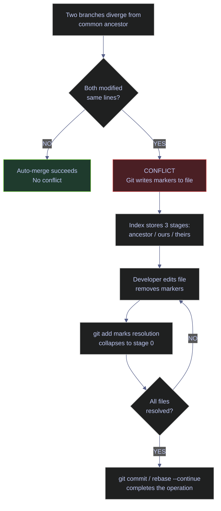
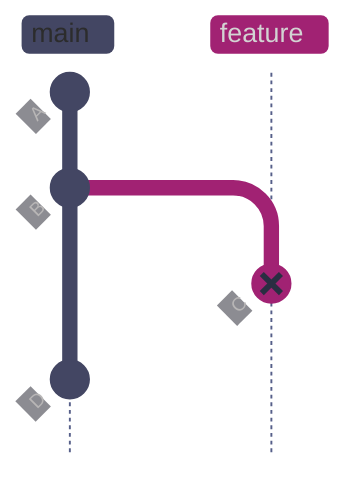
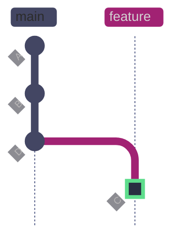

# Git Merge Conflicts

> [!quote]
> "You can disagree with me as much as you want, but during this talk, by definition, anybody who disagrees is stupid and ugly."
>
> — **Linus Torvalds**, Git mailing list

> [!abstract]- Summary
>
> Explains merge conflicts across `git merge`, `git rebase`, `git cherry-pick`, and `git stash pop`, showing how Git records competing versions in the index, how to read conflict markers, and how to resolve or abort safely.
>
> **Conflict model and anatomy**
> - Defines conflicts, common ancestors, three-way merge logic, index stages, unmerged paths, and the meaning of `ours` and `theirs` before any command-level resolution steps
> - Separates content, binary, rename, mode, and add/add conflicts so the reader can recognize which cases allow line editing and which require file-level decisions
>
> **Resolution workflows**
> - Resolves conflicts during `git merge`, accepts individual sides with `--ours` or `--theirs`, handles rename/delete cases, and completes the merge only after staging the final file state
> - Covers visual merge tools plus the exact continue, abort, or skip actions needed when the conflict originates from rebase, cherry-pick, or stash replay instead of merge
>
> **Verification and prevention**
> - Verifies the resolved result, then reduces future conflict frequency with branching discipline, smaller diff sets, merge-order habits, notebook strategies, and conflict-reuse features such as `rerere`
> - Highlights data-engineering edge cases such as SQL migrations, notebook JSON, lockfiles, and other files where naive conflict resolution often damages operational correctness
>
> **Operations and safety**
> - Warnings: `ours` and `theirs` invert meaning during rebase, binary conflicts require whole-file choices, and staged-but-unverified resolutions can silently ship broken logic
> - Recommendations: inspect conflict type first, resolve in small steps, run verification before continue, and enable tools like `rerere` or `zdiff3` where they reduce repeat conflict cost
> - Troubleshooting: merge, rebase, cherry-pick, stash, and mergetool failure paths plus recovery hatches for aborting safely

> [!note]- Glossary
>
> **Conflict**
> - A state where Git cannot automatically combine two sets of changes because they modify the same region of the same file. Resolution requires human intervention.
> - It matters in this note because the workflows for conflict detection, manual resolution, and post-resolution verification read or change this part of Git's state directly, and misunderstanding it leads to the wrong command or the wrong safety assumption.
>
> > [!warning] Context changes meaning
> >
> > Conflict-related terminology depends on workflow context. Resolve whether you are merging, rebasing, or replaying history before choosing a command.
>
> ---
>
> **Conflict marker**
> - Text delimiters (`<<<<<<<`, `=======`, `>>>>>>>`) that Git inserts into a file to show the two competing versions of a conflicted region.
> - It matters in this note because the workflows for conflict detection, manual resolution, and post-resolution verification read or change this part of Git's state directly, and misunderstanding it leads to the wrong command or the wrong safety assumption.
>
> > [!warning] Context changes meaning
> >
> > Conflict-related terminology depends on workflow context. Resolve whether you are merging, rebasing, or replaying history before choosing a command.
>
> ---
>
> **HEAD**
> - A pointer to the current commit on the active branch. During a merge, HEAD refers to the branch you are merging *into*. During a rebase, HEAD refers to the *target base* branch.
> - It matters in this note because the workflows for conflict detection, manual resolution, and post-resolution verification read or change this part of Git's state directly, and misunderstanding it leads to the wrong command or the wrong safety assumption.
>
> > [!warning] History rewrite risk
> >
> > This changes or depends on rewritten history. Verify branch ownership and remote state before using the destructive variant of any related command.
>
> ---
>
> **Ours**
> - The version of a file on the current branch (HEAD side). In a merge, ours = your branch. In a rebase, ours = the branch you are rebasing *onto* (the base).
> - It matters in this note because the workflows for conflict detection, manual resolution, and post-resolution verification read or change this part of Git's state directly, and misunderstanding it leads to the wrong command or the wrong safety assumption.
>
> > [!warning] History rewrite risk
> >
> > This changes or depends on rewritten history. Verify branch ownership and remote state before using the destructive variant of any related command.
>
> ---
>
> **Theirs**
> - The version of a file from the incoming branch. In a merge, theirs = the branch being merged in. In a rebase, theirs = the commits being replayed (your commits).
> - It matters in this note because the workflows for conflict detection, manual resolution, and post-resolution verification read or change this part of Git's state directly, and misunderstanding it leads to the wrong command or the wrong safety assumption.
>
> > [!warning] History rewrite risk
> >
> > This changes or depends on rewritten history. Verify branch ownership and remote state before using the destructive variant of any related command.
>
> ---
>
> **Common ancestor**
> - The most recent commit shared by both branches before they diverged. Git uses this as the base for three-way merge comparison. Also called the *merge base*.
> - It matters in this note because the workflows for conflict detection, manual resolution, and post-resolution verification read or change this part of Git's state directly, and misunderstanding it leads to the wrong command or the wrong safety assumption.
>
> > [!warning] Pointer semantics matter
> >
> > Git stores this as reference state rather than as a second copy of files. Many confusing behaviors come from moving refs while file contents stay the same.
>
> ---
>
> **Three-way merge**
> - An algorithm that compares three versions of a file — the common ancestor, ours, and theirs — to detect which side changed which lines. Conflicts occur only when both sides changed the same lines differently.
> - It matters in this note because the workflows for conflict detection, manual resolution, and post-resolution verification ask you to choose or interpret this operation deliberately instead of treating nearby Git commands as interchangeable.
>
> > [!warning] Context changes meaning
> >
> > Conflict-related terminology depends on workflow context. Resolve whether you are merging, rebasing, or replaying history before choosing a command.
>
> ---
>
> **Index stage**
> - During a conflict, Git stores three versions of each conflicted file in the index: stage 1 (common ancestor), stage 2 (ours), stage 3 (theirs). Normal files use stage 0.
> - It matters in this note because the workflows for conflict detection, manual resolution, and post-resolution verification ask you to choose or interpret this operation deliberately instead of treating nearby Git commands as interchangeable.
>
> > [!warning] Context changes meaning
> >
> > Conflict-related terminology depends on workflow context. Resolve whether you are merging, rebasing, or replaying history before choosing a command.
>
> ---
>
> **Unmerged path**
> - A file that exists in the index at stages 1–3 instead of stage 0. Git considers the merge incomplete until all unmerged paths are resolved and moved to stage 0 via `git add`.
> - It matters in this note because the workflows for conflict detection, manual resolution, and post-resolution verification ask you to choose or interpret this operation deliberately instead of treating nearby Git commands as interchangeable.
>
> > [!danger] Security boundary
> >
> > This term touches authentication, identity, or trust. Treat it as secret or policy material rather than as ordinary repository metadata.
>
> ---
>
> **Merge commit**
> - A commit with two or more parents that records the result of combining two branches. Created by `git merge` (non-fast-forward) after all conflicts are resolved.
> - It matters in this note because the workflows for conflict detection, manual resolution, and post-resolution verification ask you to choose or interpret this operation deliberately instead of treating nearby Git commands as interchangeable.
>
> > [!warning] Pointer semantics matter
> >
> > Git stores this as reference state rather than as a second copy of files. Many confusing behaviors come from moving refs while file contents stay the same.
>
> ---
>
> **Fast-forward**
> - A merge where the target branch has no new commits since the source branched off. Git simply moves the pointer forward — no merge commit, no conflict possible.
> - It matters in this note because the workflows for conflict detection, manual resolution, and post-resolution verification read or change this part of Git's state directly, and misunderstanding it leads to the wrong command or the wrong safety assumption.
>
> > [!warning] Pointer semantics matter
> >
> > Git stores this as reference state rather than as a second copy of files. Many confusing behaviors come from moving refs while file contents stay the same.
>
> ---
>
> **Rebase**
> - Replaying a sequence of commits onto a new base. Each commit is applied individually, so conflicts can occur at each step rather than all at once.
> - It matters in this note because the workflows for conflict detection, manual resolution, and post-resolution verification ask you to choose or interpret this operation deliberately instead of treating nearby Git commands as interchangeable.
>
> > [!warning] History rewrite risk
> >
> > This changes or depends on rewritten history. Verify branch ownership and remote state before using the destructive variant of any related command.
>
> ---
>
> **Cherry-pick**
> - Applying a single commit from another branch onto the current branch. Uses three-way merge with the cherry-picked commit's parent as the common ancestor.
> - It matters in this note because the workflows for conflict detection, manual resolution, and post-resolution verification read or change this part of Git's state directly, and misunderstanding it leads to the wrong command or the wrong safety assumption.
>
> > [!warning] Pointer semantics matter
> >
> > Git stores this as reference state rather than as a second copy of files. Many confusing behaviors come from moving refs while file contents stay the same.
>
> ---
>
> **Force-push**
> - Overwriting the remote branch history after a rebase. Required because rebase creates new commit SHAs. Use `--force-with-lease` to prevent overwriting teammates' work.
> - It matters in this note because the workflows for conflict detection, manual resolution, and post-resolution verification ask you to choose or interpret this operation deliberately instead of treating nearby Git commands as interchangeable.
>
> > [!warning] History rewrite risk
> >
> > This changes or depends on rewritten history. Verify branch ownership and remote state before using the destructive variant of any related command.
>
> ---
>
> **Merge tool**
> - A GUI application (VS Code, IntelliJ, vimdiff, kdiff3) that presents the three-way merge visually — common ancestor, ours, theirs — and lets you build the resolution interactively.
> - It matters in this note because the workflows for conflict detection, manual resolution, and post-resolution verification ask you to choose or interpret this operation deliberately instead of treating nearby Git commands as interchangeable.
>
> > [!warning] Context changes meaning
> >
> > Conflict-related terminology depends on workflow context. Resolve whether you are merging, rebasing, or replaying history before choosing a command.
>
> ---
>
> **Rerere**
> - "Reuse recorded resolution" — a Git feature that remembers how you resolved a conflict and automatically applies the same resolution if the identical conflict recurs.
> - It matters in this note because the workflows for conflict detection, manual resolution, and post-resolution verification read or change this part of Git's state directly, and misunderstanding it leads to the wrong command or the wrong safety assumption.
>
> > [!warning] Context changes meaning
> >
> > Conflict-related terminology depends on workflow context. Resolve whether you are merging, rebasing, or replaying history before choosing a command.

> [!example] Conflict Resolution Fit
>
> > [!success] Appropriate
> >
> > - Use this note whenever Git stops on overlapping history during merge, rebase, cherry-pick, or stash replay and you need a controlled resolution path instead of trial-and-error editing.
> > - Use it when the critical step is recognizing the conflict type first and then finishing, aborting, or verifying the workflow safely.
> > - Use it to keep conflict handling grounded in index state, workflow context, and post-resolution validation rather than in rote marker editing alone.
>
> > [!failure] Inappropriate
> >
> > - Do not apply `--ours` or `--theirs` blindly, because those labels change meaning across merge and rebase workflows.
> > - Do not continue or force-push a rebased branch before verifying that the resolved content is semantically correct, not just syntactically conflict-free.
> > - Do not treat binary, rename, or delete conflicts like ordinary line edits; those cases need file-level decisions.

## Conceptual Model

Before working with conflicts, understand the three-layer structure Git uses when merging two branches.



*Git performs a three-way merge by comparing each file across three versions: the common ancestor (the last commit shared by both branches), ours (HEAD), and theirs (the incoming branch). If only one side changed a region, Git takes that change automatically. If both sides changed the same region differently, Git declares a conflict: it writes both versions into the file separated by conflict markers, stores all three versions in the index as stages 1–3, and pauses the operation. The developer must edit the file to produce the correct final version, run `git add` to collapse the three stages back to stage 0, and then complete the merge or rebase.*

### Why conflicts happen

Git's three-way merge algorithm compares each line of a file across three versions. The comparison logic:

| Ancestor | Ours | Theirs | Result |
|----------|------|--------|--------|
| A | A | A | No change — keep A |
| A | B | A | Only ours changed — take B |
| A | A | C | Only theirs changed — take C |
| A | B | C | **Both changed differently — CONFLICT** |
| A | B | B | Both changed the same way — take B (no conflict) |

A conflict occurs only in the fourth case: both branches modified the same region, and the modifications differ. If both branches made identical changes to the same line, Git accepts them without conflict.

### Conflict types

Not all conflicts involve text content. Git detects several conflict categories:

| Conflict type | Cause | Marker behavior |
|---------------|-------|-----------------|
| **Content** | Both branches edit the same lines of the same file | Standard `<<<<<<<` / `=======` / `>>>>>>>` markers inserted |
| **Binary** | Both branches modify a binary file (images, Parquet, compiled assets) | No markers — Git reports `CONFLICT (binary)` and you must choose one entire version |
| **Rename/delete** | One branch renames a file, the other deletes it | Git reports `CONFLICT (rename/delete)` and stages the renamed version for you to keep or remove |
| **Rename/rename** | Both branches rename the same file to different names | Git reports `CONFLICT (rename/rename)` and you choose which name to keep |
| **Mode** | One branch changes file permissions (e.g., adds execute bit) while the other modifies content | Usually auto-resolved, but can conflict if both change mode differently |
| **Add/add** | Both branches create a new file with the same name but different content | Standard content markers inserted into the file |

## Anatomy of a Conflict

A conflict arises when two branches diverge from a common ancestor and each modifies the same region of a file. Git detects the overlap at merge time and cannot decide which version to keep without your input.


*Main and feature both descend from commit B (the common ancestor). Commit C on feature changed `CACHE_TTL` to 60. Commit D on main changed `CACHE_TTL` to 300. Both modified the same line of config.py with different values (marked red), so Git cannot auto-merge — a content conflict is declared when the branches are merged.*

### Conflict markers | reading HEAD vs incoming

When Git encounters a content conflict, it edits the affected file and inserts conflict markers that divide the region into two competing versions:

```text
<<<<<<< HEAD
CACHE_TTL = 300
=======
CACHE_TTL = 60
>>>>>>> demo/conflict-merge
```

| Marker | Meaning |
|--------|---------|
| `<<<<<<< HEAD` | Start of the current branch's version (the branch you are *on*) |
| `=======` | Divider between the two versions |
| `>>>>>>> demo/conflict-merge` | End of the incoming branch's version (the branch being merged *in*) |

Everything between `<<<<<<< HEAD` and `=======` is what your current branch (HEAD) has. Everything between `=======` and `>>>>>>> demo/conflict-merge` is what the incoming branch has. Git is saying: "These two versions disagree. You decide which one to keep."

> [!info] Conflict Marker Labels Vary by Operation
>
> The marker labels change depending on which Git operation triggered the conflict:
>
> - **`git merge`**: `HEAD` = your branch, `>>>>>>> branch-name` = the branch being merged in
> - **`git rebase`**: `HEAD` = the target branch (the base), `>>>>>>> commit-sha (message)` = your commit being replayed
> - **`git cherry-pick`**: `HEAD` = your current branch, `>>>>>>> commit-sha (message)` = the commit being cherry-picked
> - **`git stash pop`**: `Updated upstream` = the current branch state, `Stashed changes` = your stashed work

### Index stages | three-way merge internals

During a conflict, Git's index (the staging area) stores three versions of each conflicted file instead of the normal single version. These are called stages:

#### Inspect the three index stages during a conflict

**When to run:** After Git reports a conflict and before you begin editing.
**Trigger:** You want to understand exactly what each side contributed before deciding how to resolve.
**Context:** Runs in any Git shell. Read-only — inspects the index without modifying anything.
**Purpose:** See the exact blob SHA and stage number for each version of the conflicted file.

*List the unmerged index entries showing all three stages for each conflicted file.*

```bash
git ls-files -u
```

```text
100644 dea4f7f403ce202a3dd9e76b591b94bf1154db77 1	config.py
100644 da8be79cdf68e858e1678348f3674e82fe04b149 2	config.py
100644 9e9763108f59917010c22648528b01c150e463db 3	config.py
```

| Stage | Label | Content (this example) |
|-------|-------|----------------------|
| 1 | Common ancestor | `CACHE_TTL = 120` — the value before either branch changed it |
| 2 | Ours (HEAD) | `CACHE_TTL = 300` — what the current branch set it to |
| 3 | Theirs (incoming) | `CACHE_TTL = 60` — what the incoming branch set it to |

You can view the content at any stage using `git show :N:filename`:

*Show the content of config.py at each of the three conflict stages.*

```bash
git show :1:config.py    # stage 1 — common ancestor
git show :2:config.py    # stage 2 — ours (HEAD)
git show :3:config.py    # stage 3 — theirs (incoming)
```

```text
# Stage 1 (common ancestor):
CACHE_TTL = 120

# Stage 2 (ours / HEAD):
CACHE_TTL = 300

# Stage 3 (theirs / incoming):
CACHE_TTL = 60
```

When you run `git add` on a resolved file, Git removes stages 1–3 and writes the file to stage 0 (the normal staging state). The conflict is resolved for that file.

## Merge Conflict Resolution

This section covers the complete workflow for resolving conflicts during a standard `git merge` operation.

### git merge | detect and resolve content conflicts

The most common conflict scenario: merging a feature branch into main when both branches modified the same file.

#### Trigger the merge and observe the conflict

**When to run:** When integrating a feature branch into the target branch.
**Trigger:** Running `git merge` when both branches have diverged and modified the same file regions.
**Context:** Local operation. The merge pauses without creating a commit. Working directory and index enter the "merging" state.
**Purpose:** Combine the changes from two branches into a single branch.

*Merge the demo/conflict-merge branch into main, triggering a content conflict in config.py.*

```bash
git merge demo/conflict-merge
```

```text
Auto-merging config.py
CONFLICT (content): Merge conflict in config.py
Automatic merge failed; fix conflicts and then commit the result.
```

Git tried to auto-merge config.py but found that both branches changed the `CACHE_TTL` line differently. The merge is now paused — the working directory contains conflict markers, and the index holds all three stages.

#### Identify conflicted files

**When to run:** Immediately after Git reports a conflict.
**Trigger:** The "Automatic merge failed" message.
**Context:** Read-only status check.
**Purpose:** See exactly which files need resolution and confirm the repository is in a merge state.

*List all files with unresolved conflicts.*

```bash
git status
```

```text
On branch main
You have unmerged paths.
  (fix conflicts and run "git commit")
  (use "git merge --abort" to abort the merge)

Unmerged paths:
  (use "git add <file>..." to mark resolution)
	both modified:   config.py

no changes added to commit (use "git add" and/or "git commit -a")
```

Files listed under "Unmerged paths" with `both modified` are the ones that need manual resolution. The status also shows the two available escape routes: fix and commit, or abort.

#### Examine the conflict markers

*Open the conflicted file to see the two competing versions.*

```bash
cat config.py
```

```text
<<<<<<< HEAD
CACHE_TTL = 300
=======
CACHE_TTL = 60
>>>>>>> demo/conflict-merge
MAX_CONNECTIONS = 10
RETRY_COUNT = 3
TIMEOUT = 30
LOG_LEVEL = "INFO"
```

The conflict is isolated to a single line: HEAD (main) has `CACHE_TTL = 300` and the incoming branch has `CACHE_TTL = 60`. The remaining lines are identical on both branches and appear cleanly below the conflict region.

#### View the combined diff during a conflict

*Show the combined diff that Git computed, with dual-column change indicators.*

```bash
git diff
```

```text
diff --cc config.py
index da8be79,9e97631..0000000
--- a/config.py
+++ b/config.py
@@@ -1,4 -1,4 +1,8 @@@
++<<<<<<< HEAD
 +CACHE_TTL = 300
++=======
+ CACHE_TTL = 60
++>>>>>>> demo/conflict-merge
  MAX_CONNECTIONS = 10
  RETRY_COUNT = 3
  TIMEOUT = 30
```

The `diff --cc` format uses two columns of `+`/`-` markers (one per parent). Lines prefixed with `++` are conflict markers that Git added. Lines with a single `+` in one column show the content from that parent.

#### Resolve the conflict and complete the merge

**When to run:** After editing the file to contain the correct final version with all markers removed.
**Trigger:** You have decided which version (or combination) to keep.
**Context:** `git add` moves the file from stages 1–3 to stage 0. `git commit` creates the merge commit.
**Purpose:** Finalize the merge by recording the resolved state.

Edit the file to remove all conflict markers and keep the desired value:

*Stage the resolved file and create the merge commit.*

```bash
git add config.py
```

```bash
git commit -m "merge: resolve config.py conflict — keep production TTL of 300s"
```

```text
[main 4bc7c52] merge: resolve config.py conflict — keep production TTL of 300s
```

> [!warning] Remove All Conflict Markers Before Staging
>
> If you stage a file that still contains `<<<<<<<` markers, Git will accept the commit — but the file will be broken. Always verify the file is clean before running `git add`. Search for remaining markers with: `grep -rn "<<<<<<" .`

> [!success] Verify Clean Resolution
>
> After staging, confirm no markers remain:
> ```bash
> grep -rn "<<<<<<" .
> ```
> If the command returns no output, all markers have been removed.

### git merge | resolve with --ours or --theirs

When you know in advance that one entire version of a file is correct and the other should be discarded, you can bypass manual editing by checking out one side directly.

#### Accept the current branch version for a specific file

**When to run:** During an active merge conflict when you want to keep your branch's version of a file wholesale.
**Trigger:** The incoming branch's changes to this file are not wanted or are superseded by yours.
**Context:** Replaces the conflicted working-tree file with the stage-2 (ours) version. You still need to `git add` afterward.
**Purpose:** Quickly resolve a single file by choosing one side without manual editing.

*Replace the conflicted file with the current branch (HEAD) version.*

```bash
git checkout --ours pipeline_config.py
```

*Verify the file contains the HEAD version.*

```bash
cat pipeline_config.py
```

```text
CACHE_TTL = 300
MAX_CONNECTIONS = 50
RETRY_COUNT = 3
TIMEOUT = 60
LOG_LEVEL = "WARNING"
```

#### Accept the incoming branch version for a specific file

*Replace the conflicted file with the incoming branch version.*

```bash
git checkout --theirs pipeline_config.py
```

*Verify the file contains the incoming version.*

```bash
cat pipeline_config.py
```

```text
CACHE_TTL = 300
MAX_CONNECTIONS = 50
RETRY_COUNT = 3
TIMEOUT = 45
LOG_LEVEL = "DEBUG"
```

After choosing one side, stage and commit:

```bash
git add pipeline_config.py
git commit -m "merge: keep main's log level and timeout"
```

> [!warning] --ours and --theirs Swap Meaning During Rebase
>
> During `git merge`: `--ours` = your branch (HEAD), `--theirs` = the branch being merged in.
> During `git rebase`: `--ours` = the branch you are rebasing *onto* (the base), `--theirs` = *your* commits being replayed.
>
> This reversal is the single most common source of confusion when resolving rebase conflicts. The reason: during a rebase, Git checks out the target base first (making it HEAD/ours), then replays your commits on top (making them theirs).

> [!success] Mnemonic for Rebase --ours/--theirs
>
> During rebase, think from Git's perspective: Git is sitting *on the base branch* and applying your commits as patches. So "ours" = the base it is sitting on, and "theirs" = the patches being applied.

| Flag | Syntax | Description |
|------|--------|-------------|
| `--ours` | `git checkout --ours <file>` | Replace the conflicted file with the stage-2 (current branch / HEAD) version |
| `--theirs` | `git checkout --theirs <file>` | Replace the conflicted file with the stage-3 (incoming branch) version |

### git merge | rename/delete conflicts

A rename/delete conflict occurs when one branch renames a file while the other branch deletes it. Git cannot determine whether to keep the renamed version or honor the deletion.

#### Detect and resolve a rename/delete conflict

**When to run:** When merging a branch that renamed a file against a branch that deleted it.
**Trigger:** Git reports `CONFLICT (rename/delete)` during merge.
**Context:** The renamed file appears in the working directory. The index marks it as unmerged with `deleted by us` or `deleted by them`.
**Purpose:** Decide whether the file should exist (under its new name) or be removed.

*Merge a branch that renamed config.py to pipeline_config.py into main, where config.py was deleted.*

```bash
git merge demo/conflict-rename
```

```text
CONFLICT (rename/delete): config.py renamed to pipeline_config.py in demo/conflict-rename, but deleted in HEAD.
Automatic merge failed; fix conflicts and then commit the result.
```

*Check the conflict status.*

```bash
git status
```

```text
On branch main
You have unmerged paths.
  (fix conflicts and run "git commit")
  (use "git merge --abort" to abort the merge)

Unmerged paths:
  (use "git add/rm <file>..." as appropriate to mark resolution)
	deleted by us:   pipeline_config.py

no changes added to commit (use "git add" and/or "git commit-a")
```

To keep the renamed file:

```bash
git add pipeline_config.py
git commit -m "merge: keep renamed pipeline_config.py from feature branch"
```

To honor the deletion instead:

```bash
git rm pipeline_config.py
git commit -m "merge: remove pipeline_config.py per main branch deletion"
```

> [!warning] Binary Conflicts Have No Markers
>
> Merge conflicts in binary files (images, Parquet, compiled assets, Excel files) show as `CONFLICT (binary)` with no conflict markers to edit. You cannot manually merge binary content — you must pick one entire version using `git checkout --ours <file>` or `git checkout --theirs <file>`, then `git add <file>`.

> [!success] Resolve Binary Conflicts
>
> Pick the correct version explicitly, then stage it:
> ```bash
> git checkout --ours path/to/file.parquet
> git add path/to/file.parquet
> ```

## Aborting a Merge

When conflicts are too complex to resolve immediately, or when you realize your merge strategy was wrong, cancel the entire operation and return to a clean state.

### git merge --abort | cancel and restore pre-merge state

#### Abort an in-progress merge

**When to run:** When you have started a merge that produced conflicts and want to cancel it entirely.
**Trigger:** Conflicts are too numerous or complex, or you want to rebase instead of merge, or you need to coordinate with the teammate who made the conflicting changes first.
**Context:** Restores the working directory and index to the exact state before `git merge` was run. Completely safe — no data is lost.
**Purpose:** Return to a clean pre-merge state so you can choose a different approach.

*Abort the in-progress merge and restore the pre-merge state.*

```bash
git merge --abort
```

*Verify the repository is clean.*

```bash
git status
```

```text
On branch main
nothing added to commit but untracked files present (use "git add" to track)
```

The working directory is exactly as it was before the merge started. No conflict markers, no staged changes, no merge state.

> [!tip] Abort Is Always Safe
>
> `git merge --abort` is completely safe. It restores your working directory exactly to where it was before you ran `git merge`. No work is lost. The incoming branch is untouched. You can attempt the merge again at any time.

| Flag | Syntax | Description |
|------|--------|-------------|
| `--abort` | `git merge --abort` | Cancel the in-progress merge and restore the pre-merge state |
| `--continue` | `git merge --continue` | Resume a paused merge after all conflicts are resolved (equivalent to `git commit`) |
| `--quit` | `git merge --quit` | Abandon the merge but leave the working directory as-is (partial resolution preserved) |

## Visual Merge Tools

Text-based conflict marker editing works for simple conflicts. For complex multi-file conflicts, a visual merge tool presents three panes — common ancestor, ours, theirs — and lets you build the resolution interactively.

### git mergetool | open configured GUI for conflict resolution

`git mergetool` opens the merge editor configured in your Git config for each conflicted file in sequence. Without explicit configuration, Git attempts to find any available GUI diff tool on your system.

#### Open the visual merge tool for all conflicted files

**When to run:** During an active merge or rebase conflict when you prefer a GUI over editing markers manually.
**Trigger:** Multiple files with complex conflicts, or conflicts involving rearranged code blocks where markers are hard to read.
**Context:** Opens an external application. Git prompts for each conflicted file in sequence.
**Purpose:** Resolve conflicts visually with side-by-side comparison of all three versions.

*Launch the configured merge tool for every conflicted file.*

```bash
git mergetool
```

#### Configure VS Code as the default merge tool

**When to run:** Once, as part of initial Git configuration.
**Trigger:** You want VS Code's built-in three-way merge editor as your default conflict resolution tool.
**Context:** Writes to `~/.gitconfig` (global). Applies to all repositories for the current user.
**Purpose:** Ensure `git mergetool` always opens VS Code.

*Set VS Code as the global merge tool.*

```bash
git config --global merge.tool vscode
git config --global mergetool.vscode.cmd 'code --wait $MERGED'
```

After this configuration, running `git mergetool` during any conflict opens VS Code with its built-in merge editor. VS Code displays inline action buttons above each conflict block:

- **Accept Current Change** — keep the HEAD (your branch) version
- **Accept Incoming Change** — keep the incoming branch's version
- **Accept Both Changes** — append both versions sequentially
- **Compare Changes** — open a diff view showing both sides

> [!tip] VS Code Three-Way Merge Editor
>
> VS Code 1.70+ includes a dedicated three-way merge editor (not just inline buttons). Open it via the command palette: "Merge Editor: Open Merge Editor". It shows the common ancestor, ours, and theirs in three separate panes with a result pane at the bottom — identical to what professional merge tools like Beyond Compare or P4Merge provide.

| Flag | Syntax | Description |
|------|--------|-------------|
| `--tool=<tool>` | `git mergetool --tool=vimdiff` | Override the configured tool for this invocation |
| `-y` | `git mergetool -y` | Do not prompt before launching each file's merge session |
| `--no-prompt` | `git mergetool --no-prompt` | Same as `-y` — skip the per-file prompt |

## Rebase Conflict Resolution

Conflicts during `git rebase` work the same way mechanically, but the workflow differs from merge in two critical ways: (1) Git replays each commit individually, so conflicts can occur multiple times — once per conflicting commit; (2) the meaning of "ours" and "theirs" is reversed compared to merge.

### git rebase | resolve conflicts during replay

> [!danger] Never Rebase Published Branches
>
> Rebasing rewrites commit SHAs. If you rebase a branch that teammates have already pulled, their local history will diverge from the force-pushed remote — causing confusion and potential data loss.

> [!success] Safe Rebase Pattern
>
> Only rebase commits that have not been pushed to a shared remote, or on personal feature branches where you are the sole contributor. For shared branches, use `git merge` to incorporate upstream changes without rewriting history.

**Before rebase:**



*Main and feature diverged at commit B. Commit C on feature changed `retry_count` to 5. Commit D on main changed `timeout_seconds` to 900. Both modified the same file (config.yaml) in the same region — when the feature branch is rebased onto main, Git replays commit C on top of D and encounters a conflict (C marked red).*

**After rebase:**



*After rebase: Git first applied D (the new base), then replayed C as C' (marked green) with a new SHA. The conflict was resolved by keeping both changes — retry_count = 5 from the feature branch and timeout_seconds = 900 from main. The result is a linear history where the feature work appears to have started after D.*

#### Trigger a rebase conflict

**When to run:** When you need to replay your branch's commits on top of an updated base branch.
**Trigger:** Your branch has diverged from main and you want a linear history before merging.
**Context:** Rebase rewrites commit history — every replayed commit gets a new SHA. If your branch was already pushed, you will need `--force-with-lease` afterward.
**Purpose:** Create a clean linear history by replaying your commits on top of the latest base.

*Rebase the feature branch onto the updated main.*

```bash
git rebase main
```

```text
Rebasing (1/1)
Auto-merging config.yaml
CONFLICT (content): Merge conflict in config.yaml
error: could not apply c90e250... ops: increase retry count to 5 for transient API failures
hint: Resolve all conflicts manually, mark them as resolved with
hint: "git add/rm <conflicted_files>", then run "git rebase --continue".
hint: You can instead skip this commit: run "git rebase --skip".
hint: To abort and get back to the state before "git rebase", run "git rebase --abort".
Could not apply c90e250...
```

*Check the rebase state.*

```bash
git status
```

```text
interactive rebase in progress; onto 04d20b1
Last command done (1 command done):
   pick c90e250 # ops: increase retry count to 5 for transient API failures
No commands remaining.
You are currently rebasing branch 'demo/conflict-rebase' on '04d20b1'.
  (fix conflicts and then run "git rebase --continue")
  (use "git rebase --skip" to skip this patch)
  (use "git rebase --abort" to check out the original branch)

Unmerged paths:
  (use "git restore --staged <file>..." to unstage)
  (use "git add <file>..." to mark resolution)
	both modified:   config.yaml

no changes added to commit (use "git add" and/or "git commit -a")
```

The status shows the rebase progress (`Rebasing 1/1`), the exact commit being replayed (`c90e250`), and all three escape routes.

*View the conflict markers in the file.*

```bash
cat config.yaml
```

```text
pipeline:
  name: stock-index-pipeline
  schedule: "0 18 * * 1-5"
<<<<<<< HEAD
  retry_count: 3
  timeout_seconds: 900
=======
  retry_count: 5
  timeout_seconds: 600
>>>>>>> c90e250 (ops: increase retry count to 5 for transient API failures)
  market_close_utc: "16:30"

sources:
  - name: euronext
    api: rest
    rate_limit: 100
  - name: yahoo_finance
    api: rest
    rate_limit: 50
```

During rebase, HEAD points to the base branch (main) — not your feature branch. The `<<<<<<< HEAD` section shows main's values (`retry_count: 3`, `timeout_seconds: 900`). The `>>>>>>> c90e250` section shows your commit's values (`retry_count: 5`, `timeout_seconds: 600`).

The correct resolution keeps both changes — the higher retry count from the feature branch and the longer timeout from main:

```yaml
  retry_count: 5
  timeout_seconds: 900
```

#### Resolve and continue the rebase

**When to run:** After editing the conflicted file to contain the correct final version.
**Trigger:** All conflict markers removed, file saved.
**Context:** `git add` marks resolution, `git rebase --continue` applies the resolution and moves to the next commit.
**Purpose:** Complete the current commit's replay and proceed to the next one (if any).

*Stage the resolved file and continue the rebase.*

```bash
git add config.yaml
```

```bash
git rebase --continue
```

```text
Successfully rebased and updated refs/heads/demo/conflict-rebase.
```

### git rebase | escape hatches

When a rebase cannot proceed as planned, use these commands to cancel the entire operation or skip the current conflicting commit.

#### Abort the entire rebase

**When to run:** When the rebase conflicts are too complex, or you realize you should merge instead of rebase.
**Trigger:** You want to abandon the rebase entirely and return to the pre-rebase state.
**Context:** Completely safe. Restores the branch to its exact state before `git rebase` was run.
**Purpose:** Cancel the rebase without any side effects.

*Cancel the rebase and restore the original branch state.*

```bash
git rebase --abort
```

#### Skip the current commit during rebase

**When to run:** When the commit being replayed is entirely redundant — its changes were already incorporated into the base branch.
**Trigger:** The conflict exists only because the same change was already applied upstream.
**Context:** Permanently discards the current commit's changes. The remaining commits continue to replay.
**Purpose:** Drop a redundant commit from the rebased history.

*Skip the current conflicting commit and continue with the rest.*

```bash
git rebase --skip
```

> [!danger] --skip Permanently Discards Changes
>
> `git rebase --skip` permanently drops the current commit. Only use it when you are certain the commit's changes are fully redundant with what already exists on the base branch. If in doubt, resolve the conflict manually instead.

> [!success] Check Before Skipping
>
> Before running `--skip`, verify the commit is truly redundant by comparing the diff:
> ```bash
> git diff HEAD
> ```
> If the diff shows only the content that is already on the base branch, the commit is safe to skip.

| Flag | Syntax | Description |
|------|--------|-------------|
| `--continue` | `git rebase --continue` | Resume the rebase after resolving conflicts in the current commit |
| `--abort` | `git rebase --abort` | Cancel the entire rebase and restore the pre-rebase branch state |
| `--skip` | `git rebase --skip` | Discard the current commit and continue replaying the rest |
| `--quit` | `git rebase --quit` | Abandon the rebase but leave HEAD where it is (partial rebase preserved) |

## Cherry-Pick Conflict Resolution

Conflicts during `git cherry-pick` follow the same resolution mechanics as merge, but the three-way merge uses the cherry-picked commit's *parent* as the common ancestor — not the merge base of the two branches.

### git cherry-pick | resolve conflicts from single-commit application

#### Trigger a cherry-pick conflict

**When to run:** When applying a single commit from another branch and the target file has diverged.
**Trigger:** The cherry-picked commit modifies lines that were also changed on the current branch since the commit's parent.
**Context:** Local operation. The cherry-pick pauses at the conflicting commit.
**Purpose:** Port a specific change from one branch to another.

*Cherry-pick a version bump commit that conflicts with a hotfix already on main.*

```bash
git cherry-pick 63fdcfa
```

```text
Auto-merging src/__init__.py
CONFLICT (content): Merge conflict in src/__init__.py
error: could not apply 63fdcfa... feat: bump version to 2.1.0 for Q2 release
hint: After resolving the conflicts, mark them with
hint: "git add/rm <pathspec>", then run
hint: "git cherry-pick --continue".
hint: You can instead skip this commit with "git cherry-pick --skip".
hint: To abort and get back to the state before "git cherry-pick",
hint: run "git cherry-pick --abort".
```

*View the conflict markers.*

```bash
cat src/__init__.py
```

```text
"""Stock index analytics pipeline."""

<<<<<<< HEAD
__version__ = "2.0.1"
=======
__version__ = "2.1.0"
>>>>>>> 63fdcfa (feat: bump version to 2.1.0 for Q2 release)
__author__ = "Data Engineering Team"
```

HEAD has `2.0.1` (the hotfix) and the cherry-picked commit has `2.1.0` (the Q2 release bump). The correct resolution depends on context — if the Q2 release supersedes the hotfix, keep `2.1.0`.

#### Resolve and continue the cherry-pick

*Stage the resolved file and complete the cherry-pick.*

```bash
git add src/__init__.py
```

```bash
git cherry-pick --continue --no-edit
```

```text
[main 421a7f5] feat: bump version to 2.1.0 for Q2 release
 1 file changed, 1 insertion(+), 1 deletion(-)
```

| Flag | Syntax | Description |
|------|--------|-------------|
| `--continue` | `git cherry-pick --continue` | Resume after resolving conflicts |
| `--abort` | `git cherry-pick --abort` | Cancel the cherry-pick and restore the pre-operation state |
| `--skip` | `git cherry-pick --skip` | Discard the current commit and continue (when cherry-picking a range) |
| `--no-edit` | `git cherry-pick --no-edit` | Accept the original commit message without opening the editor |
| `-x` | `git cherry-pick -x <sha>` | Append a "(cherry picked from commit ...)" note to the message for traceability |

## Stash Pop Conflict Resolution

`git stash pop` applies stashed changes to the working directory using a three-way merge. If the file has changed since you stashed (because you switched branches or committed new work), the merge can conflict.

### git stash pop | resolve conflicts from re-applied stash

#### Trigger a stash pop conflict

**When to run:** When re-applying stashed changes to a branch that has diverged since the stash was created.
**Trigger:** Running `git stash pop` when the stashed changes touch lines that have been modified since the stash was saved.
**Context:** The stash entry is preserved (not dropped) when conflicts occur. Your work is safe until you explicitly `git stash drop`.
**Purpose:** Re-apply shelved work onto a branch that has moved forward.

*Pop a stash that conflicts with committed changes.*

```bash
git stash pop
```

```text
Auto-merging requirements.txt
CONFLICT (content): Merge conflict in requirements.txt
The stash entry is kept in case you need it again.
```

*View the conflict markers — stash labels differ from merge.*

```bash
cat requirements.txt
```

```text
pandas==2.2.0
numpy==1.26.4
sqlalchemy==2.0.25
dbt-core==1.7.4
apache-airflow==2.8.1
<<<<<<< Updated upstream
boto3==1.34.25
=======
requests==2.31.0
>>>>>>> Stashed changes
```

`Updated upstream` marks the current branch state (equivalent to "ours" in a merge). `Stashed changes` marks the stashed work (equivalent to "theirs").

#### Resolve and clean up the stash

**When to run:** After editing the conflicted file to include both dependencies.
**Trigger:** Conflict markers removed, file saved.
**Context:** Because the pop conflicted, the stash entry was not auto-dropped — you must drop it manually.
**Purpose:** Complete the stash re-application and remove the stash entry.

The correct resolution keeps both additions (they are independent packages):

*Stage the resolved file and drop the preserved stash.*

```bash
git add requirements.txt
```

```bash
git stash drop
```

```text
Dropped refs/stash@{0} (397873e26cb34672a4f0f887a685670137f129ae)
```

> [!warning] Stash Pop Preserves the Stash on Conflict
>
> When `git stash pop` encounters a conflict, the stash entry is *not* auto-dropped. This is a safety feature — your original stashed work remains recoverable via `git stash list`. But it also means you must `git stash drop` manually after resolving, or you will accumulate stale stash entries.

> [!success] Always Drop After Resolving Stash Conflicts
>
> After resolving stash pop conflicts and staging the files:
> ```bash
> git stash drop
> ```
> Verify with `git stash list` that the entry is gone.

## Post-Resolution Verification

Resolving conflict markers is only half the job. Incorrectly combined code can pass Git's merge checks but fail at runtime. Every conflict resolution must be followed by verification.

### Verification checklist | confirm correct resolution

> [!todo] Post-Conflict Verification Checklist
>
> After resolving all conflicts and before committing or pushing:
>
> 1. **Search for leftover markers** — `grep -rn "<<<<<<" .` must return empty
> 2. **Run tests** — `pytest`, `dbt test`, or your project's test suite. Merged code that compiles but fails tests is a silent regression.
> 3. **Run linters** — `ruff check .`, `flake8`, `eslint`. Conflicts often produce indentation errors or missing imports after manual editing.
> 4. **Validate migrations** — if SQL or Alembic migration files were conflicted, run the migration against a test database. A syntactically valid merge can produce invalid SQL.
> 5. **Parse DAGs** — if Airflow DAG files were conflicted, run `python -c "import dags.my_dag"` to verify the DAG parses. Broken imports from a bad merge will only surface at scheduler time.
> 6. **Review the diff** — `git diff --staged` to see exactly what will be committed. Read every hunk, not just the ones you edited.
> 7. **Build the project** — if the project has a build step (`docker build`, `npm run build`, `dbt compile`), run it. Dependency conflicts often surface only at build time.

## Preventing Merge Conflicts

Prevention is cheaper than resolution. These practices reduce conflict frequency in active data-engineering repositories.

### Practices | reduce conflict frequency

- **Pull from main before starting any new work:**

```bash
  git checkout main && git pull && git checkout -b feat/my-feature
```

- **Keep PRs small and focused** — one feature or fix per PR. Large PRs take longer to review, increasing the chance that main moves ahead.
- **Merge or rebase frequently** — if your branch lives for more than a day or two, periodically rebase onto the latest main to stay current.
- **Coordinate on shared files** — if two people are editing the same file for unrelated reasons, communicate and consider sequencing the PRs.
- **Use GitHub's branch update button** — enable "Always suggest updating pull request branches" in repo Settings → General → Pull Requests. This adds a one-click "Update branch" button on the PR page.
- **Enable branch protection rules** — "Require branches to be up to date before merging" forces every PR to be rebased before it can merge.
- **Enable rerere** — `git config --global rerere.enabled true`. Git records how you resolved each conflict and automatically applies the same resolution if the identical conflict recurs (common during repeated rebases).

> [!tip] Rebase Early, Rebase Often
>
> Running `git rebase origin/main` on your feature branch every morning takes 30 seconds when there are no conflicts. It saves hours when you wait until the PR is blocked at merge time.

### SQL migration conflicts | data-engineering gotcha

> [!warning] Migration File Ordering Conflicts
>
> When two engineers create SQL migration files simultaneously (e.g., `V003_add_column.sql` and `V003_create_table.sql`), Git sees a file-level conflict only if both modified the same file. But migration tools (Flyway, Alembic, dbt) process files by version number — two files with the same version number will fail at runtime, not at merge time.

> [!success] Use Timestamp-Based Migration Names
>
> Use timestamp-based migration names (`20260330_001_add_column.sql`) instead of sequential version numbers. Timestamps never collide. If using sequential versioning, coordinate via a shared "next version" tracker or rebase and renumber before merging.

### Notebook conflicts | avoiding JSON merge noise

> [!warning] Jupyter Notebook Conflicts Are Unreadable
>
> `.ipynb` files are JSON under the hood. A conflict in a notebook file produces conflict markers inside deeply nested JSON structures that are nearly impossible to resolve manually. Cell outputs, execution counts, and metadata all contribute to false conflicts.

> [!success] Strip Outputs Before Committing Notebooks
>
> Use `nbstripout` to remove cell outputs and execution counts before committing:
> ```bash
> pip install nbstripout
> nbstripout --install     # installs as a Git filter
> ```
> This dramatically reduces false conflicts. For remaining structural conflicts, use `nbdime` — a tool specifically designed for diffing and merging Jupyter notebooks:
> ```bash
> pip install nbdime
> nbdime config-git --enable --global
> ```

### Lockfile conflicts | dependency resolution files

> [!warning] Lockfile Conflicts Should Not Be Manually Resolved
>
> Files like `poetry.lock`, `package-lock.json`, `yarn.lock`, and `Pipfile.lock` are machine-generated. Manual conflict resolution almost always produces an invalid lockfile with inconsistent hashes or missing transitive dependencies.

> [!success] Regenerate Lockfiles After Conflict
>
> Accept one side's version, then regenerate:
> ```bash
> git checkout --theirs poetry.lock
> poetry lock --no-update
> git add poetry.lock
> ```
> This ensures the lockfile is internally consistent with the merged `pyproject.toml`.

## Troubleshooting

| Problem | Cause | Fix |
|---------|-------|-----|
| `fatal: You have not concluded your merge (MERGE_HEAD exists)` | A previous merge was not completed or aborted | Run `git merge --abort` to cancel, or resolve remaining conflicts and commit |
| Conflict markers appear in committed file | File was staged with markers still present | Amend the commit: edit the file, `git add`, `git commit --amend` |
| `git rebase --continue` says "No changes" | The resolved file is identical to the base after your edits | Run `git rebase --skip` — the commit is now empty and redundant |
| Stash entry not dropped after `git stash pop` | Pop encountered a conflict, so Git preserved the stash | After resolving: `git stash drop` |
| `--ours` and `--theirs` produce the wrong version during rebase | The meaning is reversed during rebase vs merge | During rebase: `--ours` = base branch, `--theirs` = your commits |
| Conflict in binary file with no markers | Binary files cannot be text-merged | Use `git checkout --ours` or `--theirs` to pick one version, then `git add` |
| `error: could not apply <sha>` during rebase | The commit being replayed conflicts with the new base | Resolve conflict markers, `git add`, `git rebase --continue` |
| Rebase produces many conflicts across commits | Each commit is replayed individually, hitting the same region repeatedly | Consider squashing related commits first: `git rebase -i` to combine, then rebase onto main |
| Merge succeeds but tests fail | Auto-merge combined code that is syntactically valid but logically wrong | Always run tests after merge. Git merges text, not semantics |
| `rerere` applies wrong resolution | A previously recorded resolution is no longer correct | Clear the cache: `git rerere forget <file>` |

## Operating Guidance

1. **Read markers carefully.** Know which side is HEAD and which is incoming — especially during rebase where the meaning is reversed.
2. **Never leave markers in committed code.** Always `grep -rn "<<<<<<" .` before committing.
3. **Prefer `--force-with-lease` over `--force`.** After rebase, this prevents overwriting teammates' work.
4. **Abort is always safe.** `git merge --abort` and `git rebase --abort` restore the pre-operation state with zero data loss.
5. **Verify after every resolution.** Run tests, linters, and build steps. Git merges text, not logic.
6. **Use rerere for repeated rebases.** Enable `rerere.enabled = true` to avoid resolving the same conflict repeatedly.
7. **Regenerate, don't edit lockfiles.** Accept one side, then run the package manager's lock command.
8. **Strip notebook outputs.** Use `nbstripout` to prevent JSON-level false conflicts in `.ipynb` files.
9. **Coordinate on shared files.** When two people edit the same file, sequence the PRs or split the file.
10. **Use timestamp-based migration names.** Sequential version numbers collide silently when two engineers create migrations simultaneously.

## Quick Reference

| Goal | Command |
|------|---------|
| See which files have conflicts | `git status` |
| List index stages for conflicted files | `git ls-files -u` |
| View content at a specific stage | `git show :N:filename` (N = 1, 2, or 3) |
| Stage a resolved file | `git add <file>` |
| Accept current branch version | `git checkout --ours <file>` |
| Accept incoming branch version | `git checkout --theirs <file>` |
| Complete the merge | `git commit` |
| Abort the merge | `git merge --abort` |
| Quit merge, keep partial state | `git merge --quit` |
| Open visual merge tool | `git mergetool` |
| Continue after rebase conflict | `git rebase --continue` |
| Abort the entire rebase | `git rebase --abort` |
| Skip a redundant commit during rebase | `git rebase --skip` |
| Continue after cherry-pick conflict | `git cherry-pick --continue` |
| Abort a cherry-pick | `git cherry-pick --abort` |
| Drop preserved stash after pop conflict | `git stash drop` |
| Search for leftover conflict markers | `grep -rn "<<<<<<" .` |
| Enable rerere for auto-resolution recording | `git config --global rerere.enabled true` |
| Clear a wrong rerere recording | `git rerere forget <file>` |
