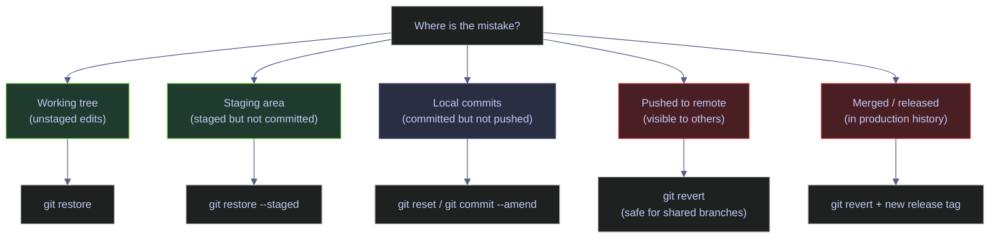
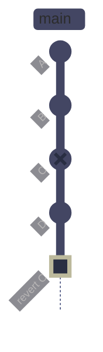
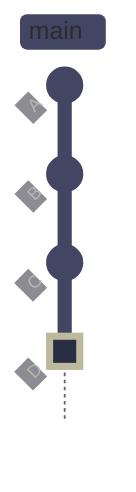
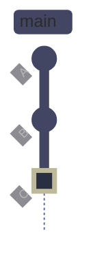
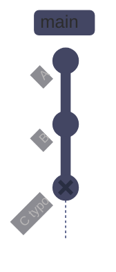
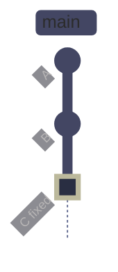
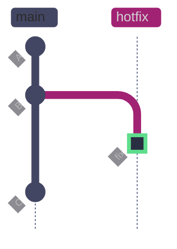
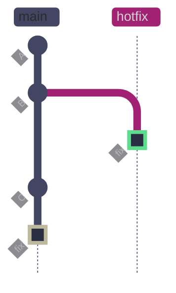

# Git Recovery and Undo

> [!quote]+
> "Nobody actually creates perfect code the first time around, except me. But there's only one of me."
>
> — **Linus Torvalds**, Git mailing list

> [!abstract]- Summary
>
> Maps Git recovery tools by blast radius so you can discard, unstage, revert, reset, stash, or recover lost commits intentionally instead of guessing which command is safe for working-tree edits, local history, or public branches.
>
> **Recovery model and local-state undo**
> - Separates working-tree, staging-area, local-history, and public-history recovery so the note's commands are chosen by what should be preserved rather than by habit
> - Uses `git restore`, `git clean`, and related file-level tools to discard or recover local changes without moving branch pointers when full history edits are unnecessary
>
> **Commit and history recovery**
> - Compares `git commit --amend`, `git reset` modes, `git revert`, and `git reflog` so readers know when they are rewriting history versus adding a corrective commit
> - Treats reflog as the main safety net for lost commits, rebases, deleted branches, and accidental pointer movement before garbage collection expires the evidence
>
> **Stash, advanced recovery, and scenarios**
> - Uses stash operations, advanced recovery commands, and concrete workflow examples to recover from wrong-branch work, accidental deletion, rebases, and interrupted local changes
> - Extends the guidance to public-history safety and data-engineering scenarios where migration files, secrets, or generated artifacts change the acceptable recovery path
>
> **Operations and safety**
> - Warnings: destructive resets, reflog expiry, secret exposure that needs history cleanup, and recovering files without verifying which branch or commit should own the final state
> - Recommendations: identify the state boundary first, prefer additive undo on shared branches, inspect reflog before panicking, and validate the recovered tree before pushing
> - Troubleshooting: wrong-branch commits, lost work after reset or rebase, stash confusion, and file-level recovery failures

> [!note]- Glossary
>
> **working tree**
> - The file system directory where you edit files. Changes here are not yet recorded by Git until staged.
> - It matters in this note because the workflows for undo choice, local recovery, and shared-history safety read or change this part of Git's state directly, and misunderstanding it leads to the wrong command or the wrong safety assumption.
>
> > [!info] Operational nuance
> >
> > Treat this as a concrete Git object, state, or workflow term rather than as a loose synonym. The commands in the note behave differently depending on this exact meaning.
>
> ---
>
> **staging area (index)**
> - An intermediate holding area between the working tree and the repository. `git add` moves changes here; `git commit` records them permanently.
> - It matters in this note because the workflows for undo choice, local recovery, and shared-history safety ask you to choose or interpret this operation deliberately instead of treating nearby Git commands as interchangeable.
>
> > [!info] Operational nuance
> >
> > Treat this as a concrete Git object, state, or workflow term rather than as a loose synonym. The commands in the note behave differently depending on this exact meaning.
>
> ---
>
> **commit**
> - A snapshot of the staging area at a point in time, identified by a SHA-1 hash. Immutable once created.
> - It matters in this note because the workflows for undo choice, local recovery, and shared-history safety read or change this part of Git's state directly, and misunderstanding it leads to the wrong command or the wrong safety assumption.
>
> > [!info] Operational nuance
> >
> > Treat this as a concrete Git object, state, or workflow term rather than as a loose synonym. The commands in the note behave differently depending on this exact meaning.
>
> ---
>
> **HEAD**
> - A symbolic reference pointing to the current commit on the current branch. Most commands operate relative to HEAD.
> - It matters in this note because the workflows for undo choice, local recovery, and shared-history safety read or change this part of Git's state directly, and misunderstanding it leads to the wrong command or the wrong safety assumption.
>
> > [!warning] Pointer semantics matter
> >
> > Git stores this as reference state rather than as a second copy of files. Many confusing behaviors come from moving refs while file contents stay the same.
>
> ---
>
> **ref**
> - A human-readable name that points to a commit SHA — branches, tags, and HEAD are all refs.
> - It matters in this note because the workflows for undo choice, local recovery, and shared-history safety read or change this part of Git's state directly, and misunderstanding it leads to the wrong command or the wrong safety assumption.
>
> > [!warning] Pointer semantics matter
> >
> > Git stores this as reference state rather than as a second copy of files. Many confusing behaviors come from moving refs while file contents stay the same.
>
> ---
>
> **reflog**
> - A local, chronological log of every position HEAD has occupied. Entries expire after ~90 days (`gc.reflogExpire`). Not shared with remotes.
> - It matters in this note because the workflows for undo choice, local recovery, and shared-history safety read or change this part of Git's state directly, and misunderstanding it leads to the wrong command or the wrong safety assumption.
>
> > [!warning] Pointer semantics matter
> >
> > Git stores this as reference state rather than as a second copy of files. Many confusing behaviors come from moving refs while file contents stay the same.
>
> ---
>
> **restore**
> - Discards or unstages changes in the working tree or index without touching commit history. Replacement for the overloaded `git checkout -- <file>`.
> - It matters in this note because the workflows for undo choice, local recovery, and shared-history safety ask you to choose or interpret this operation deliberately instead of treating nearby Git commands as interchangeable.
>
> > [!info] Operational nuance
> >
> > Treat this as a concrete Git object, state, or workflow term rather than as a loose synonym. The commands in the note behave differently depending on this exact meaning.
>
> ---
>
> **revert**
> - Creates a new commit that applies the inverse of a previous commit's diff. Preserves history — safe for shared branches.
> - It matters in this note because the workflows for undo choice, local recovery, and shared-history safety ask you to choose or interpret this operation deliberately instead of treating nearby Git commands as interchangeable.
>
> > [!warning] Pointer semantics matter
> >
> > Git stores this as reference state rather than as a second copy of files. Many confusing behaviors come from moving refs while file contents stay the same.
>
> ---
>
> **reset**
> - Moves the branch pointer (and HEAD) to a different commit. Three modes control what happens to the un-done changes: `--soft` (staged), `--mixed` (unstaged), `--hard` (discarded).
> - It matters in this note because the workflows for undo choice, local recovery, and shared-history safety ask you to choose or interpret this operation deliberately instead of treating nearby Git commands as interchangeable.
>
> > [!warning] History rewrite risk
> >
> > This changes or depends on rewritten history. Verify branch ownership and remote state before using the destructive variant of any related command.
>
> ---
>
> **amend**
> - Replaces the most recent commit with a new one that combines the original changes plus any additional staged changes. Rewrites history — the original commit gets a new SHA.
> - It matters in this note because the workflows for undo choice, local recovery, and shared-history safety read or change this part of Git's state directly, and misunderstanding it leads to the wrong command or the wrong safety assumption.
>
> > [!warning] History rewrite risk
> >
> > This changes or depends on rewritten history. Verify branch ownership and remote state before using the destructive variant of any related command.
>
> ---
>
> **cherry-pick**
> - Copies the diff of a single commit from one branch and applies it as a new commit on the current branch. The copy gets a new SHA.
> - It matters in this note because the workflows for undo choice, local recovery, and shared-history safety read or change this part of Git's state directly, and misunderstanding it leads to the wrong command or the wrong safety assumption.
>
> > [!warning] Pointer semantics matter
> >
> > Git stores this as reference state rather than as a second copy of files. Many confusing behaviors come from moving refs while file contents stay the same.
>
> ---
>
> **stash**
> - A stack-based temporary storage area for uncommitted changes. Saves a dirty working tree without committing, allowing context switches.
> - It matters in this note because the workflows for undo choice, local recovery, and shared-history safety ask you to choose or interpret this operation deliberately instead of treating nearby Git commands as interchangeable.
>
> > [!info] Operational nuance
> >
> > Treat this as a concrete Git object, state, or workflow term rather than as a loose synonym. The commands in the note behave differently depending on this exact meaning.
>
> ---
>
> **detached HEAD**
> - A state where HEAD points directly to a commit SHA rather than a branch name. New commits made here are orphaned when you switch away unless you create a branch.
> - It matters in this note because the workflows for undo choice, local recovery, and shared-history safety read or change this part of Git's state directly, and misunderstanding it leads to the wrong command or the wrong safety assumption.
>
> > [!warning] History rewrite risk
> >
> > This changes or depends on rewritten history. Verify branch ownership and remote state before using the destructive variant of any related command.
>
> ---
>
> **force-push**
> - Overwrites the remote branch pointer with the local one, discarding any remote commits not in local history. Destructive to collaborators who have already pulled.
> - It matters in this note because the workflows for undo choice, local recovery, and shared-history safety ask you to choose or interpret this operation deliberately instead of treating nearby Git commands as interchangeable.
>
> > [!warning] History rewrite risk
> >
> > This changes or depends on rewritten history. Verify branch ownership and remote state before using the destructive variant of any related command.
>
> ---
>
> **garbage collection (gc)**
> - A periodic Git process that permanently deletes unreachable objects — commits no longer pointed to by any ref or reflog entry. Default expiry: 90 days for reflog entries, 14 days for unreachable objects.
> - It matters in this note because the workflows for undo choice, local recovery, and shared-history safety read or change this part of Git's state directly, and misunderstanding it leads to the wrong command or the wrong safety assumption.
>
> > [!warning] Pointer semantics matter
> >
> > Git stores this as reference state rather than as a second copy of files. Many confusing behaviors come from moving refs while file contents stay the same.
>
> ---
>
> **DAG**
> - Directed Acyclic Graph — the data structure Git uses to represent commit history. Each commit points to its parent(s), forming a one-way chain that can never loop.
> - It matters in this note because the workflows for undo choice, local recovery, and shared-history safety read or change this part of Git's state directly, and misunderstanding it leads to the wrong command or the wrong safety assumption.
>
> > [!info] Operational nuance
> >
> > Treat this as a concrete Git object, state, or workflow term rather than as a loose synonym. The commands in the note behave differently depending on this exact meaning.


## Conceptual Model

Before reaching for any undo command, identify **where the mistake lives**. Git changes exist in one of five layers, and each layer has different tools and different risk levels.



*The five layers of Git state, ordered from safest to undo (top) to most dangerous (bottom). Working tree and staging area changes can be discarded freely. Local-only commits can be rewritten. Pushed and merged commits require history-preserving revert.*

### State-Transition Table

This table shows exactly what each undo command changes and what it leaves untouched. Read it before choosing a tool.

| Command | Moves HEAD? | Changes index? | Changes working tree? | Rewrites history? | Safe for shared branches? |
|---|---|---|---|---|---|
| `git restore <file>` | No | No | Yes — overwrites file | No | Yes |
| `git restore --staged <file>` | No | Yes — unstages | No | No | Yes |
| `git revert <SHA>` | Yes — new commit | Yes | Yes | No — additive | Yes |
| `git reset --soft HEAD~N` | Yes | No — keeps staged | No | Yes | No — local only |
| `git reset --mixed HEAD~N` | Yes | Yes — unstages | No | Yes | No — local only |
| `git reset --hard HEAD~N` | Yes | Yes — clears | Yes — overwrites | Yes | No — local only |
| `git commit --amend` | Yes — replaces HEAD | Yes | No | Yes | No — local only |
| `git cherry-pick <SHA>` | Yes — new commit | Yes | Yes | No — additive | Yes |
| `git stash` | No | Yes — clears | Yes — reverts | No | Yes |

## Undoing Working Tree and Staging Changes

`git restore` discards or unstages changes without touching commit history. It was introduced in Git 2.23 alongside `git switch`, splitting the overloaded `git checkout` command into two purpose-specific tools. The older `git checkout -- <file>` syntax still works but is deprecated in favor of `git restore`.

### Git | restore | discard and unstage changes

#### Discard working tree changes

A file in the working directory has been modified but not staged, and the changes are no longer wanted. It is typically triggered by you edited a file experimentally and want to revert it to the last committed state. Operates on the working tree only. Does not affect the index or commit history. Changes are permanently lost — there is no reflog entry for uncommitted work. Restore a single file (or set of files) to their state at HEAD.

*Overwrite `load_ohlcv.py` in the working tree with the version from the last commit.*

```bash
git restore ingestion/loaders/load_ohlcv.py
```

> [!danger] Unstaged changes are permanently lost
>
> `git restore` overwrites the working tree copy with no undo path. Unlike committed work, unstaged changes have no reflog entry and cannot be recovered after restore completes.

> [!success] Stash before discarding if uncertain
>
> Run `git stash push -m "backup before restore"` to save changes to the stash stack before discarding. If you change your mind, `git stash pop` brings them back.

#### Unstage a file without discarding changes

A file has been staged with `git add` but should not be included in the next commit. It is typically triggered by you accidentally staged a file, or you want to split a large staging area into smaller commits. Moves the file from the index back to the working tree as an unstaged modification. The file's content is not changed on disk. Remove a file from the staging area while preserving the working tree edits.

*Remove `load_ohlcv.py` from the staging area — changes remain in the working tree as unstaged modifications.*

```bash
git restore --staged ingestion/loaders/load_ohlcv.py
```

#### Restore a file from a specific commit

You need to retrieve a file's content from an earlier commit without checking out the entire repository to that state. It is typically triggered by A recent change broke a file and you want to revert it to a known-good version from a specific point in history. Reads the file from the specified commit and writes it to the working tree. The current branch pointer and HEAD are not affected. Surgically restore one file to a historical version.

> [!info]- Command breakdown
>
> - `--source HEAD~1` — read the file from the commit one step before HEAD, not from the current HEAD
> - `ingestion/loaders/load_ohlcv.py` — the specific file path to restore

*Restore `load_ohlcv.py` from the parent of HEAD — the version before the most recent commit changed it.*

```bash
git restore --source HEAD~1 ingestion/loaders/load_ohlcv.py
```

```text
$ grep BATCH_SIZE ingestion/loaders/load_ohlcv.py
BATCH_SIZE = 5000
```

The file now contains the content from `HEAD~1` in the working tree as an unstaged modification. Stage and commit it to make the restoration permanent.

| Flag | Syntax | Description |
|---|---|---|
| `--worktree` | `git restore --worktree <file>` | Discard working tree changes (default behavior) |
| `--staged` | `git restore --staged <file>` | Unstage a file without discarding working tree changes |
| `--source=<tree>` | `git restore --source HEAD~2 <file>` | Restore file content from a specific commit |
| `-p` / `--patch` | `git restore -p <file>` | Interactively select individual hunks to restore |
| `-W` | `git restore -W <file>` | Explicit alias for `--worktree` |
| `-S` | `git restore -S <file>` | Explicit alias for `--staged` |
| `--overlay` | `git restore --overlay --source=<tree> .` | Do not remove files missing in the source (default when `--source` used) |
| `--no-overlay` | `git restore --no-overlay --source=<tree> .` | Remove files not present in the source commit |

---

## Undoing Commits

Three tools for undoing committed work, each with different safety profiles: `revert` creates a new undo commit (safe for shared branches), `reset` moves the branch pointer backward (local only), and `amend` replaces the most recent commit (local only).

### Git | revert | create undo commits

`git revert` reads the diff of the target commit, applies the inverse changes to the working tree, stages them, and creates a new commit. The original commit remains in the log — history is never rewritten. This is the only safe undo tool for commits that have been pushed to a shared branch.

#### Revert a single commit

A commit on a shared branch introduced a bug, wrong configuration, or unintended change that must be undone. It is typically triggered by production incident, failed deployment, or post-review discovery of a bad commit. Creates a new commit. Safe for any branch that others have checked out — they receive the revert on their next `git pull`. Requires no force-push. Undo one commit's effect while preserving full audit history.



*Commit C (marked red) introduced a bug — it reduced BATCH_SIZE from 5000 to 1, breaking the OHLCV loader. After `git revert`, a new commit "revert C" (marked green) applies the inverse diff, restoring BATCH_SIZE to 5000. Both C and the revert remain in `git log` — the original mistake is preserved for auditability, and the fix is a clean new commit that collaborators receive on `git pull`.*

*Revert the commit that broke the OHLCV batch size — creates a new undo commit.*

```bash
git revert --no-edit HEAD
```

```text
[demo/recovery-undo a451cc4] Revert "fix: reduce batch size for memory optimization"
 1 file changed, 1 insertion(+), 1 deletion(-)
```

*Verify the revert in the log — both the original and the undo commit are visible.*

```bash
git log --oneline -4
```

```text
a451cc4 Revert "fix: reduce batch size for memory optimization"
387424a fix: reduce batch size for memory optimization
3af65d4 migration: add ESG pillar columns to holdings table
08c22a3 feat: add pulse feed loader with signal normalization
```

> [!tip] Revert is the standard undo for shared branches
>
> `git revert` does not rewrite history. Anyone who already pulled the branch still has a consistent view — they simply see the new undo commit arrive on their next `git pull`. Use it on any branch that others have checked out.

#### Revert a merge commit

A merge commit on main needs to be undone — for example, a feature branch was merged that broke production. It is typically triggered by post-merge deployment failure or regression discovered after PR merge. Merge commits have two parents. The `-m 1` flag tells Git which parent to treat as the mainline (parent 1 is the branch you merged into — typically `main`). Without `-m`, Git does not know which side to keep and the revert fails. Undo a merge commit while preserving history.

> [!info]- Why -m 1 is required for merge reverts
>
> A merge commit has two parents: parent 1 (the branch you were on when you ran `git merge`) and parent 2 (the branch you merged in). `git revert -m 1` tells Git to keep parent 1's tree and undo the changes that came from parent 2. If you specify `-m 2`, Git keeps parent 2's tree and undoes the mainline changes — almost never what you want.

*Revert a merge commit, treating main as the mainline parent.*

```bash
git revert -m 1 <merge-SHA>
```

> [!warning] Reverting a merge makes re-merging the branch difficult
>
> After reverting a merge commit, Git considers those changes already integrated (they were merged, then un-merged). If you later want to merge the same branch again, Git skips the already-seen commits. You must first "revert the revert" to re-introduce the changes before merging again.

> [!success] Revert the revert before re-merging
>
> Run `git revert <SHA-of-revert-commit>` to undo the revert. This re-introduces the original merge's changes. Then merge the branch normally. The commit graph will show: original merge → revert → revert-of-revert → new merge.

| Flag | Syntax | Description |
|---|---|---|
| `--no-edit` | `git revert --no-edit <SHA>` | Accept the default revert message without opening the editor |
| `-e` / `--edit` | `git revert -e <SHA>` | Open the editor to modify the revert message (default for interactive) |
| `-n` / `--no-commit` | `git revert -n <SHA>` | Apply the inverse diff to the working tree and index without committing — allows editing before commit |
| `-m <parent>` / `--mainline` | `git revert -m 1 <SHA>` | Required for merge commits — specify which parent is the mainline (1 = branch merged into, 2 = branch merged from) |
| `--abort` | `git revert --abort` | Abort an in-progress revert that has conflicts and restore the pre-revert state |
| `--continue` | `git revert --continue` | Resume after manually resolving revert conflicts |
| `--skip` | `git revert --skip` | Skip the current conflicting commit during a multi-commit revert |
| `--no-rerere-autoupdate` | `git revert --no-rerere-autoupdate` | Prevent rerere from automatically staging its resolution |

---

### Git | reset | rewrite local history

`git reset` moves the HEAD pointer (and the current branch pointer) backward to a previous commit. The three modes control what happens to the changes from the un-done commits: `--soft` keeps them staged, `--mixed` (default) keeps them unstaged in the working tree, and `--hard` discards them entirely.

> [!danger] git reset rewrites history
>
> Once you reset and the original commits are no longer reachable from any branch or tag, Git will garbage-collect them after the reflog expires (~90 days). Never reset commits that have already been pushed to a shared branch — collaborators who pulled the original commits will have divergent histories.

> [!success] Use reflog to recover from accidental reset
>
> Run `git reflog` immediately after an unintended reset. Your pre-reset state appears as `HEAD@{1}`. Restore it with `git reset --hard HEAD@{1}`.

#### Reset --soft — undo commit, keep changes staged

You want to undo the most recent commit(s) but keep all changes staged and ready to recommit. It is typically triggered by wrong commit message, need to add more files to the commit, or want to combine multiple commits into one. Moves HEAD backward. The staging area and working tree are not modified — changes from the un-done commits appear as staged modifications. Local only. Undo a commit while preserving the exact staging state for immediate recommit.

**Before reset (starting state):**



*HEAD is at commit D. Commit D changed the OHLCV batch size to 10000 for bulk load. We want to undo this commit but keep the changes staged for editing.*

**After `git reset --soft HEAD~1`:**



*HEAD moved back to C. Commit D is removed from the branch pointer, but its changes (BATCH_SIZE = 10000) remain in the staging area as `M ingestion/loaders/load_ohlcv.py`. The changes are ready to be modified and recommitted. D's SHA is still in the reflog for ~90 days.*

*Undo the last commit — changes remain staged.*

```bash
git reset --soft HEAD~1
```

```text
$ git status --short
M  ingestion/loaders/load_ohlcv.py
```

The `M` in the first column (no space before it) indicates the file is staged. The changes from the un-done commit are preserved and ready to be modified or recommitted.

#### Reset --mixed — undo commit, unstage changes (default)

You want to undo a commit and unstage its changes so you can selectively re-stage files into smaller, more focused commits. It is typically triggered by A commit bundled too many unrelated changes, or you want to split it into multiple commits. Moves HEAD backward and resets the index. Changes from the un-done commits remain in the working tree as unstaged modifications. This is the default mode when no flag is specified. Break apart a commit into smaller pieces.

*Undo the last commit — changes remain in the working tree as unstaged modifications.*

```bash
git reset HEAD~1
```

```text
Unstaged changes after reset:
M	ingestion/loaders/load_ohlcv.py
```

```text
$ git status --short
 M ingestion/loaders/load_ohlcv.py
```

The `M` with a leading space indicates the file is modified but not staged. Use `git add -p` to selectively stage hunks into separate commits.

#### Reset --hard — discard all changes permanently

You want to completely discard one or more local commits and all their changes — both staged and working tree. It is typically triggered by an experimental approach failed and you want to return to a clean state. Or you need to sync your local branch exactly to a known-good commit. Moves HEAD backward, clears the index, and overwrites the working tree to match the target commit. All uncommitted work is permanently lost. The discarded commits remain in the reflog for ~90 days. Hard discard of local history and working tree to a known-good state.

*Undo the last commit and discard all changes — working tree matches HEAD~1 exactly.*

```bash
git reset --hard HEAD~1
```

```text
HEAD is now at a451cc4 Revert "fix: reduce batch size for memory optimization"
```

> [!warning] Hard reset discards uncommitted work permanently
>
> `git reset --hard` overwrites the working directory with no warning. Uncommitted and unstaged changes are lost immediately and cannot be recovered even via reflog (only committed work appears in the reflog).

> [!success] Prefer --soft or --mixed to keep your work
>
> Use `git reset --soft HEAD~1` to keep changes staged, or `git reset --mixed HEAD~1` to keep them unstaged. Both preserve your work and let you revise and recommit. Reserve `--hard` for when you genuinely want to discard everything.

#### Reset --hard origin/main — sync local branch to remote

Your local branch has diverged from the remote and you want to discard all local-only work to match the remote exactly. It is typically triggered by local experiments went wrong, or you want a fresh start from the team's current state. Discards all local-only commits, staged changes, and working tree modifications. Equivalent to deleting your local branch and re-checking it out from the remote. Hard sync local branch to remote state.

*Discard all local work — local branch matches `origin/main` exactly.*

```bash
git reset --hard origin/main
```

> [!danger] This destroys all local work
>
> Every commit and uncommitted change that exists locally but not on the remote is permanently lost. This includes local-only commits, staged changes, and working tree modifications.

> [!success] Stash or branch before hard-resetting
>
> Run `git stash push -m "backup"` to save uncommitted changes. For local-only commits, create a backup branch first: `git branch backup-my-work` preserves the current tip. Then `git reset --hard origin/main` safely — the backup branch still points to your work.

| Flag | Syntax | Description |
|---|---|---|
| `--soft` | `git reset --soft HEAD~N` | Undo N commits, keep changes staged |
| `--mixed` | `git reset --mixed HEAD~N` | Undo N commits, keep changes unstaged (default) |
| `--hard` | `git reset --hard HEAD~N` | Undo N commits, discard all changes |
| `--keep` | `git reset --keep HEAD~N` | Like `--hard` but aborts if uncommitted changes would be lost |
| `--merge` | `git reset --merge HEAD~N` | Abort a failed merge and reset to pre-merge state |
| `-p` / `--patch` | `git reset -p HEAD~1` | Interactively select hunks to unstage |

---

### Git | commit --amend | fix the last commit

`git commit --amend` replaces the most recent commit with a new commit that combines the original changes plus any additional staged changes. The original commit gets a new SHA — this is a history rewrite.

#### Amend a commit message

The most recent commit has a typo in its message, or the message does not follow the team's commit convention. It is typically triggered by immediately after committing, before pushing. Replaces the HEAD commit with a new commit that has the same changes but a different message (and therefore a different SHA). Local only — do not amend pushed commits. Fix a commit message without creating an additional commit.



*Commit C (marked red) has a typo: "feat: add FX rate laoder". After amend, a new commit C' replaces it with the corrected message.*



*After amend (marked green): the original commit (SHA 2b22727 "laoder") is replaced by a new commit (SHA 7cbcb45 "loader for currency conversion") with the same file changes but a corrected message. The old SHA is orphaned but recoverable via reflog for ~90 days.*

*Commit with a typo in the message.*

```bash
git log --oneline -2
```

```text
2b22727 feat: add FX rate laoder
a451cc4 Revert "fix: reduce batch size for memory optimization"
```

*Amend the message — replaces the commit with a new SHA.*

```bash
git commit --amend -m "feat: add FX rate loader for currency conversion"
```

```text
[demo/recovery-undo 7cbcb45] feat: add FX rate loader for currency conversion
 Date: Sun Apr 12 18:43:43 2026 +0200
 1 file changed, 6 insertions(+)
 create mode 100644 ingestion/loaders/load_fx.py
```

*Verify the amended log — new SHA, corrected message.*

```bash
git log --oneline -2
```

```text
7cbcb45 feat: add FX rate loader for currency conversion
a451cc4 Revert "fix: reduce batch size for memory optimization"
```

#### Amend a commit to include forgotten files

You just committed but forgot to stage a file that should have been part of the same commit. It is typically triggered by running `git status` after committing reveals an unstaged file that belongs with the last commit. Stage the forgotten file with `git add`, then run `git commit --amend --no-edit`. The amendment combines the previously committed changes with the newly staged file. The commit message stays the same, but the SHA changes. Add a forgotten file to the last commit without creating a separate "add missed file" commit.

*Stage the forgotten file, then amend the last commit to include it.*

```bash
git add forgotten_file.py
git commit --amend --no-edit
```

> [!danger] Never amend commits that have been pushed
>
> Amending changes the SHA. If the original commit was already pushed, your local history diverges from the remote. Force-pushing overwrites the remote and breaks collaborators' histories.

> [!success] Use git revert for pushed commits instead
>
> If the commit is already on a shared branch, create a new corrective commit with `git revert` or simply commit the fix as a separate commit. Keep the history additive.

| Flag | Syntax | Description |
|---|---|---|
| `-m <msg>` | `git commit --amend -m "new message"` | Replace the commit message |
| `--no-edit` | `git commit --amend --no-edit` | Keep the existing message, just add staged changes |
| `--author` | `git commit --amend --author="Name <email>"` | Change the commit author |
| `--date` | `git commit --amend --date="2026-04-01"` | Change the author date |
| `--reset-author` | `git commit --amend --reset-author` | Reset author to current `user.name` and `user.email` |

---

## Reflog — Git's Safety Net

The reflog is a local, chronological log of every position HEAD has occupied — every commit, reset, checkout, merge, rebase, and amend. Unlike `git log`, which follows parent pointers through the DAG, the reflog records **HEAD movements** in time order. It is the last line of defense when commits appear to be lost.

> [!info] Reflog is local only
>
> The reflog is never pushed to a remote. It exists only in your local `.git/logs/` directory. Other developers cannot see your reflog entries, and cloning a repository does not include reflog history.

### Git | reflog | view and recover from HEAD history

#### View all HEAD movements

You need to find the SHA of a commit that was lost due to a reset, rebase, or branch deletion. It is typically triggered by you ran `git reset --hard` by mistake, deleted a branch, or lost track of where HEAD was before an operation. Reads `.git/logs/HEAD`. Shows entries for ~90 days by default. Each entry includes the short SHA, reflog index (`HEAD@{N}`), and the action that caused the movement. Find the SHA of any commit HEAD has ever pointed to — even ones removed from all branch pointers.

*List all recent HEAD movements — newest first.*

```bash
git reflog -12
```

```text
a451cc4 HEAD@{0}: reset: moving to HEAD~1
469fef6 HEAD@{1}: commit: ops: increase batch size to 10000 for bulk load
a451cc4 HEAD@{2}: reset: moving to HEAD~1
f645b83 HEAD@{3}: commit: ops: increase batch size to 10000 for bulk load
a451cc4 HEAD@{4}: reset: moving to HEAD
a451cc4 HEAD@{5}: reset: moving to HEAD~1
3bfa263 HEAD@{6}: commit: ops: increase batch size to 10000 for bulk load
a451cc4 HEAD@{7}: revert: Revert "fix: reduce batch size for memory optimization"
387424a HEAD@{8}: commit: fix: reduce batch size for memory optimization
3af65d4 HEAD@{9}: commit: migration: add ESG pillar columns to holdings table
08c22a3 HEAD@{10}: commit: feat: add pulse feed loader with signal normalization
8daf507 HEAD@{11}: commit: feat: add ESG score loader with pillar aggregation
```

Each line reads as: SHA, reflog index, action type, and description. `HEAD@{1}` is where HEAD was before the most recent move. The reflog captures every operation — commits, resets, checkouts, rebases, and merges.

### Recovering Lost Commits

The reflog retains entries for approximately 90 days by default (`gc.reflogExpire`). During this window, any commit that HEAD ever pointed to — even after a `reset --hard` — can be recovered. The commits still exist in Git's object store; they are simply unreachable from the current branch pointer.

#### Recover after accidental hard reset

Immediately after an accidental `git reset --hard` that discarded commits you need. It is typically triggered by you ran `git reset --hard HEAD~N` and lost important work. The reset moved the branch pointer backward, but the discarded commits still exist in the object store. The reflog preserves their SHAs. Recovery is a single `git reset --hard <SHA>` to move the branch pointer forward again. Restore the branch pointer to include the accidentally discarded commits.

**Before recovery — commit lost after hard reset:**


*After `git reset --hard HEAD~1`: HEAD moved back to B, and commit C (marked red, SHA 469fef6, "increase batch size to 10000") is no longer reachable from the branch pointer. The branch appears to end at B. However, C still exists in Git's object store — it is an orphaned commit, not a deleted one.*

**After recovery — commit restored via reflog:**


*After `git reset --hard 469fef6`: the branch pointer moves forward again to include C (marked green). The reflog provided the SHA — `HEAD@{1}` pointed to 469fef6. The commit was never deleted from Git's object database; reset simply moved the pointer back to it. Orphaned commits survive in the object store for ~90 days before garbage collection removes them.*

*Find the lost commit SHA in the reflog.*

```bash
git reflog -4
```

```text
a451cc4 HEAD@{0}: reset: moving to HEAD~1
469fef6 HEAD@{1}: commit: ops: increase batch size to 10000 for bulk load
a451cc4 HEAD@{2}: reset: moving to HEAD~1
f645b83 HEAD@{3}: commit: ops: increase batch size to 10000 for bulk load
```

*Restore the branch to the lost commit.*

```bash
git reset --hard 469fef6
```

```text
HEAD is now at 469fef6 ops: increase batch size to 10000 for bulk load
```

> [!tip] Even hard reset is recoverable via reflog
>
> `git reset --hard` is not truly permanent during the 90-day reflog window. The "lost" commits still exist in the object store — they are simply unreachable from the current branch pointer. The reflog preserves every SHA that HEAD has ever pointed to.

#### Recover a deleted branch

A branch was deleted (locally or remotely) but the commits it contained are still needed. It is typically triggered by you ran `git branch -D <branch>` or the remote branch was deleted before the PR was merged. When Git deletes a branch, it prints the SHA of the branch tip: `Deleted branch feat/my-feature (was ec9ff69)`. If you missed that output, the reflog contains the checkout and commit entries that reveal the SHA. Recreate a deleted branch by pointing a new branch at the last known commit SHA.

*Delete a branch, then find its tip SHA in the reflog.*

```bash
git branch -D feat/dividend-loader
```

```text
Deleted branch feat/dividend-loader (was 7e67fe8).
```

*Search the reflog for the branch name.*

```bash
git reflog | grep "dividend"
```

```text
9af7e09 HEAD@{0}: checkout: moving from feat/dividend-loader to main
7e67fe8 HEAD@{1}: commit: feat: add dividend loader for corporate actions
9af7e09 HEAD@{2}: checkout: moving from main to feat/dividend-loader
```

*Recreate the branch at the lost tip.*

```bash
git branch feat/dividend-loader 7e67fe8
```

*Verify the branch and its history are intact.*

```bash
git log --oneline feat/dividend-loader -2
```

```text
7e67fe8 feat: add dividend loader for corporate actions
9af7e09 merge: keep main's log level and timeout
```

| Flag | Syntax | Description |
|---|---|---|
| `--all` | `git reflog --all` | Show reflogs for all refs, not just HEAD |
| `--date=iso` | `git reflog --date=iso` | Show timestamps in ISO format instead of relative |
| `expire` | `git reflog expire --expire=now --all` | Manually expire old reflog entries (use with extreme caution) |
| `delete` | `git reflog delete HEAD@{N}` | Delete a specific reflog entry |
| `--expire=<time>` | `git reflog expire --expire=90.days.ago` | Expire entries older than a given time |

---

## Stash — Temporarily Shelve Work

The stash is a stack-based temporary storage area for uncommitted changes. It saves a dirty working tree without committing, allowing you to switch context (fix an urgent bug on another branch, pull remote changes) and return to your work later. The stash operates on **tracked** files by default — use `--include-untracked` (`-u`) to also stash new files that have not yet been added to the index.

### Git | stash | save and restore uncommitted work

The stash stores changes as a special commit object in a side-stack (`refs/stash`), separate from branch history. `git stash pop` removes the entry after applying; `git stash apply` keeps it in the stack for reuse.

#### Stash all tracked changes with a message

You need to switch branches but have uncommitted changes that are not ready to commit. It is typically triggered by urgent bug report on another branch, need to pull remote changes on a dirty working tree, or context switch to review a PR. Saves all modified and staged tracked files to the stash and reverts the working directory to a clean state matching HEAD. Does not affect commit history. Temporarily shelve work-in-progress to switch context safely.

*Stash uncommitted changes with a descriptive label.*

```bash
git stash push -m "WIP: batch size tuning and ESG metric flag"
```

```text
Saved working directory and index state On demo/recovery-undo: WIP: batch size tuning and ESG metric flag
```

*Verify the working tree is clean and the stash entry exists.*

```bash
git stash list
```

```text
stash@{0}: On demo/recovery-undo: WIP: batch size tuning and ESG metric flag
```

#### View stash contents

Before popping or applying a stash entry, to verify what it contains. It is typically triggered by multiple stash entries exist and you need to identify the right one. `git stash show` displays a stat summary. Add `-p` for the full diff. Inspect stash contents without applying them.

*View a summary of what the stash entry changed.*

```bash
git stash show
```

```text
 ingestion/loaders/load_esg.py   | 1 +
 ingestion/loaders/load_ohlcv.py | 2 +-
 2 files changed, 2 insertions(+), 1 deletion(-)
```

*View the full diff of the stash entry.*

```bash
git stash show -p
```

```text
diff --git a/ingestion/loaders/load_esg.py b/ingestion/loaders/load_esg.py
index 6822612..2ca189c 100644
--- a/ingestion/loaders/load_esg.py
+++ b/ingestion/loaders/load_esg.py
@@ -27,3 +27,4 @@ def aggregate_pillar_scores(scores: list) -> dict:
         "governance": g,
         "composite": (e + s + g) / 3,
     }
+new_metric = True
diff --git a/ingestion/loaders/load_ohlcv.py b/ingestion/loaders/load_ohlcv.py
index 0b56375..8c60514 100644
--- a/ingestion/loaders/load_ohlcv.py
+++ b/ingestion/loaders/load_ohlcv.py
@@ -3,7 +3,7 @@
 import csv
 from pathlib import Path

-BATCH_SIZE = 5000
+BATCH_SIZE = 8000
 SOURCE_DIR = Path("/data/feeds/ohlcv")
```

#### Pop — apply and remove top entry

You are back on the correct branch and ready to resume the stashed work. It is typically triggered by context switch is complete — the urgent fix is done, the pull is finished, or you are back on the original branch. Applies the most recent stash entry and removes it from the stack. If applying causes merge conflicts, the stash entry is **not** auto-dropped — you must resolve conflicts first, then drop it manually with `git stash drop`. Restore stashed changes to the working tree and clean up the stash stack.

*Apply the most recent stash entry and remove it from the stack.*

```bash
git stash pop
```

```text
On branch demo/recovery-undo
Changes not staged for commit:
  (use "git add <file>..." to update what will be committed)
  (use "git restore <file>..." to discard changes in working directory)
	modified:   ingestion/loaders/load_esg.py
	modified:   ingestion/loaders/load_ohlcv.py

Dropped refs/stash@{0} (8af944275baab58bb23363cc0dc84e1dd39af530)
```

#### Apply without removing

You want to apply a stash entry to the current branch but keep it in the stack — for example, to apply the same stash to multiple branches. It is typically triggered by you need the same set of changes on more than one branch, or you want to keep the stash as a reference. Applies the entry but does not drop it from the stack. Use `stash@{N}` to apply a specific entry. Non-destructive stash application.

*Apply a specific stash entry by index without removing it.*

```bash
git stash apply stash@{0}
```

#### Stash with untracked files

Your working tree has both modified tracked files and new untracked files, and you want to stash everything. It is typically triggered by you created a new file as part of work-in-progress but need to switch branches. Without `-u`, new files are left behind. The `-u` flag (`--include-untracked`) tells `git stash` to also stash files that have never been tracked. The `-a` flag (`--all`) additionally stashes files matched by `.gitignore`. Stash the complete working state including new files.

*Stash tracked modifications and untracked new files.*

```bash
git stash push -u -m "WIP: analysis notebook and batch tuning"
```

```text
Saved working directory and index state On demo/recovery-undo: WIP: analysis notebook and batch tuning
```

#### Drop a specific stash entry

A stash entry is no longer needed. It is typically triggered by you applied the stash successfully, or the work is no longer relevant. Removes one entry by index. Does not apply the changes. Clean up the stash stack.

*Remove the stash entry at index 2.*

```bash
git stash drop stash@{2}
```

#### Clear all stash entries

All stash entries are obsolete and the entire stack should be emptied. It is typically triggered after a major refactor or branch cleanup where all stashed work has been either committed or discarded. Permanently removes every entry in the stash stack. There is no undo. Clean slate for the stash stack.

```bash
git stash clear
```

> [!danger] stash clear deletes ALL stashes permanently
>
> There is no undo for `git stash clear`. Every stash entry is gone — including entries from weeks ago that you might have forgotten about. If you meant to drop just one entry, use `git stash drop stash@{N}` with the specific index.

> [!success] Always list before clearing
>
> Run `git stash list` to review the entire stack before clearing. If you only need to remove specific entries, use `git stash drop stash@{N}` for each one. All other entries remain intact.

#### Stash pop causes conflicts

When `git stash pop` produces conflicts (because the branch changed since the stash was created), affected files contain conflict markers:

```text
<<<<<<< Updated upstream     ← what's on the current branch
            rows = []
            skipped = 0
=======                      ← separator
            inserts = []
            updates = []
>>>>>>> Stashed changes      ← your stashed work
```

> [!warning] Stash entry is preserved on conflict
>
> When `git stash pop` conflicts, the stash entry is **not** auto-dropped. Your stashed work is safe. After resolving conflicts, you must manually drop it.

> [!success] Resolve conflicts, then drop manually
>
> Edit the conflict markers in each file, stage the resolved files with `git add`, then run `git stash drop` to clean up the preserved stash entry.

| Flag | Syntax | Description |
|---|---|---|
| `-m <msg>` | `git stash push -m "label"` | Stash with a descriptive message |
| `-u` / `--include-untracked` | `git stash push -u` | Also stash untracked (new, unstaged) files |
| `--keep-index` | `git stash push --keep-index` | Stash only unstaged changes — leave staged changes intact |
| `-p` / `--patch` | `git stash push -p` | Interactively select hunks to stash |
| `-a` / `--all` | `git stash push -a` | Include untracked and ignored files |
| `--no-keep-index` | `git stash push --no-keep-index` | Stash both staged and unstaged (default) |

---

## Advanced Recovery Operations

Surgical history manipulation tools. These operations are safe on local, unpushed branches but require careful coordination on shared history.

### Git | cherry-pick | copy a single commit between branches

Cherry-picking reads the diff of a single commit from one branch and applies it as a new commit on the current branch. Unlike merging (which brings an entire branch's history), cherry-pick extracts exactly one commit. It is most useful when a bug fix landed on a different branch and you need just that fix without everything else.

#### Cherry-pick a commit

A specific commit on another branch contains a fix or feature needed on your current branch, but you do not want to merge the entire source branch. It is typically triggered by A hotfix was committed to a release branch and needs to be applied to main. Or a single commit from a feature branch is needed before the branch is ready to merge. Creates a new commit on the current branch with the same diff but a new SHA. The original commit remains on its source branch unchanged. No merge relationship is created. Surgically copy one commit's changes without merging branch histories.

**Before cherry-pick:**



*The hotfix branch contains commit "fix" (marked green, SHA 90e7c09, "add shared validation utilities for loaders") that is needed on main. Main has progressed to C independently. Cherry-pick will copy the fix's diff without creating a merge.*

**After `git cherry-pick 90e7c09`:**



*After cherry-pick: the fix is copied to main as "fix'" (new SHA 55b0300, same diff as 90e7c09). The original fix remains on the hotfix branch with its original SHA. fix' is an independent commit — no merge relationship exists between the two branches. If the hotfix branch is later merged into main, Git may flag duplicate changes as conflicts because the same diff exists with two different SHAs.*

*Cherry-pick the validation utilities from the hotfix branch.*

```bash
git cherry-pick 90e7c09
```

```text
[demo/recovery-undo 55b0300] fix: add shared validation utilities for loaders
 Date: Sun Apr 12 18:43:55 2026 +0200
 1 file changed, 11 insertions(+)
 create mode 100644 ingestion/loaders/validate.py
```

*Verify the cherry-picked commit in the log — new SHA, same changes.*

```bash
git log --oneline -3
```

```text
55b0300 fix: add shared validation utilities for loaders
7cbcb45 feat: add FX rate loader for currency conversion
a451cc4 Revert "fix: reduce batch size for memory optimization"
```

> [!warning] Cherry-pick creates duplicate commits
>
> The cherry-picked commit gets a new SHA. If you later merge the source branch, Git may flag the duplicated changes as a conflict because both the original and the copy exist in history with different SHAs.

> [!success] Merge or rebase the full branch when possible
>
> If you need one fix from a long-lived branch, consider opening a focused PR containing just that fix commit, then merge it cleanly. Reserve cherry-pick for cases where merging the full branch is not feasible.

| Flag | Syntax | Description |
|---|---|---|
| `-n` / `--no-commit` | `git cherry-pick -n <SHA>` | Apply changes without committing (allows editing before commit) |
| `-e` / `--edit` | `git cherry-pick -e <SHA>` | Open the editor to modify the commit message |
| `-x` | `git cherry-pick -x <SHA>` | Append `(cherry picked from commit ...)` to the message for traceability |
| `--abort` | `git cherry-pick --abort` | Abort the cherry-pick and restore the pre-pick state |
| `--continue` | `git cherry-pick --continue` | Resume after manually resolving conflicts |
| `--skip` | `git cherry-pick --skip` | Skip the current conflicting commit and continue |
| `--quit` | `git cherry-pick --quit` | Stop cherry-pick but keep changes applied in working tree |

---

### Git | rebase -i | rewrite recent commit history

Interactive rebase rewrites your recent commit history — reorder commits, combine multiple commits into one (squash), edit commit messages, or drop commits entirely. It opens an editor showing recent commits as a todo list where you choose an action for each one. This is a powerful cleanup tool before pushing or opening a PR.

#### Interactive rebase to squash commits

Before pushing a feature branch or opening a PR, to consolidate work-in-progress commits into clean, logical units. It is typically triggered by your branch has multiple small "WIP" or "fix typo" commits that should be combined before review. Rewrites all commits in the specified range — every commit gets a new SHA. Local only. Never rebase commits that have been pushed to a shared branch. Clean up commit history to present a clear, reviewable narrative.

**Before `git rebase -i HEAD~3` (squashing C and D into B):**


*Three commits (B, C, D) represent incremental work on the same feature. Running `git rebase -i HEAD~3` opens an editor listing all three as `pick` lines. Changing C and D from `pick` to `squash` (or `fixup`) collapses their changes into B.*

**After squash (B + C + D collapsed into B'):**

```mermaid
%%{init: {'theme': 'dark', 'themeVariables': {
  'primaryColor': '#292e42',
  'primaryTextColor': '#c0caf5',
  'primaryBorderColor': '#565f89',
  'lineColor': '#565f89',
  'secondaryColor': '#1a1b26',
  'tertiaryColor': '#24283b',
  'noteTextColor': '#c0caf5',
  'noteBkgColor': '#292e42',
  'textColor': '#c0caf5',
  'fontSize': '14px'
}, 'gitGraph': {'mainBranchName': 'main'}}}%%
gitGraph TB:
  commit id: "A"
  commit id: "B'" type: HIGHLIGHT
```



*After squash: B, C, and D are collapsed into a single commit B' (marked green) with a new SHA that contains all three commits' changes. The original SHAs for B, C, and D are orphaned but remain in the reflog for ~90 days. The result is a clean single-commit history.*

*Launch interactive rebase for the last 3 commits.*

```bash
git rebase -i HEAD~3
```

The editor opens with:

```text
pick abc1234 feat: add ESG loader
pick def5678 fix: ESG loader field mapping
pick ghi9012 chore: ESG loader cleanup

# Commands:
# p, pick   = use commit
# r, reword = use commit, but edit the message
# e, edit   = use commit, but stop for amending
# s, squash = use commit, but meld into previous commit
# f, fixup  = like "squash", but discard this commit's message
# d, drop   = remove commit
```

Change the second and third lines from `pick` to `squash` (or `fixup`) and save. Git combines all three commits into one and opens the editor for the combined message.

> [!danger] Only rebase unpushed commits
>
> Interactive rebase rewrites history and generates new SHAs for every affected commit. If you rebase commits that others have already pulled, their history diverges from yours. Force-pushing over a shared branch overwrites their work.

> [!success] Verify with git log, then push with --force-with-lease
>
> After completing the rebase, verify the result with `git log --oneline`. Then use `git push --force-with-lease` to update your remote feature branch — `--force-with-lease` aborts the push if someone else has pushed since you last fetched, preventing accidental overwrites.

> [!danger] Dropping a commit is permanent
>
> If you change `pick` to `drop` (or delete a line) in the interactive editor, that commit's changes are permanently removed from the branch — they are not preserved in the working directory. Use `git reflog` to find the pre-rebase state if you drop the wrong commit.

> [!success] Use fixup instead of drop to preserve changes
>
> To discard a commit's message but keep its changes, use `fixup` — it squashes the commit into the previous one silently. Only use `drop` when you genuinely want to remove the changes.

| Action | Syntax | Description |
|---|---|---|
| `pick` | `pick <SHA>` | Keep the commit as-is (default) |
| `reword` | `reword <SHA>` | Keep commit, edit the message |
| `edit` | `edit <SHA>` | Pause to amend the commit (files and message) |
| `squash` | `squash <SHA>` | Combine with previous commit, edit the merged message |
| `fixup` | `fixup <SHA>` | Combine with previous commit, discard this commit's message |
| `drop` | `drop <SHA>` | Remove the commit and its changes permanently |
| `exec` | `exec <cmd>` | Run a shell command after the preceding commit |

---

## Common Recovery Workflows

Step-by-step rescue procedures for the highest-frequency Git disasters. Each workflow uses the undo tools covered in the sections above.

### Committed to the Wrong Branch

You accidentally committed work to `main` (or the wrong feature branch). Move it to the correct branch without losing any changes.

> [!todo] Move a commit from the wrong branch to the correct one
>
> 1. **Note the current commit SHA** — run `git log --oneline -1` to record it for safety.
> 2. **Soft reset** — `git reset --soft HEAD~1` undoes the commit but keeps changes staged.
> 3. **Stash the changes** — `git stash push -m "description"` saves the staged work.
> 4. **Switch to the correct branch** — `git checkout <correct-branch>` (or create one with `git checkout -b <new-branch>`).
> 5. **Pop the stash** — `git stash pop` restores the changes.
> 6. **Commit on the correct branch** — `git add` and `git commit` as normal.

*Realize the dividend loader was committed to main by mistake.*

```bash
git log --oneline -2
```

```text
84a6afc feat: add dividend loader for corporate actions
9af7e09 merge: keep main's log level and timeout
```

*Soft reset, stash, switch, pop, recommit.*

```bash
git reset --soft HEAD~1
git stash push -m "dividend loader - wrong branch"
git checkout -b feat/dividend-loader
git stash pop
git add ingestion/loaders/load_dividends.py
git commit -m "feat: add dividend loader for corporate actions"
```

```text
[feat/dividend-loader 7e67fe8] feat: add dividend loader for corporate actions
 1 file changed, 6 insertions(+)
 create mode 100644 ingestion/loaders/load_dividends.py
```

*Verify main is clean — the accidental commit is gone.*

```bash
git checkout main && git log --oneline -2
```

```text
9af7e09 merge: keep main's log level and timeout
ded0676 ops: set WARNING log level and 60s timeout
```

---

### Accidentally Committed a Secret

A credentials file, API key, or password was committed. Even if you remove it in the next commit, the secret persists in Git history. The severity depends on whether the commit has been pushed.

#### Secret committed but NOT pushed

> [!todo] Remove a secret from an unpushed commit
>
> 1. **Soft reset** — `git reset --soft HEAD~1` undoes the commit, keeps changes staged.
> 2. **Remove the file from the index** — `git rm --cached <file>` untracks it without deleting from disk.
> 3. **Add the file to .gitignore** — prevent it from being tracked again.
> 4. **Commit the .gitignore change** — the secret file is no longer tracked.
> 5. **Rotate the credential** — even for an unpushed commit, treat the credential as compromised if anyone else has access to the machine.

*Undo the secret commit and prevent the file from being tracked.*

```bash
git reset --soft HEAD~1
git rm --cached credentials.json
echo "credentials.json" >> .gitignore
git add .gitignore
git commit -m "chore: add credentials.json to .gitignore"
```

```text
rm 'credentials.json'
[demo/recovery-undo b9cfbec] chore: add credentials.json to .gitignore
 1 file changed, 1 insertion(+)
```

#### Secret committed AND pushed

> [!danger] The secret is in the remote's history
>
> Even after you remove the file in a new commit, the original commit containing the secret is visible to anyone with access to the repository. The secret must be treated as compromised.

> [!success] Immediate response procedure
>
> 1. **Rotate the credential immediately** — new password, new API key, new token. This is the most important step.
> 2. **Remove from HEAD** — `git rm --cached <file>`, add to `.gitignore`, commit, push.
> 3. **Purge from history** — use `git filter-repo` (preferred) or BFG Repo-Cleaner to remove the file from all historical commits. Requires a force-push.
> 4. **Force-push the cleaned history** — `git push --force-with-lease`. All collaborators must re-clone or `git fetch --all && git reset --hard origin/main`.
> 5. **Audit access logs** — check if the secret was used by unauthorized parties.
> 6. **Notify the team** — explain the force-push and coordinate the re-clone.

> [!warning] git filter-repo rewrites the entire repository history
>
> Every commit that touched the affected file gets a new SHA. All open PRs, branch pointers, and tags become invalid. This is a disruptive, team-wide operation. Use it only when the secret truly was pushed.

---

### Accidentally Committed a Large File

A large binary, data export, or generated artifact was committed and is too large for the remote (GitHub's 100 MB limit) or bloats the repository.

#### Large file committed but NOT pushed

> [!todo] Remove a large file from an unpushed commit
>
> 1. **Soft reset** — `git reset --soft HEAD~1` undoes the commit.
> 2. **Remove from index** — `git rm --cached <file>` untracks it.
> 3. **Add to .gitignore** — prevent re-tracking.
> 4. **Commit** — the file is no longer in the index.

```bash
git reset --soft HEAD~1
git rm --cached data/market_snapshot.parquet
echo "*.parquet" >> .gitignore
git add .gitignore
git commit -m "chore: remove large parquet file and add to .gitignore"
```

#### Large file already pushed (need to purge from history)

Use `git filter-repo` to remove the file from all historical commits:

```bash
pip install git-filter-repo
git filter-repo --path data/market_snapshot.parquet --invert-paths
git push --force-with-lease --all
```

> [!tip] Prevent large files with pre-commit hooks
>
> Add the `check-added-large-files` hook from [pre-commit](https://pre-commit.com/) to your `.pre-commit-config.yaml`. It rejects commits that add files over a configurable size limit (default 500 KB), catching large files before they enter history.

---

### Accidentally Deleted a File

A tracked file was deleted from the working tree and needs to be restored from the last commit.

*Restore a deleted file from the last commit.*

```bash
git restore ingestion/loaders/load_ohlcv.py
```

If the file was deleted in a commit (not just the working tree), restore it from the parent:

```bash
git restore --source HEAD~1 ingestion/loaders/load_ohlcv.py
```

---

### Need to Undo a Push

A commit was pushed to a shared branch and needs to be undone. Use `git revert` to create an undo commit, then push the revert.

```bash
git revert --no-edit HEAD
git push
```

> [!tip] Revert then push for shared branches
>
> This creates a new undo commit rather than rewriting history. Everyone who already pulled the branch receives the revert on their next `git pull`. No force-push needed, no coordination required.

---

### Lock File Error

A previous Git command crashed mid-operation and left a lock file behind. Git uses lock files to prevent concurrent writes — a stale lock blocks all subsequent operations on that ref.

> [!warning] Verify the lock is stale before removing
>
> If another Git process is actively running (e.g., a long `git gc` or a background IDE operation), removing the lock corrupts the operation. Check `ps aux | grep git` (or Task Manager on Windows) before deleting.

> [!success] Remove the stale lock
>
> Only remove the lock file after confirming no other Git process is running.

*Remove a stale branch lock.*

```bash
rm -f .git/refs/heads/branch-name.lock
```

*Remove a stale index lock.*

```bash
rm -f .git/index.lock
```

---

## Public History Safety

Undo operations split into two categories: **history-preserving** (safe for shared branches) and **history-rewriting** (local only). Mixing these up is the single most common source of team-wide Git incidents.

### History-Preserving vs History-Rewriting Operations

| Operation | Category | Creates new SHA? | Breaks collaborators? |
|---|---|---|---|
| `git revert` | Preserving | Yes — new commit | No |
| `git commit --amend` | Rewriting | Yes — replaces HEAD | Yes, if pushed |
| `git reset` | Rewriting | No — moves pointer | Yes, if pushed |
| `git rebase` | Rewriting | Yes — all affected | Yes, if pushed |
| `git cherry-pick` | Preserving | Yes — new commit | No |
| `git restore` | Neither | No | No (working tree only) |

### Force-Push Safety

If you must force-push after a history rewrite on a feature branch (e.g., after interactive rebase before merging):

> [!danger] Never force-push to main or release branches
>
> Force-pushing to shared branches overwrites history for every collaborator. They receive "divergent histories" errors on their next pull, and any unpushed commits they have locally become orphaned.

> [!success] Use --force-with-lease on feature branches
>
> `git push --force-with-lease` checks that the remote branch has not been updated by someone else since your last fetch. If it has, the push is rejected — preventing accidental overwrites. This is the only acceptable form of force-push.

### Team Coordination Checklist

When a force-push is unavoidable (e.g., purging a secret from history):

> [!todo] Force-push coordination procedure
>
> 1. **Announce in the team channel** — state what is being force-pushed and why.
> 2. **Wait for acknowledgment** — all active collaborators must confirm they have no unpushed work on the affected branch.
> 3. **Force-push with lease** — `git push --force-with-lease`.
> 4. **Collaborators re-sync** — each person runs `git fetch --all && git reset --hard origin/<branch>`.
> 5. **Verify** — confirm the fix is in place and no work was lost.

---

## Data-Engineering Recovery Scenarios

Recovery situations specific to data engineering workflows — migrations, dbt models, Airflow DAGs, and Terraform state.

### Broken Migration Commit

A migration script was committed that breaks the database schema. The migration has already been applied to the staging database.

> [!todo] Recover from a broken migration commit
>
> 1. **Write a corrective migration** — never delete or modify an applied migration file. Write a new migration that reverses the broken changes (e.g., `003_revert_esg_columns.sql`).
> 2. **Apply the corrective migration to staging** — verify the rollback works.
> 3. **Commit the corrective migration** — the Git history shows the original, the break, and the fix for full auditability.
> 4. If the migration was not yet pushed: `git reset --soft HEAD~1` to undo and rewrite the migration before anyone sees it.

### Bad dbt Model Pushed to Main

A dbt model was merged that produces incorrect results in production.

> [!todo] Recover from a bad dbt model
>
> 1. **Revert the merge commit** — `git revert -m 1 <merge-SHA>` on main.
> 2. **Re-run dbt** — `dbt run --models <affected_model>+` to rebuild downstream models.
> 3. **Fix the model on a branch** — correct the SQL, test locally with `dbt test`.
> 4. **Revert the revert** — `git revert <revert-SHA>` to re-enable the original merge.
> 5. **Merge the fix** — the corrected model goes through normal PR review.

### Terraform State Drift After Revert

A Terraform change was reverted in Git but the infrastructure was already provisioned.

> [!warning] Reverting a Terraform commit does not destroy infrastructure
>
> `git revert` only changes files in the repository. The cloud resources created by `terraform apply` still exist. The state file still references them. Reverting the code without running `terraform apply` again creates drift between the code and actual infrastructure.

> [!success] Apply after reverting to reconcile state
>
> After reverting the Terraform code in Git, run `terraform plan` to see the delta, then `terraform apply` to destroy or modify the resources that no longer have code backing them. Always review the plan before applying.

---

## Troubleshooting

| Problem | Cause | Fix |
|---|---|---|
| `git reset --hard` lost commits | Branch pointer moved backward, commits orphaned | `git reflog` to find SHA, then `git reset --hard <SHA>` to recover |
| `git stash pop` caused conflicts | Branch changed since stash was created | Resolve conflict markers, `git add`, then `git stash drop` |
| `git revert` failed on merge commit | Merge has two parents, Git does not know which to keep | Add `-m 1` to specify mainline parent |
| `git commit --amend` changed wrong commit | Amend only affects HEAD — cannot amend older commits | Use `git rebase -i HEAD~N` with `edit` action for older commits |
| `git cherry-pick` caused conflicts | Source and target branches diverged on the same lines | Resolve conflicts manually, then `git cherry-pick --continue` |
| Detached HEAD after checkout | Checked out a commit SHA instead of a branch name | `git checkout -b <new-branch>` to save work, or `git checkout <branch>` to return |
| Reflog entry not found | Entry expired (>90 days), or searching wrong ref | Try `git reflog --all` for all refs; extend expiry with `git config gc.reflogExpire 180.days` |
| Cannot push after rebase | Local history diverges from remote after rewrite | `git push --force-with-lease` on feature branches only; never on main |
| `git restore` did not undo changes | File was staged, not just modified in working tree | Use `git restore --staged <file>` first, then `git restore <file>` |
| Lock file prevents operations | Previous Git process crashed, left `.lock` file | Verify no Git process is running, then `rm -f .git/<path>.lock` |

---

## Operating Guidance

1. **Match the tool to the layer.** Working tree → `restore`. Local commits → `reset` or `amend`. Pushed commits → `revert`. Never rewrite shared history.
2. **Run `git reflog` before panicking.** If commits look lost after a reset, rebase, or branch deletion, the reflog almost certainly has the SHA you need.
3. **Use `--force-with-lease` instead of `--force`.** It prevents accidental overwrites on the remote by checking for upstream changes.
4. **Stash before destructive operations.** `git stash push -m "backup"` before any `reset --hard`, branch switch on a dirty tree, or risky rebase.
5. **Never amend or rebase pushed commits** without explicit team coordination and a `--force-with-lease` push.
6. **Always add secrets to `.gitignore` before they can be committed.** Use pre-commit hooks (`detect-secrets`, `gitleaks`) as a safety net.
7. **Rotate credentials immediately** after any accidental commit — even if not pushed. Assume compromise.
8. **Write corrective migrations, never edit applied ones.** Database history must be append-only, just like Git's commit history on shared branches.
9. **Prefer `revert` on main, `reset` on local branches.** Revert is always safe and auditable; reset is powerful but rewrites history.
10. **Test recovery procedures before you need them.** Use a sandbox repo to practice `reflog` recovery, stash conflict resolution, and interactive rebase so these operations are familiar during real incidents.

---

## Quick Reference

| Task | Command |
|---|---|
| Discard working tree changes | `git restore <file>` |
| Unstage a file | `git restore --staged <file>` |
| Restore file from specific commit | `git restore --source <SHA> <file>` |
| Undo last commit, keep staged | `git reset --soft HEAD~1` |
| Undo last commit, keep unstaged | `git reset HEAD~1` |
| Undo last commit, discard all | `git reset --hard HEAD~1` |
| Fix last commit message | `git commit --amend -m "new message"` |
| Add file to last commit | `git add <file> && git commit --amend --no-edit` |
| Undo a pushed commit safely | `git revert <SHA>` |
| Revert a merge commit | `git revert -m 1 <merge-SHA>` |
| Find lost commit SHA | `git reflog` |
| Recover after hard reset | `git reset --hard <SHA-from-reflog>` |
| Recover deleted branch | `git branch <name> <SHA-from-reflog>` |
| Stash changes | `git stash push -m "label"` |
| Stash with untracked files | `git stash push -u -m "label"` |
| Apply and remove top stash | `git stash pop` |
| Apply stash without removing | `git stash apply stash@{N}` |
| View stash contents | `git stash show -p` |
| Drop one stash entry | `git stash drop stash@{N}` |
| Cherry-pick a commit | `git cherry-pick <SHA>` |
| Interactive rebase last N | `git rebase -i HEAD~N` |
| Remove file from index only | `git rm --cached <file>` |
| Remove stale lock file | `rm -f .git/index.lock` |
| Force-push safely | `git push --force-with-lease` |
| Purge file from all history | `git filter-repo --path <file> --invert-paths` |

---

## Related

- [git-daily-workflow](https://alp78.github.io/elysium/08-Git/git-daily-workflow) — status, staging, committing, pushing
- [git-branching-and-merging](https://alp78.github.io/elysium/08-Git/git-branching-and-merging) — creating branches and merge strategies
- [merge-vs-rebase-vs-squash](https://alp78.github.io/elysium/08-Git/merge-vs-rebase-vs-squash) — when to use each strategy and their DAG implications
- [git-remote-management](https://alp78.github.io/elysium/08-Git/git-remote-management) — push, force-push, and remote branch tracking
- [pull-requests-and-code-review](https://alp78.github.io/elysium/08-Git/pull-requests-and-code-review) — PR merge conflicts and rebase workflows
- [git-history-and-inspection](https://alp78.github.io/elysium/08-Git/git-history-and-inspection) — log, blame, bisect, show, reflog

## References

- [git restore](https://git-scm.com/docs/git-restore)
- [git revert](https://git-scm.com/docs/git-revert)
- [git reset](https://git-scm.com/docs/git-reset)
- [git reflog](https://git-scm.com/docs/git-reflog)
- [git stash](https://git-scm.com/docs/git-stash)
- [git cherry-pick](https://git-scm.com/docs/git-cherry-pick)
- [git rebase](https://git-scm.com/docs/git-rebase)
- [git filter-repo](https://github.com/newren/git-filter-repo)
