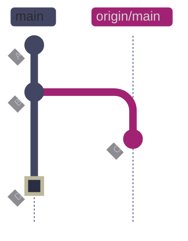
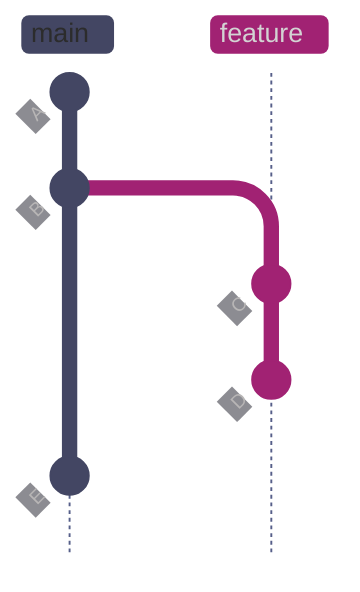
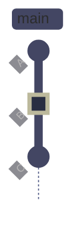
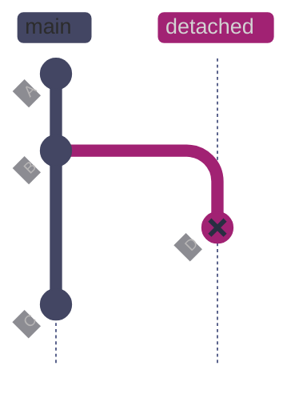
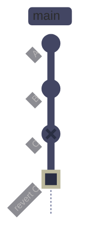

# Git Common Errors & How to Fix Them

> [!quote]
> "It's one of those things where if things are just instant, some mistake happens, you see the result immediately and you just go on and you fix it."
>
> -- **Linus Torvalds**, Git mailing list

> [!abstract]- Summary
>
> Catalogs common Git and GitHub errors as diagnostic patterns, pairing each message with root cause, verification steps, safe remediation, and prevention guidance for daily collaborative development.
>
> **Repository and synchronization errors**
> - Covers push rejection, missing remotes, bad tracking relationships, shallow-clone limits, and other remote-state mismatches that show up when local and server history no longer align
> - Explains branch and `HEAD` state errors separately so detached work, missing refs, and checkout confusion are diagnosed as pointer problems rather than as file corruption
>
> **Integration, file, and auth failures**
> - Walks through merge and conflict errors, file and commit mistakes, configuration drift, authentication issues, and CI/CD failures with a repeatable fix-first-then-prevent pattern
> - Connects each message to the Git object or workflow state that actually caused it, which is the key to avoiding random trial-and-error commands
>
> **Operational prevention**
> - Adds data-engineering-specific failures, preventive practices, and troubleshooting heuristics that reduce repeat incidents in repositories containing pipelines, migrations, notebooks, and automation
> - Turns the note into a fast lookup reference when an error blocks progress and the user needs the safe fix without scanning multiple other Git notes first
>
> **Operations and safety**
> - Warnings: forceful commands offered as shortcuts, auth fixes that leak secrets, and CI or shallow-clone problems that look similar but require different remediation paths
> - Recommendations: diagnose state before editing history, fetch and inspect refs before forceful operations, and use the paired prevention guidance after every fix
> - Troubleshooting: push/remote, branch/HEAD, merge/conflict, file/commit, config/auth, shallow-clone, CI/CD, and data-engineering-specific error classes

> [!note]- Glossary
>
> **fast-forward**
> - A merge where the target branch tip is a direct ancestor of the source branch tip. Git moves the pointer forward without creating a merge commit.
> - It matters in this note because the workflows for error diagnosis, safe remediation, and repeat prevention read or change this part of Git's state directly, and misunderstanding it leads to the wrong command or the wrong safety assumption.
>
> > [!warning] Pointer semantics matter
> >
> > Git stores this as reference state rather than as a second copy of files. Many confusing behaviors come from moving refs while file contents stay the same.
>
> ---
>
> **non-fast-forward**
> - A push or merge where the target has diverged — its tip is not an ancestor of the source. Git rejects the operation to prevent overwriting commits.
> - It matters in this note because the workflows for error diagnosis, safe remediation, and repeat prevention read or change this part of Git's state directly, and misunderstanding it leads to the wrong command or the wrong safety assumption.
>
> > [!info] Operational nuance
> >
> > Treat this as a concrete Git object, state, or workflow term rather than as a loose synonym. The commands in the note behave differently depending on this exact meaning.
>
> ---
>
> **remote-tracking ref**
> - A read-only local pointer (e.g., `origin/main`) that mirrors the last-known state of a remote branch. Updated by `git fetch`.
> - It matters in this note because the workflows for error diagnosis, safe remediation, and repeat prevention read or change this part of Git's state directly, and misunderstanding it leads to the wrong command or the wrong safety assumption.
>
> > [!warning] Pointer semantics matter
> >
> > Git stores this as reference state rather than as a second copy of files. Many confusing behaviors come from moving refs while file contents stay the same.
>
> ---
>
> **detached HEAD**
> - A state where HEAD points directly at a commit SHA instead of a branch name. Commits made in this state are not on any branch and risk becoming orphaned.
> - It matters in this note because the workflows for error diagnosis, safe remediation, and repeat prevention read or change this part of Git's state directly, and misunderstanding it leads to the wrong command or the wrong safety assumption.
>
> > [!warning] History rewrite risk
> >
> > This changes or depends on rewritten history. Verify branch ownership and remote state before using the destructive variant of any related command.
>
> ---
>
> **orphaned commit**
> - A commit reachable only through the reflog, not through any branch or tag. Git garbage-collects orphaned commits after approximately 90 days.
> - It matters in this note because the workflows for error diagnosis, safe remediation, and repeat prevention read or change this part of Git's state directly, and misunderstanding it leads to the wrong command or the wrong safety assumption.
>
> > [!warning] History rewrite risk
> >
> > This changes or depends on rewritten history. Verify branch ownership and remote state before using the destructive variant of any related command.
>
> ---
>
> **reflog**
> - A local log of every position HEAD and branch tips have occupied. The safety net for recovering lost commits, aborted rebases, and accidental resets.
> - It matters in this note because the workflows for error diagnosis, safe remediation, and repeat prevention read or change this part of Git's state directly, and misunderstanding it leads to the wrong command or the wrong safety assumption.
>
> > [!warning] History rewrite risk
> >
> > This changes or depends on rewritten history. Verify branch ownership and remote state before using the destructive variant of any related command.
>
> ---
>
> **lock file**
> - A `.lock` file Git creates in `.git/` to prevent concurrent writes to refs or the index. Left behind if a Git process crashes.
> - It matters in this note because the workflows for error diagnosis, safe remediation, and repeat prevention read or change this part of Git's state directly, and misunderstanding it leads to the wrong command or the wrong safety assumption.
>
> > [!info] Operational nuance
> >
> > Treat this as a concrete Git object, state, or workflow term rather than as a loose synonym. The commands in the note behave differently depending on this exact meaning.
>
> ---
>
> **force-push**
> - Overwrites the remote branch tip unconditionally (`--force`) or conditionally (`--force-with-lease`). Rewrites shared history if others have pulled the original commits.
> - It matters in this note because the workflows for error diagnosis, safe remediation, and repeat prevention ask you to choose or interpret this operation deliberately instead of treating nearby Git commands as interchangeable.
>
> > [!warning] History rewrite risk
> >
> > This changes or depends on rewritten history. Verify branch ownership and remote state before using the destructive variant of any related command.
>
> ---
>
> **rebase**
> - Replays commits onto a new base, creating new SHAs. The original commits become orphaned. Produces a linear history but rewrites commit identity.
> - It matters in this note because the workflows for error diagnosis, safe remediation, and repeat prevention ask you to choose or interpret this operation deliberately instead of treating nearby Git commands as interchangeable.
>
> > [!warning] History rewrite risk
> >
> > This changes or depends on rewritten history. Verify branch ownership and remote state before using the destructive variant of any related command.
>
> ---
>
> **conflict marker**
> - Text delimiters (`<<<<<<<`, `=======`, `>>>>>>>`) Git inserts into a file when it cannot automatically merge two changes to the same lines.
> - It matters in this note because the workflows for error diagnosis, safe remediation, and repeat prevention read or change this part of Git's state directly, and misunderstanding it leads to the wrong command or the wrong safety assumption.
>
> > [!warning] Context changes meaning
> >
> > Conflict-related terminology depends on workflow context. Resolve whether you are merging, rebasing, or replaying history before choosing a command.
>
> ---
>
> **stash**
> - A stack of saved working-tree and index snapshots. Used to temporarily shelve uncommitted changes without committing them.
> - It matters in this note because the workflows for error diagnosis, safe remediation, and repeat prevention ask you to choose or interpret this operation deliberately instead of treating nearby Git commands as interchangeable.
>
> > [!info] Operational nuance
> >
> > Treat this as a concrete Git object, state, or workflow term rather than as a loose synonym. The commands in the note behave differently depending on this exact meaning.
>
> ---
>
> **index (staging area)**
> - The intermediate layer between the working tree and the repository. `git add` writes to the index; `git commit` records the index as a new commit.
> - It matters in this note because the workflows for error diagnosis, safe remediation, and repeat prevention ask you to choose or interpret this operation deliberately instead of treating nearby Git commands as interchangeable.
>
> > [!info] Operational nuance
> >
> > Treat this as a concrete Git object, state, or workflow term rather than as a loose synonym. The commands in the note behave differently depending on this exact meaning.
>
> ---
>
> **pathspec**
> - A pattern Git uses to match files or refs. An invalid pathspec means Git found no matching file, branch, or tag for the argument provided.
> - It matters in this note because the workflows for error diagnosis, safe remediation, and repeat prevention read or change this part of Git's state directly, and misunderstanding it leads to the wrong command or the wrong safety assumption.
>
> > [!danger] Security boundary
> >
> > This term touches authentication, identity, or trust. Treat it as secret or policy material rather than as ordinary repository metadata.
>
> ---
>
> **shallow clone**
> - A clone with truncated history (`--depth N`). Saves bandwidth but limits blame, log, bisect, and merge-base operations.
> - It matters in this note because the workflows for error diagnosis, safe remediation, and repeat prevention ask you to choose or interpret this operation deliberately instead of treating nearby Git commands as interchangeable.
>
> > [!info] Operational nuance
> >
> > Treat this as a concrete Git object, state, or workflow term rather than as a loose synonym. The commands in the note behave differently depending on this exact meaning.
>
> ---
>
> **unrelated histories**
> - Two branches that share no common ancestor commit. Git refuses to merge them by default because there is no common base to compare against.
> - It matters in this note because the workflows for error diagnosis, safe remediation, and repeat prevention read or change this part of Git's state directly, and misunderstanding it leads to the wrong command or the wrong safety assumption.
>
> > [!warning] Pointer semantics matter
> >
> > Git stores this as reference state rather than as a second copy of files. Many confusing behaviors come from moving refs while file contents stay the same.
>
> ---
>
> **autocrlf**
> - A Git configuration that controls automatic conversion between Windows line endings (CRLF) and Unix line endings (LF) during checkout and commit.
> - It matters in this note because the workflows for error diagnosis, safe remediation, and repeat prevention read or change this part of Git's state directly, and misunderstanding it leads to the wrong command or the wrong safety assumption.
>
> > [!info] Policy layer
> >
> > This term usually belongs to shared repository policy or machine defaults. Fixing it locally can hide the real team-wide setting if you do not check the whole policy chain.
>
> ---
>
> **filter-repo**
> - A third-party tool (`git-filter-repo`) for rewriting Git history. Used to purge large files or secrets from all commits. Replaces the deprecated `git filter-branch`.
> - It matters in this note because the workflows for error diagnosis, safe remediation, and repeat prevention read or change this part of Git's state directly, and misunderstanding it leads to the wrong command or the wrong safety assumption.
>
> > [!danger] Security boundary
> >
> > This term touches authentication, identity, or trust. Treat it as secret or policy material rather than as ordinary repository metadata.

> [!example] Error Triage Fit
>
> > [!success] Appropriate
> >
> > - Use this note when triaging a real Git or GitHub error message, training on common failure classes, or verifying the least-destructive fix before running a command.
> > - Use it when the safe path depends on matching the exact message to the underlying pointer, remote, auth, merge, or CI state that caused it.
> > - Use it as the fast lookup reference when progress is blocked and the team needs a state-based diagnosis rather than guesswork.
>
> > [!failure] Inappropriate
> >
> > - Do not guess from a vague symptom without matching the actual message or repository state first.
> > - Do not copy destructive fixes from superficially similar errors; many Git failures look alike but require opposite remediations.
> > - Do not stop at the quick fix if the same error class is recurring; the prevention guidance matters too.

## Conceptual Model

Before diving into individual errors, understanding how Git errors map to the layer they occur in helps with rapid diagnosis.

```mermaid
%%{init: {'theme': 'dark', 'themeVariables': {
  'primaryColor': '#292e42',
  'primaryTextColor': '#c0caf5',
  'primaryBorderColor': '#565f89',
  'lineColor': '#565f89',
  'secondaryColor': '#1a1b26',
  'tertiaryColor': '#24283b',
  'noteTextColor': '#c0caf5',
  'noteBkgColor': '#292e42',
  'textColor': '#c0caf5',
  'fontSize': '14px'
}}}%%
flowchart TD
    ERR["Git Error"] --> LAYER{"Which layer<br/>is affected?"}
    LAYER --> WT["Working Tree"]
    LAYER --> IDX["Staging / Index"]
    LAYER --> LOCAL["Local Commits"]
    LAYER --> REMOTE["Remote / Push"]
    LAYER --> AUTH["Auth / Config"]

    WT --> WT1["'local changes would<br/>be overwritten'"]
    WT --> WT2["'accidentally deleted<br/>a file'"]
    WT --> WT3["'LF replaced by CRLF'"]

    IDX --> IDX1["'cannot lock ref'"]
    IDX --> IDX2["'committed files that<br/>should be ignored'"]

    LOCAL --> L1["'detached HEAD'"]
    LOCAL --> L2["'committed to<br/>wrong branch'"]
    LOCAL --> L3["'committed large file'"]

    REMOTE --> R1["'non-fast-forward'"]
    REMOTE --> R2["'push rejected<br/>after rebase'"]
    REMOTE --> R3["'unrelated histories'"]

    AUTH --> A1["'permission denied<br/>publickey'"]
    AUTH --> A2["'not a git repository'"]
    AUTH --> A3["'GCP_SA_KEY missing'"]

    style WT fill:#1f3b2d,stroke:#73d13d,color:#c0caf5
    style IDX fill:#292e42,stroke:#565f89,color:#c0caf5
    style LOCAL fill:#292e42,stroke:#565f89,color:#c0caf5
    style REMOTE fill:#4a1f24,stroke:#db4b4b,color:#c0caf5
    style AUTH fill:#292e42,stroke:#565f89,color:#c0caf5
```



*Errors grouped by the Git layer they affect. Working tree errors (green) are safe — they involve only local, uncommitted state. Remote errors (red) carry the highest risk because they can affect shared history if resolved incorrectly (e.g., force-pushing to a shared branch).*

## Push and Remote Errors

Push failures occur when the local and remote branches have diverged, when authentication is misconfigured, or when the payload exceeds transport limits. Most push errors are resolved by incorporating remote changes first, then retrying. All errors in this section involve the network boundary between your local repository and the remote.

### Git | push | "rejected -- non-fast-forward"

#### Diagnose the non-fast-forward rejection

**When to run:** Immediately after a `git push` fails with `non-fast-forward`.
**Trigger:** A colleague pushed commits to the same branch after your last pull or fetch.
**Context:** Local shell. Read-only diagnosis. No state changes.
**Purpose:** Confirm that the remote has commits your local branch lacks, before deciding whether to rebase or merge.

The remote branch tip is not an ancestor of your local branch tip. Git refuses to push because it would overwrite the remote commits. This is Git's primary safety mechanism against accidental data loss on shared branches.



*Local main and origin/main diverged after commit B. Commit C was pushed by a colleague to the remote. Commit D (marked green) is your local commit. Git rejects the push because applying D would require overwriting C. The remote's tip (C) is not an ancestor of your local tip (D) — a non-fast-forward condition.*

*Trigger the error by pushing a branch that has diverged from the remote.*

```bash
git push origin demo/error-nff
```

```text
To https://github.com/alp78/git-lab.git
 ! [rejected]        demo/error-nff -> demo/error-nff (non-fast-forward)
error: failed to push some refs to 'https://github.com/alp78/git-lab.git'
hint: Updates were rejected because the tip of your current branch is behind
hint: its remote counterpart. If you want to integrate the remote changes,
hint: use 'git pull' before pushing again.
hint: See the 'Note about fast-forwards' in 'git push --help' for details.
```

#### Fix with pull --rebase

**When to run:** After confirming the push failed due to divergence, not due to permission or auth errors.
**Trigger:** The `non-fast-forward` rejection above.
**Context:** Local shell. State-changing — replays your local commits on top of the remote's latest state. May trigger conflicts if both sides modified the same lines.
**Purpose:** Incorporate the remote commits, then push your work on top of them.

> [!info]- Command breakdown
>
> - `git pull --rebase origin demo/error-nff` — fetches the remote's new commits and replays your local commits on top of them instead of creating a merge commit.
> - The `--rebase` flag avoids the "Merge branch 'X' of github.com:..." clutter commits that a regular `git pull` creates.
> - If a conflict occurs during replay, Git pauses and asks you to resolve it before continuing with `git rebase --continue`.

*Pull with rebase to replay local commits on top of remote, then push.*

```bash
git pull --rebase origin demo/error-nff
```

```text
From https://github.com/alp78/git-lab
 * branch            demo/error-nff -> FETCH_HEAD
Rebasing (1/1)Successfully rebased and updated refs/heads/demo/error-nff.
```

```bash
git push origin demo/error-nff
```

```text
To https://github.com/alp78/git-lab.git
   909de74..732e079  demo/error-nff -> demo/error-nff
```

#### Fix with fetch and rebase (explicit two-step)

For more control, separate the fetch and rebase steps. This lets you inspect remote changes before replaying your commits.

*Fetch remote refs without modifying the working tree.*

```bash
git fetch origin
```

*Rebase your local commits on top of the fetched remote state.*

```bash
git rebase origin/main
```

*Push after rebase succeeds.*

```bash
git push
```

### Git | push | "rejected after rebase"

#### Diagnose the post-rebase rejection

**When to run:** After rebasing a branch that was already pushed to the remote.
**Trigger:** You ran `git rebase main` (or similar) on a feature branch that already has commits on the remote.
**Context:** Local shell. Diagnosis only.
**Purpose:** Understand why Git rejects the push after a rebase.

Rebase rewrites commit SHAs by replaying each commit with a new parent. The remote still has the original commits with the old SHAs. Git sees a divergence between the rewritten local history and the original remote history, and rejects the push as non-fast-forward.



*Before rebase: the feature branch diverged from main at B. Commits C and D are on feature, commit E is on main. After `git rebase main`, commits C and D are replayed as C' and D' on top of E with new SHAs — the diffs are identical but the SHAs change because each commit now has a different parent. The remote still has the original C and D, so Git sees a non-fast-forward divergence between the local (C', D') and remote (C, D) histories and rejects a normal push.*

#### Fix with force-with-lease

**When to run:** After a rebase has completed successfully and the normal push is rejected.
**Trigger:** The `non-fast-forward` rejection on a rebased branch.
**Context:** Local shell. **State-changing and potentially destructive** — overwrites the remote branch history. Only safe on branches where you are the sole contributor.
**Purpose:** Overwrite the remote branch with the rebased history, using a safety check.

> [!info]- Command breakdown
>
> - `--force-with-lease` overwrites the remote branch only if no one else has pushed since your last fetch. It compares your local remote-tracking ref against the actual remote tip.
> - Unlike `--force` (which overwrites unconditionally), `--force-with-lease` aborts if a colleague pushed in the meantime, preventing you from silently destroying their work.

*Force-push the rebased branch with the lease safety check.*

```bash
git push --force-with-lease
```

> [!danger] Never force-push to main or shared branches
>
> `git push --force` (and even `--force-with-lease`) rewrites the remote branch history. If other developers have pulled the original commits, their histories will diverge and require manual intervention to fix.

> [!success] Limit force-push to your own feature branches
>
> Only force-push to branches where you are the sole contributor. For shared branches, use `git revert` instead of rebase to undo changes without rewriting history.

### Git | push | "updates were rejected"

This is functionally identical to the non-fast-forward error but uses different wording depending on Git version and transport protocol. The fix is the same: incorporate remote changes before pushing.

*Fetch, rebase onto remote, then push.*

```bash
git fetch origin
```

```bash
git rebase origin/main
```

```bash
git push
```

### Git | pull | "Your branch is behind origin/main"

#### Update local branch to match remote

**When to run:** When `git status` reports your branch is behind the remote-tracking ref.
**Trigger:** A colleague pushed changes after your last `git fetch` or `git pull`.
**Context:** Local shell. State-changing — integrates remote commits into your branch.
**Purpose:** Bring your local branch up to date with the remote.

The message compares your local branch pointer against the remote-tracking ref (`origin/main`), which was updated by your last fetch. Your local branch has fewer commits than the remote.

*Pull the latest changes from the remote.*

```bash
git pull origin main
```

`git pull` is shorthand for `git fetch` (download remote commits and update `origin/main`) followed by `git merge` (integrate them into your local branch). If you prefer a linear history without merge commits, use `git pull --rebase` instead.

### Git | pull | "results in merge commits I don't want"

#### Configure rebase-on-pull

**When to run:** When `git pull` creates unwanted merge commits like "Merge branch 'main' of github.com:...".
**Trigger:** Your local branch and the remote have diverged, and `git pull` performs a merge by default.
**Context:** Local shell. State-changing — rewrites how future pulls integrate changes.
**Purpose:** Eliminate merge-commit clutter by replaying local commits on top of remote changes.

*Pull with rebase instead of merge.*

```bash
git pull --rebase origin main
```

`--rebase` replays your local commits on top of the fetched changes instead of creating a merge commit. The result is a linear history.

*Make rebase the default for all future pulls.*

```bash
git config --global pull.rebase true
```

### Git | push | "remote end hung up unexpectedly" (large push)

#### Increase the HTTP buffer

**When to run:** When a push fails with "remote end hung up unexpectedly" or "RPC failed; HTTP 413".
**Trigger:** Pushing a repository with large files, a large initial push, or extensive binary assets. The default HTTP POST buffer is approximately 1 MB.
**Context:** Local shell. Configuration change only — affects all future HTTP pushes.
**Purpose:** Allow Git to send larger payloads over HTTP.

*Increase the HTTP buffer size to 500 MB.*

```bash
git config --global http.postBuffer 524288000
```

> [!tip] Alternative for large files
>
> For truly large assets (datasets, model checkpoints, binary artifacts), consider adding them to `.gitignore` or using Git LFS (Large File Storage) rather than increasing the buffer. The buffer increase is a transport-layer fix, not a repository design fix.

### Git | status | "up to date but missing changes"

#### Refresh remote-tracking refs

**When to run:** When `git status` says "up to date" but you know someone pushed changes.
**Trigger:** The `git status` comparison is against the local copy of `origin/main`, not the live remote. If someone pushed after your last fetch, you will not see their changes.
**Context:** Local shell. Read-only (`git fetch` downloads but does not modify your branch).
**Purpose:** Update the local remote-tracking refs so `git status` shows the true divergence.

*Fetch to update remote-tracking refs, then check status.*

```bash
git fetch origin
```

```text
From https://github.com/alp78/git-lab
   35c16f7..732e079  demo/error-nff -> origin/demo/error-nff
```

```bash
git status
```

```text
On branch main
Your branch is ahead of 'origin/main' by 21 commits.
  (use "git push" to publish your local commits)

nothing to commit, working tree clean
```

`git fetch` downloads new commits and updates remote-tracking refs (`origin/main`, `origin/feature`, etc.) without modifying your working tree or local branches. After fetching, `git status` compares against the refreshed refs and shows the true divergence.

| Flag | Syntax | Description |
|---|---|---|
| `--all` | `git fetch --all` | Fetch from all configured remotes |
| `--prune` | `git fetch --prune` | Remove remote-tracking refs that no longer exist on the remote |
| `--tags` | `git fetch --tags` | Fetch all tags from the remote |
| `--depth N` | `git fetch --depth 1` | Limit fetch to N commits of history (shallow) |
| `--unshallow` | `git fetch --unshallow` | Convert a shallow clone to a full clone |
| `--dry-run` | `git fetch --dry-run` | Show what would be fetched without actually fetching |

## Branch and HEAD Errors

Branch errors arise from operating on the wrong branch, losing track of HEAD, or deleting branches prematurely. Most are recoverable via the reflog because Git keeps a record of every position HEAD has occupied for approximately 90 days.

### Git | checkout | "Detached HEAD"

#### Diagnose the detached HEAD state

**When to run:** Immediately after Git prints the "detached HEAD" warning.
**Trigger:** You checked out a specific commit SHA, a tag, or a remote-tracking ref instead of a branch name.
**Context:** Local shell. The working tree is safe — no data is lost yet. The risk begins when you make new commits in this state and then switch away.
**Purpose:** Understand what happened and decide whether to create a branch to preserve work.

In detached HEAD state, HEAD points directly at a commit rather than at a branch pointer. Any new commits you create are not on any branch — they become orphaned (unreachable) as soon as you switch to a named branch, and will be garbage-collected after approximately 90 days.

*Checking out a commit SHA triggers detached HEAD.*

```bash
git checkout c77ba7b
```

```text
Note: switching to 'c77ba7b'.

You are in 'detached HEAD' state. You can look around, make experimental
changes and commit them, and you can discard any commits you make in this
state without impacting any branches by switching back to a branch.

If you want to create a new branch to retain commits you create, you may
do so (now or later) by using -c with the switch command. Example:

  git switch -c <new-branch-name>

Or undo this operation with:

  git switch -

Turn off this advice by setting config variable advice.detachedHead to false

HEAD is now at c77ba7b feat: add ESG adjustment factor
```



*You ran `git checkout B` — HEAD now points directly at commit B (marked green) instead of following the main branch. Main still points at C. If you make new commits here, they won't belong to any branch.*



*You committed D (marked red) while in detached HEAD state. D is on no branch — it's reachable only through the reflog. When you switch back to main (pointing at C), commit D becomes orphaned and will be garbage-collected in approximately 90 days.*

#### Fix by creating a rescue branch

**When to run:** Before switching away from the detached HEAD, especially if you have made commits.
**Trigger:** You see "detached HEAD" and have work to preserve.
**Context:** Local shell. State-changing — creates a new branch at the current position.
**Purpose:** Anchor your commits to a named branch so they are not orphaned.

*Create a branch at the current position to rescue your commits.*

```bash
git switch -c rescue-branch
```

```text
Switched to a new branch 'rescue-branch'
```

This creates a named branch pointing at the current commit, preventing your work from becoming orphaned. You can later merge or rebase this branch into your target branch.

### Git | checkout | "HEAD detached at origin/main"

#### Switch to the local branch

**When to run:** When you see "HEAD detached at origin/main" after a checkout.
**Trigger:** You ran `git checkout origin/main` (a remote-tracking ref) instead of `git checkout main` (your local branch).
**Context:** Local shell. State-changing — moves HEAD to the local branch.
**Purpose:** Reattach HEAD to the local branch.

Remote-tracking refs like `origin/main` are read-only pointers managed by `git fetch`. Checking them out puts you in detached HEAD state because you cannot commit directly to a remote-tracking ref.

*Checking out a remote-tracking ref triggers detached HEAD.*

```bash
git checkout origin/main
```

```text
Note: switching to 'origin/main'.

You are in 'detached HEAD' state. You can look around, make experimental
changes and commit them, and you can discard any commits you make in this
state without impacting any branches by switching back to a branch.

If you want to create a new branch to retain commits you create, you may
do so (now or later) by using -c with the switch command. Example:

  git switch -c <new-branch-name>

Or undo this operation with:

  git switch -

Turn off this advice by setting config variable advice.detachedHead to false

HEAD is now at 35c16f7 ops: set log level to INFO for production
```

*Switch to the local branch.*

```bash
git switch main
```

```text
Previous HEAD position was 35c16f7 ops: set log level to INFO for production
Switched to branch 'main'
Your branch is ahead of 'origin/main' by 21 commits.
  (use "git push" to publish your local commits)
```

### Git | switch | "pathspec did not match any file(s)"

#### Fetch and switch to the missing branch

**When to run:** When `git switch` or `git checkout` fails with a pathspec or invalid reference error.
**Trigger:** The branch does not exist locally. It may be a remote branch not yet fetched, or the name may be misspelled.
**Context:** Local shell. `git fetch` is read-only; `git switch` is state-changing.
**Purpose:** Make the remote branch available locally.

Git searches local branches first, then local files. If neither matches, it reports the pathspec error. `git switch` can automatically create a local tracking branch if a matching remote branch exists after fetching.

*Attempt to switch to a branch that does not exist locally.*

```bash
git switch nonexistent-branch
```

```text
fatal: invalid reference: nonexistent-branch
```

*Fetch remote branches, then retry.*

```bash
git fetch origin
```

```bash
git switch branch-name
```

If the branch exists on the remote, `git switch` automatically creates a local tracking branch. If the branch does not exist anywhere, check for typos with `git branch -a | grep <partial-name>`.

### Git | commit | "Committed to wrong branch"

#### Move the commit to the correct branch

**When to run:** Immediately after realizing you committed to the wrong branch.
**Trigger:** You made commits on `main` (or another branch) instead of your intended feature branch.
**Context:** Local shell. State-changing — uses `git reset --soft` to undo the commit and move changes via stash. Only safe if the commit has not been pushed.
**Purpose:** Move the commit's changes to the correct branch without losing any work.

> [!todo] Move the last commit to the correct branch
>
> 1. Note the commit SHA: `git log --oneline -1`
> 2. Undo the commit but keep changes staged: `git reset --soft HEAD~1`
> 3. Shelve the staged changes: `git stash`
> 4. Switch to the correct branch: `git switch correct-branch`
> 5. Restore the changes: `git stash pop`
> 6. Recommit: `git commit -m "my message"`

*Confirm the accidental commit.*

```bash
git log --oneline -1
```

```text
6007744 add todo note
```

*Undo the commit, keeping changes staged.*

```bash
git reset --soft HEAD~1
```

`git reset --soft HEAD~1` moves HEAD back one commit. The `--soft` flag keeps all changes in the staging area — nothing is lost from the working tree or index. Only the commit itself is undone.

*Stash the staged changes.*

```bash
git stash
```

```text
Saved working directory and index state WIP on main: 4c70591 Revert "set timeout to 120"
```

*Switch to the correct branch.*

```bash
git switch feat/data-quality-checks
```

```text
Switched to branch 'feat/data-quality-checks'
Your branch is up to date with 'origin/feat/data-quality-checks'.
```

*Restore the stashed changes.*

```bash
git stash pop
```

```text
On branch feat/data-quality-checks
Your branch is up to date with 'origin/feat/data-quality-checks'.

Changes to be committed:
  (use "git restore --staged <file>..." to unstage)
	new file:   todo-note.txt

Dropped refs/stash@{0} (b1d127990131bbdf443cfa3c8b13d7c09ab318c9)
```

*Recommit on the correct branch.*

```bash
git commit -m "add todo note"
```

```text
[feat/data-quality-checks 276b559] add todo note
 1 file changed, 1 insertion(+)
 create mode 100644 todo-note.txt
```

### Git | branch | "Squash merge shows branch as not merged"

#### Force-delete the squash-merged branch

**When to run:** After squash-merging a PR, when `git branch -d` refuses to delete the source branch.
**Trigger:** You ran `git branch -d feature-branch` and Git warns the branch is not fully merged.
**Context:** Local shell. State-changing — deletes the local branch.
**Purpose:** Remove the source branch now that its changes are on the target via the squash commit.

Squash merge creates a single new commit on the target branch with a different SHA than the original branch commits. Git's merge check compares commit SHAs — since the squashed commit has a new SHA, Git does not recognize the branch as merged, even though all the changes are on the target.

*Attempt to delete the squash-merged branch.*

```bash
git branch -d demo/squash-test
```

```text
error: the branch 'demo/squash-test' is not fully merged
hint: If you are sure you want to delete it, run 'git branch -D demo/squash-test'
hint: Disable this message with "git config set advice.forceDeleteBranch false"
```

This warning is cosmetic. The changes are on `main` as the squashed commit. Safe to force-delete.

*Force-delete the branch.*

```bash
git branch -D demo/squash-test
```

```text
Deleted branch demo/squash-test (was 3c9e531).
```

### Git | branch | "Deleted branch before squash-merging the PR"

#### Restore the branch and reopen the PR

**When to run:** After accidentally deleting the branch before the PR was merged.
**Trigger:** The branch was deleted locally and/or remotely, and the PR auto-closed.
**Context:** Local and remote. State-changing — recreates the branch and reopens the PR.
**Purpose:** Restore the branch so the PR can be merged normally.

> [!todo] Restore the branch and reopen the PR
>
> 1. Find the SHA from the deletion message or reflog: `git reflog | grep feat/my-feature`
> 2. Recreate the branch: `git branch feat/my-feature <sha>`
> 3. Push it back to the remote: `git push origin feat/my-feature`
> 4. Reopen the PR: `gh pr reopen 26`

*Find the SHA of the deleted branch tip.*

```bash
git reflog | grep feat/my-feature
```

*Recreate the branch at the found SHA.*

```bash
git branch feat/my-feature ec9ff69
```

*Push the branch back to the remote.*

```bash
git push origin feat/my-feature
```

*Reopen the closed PR.*

```bash
gh pr reopen 26
```

If `git push` says "Everything up-to-date", the remote may still have a stale ref. Force-create the remote ref from the SHA:

```bash
git push origin ec9ff69:refs/heads/feat/my-feature
```

> [!tip] Safe deletion order
>
> Always merge/squash the PR on GitHub first, then delete the branch. GitHub's "Delete branch" button after merge is the safest workflow — it only appears after the merge is complete.

## Merge and Conflict Errors

Merge errors occur when Git cannot automatically combine changes from two branches. Conflicts require manual resolution; other merge errors stem from missing common ancestors or uncommitted local changes blocking the operation.

### Git | merge | "Merge conflict in filename"

#### Resolve merge conflicts

**When to run:** When a merge, rebase, cherry-pick, or stash pop reports conflicts.
**Trigger:** Both branches modified the same lines in the same file. Git cannot determine which version to keep.
**Context:** Local shell. State-changing — requires editing conflicted files, staging, and committing.
**Purpose:** Manually resolve the conflicting changes and complete the merge.

Git inserts conflict markers into the file and pauses the merge for manual resolution.

*Trigger a merge conflict by merging branches that modified the same file.*

```bash
git merge demo/error-conflict
```

```text
Auto-merging config.ini
CONFLICT (add/add): Merge conflict in config.ini
Automatic merge failed; fix conflicts and then commit the result.
```

*The conflict markers in the file.*

```text
<<<<<<< HEAD
timeout = 120
=======
timeout = 30
>>>>>>> demo/error-conflict
```

Everything between `<<<<<<< HEAD` and `=======` is your change (the current branch). Everything between `=======` and `>>>>>>>` is the incoming change (the branch being merged).

*After editing the file to resolve the conflict, stage and commit.*

```bash
git add config.ini
```

```bash
git commit
```

```text
[main 7bcb500] merge: resolve timeout conflict
```

Git auto-generates a merge commit message. See [git-merge-conflicts](https://alp78.github.io/elysium/08-Git/10-git-merge-conflicts) for detailed conflict resolution strategies including VS Code merge editor, `--ours`/`--theirs` shortcuts, and multi-file conflict workflows.

### Git | merge | "refusing to merge unrelated histories"

#### Allow unrelated histories

**When to run:** When `git pull` or `git merge` fails with "refusing to merge unrelated histories".
**Trigger:** The two branches have no common ancestor commit. Typically happens when you initialized a repository locally with `git init` and also created a separate repository on GitHub with a README — the two repos have independent histories.
**Context:** Local shell. State-changing — creates a merge commit combining both histories.
**Purpose:** Combine two independent histories into one.

*Attempt to pull from a repo with no common ancestor.*

```bash
git pull other main
```

```text
From C:/Users/aperi/DEV/git-lab
 * branch            main       -> FETCH_HEAD
 * [new branch]      main       -> other/main
fatal: refusing to merge unrelated histories
```

*Allow unrelated histories to be merged.*

```bash
git pull origin main --allow-unrelated-histories
```

`--allow-unrelated-histories` tells Git to proceed even though the two histories share no common ancestor. You may need to resolve conflicts in the resulting merge.

### Git | merge | "CONFLICT (modify/delete)"

#### Resolve a modify/delete conflict

**When to run:** During a merge or rebase when one branch modified a file while the other deleted it.
**Trigger:** Git reports `CONFLICT (modify/delete)` and pauses the operation.
**Context:** Local shell. State-changing — you must choose whether to keep or delete the file.
**Purpose:** Explicitly resolve the ambiguity by choosing one outcome.

To accept the deletion:

```bash
git rm filename.py
```

To keep the file (resolve content manually first):

```bash
git add filename.py
```

Then continue the operation:

```bash
git merge --continue
```

Or if rebasing:

```bash
git rebase --continue
```

### Git | merge/checkout | "local changes would be overwritten"

#### Stash uncommitted changes before the operation

**When to run:** When a merge, checkout, pull, or switch refuses because you have uncommitted changes in files the operation needs to modify.
**Trigger:** Git detects uncommitted changes that would be silently overwritten.
**Context:** Local shell. State-changing — stash saves and restores working-tree state.
**Purpose:** Temporarily shelve your changes so the operation can proceed, then restore them.

*Attempt to switch branches with uncommitted changes.*

```bash
git switch feat/airflow-dags
```

```text
error: Your local changes to the following files would be overwritten by checkout:
	config.ini
Please commit your changes or stash them before you switch branches.
Aborting
```

*Stash the changes, switch, then restore.*

```bash
git stash
```

```text
Saved working directory and index state WIP on main: 7bcb500 merge: resolve timeout conflict
```

```bash
git switch feat/airflow-dags
```

```text
Switched to branch 'feat/airflow-dags'
```

```bash
git switch main
```

```bash
git stash pop
```

```text
On branch main

Changes not staged for commit:
  (use "git add <file>..." to update what will be committed)
  (use "git restore <file>..." to discard changes in working directory)
	modified:   config.ini

Dropped refs/stash@{0} (c272ea07c5c80ce17f58c431f0c1019e8b56235c)
```

Alternatively, if the changes are not needed, use `git restore <file>` to discard them.

## File and Commit Errors

These errors involve accidentally committing the wrong content — wrong files, large files, missing files, or commits that need to be undone after pushing.

### Git | restore | "Accidentally deleted a file"

#### Restore a deleted tracked file

**When to run:** When a tracked file was deleted from the working tree (manually or by a script) but the deletion has not been committed.
**Trigger:** `git status` shows the file as `deleted` in unstaged changes.
**Context:** Local shell. State-changing — copies the file from HEAD back into the working tree.
**Purpose:** Recover the file without affecting the staging area or other files.

*Check the status to confirm the deletion.*

```bash
git status src/__init__.py
```

```text
On branch main

Changes not staged for commit:
  (use "git add/rm <file>..." to update what will be committed)
  (use "git restore <file>..." to discard changes in working directory)
	deleted:    src/__init__.py

no changes added to commit (use "git add" and/or "git commit -a")
```

*Restore the file from the last commit.*

```bash
git restore src/__init__.py
```

This copies the file from HEAD back into the working tree. The staging area and other files are not affected. To restore a file from a specific commit instead of HEAD, use `git restore --source <commit> <file>`.

### Git | revert | "Need to undo a push"

#### Revert a pushed commit

**When to run:** When you need to undo a pushed commit on a shared branch without rewriting history.
**Trigger:** A bad commit was pushed and needs to be undone. The branch is shared, so `git reset` cannot be used.
**Context:** Local shell + remote push. State-changing — creates a new commit that inverts the original. Safe for shared branches.
**Purpose:** Undo the changes from a specific commit while preserving the commit in history.

`git revert` creates a new commit that is the exact inverse of the target commit — it undoes the changes without rewriting history. This is safe on shared branches because it adds a commit rather than removing one.



*`git revert C` creates a new commit (marked green) that undoes C's changes. The original commit C (marked red) remains in history — revert is a forward-moving operation, not history rewriting. Safe for shared branches.*

*Revert the last commit.*

```bash
git revert 116dfd8 --no-edit
```

```text
[main 4c70591] Revert "set timeout to 120"
 Date: Sun Apr 12 19:06:50 2026 +0200
 1 file changed, 1 deletion(-)
 delete mode 100644 config.ini
```

*Push the revert commit.*

```bash
git push
```

> [!tip] Revert vs Reset
>
> - **`git revert`** — use for pushed commits on shared branches. Creates a new commit. Safe.
> - **`git reset`** — use for unpushed commits on your own branch. Moves the branch pointer backward. Rewrites history.

### Git | commit | "Accidentally committed a large file"

#### Remove a large file from the last commit

**When to run:** When a large binary or data file was committed and needs to be removed before pushing.
**Trigger:** GitHub rejects pushes containing files over 100 MB, or you notice a large file was accidentally staged.
**Context:** Local shell. State-changing — rewrites the last commit.
**Purpose:** Remove the large file from tracking while keeping it on disk.

*Undo the commit, keeping changes staged.*

```bash
git reset --soft HEAD~1
```

*Add the file to `.gitignore`, then remove it from the index without deleting it from disk.*

```bash
git rm --cached large_file.csv
```

The `--cached` flag removes the file from the index (staging area) only — the file remains in the working tree.

*Recommit without the large file.*

```bash
git commit -m "remove large file from tracking"
```

> [!warning] Large files persist in Git history
>
> `git rm --cached` removes the file from the current commit but does not erase it from previous commits in Git history. If the file exceeds GitHub's 100 MB limit, the push will still be rejected because the file exists in an earlier commit.

> [!success] Purge from all history with filter-repo
>
> Use `git-filter-repo` to remove the file from every commit in history: `git filter-repo --invert-paths --path large_file.csv`. Then force-push the cleaned history. For future large files, use Git LFS to store them outside the repository while tracking pointers.

### Git | commit | "Forgot to include a file in the last commit"

#### Amend the commit to include the missing file

**When to run:** Immediately after committing, when you realize a file was not staged.
**Trigger:** You committed and either have not pushed yet (safe amend) or have pushed (requires force-push).
**Context:** Local shell. State-changing — rewrites the last commit SHA.
**Purpose:** Add the missing file to the existing commit instead of creating a separate commit.

> [!todo] Amend the commit and force-push
>
> 1. Stage the missing file: `git add .gitignore`
> 2. Amend the previous commit: `git commit --amend --no-edit`
> 3. Force-push (only if already pushed): `git push --force-with-lease`

*Stage the missing file.*

```bash
git add .gitignore
```

*Amend the previous commit to include the newly staged file.*

```bash
git commit --amend --no-edit
```

`--amend` rewrites the last commit to include the newly staged file. `--no-edit` keeps the original commit message.

*Force-push if the original commit was already pushed.*

```bash
git push --force-with-lease
```

> [!warning] Only amend your own feature branch
>
> Amending rewrites the commit SHA. If others have pulled the original commit, their histories will diverge.

> [!success] Amend before pushing to avoid force-push
>
> If you have not pushed yet, `git commit --amend` is safe and requires no force-push. Only amend pushed commits on branches where you are the sole contributor.

### Git | rm | "Accidentally committed files that should be ignored"

#### Stop tracking files that should be in .gitignore

**When to run:** When files that should have been in `.gitignore` (binaries, secrets, build artifacts, logs) were committed and pushed.
**Trigger:** You notice tracked files that should not be in the repository. `.gitignore` only prevents untracked files from being staged — files already committed continue to be tracked even after adding them to `.gitignore`.
**Context:** Local shell + remote push. State-changing — removes files from Git tracking.
**Purpose:** Stop tracking the files going forward while keeping them on disk.

*Add the paths to `.gitignore`.*

```bash
echo "docs/logos/" >> .gitignore
echo "*.log" >> .gitignore
```

*Remove the files from Git's index but keep them on disk.*

```bash
git rm -r --cached docs/logos/
```

The `--cached` flag removes from the index (staging area) only. The `-r` flag allows recursive removal of directories. Files remain in the working tree.

*Commit and push the change.*

```bash
git add .gitignore
```

```bash
git commit -m "chore: stop tracking logos, add to .gitignore"
```

```bash
git push
```

> [!danger] Secrets in Git history require immediate action
>
> `git rm --cached` does not erase files from previous commits. If you committed secrets (API keys, passwords, service account JSON), they remain accessible in Git history to anyone with repo access — even after removal from the current commit.

> [!success] Purge secrets from all history
>
> Use `git-filter-repo` or [BFG Repo-Cleaner](https://rtyley.github.io/bfg-repo-cleaner/) to remove secrets from every commit, then force-push. **Rotate all exposed credentials immediately** — assume they are compromised the moment they were pushed.

## Configuration and Authentication Errors

These errors stem from misconfigured Git settings, missing SSH keys, or corrupted repository state rather than from branch or merge operations.

### Git | status | "fatal: not a git repository"

#### Navigate to the correct repository

**When to run:** When any Git command fails with "not a git repository".
**Trigger:** Your shell's working directory does not contain a `.git` folder. This can also happen if the `.git` directory was accidentally deleted, the path is on a network drive that disconnected, or you are in a subdirectory outside the repo.
**Context:** Local shell. No Git state involved — this is a filesystem navigation issue.
**Purpose:** Find and navigate to the correct repository directory.

*Running a Git command outside a repository.*

```bash
git status
```

```text
fatal: not a git repository (or any of the parent directories): .git
```

*Navigate to the correct repository directory.*

```bash
cd /path/to/your/repo
```

```bash
git status
```

If unsure where the repo is, search for `.git` directories: `find ~ -name .git -type d -maxdepth 4`.

### Git | push | "Permission denied (publickey)"

#### Diagnose and fix SSH authentication

**When to run:** When Git operations over SSH fail with "Permission denied (publickey)".
**Trigger:** Your SSH key is not configured, not added to the SSH agent, or not registered with your GitHub account.
**Context:** Local shell. Involves SSH agent and GitHub account configuration.
**Purpose:** Establish SSH authentication so Git can connect to the remote.

Git over SSH requires a key pair — the private key on your machine, the public key registered with GitHub.

*Test the SSH connection to GitHub.*

```bash
ssh -T git@github.com
```

```text
git@github.com: Permission denied (publickey).
```

*Check which keys the SSH agent has loaded.*

```bash
ssh-add -l
```

```text
Could not open a connection to your authentication agent.
```

If no keys are listed or the agent is not running, generate a new key pair and add the public key to GitHub under **Settings > SSH and GPG Keys**:

*Generate an Ed25519 SSH key.*

```bash
ssh-keygen -t ed25519 -C "your@email.com"
```

*Start the SSH agent and add the key.*

```bash
eval "$(ssh-agent -s)"
ssh-add ~/.ssh/id_ed25519
```

> [!info] HTTPS alternative
>
> If SSH is blocked by your network, switch the remote to HTTPS: `git remote set-url origin https://github.com/owner/repo.git` and authenticate with a Personal Access Token (PAT). See [git-setup-and-config](https://alp78.github.io/elysium/08-Git/01-git-setup-and-config) for full SSH and HTTPS setup instructions.

| Flag | Syntax | Description |
|---|---|---|
| `-T` | `ssh -T git@github.com` | Test SSH connection without opening a shell |
| `-v` | `ssh -vT git@github.com` | Verbose mode — shows which keys are tried and why authentication fails |
| `-l` | `ssh-add -l` | List fingerprints of all keys loaded in the agent |
| `-t ed25519` | `ssh-keygen -t ed25519` | Generate an Ed25519 key (recommended over RSA for modern systems) |
| `-C` | `ssh-keygen -C "email"` | Add a comment (typically your email) to the key for identification |

### Git | add | "warning: LF will be replaced by CRLF"

#### Configure line ending behavior

**When to run:** When Git warns about line ending conversion during `git add`.
**Trigger:** Windows uses CRLF (`\r\n`) line endings, Unix/macOS uses LF (`\n`). Git detects the mismatch and warns about auto-conversion.
**Context:** Local shell. Configuration change — affects how Git converts line endings during checkout and commit.
**Purpose:** Normalize line endings to prevent noisy diffs and merge conflicts in cross-platform teams.

*The warning on Windows when staging a file.*

```bash
git add crlf-test.txt
```

```text
warning: in the working copy of 'crlf-test.txt', LF will be replaced by CRLF the next time Git touches it
```

*On Windows — convert to CRLF on checkout, commit as LF.*

```bash
git config --global core.autocrlf true
```

*On Mac/Linux — convert CRLF to LF on commit, no conversion on checkout.*

```bash
git config --global core.autocrlf input
```

> [!tip] .gitattributes is more reliable than local config
>
> For cross-platform teams, commit a `.gitattributes` file to the repo that enforces line endings per file type:
>
> ```text
> * text=auto
> *.py text eol=lf
> *.sh text eol=lf
> *.bat text eol=crlf
> *.png binary
> ```
>
> This is tracked in the repo and applies to all clones, rather than depending on each developer's local `core.autocrlf` setting.

### Git | add/commit | "fatal: cannot lock ref" or "unable to create .lock"

#### Remove stale lock files

**When to run:** When a Git write operation fails with "cannot lock ref" or "Unable to create ... .lock".
**Trigger:** A previous Git operation crashed mid-write and left a `.lock` file behind, or another Git process (GUI client, IDE plugin, background script) is currently running against the same repository.
**Context:** Local shell. State-changing — removes a lock file. Risk: removing a lock while another process is actively writing can corrupt the repository.
**Purpose:** Clear the stale lock so Git operations can proceed.

*The error when a lock file blocks `git add`.*

```bash
git add lock-test.txt
```

```text
fatal: Unable to create 'C:/Users/aperi/DEV/git-lab/.git/index.lock': File exists.

Another git process seems to be running in this repository, e.g.
an editor opened by 'git commit'. Please make sure all processes
are terminated then try again. If it still fails, a git process
may have crashed in this repository earlier:
remove the file manually to continue.
```

> [!warning] Verify no active Git process before removing locks
>
> Deleting a lock file while another Git process is actively writing can corrupt the repository state (broken refs, incomplete index).

> [!success] Check for running Git processes first
>
> - On Linux/macOS: `ps aux | grep git`
> - On Windows: `tasklist | findstr git`
> - Only remove the lock file after confirming no Git process is active.

*Remove the stale index lock.*

```bash
rm -f .git/index.lock
```

For branch ref locks:

```bash
rm -f .git/refs/heads/branch-name.lock
```

## Shallow Clone Errors

Shallow clones (`git clone --depth N`) save bandwidth and disk space but truncate history. This limits blame, log, bisect, and merge-base operations. CI/CD pipelines commonly use shallow clones to speed up checkout times.

### Git | clone | "shallow clone limits blame and log"

#### Diagnose shallow clone limitations

**When to run:** When `git log`, `git blame`, or `git bisect` returns incomplete or unexpected results.
**Trigger:** The repository was cloned with `--depth N`, limiting history to the most recent N commits.
**Context:** Local shell. Read-only diagnosis.
**Purpose:** Determine if the limited history is causing the issue.

*A shallow clone shows only one commit.*

```bash
git clone --depth 1 https://github.com/alp78/git-lab.git /tmp/shallow-test
```

```bash
git log --oneline
```

```text
35c16f7 ops: set log level to INFO for production
```

*Blame output shows the graft boundary — all lines attributed to the single available commit.*

```bash
git blame README.md
```

```text
^35c16f7 (alp78 2026-04-12 17:55:00 +0200 1) # git-lab
^35c16f7 (alp78 2026-04-12 17:55:00 +0200 2) Sandbox repository for Git chapter demos in Elysium vault.
```

The `^` prefix on the commit SHA indicates the graft boundary — Git shows the oldest available commit, not the actual author of those lines.

#### Fix by unshallowing the clone

**When to run:** When shallow clone limitations block your work.
**Trigger:** You need full history for blame, bisect, log, or merge-base operations.
**Context:** Local shell + network. State-changing — downloads the full history.
**Purpose:** Convert the shallow clone to a full clone.

*Fetch the full history.*

```bash
git fetch --unshallow
```

```text
From https://github.com/alp78/git-lab
 * [new tag]         v0.1.0     -> v0.1.0
 * [new tag]         v0.2.0     -> v0.2.0
 * [new tag]         v0.3.0     -> v0.3.0
 * [new tag]         v1.0.0     -> v1.0.0
 * [new tag]         v1.1.0     -> v1.1.0
```

*Full log is now available.*

```bash
git log --oneline | head -5
```

```text
35c16f7 ops: set log level to INFO for production
cbcd74c merge: resolve config.py conflict — keep reduced TTL and connection limit, add retry settings
2eff67c fix: reduce cache TTL and add connection limit
eadb609 feat: update cache TTL and add retry settings
5644c58 feat: update settings for production (#8)
```

> [!warning] Shallow clones break bisect
>
> `git bisect` requires full history to binary-search for the commit that introduced a bug. On a shallow clone, bisect may return incorrect results or fail to identify the offending commit.

> [!success] Use --unshallow or increase depth
>
> If you need bisect or deep log history in CI, either use `git fetch --unshallow` after checkout, or increase the clone depth: `git clone --depth 100` provides enough history for most bisect sessions.

## CI/CD Errors

CI/CD-specific errors arise from misconfigured secrets, missing permissions, or GitHub Actions security restrictions. These errors are particularly frustrating because they appear in remote logs rather than local terminals.

### GitHub Actions | auth | "must specify exactly one of workload_identity_provider or credentials_json"

#### Diagnose and fix missing GCP secrets

**When to run:** When a GitHub Actions workflow fails at the `google-github-actions/auth` step.
**Trigger:** The `GCP_SA_KEY` repository secret is missing, empty, or inaccessible. The `${{ secrets.GCP_SA_KEY }}` expression resolves to an empty string, and the auth action fails because it receives neither authentication method.
**Context:** GitHub Actions environment + GitHub CLI locally. State-changing — sets or verifies repository secrets.
**Purpose:** Ensure the workflow has valid GCP credentials.

GitHub Actions secrets are not passed to workflows triggered from forks (including Dependabot PRs) as a security measure — this is intentional, not a bug.

*Verify the secret exists in the repository.*

```bash
gh secret list
```

If `GCP_SA_KEY` is missing, set it from the service account key file:

```bash
gh secret set GCP_SA_KEY < your-ci-key.json
```

*Re-run the failed workflow.*

```bash
gh run rerun <RUN_ID>
```

> [!warning] Fork and Dependabot workflows cannot access secrets
>
> GitHub intentionally blocks secrets from fork-triggered and Dependabot-triggered workflows to prevent secret exfiltration. The workflow will always fail in these contexts unless you use a secretless auth method.

> [!success] Use Workload Identity Federation (OIDC) for secretless auth
>
> Workload Identity Federation uses OpenID Connect tokens issued by GitHub Actions to authenticate with GCP — no stored secrets required. This eliminates secret-related failures for fork and Dependabot workflows, and removes the risk of key rotation issues.

## Data-Engineering-Specific Errors

These errors are common in data engineering workflows involving migrations, dbt, Airflow, Terraform, large datasets, and notebooks.

### Git | migrations | "Duplicate migration number after merge"

**Cause:** Two developers independently created migration files with the same sequence number on different branches. After merging, the migration runner encounters duplicate numbers and either fails or runs them in an unpredictable order.

**Diagnosis:** Check for duplicate migration numbers.

```bash
ls db/migrations/ | sort | uniq -d
```

**Prevention:**

- Use timestamp-based migration names (e.g., `20260412_1930_add_index.sql`) instead of sequential numbers. Timestamps are unique across branches.
- Configure your migration framework to use timestamps: dbt uses `{{ run_started_at }}`, Alembic supports `rev_id` based on timestamps, Django can generate timestamp-based migration files.

### Git | notebooks | "Merge conflicts in .ipynb files"

**Cause:** Jupyter notebooks are JSON files with embedded outputs (cell execution counts, images, data frames). Even if two developers edit different cells, the output metadata often creates merge conflicts because cell IDs and execution counts change.

**Prevention:**

- Install `nbstripout` as a pre-commit hook to strip outputs before committing:

```bash
pip install nbstripout
nbstripout --install
```

- Use `nbdime` for notebook-aware diff and merge:

```bash
pip install nbdime
nbdime config-git --enable --global
```

`nbdime` understands the notebook JSON structure and produces meaningful diffs at the cell level instead of raw JSON diffs.

### Git | secrets | "Accidentally committed a .env or credentials file"

**Cause:** A `.env` file, service account key, or credentials file was committed and pushed. Even after removing it from the current commit, the secret persists in Git history and is accessible to anyone who clones the repo.

> [!danger] Assume all exposed credentials are compromised
>
> Secrets pushed to any remote (even private repos) must be rotated immediately. Automated scanners and cached mirrors can capture secrets within minutes of a push.

> [!success] Response procedure for exposed secrets
>
> 1. **Rotate the credential** immediately in the source system (GCP, AWS, database, API provider).
> 2. Remove the file from tracking: `git rm --cached .env`
> 3. Add to `.gitignore`: `echo ".env" >> .gitignore`
> 4. Purge from history: `git filter-repo --invert-paths --path .env`
> 5. Force-push the cleaned history: `git push --force --all`
> 6. Notify the security team if the secret had production access.

### Git | LFS | "This exceeds GitHub's file size limit of 100 MB"

**Cause:** GitHub rejects pushes containing any single file larger than 100 MB. Common with datasets, model checkpoints, database dumps, and binary artifacts.

**Fix:** Set up Git LFS for large file types before committing them.

```bash
git lfs install
git lfs track "*.parquet"
git lfs track "*.pkl"
git lfs track "*.h5"
git add .gitattributes
```

If the file was already committed without LFS, you must rewrite history:

```bash
git filter-repo --invert-paths --path large_file.parquet
git lfs track "*.parquet"
git add .gitattributes
git commit -m "track parquet files with LFS"
```

### Git | Terraform | "State file conflicts after merge"

**Cause:** Terraform state files (`terraform.tfstate`) should never be committed to Git. If they are, merging branches with different state snapshots creates conflicts that are impossible to resolve meaningfully, because Terraform state is machine-generated and not designed for manual merging.

**Prevention:**

- Add `*.tfstate` and `*.tfstate.backup` to `.gitignore`.
- Store state in a remote backend (GCS, S3, Azure Blob, Terraform Cloud).
- Never commit Terraform state files to the repository.

## Prevention and Best Practices

Proactive configuration prevents most of the errors documented above. These settings should be applied to every repository and every developer's local configuration.

### Repository-level prevention

| Practice | Prevents | Implementation |
|---|---|---|
| `.gitignore` from day one | Tracked secrets, large files, build artifacts | Template for your stack (Python, dbt, Terraform, Node) |
| `.gitattributes` | Line ending conflicts, binary merge issues | `* text=auto`, `*.png binary`, `*.parquet binary` |
| Branch protection | Force-pushes to main, direct commits | GitHub Settings > Branches > Protection rules |
| Pre-commit hooks | Secrets, large files, linting failures | `pre-commit` framework with `detect-secrets`, `check-added-large-files` |
| Signed commits | Unauthorized commits, impersonation | `git config commit.gpgsign true` |

### Developer-level prevention

| Practice | Prevents | Command |
|---|---|---|
| Always fetch before push | Non-fast-forward rejections | `git fetch origin` before `git push` |
| Default rebase on pull | Unwanted merge commits | `git config --global pull.rebase true` |
| SSH key with agent | Permission denied errors | `ssh-add ~/.ssh/id_ed25519` in shell profile |
| Autocrlf for your OS | Line ending warnings | `git config --global core.autocrlf true` (Windows) |
| Never checkout a SHA without a branch | Detached HEAD orphaned commits | Use `git switch -c <branch> <sha>` instead of `git checkout <sha>` |

## Troubleshooting

| Failure Mode | Cause | Fix |
|---|---|---|
| Push rejected non-fast-forward | Remote has newer commits | `git pull --rebase && git push` |
| Push rejected after rebase | Rebase rewrote SHAs | `git push --force-with-lease` (own branches only) |
| Detached HEAD | Checked out SHA or tag, not branch | `git switch -c rescue-branch` |
| HEAD detached at origin/main | Checked out remote-tracking ref | `git switch main` |
| Pathspec did not match | Branch not fetched or misspelled | `git fetch && git switch branch-name` |
| Merge conflict | Same lines modified on both branches | Resolve markers, `git add`, `git commit` |
| Unrelated histories | No common ancestor | `--allow-unrelated-histories` |
| Modify/delete conflict | One side modified, other deleted | `git rm` or `git add`, then `--continue` |
| Local changes overwritten | Uncommitted changes blocking op | `git stash` then operate then `git stash pop` |
| Cannot lock ref | Stale lock from crash | Verify no process running, then `rm -f .git/index.lock` |
| Permission denied publickey | SSH key missing or not loaded | `ssh-keygen -t ed25519`, add to agent and GitHub |
| LF replaced by CRLF | Line ending mismatch | `.gitattributes` or `core.autocrlf` |
| Not a git repository | Wrong directory or missing .git | `cd /path/to/repo` |
| Committed to wrong branch | Absent-mindedness | `reset --soft`, stash, switch, pop, recommit |
| Squash merge "not merged" | Squash creates new SHA | `git branch -D feature-branch` |
| Large file rejected | File exceeds 100 MB limit | Git LFS or `git filter-repo` |
| Secrets in history | .env or key file committed | Rotate credentials, `git filter-repo`, force-push |
| Shallow clone limits | `--depth` truncated history | `git fetch --unshallow` |
| GCP auth failed in Actions | Missing secret or fork trigger | `gh secret set` or Workload Identity Federation |
| Notebook merge conflicts | JSON output metadata collisions | `nbstripout` + `nbdime` |
| Duplicate migration numbers | Parallel branch development | Timestamp-based migration names |
| Terraform state conflicts | State file committed to Git | Remote state backend, `.gitignore` for `*.tfstate` |

## Operating Guidance

1. **Read the error message.** Git error messages are precise. The hint lines tell you exactly what to do. Read them before searching online.
2. **Fetch before you push.** Running `git fetch origin` before every push prevents non-fast-forward rejections.
3. **Never force-push to shared branches.** Use `git revert` to undo pushed mistakes on main. Reserve `--force-with-lease` for your own feature branches.
4. **Stash or commit before switching.** Git will not let you switch branches with uncommitted changes that conflict. Either `git stash` or `git commit` first.
5. **Use `git switch` instead of `git checkout` for branches.** `git switch` is dedicated to branch operations and produces clearer error messages. `git checkout` is overloaded (branches, files, commits).
6. **Check the reflog for lost work.** `git reflog` records every position HEAD has occupied. If you lost commits, deleted a branch, or made a bad reset, the SHA is likely still in the reflog for up to 90 days.
7. **Always rotate exposed credentials.** If a secret was pushed to any remote — even briefly, even to a private repo — assume it is compromised and rotate it immediately.
8. **Use `.gitattributes` over `core.autocrlf`.** Repository-level line ending rules are deterministic and apply to all clones. Developer-level config is fragile.
9. **Shallow clones are for CI, not development.** If you need blame, bisect, or deep log, use a full clone or `git fetch --unshallow`.
10. **Lock files mean another process is running.** Always check for active Git processes before deleting a `.lock` file. Deleting a lock during an active write operation corrupts the repository.

## Quick Reference

| Error / Symptom | Root Cause | Fix |
|---|---|---|
| `non-fast-forward` push rejected | Remote has newer commits | `git pull --rebase && git push` |
| `updates were rejected` | Remote has commits you don't | `git fetch && git rebase origin/main && git push` |
| Push rejected after rebase | Rebase rewrote SHAs | `git push --force-with-lease` |
| `Your branch is behind origin/main` | Local outdated | `git pull origin main` |
| Unwanted merge commits on pull | `git pull` defaults to merge | `git pull --rebase` or `pull.rebase true` |
| Remote end hung up (large push) | HTTP buffer too small | `git config --global http.postBuffer 524288000` |
| `git status` says up to date | Stale fetch | `git fetch && git status` |
| Detached HEAD | Checked out commit, not branch | `git switch -c rescue-branch` |
| `HEAD detached at origin/main` | Checked out remote ref | `git switch main` |
| `pathspec did not match` | Branch not fetched | `git fetch && git switch branch-name` |
| Committed to wrong branch | — | `reset --soft`, stash, switch, pop, recommit |
| Squash merge "not merged" | Squash creates new SHA | `git branch -D feature-branch` |
| Deleted branch before PR merge | Branch gone, PR auto-closed | `git reflog` then recreate then `gh pr reopen` |
| Merge conflict | Same lines modified on both branches | Resolve markers, `git add`, `git commit` |
| `refusing to merge unrelated histories` | No common ancestor | `git pull --allow-unrelated-histories` |
| `CONFLICT (modify/delete)` | One side modified, other deleted | `git rm` or `git add`, then `--continue` |
| Local changes overwritten | Uncommitted changes blocking op | `git stash` then operate then `git stash pop` |
| Accidentally deleted a file | — | `git restore filename.py` |
| Need to undo a push | — | `git revert HEAD && git push` |
| Committed large file | — | `reset --soft`, `git rm --cached`, recommit |
| Forgot file in last commit | — | `git add`, `--amend --no-edit`, force-push |
| Committed files should be ignored | `.gitignore` added too late | `git rm -r --cached`, update `.gitignore` |
| `fatal: not a git repository` | Wrong directory | `cd /path/to/repo` |
| `Permission denied (publickey)` | SSH key missing | `ssh-keygen`, add to GitHub Settings |
| `LF will be replaced by CRLF` | Line ending mismatch | `.gitattributes` or `core.autocrlf` |
| `cannot lock ref` | Stale lock from crash | Verify no process, `rm -f .git/index.lock` |
| `google-github-actions/auth failed` | Missing secret | `gh secret set GCP_SA_KEY < key.json` |
| Shallow clone limits | `--depth` truncated history | `git fetch --unshallow` |
| Notebook merge conflicts | JSON metadata collisions | `nbstripout` + `nbdime` |
| Duplicate migration numbers | Parallel development | Timestamp-based migration names |
| Terraform state conflicts | State file in Git | Remote backend, `.gitignore` for `*.tfstate` |
| Secrets in history | Credentials committed | Rotate, `git filter-repo`, force-push |
