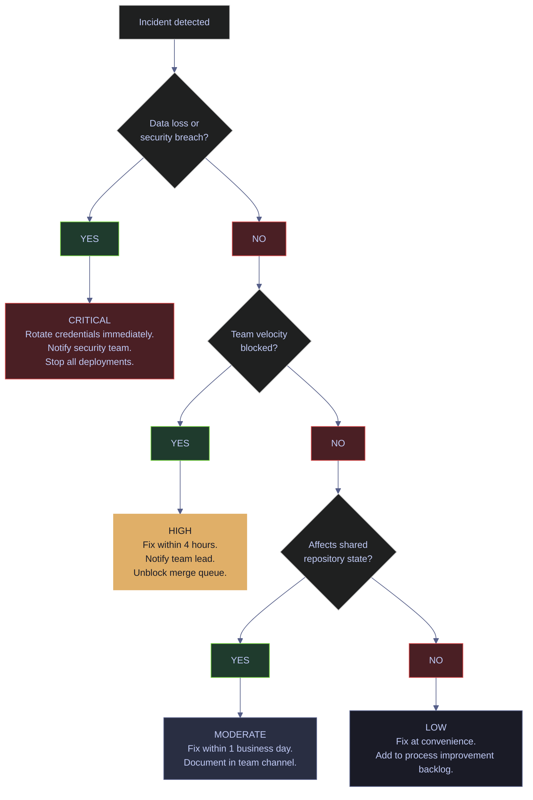
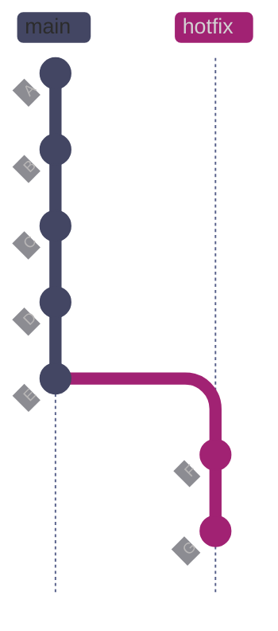
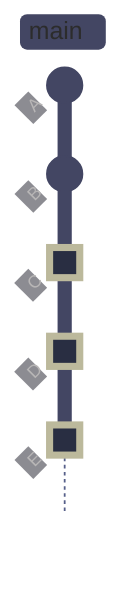
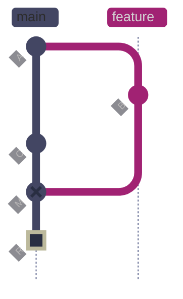
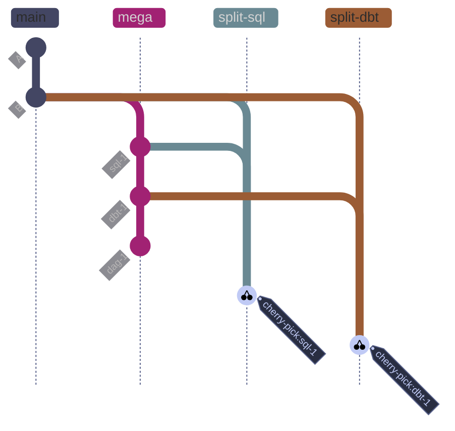
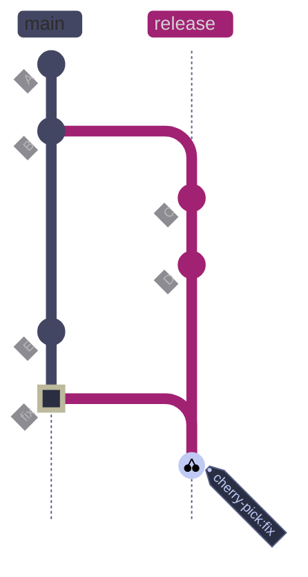

# Git and GitHub Problems in Distributed Teams

> [!quote] Linus Torvalds — Git mailing list
>
> "You must never EVER destroy other people's history. You must not rebase commits other people did. If it doesn't have your sign-off on it, it's off limits."

This page is an **incident playbook** for distributed data engineering teams. It catalogs Git and GitHub problems ranked by severity, with root cause analysis, blast radius assessment, prevention protocols, and fix procedures. The focus is on high-level incident narratives, business impact, escalation thresholds, and prevention patterns — not on the underlying Git mechanics of each command. For detailed command references, see the dedicated pages linked in each scenario.

This page is designed for a regulated financial index platform where audit trails matter (EU BMR), broken main means no index publication, and leaked credentials can expose client financial data. Every scenario is drawn from real incidents in distributed data engineering teams.

---

## Key Definitions

| Term | Definition |
|---|---|
| **blast radius** | The scope of impact from an incident — how many engineers, systems, environments, or data consumers are affected. |
| **branch protection** | GitHub repository rules that restrict who can push, force-push, or delete specific branches. Prevents direct pushes to main. |
| **credential rotation** | Revoking a compromised secret (API key, password, token) and issuing a new one. Must happen before any history cleanup. |
| **DAG** | Directed Acyclic Graph. In Git, the commit history. In Airflow, the pipeline definition. Context determines meaning. |
| **detached HEAD** | A state where HEAD points directly to a commit SHA instead of a branch ref. Commits made in this state become orphaned when you switch branches. |
| **escalation** | The process of raising an incident to a higher authority — team lead, security team, or management — based on severity. |
| **force-push** | `git push --force` replaces the remote branch tip with the local ref. Commits on the remote not in the local history become unreachable. |
| **garbage collection** | `git gc` removes unreachable objects (orphaned commits, dangling blobs) from the object store. Default retention: 90 days for reflog entries, 14 days for unreachable objects. |
| **gitGraph** | A mermaid diagram type for visualizing Git branch and commit operations. |
| **history rewriting** | Any operation that changes existing commit SHAs: rebase, amend, filter-repo, reset. Creates new commits with different hashes even if the diffs are identical. |
| **incident** | An unplanned event that disrupts or risks disrupting the normal workflow, data integrity, or security posture of the team. |
| **LFS** | Large File Storage. A Git extension that replaces large binary files with lightweight pointer files, storing the actual content on a separate server. |
| **merge debt** | The accumulated divergence between a feature branch and main. Grows with every commit to main that touches shared files. |
| **orphaned commit** | A commit not reachable from any branch or tag ref. Retained in the object store temporarily (reflog), then garbage collected. |
| **post-mortem** | A structured review after an incident. Focuses on systemic causes, not individual blame. Also called a retrospective. |
| **reflog** | Reference log. Records every movement of HEAD and branch tips locally. The safety net for recovering from resets, rebases, and detached HEAD work. Default retention: 90 days. |
| **severity** | A classification of incident impact: critical (data loss, security breach), high (team velocity, code quality), moderate (operational pain), low (annoyances). |
| **shared history** | Commits that have been pushed to a remote and may have been pulled by other engineers. Rewriting shared history causes cascading failures. |

---

## Severity Matrix

Every incident in this page is classified by severity based on blast radius, reversibility, and business impact. Use this matrix to determine the urgency of your response and whether escalation is required.



| Severity | Blast Radius | Examples | Response SLA | Escalation |
|---|---|---|---|---|
| **Critical** | Data loss, security breach, audit trail destroyed | Secrets committed, force-push to main, accidental `reset --hard` | Immediate | Security team, team lead, management |
| **High** | Team velocity blocked, code quality at risk | Broken main, long-lived branches, wrong-side merge resolution | 4 hours | Team lead |
| **Moderate** | Operational pain, individual productivity | Missing `.gitignore`, commit message anarchy, stale branches, LFS misconfiguration | 1 business day | Team channel |
| **Low** | Annoyances, culture issues | Blame culture, inconsistent Git config, PR review friction | Convenience | Process improvement backlog |

---

## First Response Protocol

> [!danger] Stop before running destructive commands
>
> Before running any destructive Git command (`reset --hard`, `push --force`, `filter-repo`, `gc --prune`), follow this checklist. Running destructive commands without thinking is how recoverable incidents become permanent data loss.

> [!success] First-response checklist
>
> 1. **Identify what happened.** Run `git status`, `git log --oneline -10`, and `git reflog -10` to understand the current state.
> 2. **Assess the blast radius.** Is this local-only (your machine), or has it affected the remote (shared with the team)?
> 3. **Do not run `git gc`.** Garbage collection permanently destroys orphaned commits. The reflog is your safety net — do not destroy it.
> 4. **Rotate credentials first** if any secret was exposed. Do not clean history before rotating. Cleaning is housekeeping; rotating is security.
> 5. **Communicate.** Post in the team channel: what happened, what branch, what is affected, what you are doing about it.
> 6. **Create a backup branch** before attempting recovery: `git branch backup/before-fix` preserves the current state.
> 7. **Escalate** if the incident matches the Critical or High severity rows in the matrix above.

---

## Critical — Data Loss and Security Breach

Incidents in this category require immediate response. They involve irreversible data loss, credential exposure, or destruction of shared history. Escalate to the security team and team lead immediately.

### Git | secrets | credentials committed to repository

#### What happens

An engineer clones a new machine, copies their GCP service account JSON into the project root for a quick test, and runs `git add . && git commit -m "wip"`. The key is now in history. They delete the file in the next commit — but the secret is still fully accessible via `git log` or `git show`. On a GitHub-hosted repo, automated bots scan for API keys within seconds of every push.

Git stores the entire working tree snapshot at every commit. Deleting a file in a subsequent commit only removes it from the working tree — the blob still exists in the object store and every clone carries it. History-rewriting tools must be used to truly expunge it, and even then every existing clone retains the data until re-cloned.

#### Blast radius

- GCP service account key exfiltrated — attacker spins up compute, exfiltrates BigQuery financial data
- SQL Server password exposed — direct access to index calculation database; potential EU BMR audit violation
- Airflow connection credentials leaked — pipeline hijacked, poisoned index outputs
- If repo ever becomes public (permissions misconfiguration), exploit happens within minutes of exposure
- Incident must be reported under GDPR/SFDR if client data was accessible via the leaked credential
- Rotating credentials during market hours disrupts live index publication pipeline

#### Prevention | pre-commit secret scanning

A `gitleaks` pre-commit hook catches secrets before they enter history. The hook runs on every `git commit` and blocks the commit if a secret pattern is detected.

*Attempt to commit a file containing a GCP service account key — gitleaks blocks the commit:*

```text
○
    │╲
    │ ○
    ○ ░
    ░    gitleaks

Finding:     ...ect_id":"bq-wh-nb","private_key_id":"REDACTED"
Secret:      REDACTED
RuleID:      generic-api-key
Entropy:     3.584963
File:        test-credentials.json
Line:        1
Fingerprint: test-credentials.json:generic-api-key:1

7:09PM INF 1 commits scanned.
7:09PM INF scanned ~83 bytes (83 bytes) in 20.4ms
7:09PM WRN leaks found: 1
```

> [!tip] Multi-layer secret scanning
>
> No single tool catches every secret pattern. Use at least two layers:
>
> - **gitleaks** (pre-commit hook) — catches secrets before they enter local history
> - **GitHub secret scanning** (server-side) — catches secrets on every push, covers 100+ cloud provider patterns
> - **detect-secrets** (optional second pre-commit hook) — Yelp's entropy-based scanner for custom patterns

#### Prevention | .gitignore for data engineering repos

A comprehensive `.gitignore` prevents accidental staging of credential files, build artifacts, and data files. Create this before the first commit in any data engineering repository.

*`.gitignore` template for data engineering repos:*

```gitignore
# Secrets & credentials
.env
.env.*
!.env.example
*.pem
*.key
*.p12
*.pfx
service-account*.json
*-service-account.json
credentials.json
gcp_key*.json
secrets/
.secrets/

# Python
__pycache__/
*.py[cod]
*.pyo
*.pyd
.Python
*.egg-info/
dist/
build/
.venv/
venv/
env/
*.so

# dbt
target/
dbt_packages/
logs/
.dbt/profiles.yml

# Terraform
.terraform/
*.tfstate
*.tfstate.backup
*.tfvars
!example.tfvars

# Airflow
airflow.cfg
airflow.db
standalone_admin_password.txt
logs/

# Data files (use LFS or object storage instead)
*.parquet
*.csv
*.xlsx
*.db
*.sqlite
*.dump
*.sql.gz

# IDE
.idea/
.vscode/settings.json
*.suo
*.ntvs*
.DS_Store

# C# build artifacts
bin/
obj/
*.user
.vs/
```

#### Fix procedure | credential rotation and history cleanup

> [!danger] Rotate credentials first
>
> Rotate credentials FIRST — assume the secret is compromised the moment you discover it. Do not clean history before rotating. Cleaning history is housekeeping; rotating is security.

> [!success] Safe fix order
>
> 1. Rotate the exposed credential immediately (GCP console, Azure portal, or CLI).
> 2. Add the file path to `.gitignore`.
> 3. Only then run `git filter-repo` or BFG to scrub history.
> 4. Force-push and require all clones to re-clone.

**Step 1 — Rotate the credential:**

*Revoke the specific GCP service account key:*

```bash
gcloud iam service-accounts keys delete KEY_ID \
  --iam-account=SA_NAME@PROJECT.iam.gserviceaccount.com
```

**Step 2 — Identify what was committed:**

*Search history for files matching the credential pattern:*

```bash
git log --all --full-history --diff-filter=A -- "*.json" --oneline
```

```text
efcc11a feat(migrations): add V005 ESG score table
```

**Step 3 — Clean history with `git filter-repo`** (preferred over deprecated `git filter-branch`):

*Remove a specific file from all history:*

```bash
git filter-repo --path credentials.json --invert-paths
```

*Replace a literal secret string throughout history:*

```bash
git filter-repo --replace-text <(echo 'AIzaSy...ACTUAL_KEY==>REDACTED')
```

**Step 4 — Force-push and require re-clones:**

*After filter-repo, expire reflog and garbage collect, then force-push:*

```bash
git reflog expire --expire=now --all
git gc --prune=now --aggressive
git push --force --all
git push --force --tags
```

**Step 5 — Require all teammates to re-clone.** Do not pull — their local histories still contain the secret.

**Step 6 — Audit access logs** in GCP/Azure/GitHub to determine if the credential was used by unauthorized parties. File an incident report per your security policy.

For detailed `git filter-repo` and BFG usage, see [git-recovery-and-undo](https://alp78.github.io/elysium/08-Git/git-recovery-and-undo).

---

### Git | force-push | force push to main or shared branch

#### What happens

Three engineers push commits to main over a morning. A fourth engineer, working on a local branch, runs `git rebase main` and then force-pushes a hotfix directly to main (`git push --force origin main`). The remote main now points to a commit that does not contain the other three engineers' work. Their commits are orphaned — not shown in `git log`, not in CI, not in any deployment.

`git push --force` replaces the remote branch tip with the local ref unconditionally. The commits that were on the remote but not in the local history become unreachable — still in the object store briefly, but no branch points to them, and they are garbage collected eventually.

#### Blast radius

- Airflow DAG changes silently disappear — scheduled jobs run with old logic
- SQL migrations already pushed by teammates are lost; deployed environments diverge from history
- EU BMR audit trail broken — commits that were "approved" are no longer in main's history
- Engineers who already pulled now have local branches based on commits that are no longer on main; their next push fails with "rejected non-fast-forward"
- Recovery requires force-pushing again (using `git reflog`), creating a confusing history

**Before force push** — main contains all three engineers' commits:



*main has five commits (A through E from three engineers). The fourth engineer rebased a hotfix branch off B, creating commits F and G on the hotfix branch.*

**After `git push --force origin main`** — main is replaced with the hotfix branch; C, D, E are orphaned:


*After the force push, main jumps from B directly to F and G (marked red) — the hotfix commits that replaced the three engineers' work. Commits C, D, and E are orphaned: they still exist in the object store on machines that had them, but no branch points to them. They are recoverable via `git reflog` on any machine that had pulled them, but only for ~90 days before garbage collection.*

#### Prevention | branch protection

*Enable branch protection on main via GitHub CLI — run once per repo:*

```bash
gh api repos/{owner}/{repo}/branches/main/protection \
  --method PUT \
  --field required_status_checks='{"strict":true,"contexts":["ci/tests","ci/lint"]}' \
  --field enforce_admins=true \
  --field required_pull_request_reviews='{"required_approving_review_count":1,"dismiss_stale_reviews":true}' \
  --field restrictions=null \
  --field allow_force_pushes=false \
  --field allow_deletions=false
```

> [!tip] Also protect release and develop branches
>
> Apply the same branch protection rules to `develop`, `release/*`, and any branch tied to a deployment environment. Server-side protection on self-hosted Git (bare repos or Gitea): `git config --global receive.denyNonFastForwards true`.

#### Fix procedure | reflog recovery

> [!tip] Reflog recovers for ~90 days
>
> Even after a force-push, orphaned commits remain in the local object store for ~90 days on any machine that had pulled them. `git reflog` shows every HEAD movement — the "lost" commits are still there. Act fast: `git gc --prune=now` permanently destroys them.

**Step 1 — Find the lost commits on a machine that had them:**

*Browse the reflog for the remote branch:*

```bash
git reflog show origin/main
```

**Step 2 — Identify the correct commit hash** — the one that was the remote tip before the force push.

**Step 3 — Restore main** (temporarily disable branch protection if admins enforce it):

*Reset main to the correct commit and force-push the fix:*

```bash
git checkout main
git reset --hard <correct-commit-hash>
git push --force-with-lease origin main
```

**Step 4 — Verify all work is restored:**

*Inspect the restored history:*

```bash
git log --oneline -20
git log --all --graph --oneline -30
```

**Step 5 — Post-incident:** document the incident, run a blameless post-mortem, confirm branch protection is active for all protected branches. Re-enable branch protection immediately after restoration.

For detailed reflog recovery mechanics, see [git-recovery-and-undo](https://alp78.github.io/elysium/08-Git/git-recovery-and-undo).

---

### Git | reset | accidental `git reset --hard` on wrong branch

#### What happens

An engineer has been on `main` all morning reviewing code. They start a new feature, forget to create a branch, make three commits including two SQL migrations and a dbt model change, then realize the mistake. Panicking, they try `git reset --hard origin/main` to "undo" the bad commits — and watch the three commits vanish.

`git reset --hard <ref>` moves the current branch pointer to `<ref>` AND updates the working tree and index to match. Commits that were ahead of `<ref>` become unreachable from any branch. They remain in the object store until garbage collection (default: 90 days for unreachable commits), which is why `git reflog` can recover them.

#### Blast radius

- SQL migrations written from memory are difficult to recreate exactly — Flyway/Liquibase versioning means a recreation needs a new version number
- Hours of dbt model work lost
- If the engineer panics and runs `git gc` or `git gc --prune=now`, recovery is impossible
- Psychological impact: engineers become risk-averse, avoid Git operations they don't fully understand

**Before reset** — three commits made accidentally on main:



*main has five commits. B is the last commit that matches origin/main. C (migration), D (dbt model), and E (pipeline loader) were committed accidentally on main instead of a feature branch (marked green to show they contain the work to preserve).*

**After `git reset --hard origin/main`** — HEAD moves back to B; C, D, E are orphaned:


*After `git reset --hard ac619af`, main's pointer moves back to B. Commits C, D, and E are orphaned — they no longer have any branch pointing to them. They still exist in the local object store and appear in the reflog, recoverable for ~90 days. Running `git gc --prune=now` would permanently destroy them.*

#### Prevention | branch awareness

> [!warning] Block direct main commits
>
> Branch protection rules on GitHub only block pushes. A local pre-commit hook blocks the commit BEFORE it is created — catching the mistake at the earliest possible point.

> [!success] Always work on a feature branch
>
> Run `git checkout -b feature/your-feature` before making any changes. This keeps main clean and ensures your work goes through a PR with review before merging.

*Pre-commit hook that blocks commits on main — save as `.git/hooks/pre-commit` and `chmod +x`:*

```bash
#!/bin/bash
branch=$(git branch --show-current)
if [ "$branch" = "main" ] || [ "$branch" = "master" ]; then
  echo "ERROR: Committing directly to $branch is not allowed."
  echo "Create a feature branch: git checkout -b feature/your-feature"
  exit 1
fi
```

#### Fix procedure | reflog recovery

> [!warning] Do not run gc after reset
>
> Do NOT run `git gc`, `git gc --prune=now`, or `git prune` after an accidental reset. This permanently destroys the orphaned commits. Recovery depends on the reflog being intact.

> [!success] Recover via reflog immediately
>
> Run `git reflog` right away to find the commit SHA from before the reset. Use `git checkout -b rescue/work <SHA>` to restore it on a new branch.

**Step 1 — Open the reflog immediately:**

*Display the reflog to find the orphaned commits:*

```bash
git reflog
```

```text
ac619af HEAD@{0}: reset: moving to ac619af
ca5065d HEAD@{1}: commit: feat(pipeline): add ESG data loader
e26259c HEAD@{2}: commit: feat(models): add ESG score filter model
efcc11a HEAD@{3}: commit: feat(migrations): add V005 ESG score table
ac619af HEAD@{4}: checkout: moving from 35c16f79a0e95db0025818ef72708c3d92e34935 to main
```

The reflog shows the three commits made before the reset. HEAD@{1} (`ca5065d`) is the last commit before the reset — the tip of the work to recover.

**Step 2 — Create a rescue branch at the orphaned commit:**

*Branch from the reflog SHA to preserve the lost work:*

```bash
git checkout -b rescue/lost-esg-work ca5065d
```

```text
Switched to a new branch 'rescue/lost-esg-work'
```

**Step 3 — Verify the rescued work:**

*Confirm all commits and files are on the rescue branch:*

```bash
git log --oneline rescue/lost-esg-work -5
```

```text
ca5065d feat(pipeline): add ESG data loader
e26259c feat(models): add ESG score filter model
efcc11a feat(migrations): add V005 ESG score table
ac619af squash: merge demo/squash-test
4c70591 Revert "set timeout to 120"
```

*Compare the rescue branch to main to see what was recovered:*

```bash
git diff --stat main rescue/lost-esg-work
```

```text
 migrations/V005__add_esg_scores.sql | 1 +
 models/esg_filter.sql               | 1 +
 pipelines/esg_loader.py             | 1 +
 3 files changed, 3 insertions(+)
```

**Step 4 — Open a PR from `rescue/lost-esg-work` into main** as normal, so the work goes through code review before merging.

For detailed `git reset` mechanics (soft, mixed, hard) and state-transition tables, see [git-recovery-and-undo](https://alp78.github.io/elysium/08-Git/git-recovery-and-undo).

---

### Git | merge | merge conflict resolved by accepting wrong side

#### What happens

Two engineers are working on the same dbt model `models/finance/index_calculation.sql`. One adds a new weighting formula for ESG scores; the other refactors the join condition. Both open PRs. When the second PR is merged, there is a conflict. The merging engineer, under time pressure, clicks "Accept Current" in VS Code for every conflict — silently discarding their colleague's new weighting formula. The model passes CI (syntax is valid), the PR is merged, and the wrong index calculation runs in production for two days before anyone notices the ESG score outputs changed.

Git does not know which side of a conflict is "correct" — it only marks regions where both histories modified the same lines. The engineer resolving the conflict must understand the intent of both changes. Tools that offer one-click "Accept All Theirs" or "Accept All Ours" encourage reckless resolution when the engineer lacks context.

#### Blast radius

- Index calculated with stale logic — potential reporting error under EU BMR
- Silent data quality issue: tests pass because the SQL is syntactically valid
- Hard to detect: requires manual comparison of output vs expected, or data quality monitoring
- Peer trust eroded: the engineer whose work was discarded finds out only via code review or production monitoring
- Revert and re-merge requires a new PR and review cycle, delaying the release

#### Prevention | 3-way merge and testing

> [!danger] Strategy merge silently discards changes
>
> `git merge -X theirs` accepts the other branch's version for every conflict without showing conflict markers. Your changes are silently discarded — no warning, no diff, no undo. Never use this on logic files (SQL, Python, dbt models).

> [!success] Use a 3-way merge tool
>
> Open the conflicted file in VS Code's merge editor (`git config --global merge.tool vscode`). The editor shows both sides and the base, letting you selectively accept, reject, or manually combine each change before committing.

**Prevention protocol:**

1. **Use a 3-way merge tool** — VS Code's built-in merge editor (since 1.69) shows Incoming, Current, and Result simultaneously.
2. **Never use `--strategy-option=theirs`** on dbt models, SQL, or any logic file.
3. **Run model tests after every merge resolution:** `dbt test --select model_name+` and `sqlfluff lint`.
4. **Require PR review even for merge commits** — in CONTRIBUTING.md: "All merge conflict resolutions in `models/`, `dags/`, or `migrations/` must be reviewed by the original author of the conflicting changes."
5. **Reduce conflict surface area** by modularizing: one concept per file, small models, `ref()` chains in dbt instead of one monolithic SQL file.

#### Fix procedure | revert bad merge

**Step 1 — Identify the bad merge commit:**

*List recent merge commits:*

```bash
git log --oneline --merges -5
```

```text
7bcb500 merge: resolve timeout conflict
9af7e09 merge: keep main's log level and timeout
a30558d merge: keep renamed pipeline_config.py from feature branch
4bc7c52 merge: resolve config.py conflict — keep production TTL of 300s
cbcd74c merge: resolve config.py conflict — keep reduced TTL and connection limit, add retry settings
```

**Step 2 — Inspect what was lost** by comparing the merge commit's two parents.

**Step 3 — Revert the bad merge commit** (preserve history rather than rewriting):



*The merge commit M (marked red) resolved conflicts incorrectly, discarding the feature branch's ESG weighting formula. Commit R (marked green) is a revert of M — it creates a new commit that undoes the merge while preserving the full history. The `-m 1` flag tells `git revert` which parent to keep (parent 1 = mainline). After the revert, a corrected merge can be performed with proper conflict resolution.*

*Revert the bad merge — `-m 1` keeps the mainline (first parent) and undoes the merge:*

```bash
git revert -m 1 <bad-merge-hash>
```

**Step 4 — Create a corrected feature branch** with proper conflict resolution, involving both original authors. Open a new PR, tag both authors as reviewers, reference the incident in the PR description.

For detailed merge conflict resolution mechanics, see [git-merge-conflicts](https://alp78.github.io/elysium/08-Git/git-merge-conflicts).

---

### Git | binary | large binary files committed (repo bloat)

#### What happens

A data engineer exports a 400 MB Parquet file from BigQuery for local testing and runs `git add data/ && git commit -m "test data"`. Six months and 30 engineers later, `git clone` takes 45 minutes, CI workers spend 8 minutes just fetching the repo, and a Windows engineer hits `MAX_PATH` errors unpacking delta-compressed blob chains.

Git stores each version of every file as a compressed blob in `.git/objects/`. Binary files (Parquet, CSV, images, compiled artifacts) do not delta-compress well — each version is essentially a full copy. The pack file grows with every commit. Even if the files are deleted, the blobs remain until `git gc` with `--prune` after all branches and refs are removed.

#### Blast radius

- `git clone` times balloon: a 5 GB repo can take 30+ minutes on a 100 Mbps connection
- CI pipeline startup time dominated by `git fetch`, not actual work
- GitHub storage limits hit on enterprise plan; self-hosted runner disk space consumed
- Developers on slow connections (home office, travel) effectively locked out

#### Prevention | Git LFS and pre-commit hooks

*Set up Git LFS for binary patterns before any large files are committed:*

```bash
git lfs install
git lfs track "*.parquet"
git lfs track "*.csv"
git lfs track "*.xlsx"
git lfs track "*.db"
git lfs track "data/**"
git add .gitattributes
git commit -m "chore: configure Git LFS for binary data files"
```

*Pre-commit hook to block large files — add to `.pre-commit-config.yaml`:*

```yaml
repos:
  - repo: https://github.com/pre-commit/pre-commit-hooks
    rev: v4.5.0
    hooks:
      - id: check-added-large-files
        args: ['--maxkb=500']
```

> [!tip] Never store test data in the repo
>
> Use a shared object store (GCS bucket, Azure Blob, S3) and download fixtures in CI setup steps. Reference data by hash, not by path in Git.

#### Fix procedure | identify and remove large blobs

**Step 1 — Identify the large files in history:**

*List the 10 largest blobs by size across all history:*

```bash
git rev-list --objects --all \
  | git cat-file --batch-check='%(objecttype) %(objectname) %(objectsize) %(rest)' \
  | grep blob | sort -k3 -rn | head -10
```

```text
blob 8cfe5709c351944f054c0bf1d4c3aa7d39eb2027 1355 src/signals/momentum.py
blob 76f3f30c22e70806296f09ef8c7a9db41fd92d27 1322 .gitignore
blob c6069f4202146745f78c3a31f4cb92e00f71f63f 1321 .gitignore
blob e32952328fcf8e8b296b6d58ef0836ed645d6992 1071 src/signals/momentum.py
blob 5bdd475ed8e9673d7911c26bac54e32b33ed69c6 890 tests/test_data_quality.py
blob 0b563757bb8e65d5e29aea315de071136b7182e9 883 ingestion/loaders/load_ohlcv.py
blob ffd430c6ddf7834883e45bfa3dc19f392e46c0b2 880 ingestion/loaders/load_ohlcv.py
blob cf339b2d7cc5ebc5a4848b99714a42251a9beb38 879 src/pipeline.py
blob 682261216d83e83438346c0d2eaf42c65fff63dd 854 ingestion/loaders/load_esg.py
blob b90576283c8e8abb7f1247913c57a7985d5e6821 798 src/risk_metrics.py
```

**Step 2 — Remove with `git filter-repo`:**

*Remove all blobs larger than 10 MB from history:*

```bash
git filter-repo --strip-blobs-bigger-than 10M
```

**Step 3 — Set up LFS after cleaning** and require all teammates to re-clone.

For detailed `git filter-repo` and BFG usage, see [git-recovery-and-undo](https://alp78.github.io/elysium/08-Git/git-recovery-and-undo).

---

## High — Team Velocity and Code Quality

Incidents in this category block multiple engineers, degrade code quality, or create systemic workflow failures. Fix within 4 hours and notify the team lead.

### Git | branches | long-lived feature branches

#### What happens

A senior engineer opens a branch `feature/refactor-index-pipeline` that touches Airflow DAG orchestration, dbt models, Python transformation code, and two SQL migrations. It sits open for 3 weeks while other work merges to main. By day 21, main has 47 new commits. The merge conflict resolution takes a full day, breaks CI three times, and the PR reviewer can no longer meaningfully evaluate 2,400 lines of changes.

Long-lived branches accumulate "merge debt" — every commit to main that touches shared files increases the probability and complexity of merge conflicts. Beyond the technical problem, a 3-week branch is a code review anti-pattern: no reviewer can hold the full context of 2,400 lines in working memory, so review becomes superficial.

#### Blast radius

- Merge conflicts are complex and time-consuming to resolve correctly
- CI green on the branch does not mean CI green after merge — integration surprises
- Blocked PRs for other engineers who depend on the refactored code
- Reviewer fatigue: large PRs receive less scrutiny, more bugs slip through
- In a regulated environment, a single 2,400-line PR is a weak audit trail vs 6 small PRs with clear purpose

#### Prevention | decompose and limit PR size

**1. Set a PR size limit** — enforce via GitHub Action:

*GitHub Actions workflow that blocks PRs exceeding 800 lines:*

```yaml
# .github/workflows/pr-size.yml
name: PR Size Check
on: [pull_request]
jobs:
  size:
    runs-on: ubuntu-latest
    steps:
      - uses: actions/checkout@v4
      - name: Check PR size
        run: |
          LINES=$(gh pr diff ${{ github.event.pull_request.number }} | wc -l)
          if [ "$LINES" -gt 800 ]; then
            echo "PR too large: $LINES lines changed. Max 800. Please split."
            exit 1
          fi
        env:
          GH_TOKEN: ${{ secrets.GITHUB_TOKEN }}
```

**2. Rebase daily** against main to minimize divergence.

**3. Use trunk-based development with feature flags** for large features — merge incomplete work behind a flag, toggled off in production.

**4. Decompose large tasks** before starting — a refactor touching DAGs + dbt + SQL + Python is 4 PRs minimum.

#### Fix procedure | splitting a mega-branch



*The mega-branch has three commits covering different domains (SQL migration, dbt model, DAG change). Cherry-picking each commit onto a separate branch creates focused sub-PRs. `split-sql` gets only the migration commit, `split-dbt` gets only the dbt commit. Each sub-branch can be reviewed, tested, and merged independently in dependency order.*

*Cherry-pick individual commits onto focused sub-branches:*

```bash
git checkout -b feature/refactor-migrations main
git cherry-pick <migration-commit-1> <migration-commit-2>

git checkout -b feature/refactor-dbt-models main
git cherry-pick <dbt-commit-1> <dbt-commit-2>
```

Open small PRs in dependency order and merge sequentially.

---

### Git | conflicts | merge conflicts in shared files

#### What happens

Two engineers are both assigned tickets that touch `dags/index_calculation_dag.py`. One adds a new task dependency; the other changes the schedule interval and adds a sensor. Both push PRs on the same day. The second to merge faces a conflict in the DAG file — and neither engineer is available to help resolve it because one is in a 3-hour client meeting.

When two branches modify the same lines (or adjacent lines) of the same file, Git cannot automatically determine the correct merged state. This is a mathematical inevitability — Git's merge algorithm is line-based, and it cannot understand the semantic intent of either change.

#### Blast radius

- Airflow DAG conflict resolution delay blocks pipeline deployment
- Incorrect resolution can introduce circular dependencies or invalid DAG structure, causing Airflow to fail at parse time
- Engineers blocked waiting for each other, reducing throughput

#### Prevention | CODEOWNERS and communication

*Set up CODEOWNERS to ensure shared file owners are notified before work begins:*

> [!info] CODEOWNERS — assign reviewers by file path
>
> Place in `.github/CODEOWNERS`. GitHub requires at least one listed owner to approve PRs that touch matching paths. Use a global fallback (`*`) plus team-specific paths for DAGs, Terraform, dbt models, SQL migrations, and CI/CD.

```text
# .github/CODEOWNERS
*            @data-team-leads
/dags/       @airflow-admin @data-engineering-lead
/terraform/  @infra-team
/models/finance/ @quant-team
/models/esg/     @esg-data-team
/migrations/     @dba-team @data-engineering-lead
/src/Api/        @backend-team
/.github/        @devops-team
```

**Prevention protocol:**

1. **Communicate before editing shared files** — post in team Slack: `@channel editing dags/index_calculation_dag.py for ticket DATA-451, ETA 2h`.
2. **Modularize shared files** — split large DAGs into task-group files imported by the main DAG. Split large dbt models into `ref()` chains.
3. **Rebase before pushing a PR** to absorb upstream changes early.

For detailed conflict resolution procedures, see [git-merge-conflicts](https://alp78.github.io/elysium/08-Git/git-merge-conflicts).

---

### Git | main | broken main branch

#### What happens

A PR is approved and merged. The CI suite on main fails 3 minutes later. All open PRs now show "branch is out of date with main — merge before merging." The afternoon's deployment window is blocked. Four engineers are waiting on the hotfix.

Most broken mains come from: (a) a PR that passed CI on its branch but had an integration conflict with a recently merged PR, (b) flaky CI that passed intermittently, or (c) a branch that was not required to be up-to-date with main before merge.

#### Blast radius

- All open PRs are blocked from merging until main is fixed
- No deployments can proceed during a broken main window
- If the break is in a migration or infrastructure change, it can cascade to staging
- SLA breach if the broken main coincides with a scheduled index publication window

#### Prevention | status checks and merge queue

1. **Require status checks AND up-to-date branches** in GitHub branch protection.
2. **Use a merge queue** (GitHub feature) to serialize merges and run CI on the post-merge state.
3. **Block direct pushes to main** — all changes via PR.
4. **Monitor main health** with Slack notification on CI failure.

#### Fix procedure | bisect and revert

**Step 1 — Identify the breaking commit with `git bisect`.**

**Step 2 — Revert the bad merge commit:**

*Revert the failing merge — creates a new commit that undoes the change:*

```bash
git revert -m 1 <bad-merge-commit-hash>
git push origin main
```

**Step 3 — Open a hotfix PR** with the proper fix (do not push directly to main even in an emergency — the audit trail matters).

**Step 4 — Unblock the merge queue** once CI is green on main.

For detailed `git bisect` procedure, see [git-history-and-inspection](https://alp78.github.io/elysium/08-Git/git-history-and-inspection).

---

### Git | reviews | PR review bottleneck

#### What happens

An engineer submits a PR at 9 AM on Tuesday. The designated reviewer is in sprint planning until 11 AM, then lunch, then a 1:1, and gets to the PR at 4 PM. By then, the branch is stale against main (2 new merges), there are 3 nit comments, and the reviewer approves "with changes." The engineer addresses changes and re-requests review the next morning. The PR merges on Thursday afternoon — 4 days for a 150-line change.

No SLA on reviews, CODEOWNERS with a single required reviewer, and no backup reviewer assignment. Reviewers treat PR review as lower priority than their own work.

#### Blast radius

- Branches go stale while waiting, increasing merge conflict probability
- Engineers context-switch back to the PR after 2 days, losing original intent
- Sprint velocity appears lower than actual coding output
- For urgent hotfixes, a bottleneck can delay a production fix beyond SLA

#### Prevention | SLA and auto-assignment

1. **Configure automatic reviewer assignment** — Settings → Code Review → Auto-assign → Round robin or load balance.
2. **Add backup reviewers in CODEOWNERS** — `/models/ @senior-analyst @data-engineer-2`.
3. **Establish PR SLA** in CONTRIBUTING.md:
   - PRs < 400 lines: first review within 4 business hours
   - PRs > 400 lines: first review within 1 business day
   - Hotfix PRs labeled `priority:urgent`: review within 30 minutes
4. **Keep PRs small** — the single most effective way to speed up review is to reduce PR size.

---

### Git | strategy | rebase vs merge confusion

#### What happens

Half the team uses `git pull --rebase`, the other half uses `git pull` (merge). The result: main's history is a mix of merge commits, linear rebased sequences, and occasional duplicate commits. `git log --graph` looks like spaghetti. `git bisect` hits merge commits and becomes unreliable.

Git supports multiple history-integration strategies, each with different behavior. The confusion stems from not understanding what each actually does and from no team-wide standard.

#### Blast radius

- `git bisect` unreliable on complex merge histories
- Duplicate commits appear when a branch is rebased after some of its commits were already cherry-picked
- Teammates' work destroyed if someone rebases a shared branch (Golden Rule violation)
- Onboarding confusion: new engineers don't know which strategy to follow

> [!danger] Golden rule of rebasing
>
> **Never rebase a branch that you have already pushed to a shared remote if others might be basing their work on it.** Because rebase creates brand-new commits (different SHAs), teammates who pulled the original commits will have diverged histories. Their next `git pull` will see conflicts between the old commits and the new rebased ones — even though the code is identical.

> [!success] Rebase only before opening a PR
>
> Keep rebase to your local feature branch before the first push (or before re-requesting review). Once teammates have checked out your branch, switch to `git merge origin/main` to incorporate upstream changes without rewriting shared history.

#### Prevention | team-wide Git configuration

**Pick one strategy and document it.** Recommendation for data engineering teams: trunk-based development with rebase (`git pull --rebase`) for updating feature branches, squash-merge into main via PR. This gives a linear main history, easy to bisect and audit.

*Team Git configuration script — run once after cloning:*

> [!info] Team Git configuration
>
> - `pull.rebase true` — always rebase when pulling (prevents merge commits on feature branches)
> - `rebase.autoStash true` — auto-stash dirty files before rebase
> - `merge.ff only` — prevent accidental local merges
> - `diff.algorithm histogram` — better diff algorithm for large files
> - `rerere.enabled true` — remember conflict resolutions

```bash
#!/bin/bash
# scripts/git-setup.sh — run once after cloning
git config pull.rebase true
git config rebase.autoStash true
git config merge.ff only
git config diff.algorithm histogram
git config core.autocrlf input
git config rerere.enabled true
git config fetch.prune true
git config push.default current
```

Add `scripts/git-setup.sh` to CONTRIBUTING.md onboarding steps.

For a full comparison of merge, rebase, and squash strategies, see [merge-vs-rebase-vs-squash](https://alp78.github.io/elysium/08-Git/merge-vs-rebase-vs-squash).

---

## Moderate — Operational Pain

Incidents in this category cause friction and wasted time but do not directly block team velocity or compromise security. Fix within 1 business day.

### Git | HEAD | detached HEAD work lost

#### What happens

An engineer runs `git checkout v1.0.0` to investigate a production tag. They find the bug, make a fix, commit it — then switch to main with `git checkout main`. The "you are in detached HEAD" warning in red is ignored because they've seen it a hundred times without understanding it. The fix commits are now orphaned — no branch points to them, and after a `git gc`, they are gone.

"Detached HEAD" means HEAD points directly to a commit SHA rather than to a branch ref. When you switch branches, HEAD moves to the new branch — the commit you made in detached state is no longer reachable from any ref. Git retains it in the reflog for ~30 days but will eventually prune it.

*Checking out a tag puts you in detached HEAD state — Git warns you explicitly:*

```text
Note: switching to 'v1.0.0'.

You are in 'detached HEAD' state. You can look around, make experimental
changes and commit them, and you can discard any commits you make in this
state without impacting any branches by switching back to a branch.

If you want to create a new branch to retain commits you create, you may
do so (now or later) by using -c with the switch command. Example:

  git switch -c <new-branch-name>

Or undo this operation with:

  git switch -

Turn off this advice by setting config variable advice.detachedHead to false

HEAD is now at 5644c58 feat: update settings for production (#8)
```

*After committing a fix in detached HEAD and switching back to main, Git warns about the orphaned commit:*

```text
Warning: you are leaving 1 commit behind, not connected to
any of your branches:

  2d10566 fix: correct ESG score edge case for negative values

If you want to keep it by creating a new branch, this may be a good time
to do so with:

 git branch <new-branch-name> 2d10566

Switched to branch 'main'
```

#### Prevention | always branch before fixing

*Standard procedure when checking out a tag — always create a branch immediately:*

```bash
# Instead of:
git checkout v1.0.0

# Do:
git checkout -b hotfix/v1.0.0-investigate v1.0.0
```

#### Fix procedure | reflog recovery

*Find the orphaned commit in the reflog:*

```bash
git reflog -6
```

```text
ac619af HEAD@{0}: checkout: moving from 2d1056604daea72a06dee840a8a29e6431ee75a9 to main
2d10566 HEAD@{1}: commit: fix: correct ESG score edge case for negative values
5644c58 HEAD@{2}: checkout: moving from main to v1.0.0
ac619af HEAD@{3}: checkout: moving from rescue/lost-esg-work to main
ca5065d HEAD@{4}: checkout: moving from main to rescue/lost-esg-work
ac619af HEAD@{5}: reset: moving to ac619af
```

*Create a branch at the orphaned commit and continue work:*

```bash
git checkout -b recovery/esg-hotfix 2d10566
```

---

### Git | gitignore | missing `.gitignore` entries

#### What happens

A new engineer joins and opens the project in IntelliJ IDEA. A `.idea/` directory is created with workspace settings. They run `git add . && git commit -m "initial setup"` and push their IDE config to main. Three other engineers now see their IDE settings overwritten on next pull. The `__pycache__` directories also get committed, causing spurious diffs on every Python change.

`.gitignore` was not created comprehensively at project inception, or was created without considering all tools used by the team. Once a file is tracked by Git, adding it to `.gitignore` has no effect — the file must first be untracked with `git rm --cached`.

#### Fix procedure | untrack already-committed files

*Remove tracked files without deleting them locally:*

```bash
git rm --cached .idea/workspace.xml
git rm --cached -r __pycache__/
git rm --cached -r .terraform/
git commit -m "chore: remove IDE and cache files from tracking"
```

*Set up a global gitignore for personal IDE files — each engineer does this once:*

```bash
git config --global core.excludesFile ~/.gitignore_global
```

---

### Git | commits | commit message anarchy

#### What happens

Three months into the project, `git log --oneline` on main reads: `fix`, `wip`, `test`, `asdf`, `changes`, `fix2`, `final`, `final_final`, `deploy this please`, `Revert "fix2"`. When a bug is reported in the index calculation, the team spends 90 minutes reading diffs to understand what changed and why, work that meaningful commit messages would have made trivial.

No enforced commit message convention, no pre-commit hook validation, and a culture where commit messages are seen as overhead rather than documentation.

#### Blast radius

- `git blame` shows commit SHAs that lead to useless messages — context of why a change was made is lost
- EU BMR audit trail requires traceability: commit messages that reference tickets and describe intent are part of that trail
- Automated changelog generation (from conventional commits) is impossible

#### Prevention | conventional commits

**Adopt Conventional Commits:** `<type>(<scope>): <description>`

Types: `feat`, `fix`, `chore`, `docs`, `refactor`, `test`, `ci`, `perf`

Examples:
- `feat(esg): add Scope 3 emissions to index weighting model`
- `fix(migrations): correct V005 column type from INT to DECIMAL(18,6)`
- `chore(deps): upgrade dbt-bigquery to 1.7.4`

*Enforce with commitlint — `.pre-commit-config.yaml`:*

```yaml
- repo: https://github.com/commitizen-tools/commitizen
  rev: v3.13.0
  hooks:
    - id: commitizen
      stages: [commit-msg]
```

**Alternative:** enforce squash merge on GitHub (Settings → General → Pull Requests → Allow squash merging only) so PR titles become the commit messages on main.

---

### Git | branches | stale branches accumulate

#### What happens

After a year, the repository has 230 branches. Engineers are afraid to delete branches in case "something important is still there." `git branch -r` output scrolls for 8 screens. New engineers looking at open branches have no idea what is active vs abandoned.

No branch cleanup policy, no auto-delete on merge, and cultural fear of losing work (usually unfounded — merged branches are redundant to main).

#### Prevention | auto-delete and cleanup

1. **Enable auto-delete merged branches** in GitHub: Settings → General → Pull Requests → Automatically delete head branches.

2. **Scheduled cleanup script** — run monthly:

*List stale branches merged more than 30 days ago:*

```bash
#!/bin/bash
DAYS=30
CUTOFF=$(date -d "-${DAYS} days" +%Y-%m-%d 2>/dev/null || date -v-${DAYS}d +%Y-%m-%d)
echo "=== Branches merged before $CUTOFF ==="
git fetch --prune origin
for branch in $(git branch -r --merged origin/main | grep -v 'HEAD|main|release|develop'); do
  branch_name="${branch#origin/}"
  last_commit=$(git log -1 --format="%ci" "origin/$branch_name" 2>/dev/null | cut -d' ' -f1)
  if [[ "$last_commit" < "$CUTOFF" ]]; then
    echo "$branch_name (last commit: $last_commit)"
  fi
done
```

3. **Branch naming convention with ticket prefix:** `feature/DATA-451-esg-weighting` — the ticket number makes stale detection easier.

---

### Git | deploy | wrong branch deployment

#### What happens

A developer completes a staging test and means to push to the `staging` branch but accidentally pushes to `production`. A half-tested migration runs against the production database during market hours.

Manual deployment steps, similar branch names (`staging`, `production`, `prod`, `release`), and no safeguard preventing direct pushes to deployment-linked branches.

#### Blast radius

- Untested code or migrations deployed to production
- Potential data corruption in index calculation database
- EU BMR violation if a change alters index calculation logic without approved change record
- Emergency rollback required during market hours

#### Prevention | deploy via CI only

1. **Deploy only via PR merge triggers** in CI/CD — never direct pushes.
2. **Environment protection rules** in GitHub Actions: Settings → Environments → production → Required reviewers.
3. **Never use `production`, `prod`, or `staging` as branch names** tied to direct-push deployments. Use `main` → production, `release/vX.Y.Z` → release candidates.

---

### Git | cherry-pick | cherry-pick conflicts on maintenance branches

#### What happens

A critical bugfix for an index calculation rounding error is merged to main as commit `abc1234`. The fix also needs to be applied to `release/v2.3.x` (a maintenance branch for currently-live indices). Cherry-picking the commit results in conflicts because `release/v2.3.x` has different surrounding code from when the fix was written.

Cherry-pick applies the diff of a single commit to a different base. If the context lines differ between the target and the original commit's parent, conflicts arise. This is expected and not a Git bug — it reflects genuine code divergence.

#### Prevention | small, self-contained hotfixes

1. **Write hotfixes as small, self-contained commits** with minimal context dependencies — easier to cherry-pick cleanly.
2. **Consider a backport PR** instead of cherry-pick — merge the fix to a backport branch targeting `release/v2.3.x`, allowing code review of the adaptation.
3. **Document the cherry-pick procedure** for hotfixes in CONTRIBUTING.md.

#### Fix procedure | safe cherry-pick with conflict resolution



*The bugfix commit (marked green) was written and merged on main after commit E. Cherry-picking it onto the release branch applies the same diff but against a different code context (commits C and D diverged from main). If the surrounding lines differ, Git will raise a conflict that must be manually resolved in the release branch's context. The `-x` flag appends "(cherry picked from commit ...)" to the commit message for traceability.*

*Cherry-pick with traceability:*

```bash
git checkout release/v2.3.x
git cherry-pick -x abc1234
# If conflict: resolve, git add, git cherry-pick --continue
# Push to a branch and open a backport PR for review
```

---

### Git | migrations | SQL migration ordering conflicts

#### What happens

Two engineers work on separate tickets simultaneously. Engineer A creates `migrations/V005__add_esg_score_column.sql`; Engineer B creates `migrations/V005__add_index_weight_column.sql`. Both PRs pass CI. Both merge to main within 10 minutes of each other. Flyway now fails: duplicate version number V005.

Sequential integer version numbering has a race condition inherent to parallel development. Two engineers independently pick the "next" number at the same time.

#### Prevention | timestamp-based naming

*Use timestamp-based naming instead of sequential integers:*

```text
V20260323_1430__add_esg_score_column.sql
V20260323_1445__add_index_weight_column.sql
```

This virtually eliminates collision (two engineers would need to create a migration in the same minute to collide).

*CI validation script to catch duplicate migration numbers:*

```bash
#!/bin/bash
MIGRATION_DIR="migrations"
DUPLICATES=$(ls "$MIGRATION_DIR"/V*.sql 2>/dev/null \
  | sed 's|.*/V\([0-9_]*\)__.*|\1|' \
  | sort | uniq -d)
if [ -n "$DUPLICATES" ]; then
  echo "ERROR: Duplicate migration version numbers found:"
  echo "$DUPLICATES"
  exit 1
fi
echo "Migration version check passed."
```

---

### Git | LFS | Git LFS misconfigured

#### What happens

A new engineer clones the repo on a machine where `git lfs` is not installed. All LFS-tracked files appear as 134-byte pointer text files instead of their actual content. They open a Parquet file in a Python script, get a confusing error, spend an hour debugging, and eventually discover LFS was never set up on their machine.

Git LFS is an extension — `git lfs install` must be run once per machine before cloning. The pointer file mechanism is working as designed, but without the LFS client, the abstraction is invisible.

#### Prevention | onboarding checklist and CI setup

1. **Document LFS setup in CONTRIBUTING.md:**
   - Install Git LFS: `brew install git-lfs` (macOS) or `choco install git-lfs` (Windows)
   - Enable LFS: `git lfs install`
   - Then clone

2. **CI runner setup** — install LFS in every runner:

```yaml
- name: Setup Git LFS
  run: |
    git lfs install
    git lfs pull
```

3. **Verification commands:**

*Verify LFS is active and files are not pointers:*

```bash
git lfs version
git lfs ls-files
git lfs fsck
```

---

### Git | PR | overwritten PR during rebase

#### What happens

An engineer submits a PR. A reviewer adds line-level comments. While the reviewer is writing a longer review comment, the author rebases the branch and force-pushes. The reviewer's comment references a commit SHA that no longer exists. GitHub shows "This pull request has new commits" — the reviewer loses their place, and some comments become "outdated" immediately.

`git push --force-with-lease` during an active review rewrites the branch history. GitHub can display outdated comments but loses the diff context.

#### Prevention | do not force-push during review

1. **Policy:** do not force-push to a branch during active review. Communicate in the PR: "rebasing now, heads up @reviewer."
2. **During review, use merge instead of rebase** to incorporate upstream changes:

*Merge preserves existing commits so reviewer context is not lost:*

```bash
git fetch origin
git merge origin/main
```

3. **Reserve rebase/force-push for BEFORE requesting review**, or AFTER all reviews are complete.

---

### Git | staging | partial staging mistakes

#### What happens

An engineer is fixing two unrelated bugs simultaneously. They use `git add -p` to stage only one fix, but accidentally include one hunk of the other fix. The resulting commit compiles in isolation but an import fails at runtime, breaking CI.

`git add -p` (patch mode) shows hunks in sequence. It is easy to accidentally press `y` on a hunk that should be `n`. The staged snapshot is not the same as the working tree, and engineers rarely verify the staged snapshot before committing.

#### Prevention | always inspect staged changes

*Verify exactly what is about to be committed:*

```bash
git diff --staged
git diff --staged --stat
```

> [!tip] Two-branch strategy for simultaneous fixes
>
> If you are working on two unrelated fixes simultaneously, stash your work, create separate branches for each fix, and stage on each branch independently. This eliminates the need for careful patch-mode staging.

---

## Low — Annoyances and Culture Issues

Incidents in this category create friction and reduce developer experience but do not directly affect production or team velocity. Address at convenience and add to the process improvement backlog.

### Git | culture | blame culture

#### What happens

A production incident occurs: the ESG score calculation has been off for two weeks. Someone runs `git blame` and pastes the author's name in the incident Slack channel. The engineer, who was implementing a spec approved by the quant team, feels publicly shamed. Future engineers avoid touching shared files to avoid future blame.

`git blame` shows authorship, not intent, context, or the organizational decision that led to the code. Used punitively, it discourages ownership, transparency in commits, and willingness to touch shared code.

#### Prevention | blameless culture

1. **Reframe `git blame` as `git annotate`** — same output, different mental model. It shows "who can explain this code", not "who is at fault."
2. **Blameless post-mortems** — the five whys lead to systemic causes, not individuals.
3. **Add change rationale to commits and PRs** — require the PR description to explain "why", not just "what."

---

### Git | config | inconsistent Git config across team

#### What happens

An engineer on Windows with `core.autocrlf=true` commits a Python file. Every line ending changes from LF to CRLF. The next engineer on macOS pulls the file and their Git shows every line as changed. A 200-line SQL migration shows 200 "changes" in every diff — purely whitespace.

Git config is personal and machine-level by default. `autocrlf`, `merge.ff`, `pull.rebase`, and editor settings vary widely across team members.

#### Prevention | `.gitattributes` and team setup script

1. **Use `.gitattributes`** to normalize line endings at the repository level — enforced for everyone regardless of local config.
2. **Provide a team standardization script** (`scripts/git-setup.sh`) and add it to CONTRIBUTING.md onboarding steps.

*`.gitattributes` template:*

```gitattributes
# Python, SQL, YAML — LF everywhere
*.py text eol=lf
*.sql text eol=lf
*.tf text eol=lf
*.yml text eol=lf
*.yaml text eol=lf
*.json text eol=lf

# C# — CRLF on Windows
*.cs text eol=crlf
*.csproj text eol=crlf
*.sln text eol=crlf

# Binary — do not diff
*.pyc binary
*.pyd binary
*.dll binary
*.exe binary
*.so binary
```

---

### Git | tags | tag mismanagement

#### What happens

After 18 months of development, the repo has 3 inconsistent tags (`v1`, `release-2023-11`, `production-deploy`), no tags for the last 8 months of releases, and no way to answer: "what exact code is running in production right now?"

No tagging policy, no automation creating tags on release, and team members not seeing tagging as part of the deployment workflow.

*Current tag listing on git-lab:*

```bash
git tag -n
```

```text
v0.1.0          feat: add market hours utility for exchange scheduling
v0.2.0          Add GICS sector mapper and market holiday calendar
v0.3.0          Add dbt staging model and Airflow DAG
v1.0.0          First production release — config validation, risk calculator, settings
v1.1.0          Add cache tuning and conflict resolution
v1.1.1          Set log level to INFO for production
v1.2.0-rc.1     Release candidate for OHLCV fetcher
```

*`git describe` shows distance from the last tag:*

```bash
git describe --tags --dirty
```

```text
v1.2.0-rc.1-21-gac619af
```

The output means: 21 commits ahead of `v1.2.0-rc.1`, at commit `ac619af`. A consistent tagging policy would keep this distance small.

#### Prevention | semantic versioning and automated tagging

1. **Adopt semantic versioning:** `MAJOR.MINOR.PATCH` — `v2.4.0`.
2. **Automate tagging in CI on merge to main.**
3. **For EU BMR compliance,** verify that every deployed version can be traced to a tag.

For detailed tagging and release procedures, see [git-tagging-and-releases](https://alp78.github.io/elysium/08-Git/git-tagging-and-releases).

---

### Git | submodules | submodule version skew

#### What happens

The repo uses a Git submodule for a shared Python utilities library. After `git pull`, engineers see the submodule pointing to an old commit. Running shared utility functions produces different results locally vs CI because everyone is on different submodule versions.

Git submodules are a pointer (`.gitmodules` + a commit SHA). `git pull` does NOT update submodules by default — engineers must explicitly run `git submodule update --init --recursive`.

#### Prevention | prefer package managers

1. **Prefer package managers over submodules** for shared code — Python: private PyPI (Artifact Registry), .NET: private NuGet feed. This gives versioned, reproducible dependencies without submodule complexity.
2. **If submodules must be used,** configure automatic recursion: `git config --global submodule.recurse true`.
3. **Always initialize on clone:** `git clone --recurse-submodules`.

---

### Git | monorepo | monorepo vs multi-repo friction

#### What happens

The team keeps all code — Airflow DAGs, SQL migrations, Terraform configs, dbt models, Python pipelines, and C# API code — in a single repository. Cross-cutting changes are a single PR and easy to review atomically. But the C# team complains that CI takes 25 minutes because Python tests run on every C# change. Terraform engineers get pinged on every dbt PR via CODEOWNERS.

#### Decision matrix

| Factor | Monorepo | Multi-Repo |
|---|---|---|
| Atomic cross-component changes | Easy | Multiple coordinated PRs |
| Team autonomy per domain | Lower | Higher |
| CI speed | Slower (unless path filtering) | Faster per repo |
| Onboarding | One clone | Multiple clones, more context |
| Audit trail | Single timeline | Distributed |
| Regulated environment (EU BMR) | Easier audit | Harder to trace across repos |

For a financial index platform with EU BMR requirements, **monorepo is preferred** — a single audit trail for a release that may span DAGs, migrations, and API changes is significantly easier to trace.

#### Prevention | path-filtered CI and CODEOWNERS

*Path-filtered CI to speed up builds:*

```yaml
# .github/workflows/ci-python.yml
on:
  push:
    paths:
      - 'dags/**'
      - 'pipelines/**'
      - 'models/**'
      - 'migrations/**'

# .github/workflows/ci-csharp.yml
on:
  push:
    paths:
      - 'src/Api/**'
```

---

## Data-Engineering Scenario Index

Scenarios throughout this page are tagged by asset type. Use this index to find scenarios relevant to your current work.

| Asset Type | Relevant Scenarios | Severity |
|---|---|---|
| **SQL migrations** | Migration ordering conflicts, wrong-side merge, broken main | Moderate–High |
| **dbt models** | Wrong-side merge, shared-file conflicts, long-lived branches | High–Critical |
| **Airflow DAGs** | Shared-file conflicts, wrong branch deployment, force-push | High–Critical |
| **Terraform configs** | Shared-file conflicts, wrong branch deployment | High |
| **Credentials / secrets** | Secrets committed, force-push exposure | Critical |
| **Binary data files** | Repo bloat, LFS misconfiguration | Moderate |
| **Notebooks (.ipynb)** | Shared-file conflicts (JSON merge), large file commits | Moderate |
| **CI/CD workflows** | Broken main, wrong branch deployment, review bottleneck | High |

---

## Operating Guidance

1. **Rotate credentials first, clean history second.** The moment you discover a leaked secret, assume it is compromised. Cleaning history is housekeeping; rotating is security.
2. **Never force-push to a shared branch.** Enable branch protection on main, develop, and all release branches. Use `--force-with-lease` only on your own feature branches.
3. **Create a branch before any destructive operation.** `git branch backup/before-fix` costs nothing and can save hours of recovery.
4. **Do not run `git gc` during an incident.** Garbage collection permanently destroys orphaned commits. Your reflog is your safety net.
5. **Communicate before, during, and after incidents.** Post in the team channel: what happened, what is affected, what you are doing about it.
6. **Keep branches short-lived.** Rebase daily against main. Decompose large tasks into multiple small PRs.
7. **Require review for all merge conflict resolutions** in critical files (models, DAGs, migrations).
8. **Use pre-commit hooks** as the first line of defense — gitleaks for secrets, check-added-large-files for binary bloat, commitlint for message quality.
9. **Run blameless post-mortems** after every critical and high-severity incident. Focus on systemic causes, not individuals.
10. **Treat Git configuration as infrastructure.** Standardize via `.gitattributes`, team setup scripts, and documented onboarding procedures.

---

## Quick Reference

| Problem | Severity | First Action | Prevention |
|---|---|---|---|
| Secrets committed | Critical | Rotate credentials immediately | gitleaks pre-commit hook + `.gitignore` |
| Force push to main | Critical | Find commits via `git reflog` | Branch protection: `allow_force_pushes=false` |
| Accidental `reset --hard` | Critical | `git reflog` → `git checkout -b rescue/<name> <SHA>` | Pre-commit hook blocking main commits |
| Wrong-side merge resolution | Critical | `git revert -m 1 <merge-hash>` | 3-way merge tool + post-merge testing |
| Repo bloat (large binaries) | Critical | `git filter-repo --strip-blobs-bigger-than 10M` | Git LFS + pre-commit size check |
| Long-lived feature branches | High | Split via cherry-pick onto sub-branches | PR size limit + daily rebase |
| Shared-file merge conflicts | High | 3-way merge tool + domain expert review | CODEOWNERS + team communication |
| Broken main branch | High | `git revert -m 1` the bad merge | Merge queue + required status checks |
| PR review bottleneck | High | Auto-assign backup reviewer | PR SLA + round-robin assignment |
| Rebase vs merge confusion | High | Standardize team config | `scripts/git-setup.sh` + CONTRIBUTING.md |
| Detached HEAD work lost | Moderate | `git reflog` → `git checkout -b recovery/<name> <SHA>` | Always branch before fixing |
| Missing `.gitignore` | Moderate | `git rm --cached` + add patterns | Comprehensive `.gitignore` at project creation |
| Commit message anarchy | Moderate | Enforce conventional commits | commitlint + squash merge |
| Stale branches | Moderate | Auto-delete on merge + monthly cleanup | GitHub auto-delete + naming convention |
| Wrong branch deployment | Moderate | Emergency rollback | Deploy via CI only + environment protection |
| Cherry-pick conflicts | Moderate | Resolve in target branch context | Small, self-contained hotfixes |
| Migration ordering | Moderate | Renumber and coordinate | Timestamp-based naming |
| LFS misconfigured | Moderate | `git lfs install` + `git lfs pull` | Onboarding checklist + CI setup |
| PR overwritten during rebase | Moderate | Communicate with reviewer | No force-push during active review |
| Partial staging mistakes | Moderate | `git diff --staged` before commit | VS Code staging + separate branches |
| Blame culture | Low | Blameless post-mortems | Reframe blame as annotate |
| Inconsistent Git config | Low | Team setup script | `.gitattributes` + `scripts/git-setup.sh` |
| Tag mismanagement | Low | Adopt SemVer + automate | CI-driven tagging on merge to main |
| Submodule version skew | Low | `git submodule update --init --recursive` | Prefer package managers over submodules |
| Monorepo vs multi-repo | Low | Path-filtered CI | CODEOWNERS + monorepo for regulated environments |

---

## Troubleshooting

| Symptom | Likely Cause | Fix |
|---|---|---|
| `git push` rejected: non-fast-forward | Someone else pushed to the branch, or branch was force-pushed | `git fetch origin && git rebase origin/main` (or merge) |
| `git clone` takes > 10 minutes | Large binary files in history | Run `git filter-repo --strip-blobs-bigger-than 10M`, set up LFS |
| `git status` shows hundreds of changed files | Line ending mismatch (`autocrlf` inconsistency) | Add `.gitattributes`, run `git add --renormalize .` |
| CI passes on branch, fails on main | Branch not up-to-date with main before merge | Enable "Require branches to be up to date" in branch protection |
| `git blame` shows a formatting commit for every line | Bulk formatting change obscures real authorship | Add the formatting commit SHA to `.git-blame-ignore-revs` |
| Reflog is empty or missing entries | Ran `git gc --prune=now` or `git reflog expire` | Recovery impossible for pruned entries; restore from teammate's clone |
| LFS files show as 134-byte pointer text | `git lfs` not installed on this machine | `git lfs install && git lfs pull` |
| `git submodule` shows `+` prefix | Submodule is ahead of the recorded commit | `git submodule update --init --recursive` |
| Merge conflicts on every pull | Team using mixed merge/rebase strategies | Standardize via `scripts/git-setup.sh` |
| `git bisect` unreliable with merge commits | Complex non-linear history | Use `git bisect --first-parent` to follow only the mainline |

---

## Related

- [git-daily-workflow](https://alp78.github.io/elysium/08-Git/git-daily-workflow) — Standard daily Git workflow
- [git-branching-and-merging](https://alp78.github.io/elysium/08-Git/git-branching-and-merging) — Branching strategy reference
- [git-recovery-and-undo](https://alp78.github.io/elysium/08-Git/git-recovery-and-undo) — Recovery commands and procedures
- [git-merge-conflicts](https://alp78.github.io/elysium/08-Git/git-merge-conflicts) — Conflict resolution guide
- [git-history-and-inspection](https://alp78.github.io/elysium/08-Git/git-history-and-inspection) — Log, blame, bisect, reflog
- [git-tagging-and-releases](https://alp78.github.io/elysium/08-Git/git-tagging-and-releases) — Tags, SemVer, releases
- [pull-requests-and-code-review](https://alp78.github.io/elysium/08-Git/pull-requests-and-code-review) — PR best practices
- [git-common-errors](https://alp78.github.io/elysium/08-Git/git-common-errors) — Error catalog with diagnosis and fixes

---

## Sources

- Navigating Git Conflicts: Best Practices (DEV Community)
- Git Merge Conflicts Resolved: Lessons from a Disaster (PixelFree Studio)
- Database DevOps: Fix Git Before It Breaks Production (Harness)
- Best Git Strategies for Data Engineering Teams (Data Engineer Academy)
- How to Avoid Security Risks After Leaking Credentials on GitHub (GitGuardian)
- Overcoming Git Disasters (Swimm)
- Git Branching Strategies vs Trunk-Based Development (LaunchDarkly)
