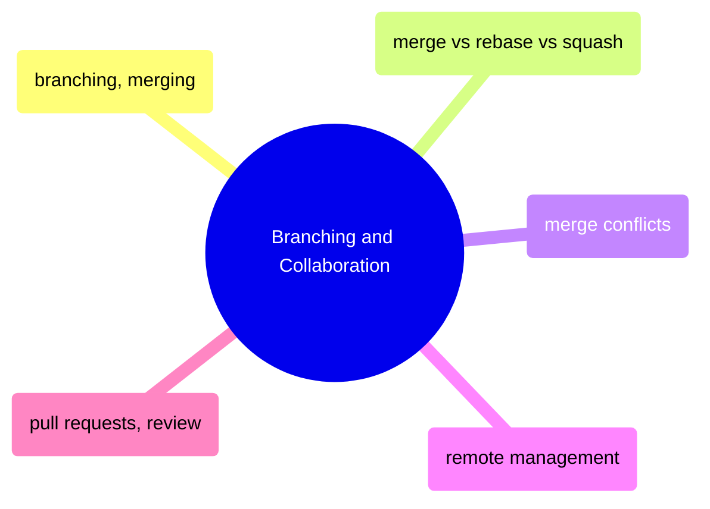

# Branching and Collaboration

Branch management, merge strategies, conflict resolution, remote workflows, and pull request best practices for team-based development.

> [!abstract]- [[03-git-branching-and-merging]]
>
> - [[git-branching-and-merging#Creating and Switching Branches|Creating and switching branches]]
> - [[git-branching-and-merging#Stashing Uncommitted Work|Stashing uncommitted work]]
> - [[git-branching-and-merging#Merging Strategies|Merging strategies]]
> - [[git-branching-and-merging#Git Branch Recovery Techniques|Branch recovery techniques]]

> [!abstract]- [[04-merge-vs-rebase-vs-squash]]
>
> - [[merge-vs-rebase-vs-squash#Merge vs rebase vs squash — comparison table|Comparison table]]
> - [[merge-vs-rebase-vs-squash#git merge — standard merge with merge commit|Standard merge]]
> - [[merge-vs-rebase-vs-squash#git rebase — replay commits for linear history|Rebase for linear history]]
> - [[merge-vs-rebase-vs-squash#git merge --squash — collapse branch into single commit|Squash merge]]
> - [[merge-vs-rebase-vs-squash#Decision guide — which merge strategy by scenario|Decision guide]]

> [!abstract]- [[10-git-merge-conflicts]]
>
> - [[git-merge-conflicts#What a Merge Conflict Looks Like|What a conflict looks like]]
> - [[git-merge-conflicts#Step-by-Step Merge Conflict Resolution Process|Step-by-step resolution]]
> - [[git-merge-conflicts#Visual Merge Tools|Visual merge tools]]
> - [[git-merge-conflicts#Rebase Conflict Resolution|Rebase conflict resolution]]
> - [[git-merge-conflicts#Preventing Merge Conflicts|Preventing conflicts]]

> [!abstract]- [[05-git-remote-management]]
>
> - [[git-remote-management#Viewing Configured Remotes|Viewing configured remotes]]
> - [[git-remote-management#Adding a Remote (Fork Workflow)|Adding a remote]]
> - [[git-remote-management#Fetching: Download Without Merging|Fetching without merging]]
> - [[git-remote-management#Pruning: Clean Up Deleted Remote Branches|Pruning stale branches]]
> - [[git-remote-management#Safe Force-Push After Rebase|Safe force-push]]

> [!abstract]- [[06-pull-requests-and-code-review]]
>
> - [[pull-requests-and-code-review#Creating a PR|Creating a PR]]
> - [[pull-requests-and-code-review#Reviewing and Merging PRs|Reviewing and merging]]
> - [[pull-requests-and-code-review#Merge Strategy Comparison|Merge strategy comparison]]
> - [[pull-requests-and-code-review#Preventing "PR is not mergeable" Errors|Preventing unmergeable PRs]]
> - [[pull-requests-and-code-review#Feature Branch Team Workflow|Feature branch team workflow]]
