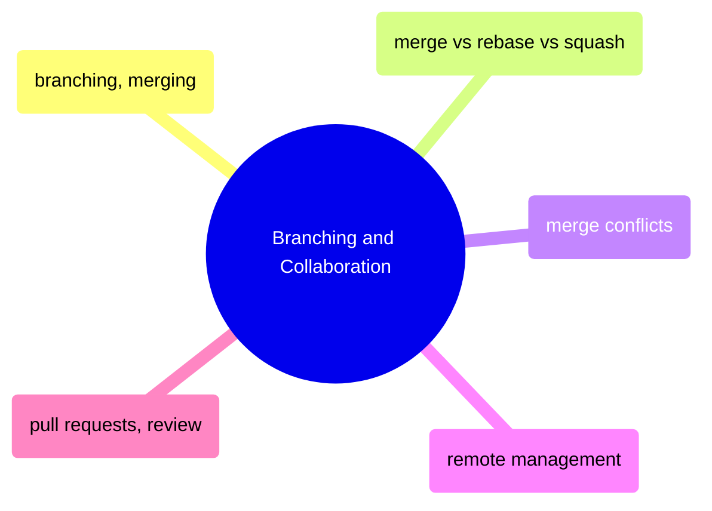

# Branching and Collaboration

Branch management, merge strategies, conflict resolution, remote workflows, and pull request best practices for team-based development.

> [!abstract]- [[03-git-branching-and-merging]]

> [!abstract]- [[04-merge-vs-rebase-vs-squash]]

> [!abstract]- [[10-git-merge-conflicts]]

> [!abstract]- [[05-git-remote-management]]

> [!abstract]- [[06-pull-requests-and-code-review]]
