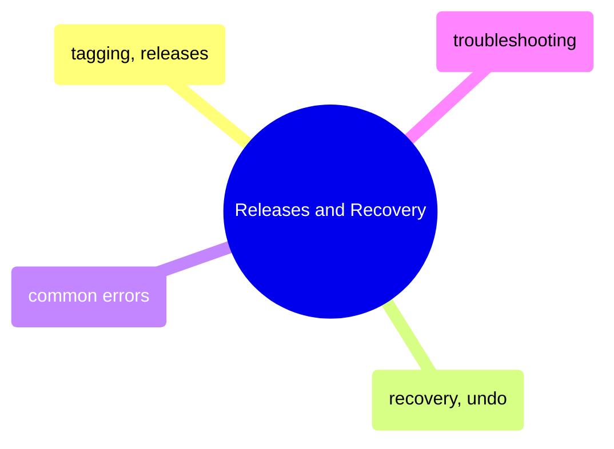

# Releases and Recovery

Tagging releases with semantic versioning, undoing mistakes safely, and troubleshooting common Git errors and team workflow problems.

> [!abstract]- [[09-git-tagging-and-releases]]

> [!abstract]- [[11-git-recovery-and-undo]]

> [!abstract]- [[12-git-common-errors]]

> [!abstract]- [[13-git-problems]]
