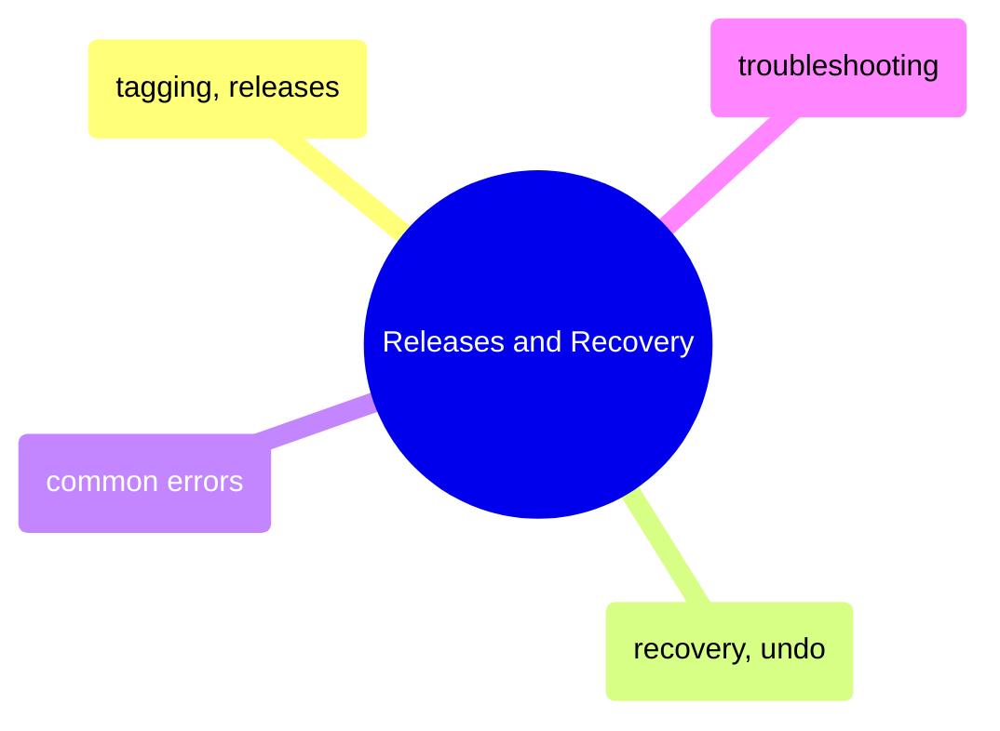

# Releases and Recovery

Tagging releases with semantic versioning, undoing mistakes safely, and troubleshooting common Git errors and team workflow problems.

> [!abstract]- [[09-git-tagging-and-releases]]
>
> - [[git-tagging-and-releases#Lightweight vs Annotated Tags|Lightweight vs annotated tags]]
> - [[git-tagging-and-releases#Creating Tags|Creating tags]]
> - [[git-tagging-and-releases#Pushing Tags to GitHub|Pushing tags to GitHub]]
> - [[git-tagging-and-releases#Semantic Versioning Context|Semantic versioning]]

> [!abstract]- [[11-git-recovery-and-undo]]
>
> - [[git-recovery-and-undo#Decision Tree: Which Git Undo to Use|Undo decision tree]]
> - [[git-recovery-and-undo#Safe: Discard Uncommitted Changes|Discard uncommitted changes]]
> - [[git-recovery-and-undo#Safe: Revert a Commit (Creates a New Undo Commit)|Revert a commit]]
> - [[git-recovery-and-undo#Careful: Reset (Rewrites History)|Reset (rewrite history)]]
> - [[git-recovery-and-undo#Recover: Reflog — Git's Safety Net|Reflog safety net]]

> [!abstract]- [[12-git-common-errors]]
>
> - [[git-common-errors#"Failed to push: rejected -- non-fast-forward"|Push rejected non-fast-forward]]
> - [[git-common-errors#"Detached HEAD"|Detached HEAD]]
> - [[git-common-errors#"Permission denied (publickey)"|Permission denied publickey]]
> - [[git-common-errors#"fatal: refusing to merge unrelated histories"|Unrelated histories]]
> - [[git-common-errors#Quick Reference Table|Quick reference table]]

> [!abstract]- [[13-git-problems]]
>
> - [[git-problems#Secrets Committed to Repository|Secrets committed to repo]]
> - [[git-problems#Force Push to Main|Force push to shared branch]]
> - [[git-problems#Long-Lived Feature Branches|Long-lived feature branches]]
> - [[git-problems#Broken Main Branch|Broken main branch]]
> - [[git-problems#PR Review Bottleneck|PR review bottleneck]]
