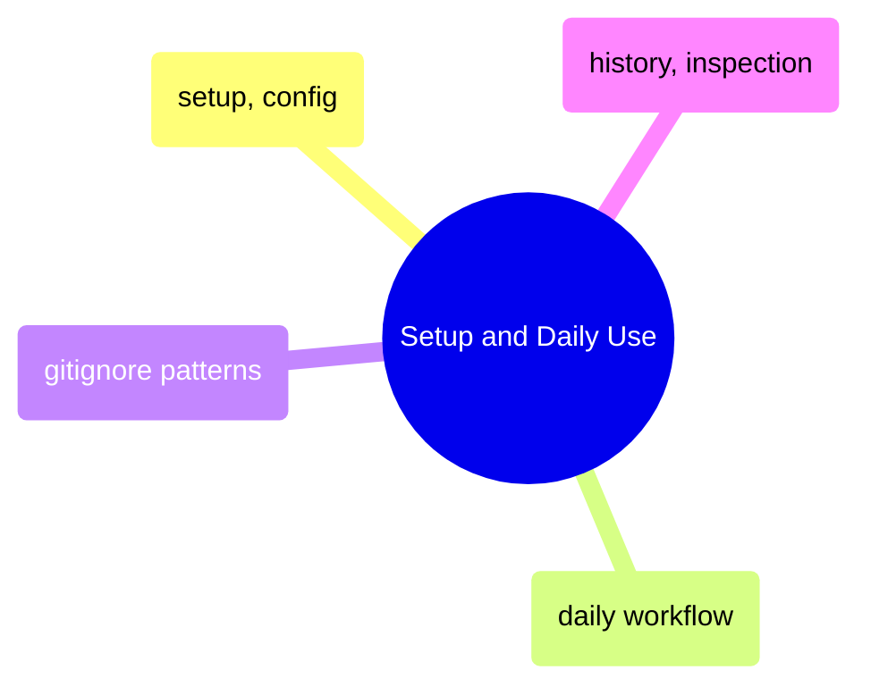

# Setup and Daily Use

Git fundamentals from initial configuration through the daily commit-push-pull cycle, plus gitignore patterns and history inspection.

> [!abstract]- [[01-git-setup-and-config]]

> [!abstract]- [[02-git-daily-workflow]]

> [!abstract]- [[07-gitignore-patterns]]

> [!abstract]- [[08-git-history-and-inspection]]

