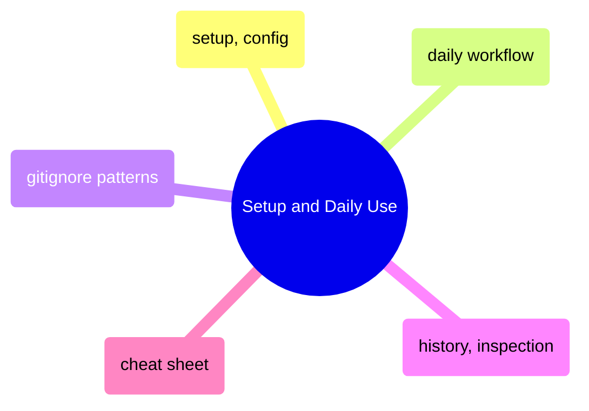

# Setup and Daily Use

Git fundamentals from initial configuration through the daily commit-push-pull cycle, plus gitignore patterns, history inspection, and a quick-reference cheat sheet.

> [!abstract]- [[git-setup-and-config]]
>
> - [[git-setup-and-config#What is Git? Core Concepts Glossary|Core concepts glossary]]
> - [[git-setup-and-config#Initial Setup and Configuration|Initial setup and configuration]]
> - [[git-setup-and-config#Creating and Cloning Repositories|Creating and cloning repositories]]
> - [[git-setup-and-config#Pre-Commit Hooks — Automated Quality Gates|Pre-commit hooks]]

> [!abstract]- [[git-daily-workflow]]
>
> - [[git-daily-workflow#Step 1: Check What's Changed|Check what changed]]
> - [[git-daily-workflow#Step 2: Stage Changes (Choose What to Commit)|Stage changes]]
> - [[git-daily-workflow#Step 3: Commit (Create a Save Point)|Commit]]
> - [[git-daily-workflow#Step 4: Push (Upload to GitHub)|Push to GitHub]]
> - [[git-daily-workflow#Step 5: Pull (Download from GitHub)|Pull from GitHub]]

> [!abstract]- [[gitignore-patterns]]
>
> - [[gitignore-patterns#Pattern Syntax|Pattern syntax]]
> - [[gitignore-patterns#Stop Tracking a File That's Already Committed|Stop tracking committed files]]
> - [[gitignore-patterns#If Secrets Were Accidentally Committed|Accidentally committed secrets]]
> - [[gitignore-patterns#Git LFS — Large File Storage|Git LFS]]

> [!abstract]- [[git-history-and-inspection]]
>
> - [[git-history-and-inspection#git log — The Commit Timeline|Commit timeline]]
> - [[git-history-and-inspection#git diff — What Changed|Viewing diffs]]
> - [[git-history-and-inspection#git blame — Who Changed Each Line|Blame authorship]]
> - [[git-history-and-inspection#Finding Changes Quickly|Finding changes quickly]]

> [!abstract]- [[git-cheat-sheet]]
>
> - [[git-cheat-sheet#Staging and Committing|Staging and committing]]
> - [[git-cheat-sheet#Branching|Branching]]
> - [[git-cheat-sheet#Merging and Rebasing|Merging and rebasing]]
> - [[git-cheat-sheet#Remote Operations|Remote operations]]
> - [[git-cheat-sheet#Undoing and Recovery|Undoing and recovery]]
> - [[git-cheat-sheet#GitHub CLI|GitHub CLI]]
