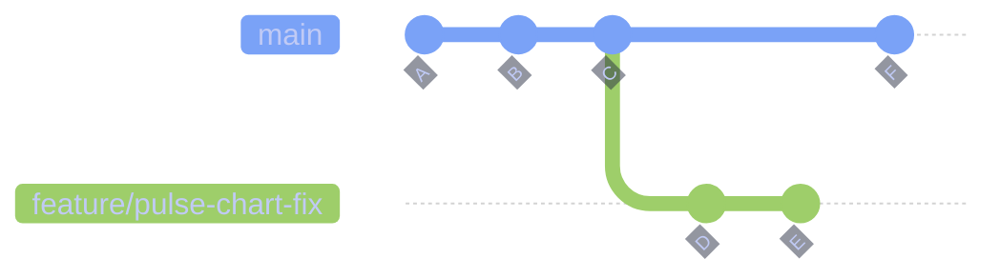
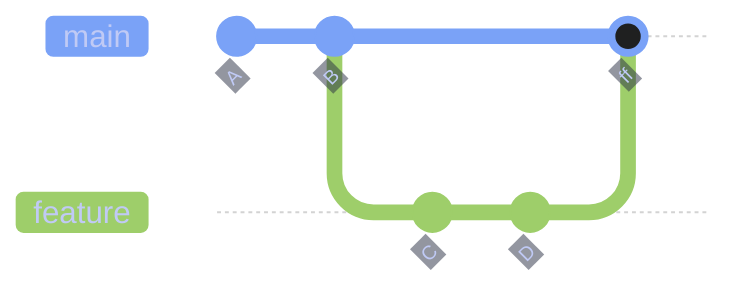
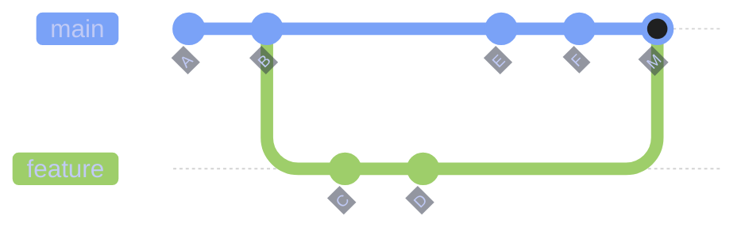
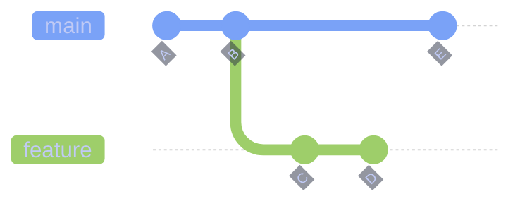
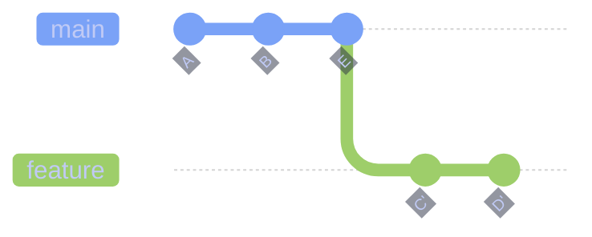
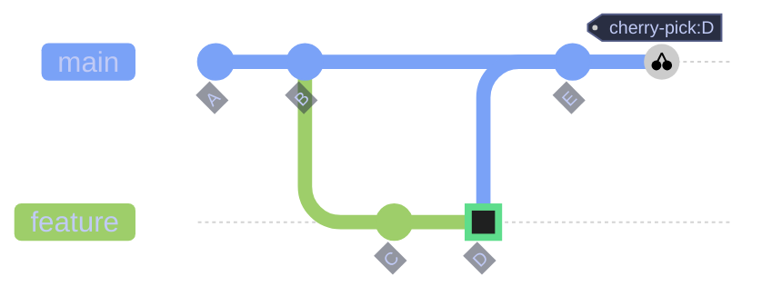

# Git Branching and Merging

> [!quote]
> "In git, we like branches so much that once you realize you have to have a special branch anyway, you might as well have many."
>
> — **Linus Torvalds**, Git mailing list

Branching isolates work so that multiple features, fixes, and experiments can proceed in parallel without interfering with each other. Merging integrates completed work back into the main branch. Understanding how branches interact with the commit DAG is essential for using Git effectively.

A **branch** is a lightweight movable pointer to a commit. When you create a branch, Git creates a new pointer — it does not copy files. **HEAD** is a special pointer that tracks which branch (or commit) you are currently working on. The **working tree** is the set of files on disk that you edit directly. The **staging area** (also called the index) is a buffer between the working tree and the next commit — only staged changes are included when you run `git commit`. A **commit SHA** is the unique 40-character hash that identifies each commit; a commit points to its parent(s), forming a directed acyclic graph (DAG). A **merge commit** has two parents — one from each branch being joined.

## Branch Operations

Creating, switching, and managing branches are the most frequent Git operations. Every branch is just a 41-byte file containing a commit SHA — branches are cheap to create and delete.

### Creating and Switching Branches

A branch is an independent line of development. Creating a branch adds a new pointer at your current commit and lets you make changes without affecting other branches. Switching branches updates your working tree to match the target branch's latest commit. If you have uncommitted changes that conflict with the target branch, Git refuses to switch.

> [!info] git switch vs git checkout
>
> Git 2.23 (August 2019) split the overloaded `git checkout` into two focused commands: `git switch` for changing branches and `git restore` for discarding file changes. The old `git checkout` still works but `switch` is safer — it refuses to switch if uncommitted changes conflict, whereas `checkout` can silently discard work when used with file paths.



#### git switch -c — create and switch to a new branch

Creates a new branch pointer at the current HEAD commit and switches to it in a single operation. The `-c` flag stands for "create." This is the modern equivalent of `git checkout -b`.

```bash
git switch -c feature/pulse-chart-fix
```

#### git checkout -b — create and switch (traditional)

The traditional way to create and switch branches. Still works in all Git versions but `git switch -c` is preferred in Git 2.23+.

```bash
git checkout -b feature/pulse-chart-fix
```

#### git switch — switch between branches

Updates the working tree and HEAD to point to the target branch. If you have staged or unstaged changes that conflict with files on the target branch, the switch is rejected.

```bash
git switch main
```

> [!warning] Detached HEAD from checking out a commit
>
> If you check out a specific commit SHA instead of a branch name (`git checkout abc1234`), you enter **detached HEAD** state — HEAD points directly at a commit, not a branch. Any new commits you make are not on any branch and will become unreachable once you switch away.

> [!success] Save work from detached HEAD
>
> Create a branch before switching away: `git switch -c my-rescue-branch`. This attaches your commits to a named branch, preventing them from being garbage-collected.

#### git branch — list, create, or check branches

Without arguments, lists all local branches. With a name argument, creates a new branch at the current commit without switching to it. Use `-a` to include remote-tracking branches, `-v` to show each branch's latest commit.

```bash
git branch
```

```text
  feature/pulse-chart-fix
* main
  hotfix/login-timeout
```

| Flag | Syntax | Description |
|---|---|---|
| `-c` | `git switch -c <branch>` | Create a new branch and switch to it |
| `-d` | `git switch -d <commit>` | Switch to a specific commit in detached HEAD mode |
| `--discard-changes` | `git switch --discard-changes <branch>` | Switch and discard uncommitted changes |
| `-a` | `git branch -a` | List all branches including remote-tracking |
| `-v` | `git branch -v` | Show last commit on each branch |
| `-d` | `git branch -d <branch>` | Delete branch (only if merged) |
| `-D` | `git branch -D <branch>` | Force-delete branch (even if unmerged) |
| `-m` | `git branch -m <old> <new>` | Rename a branch |
| `--merged` | `git branch --merged` | List branches already merged into current branch |
| `--no-merged` | `git branch --no-merged` | List branches not yet merged into current branch |

### Stashing Uncommitted Work

A stash is a temporary storage area for uncommitted changes. When you stash, Git saves your modified tracked files and staged changes onto a stack, then reverts your working directory to a clean state matching the last commit. You can re-apply stashed changes later on the same branch or a different one. Stashing is essential when you need to switch branches mid-work without committing half-finished code.

#### git stash push — save uncommitted changes

Saves all staged and unstaged modifications to the stash stack, then resets the working tree to the last commit. The `-m` flag adds a descriptive message to identify the stash later.

```bash
git stash push -m "WIP: pulse chart refactor"
```

#### git stash list — view all stashes

Displays all entries on the stash stack. Each entry shows its index (`stash@{N}`), the branch it was created on, and the message.

```bash
git stash list
```

```text
stash@{0}: On feature/pulse-chart-fix: WIP: pulse chart refactor
stash@{1}: On main: debugging auth flow
```

#### git stash pop — restore and remove most recent stash

Applies the most recent stash entry to the working tree and removes it from the stack. If the stash conflicts with current changes, the pop fails and the stash remains on the stack.

```bash
git stash pop
```

#### git stash apply — restore a specific stash without removing

Applies a specific stash by index without removing it from the stack. Useful when you want to apply the same stash to multiple branches.

```bash
git stash apply stash@{2}
```

> [!warning] Stash skips untracked files by default
>
> `git stash` only saves modified tracked files. New files that have never been staged are left behind in the working tree. Switching branches after stashing can leave orphan untracked files in your working directory.

> [!success] Include untracked files
>
> Use `git stash -u` (or `--include-untracked`) to stash untracked files too. Use `git stash -a` (or `--all`) to also include ignored files.

| Flag | Syntax | Description |
|---|---|---|
| `-m` | `git stash push -m "msg"` | Add a descriptive message to the stash |
| `-u` | `git stash push -u` | Include untracked files in the stash |
| `-a` | `git stash push -a` | Include untracked and ignored files |
| `-p` | `git stash push -p` | Interactively select hunks to stash |
| `--keep-index` | `git stash push --keep-index` | Stash unstaged changes but keep staged changes in the index |
| `drop` | `git stash drop stash@{N}` | Remove a specific stash entry |
| `clear` | `git stash clear` | Remove all stash entries |
| `show` | `git stash show -p stash@{N}` | Show the diff of a stash entry |

### Deleting Branches

After a branch is merged, it should be deleted to keep the branch list clean. Git offers a safe delete that checks merge status and a force delete that skips the check.

#### git branch -d — safe delete (merged branches only)

Deletes a local branch only if its commits have been merged into the current branch or its upstream. This prevents accidental loss of unmerged work.

```bash
git branch -d feature/pulse-chart-fix
```

```text
Deleted branch feature/pulse-chart-fix (was 3a1b2c3).
```

#### git branch -D — force delete (unmerged branches)

Force-deletes a branch regardless of merge status. Use this when you intentionally want to discard an experimental branch.

> [!danger] -D force-deletes without merge check
>
> `git branch -D` bypasses the safety check and deletes unconditionally. If the branch has unmerged commits and has not been pushed to a remote, that work is only recoverable via `git reflog` for approximately 90 days.

> [!success] Recover a force-deleted branch
>
> Find the branch tip in the reflog with `git reflog` and recreate it: `git branch recovered-branch <sha>`.

```bash
git branch -D experiment/abandoned-feature
```

### Working with Worktrees

`git worktree` (Git 2.5+) lets you check out multiple branches simultaneously in separate directories, all sharing the same `.git` repository. This avoids the need to stash, switch, and restore when working on a hotfix while a feature branch has uncommitted work.

#### git worktree add — create a parallel working directory

Creates a new working directory linked to the same repository. Each worktree has its own checked-out branch, working tree, and index — but they share the commit history, reflog, and configuration.

```bash
git worktree add ../hotfix-login hotfix/login-timeout
```

#### git worktree list — view active worktrees

Shows all worktrees linked to the current repository, including their paths and checked-out branches.

```bash
git worktree list
```

```text
/home/user/project         3a1b2c3 [main]
/home/user/hotfix-login    f4e5d6a [hotfix/login-timeout]
```

#### git worktree remove — clean up a worktree

Removes a worktree directory and its administrative files. The branch remains — only the extra working directory is deleted.

```bash
git worktree remove ../hotfix-login
```

| Flag | Syntax | Description |
|---|---|---|
| `add` | `git worktree add <path> <branch>` | Create a new worktree for a branch |
| `list` | `git worktree list` | List all active worktrees |
| `remove` | `git worktree remove <path>` | Remove a worktree directory |
| `prune` | `git worktree prune` | Clean up stale worktree metadata |
| `--detach` | `git worktree add --detach <path> <commit>` | Create a worktree in detached HEAD mode |

## Merging Strategies

Merging is how completed work on one branch gets integrated into another. Git offers several merge approaches: a fast-forward merge moves the branch pointer without creating a merge commit, a three-way merge creates a merge commit with two parents, and a rebase replays commits for a linear history. The choice affects how your project history reads — merge preserves the full branching story, rebase makes it look like everyone worked sequentially.

See [merge-vs-rebase-vs-squash](https://alp78.github.io/elysium/08-Git/merge-vs-rebase-vs-squash) for a detailed comparison of when to use each strategy. Once a branch is merged, [pull-requests-and-code-review](https://alp78.github.io/elysium/08-Git/pull-requests-and-code-review) covers the PR workflow that typically wraps these merge operations. For resolving conflicts that arise during merges, see [git-merge-conflicts](https://alp78.github.io/elysium/08-Git/git-merge-conflicts).

### Fast-Forward Merge

A fast-forward merge occurs when the target branch (e.g., `main`) has not received any new commits since the feature branch was created. Git simply moves the `main` pointer forward to the feature branch's tip — no merge commit is created. The result is a perfectly linear history with no branching visible in `git log --graph`.



#### git merge feature — fast-forward when no divergence

When `main` has no new commits since the branch point, `git merge` performs a fast-forward by default. The `main` pointer moves to the feature branch tip. No merge commit is created.

```bash
git switch main
git merge feature/pulse-chart-fix
```

```text
Updating 3a1b2c3..f4e5d6a
Fast-forward
 src/charts/pulse.ts | 42 ++++++++++++++++++++++++------------------
 1 file changed, 24 insertions(+), 18 deletions(-)
```

### Three-Way Merge

A three-way merge occurs when both branches have new commits since they diverged. Git finds the common ancestor (merge base), compares both branch tips against it, and creates a **merge commit** with two parents. This preserves the complete history of both branches, showing exactly when they diverged and when they were joined.



#### git merge feature — three-way merge with merge commit

When both branches have diverged, Git automatically performs a three-way merge. The merge commit `M` has two parents: the tip of `main` and the tip of `feature`. If the same lines were modified on both branches, Git raises a merge conflict that must be resolved manually.

```bash
git switch main
git merge feature/pulse-chart-fix
```

```text
Merge made by the 'ort' strategy.
 src/charts/pulse.ts | 42 ++++++++++++++++++++++++------------------
 1 file changed, 24 insertions(+), 18 deletions(-)
```

#### git merge --no-ff — force merge commit

Forces Git to create a merge commit even when a fast-forward is possible. This keeps the branch boundary visible in `git log --graph`, making it easier to identify which commits belonged to a feature branch.

> [!tip] Use --no-ff for feature branches
>
> Many teams enforce `--no-ff` as a policy (via `git config merge.ff false`) so that every feature branch merge is explicitly recorded in the graph. This makes it trivial to revert an entire feature by reverting the single merge commit.

```bash
git switch main
git merge --no-ff feature/pulse-chart-fix
```

#### git merge --abort — cancel a merge in progress

If a merge produces conflicts you do not want to resolve, `--abort` restores the working tree and index to the state before the merge began. No merge commit is created.

```bash
git merge --abort
```

| Flag | Syntax | Description |
|---|---|---|
| `--no-ff` | `git merge --no-ff <branch>` | Force a merge commit even when fast-forward is possible |
| `--ff-only` | `git merge --ff-only <branch>` | Only merge if fast-forward is possible; abort otherwise |
| `--squash` | `git merge --squash <branch>` | Combine all branch commits into one changeset without committing |
| `--abort` | `git merge --abort` | Cancel a merge in progress and restore pre-merge state |
| `--continue` | `git merge --continue` | Resume a merge after resolving conflicts |
| `--no-commit` | `git merge --no-commit <branch>` | Perform the merge but stop before creating the merge commit |
| `-m` | `git merge -m "msg" <branch>` | Set the merge commit message |
| `--stat` | `git merge --stat <branch>` | Show diffstat after merge (default) |

### Rebase (Linear History)

Rebasing takes every commit on your branch and replays them one by one on top of the target branch's latest commit. The result is a perfectly linear history — it looks like you started your work after the latest `main` commit, even if you actually started weeks ago. The trade-off: every replayed commit gets a **new SHA hash** because the parent commit has changed, which means you are rewriting history.

**Before rebase:**



**After rebase:**



#### git rebase main — replay commits onto new base

Switches the base of your feature branch from the old fork point to the tip of `main`. Each commit on the feature branch is replayed in order, producing new commits with new SHAs but identical diffs. After rebasing, the feature branch can be fast-forward merged into `main`.

```bash
git switch feature/pulse-chart-fix
git rebase main
```

```text
Successfully rebased and updated refs/heads/feature/pulse-chart-fix.
```

#### git rebase -i — interactive rebase

Interactive rebase lets you edit, reorder, squash, or drop individual commits before they are replayed. This is the primary tool for cleaning up commit history before merging a feature branch. Each commit is listed in an editor with an action keyword (`pick`, `squash`, `fixup`, `reword`, `edit`, `drop`).

```bash
git rebase -i HEAD~3
```

```text
pick a1b2c3d Add pulse chart component
squash e4f5g6h Fix pulse chart axis labels
pick i7j8k9l Add pulse chart unit tests
```

> [!tip] Squash fixup commits before merging
>
> Use `fixup` instead of `squash` when you want to discard the fixup commit's message entirely and keep only the original commit's message. This produces a cleaner history than `squash`, which concatenates both messages.

#### git rebase --abort — cancel a rebase in progress

If a rebase produces conflicts you do not want to resolve, `--abort` restores the branch to its exact state before the rebase began. No commits are rewritten.

```bash
git rebase --abort
```

> [!danger] Never rebase shared branches
>
> Rebasing rewrites commit SHAs. If others have pulled your branch and you rebase, their local copies will have different SHAs for the same changes. The next `git pull` will create duplicate commits or conflicts. This applies to any branch that has been pushed and is used by other developers.

> [!success] Safe rebase workflow
>
> Only rebase commits that have not been pushed to a shared remote. If you must update a pushed branch after rebase, use `git push --force-with-lease` — this refuses to push if the remote has commits you have not seen, preventing you from overwriting a colleague's work. Never use `git push --force` on shared branches.

| Flag | Syntax | Description |
|---|---|---|
| `-i` | `git rebase -i <base>` | Interactive rebase — edit, reorder, squash, or drop commits |
| `--onto` | `git rebase --onto <new-base> <old-base> <branch>` | Rebase a range of commits onto a different base |
| `--abort` | `git rebase --abort` | Cancel rebase and restore original branch state |
| `--continue` | `git rebase --continue` | Resume rebase after resolving a conflict |
| `--skip` | `git rebase --skip` | Skip the current conflicting commit and continue |
| `--autosquash` | `git rebase -i --autosquash` | Automatically reorder fixup! and squash! commits |
| `--autostash` | `git rebase --autostash` | Stash uncommitted changes before rebase, re-apply after |

### Cherry-Pick

Cherry-picking copies a single commit from one branch to another. Git applies the diff introduced by the chosen commit as a new commit on the current branch. The new commit has a different SHA but identical changes. This is useful for applying a specific fix from a development branch to a release branch without merging everything.



#### git cherry-pick — copy a commit to the current branch

Applies the changes from a specific commit (identified by SHA) as a new commit on the current branch. The original commit remains untouched on its source branch.

```bash
git switch main
git cherry-pick f4e5d6a
```

```text
[main 7b8c9d0] Fix pulse chart axis labels
 Date: Sat Apr 5 10:30:00 2026 +0000
 1 file changed, 3 insertions(+), 2 deletions(-)
```

> [!warning] Cherry-pick creates duplicate commits
>
> The cherry-picked commit and the original have different SHAs but identical diffs. If both branches are later merged, Git may flag the duplicate changes as a conflict.

> [!success] Avoid duplicates with rebase
>
> If you plan to merge the full branch later, prefer `git rebase` over cherry-picking individual commits. Rebase replays all commits and avoids the duplication problem.

| Flag | Syntax | Description |
|---|---|---|
| `-n` | `git cherry-pick -n <sha>` | Apply changes without committing (stage only) |
| `-x` | `git cherry-pick -x <sha>` | Append "(cherry picked from commit ...)" to the message |
| `--abort` | `git cherry-pick --abort` | Cancel cherry-pick and restore pre-operation state |
| `--continue` | `git cherry-pick --continue` | Resume after resolving a conflict |

## Branch Recovery

Git's reflog is the safety net for branch operations — it records every time HEAD moves (commits, checkouts, resets, rebases) for approximately 90 days. Even if you delete a branch or run `reset --hard`, the commits still exist in the object database and are reachable via the reflog. See [git-recovery-and-undo](https://alp78.github.io/elysium/08-Git/git-recovery-and-undo) for comprehensive recovery workflows.

### Undo Last Commit

Undoing the last commit is one of the most common recovery operations. The three `reset` modes determine what happens to the changes from the undone commit: `--soft` keeps them staged, `--mixed` (default) keeps them in the working tree but unstaged, and `--hard` discards them entirely.

**Before reset:**

```mermaid
%%{init: {'theme': 'dark', 'themeVariables': {
  'git0': '#7aa2f7',
  'git1': '#9ece6a',
  'git2': '#e0af68',
  'git3': '#f7768e',
  'git4': '#bb9af7',
  'git5': '#7dcfff',
  'git6': '#73daca',
  'git7': '#ff9e64',
  'gitBranchLabel0': '#c0caf5',
  'gitBranchLabel1': '#c0caf5',
  'gitBranchLabel2': '#c0caf5',
  'gitBranchLabel3': '#c0caf5',
  'commitLabelColor': '#c0caf5',
  'commitLabelBackground': '#292e42',
  'tagLabelColor': '#c0caf5',
  'tagLabelBackground': '#292e42',
  'tagLabelBorder': '#565f89'
}}}%%
gitGraph
  commit id: "A"
  commit id: "B"
  commit id: "C" type: HIGHLIGHT
```



**After `git reset --soft HEAD~1`** — HEAD moves back to B, commit C's changes remain staged:

```mermaid
%%{init: {'theme': 'dark', 'themeVariables': {
  'git0': '#7aa2f7',
  'git1': '#9ece6a',
  'git2': '#e0af68',
  'git3': '#f7768e',
  'git4': '#bb9af7',
  'git5': '#7dcfff',
  'git6': '#73daca',
  'git7': '#ff9e64',
  'gitBranchLabel0': '#c0caf5',
  'gitBranchLabel1': '#c0caf5',
  'gitBranchLabel2': '#c0caf5',
  'gitBranchLabel3': '#c0caf5',
  'commitLabelColor': '#c0caf5',
  'commitLabelBackground': '#292e42',
  'tagLabelColor': '#c0caf5',
  'tagLabelBackground': '#292e42',
  'tagLabelBorder': '#565f89'
}}}%%
gitGraph
  commit id: "A"
  commit id: "B" type: HIGHLIGHT
```



#### git reset --soft HEAD~1 — undo commit, keep changes staged

Moves HEAD back one commit. The changes from the undone commit remain in the staging area, ready to be re-committed with a different message or combined with additional changes.

```bash
git reset --soft HEAD~1
```

> [!danger] git reset --hard discards uncommitted work
>
> `git reset --hard HEAD~1` moves HEAD back and permanently discards all changes in the working tree and staging area. Unlike committed work, uncommitted changes are not recorded in the reflog and cannot be recovered.

> [!success] Check reflog before hard reset
>
> If you accidentally ran `reset --hard`, committed changes survive in the reflog for approximately 90 days: `git reflog` then `git reset --hard <sha>` to restore. Uncommitted work, however, is permanently lost.

> [!danger] git checkout -- discards uncommitted work
>
> `git checkout -- .` permanently deletes all uncommitted changes to tracked files. Unlike `reset --hard`, this operates on individual files, not commits. There is no reflog recovery — uncommitted work was never recorded by Git.

> [!success] Stash before discarding
>
> Use `git stash` before discarding changes. If you realize you need them back, `git stash pop` restores everything.

### Recover Lost Commits from Reflog

The reflog records every HEAD movement — commits, checkouts, merges, rebases, and resets. Even "deleted" commits survive here. Use `git reflog` to find the SHA of the lost commit, then create a new branch or reset to it.

#### git reflog — find lost commits

Displays the local history of HEAD movements. Each entry shows the SHA, the action that moved HEAD, and a description.

```bash
git reflog
```

```text
f4e5d6a HEAD@{0}: reset: moving to HEAD~1
3a1b2c3 HEAD@{1}: commit: Add pulse chart component
7b8c9d0 HEAD@{2}: checkout: moving from feature to main
```

#### git branch recovered — restore a lost branch

Once you find the target SHA in the reflog, create a new branch pointing to it.

```bash
git branch recovered-feature 3a1b2c3
```

See [git-history-and-inspection](https://alp78.github.io/elysium/08-Git/git-history-and-inspection) for advanced log and reflog inspection techniques.

## Related

**Git chapter:**
- [[git-daily-workflow]] — Status, staging, committing, pushing
- [[git-recovery-and-undo]] — Comprehensive recovery workflows and undo techniques
- [[merge-vs-rebase-vs-squash]] — Detailed comparison table of merge strategies with tradeoffs
- [[git-merge-conflicts]] — Resolving conflicts during merge and rebase operations
- [[git-history-and-inspection]] — Log, reflog, blame, and diff inspection
- [[git-common-errors]] — Detached HEAD, wrong branch merge, and other pitfalls

**GitHub Actions:**
- [[github-actions-ci-cd]] — CI/CD pipelines triggered by branch and PR events
