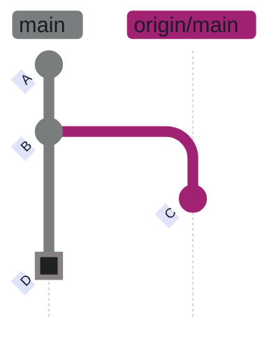
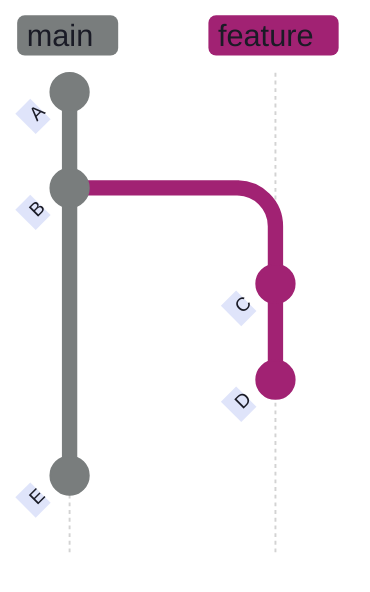
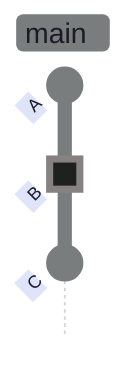
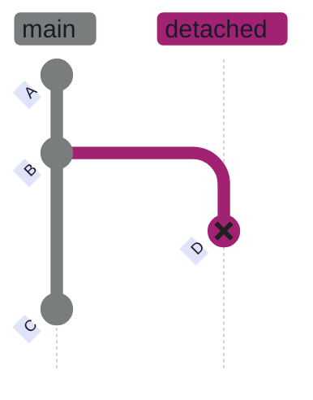
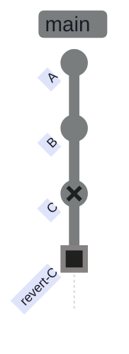

# Git Common Errors & How to Fix Them

> [!quote]
> "It's one of those things where if things are just instant, some mistake happens, you see the result immediately and you just go on and you fix it."
>
> — **Linus Torvalds**, Git mailing list

This note covers 25 common Git and GitHub error messages encountered in day-to-day data engineering work. Each entry explains why the error happens and provides the exact commands to resolve it. Related recovery techniques are in [git-recovery-and-undo](https://alp78.github.io/elysium/08-Git/git-recovery-and-undo); branch and merge mechanics are in [git-branching-and-merging](https://alp78.github.io/elysium/08-Git/git-branching-and-merging). To practice diagnosing these errors in realistic scenarios, work through [git-problems](https://alp78.github.io/elysium/08-Git/git-problems).

## Push and Remote Errors

Push failures occur when the local and remote branches have diverged, when authentication is misconfigured, or when the payload exceeds transport limits. Most push errors are resolved by incorporating remote changes first, then retrying.

### "Failed to push: rejected -- non-fast-forward"

**Cause:** Someone pushed commits to the same branch after your last pull. Your local branch has diverged from the remote — Git refuses to push because it would overwrite their work. A "non-fast-forward" means the remote branch tip is not an ancestor of your local tip.



*Figure: Local main and origin/main diverged after commit B. Commit C was pushed by someone else to the remote. Commit D is your local commit. Git rejects the push because applying D would overwrite C. Fix: `git pull --rebase` replays D on top of C.*

**Fix:** Pull with rebase to replay your commits on top of the remote changes, then push.

```bash
git pull --rebase && git push
```

The `--rebase` flag replays your local commits on top of the fetched remote commits instead of creating a merge commit. The `&&` ensures push only runs if the pull succeeded.

### "error: failed to push some refs -- hint: updates were rejected"

**Cause:** The remote branch has commits your local branch does not have. This is functionally the same as the non-fast-forward error but uses different wording depending on Git version and transport protocol. You need to incorporate the remote changes first.

**Fix:** Fetch, rebase onto the remote, then push.

```bash
git fetch origin
```

```bash
git rebase origin/main
```

```bash
git push
```

### "git push rejected after rebase"

**Cause:** Rebase rewrites commit SHAs by replaying each commit with a new parent. The remote still has the original commits with the old SHAs, so Git sees a divergence and rejects the push as non-fast-forward.



*Figure: Before rebase — feature branch diverged from main at B. After `git rebase main`, commits C and D are replayed as C' and D' on top of E with new SHAs. The remote still has the original C and D, so Git sees a non-fast-forward divergence and rejects a normal push.*

**Fix:** Force-push with the `--force-with-lease` safety check.

```bash
git push --force-with-lease
```

`--force-with-lease` overwrites the remote branch only if no one else has pushed since your last fetch. It is the safe alternative to `--force`, which overwrites unconditionally.

> [!danger] Never force-push to main or shared branches
>
> `git push --force` (and even `--force-with-lease`) rewrites the remote branch history. If other developers have pulled the original commits, their histories will diverge and require manual intervention to fix.

> [!success] Limit force-push to your own feature branches
>
> Only force-push to branches where you are the sole contributor. For shared branches, use `git revert` instead of rebase to undo changes without rewriting history.

### "Your branch is behind origin/main"

**Cause:** Your local `main` (or feature branch) has fewer commits than the remote. This happens when someone else pushed changes after your last `git fetch` or `git pull`. The message compares your local branch pointer against the remote-tracking ref (`origin/main`), which was updated by your last fetch.

**Fix:** Pull the latest changes from the remote.

```bash
git pull origin main
```

`git pull` is shorthand for `git fetch` (download remote commits) followed by `git merge` (integrate them into your local branch). If you prefer a linear history, use `git pull --rebase` instead.

### "git pull results in merge commits I don't want"

**Cause:** `git pull` performs a fetch followed by a merge by default. When your local branch and the remote have diverged, the merge creates a merge commit that clutters the history with messages like "Merge branch 'main' of github.com:...".

**Fix:** Use rebase instead of merge when pulling.

```bash
git pull --rebase origin main
```

`--rebase` replays your local commits on top of the fetched changes instead of creating a merge commit.

To make rebase the default for all future pulls:

```bash
git config --global pull.rebase true
```

### "fatal: the remote end hung up unexpectedly" (large push)

**Cause:** The push payload exceeds the HTTP POST buffer size. This is common with large files, initial pushes of big repos, or repos with extensive binary assets. The default buffer is approximately 1 MB.

**Fix:** Increase the HTTP buffer size to 500 MB.

```bash
git config --global http.postBuffer 524288000
```

> [!tip] Alternative for large files
>
> For truly large assets, consider [gitignore-patterns](https://alp78.github.io/elysium/08-Git/gitignore-patterns) to keep them out of the repo, or use Git LFS (Large File Storage) rather than increasing the buffer.

### "git status says up to date but I'm missing changes"

**Cause:** "Up to date with origin/main" means your local branch matches what was last fetched — not what is currently on the remote. If someone pushed after your last fetch, you will not see their changes until you fetch again. The `git status` comparison is against the local copy of `origin/main`, not the live remote.

**Fix:** Fetch first to update remote-tracking refs, then check status.

```bash
git fetch
```

```bash
git status
```

`git fetch` downloads new commits and updates `origin/main` without modifying your working tree. After fetching, `git status` will show the true divergence.

## Branch and HEAD Errors

Branch errors arise from operating on the wrong branch, losing track of HEAD, or deleting branches prematurely. Most are recoverable via the reflog.

### "Detached HEAD"

**Cause:** You checked out a specific commit SHA or a tag instead of a branch name. In this state, HEAD points directly at a commit rather than at a branch pointer. Any new commits you create are not on any branch — they become orphaned (unreachable) as soon as you switch to a named branch, and will be garbage-collected after approximately 90 days.



*Figure: You ran `git checkout B` — HEAD now points directly at commit B instead of following the main branch. Main still points at C. If you make new commits here, they won't belong to any branch.*



*Figure: You committed D while in detached HEAD state. D is on no branch — it's reachable only through the reflog. When you switch back to main (pointing at C), commit D becomes orphaned and will be garbage-collected in ~90 days. Fix: `git switch -c rescue-branch` before switching away.*

**Fix:** Create a branch at the current position to anchor your commits.

```bash
git switch -c my-rescue-branch
```

This creates a named branch pointing at the current commit, preventing your work from becoming orphaned.

### "HEAD detached at origin/main" after fetch

**Cause:** You ran `git checkout origin/main` (a remote-tracking ref) instead of `git checkout main` (your local branch). Remote-tracking refs like `origin/main` are read-only pointers — checking them out puts you in detached HEAD state.

**Fix:** Switch to the local branch.

```bash
git switch main
```

### "error: pathspec 'branch-name' did not match any file(s) known to git"

**Cause:** The branch does not exist locally. It may be a remote branch that has not been fetched yet, or the branch name may be misspelled. Git searches local branches first, then local files — if neither matches, it reports this error.

**Fix:** Fetch remote branches, then switch. `git switch` automatically creates a local tracking branch if a matching remote branch exists.

```bash
git fetch
```

```bash
git switch branch-name
```

### "Committed to wrong branch"

**Cause:** You made commits on `main` (or another branch) instead of your intended feature branch. The commits need to be moved without losing the changes.

> [!todo] Move the last commit to the correct branch
>
> 1. Note the commit SHA: `git log --oneline -1`
> 2. Undo the commit but keep changes staged: `git reset --soft HEAD~1`
> 3. Shelve the staged changes: `git stash`
> 4. Switch to the correct branch: `git switch correct-branch`
> 5. Restore the changes: `git stash pop`
> 6. Recommit: `git commit -m "my message"`

```bash
git log --oneline -1
```

```bash
git reset --soft HEAD~1
```

```bash
git stash
```

```bash
git switch correct-branch
```

```bash
git stash pop
```

```bash
git commit -m "my message"
```

See [git-recovery-and-undo](https://alp78.github.io/elysium/08-Git/git-recovery-and-undo) for more reset scenarios.

### "Squash merge shows branch as not merged"

**Cause:** After `gh pr merge --squash`, running `git branch -d feature-branch` warns the branch is not merged. This happens because squash merge creates a single new commit on the target branch with a different SHA than the original branch commits. Git's merge check compares commit SHAs — since the squashed commit has a new SHA, Git does not recognize the branch as merged, even though all the changes are on the target branch.

**Fix:** This warning is cosmetic. The changes are on `main` as the squashed commit. Safe to force-delete:

```bash
git branch -D feature-branch
```

See [pull-requests-and-code-review](https://alp78.github.io/elysium/08-Git/pull-requests-and-code-review) for squash merge workflow details.

### "Deleted branch before squash-merging the PR"

**Cause:** You deleted the local and/or remote feature branch before merging the PR on GitHub. The PR may auto-close when its head branch disappears.

> [!todo] Restore the branch and reopen the PR
>
> 1. Find the SHA from the deletion message or reflog: `git reflog | grep feat/my-feature`
> 2. Recreate the branch: `git branch feat/my-feature <sha>`
> 3. Push it back to the remote: `git push origin feat/my-feature`
> 4. Reopen the PR: `gh pr reopen 26`

```bash
git reflog | grep feat/my-feature
```

```bash
git branch feat/my-feature ec9ff69
```

```bash
git push origin feat/my-feature
```

```bash
gh pr reopen 26
```

If `git push` says "Everything up-to-date", the remote may still have a stale ref. Force-create the remote ref from the SHA:

```bash
git push origin ec9ff69:refs/heads/feat/my-feature
```

> [!tip] Safe deletion order
>
> Always merge/squash the PR on GitHub first, then delete the branch. GitHub's "Delete branch" button after merge is the safest workflow.

## Merge and Conflict Errors

Merge errors occur when Git cannot automatically combine changes from two branches. Conflicts require manual resolution; other merge errors stem from missing common ancestors or uncommitted local changes blocking the operation.

### "Merge conflict in filename.py"

**Cause:** Both branches modified the same lines in the same file. Git cannot determine which version to keep, so it inserts conflict markers into the file and pauses the merge for manual resolution. The conflict markers look like this:

```text
<<<<<<< HEAD
your version of the code
=======
their version of the code
>>>>>>> feature-branch
```

Everything between `<<<<<<< HEAD` and `=======` is your change; everything between `=======` and `>>>>>>>` is the incoming change.

**Fix:** Open the file, choose which version to keep (or combine both), remove all conflict markers, then stage and commit.

```bash
git add filename.py
```

```bash
git commit
```

Git auto-generates a merge commit message. See [git-merge-conflicts](https://alp78.github.io/elysium/08-Git/git-merge-conflicts) for detailed conflict resolution strategies including VS Code merge editor, `--ours`/`--theirs` shortcuts, and multi-file conflict workflows.

### "fatal: refusing to merge unrelated histories"

**Cause:** The two branches have no common ancestor commit. This typically happens when you initialized a repository locally with `git init` and also created a separate repository on GitHub with a README — the two repos have independent histories that Git refuses to combine.

**Fix:** Allow unrelated histories to be merged.

```bash
git pull origin main --allow-unrelated-histories
```

`--allow-unrelated-histories` tells Git to proceed even though the two histories share no common ancestor. You may need to resolve conflicts in the resulting merge.

### "CONFLICT (modify/delete)" during merge or rebase

**Cause:** One branch modified a file while the other branch deleted it. Git cannot determine the intent — should the file exist with the modifications, or should it be deleted?

**Fix:** You must explicitly choose one outcome.

To accept the deletion:

```bash
git rm filename.py
```

To keep the file (resolve content manually first):

```bash
git add filename.py
```

Then continue the operation:

```bash
git rebase --continue
```

Or if merging:

```bash
git merge --continue
```

### "error: your local changes would be overwritten by merge/checkout"

**Cause:** You have uncommitted changes in files that the target operation (merge, checkout, pull) needs to modify. Git refuses to proceed because it would silently overwrite your work.

**Fix:** Stash your changes, perform the operation, then restore them.

```bash
git stash
```

```bash
git switch other-branch
```

```bash
git stash pop
```

Alternatively, use `git restore` to discard the changes if they are not needed. See [git-daily-workflow](https://alp78.github.io/elysium/08-Git/git-daily-workflow) for stash usage patterns.

## File and Commit Errors

These errors involve accidentally committing the wrong content — wrong files, large files, missing files, or commits that need to be undone after pushing.

### "Accidentally deleted a file"

**Cause:** A tracked file was deleted from the working tree (manually or by a script) but the deletion has not been committed yet.

**Fix:** Restore the file from the last commit using `git restore` (Git 2.23+).

```bash
git restore filename.py
```

This copies the file from HEAD back into the working tree without affecting the staging area or any other files.

### "Need to undo a push"

**Cause:** You pushed a commit that needs to be undone, but the branch is shared so you cannot rewrite history with `reset`.

**Fix:** Create a revert commit that undoes the changes, then push.



*Figure: `git revert C` creates a new commit that undoes C's changes. The original commit C remains in history — revert is a forward-moving operation, not history rewriting. Safe for shared branches.*

```bash
git revert HEAD
```

```bash
git push
```

`git revert HEAD` creates a new commit that is the exact inverse of the last commit — it undoes the changes without rewriting history. This is safe on shared branches because it adds a commit rather than removing one.

> [!tip] Revert vs Reset
>
> Use `git revert` when undoing pushed commits on shared branches — it preserves history. Use `git reset` only on commits that have not been pushed. See [git-recovery-and-undo](https://alp78.github.io/elysium/08-Git/git-recovery-and-undo) for details.

### "Accidentally committed a large file"

**Cause:** A large binary or data file was staged and committed. GitHub rejects pushes containing files over 100 MB, and large files bloat the repository permanently since Git stores every version.

**Fix:** Undo the commit, remove the file from tracking, then recommit.

```bash
git reset --soft HEAD~1
```

Add the file to `.gitignore`, then remove it from the index without deleting it from disk:

```bash
git rm --cached large_file.csv
```

```bash
git commit -m "remove large file from tracking"
```

> [!warning] Large files persist in Git history
>
> `git rm --cached` removes the file from the current commit but does not erase it from previous commits in Git history. If the file exceeds GitHub's 100 MB limit, the push will still be rejected.

> [!success] Purge from all history with BFG
>
> Use [BFG Repo-Cleaner](https://rtyley.github.io/bfg-repo-cleaner/) or `git filter-repo` to remove the file from all commits: `bfg --delete-files large_file.csv`. Then force-push the cleaned history. For future large files, use Git LFS.

### "Forgot to include a file in the last commit"

**Cause:** You committed and pushed, then realized a file was not staged.

> [!todo] Amend the commit and force-push
>
> 1. Stage the missing file: `git add .gitignore`
> 2. Amend the previous commit: `git commit --amend --no-edit`
> 3. Force-push: `git push --force-with-lease`

```bash
git add .gitignore
```

```bash
git commit --amend --no-edit
```

`--amend` rewrites the last commit to include the newly staged file. `--no-edit` keeps the original commit message.

```bash
git push --force-with-lease
```

> [!warning] Only amend your own feature branch
>
> Amending rewrites the commit SHA. If others have pulled the original commit, their histories will diverge.

> [!success] Amend before pushing to avoid force-push
>
> If you have not pushed yet, `git commit --amend` is safe and requires no force-push. Only amend pushed commits on branches where you are the sole contributor.

### "Accidentally committed files that should be ignored"

**Cause:** Files that should have been in `.gitignore` (binaries, secrets, build artifacts) were committed and pushed. `.gitignore` only prevents untracked files from being staged — files already committed continue to be tracked even after adding them to `.gitignore`.

**Step 1:** Add the paths to `.gitignore`.

```bash
echo "docs/logos/" >> .gitignore
echo "*.log" >> .gitignore
```

**Step 2:** Remove the files from Git's index but keep them on disk. The `--cached` flag removes from the index (staging area) only — files remain in the working tree.

```bash
git rm -r --cached docs/logos/
```

**Step 3:** Commit and push.

```bash
git add .gitignore
```

```bash
git commit -m "chore: stop tracking logos, add to .gitignore"
```

```bash
git push
```

> [!danger] Secrets in Git history require immediate action
>
> `git rm --cached` does not erase files from previous commits. If you committed secrets (API keys, passwords, service account JSON), they remain accessible in Git history to anyone with repo access — even after removal from the current commit.

> [!success] Purge secrets from all history
>
> Use [BFG Repo-Cleaner](https://rtyley.github.io/bfg-repo-cleaner/) or `git filter-repo` to remove secrets from every commit, then force-push. Rotate all exposed credentials immediately — assume they are compromised.

See [gitignore-patterns](https://alp78.github.io/elysium/08-Git/gitignore-patterns) for how to structure `.gitignore` correctly from the start.

## Configuration and Authentication Errors

These errors stem from misconfigured Git settings, missing SSH keys, or corrupted repository state rather than from branch or merge operations.

### "fatal: not a git repository"

**Cause:** You are running a Git command outside of any repository, or your shell's working directory does not contain a `.git` folder. This can also happen if the `.git` directory was accidentally deleted or the path is on a network drive that disconnected.

**Fix:** Navigate to the correct repository directory.

```bash
cd /path/to/your/repo
```

```bash
git status
```

If unsure where the repo is, search for `.git` directories: `find ~ -name .git -type d -maxdepth 4`.

### "Permission denied (publickey)"

**Cause:** Your SSH key is not configured, not added to the SSH agent, or not registered with your GitHub account. Git over SSH requires a key pair — the private key on your machine, the public key on GitHub.

**Fix:** Test your SSH connection and check loaded keys.

```bash
ssh -T git@github.com
```

```bash
ssh-add -l
```

If no keys are listed, generate a new key pair and add the public key to GitHub under **Settings > SSH and GPG Keys**:

```bash
ssh-keygen -t ed25519 -C "your@email.com"
```

> [!info] HTTPS alternative
>
> If SSH is blocked by your network, switch the remote to HTTPS: `git remote set-url origin https://github.com/owner/repo.git` and authenticate with a Personal Access Token. See [git-setup-and-config](https://alp78.github.io/elysium/08-Git/git-setup-and-config) for full SSH and HTTPS setup instructions.

### "warning: LF will be replaced by CRLF" (Windows)

**Cause:** Windows uses CRLF (`\r\n`) line endings, Unix/macOS uses LF (`\n`). Git detects the mismatch and warns that it will auto-convert. This is informational, not an error — but inconsistent line endings can cause noisy diffs and merge conflicts.

**Fix:** Configure line ending behavior for your OS.

On Windows — convert to CRLF on checkout, LF on commit:

```bash
git config --global core.autocrlf true
```

On Mac/Linux — convert CRLF to LF on commit, no conversion on checkout:

```bash
git config --global core.autocrlf input
```

> [!tip] .gitattributes is more reliable than local config
>
> For cross-platform teams, commit a `.gitattributes` file to the repo that enforces line endings per file type (e.g., `*.py text eol=lf`), rather than relying on each developer's local `core.autocrlf` setting. See [git-setup-and-config](https://alp78.github.io/elysium/08-Git/git-setup-and-config) for `.gitattributes` examples.

### "fatal: cannot lock ref" or "unable to create ... .lock"

**Cause:** A previous Git operation crashed mid-write and left a `.lock` file behind, or another Git process (GUI client, IDE plugin, background script) is currently running against the same repository. Git uses lock files to prevent concurrent writes to refs and the index.

**Fix:** First verify no other Git process is running, then remove the stale lock.

```bash
rm -f .git/refs/heads/branch-name.lock
```

For the index lock:

```bash
rm -f .git/index.lock
```

> [!warning] Verify no active Git process before removing locks
>
> Deleting a lock file while another Git process is actively writing can corrupt the repository state (broken refs, incomplete index).

> [!success] Check for running Git processes first
>
> On Linux/macOS: `ps aux | grep git`. On Windows: `tasklist | findstr git`. Only remove the lock file after confirming no Git process is active.

## CI/CD Errors

CI/CD-specific errors arise from misconfigured secrets, missing permissions, or GitHub Actions security restrictions.

### GitHub Actions: "google-github-actions/auth failed: must specify exactly one of workload_identity_provider or credentials_json"

**Cause:** The `GCP_SA_KEY` repository secret is missing, empty, or inaccessible to the workflow. GitHub Actions secrets are not passed to workflows triggered from forks (including Dependabot PRs) as a security measure. The `${{ secrets.GCP_SA_KEY }}` expression resolves to an empty string, and the `google-github-actions/auth` action fails because it receives neither authentication method.

**Fix:** Verify the secret exists.

```bash
gh secret list
```

If `GCP_SA_KEY` is missing, set it from the service account key file:

```bash
gh secret set GCP_SA_KEY < your-ci-key.json
```

Then re-run the failed workflow:

```bash
gh run rerun <RUN_ID>
```

> [!warning] Fork and Dependabot workflows cannot access secrets
>
> GitHub intentionally blocks secrets from fork-triggered and Dependabot-triggered workflows to prevent secret exfiltration. The workflow will always fail in these contexts.

> [!success] Merge the PR to trigger a secrets-enabled run
>
> Merge the fork/Dependabot PR first, then the push-to-main workflow runs with full secret access. Alternatively, use Workload Identity Federation (OIDC) which does not require stored secrets. See [[github-actions-ci-cd]] for WIF setup.

## Quick Reference

Summary table for rapid lookup. Each row links to the detailed entry above.

| Error / Symptom | Root Cause | Fix |
|---|---|---|
| `non-fast-forward` push rejected | Remote has newer commits | `git pull --rebase && git push` |
| `updates were rejected` | Remote has commits you don't | `git fetch && git rebase origin/main && git push` |
| Push rejected after rebase | Rebase rewrote SHAs | `git push --force-with-lease` |
| `Your branch is behind origin/main` | Local outdated | `git pull origin main` |
| Unwanted merge commits on pull | `git pull` defaults to merge | `git pull --rebase` or `pull.rebase true` |
| Remote end hung up (large push) | HTTP buffer too small | `git config --global http.postBuffer 524288000` |
| `git status` says up to date | Stale fetch | `git fetch && git status` |
| Detached HEAD | Checked out a commit, not a branch | `git switch -c my-rescue-branch` |
| `HEAD detached at origin/main` | Checked out remote ref | `git switch main` |
| `pathspec did not match` | Branch not fetched | `git fetch && git switch branch-name` |
| Committed to wrong branch | — | `reset --soft`, stash, switch, pop, recommit |
| Squash merge "not merged" | Squash creates new SHA | `git branch -D feature-branch` |
| Deleted branch before PR merge | Branch gone, PR auto-closed | `git reflog` → recreate → `gh pr reopen` |
| Merge conflict | Same lines modified on both branches | Resolve markers, `git add`, `git commit` |
| `refusing to merge unrelated histories` | No common ancestor | `git pull --allow-unrelated-histories` |
| `CONFLICT (modify/delete)` | One side modified, other deleted | `git rm` or `git add`, then `--continue` |
| Local changes overwritten | Uncommitted changes blocking op | `git stash` → operate → `git stash pop` |
| Accidentally deleted a file | — | `git restore filename.py` |
| Need to undo a push | — | `git revert HEAD && git push` |
| Committed large file | — | `reset --soft`, `git rm --cached`, recommit |
| Forgot file in last commit | — | `git add`, `--amend --no-edit`, force-push |
| Committed files should be ignored | `.gitignore` added too late | `git rm -r --cached`, update `.gitignore` |
| `fatal: not a git repository` | Wrong directory | `cd /path/to/repo` |
| `Permission denied (publickey)` | SSH key missing | `ssh-keygen`, add to GitHub Settings |
| `LF will be replaced by CRLF` | Line ending mismatch | `core.autocrlf true` (Windows) |
| `cannot lock ref` | Stale lock from crash | `rm -f .git/index.lock` |
| `google-github-actions/auth failed` | Missing `GCP_SA_KEY` secret | `gh secret set GCP_SA_KEY < key.json` |

## Related

**Git chapter:**
- [[git-recovery-and-undo]] — Full undo and recovery reference (reset, revert, reflog, stash)
- [[git-branching-and-merging]] — Branch creation, merging, and conflict resolution
- [[git-merge-conflicts]] — Detailed conflict resolution strategies
- [[git-daily-workflow]] — Everyday commit, push, and pull patterns
- [[git-history-and-inspection]] — Inspecting logs, diff, and blame
- [[gitignore-patterns]] — Structuring `.gitignore` and stopping tracked files
- [[pull-requests-and-code-review]] — PR workflow, squash merges, branch deletion
- [[git-setup-and-config]] — SSH keys, HTTPS auth, `.gitattributes`, line endings
- [[git-remote-management]] — Remote URLs, fetch, and push configuration

**GitHub Actions:**
- [[github-actions-ci-cd]] — CI/CD secrets, Workload Identity Federation, and workflow triggers
