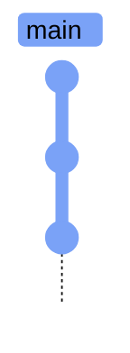
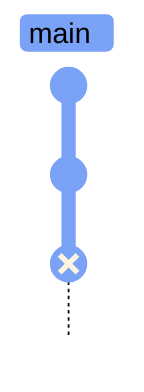
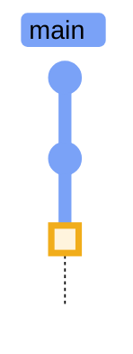
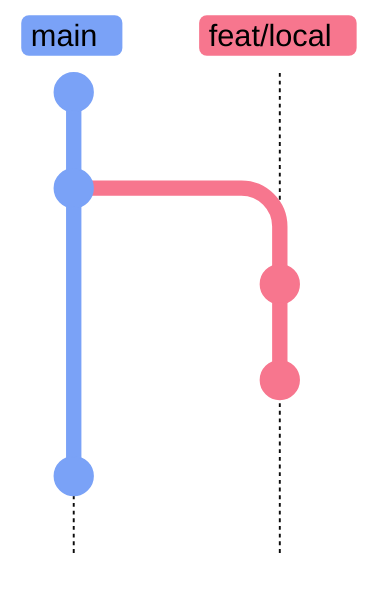
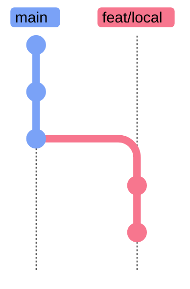
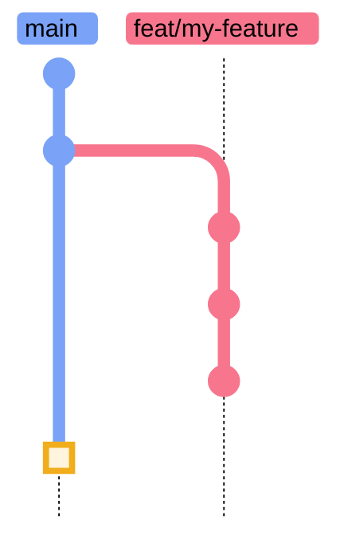

# Git Daily Workflow

> [!quote]
> "As far as I'm concerned, if the code isn't checked into source control, it doesn't exist."
>
> — **Jeff Atwood**, codinghorror.com

Git is not optional for data engineering. Every SQL migration, every DAG definition, every pipeline configuration, and every [Terraform module](https://alp78.github.io/elysium/07-Terraform/Fundamentals/hcl-syntax-basics) must be version-controlled. These are the commands you run dozens of times per day..

## Step 1: Check What's Changed

### Checking Status

#### git status — show working directory and staging area state

> [!info] What git status shows
>
> Displays your current branch, staged changes, unstaged changes, and untracked files. In plain English: what's changed since my last save point?

```bash
git status
```

```text
On branch feat/add-signals
Your branch is up to date with 'origin/feat/add-signals'.

Changes to be committed:
        modified:   src/transforms/ohlcv.py

Changes not staged for commit:
        modified:   tests/test_ohlcv.py

Untracked files:
        src/signals/momentum.py
```

#### git status -s — compact one-line-per-file status

Short format shows one file per line. The left column is the staging area state, the right column is the working tree state: `M` = modified, `A` = added, `D` = deleted, `??` = untracked.

```bash
git status -s
```

```text
M  src/transforms/ohlcv.py
 M tests/test_ohlcv.py
?? src/signals/momentum.py
```

#### git diff — view unstaged changes line by line

Shows the difference between your working directory and the staging area — what you have modified but not yet staged. Run this before `git add` to review changes.

```bash
git diff
```

#### git diff --staged — view staged changes before committing

Shows the difference between the staging area and the last commit — exactly what will go into the next commit. Run this after `git add` as a final review before committing.

```bash
git diff --staged
```

#### git diff main...HEAD — preview all branch changes for a PR

Shows all changes accumulated on your current branch relative to `main`. Useful for reviewing the full diff before opening a pull request.

```bash
git diff main...HEAD
```

#### git log --oneline — view recent commit history (compact)

Shows one commit per line in `<short-sha> <subject>` format. Compact and scannable — the standard way to check what has happened on the branch recently.

```bash
git log --oneline -20
```

```text
a3f9b12 feat: add momentum signal transform
7c1e8a0 fix: correct timezone in OHLCV join
3b4d22f refactor: extract symbol loader to utils
9e2a7f1 chore: update yfinance to 0.2.31
```

#### git log --oneline --graph --decorate — view history with branch topology

Adds an ASCII branch graph and branch/tag labels. Use this to see how branches have diverged, merged, or where HEAD sits relative to the remote tracking branch.

```bash
git log --oneline --graph --decorate -20
```

```text
* a3f9b12 (HEAD -> feat/add-signals) feat: add momentum signal transform
* 7c1e8a0 fix: correct timezone in OHLCV join
| * 3b4d22f (origin/main, main) refactor: extract symbol loader to utils
|/
* 9e2a7f1 chore: update yfinance to 0.2.31
```

## Step 2: Stage Changes (Choose What to Commit)

### Staging Files

#### git add file — stage a specific file for the next commit

> [!info] Staging marks files for commit
>
> `git add` moves a file from "modified" to "staged" (ready to commit). In plain English: mark this file to be included in the next save point.

```bash
git add filename.py
```

#### git add dir/ — stage all changes in specific directories

Stages all modified, new, and deleted files within the specified directories. Equivalent to running `git add` for every file under those paths.

```bash
git add src/transforms/ tests/
```

#### git add -A — stage ALL changes (new, modified, deleted)

> [!info] Stage all changes at once
>
> `-A` stages every change across the entire repo — new, modified, and deleted files. Use with caution in repos containing sensitive files.

```bash
git add -A
```

> [!warning] Avoid Staging Everything
>
> Avoid `git add -A` or `git add .` in Production Repos.
> In repos with sensitive files (.env, credentials), stage specific files by name instead. Use [.gitignore](https://alp78.github.io/elysium/08-Git/gitignore-patterns) as a safety net, not as your primary defense against committing secrets or large files.

> [!success] Stage Files Explicitly
>
> Name files or directories directly: `git add src/transforms/ohlcv.py`. Use `git add -p` to review and cherry-pick individual hunks within a file before staging.

#### git add -p — interactive staging, choose hunks within files

> [!info] Interactive staging with hunks
>
> Patch mode shows each change hunk and asks y/n to stage it. In plain English: review each change one by one and pick which ones to include.

```bash
git add -p
```

#### git restore --staged file — unstage a file, keep working changes

> [!info] Unstage without losing changes
>
> Removes a file from the staging area but keeps your working directory changes intact. In plain English: oops, I didn't mean to include that file. `git restore --staged` is the modern form (Git 2.23+); `git reset HEAD <file>` is the legacy equivalent.

```bash
git restore --staged filename.py
```

## Step 3: Commit (Create a Save Point)

### Creating Commits

Each `git commit` records a snapshot of the staged files as a new node in the DAG. The branch pointer (e.g., `main` or `feat/add-signals`) advances to the new commit, and `HEAD` follows it.



*Figure: each `git commit` advances the branch pointer to a new snapshot node in the DAG.*

#### git commit -m "message" — create a commit

> [!info] Commit creates a snapshot
>
> A commit creates a new snapshot of all staged changes. `-m` sets the commit message inline so no editor opens.

```bash
git commit -m "fix: correct timezone handling in OHLCV transform"
```

```text
[feat/add-signals a3f9b12] fix: correct timezone handling in OHLCV transform
 1 file changed, 3 insertions(+), 2 deletions(-)
```

#### git commit -m "title" -m "body" — commit with title and description

Pass a second `-m` flag to add a longer description below the subject line. The subject should be under 72 characters; the body explains motivation, context, or caveats. Git separates them with a blank line in the commit object.

```bash
git commit -m "feat: add daily signal fetcher" -m "Fetches PE, yield, and momentum from yfinance."
```

#### git commit --amend — amend the last commit

> [!info] Amend replaces the last commit
>
> `--amend` replaces the last commit with a new one (rewrites history). Use it to fix a typo in the last commit message or to add a forgotten file. The old commit is replaced by a new commit with a different SHA — it is removed from the branch tip but survives in the reflog for ~90 days.

**Before amend:**



*Figure: C is the last commit — its message contains a typo and needs amending.*

**After amend:**



*Figure: `--amend` replaces C with C' — a brand-new commit object with a different SHA.*

```bash
git commit --amend -m "fix: correct timezone handling"
```

> [!danger] Never Amend a Pushed Commit
>
> Amending a pushed commit rewrites its SHA, creating a fork in history. Anyone who has pulled the original commit will get "divergent branches" errors on their next pull. On shared branches, use `git revert` to undo changes safely. On personal feature branches where you are the sole contributor, `--force-with-lease` is acceptable after an amend.

> [!success] Safe Alternatives to Amend
>
> On **shared branches**, use `git revert <SHA>` to undo a commit safely — it appends a new reverse commit without rewriting history. On **personal feature branches** (sole contributor, unpushed or not yet reviewed), amend locally then push with `git push --force-with-lease` to avoid overwriting any concurrent pushes.

### Conventional Commit Format

Use present tense imperative ("add", "fix", "update" — not "added", "fixed"). Keep the first line under 72 characters.

| Prefix | Use | Example |
|--------|-----|---------|
| `feat:` | New feature or functionality | `feat: add daily signal fetcher` |
| `fix:` | Bug fix | `fix: prevent forward-fill beyond today's date` |
| `refactor:` | Code restructuring (no behavior change) | `refactor: read symbols from DB instead of files` |
| `docs:` | Documentation only | `docs: add pipeline architecture diagram` |
| `test:` | Adding or updating tests | `test: add unit tests for signal transforms` |
| `chore:` | Maintenance (dependencies, configs) | `chore: update yfinance to 0.2.31` |
| `ci:` | CI/CD changes | `ci: add Python 3.12 to test matrix` |

## Step 4: Push (Upload to GitHub)

### Pushing Commits

#### git push — upload local commits to GitHub

> [!info] Push uploads to remote
>
> Sends your local commits to the tracked remote branch. In plain English: send your save points to GitHub so the team can see them.

```bash
git push
```

```text
Enumerating objects: 5, done.
Counting objects: 100% (5/5), done.
To github.com:org/repo.git
   7c1e8a0..a3f9b12  feat/add-signals -> feat/add-signals
```

#### git push -u origin branch — push new branch and set up tracking

Pushes a branch that does not yet exist on the remote and links the local branch to the remote counterpart. The `-u` flag sets the upstream tracking reference so that subsequent plain `git push` calls on this branch work without specifying the remote or branch name.

```bash
git push -u origin feat/my-feature
```

```text
Total 0 (delta 0), reused 0 (delta 0), pack-reused 0
To github.com:org/repo.git
 * [new branch]      feat/my-feature -> feat/my-feature
Branch 'feat/my-feature' set up to track remote branch 'feat/my-feature' from 'origin'.
```

#### git push origin --delete branch — delete remote branch

Removes a branch from the remote repository. Use this after a PR has been merged to keep the remote tidy. The `--delete-branch` flag in `gh pr merge` does this automatically as part of the merge.

```bash
git push origin --delete feat/old-branch
```

```text
To github.com:org/repo.git
 - [deleted]         feat/old-branch
```

## Step 5: Pull (Download from GitHub)

### Pulling Changes

#### git pull — download and merge latest changes from GitHub

> [!info] Pull fetches and merges
>
> `git pull` is shorthand for `git fetch` + `git merge` — it downloads and integrates the team's latest changes in one step.

```bash
git pull
```

```text
remote: Enumerating objects: 3, done.
Updating 7c1e8a0..3b4d22f
Fast-forward
 src/symbols.py | 12 ++++++------
 1 file changed, 6 insertions(+), 6 deletions(-)
```

#### git pull --rebase — download and rebase for clean linear history

> [!info] Pull with rebase avoids merge commits
>
> `--rebase` replays your local commits on top of the downloaded remote commits instead of creating a merge commit. The result is a linear history as if your local work always started from the latest remote state. Rebase rewrites commit SHAs — see [git-branching-and-merging](https://alp78.github.io/elysium/08-Git/git-branching-and-merging) for details.

**Before pull --rebase** (local C, D diverged from remote E):



*Figure: feat/local has diverged from main — C and D were committed while E landed on the remote.*

**After pull --rebase** (C, D replayed as C', D' on top of E — new SHAs):



*Figure: rebase replays C and D on top of E, producing C' and D' with new SHAs and a clean linear history.*

```bash
git pull --rebase
```

#### git fetch — download new data without merging (safe inspection)

> [!info] Fetch downloads without merging
>
> Downloads from the remote but does not touch your files. Updates remote-tracking branches (`origin/main` etc.) so you can inspect changes before integrating.

```bash
git fetch
```

```text
remote: Enumerating objects: 3, done.
From github.com:org/repo
   7c1e8a0..3b4d22f  main -> origin/main
```

> [!tip] Fetch Is Always Safe
>
> `git fetch` is always safe — it never modifies your files. `git pull` might cause [merge conflicts](https://alp78.github.io/elysium/08-Git/git-merge-conflicts). When in doubt, fetch first and inspect with `git log origin/main --oneline`.

> [!warning] Pull with uncommitted changes
>
> `git pull` can refuse to run or create surprise merge conflicts if you have uncommitted changes in files that the remote also modified. Stash or commit your work before pulling.

> [!success] Stash First, Then Pull
>
> Run `git stash && git pull && git stash pop` to temporarily shelve your changes, integrate remote updates, then restore your work. If `stash pop` causes conflicts, resolve them normally.

> [!warning] Pull Without Rebase Creates Noise Merge Commits
>
> The default `git pull` creates a merge commit every time your branch has diverged from origin — even by a single commit. Over time this pollutes history with dozens of "Merge branch 'main' of ..." commits that make `git log` hard to read for debugging.

> [!success] Set Rebase as Default Pull Strategy
>
> Configure rebase as the default: `git config --global pull.rebase true`. After this, plain `git pull` always replays your commits on top of the remote branch, keeping history linear without any extra flag.

### The Feature Branch Workflow (Complete Cycle)

This is the standard workflow used by data engineering teams. A feature branch isolates work-in-progress from `main` — commits accumulate on the branch, are reviewed via PR, then squash-merged into `main` as a single clean commit.



*Figure: C, D, E are branch commits (including a review fix); F is the single squash-merge commit that lands on main.*

```text
1. Pull latest main         git switch main && git pull
2. Create feature branch    git switch -c feat/my-feature
3. Make changes             (edit files, run tests)
4. Stage and commit         git add file.py && git commit -m "feat: ..."
5. Push branch              git push -u origin feat/my-feature
6. Create PR                gh pr create --title 'Add feature X'
7. Team reviews             (address feedback with new commits)
8. Merge                    gh pr merge --squash --delete-branch
9. Clean up locally         git switch main && git pull && git branch -d feat/my-feature
```

> [!info] git switch vs git checkout
>
> `git switch` (Git 2.23+) is the modern replacement for `git checkout` when switching branches: `git switch -c` replaces `git checkout -b`, and `git switch <branch>` replaces `git checkout <branch>`. Both forms work — `git checkout` still exists but mixes branch-switching with file-restoring, which can be confusing.

Pushing a branch or opening a PR typically triggers [GitHub Actions](https://alp78.github.io/elysium/10-GitHub-Actions/github-actions-fundamentals) CI workflows -- linting, tests, and builds that validate the change before review. For dbt projects specifically, [dbt-ci-cd](https://alp78.github.io/elysium/11-dbt/Operations/dbt-ci-cd) runs model compilation and test checks on every PR.

### Rules for Distributed Data Teams

> [!danger] Secrets in History Are Permanent
>
> Secrets in Git History Are Permanent.
> If you accidentally commit a `.env` file, API key, or service account JSON, removing it from the latest commit is not enough. The secret remains in git history forever and can be extracted with `git log --all --full-history -- path/to/secret`. You must use `git filter-repo` or BFG Repo-Cleaner to purge the file from all history, then force-push and notify all collaborators to re-clone. Assume any secret that touched git is compromised and rotate it immediately.

> [!success] Purge and Rotate Immediately
>
> Run `git filter-repo --path path/to/secret --invert-paths` to scrub the file from all history, then force-push all branches and ask collaborators to re-clone. Immediately rotate the exposed credential — treat it as compromised regardless of repo visibility.

- **Never push directly to main** — always use PRs
- **Never force-push to shared branches** — use `--force-with-lease` on personal branches only
- **Pull before you push** to avoid conflicts
- **Keep PRs small and focused** — one feature per PR
- **Write descriptive PR descriptions** explaining WHY, not just WHAT
- **Delete branches after merging** — use `--delete-branch` flag
- **Use branch protection rules on main** — require reviews, passing CI, no force-push
- **Tag releases** so you can always find what's deployed (see [git-tagging-and-releases](https://alp78.github.io/elysium/08-Git/git-tagging-and-releases))
- **Keep `.gitignore` comprehensive from day one** (see [gitignore-patterns](https://alp78.github.io/elysium/08-Git/gitignore-patterns))
- **Never commit secrets** — use environment variables and secret managers

### When Things Go Wrong: Git Decision Tree

| Situation | Solution |
|-----------|----------|
| **Haven't committed yet?** | `git restore file` (discard) or `git stash` (save for later) |
| **Committed but not pushed?** | `git reset --soft HEAD~1` (redo) or `git commit --amend` (fix) |
| **Pushed but not merged?** | `git revert SHA` (safe undo) or `--force-with-lease` if you're alone on the branch |
| **Merged to main?** | `git revert SHA` (create an undo commit) — never rewrite main's history |
| **Lost a commit?** | `git reflog` — Git's safety net, remembers everything for ~90 days |

See [git-recovery-and-undo](https://alp78.github.io/elysium/08-Git/git-recovery-and-undo) for detailed recovery procedures and [git-common-errors](https://alp78.github.io/elysium/08-Git/git-common-errors) for specific error messages.

### Best Practices for Data Pipeline Teams

> [!tip] Best Practices
>
> 1. **Never commit credentials.** Add to [.gitignore](https://alp78.github.io/elysium/08-Git/gitignore-patterns): `*.env`, `*.json` (service account keys), `secrets/`. Use `git-secrets` to scan for AWS/GCP keys before each commit.
> 2. **SQL migrations in git.** Number them sequentially: `V001__create_ohlcv.sql`, `V002__add_signals.sql`. Never modify a committed migration — create a new one. See the dbt and migration notes for versioning patterns.
> 3. **DAG files in git.** Airflow reads DAGs from a directory — changes are deployed by updating the files. Version them in git, deploy via [CI/CD](https://alp78.github.io/elysium/10-GitHub-Actions/github-actions-ci-cd) or SCP.
> 4. **Large data files.** If you must track data files, use Git LFS: `git lfs track "*.parquet"`. Otherwise, keep data in GCS and reference it by URI.

### Quick Reference

| Action | Command |
|--------|---------|
| What's changed? | `git status` |
| Compact status | `git status -s` |
| Stage a file | `git add file` |
| Stage everything | `git add -A` |
| Interactive stage | `git add -p` |
| Unstage a file | `git restore --staged file` |
| Commit | `git commit -m 'msg'` |
| Amend last commit | `git commit --amend -m 'msg'` |
| Push | `git push` |
| Push new branch | `git push -u origin branch` |
| Pull (merge) | `git pull` |
| Pull (rebase) | `git pull --rebase` |
| Fetch only | `git fetch` |
| Delete remote branch | `git push origin --delete branch` |

## Related

- [git-setup-and-config](https://alp78.github.io/elysium/08-Git/git-setup-and-config) — Initial Git setup and core concepts
- [git-branching-and-merging](https://alp78.github.io/elysium/08-Git/git-branching-and-merging) — Creating branches and merge strategies
- [git-merge-conflicts](https://alp78.github.io/elysium/08-Git/git-merge-conflicts) — Resolving conflicts step by step
- [git-recovery-and-undo](https://alp78.github.io/elysium/08-Git/git-recovery-and-undo) — Stash, reset, revert, and reflog
- [git-remote-management](https://alp78.github.io/elysium/08-Git/git-remote-management) — Remotes, upstream forks, fetch vs pull
- [git-tagging-and-releases](https://alp78.github.io/elysium/08-Git/git-tagging-and-releases) — Tagging releases for deployment
- [pull-requests-and-code-review](https://alp78.github.io/elysium/08-Git/pull-requests-and-code-review) — PR workflow and GitHub CLI
- [github-actions-ci-cd](https://alp78.github.io/elysium/10-GitHub-Actions/github-actions-ci-cd) — Automated testing and deployment
- [git-common-errors](https://alp78.github.io/elysium/08-Git/git-common-errors) — 25+ error scenarios with fixes
- [gitignore-patterns](https://alp78.github.io/elysium/08-Git/gitignore-patterns) — Keeping secrets and junk out of the repo
