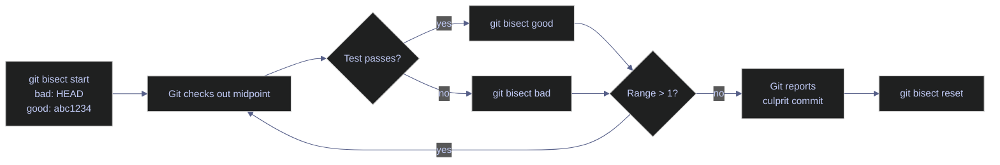

# Git History and Inspection

> [!quote]
> "The past is never dead. It's not even past."
>
> — **William Faulkner**, *Requiem for a Nun* (1951)

Git's history inspection tools — `git log`, `git diff`, `git blame`, and `git show` — are essential for understanding what changed, when, and by whom. These are the commands you reach for during code review, debugging, and post-incident analysis.

## git log — The Commit Timeline

The commit log is a reverse-chronological list of every commit in the current branch's history, showing who made each change, when, and why (the commit message). Each entry includes a SHA hash, author, date, and message. The log is your primary tool for understanding how a codebase evolved over time.

### git log — Basic Options

#### git log --oneline — compact one-line history

Prints one line per commit: the short SHA and the commit message. The most common starting point for browsing recent history at a glance.

```bash
git log --oneline
```

```text
a3f9c21 fix: handle null values in transform_ohlcv
7b8d4e0 feat: add ESG score normalization pipeline
cd97a43 refactor: extract loader into separate module
4e2b8a1 chore: update dependencies
1f3c7d9 docs: add API usage examples
```

#### git log -n — limit to N most recent commits

Restricts output to the last N commits. Useful when you only need to review recent changes without scrolling through the full history.

```bash
git log --oneline -10
```

#### git log --graph --all — ASCII branch graph

Draws the commit DAG as an ASCII tree, showing all branches and their divergence and merge points. The `--all` flag includes branches not checked out locally.

```bash
git log --oneline --graph --all
```

```text
* a3f9c21 (HEAD -> main, origin/main) fix: handle null values
* 7b8d4e0 feat: add ESG score normalization
| * c1e2f3a (feat/bisect-debug) wip: bisect test
|/
* cd97a43 refactor: extract loader
```

#### git log --author and --since — filter by author and date

Narrows the log to commits by a specific author (`--author` accepts a partial string match) within a time window. Use `--since` and `--until` to bound the date range. Useful for reviewing a teammate's contributions or auditing changes in a sprint.

```bash
git log --author="alice" --since="2 weeks ago"
```

#### git log -- file — history of a specific file

The double dash `--` separates the branch/ref arguments from the file path, preventing ambiguity when a filename could be mistaken for a branch name. Shows only commits that touched the specified file.

```bash
git log -- path/to/file.py
```

#### git log --decorate — branch topology view

Combines graph layout with branch and tag labels, showing where each branch pointer currently sits in the DAG. Limiting with `-20` keeps the output manageable for daily review.

```bash
git log --oneline --graph --decorate -20
```

### git log — Advanced Formats

#### git shortlog -sn — commit count per author

Summarises commit history grouped by author. The `-s` flag suppresses individual commit messages (showing count only), and `-n` sorts the output by commit count descending. Useful for contribution audits.

```bash
git shortlog -sn
```

```text
    42  alice
    31  bob
     8  charlie
```

#### git log -p — commits with full diff

Appends the full patch (diff) for each matching commit. Combined with a file path, this lets you see every change ever made to that file in chronological order — the most thorough tool for root-cause analysis.

```bash
git log -p -- path/to/file.py
```

#### git log --grep — search commit messages

Filters the log to commits whose message matches the given pattern. Case-sensitive by default; add `-i` for case-insensitive search. Useful for finding all commits that addressed a specific issue or feature keyword.

```bash
git log --grep="fix" --oneline
```

#### git log -S — pickaxe search

Shows only commits that changed the number of occurrences of the given string in the codebase. This answers "when was this function or variable first introduced, or when was it removed?" — far more precise than grepping commit messages.

```bash
git log -S "deadlock" --oneline
```

| Flag | Syntax | Description |
|---|---|---|
| `--oneline` | `git log --oneline` | One line per commit: short SHA + message |
| `-n` | `git log -10` | Limit to last N commits |
| `--graph` | `git log --graph` | ASCII tree of the commit DAG |
| `--all` | `git log --all` | Include all branches, not just current |
| `--decorate` | `git log --decorate` | Show branch and tag labels on commits |
| `--author` | `git log --author="alice"` | Filter commits by author name (partial match) |
| `--since` | `git log --since="2 weeks ago"` | Show commits after a date |
| `--until` | `git log --until="2026-03-01"` | Show commits before a date |
| `-p` | `git log -p` | Include full diff patch per commit |
| `--stat` | `git log --stat` | Show changed files and line counts per commit |
| `--grep` | `git log --grep="fix"` | Filter by commit message pattern |
| `-S` | `git log -S "keyword"` | Pickaxe: commits that added or removed string |
| `--follow` | `git log --follow -- file` | Follow renames through file history |
| `--no-merges` | `git log --no-merges` | Exclude merge commits |
| `--merges` | `git log --merges` | Show only merge commits |

---

## git diff — What Changed

`git diff` compares file contents between different states: working directory vs last commit, staged changes vs last commit, or any two commits or branches. Mastering `git diff` is essential for reviewing your work before committing and for understanding what changed in a PR.

> [!info] Two-dot vs three-dot diff
>
> `git diff main..branch` compares the tips directly — any commits on main since the branch diverged are included. `git diff main...branch` (three dots) shows only what changed on the branch since it diverged from main — this is what you want for PR previews.

### git diff — Comparing Changes

#### git diff — unstaged changes

Shows the difference between the working directory and the last commit (HEAD). This is what you have modified but not yet staged — equivalent to "what would I lose if I ran `git checkout .`?"

```bash
git diff
```

#### git diff --staged — staged changes

Shows the difference between the staging area (index) and the last commit. This is exactly what will go into the next commit when you run `git commit`. The `--cached` flag is a synonym.

```bash
git diff --staged
```

#### git diff main...branch — branch changes from divergence point

Shows only the changes made on the current branch since it diverged from main. The three-dot syntax finds the merge base automatically, so commits that landed on main after the branch was created are excluded. Use this for PR previews.

```bash
git diff main...feat/my-branch
```

#### git diff HEAD~N — changes from N commits ago

Compares the working directory against the commit N steps before HEAD. Useful for reviewing the cumulative effect of recent work before deciding what to commit.

```bash
git diff HEAD~3
```

#### git diff --name-only — summary of changed files

Lists only the filenames that differ, without showing the diff content. Combine with `--stat` to also show line-count changes. Useful for a quick overview before a full review.

```bash
git diff --name-only main...HEAD
```

### git diff — Output Interpretation

#### Reading a unified diff

A unified diff header identifies the files being compared, their content hashes, and the changed line ranges. Lines prefixed with `-` were removed (shown in red), lines prefixed with `+` were added (shown in green), and lines with no prefix are context lines that were not changed.

```text
diff --git a/pipeline/load.py b/pipeline/load.py
index 3c4a5b6..7d8e9f0 100644
--- a/pipeline/load.py         ← old version
+++ b/pipeline/load.py         ← new version
@@ -42,7 +42,9 @@              ← line numbers: -42 (old start), +42 (new start), 7/9 lines shown
 def load_ohlcv(data):
-    rows = []                  ← red: deleted line
+    inserts = []               ← green: added line
+    updates = []               ← green: added line
     for row in data:
```

| Flag | Syntax | Description |
|---|---|---|
| `--staged` / `--cached` | `git diff --staged` | Staged changes vs last commit |
| `..` | `git diff main..branch` | Diff between two branch tips |
| `...` | `git diff main...branch` | Changes on branch since divergence (merge base) |
| `HEAD~N` | `git diff HEAD~3` | Working directory vs N commits ago |
| `--name-only` | `git diff --name-only` | List only filenames, no diff content |
| `--stat` | `git diff --stat` | Files changed with line count summary |
| `--word-diff` | `git diff --word-diff` | Inline word-level diff instead of line-level |
| `-w` | `git diff -w` | Ignore whitespace changes |
| `--diff-filter` | `git diff --diff-filter=A` | Filter by change type: A=added, D=deleted, M=modified |

---

## git blame — Who Changed Each Line

Blame annotates each line of a file with the commit SHA, author, and date of the last change to that line. It answers "who wrote this line and when?" — essential for understanding why code looks the way it does and for tracing decisions back to their original context.

### git blame — Annotating Files

#### git blame — basic usage

Outputs the full annotated file. Each line is prefixed with the commit SHA, author, date, and line number. The `^` prefix on a SHA indicates the root commit of the repository.

```bash
git blame src/transform.py
```

```text
^cd97a43 (alice 2026-03-10 14:22:31 +0100  42) def transform_ohlcv(df):
7b8c9d0e (bob   2026-03-12 09:15:42 +0100  43)     df = df.dropna()
```

Each line shows: `commit-sha (author date line-number) code`.

#### git blame -w — ignore whitespace changes

Excludes pure whitespace-only commits from attribution. Without `-w`, a commit that only reformatted indentation would appear as the "author" of every line it touched, obscuring the true logical author.

```bash
git blame -w src/transform.py
```

#### git blame -C — detect lines moved from other files

Traces lines that were moved or copied from other files in the same commit, attributing them to their true origin rather than the refactoring commit. Useful when a function was extracted into a new file.

```bash
git blame -C src/transform.py
```

| Flag | Syntax | Description |
|---|---|---|
| `-w` | `git blame -w <file>` | Ignore whitespace-only changes in attribution |
| `-C` | `git blame -C <file>` | Detect lines moved from other files |
| `-M` | `git blame -M <file>` | Detect lines moved within the same file |
| `-L` | `git blame -L 40,60 <file>` | Restrict output to a line range |
| `-e` | `git blame -e <file>` | Show author email instead of name |
| `--since` | `git blame --since="1 year ago" <file>` | Ignore commits older than the given date |

---

## git show — Inspect a Commit

`git show` displays the full metadata and diff for a specific commit, tag, or object. The `ref:path` syntax extends it to retrieve file content at any point in history — useful for comparing current code against a known-good version without checking out the commit.

### git show — Viewing Commits and Files

#### git show — full commit details

Displays the commit metadata (author, date, message) followed by the full diff of all changes in that commit. Accepts any valid ref: a short SHA, full SHA, branch name, or tag.

```bash
git show cd97a43
```

#### git show HEAD:file — file content at a specific commit

Retrieves the exact content of a file at a given commit without modifying the working directory. Useful for comparing the current version of a file against a known-good version.

```bash
git show HEAD:src/config.py
```

#### git show ref:file — content at a branch or tag

The same `ref:path` syntax works with any branch name or tag. Use this to inspect what a file looked like at a release boundary.

```bash
git show main:src/config.py
git show v1.0.0:src/config.py
```

| Flag | Syntax | Description |
|---|---|---|
| `--stat` | `git show <sha> --stat` | Summary of changed files and line counts |
| `--name-only` | `git show <sha> --name-only` | List only changed filenames |
| `-q` | `git show -q <sha>` | Suppress diff output (metadata only) |
| `--format` | `git show --format="%H %s"` | Custom output format |
| `ref:path` | `git show HEAD:file.py` | Retrieve file content at a given ref |

---

## Finding Changes Quickly

These workflows combine multiple inspection commands to answer targeted questions: when a bug appeared, which files changed in a branch, or who owns a specific line of code.

### When Did a Bug Appear? — git bisect

Bisect uses binary search to find the exact commit that introduced a bug. You mark one commit as bad (current broken state) and one as good (known working state), and Git automatically checks out the midpoint. After testing each checkpoint and marking it good or bad, Git narrows the range and pinpoints the exact offending commit in O(log n) steps — far faster than checking every commit manually.



> [!todo] Run a bisect session
> 1. `git bisect start` — enter bisect mode
> 2. `git bisect bad` — mark current commit as broken
> 3. `git bisect good <sha>` — mark a known-good commit
> 4. Test the checked-out commit; run `git bisect good` or `git bisect bad`
> 5. Repeat step 4 until Git reports the culprit commit
> 6. `git bisect reset` — return HEAD to where you started

> [!warning] Bisect fails in shallow clones
>
> `git bisect` needs the full commit history between the good and bad boundaries. Shallow clones (`--depth 1`) will error with "not a valid object" for any commit outside the shallow range. Flaky tests at a checkpoint will also mislead bisect if marked incorrectly.

> [!success] Unshallow before bisecting
>
> Run `git fetch --unshallow` to convert a shallow clone to a full clone, then retry bisect.

### What Files Changed in a PR? — diff summary

#### git diff --name-only — list changed files

Lists the names of files that differ between the current branch and main, from the divergence point. Useful for quickly understanding the scope of a PR before a full review.

```bash
git diff --name-only main...HEAD
```

```text
pipeline/load.py
pipeline/transform.py
tests/test_load.py
```

#### git diff --stat — changed files with line counts

Shows the same list as `--name-only` but includes a line count summary and a visual bar showing the proportion of additions vs deletions.

```bash
git diff --stat main...HEAD
```

```text
 pipeline/load.py      | 12 ++++++------
 pipeline/transform.py |  5 +++++
 tests/test_load.py    | 18 ++++++++++++++++++
 3 files changed, 29 insertions(+), 6 deletions(-)
```

### Who Changed This? — blame + log combination

#### git blame -L — blame a specific line range

Restricts blame output to the given line range, making it easy to focus on a single function or block without the noise of the full file.

```bash
git blame -L 42,42 src/transform.py
```

```text
7b8c9d0e (bob 2026-03-12 09:15:42 +0100 42)     df = df.dropna()
```

#### git show — inspect the found commit

Takes the SHA from blame output and shows the full commit: message, author, and diff of every change in that commit.

```bash
git show <commit-sha>
```

#### git show --stat — what else did the commit touch

Shows only the filenames and line counts changed in the commit, without the full diff. Useful for quickly understanding the scope of the blamed commit before reading the full diff.

```bash
git show <commit-sha> --stat
```

---

## Quick Reference Cheat Sheet

A summary of the most commonly used history and inspection commands.

| Command | Purpose |
|---------|---------|
| `git log --oneline -20` | Last 20 commits, compact |
| `git log --oneline --graph --all` | All branches visualized |
| `git log --author="alice"` | Only alice's commits |
| `git log -- file.py` | Commits that touched this file |
| `git log -S "keyword"` | Commits that added/removed a string |
| `git diff` | Unstaged changes |
| `git diff --staged` | Staged changes (what's in next commit) |
| `git diff main...HEAD` | All changes on your branch vs main |
| `git blame file.py` | Who wrote each line |
| `git show abc1234` | Full details of a commit |
| `git show HEAD:file.py` | File content at HEAD |

## Related

- [git-daily-workflow](https://alp78.github.io/elysium/08-Git/git-daily-workflow) — the daily git commands that generate history
- [git-recovery-and-undo](https://alp78.github.io/elysium/08-Git/git-recovery-and-undo) — using reflog and bisect to recover or diagnose
- [git-common-errors](https://alp78.github.io/elysium/08-Git/git-common-errors) — shallow clone errors and bisect failure scenarios
- [merge-vs-rebase-vs-squash](https://alp78.github.io/elysium/08-Git/merge-vs-rebase-vs-squash) — how merge strategies affect what `git log --graph` shows
- [pull-requests-and-code-review](https://alp78.github.io/elysium/08-Git/pull-requests-and-code-review) — diff commands used during code review

## References

- [git log](https://git-scm.com/docs/git-log)
- [git diff](https://git-scm.com/docs/git-diff)
- [git blame](https://git-scm.com/docs/git-blame)
- [git show](https://git-scm.com/docs/git-show)
