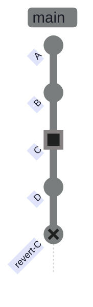
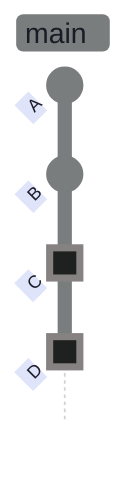
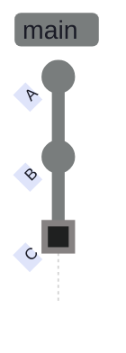
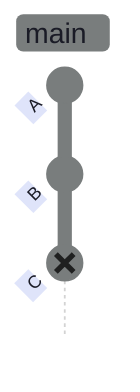
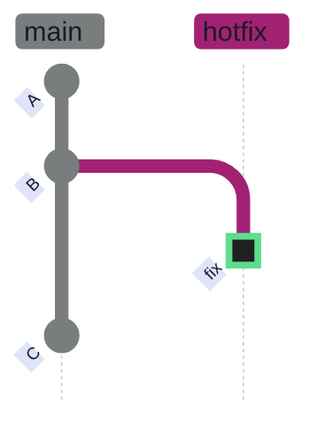
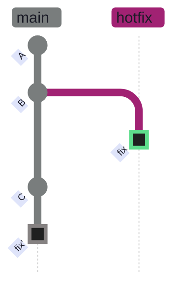
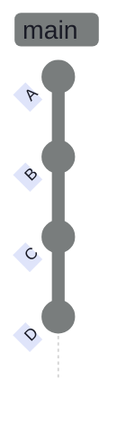

---
tags:
  - git
  - recovery
  - rebase
aliases: [git reset, git revert, git reflog, git stash, undo commit, recover lost commit, git undo]
description: "Complete guide to undoing changes in Git — safe methods (restore, revert) and destructive methods (reset --hard), using reflog to recover lost commits, and stash for temporary shelving."
created: 2026-03-22
updated: 2026-04-05
status: complete
---

# Git Recovery and Undo

> [!quote]
> "Nobody actually creates perfect code the first time around, except me. But there's only one of me."
>
> — **Linus Torvalds**, Git mailing list

Everyone makes mistakes. Git has several ways to undo things, ranging from completely safe to permanently destructive. The key is matching the right tool to the situation — use the decision table below to navigate to the right section.

| Situation | Right tool |
|---|---|
| Haven't committed yet | `git restore` (discard) or `git stash` (save for later) |
| Committed but not pushed | `git reset --soft` (redo) or `git commit --amend` (fix) |
| Pushed but not merged | `git revert` (safe undo) or [force-push](https://alp78.github.io/elysium/08-Git/git-remote-management) if you're the only one on the branch |
| Merged to main | `git revert` — create an undo commit. Never rewrite main's history. |
| Lost a commit | `git reflog` — Git's safety net, remembers everything for ~90 days |

---

## Undoing Changes

Git provides three tools for undoing work: `git restore` for discarding uncommitted changes, `git revert` for creating a new undo commit on a shared branch, and `git reset` for rewriting local history. Choose based on whether your work is committed and whether the branch is shared.

### Discard Uncommitted Changes

`git restore` discards working tree or staging area changes without touching the commit history. It does not affect untracked files — use `git clean` for those.

> [!info]
> `git restore` was introduced in Git 2.23 alongside `git switch`, splitting the overloaded `git checkout` command into two purpose-specific commands. The older `git checkout -- <file>` syntax still works but is deprecated in favour of `git restore`.

#### git restore — discard working tree changes

Reverts a file in your working directory to its state at the last commit. Changes that have not been staged are permanently lost — there is no undo outside of the reflog for uncommitted work.

```bash
git restore filename.py
```

#### git restore --staged — unstage without discarding

Moves a file from the staging area (index) back to the working directory. The file's changes are preserved — they are simply no longer staged for the next commit.

```bash
git restore --staged filename.py
```

#### git checkout -- (legacy syntax)

Identical effect to `git restore` on the working tree. Kept for familiarity — prefer `git restore` in new workflows.

```bash
git checkout -- filename.py
```

| Flag | Syntax | Description |
|---|---|---|
| `--staged` | `git restore --staged <file>` | Unstage a file without discarding changes |
| `--worktree` | `git restore --worktree <file>` | Discard working tree changes (default) |
| `--source=<tree>` | `git restore --source HEAD~2 file` | Restore file from a specific commit |
| `-p` / `--patch` | `git restore -p <file>` | Interactively select hunks to restore |

---

### Revert a Commit

`git revert` creates a new commit that is the logical inverse of a previous commit — it undoes the changes without removing the original commit from history. This is the standard approach for shared branches where rewriting history is not acceptable.

#### git revert — create a new undo commit

Reads the diff of the target commit, applies the inverse changes to the working tree, stages them, and creates a new commit. The original commit remains in the log. Git opens your editor to confirm the commit message unless `--no-edit` is passed.

**After `git revert abc1234`:**



*Figure: git revert C creates a new commit that undoes C's changes while preserving the original in history. The REVERSE commit cancels C's effect. Both remain visible in git log — history is never rewritten.*

The REVERSE commit (`revert-C`) cancels the effect of `C`. Both commits remain visible in `git log` — history is never rewritten.

```bash
git revert abc1234
```

```bash
git revert HEAD
```

> [!tip] Revert is the safe way to undo on shared branches
>
> `git revert` does not rewrite history. Anyone who already pulled the branch still has a consistent view — they simply see the new undo commit arrive on their next `git pull`. Use it on any branch that others have checked out.

| Flag | Syntax | Description |
|---|---|---|
| `-n` / `--no-commit` | `git revert -n abc1234` | Stage the revert without committing (allows editing) |
| `--no-edit` | `git revert --no-edit HEAD` | Skip the editor, accept the default message |
| `-e` / `--edit` | `git revert -e abc1234` | Open the editor (default when run interactively) |
| `-m <parent>` / `--mainline` | `git revert -m 1 abc1234` | Revert a merge commit — specify which parent is mainline |

---

### Reset — Rewrite History

`git reset` moves the `HEAD` pointer (and the current branch pointer) backward to a previous commit. The three modes control what happens to the commits that are "un-done": `--soft` keeps their changes staged, `--mixed` keeps them unstaged, and `--hard` discards them entirely.

> [!danger] git reset rewrites history
>
> Once you reset and the original commits are no longer reachable from any branch or tag, Git will garbage-collect them. They can be recovered via reflog within ~90 days, but after that they are gone permanently. Never reset commits that have already been pushed to a shared branch.

> [!success] Use reflog to undo an accidental reset
>
> Run `git reflog` immediately after an unintended reset. Your pre-reset state appears as `HEAD@{1}`. Restore it with `git reset --hard HEAD@{1}`.

**Before reset (starting state):**



*Figure: Starting state — HEAD at commit D on main. Reset will move HEAD backward, and what happens to D's changes depends on the mode: --soft keeps staged, --mixed keeps unstaged, --hard discards.*

**After `git reset HEAD~1` (HEAD moves back to C, D is un-done):**



*Figure: After git reset HEAD~1 — HEAD moved back to C. Commit D is removed from the branch. Its changes are in the staging area (--soft), working tree (--mixed), or discarded (--hard).*

Commit D's changes land in the staging area (`--soft`), the working tree (`--mixed`), or nowhere (`--hard`), depending on the mode used.

#### git reset --soft — undo commit, keep changes staged

Moves HEAD one commit back. The changes from the un-done commit are preserved in the staging area, ready for `git commit`. Use this to rewrite a commit message or add more files before recommitting.

```bash
git reset --soft HEAD~1
```

#### git reset --mixed — undo commit, unstage changes

The default mode. Moves HEAD back and unstages the changes — they remain in the working directory as modified files. Use this to break apart a commit into smaller ones.

```bash
git reset --mixed HEAD~1
```

#### git reset --hard — discard all changes permanently

Moves HEAD back and discards every change from the un-done commits — both staged and working tree. The working directory is completely reset to match the target commit. Use only on local, unpushed commits.

```bash
git reset --hard HEAD~1
```

> [!warning] Hard reset is destructive
>
> `git reset --hard` discards uncommitted and staged work permanently. Your working directory is overwritten with no warning. Verify you have nothing unsaved before running it.

> [!success] Prefer --soft or --mixed to keep your work
>
> Use `git reset --soft HEAD~1` to keep changes staged, or `git reset --mixed HEAD~1` to keep them unstaged. Both preserve your work and let you revise and recommit.

#### git reset --hard origin/main — sync local branch to remote

Discards all local commits and uncommitted changes, resetting the branch to exactly match the remote. All local-only work is permanently destroyed.

```bash
git reset --hard origin/main
```

> [!danger] This destroys all local work
>
> Every commit and uncommitted change that exists locally but not on the remote is permanently lost. This includes local-only commits, staged changes, and working tree modifications.

> [!success] Stash or branch first to preserve local work
>
> Run `git stash` before any `reset --hard` to preserve uncommitted changes. For local-only commits you want to keep, use `git reset --soft origin/main` instead — it preserves the commits' changes in the staging area.

| Flag | Syntax | Description |
|---|---|---|
| `--soft` | `git reset --soft HEAD~N` | Undo N commits, keep changes staged |
| `--mixed` | `git reset --mixed HEAD~N` | Undo N commits, keep changes unstaged (default) |
| `--hard` | `git reset --hard HEAD~N` | Undo N commits, discard all changes |
| `--keep` | `git reset --keep HEAD~N` | Like `--hard` but aborts if local changes would be lost |
| `--merge` | `git reset --merge HEAD~N` | Abort a failed merge and reset to pre-merge state |
| `-p` / `--patch` | `git reset -p HEAD~1` | Interactively select hunks to unstage |

---

## Reflog — Git's Safety Net

The reflog is a local log of everywhere HEAD has pointed — every commit, reset, checkout, merge, and rebase. Unlike `git log`, which follows parent commits, the reflog records **HEAD movements** in chronological order. It is the last line of defence when commits appear to be lost.

### Recovering Lost Commits

The reflog retains entries for approximately 90 days by default (`gc.reflogExpire`). During this window, any commit that HEAD ever pointed to — even after a `reset --hard` — can be recovered.

> [!tip] Even hard reset is recoverable via reflog
>
> `git reset --hard` is not truly destructive during the 90-day reflog window. The "lost" commits still exist in the object store — they are simply unreachable from the current branch pointer. The reflog gives you the SHA to get them back.

**Before accidental reset (original state):**



*Figure: Commit C appears lost after an accidental reset --hard. The branch pointer no longer reaches it. But C still exists in the Git object database.*

**After recovery with `git reset --hard <SHA>`:**


*Figure: After git reset --hard <SHA> — commit C is restored. The reflog provided the SHA, and reset moved HEAD back to it. Commits survive in the object store for ~90 days after being orphaned.*

#### git reflog — view all HEAD movements

Lists every position HEAD has occupied, newest first. Each entry shows a short SHA, the reflog index (`HEAD@{N}`), and the action that caused the move. Use this to find the SHA of any lost commit.

```bash
git reflog
```

```text
abc1234 HEAD@{0}: reset: moving to HEAD~1
def5678 HEAD@{1}: commit: add pulse fetcher refactor
ghi9012 HEAD@{2}: commit: update schema for ESG fields
jkl3456 HEAD@{3}: checkout: moving from develop to main
```

#### git reset --hard <SHA> — restore from reflog

Once you have identified the target SHA from `git reflog`, move HEAD back to that commit. All commits between the current HEAD and the target are restored to the branch pointer.

```bash
git reset --hard def5678
```

| Flag | Syntax | Description |
|---|---|---|
| `--all` | `git reflog --all` | Show reflogs for all refs, not just HEAD |
| `expire` | `git reflog expire --expire=now --all` | Manually expire old reflog entries |
| `delete` | `git reflog delete HEAD@{N}` | Delete a specific reflog entry |
| `--expire=<time>` | `git reflog expire --expire=90.days.ago` | Expire entries older than a given time |

---

## Stash — Temporarily Shelve Work

The stash is a stack-based temporary storage area for uncommitted changes. It lets you save a dirty working tree without committing, so you can switch context (e.g., fix an urgent bug on another branch) and return to your work later. The stash operates on **tracked** files by default — use `--include-untracked` to also stash new files that have not yet been added to the index.

### Basic Stash Operations

The stash stores changes as a special stash commit in a side-stack (`refs/stash`), separate from your branch history. `git stash pop` removes the entry after applying; `git stash apply` keeps it in the stack.

#### git stash — shelve all tracked changes

Saves all modified and staged tracked files to the stash and reverts the working directory to a clean state matching HEAD.

```bash
git stash
```

#### git stash push -m — stash with a descriptive label

Adds a message to the stash entry so you can identify it in `git stash list` later.

```bash
git stash push -m "WIP: pulse fetcher refactor"
```

#### git stash list — view the stash stack

Shows all stash entries, ordered from newest (index 0) to oldest.

```bash
git stash list
```

```text
stash@{0}: On main: WIP: pulse fetcher refactor
stash@{1}: WIP on feature/esg: index schema update
stash@{2}: On develop: quick fix attempt
```

#### git stash pop — apply and remove top entry

Applies the most recent stash entry to the working directory and removes it from the stack. If applying causes conflicts, the stash entry is **not** auto-dropped — you must resolve conflicts and drop it manually.

```bash
git stash pop
```

#### git stash apply — apply without removing

Applies a stash entry but keeps it in the stack. Use when you want to apply the same stash to multiple branches or keep it as a reference.

```bash
git stash apply
```

```bash
git stash apply stash@{2}
```

#### git stash drop — remove a specific entry

Removes one stash entry by index without applying it.

```bash
git stash drop stash@{2}
```

#### git stash clear — delete all entries

Permanently removes every entry in the stash stack — not just the top one.

```bash
git stash clear
```

> [!danger] stash clear deletes ALL stashes permanently
>
> There is no undo for `git stash clear`. Every stash entry is gone. If you meant to drop just one entry, use `git stash drop stash@{N}` with the specific index. Always run `git stash list` first to confirm what is in the stack.

> [!success] Drop a single stash entry safely
>
> Run `git stash list` to review the stack, then `git stash drop stash@{N}` to remove only the specific entry you no longer need. All other stash entries remain intact.

| Flag | Syntax | Description |
|---|---|---|
| `-m <msg>` | `git stash push -m "label"` | Stash with a descriptive message |
| `-u` / `--include-untracked` | `git stash push -u` | Also stash untracked (new, unstaged) files |
| `--keep-index` | `git stash push --keep-index` | Stash only unstaged changes — leave staged changes intact |
| `-p` / `--patch` | `git stash push -p` | Interactively select hunks to stash |
| `-a` / `--all` | `git stash push -a` | Include untracked and ignored files |

---

## Common Error Fixes

Targeted recovery procedures for the most common Git mistakes. Each scenario uses the undo tools covered above — restore, revert, reset, reflog, and stash.

### "Committed to wrong branch"

You accidentally committed work to `main` or the wrong feature branch. Move it to the correct branch without losing any changes.

Note the current commit SHA first, then undo the commit, stash the changes, switch branches, and recommit.

```bash
git log --oneline -1
```

```text
abc1234 fix: update OHLCV loader schema
```

```bash
git reset --soft HEAD~1
```

```bash
git stash
```

```bash
git checkout correct-branch
```

```bash
git stash pop
```

```bash
git commit -m "my message"
```

### "Accidentally deleted a file"

You deleted a tracked file and need to restore it from the last commit.

```bash
git restore filename.py
```

### "Need to undo a push"

You pushed a commit to a shared branch and need to undo it. Create a revert commit to reverse the change, then push the revert.

```bash
git revert HEAD
```

```bash
git push
```

> [!tip] Revert then push for shared branches
>
> This approach creates an undo commit rather than rewriting history. Safe for any branch that others have already pulled — they simply receive the revert commit on their next `git pull`.

### "Accidentally committed a large file"

You committed a file that is too large for the remote (e.g., a CSV or binary) and need to remove it before pushing.

Undo the commit to keep the changes staged, add the file to `.gitignore` to prevent it from being tracked again, then remove it from the index without deleting it from disk, and recommit.

```bash
git reset --soft HEAD~1
```

```bash
git rm --cached large_file.csv
```

```bash
git commit -m "remove large file"
```

### Stash pop causes conflicts

When `git stash pop` produces conflicts, files will contain conflict markers:

```
<<<<<<< Updated upstream     ← what's on the current branch
            rows = []
            skipped = 0
=======                      ← separator
            inserts = []
            updates = []
>>>>>>> Stashed changes      ← your stashed work
```

> [!warning] Stash entry is preserved on conflict
>
> When `git stash pop` conflicts, the stash entry is **not** auto-dropped. Your work is safe. After resolving, manually drop it with `git stash drop`.

> [!success] Resolve conflicts, then drop manually
>
> Edit the conflict markers in each file, stage the resolved files with `git add`, then run `git stash drop` to clean up the preserved stash entry. Your changes are now fully applied to the working tree.

```bash
git add ingestion/loaders/load_ohlcv.py
```

```bash
git stash drop
```

### "Deleted branch before squash-merging the PR"

The branch was deleted before the PR was squash-merged. Find the commit SHA from the reflog, recreate the branch, push it, and reopen the PR.

When Git deletes a branch it prints the SHA: `"Deleted branch feat/my-feature (was ec9ff69)"`. If you missed that output, find it via reflog.

```bash
git reflog | grep feat/my-feature
```

```bash
git branch feat/my-feature ec9ff69
```

```bash
git push origin feat/my-feature
```

```bash
gh pr reopen 26
```

### "fatal: cannot lock ref" or lock file error

A previous Git command crashed mid-operation and left a lock file behind. Git uses lock files to prevent concurrent writes — a stale lock blocks all subsequent operations on that ref.

Remove the stale lock file for the affected branch:

```bash
rm -f .git/refs/heads/branch-name.lock
```

Or for a stale index lock:

```bash
rm -f .git/index.lock
```

---

## Advanced Operations

More powerful Git tools for surgical history manipulation. These operations are safe on local, unpushed branches but must be used with care on shared history. See also: [merge vs rebase vs squash](https://alp78.github.io/elysium/08-Git/merge-vs-rebase-vs-squash).

### Cherry-Pick

Cherry-picking copies a single commit from one branch and applies it as a new commit on the current branch. Unlike merging (which brings in an entire branch's history), cherry-pick lets you surgically extract exactly one commit. It is most useful when a bug fix landed on a different branch and you need just that fix without everything else.

#### git cherry-pick — copy a commit to current branch

Git reads the diff of the source commit, applies those changes to the current branch, and creates a new commit with a new SHA. The original commit remains on its source branch unchanged.

**Before cherry-pick:**



*Figure: The fix commit on the hotfix branch contains a bug fix needed on main. Cherry-pick will copy it.*

**After `git cherry-pick abc1234` (on main):**



*Figure: After git cherry-pick — the fix is copied to main as fix' (new SHA, same changes). The original remains on hotfix. fix' is independent — no merge relationship.*

The cherry-picked commit gets a new SHA on main (`abc1234'`). The original fix remains on `hotfix` with its original SHA.

```bash
git cherry-pick abc1234
```

> [!warning] Cherry-pick creates duplicate commits
>
> The cherry-picked commit gets a new SHA. If you later merge the source branch, Git may flag the duplicated changes as a conflict because both the original and the copy exist in history with different SHAs. Cherry-pick sparingly.

> [!success] Merge or rebase the full branch when possible
>
> If you only need one fix from a long-lived branch, open a focused PR on that branch containing just the fix commit, then merge it cleanly. Avoid cherry-picking from branches you plan to merge later.

| Flag | Syntax | Description |
|---|---|---|
| `-n` / `--no-commit` | `git cherry-pick -n abc1234` | Apply changes without committing (allows editing) |
| `-e` / `--edit` | `git cherry-pick -e abc1234` | Open the editor to modify the commit message |
| `-x` | `git cherry-pick -x abc1234` | Append `(cherry picked from commit ...)` to the message |
| `--abort` | `git cherry-pick --abort` | Abort the cherry-pick and restore the pre-pick state |
| `--continue` | `git cherry-pick --continue` | Resume after manually resolving conflicts |
| `--skip` | `git cherry-pick --skip` | Skip the current conflicting commit and continue |
| `--quit` | `git cherry-pick --quit` | Stop cherry-pick but keep changes in working tree |

---

### Interactive Rebase

Interactive rebase lets you rewrite your recent commit history — reorder commits, combine multiple commits into one (squash), edit commit messages, or drop commits entirely. It opens an editor showing your recent commits as a todo list where you choose what to do with each one. This is a powerful cleanup tool before pushing or opening a PR.

#### git rebase -i — rewrite recent commit history

Runs an interactive session covering the last N commits. Git opens your editor with a list of `pick <SHA> <message>` lines. Change the action word for each commit to control what happens to it.

**Before `git rebase -i HEAD~3` (squashing C and D into B):**



*Figure: Before interactive rebase — commits B, C, D will be squashed. Running git rebase -i HEAD~3 opens an editor to choose which commits to pick, squash, or drop.*

**After squash (B + C + D collapsed into B'):**

```mermaid
%%{init: {'theme': 'dark', 'themeVariables': {'commitLabelColor': '#1a1b26', 'commitLabelBackground': '#c0caf5', 'gitBranchLabel0': '#1a1b26', 'gitBranchLabel1': '#1a1b26', 'gitBranchLabel2': '#1a1b26', 'gitBranchLabel3': '#1a1b26', 'tagLabelColor': '#1a1b26', 'tagLabelBackground': '#c0caf5'}, 'gitGraph': {'mainBranchName': 'main'}} }%%
gitGraph TB:
  commit id: "A"
  commit id: "B'" type: HIGHLIGHT
```



*Figure: After squash — B, C, and D collapsed into B' (new SHA). History is clean with a single commit capturing all three changes.*

```bash
git rebase -i HEAD~5
```

> [!danger] Dropping a commit is permanent
>
> If you change `pick` to `drop` (or delete a line) in the interactive rebase editor, that commit's changes are permanently removed from the branch. Unlike `git reset --soft`, the changes are **not** preserved in your working directory. If you drop the wrong commit, use `git reflog` to find the pre-rebase state and restore with `git reset --hard`.

> [!success] Use fixup instead of drop to preserve changes
>
> To discard a commit's message but keep its changes, use `fixup` — it squashes the commit into the previous one silently. To truly remove a commit's changes, first confirm via `git show <SHA>` that you have no need for them.

> [!danger] Only rebase unpushed commits
>
> Interactive rebase rewrites history and generates new SHAs. If you rebase commits that others have already pulled, their history diverges from yours. Force-pushing over a shared branch overwrites their work.

> [!success] Push only after rebase is complete
>
> Finish the entire interactive rebase session and verify with `git log --oneline`. Then use `git push --force-with-lease` to safely update your remote feature branch — `--force-with-lease` aborts if someone else has pushed since you last fetched.

| Action | Syntax | Description |
|---|---|---|
| `pick` | `pick <SHA>` | Keep the commit as-is (default) |
| `reword` | `reword <SHA>` | Keep commit, edit the message |
| `edit` | `edit <SHA>` | Pause to amend the commit (files + message) |
| `squash` | `squash <SHA>` | Combine with previous commit, edit the merged message |
| `fixup` | `fixup <SHA>` | Combine with previous commit, discard this commit's message |
| `drop` | `drop <SHA>` | Remove the commit and its changes permanently |
| `exec` | `exec <cmd>` | Run a shell command after the preceding commit |

---

### Bisect — Find the Breaking Commit

Git bisect uses binary search to find the exact commit that introduced a bug. You mark one commit as `bad` (the current broken state) and one as `good` (a known-working state). Git checks out the midpoint, you test it, and you tell Git `good` or `bad`. Repeat until Git identifies the culprit commit. See also: [git-history-and-inspection](https://alp78.github.io/elysium/08-Git/git-history-and-inspection).

#### git bisect — binary search for bad commit

Start the bisect session by marking the current commit as broken and identifying a good baseline. Git then checks out the commit halfway between them and waits for your verdict.

```bash
git bisect start
```

```bash
git bisect bad
```

```bash
git bisect good abc1234
```

```text
Bisecting: 6 revisions left to test after this (roughly 3 steps)
[def5678] add ESG score aggregation pipeline
```

Test whether the checked-out commit exhibits the bug, then report back:

```bash
git bisect good
```

or

```bash
git bisect bad
```

```text
Bisecting: 2 revisions left to test after this (roughly 1 step)
[ghi9012] update ohlcv loader schema
```

When Git has narrowed it down, it prints:

```text
abc1234 is the first bad commit
commit abc1234
Author: alp78 <alp@example.com>
Date:   Mon Apr 1 14:22:00 2026 +0100

    add bulk insert for pulse feed

 ingestion/loaders/load_pulse.py | 42 +++++++++++++++++++++++++++++++--
```

Reset HEAD back to the branch tip when finished:

```bash
git bisect reset
```

| Sub-command | Syntax | Description |
|---|---|---|
| `start` | `git bisect start` | Begin a bisect session |
| `bad` | `git bisect bad [<rev>]` | Mark a commit (or HEAD) as broken |
| `good` | `git bisect good [<rev>]` | Mark a commit as working |
| `skip` | `git bisect skip [<rev>]` | Skip an untestable commit |
| `reset` | `git bisect reset` | End the session and return to original HEAD |
| `run` | `git bisect run <script>` | Automate bisect with a test script |
| `log` | `git bisect log` | Show the bisect session log |

## Related

- [git-daily-workflow](https://alp78.github.io/elysium/08-Git/git-daily-workflow) — status, staging, committing, pushing
- [git-branching-and-merging](https://alp78.github.io/elysium/08-Git/git-branching-and-merging) — creating branches and merge strategies
- [merge-vs-rebase-vs-squash](https://alp78.github.io/elysium/08-Git/merge-vs-rebase-vs-squash) — when to use each strategy and their DAG implications
- [git-remote-management](https://alp78.github.io/elysium/08-Git/git-remote-management) — push, force-push, and remote branch tracking
- [pull-requests-and-code-review](https://alp78.github.io/elysium/08-Git/pull-requests-and-code-review) — PR merge conflicts and rebase workflows
- [git-history-and-inspection](https://alp78.github.io/elysium/08-Git/git-history-and-inspection) — log, blame, show for understanding what changed

## References

- [git reflog](https://git-scm.com/docs/git-reflog)
- [git reset](https://git-scm.com/docs/git-reset)
- [git revert](https://git-scm.com/docs/git-revert)
- [git cherry-pick](https://git-scm.com/docs/git-cherry-pick)
- [git rebase](https://git-scm.com/docs/git-rebase)
- [git bisect](https://git-scm.com/docs/git-bisect)
