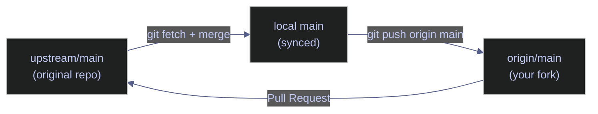
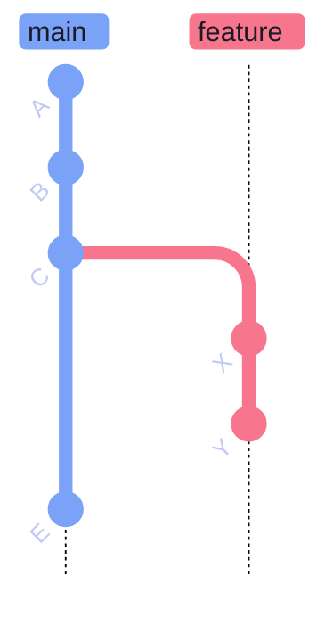
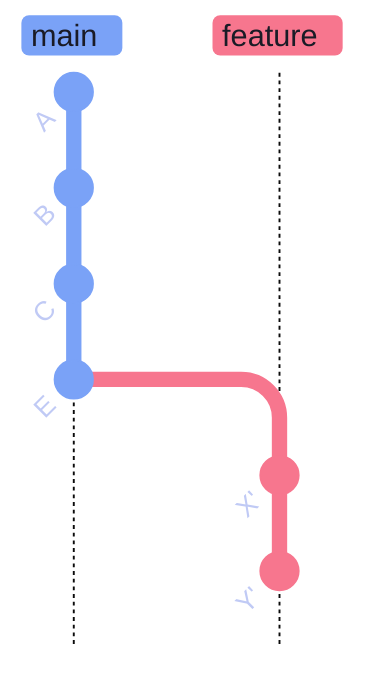

# Git Remote Repository Management

> [!quote]
> "When there is no central 'master' location that contains the source code, you can suddenly host things without the politics that go along with that 'one repo to rule them all' concept."
>
> — **Linus Torvalds**, Git mailing list

Git remotes are named references to copies of a repository hosted on a server (typically GitHub). Every cloned repo starts with one remote — `origin` — pointing at the URL you cloned from. Forked repos commonly add a second remote called `upstream` to track the original project. This note covers every essential remote operation: inspecting remotes, adding new ones, fetching, pruning stale branches, and safely force-pushing after a rebase.

## Viewing Configured Remotes

A remote is a named reference to a copy of the repository hosted on a server. Every cloned repo starts with one remote — `origin` — pointing at the URL you cloned from. Remote-tracking branches (e.g., `origin/main`) are local read-only snapshots of what the remote branch looked like the last time you fetched.

### git remote — inspect and manage named remote connections

`git remote` lists and manages named remote connections. The `-v` flag shows the full fetch and push URLs for each registered remote.

#### git remote -v — list all remotes and their fetch/push URLs

Prints every configured remote with both its fetch URL (used by `git fetch`) and push URL (used by `git push`), which are usually identical unless explicitly configured to differ.

```bash
git remote -v
```

```text
origin    https://github.com/your-username/repo.git (fetch)
origin    https://github.com/your-username/repo.git (push)
upstream  https://github.com/original-org/repo.git (fetch)
upstream  https://github.com/original-org/repo.git (push)
```

> [!info] What `origin` and `upstream` Mean
>
> `origin` is the conventional default name Git assigns to the remote you cloned from — it is not special and can be renamed. `upstream` is the community convention for the original repository when working with a fork. Both names are just aliases; the actual connection is the URL.

| Flag | Syntax | Description |
|---|---|---|
| `-v` | `git remote -v` | Show fetch and push URLs for each remote |
| `add` | `git remote add <name> <url>` | Register a new named remote |
| `rename` | `git remote rename <old> <new>` | Rename an existing remote |
| `remove` | `git remote remove <name>` | Remove a remote and its tracking branches |
| `get-url` | `git remote get-url <name>` | Print the URL for a remote |
| `set-url` | `git remote set-url <name> <url>` | Change the URL of an existing remote |
| `show` | `git remote show <name>` | Detailed info: tracked branches, fetch/push URLs |
| `prune` | `git remote prune <name>` | Delete stale remote-tracking refs without fetching |

## Adding a Remote (Fork Workflow)

Registering a remote tells Git where to find another copy of the repository. The most common use case is the fork workflow, where you connect your fork (`origin`) to the original project (`upstream`) so you can pull in upstream changes.

### git remote add — register a new named remote

`git remote add` creates a named alias for a remote URL. It does not download anything — it only records the connection. Use `git fetch` afterward to download objects and update remote-tracking branches.

#### git remote add upstream — register a fork's upstream remote

After cloning your fork, register the original repository as `upstream` so you can fetch and merge changes from the source project into your local copy.

```bash
git remote add upstream https://github.com/original/repo.git
```

This command produces no output on success. Verify with `git remote -v`.

> [!tip] Verify after adding
>
> Run `git remote -v` after `git remote add` to confirm both `origin` and `upstream` are listed correctly before fetching.

### Fork Workflow Explained

When you fork a repository on GitHub, your fork becomes `origin`. The original repository becomes `upstream`. Data flows from `upstream` into your local clone, then out to `origin`, and back via a pull request.



> [!todo] Sync your fork with upstream
>
> 1. Fork the repo on GitHub
> 2. Clone your fork: `git clone https://github.com/your-username/repo.git`
> 3. Add the original as upstream: `git remote add upstream https://github.com/original/repo.git`
> 4. Fetch upstream changes: `git fetch upstream`
> 5. Merge upstream into your local main: `git merge upstream/main`
> 6. Push the updated main to your fork: `git push origin main`
> 7. Create feature branches off your updated main and open PRs against `upstream`

## Fetching: Download Without Merging

`git fetch` downloads objects and refs from a remote without modifying your working directory or local branches. It is always safe. The downloaded commits are stored under remote-tracking branches (e.g., `origin/main`), which are local read-only refs updated to reflect the remote's state at fetch time.

### git fetch — download remote refs and objects

Use `git fetch` to inspect what has changed on the remote before deciding whether to merge or rebase. Separating the download step from the integration step gives you full control over when and how changes are incorporated.

#### git fetch origin — fetch all branches from a named remote

Downloads all new commits and updates remote-tracking branches for the specified remote. Your local branches and working files remain unchanged.

```bash
git fetch origin
```

```text
remote: Enumerating objects: 5, done.
remote: Counting objects: 100% (5/5), done.
remote: Compressing objects: 100% (3/3), done.
Unpacking objects: 100% (3/3), done.
From https://github.com/your-username/repo
   a1b2c3d..e4f5g6h  main -> origin/main
```

> [!info] Fetch vs Pull
>
> `git pull` = `git fetch` + `git merge` in one step. Prefer `git fetch` when you want to inspect changes first. Use `git pull` when you trust the incoming changes and want to integrate immediately. See [git-daily-workflow](https://alp78.github.io/elysium/08-Git/git-daily-workflow) for the full daily workflow.

| Flag | Syntax | Description |
|---|---|---|
| (none) | `git fetch <remote>` | Fetch all branches from the named remote |
| `--all` | `git fetch --all` | Fetch from every configured remote |
| `--prune` | `git fetch --prune` | Delete stale remote-tracking refs after fetching |
| `--depth` | `git fetch --depth=<n>` | Shallow fetch — only download the last N commits |
| `--unshallow` | `git fetch --unshallow` | Convert a shallow clone into a full clone |
| `--tags` | `git fetch --tags` | Also fetch all tags from the remote |
| `--dry-run` | `git fetch --dry-run` | Show what would be fetched without making changes |

## Pruning: Clean Up Deleted Remote Branches

When teammates delete branches on the remote (e.g., after a PR is merged), those branches linger in your local repo as stale remote-tracking refs (e.g., `origin/feat/old-branch`). These refs are not automatically removed — they must be pruned explicitly.

### Pruning Stale Remote-Tracking Branches

Remote-tracking refs are snapshots of remote branches at last-fetch time. When the remote branch is deleted, the tracking ref remains until you prune it. `--prune` performs this cleanup as part of a fetch in one step.

#### git fetch --prune — fetch and delete stale remote-tracking refs

Fetches new objects and simultaneously removes any remote-tracking refs that no longer exist on the remote. Safe to run at any time.

```bash
git fetch --prune
```

```text
From https://github.com/your-username/repo
 - [deleted]         (none)     -> origin/feat/old-branch
 - [deleted]         (none)     -> origin/feat/merged-feature
   a1b2c3d..e4f5g6h  main       -> origin/main
```

> [!tip] Make pruning automatic
>
> Configure Git to always prune on fetch:
>
> ```bash
> git config --global fetch.prune true
> ```
>
> After this, every `git fetch` automatically prunes without needing the flag.

## Safe Force-Push After Rebase

Rebasing a feature branch rewrites its commit SHAs. After rebase, your local branch and the remote branch have diverged — a normal `git push` will be rejected because the histories no longer share a common tip. A force-push overwrites the remote with your local history. `--force-with-lease` makes this operation safe by verifying the remote has not moved forward since your last fetch.

### git push --force-with-lease — safely overwrite remote after rebase

`--force-with-lease` overwrites the remote branch only if the remote tip matches your last-fetched state. If a teammate pushed commits while you were rebasing, the push is rejected — protecting their work from being overwritten. Always prefer this over bare `--force`.

#### git push --force-with-lease — overwrite remote branch conditionally

After rebasing, the local feature branch has new commit SHAs (X', Y') that diverge from the remote branch (which still has X, Y). `--force-with-lease` verifies the remote hasn't advanced since your last fetch before overwriting it.

**Before rebase:**



*Figure: Feature branch diverged from main at C. Commits X and Y are on feature while E advanced main. After rebase, X and Y will be replayed on top of E.*

**After rebase + force-push:**



*Figure: After rebase and force-push — X and Y are replayed as X' and Y' on top of E (new SHAs). The remote branch is overwritten with the rebased history. --force-with-lease ensures no one else pushed since our last fetch.*

X and Y are gone from the remote branch; X' and Y' (same changes, new SHAs replayed onto E) replace them on both local and remote.

```bash
git push --force-with-lease
```

```text
Enumerating objects: 5, done.
Counting objects: 100% (5/5), done.
Delta compression using up to 8 threads
Compressing objects: 100% (3/3), done.
Writing objects: 100% (3/3), 340 bytes | 340.00 KiB/s, done.
To https://github.com/your-username/repo.git
 + a1b2c3d...e4f5g6h feat/your-branch -> feat/your-branch (forced update)
```

> [!danger] Never Force-Push Shared Branches
>
> `git push --force` and `git push --force-with-lease` overwrite remote history. They are only safe on personal feature branches that no one else has checked out. **Never force-push to `main`, `master`, or any shared branch.** If `main` needs a commit removed, use `git revert` instead — see [git-recovery-and-undo](https://alp78.github.io/elysium/08-Git/git-recovery-and-undo).

> [!success] Use git revert for Shared Branch Corrections
>
> To undo a commit already on `main`, run `git revert <SHA>` and push the resulting revert commit. History is preserved, teammates' local copies remain consistent, and the change is traceable in the audit log.

| Flag | Syntax | Description |
|---|---|---|
| `--force-with-lease` | `git push --force-with-lease` | Overwrite remote only if tip matches last-fetched state |
| `--force` | `git push --force` | Unconditionally overwrite the remote branch (dangerous) |
| `--force-if-includes` | `git push --force-if-includes` | Stricter: verifies all remote commits appear in local reflog |
| `--delete` | `git push origin --delete <branch>` | Delete a branch on the remote |
| `--tags` | `git push --tags` | Push all local tags to the remote |
| `-u` / `--set-upstream` | `git push -u origin <branch>` | Push and set the upstream tracking branch |

### Difference Between --force and --force-with-lease

`--force` overwrites the remote branch unconditionally, regardless of what others may have pushed. `--force-with-lease` adds a conditional check: the push only proceeds if the remote tip matches your last-fetched state.

| Command | Behaviour |
|---------|-----------|
| `git push --force` | Unconditionally overwrites the remote branch. Dangerous on shared repos. |
| `git push --force-with-lease` | Overwrites only if the remote branch tip matches your last-fetched state. Rejects if someone else pushed. |

> [!warning] force-with-lease Requires a Recent Fetch
>
> `--force-with-lease` checks against your last-fetched remote state. If you haven't fetched in hours, someone else's push won't be detected — the lease is stale. Always run `git fetch origin` immediately before force-pushing.

> [!success] Always Fetch Immediately Before Force-Push
>
> Run `git fetch origin && git push --force-with-lease origin <branch>` as a single sequence. The fetch refreshes the lease reference so the safety check is based on the current remote state, not a stale snapshot.

### Common Force-Push Scenario: Rebase Then Push

After rebasing your feature branch onto the latest main to incorporate upstream changes, push in the sequence below. Fetching immediately before force-pushing ensures the lease check reflects the current remote state.

#### Fetch the latest remote state

```bash
git fetch origin main
```

#### Rebase onto origin/main

```bash
git rebase origin/main
```

Resolve any conflicts that arise, then run `git rebase --continue` to finish.

#### Force-push the rebased branch

```bash
git push --force-with-lease origin feat/your-branch
```

See [git-branching-and-merging](https://alp78.github.io/elysium/08-Git/git-branching-and-merging) for the full rebase workflow and [git-merge-conflicts](https://alp78.github.io/elysium/08-Git/git-merge-conflicts) for conflict resolution during rebase.

### Quick Reference: Remote Commands

| Goal | Command |
|------|---------|
| List remotes | `git remote -v` |
| Add upstream remote | `git remote add upstream <URL>` |
| Rename a remote | `git remote rename origin old-origin` |
| Remove a remote | `git remote remove upstream` |
| Fetch all remotes | `git fetch --all` |
| Fetch and prune | `git fetch --prune` |
| Safe force-push | `git push --force-with-lease` |
| Delete remote branch | `git push origin --delete feat/branch-name` |

## Related

- [git-daily-workflow](https://alp78.github.io/elysium/08-Git/git-daily-workflow) — everyday fetch, pull, push cycle
- [git-branching-and-merging](https://alp78.github.io/elysium/08-Git/git-branching-and-merging) — rebase workflow that requires force-push
- [pull-requests-and-code-review](https://alp78.github.io/elysium/08-Git/pull-requests-and-code-review) — PRs and the fork contribution model
- [git-merge-conflicts](https://alp78.github.io/elysium/08-Git/git-merge-conflicts) — resolving conflicts during rebase before force-pushing
- [git-recovery-and-undo](https://alp78.github.io/elysium/08-Git/git-recovery-and-undo) — `git revert` as the safe alternative to force-push on shared branches
