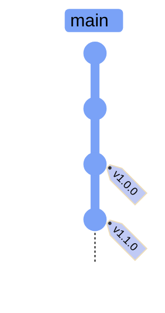
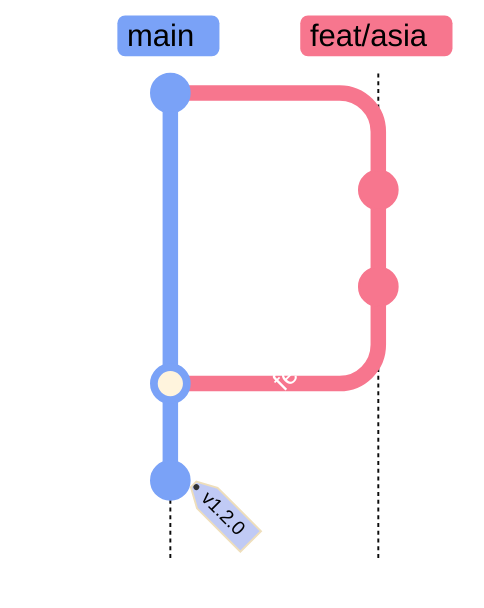

# Git Tagging and Releases

> [!quote]
> "I was tired of everyone using version numbers in whatever way they wanted and knew we could do better if everyone agreed on what each part of a version number meant."
>
> — **Tom Preston-Werner** (creator of Semantic Versioning, co-founder of GitHub)

Git tags are named pointers to specific commits, used to mark significant points in a repository's history — most commonly production releases. Unlike branches, tags do not move as new commits are added. A tag always points to the same commit. This note covers lightweight tags, annotated tags, pushing tags to GitHub, and the semantic versioning convention used to name them.

## Tag Types

Git provides two types of tags. Choosing the right type determines what metadata is stored with the tag and how it behaves in tools like `git describe` and GitHub Releases.

### git tag — lightweight vs annotated

A lightweight tag is simply a named pointer to a commit SHA with no additional metadata. An annotated tag is a full Git object containing the tagger's name, email, date, and a message. Both point to the same commit in the graph — the difference is what is stored alongside that pointer.

| Type | What it stores | When to use |
|------|---------------|-------------|
| **Lightweight** | A name pointing to a commit SHA — nothing more | Quick local markers, temporary references |
| **Annotated** | A full Git object with tagger name, email, date, and a message | Production releases — preferred |



*Figure: Tags are immutable pointers to specific commits. Unlike branches, they do not move as new commits are added. v1.0.0 and v1.1.0 permanently mark their respective commits.*

> [!tip] Use Annotated Tags for Releases
>
> Annotated tags are stored as full objects in the Git database with metadata. They can be signed with GPG, show up properly in `git describe`, and are the standard for marking software releases. Use lightweight tags only for temporary local bookmarks.

## Creating Tags

Tags are created locally and must be explicitly pushed to a remote. By default `git tag` creates a lightweight tag on `HEAD`; use `-a` for an annotated tag with stored metadata.

### git tag — create and manage tags

`git tag` creates a named reference pointing to a specific commit. The tag name, commit SHA, and optional metadata are stored in the Git object database. Tags are immutable by design — moving a tag after pushing it is a history-rewriting operation that should be avoided.

#### git tag v1.0.0 — create a lightweight tag on HEAD

Creates a lightweight tag: a name mapped to the current `HEAD` commit SHA, stored as a simple ref with no additional metadata. The `v` prefix and SemVer format are a community convention, not a Git requirement.

```bash
git tag v1.0.0
```

#### git tag -a v1.0.0 -m "message" — create an annotated tag

Creates an annotated tag, stored as a full Git object. The `-m` flag sets the message inline; without it, Git opens the default editor. Annotated tags record the tagger's identity and timestamp, making them traceable and GPG-signable.

```bash
git tag -a v1.0.0 -m "First production release"
```

#### git tag v0.9.0 abc1234 — tag a specific past commit

Tags can be applied retroactively to any commit SHA, not just `HEAD`. Use `git log --oneline` to locate the target commit before tagging.

```bash
git tag -a v0.9.0 -m "Beta release" abc1234
```

| Flag | Syntax | Description |
|------|--------|-------------|
| `-a` | `git tag -a <name>` | Create an annotated tag (full Git object with metadata) |
| `-m` | `git tag -a <name> -m "msg"` | Set tag message inline (skips editor) |
| `-s` | `git tag -s <name>` | Create a GPG-signed annotated tag |
| `-f` | `git tag -f <name>` | Force-move an existing tag to current HEAD (avoid on pushed tags) |
| `-d` | `git tag -d <name>` | Delete a local tag |
| `<commit>` | `git tag -a <name> <sha>` | Tag a specific past commit by SHA |

## Listing Tags

Tags are listed alphabetically by default. Use flags to filter by pattern or display annotation messages alongside names.

### git tag — list and inspect tags

`git tag` with no arguments prints all tag names. Use `-l` with a glob to filter by pattern, `-n` to show annotation messages, and `git show <tag>` to inspect full tag metadata including the tagger identity and date.

#### git tag — list all tags

Lists all tags in the repository in alphabetical order.

```bash
git tag
```

```text
v0.9.0
v1.0.0
v1.1.0
v1.2.0
```

#### git tag -n — show tag messages alongside names

Displays each tag name followed by the first line of its annotation message (or the tagged commit's message for lightweight tags).

```bash
git tag -n
```

```text
v0.9.0          Beta release
v1.0.0          First production release
v1.1.0          Add equity index rebalancing
v1.2.0          Add OHLCV fetcher for Asian markets; fix forward-fill bug
```

> [!info] Tags Are Local Until Pushed
>
> Tags created with `git tag` exist only in your local repository. They are **not** pushed automatically with `git push`. You must explicitly push them — see the Pushing Tags section below.

| Flag | Syntax | Description |
|------|--------|-------------|
| `-l` | `git tag -l "v1.*"` | Filter tags by glob pattern |
| `-n` | `git tag -n` | Show first line of tag annotation alongside name |
| `-n<N>` | `git tag -n5` | Show N lines of annotation per tag |
| `--sort` | `git tag --sort=-version:refname` | Sort by version in reverse order (latest first) |
| `--contains` | `git tag --contains <sha>` | List tags that point to or contain a specific commit |

## Pushing Tags

Tags are not included in a standard `git push`. You must push them explicitly, either individually by name or all at once with `--tags`. Prefer pushing by name to avoid accidentally publishing draft or test tags.

### git push — push tags to remote

Pushing a tag uploads the tag object (or pointer) to the remote. Once pushed to GitHub, the tag appears in the Releases tab and can trigger GitHub Actions workflows configured with a `v*` tag pattern.

#### git push origin v1.0.0 — push a single tag

Pushes one named tag to the remote. This is the preferred method for controlled release workflows — only the explicitly named tag is sent.

```bash
git push origin v1.0.0
```

```text
Enumerating objects: 1, done.
Counting objects: 100% (1/1), done.
Writing objects: 100% (1/1), 175 bytes | 175.00 KiB/s, done.
Total 1 (delta 0), reused 0 (delta 0), pack-reused 0
To https://github.com/org/repo.git
 * [new tag]         v1.0.0 -> v1.0.0
```

#### git push origin --tags — push all local tags

Pushes every local tag that does not yet exist on the remote in a single command.

```bash
git push origin --tags
```

```text
Enumerating objects: 3, done.
Counting objects: 100% (3/3), done.
Writing objects: 100% (3/3), 512 bytes | 512.00 KiB/s, done.
Total 3 (delta 0), reused 0 (delta 0), pack-reused 0
To https://github.com/org/repo.git
 * [new tag]         v1.0.0 -> v1.0.0
 * [new tag]         v1.1.0 -> v1.1.0
 * [new tag]         v1.2.0 -> v1.2.0
```

> [!warning] --tags Pushes All Tags Including Drafts
>
> `git push origin --tags` pushes every tag, including work-in-progress or test tags you may have created locally. For cleaner release workflows, push individual tags by name (`git push origin v1.0.0`) rather than using `--tags`.

> [!success] Push Tags by Name for Controlled Releases
>
> Use `git push origin v1.0.0` to push only the specific release tag. Delete local draft tags with `git tag -d v1.0.0-draft` before using `--tags` if you must push all at once.

| Flag | Syntax | Description |
|------|--------|-------------|
| `--tags` | `git push origin --tags` | Push all local tags not yet on the remote |
| `--follow-tags` | `git push --follow-tags` | Push commits and any reachable annotated tags (safer than `--tags`) |
| `--delete` | `git push origin --delete <tag>` | Delete a tag from the remote |

## Semantic Versioning

Git itself has no opinion on tag naming. The data engineering community convention is **semantic versioning (SemVer)**: `vMAJOR.MINOR.PATCH`.

| Part | Increment when... | Example |
|------|--------------------|---------|
| `MAJOR` | Breaking changes — existing pipelines or APIs stop working | `v1.0.0` → `v2.0.0` |
| `MINOR` | New features added in a backwards-compatible way | `v1.0.0` → `v1.1.0` |
| `PATCH` | Backwards-compatible bug fixes | `v1.0.0` → `v1.0.1` |

Pre-release versions use a hyphen suffix: `v1.0.0-beta.1`, `v1.0.0-rc.2`.

### Release Workflow

A complete release cycle: confirm `main` is up to date and all PRs are merged, create an annotated tag on `HEAD`, then push the tag to GitHub. After pushing, GitHub automatically creates a Release entry in the Releases tab, which you can enrich with release notes and attached binaries.



*Figure: Complete release workflow — feature branch merged via PR, then a bug fix committed directly. The v1.2.0 tag marks the release commit on main. Pushing this tag triggers CI/CD deployment.*

#### git checkout main — switch to the release branch

Ensure you are on `main` (or the designated release branch) before tagging. Tagging on a feature branch creates a tag that points into the wrong commit chain.

```bash
git checkout main
```

#### git pull — sync with remote before tagging

Pull the latest commits so the tag is applied to the correct, up-to-date `HEAD`. Tagging a stale local copy would miss commits merged by teammates.

```bash
git pull
```

#### git tag -a v1.2.0 -m "..." — create the release tag

Create an annotated tag on the current `HEAD` of `main`. Write a descriptive message summarizing what changed — it appears in `git tag -n` and GitHub Releases.

```bash
git tag -a v1.2.0 -m "Add OHLCV fetcher for Asian markets; fix forward-fill bug"
```

#### git push origin v1.2.0 — publish the release tag

Push the tag to the remote. GitHub automatically creates a Release entry in the Releases tab. Optionally edit the release on GitHub to add release notes, attach build artifacts, or mark it as a pre-release.

```bash
git push origin v1.2.0
```

## Deleting Tags

Tags should rarely be deleted once pushed. Deleting a published tag breaks reproducibility for anyone who deployed from it, and cannot be cleanly undone for collaborators who have already fetched it. If a release tag pointed to the wrong commit, create a new patch version instead.

### git tag -d / git push --delete — remove tags

`git tag -d` removes a tag from the local repository only. To also remove it from the remote, a separate `git push --delete` is required. Neither operation removes the underlying commit — only the named reference is deleted.

#### git tag -d v1.0.0-draft — delete a local tag

Removes the tag reference from the local repository. The tagged commit is not affected.

```bash
git tag -d v1.0.0-draft
```

```text
Deleted tag 'v1.0.0-draft' (was 3a4b5c6)
```

#### git push origin --delete v1.0.0-draft — delete a remote tag

Removes the tag from the remote. Collaborators who have already fetched the tag will retain it locally until they run `git fetch --prune --tags`.

```bash
git push origin --delete v1.0.0-draft
```

```text
To https://github.com/org/repo.git
 - [deleted]         v1.0.0-draft
```

> [!warning] Deleting Pushed Tags Affects Others
>
> If collaborators have already fetched a tag, deleting it from the remote does not remove it from their local repos. Coordinate with your team before deleting published tags.

> [!success] Announce Tag Deletion in Team Channel
>
> Before running `git push origin --delete <tag>`, post in your team's Slack channel with the tag name and reason. Teammates can then run `git fetch --prune --tags` to remove the stale reference from their local repos.

> [!danger] Moving a Tag Rewrites History
>
> Re-tagging an existing name (delete + recreate) changes what commit a version points to. Anyone who cached or deployed from the original tag is now running different code than the tag implies. If a release tag was wrong, create a new patch version (`v1.0.1`) instead of moving `v1.0.0`.

> [!success] Create a New Patch Version Instead
>
> Never delete and recreate an existing release tag. Instead, create `v1.0.1` (or the next appropriate patch) pointing to the corrected commit. This preserves the immutable release history and avoids confusion for anyone who already deployed from the original tag.

| Flag | Syntax | Description |
|------|--------|-------------|
| `-d` | `git tag -d <name>` | Delete a local tag |
| `--delete` | `git push origin --delete <name>` | Delete a tag from the remote |

## Integration with GitHub Actions

Tags are a common CI/CD trigger. When you push a tag matching a pattern like `v*`, a GitHub Actions workflow can automatically build, test, and deploy. See [github-actions-ci-cd](https://alp78.github.io/elysium/10-GitHub-Actions/github-actions-ci-cd) for workflow configuration.

Add the following trigger block to a workflow YAML file to fire the pipeline on any tag starting with `v` — covering `v1.0.0`, `v2.3.1`, and pre-release tags like `v1.0.0-rc.1`.

```yaml
on:
  push:
    tags:
      - 'v*'
```

## Quick Reference

| Goal | Command |
|------|---------|
| Create lightweight tag | `git tag v1.0.0` |
| Create annotated tag | `git tag -a v1.0.0 -m "Release message"` |
| Tag a past commit | `git tag -a v0.9.0 abc1234 -m "msg"` |
| List all tags | `git tag` |
| List tags with messages | `git tag -n` |
| Push one tag | `git push origin v1.0.0` |
| Push all tags | `git push origin --tags` |
| Delete local tag | `git tag -d v1.0.0` |
| Delete remote tag | `git push origin --delete v1.0.0` |
| Inspect a tag | `git show v1.0.0` |

## Related

- [git-daily-workflow](https://alp78.github.io/elysium/08-Git/git-daily-workflow) — the commit workflow that precedes tagging a release
- [git-history-and-inspection](https://alp78.github.io/elysium/08-Git/git-history-and-inspection) — `git show`, `git log` to find the commit to tag
- [pull-requests-and-code-review](https://alp78.github.io/elysium/08-Git/pull-requests-and-code-review) — merging the PR before tagging the release
- [github-actions-ci-cd](https://alp78.github.io/elysium/10-GitHub-Actions/github-actions-ci-cd) — triggering deployments automatically on tag push
